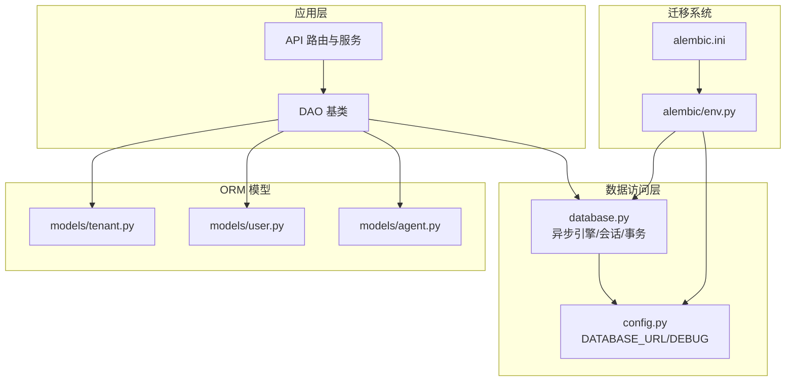
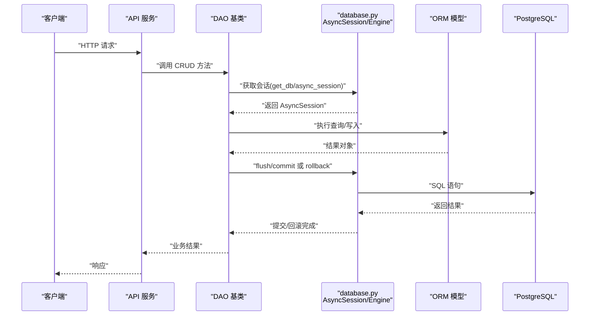
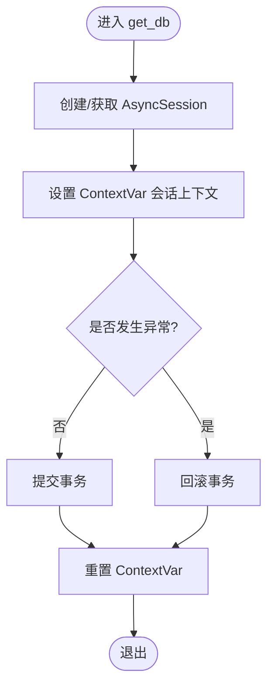
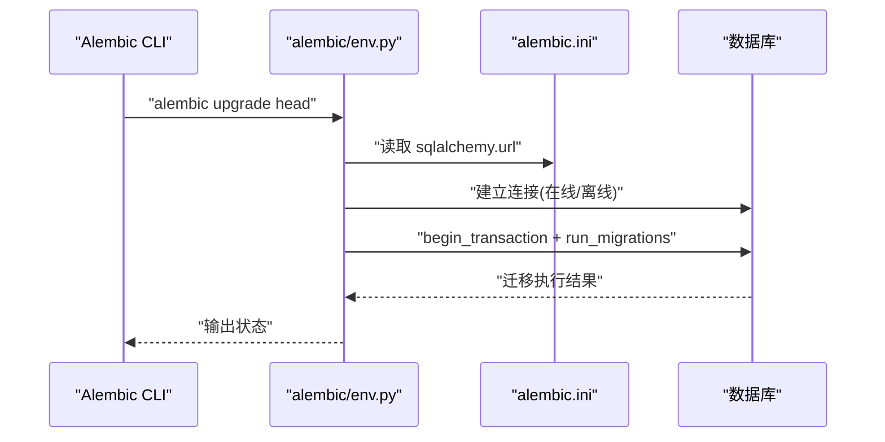
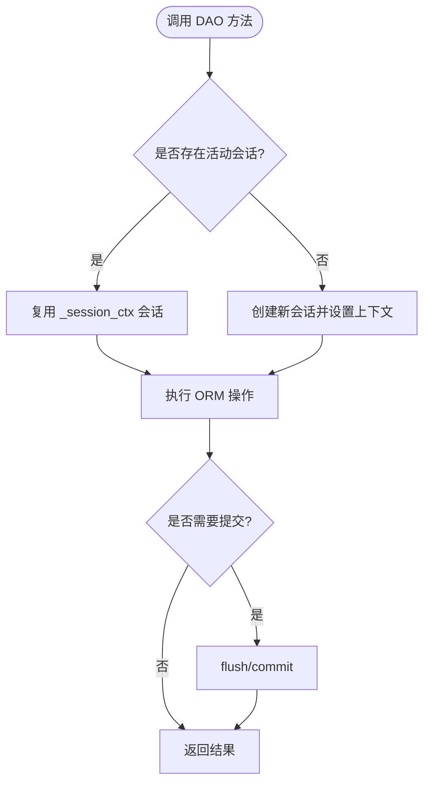
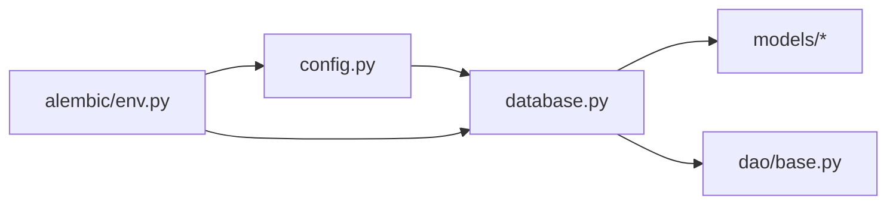

# 数据库管理

<cite>
**本文引用的文件**   
- [backend/app/database.py](file://backend/app/database.py)
- [backend/alembic/env.py](file://backend/alembic/env.py)
- [backend/alembic.ini](file://backend/alembic.ini)
- [backend/app/config.py](file://backend/app/config.py)
- [backend/app/dao/base.py](file://backend/app/dao/base.py)
- [backend/app/models/tenant.py](file://backend/app/models/tenant.py)
- [backend/app/models/user.py](file://backend/app/models/user.py)
- [backend/app/models/agent.py](file://backend/app/models/agent.py)
</cite>

## 目录
1. [简介](#简介)
2. [项目结构](#项目结构)
3. [核心组件](#核心组件)
4. [架构总览](#架构总览)
5. [详细组件分析](#详细组件分析)
6. [依赖关系分析](#依赖关系分析)
7. [性能考虑](#性能考虑)
8. [故障排查指南](#故障排查指南)
9. [结论](#结论)
10. [附录](#附录)

## 简介
本技术文档围绕 Clawith 的数据库管理系统展开，重点覆盖以下方面：
- SQLAlchemy 2.0 异步会话管理与连接池配置、会话生命周期与事务处理
- Alembic 迁移系统的使用：版本控制、迁移脚本生成与数据一致性保证
- 多租户数据隔离策略：基于 tenant_id 的行级权限控制与可扩展的 schema 隔离思路
- 数据库连接优化：连接池大小、超时配置与故障恢复机制
- 数据备份与恢复策略、索引优化建议与查询性能调优
- 数据库监控、慢查询分析与容量规划指导

## 项目结构
后端数据库相关代码主要分布在以下位置：
- 数据库引擎与会话管理：backend/app/database.py
- 应用配置（含 DATABASE_URL）：backend/app/config.py
- Alembic 环境与配置：backend/alembic/env.py、backend/alembic.ini
- DAO 基类（封装会话上下文与基础 CRUD）：backend/app/dao/base.py
- 模型定义（多租户边界与用户/代理等）：backend/app/models/*.py



**图表来源** 
- [backend/app/database.py:14-21](file://backend/app/database.py#L14-L21)
- [backend/app/config.py:89-91](file://backend/app/config.py#L89-L91)
- [backend/alembic/env.py:48-56](file://backend/alembic/env.py#L48-L56)
- [backend/alembic.ini:3-6](file://backend/alembic.ini#L3-L6)

**章节来源**
- [backend/app/database.py:14-21](file://backend/app/database.py#L14-L21)
- [backend/app/config.py:89-91](file://backend/app/config.py#L89-L91)
- [backend/alembic/env.py:48-56](file://backend/alembic/env.py#L48-L56)
- [backend/alembic.ini:3-6](file://backend/alembic.ini#L3-L6)

## 核心组件
- 异步引擎与会话工厂：通过 create_async_engine 创建引擎，使用 async_sessionmaker 构造 AsyncSession 工厂；设置 pool_size、max_overflow 与 echo。
- 依赖注入与会话生命周期：get_db 提供异步生成器，自动 commit/rollback，并通过 ContextVar 维护当前请求的会话上下文。
- 事务边界：transaction 上下文管理器支持嵌套事务语义，若未传入 session 则自动创建并管理生命周期。
- Alembic 环境：env.py 导入所有模型以注册 Base.metadata，使用 async_engine_from_config 运行在线迁移，offline 模式直接配置 URL。
- DAO 基类：BaseDAO 封装 session() 上下文管理器，复用 _session_ctx 获取或创建会话，统一 flush/commit/rollback。

**章节来源**
- [backend/app/database.py:14-21](file://backend/app/database.py#L14-L21)
- [backend/app/database.py:30-42](file://backend/app/database.py#L30-L42)
- [backend/app/database.py:47-79](file://backend/app/database.py#L47-L79)
- [backend/alembic/env.py:54-92](file://backend/alembic/env.py#L54-L92)
- [backend/app/dao/base.py:19-37](file://backend/app/dao/base.py#L19-L37)

## 架构总览
下图展示了从 API 到数据库的调用链路与关键组件交互：



**图表来源** 
- [backend/app/database.py:30-42](file://backend/app/database.py#L30-L42)
- [backend/app/dao/base.py:19-37](file://backend/app/dao/base.py#L19-L37)

## 详细组件分析

### SQLAlchemy 2.0 异步会话管理
- 引擎与连接池
  - 使用 create_async_engine 初始化引擎，设置 pool_size=20、max_overflow=10，便于在高并发下复用连接；echo=settings.DEBUG 用于调试 SQL。
  - 通过 async_sessionmaker 创建 AsyncSession 工厂，expire_on_commit=False 避免提交后属性失效导致的额外查询。
- 会话生命周期
  - get_db 作为 FastAPI 依赖注入，使用 async with 管理会话，成功时 commit，异常时 rollback，并通过 ContextVar 暴露给内部函数。
  - transaction 上下文管理器支持显式事务边界，若无外部 session 则自动创建并提交/回滚。
- 错误处理
  - 统一的 try/except 捕获异常并回滚，确保数据一致性。



**图表来源** 
- [backend/app/database.py:30-42](file://backend/app/database.py#L30-L42)
- [backend/app/database.py:47-79](file://backend/app/database.py#L47-L79)

**章节来源**
- [backend/app/database.py:14-21](file://backend/app/database.py#L14-L21)
- [backend/app/database.py:30-42](file://backend/app/database.py#L30-L42)
- [backend/app/database.py:47-79](file://backend/app/database.py#L47-L79)

### Alembic 迁移系统
- 环境配置
  - env.py 导入全部模型以注册 Base.metadata，读取 settings.DATABASE_URL 并设置 sqlalchemy.url。
  - 在线模式使用 async_engine_from_config 与 NullPool 建立临时连接，run_sync 执行 do_run_migrations。
  - offline 模式直接配置 URL 并运行迁移。
- alembic.ini
  - 指定 script_location、日志级别与默认数据库连接字符串（可被环境变量覆盖）。
- 版本控制与一致性
  - 每个迁移文件包含 revision 与 down_revision，确保迁移顺序与可逆性。
  - 在迁移中创建/删除索引、添加列、填充默认值，保障数据结构演进的一致性。



**图表来源** 
- [backend/alembic/env.py:54-92](file://backend/alembic/env.py#L54-L92)
- [backend/alembic.ini:3-6](file://backend/alembic.ini#L3-L6)

**章节来源**
- [backend/alembic/env.py:48-92](file://backend/alembic/env.py#L48-L92)
- [backend/alembic.ini:3-6](file://backend/alembic.ini#L3-L6)

### 多租户数据隔离策略
- 行级权限控制（推荐）
  - 所有业务表普遍包含 tenant_id 字段，通过 WHERE tenant_id = :tenant_id 实现行级隔离。
  - 示例：User.tenant_id、Agent.tenant_id、Tenant.id 等。
- Schema 隔离（可选扩展）
  - 对于强隔离需求，可为每个租户创建独立 schema，并在连接字符串或会话层切换 search_path。
  - 结合数据库角色与权限，限制跨 schema 访问。
- 权限模型
  - AgentPermission 支持按公司/部门/用户维度授权，配合 tenant_id 实现细粒度控制。

```mermaid
classDiagram
class Tenant {
+uuid id
+string name
+string slug
+boolean is_active
}
class User {
+uuid id
+uuid identity_id
+uuid tenant_id
+string role
}
class Agent {
+uuid id
+uuid creator_id
+uuid tenant_id
+string access_mode
}
class AgentPermission {
+uuid id
+uuid agent_id
+string scope_type
+uuid scope_id
+string access_level
}
Tenant ||--o{ User : "拥有"
Tenant ||--o{ Agent : "拥有"
Agent ||--o{ AgentPermission : "权限"
```

**图表来源** 
- [backend/app/models/tenant.py:13-28](file://backend/app/models/tenant.py#L13-L28)
- [backend/app/models/user.py:52-89](file://backend/app/models/user.py#L52-L89)
- [backend/app/models/agent.py:19-44](file://backend/app/models/agent.py#L19-L44)
- [backend/app/models/agent.py:162-179](file://backend/app/models/agent.py#L162-L179)

**章节来源**
- [backend/app/models/tenant.py:13-28](file://backend/app/models/tenant.py#L13-L28)
- [backend/app/models/user.py:52-89](file://backend/app/models/user.py#L52-L89)
- [backend/app/models/agent.py:19-44](file://backend/app/models/agent.py#L19-L44)
- [backend/app/models/agent.py:162-179](file://backend/app/models/agent.py#L162-L179)

### DAO 基类与会话复用
- BaseDAO.session() 优先使用 _session_ctx 中的活动会话，否则创建新会话并设置上下文。
- 统一封装 get/get_all/create/update/delete 等方法，简化重复逻辑。
- 对测试友好：当底层 db 不支持 get/delete 时，回退到 select 语句。



**图表来源** 
- [backend/app/dao/base.py:19-37](file://backend/app/dao/base.py#L19-L37)
- [backend/app/dao/base.py:39-94](file://backend/app/dao/base.py#L39-L94)

**章节来源**
- [backend/app/dao/base.py:19-37](file://backend/app/dao/base.py#L19-L37)
- [backend/app/dao/base.py:39-94](file://backend/app/dao/base.py#L39-L94)

## 依赖关系分析
- database.py 依赖 config.py 的 DATABASE_URL 与 DEBUG。
- alembic/env.py 依赖 config.py 的 DATABASE_URL 与 database.py 的 Base.metadata。
- models/* 依赖 database.py 的 Base。
- dao/base.py 依赖 database.py 的 _session_ctx 与 async_session。



**图表来源** 
- [backend/app/config.py:89-91](file://backend/app/config.py#L89-L91)
- [backend/app/database.py:14-21](file://backend/app/database.py#L14-L21)
- [backend/alembic/env.py:48-56](file://backend/alembic/env.py#L48-L56)

**章节来源**
- [backend/app/config.py:89-91](file://backend/app/config.py#L89-L91)
- [backend/app/database.py:14-21](file://backend/app/database.py#L14-L21)
- [backend/alembic/env.py:48-56](file://backend/alembic/env.py#L48-L56)

## 性能考虑
- 连接池配置
  - pool_size=20、max_overflow=10 适用于中等并发场景；高并发需根据 CPU 核数与数据库最大连接数调整。
  - 可通过环境变量 DATABASE_URL 动态切换不同环境的连接参数。
- 超时与重试
  - 建议在驱动层（如 asyncpg）配置 connect_timeout、statement_timeout，并结合应用层重试策略。
  - 长事务应避免，尽量缩短事务范围，减少锁竞争。
- 索引优化
  - 为高频查询条件（如 tenant_id、created_at、deleted_at IS NULL）建立复合索引。
  - 使用 EXPLAIN ANALYZE 分析慢查询，关注 Seq Scan、Nested Loop 与高代价算子。
- 查询调优
  - 分页查询使用 limit/offset 或基于游标的分页。
  - 避免 N+1 查询，使用 joinedload/selectinload 预加载关联。
- 监控与容量规划
  - 启用 PostgreSQL 慢查询日志（log_min_duration_statement），定期采集 pg_stat_statements。
  - 监控连接数、缓存命中率、磁盘 I/O 与 WAL 增长，评估扩容阈值。

[本节为通用指导，不直接分析具体文件]

## 故障排查指南
- 常见问题
  - 连接池耗尽：检查 pool_size/max_overflow 与并发量，确认是否有长事务或未释放连接。
  - 会话未提交/回滚：检查 get_db 与 transaction 的异常分支，确保 finally 路径正确重置 ContextVar。
  - 迁移失败：核对 alembic.ini 的 sqlalchemy.url 与 env.py 的 target_metadata 是否正确导入模型。
- 诊断步骤
  - 开启 echo=True 打印 SQL，定位慢查询与异常语句。
  - 查看数据库连接数与锁等待，识别阻塞源。
  - 使用 alembic history/heads 检查迁移链完整性。

**章节来源**
- [backend/app/database.py:30-42](file://backend/app/database.py#L30-L42)
- [backend/app/database.py:47-79](file://backend/app/database.py#L47-L79)
- [backend/alembic/env.py:54-92](file://backend/alembic/env.py#L54-L92)
- [backend/alembic.ini:3-6](file://backend/alembic.ini#L3-L6)

## 结论
Clawith 的数据库层采用 SQLAlchemy 2.0 异步会话与 Alembic 迁移体系，具备清晰的连接池配置、会话生命周期管理与事务边界控制。多租户通过 tenant_id 行级隔离实现，可扩展至 schema 隔离。性能方面建议持续优化索引与查询计划，完善监控与容量规划，确保系统在多租户环境下稳定高效运行。

[本节为总结性内容，不直接分析具体文件]

## 附录
- 数据备份与恢复策略
  - 使用 pg_dump/pg_restore 进行逻辑备份与恢复，结合 cron 定时任务自动化。
  - 针对大表与热数据，可采用分区表与冷热分离策略。
- 慢查询分析
  - 启用 log_min_duration_statement，收集慢查询样本，结合 EXPLAIN ANALYZE 优化。
- 容量规划
  - 依据 QPS、数据增长率与存储成本，制定分库分表或读写分离方案。

[本节为通用指导，不直接分析具体文件]