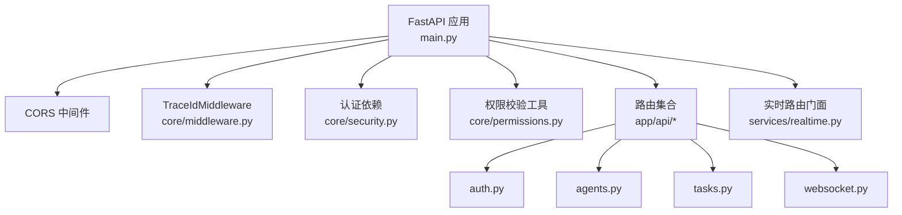
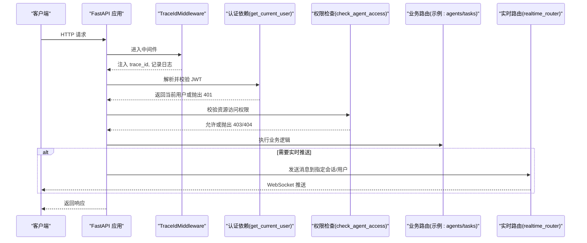
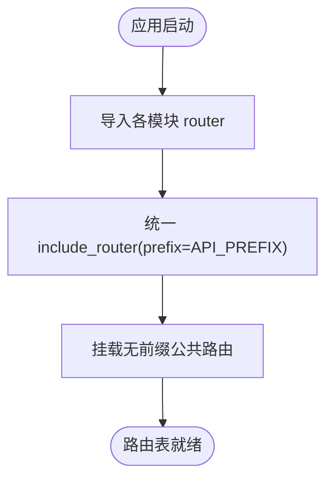
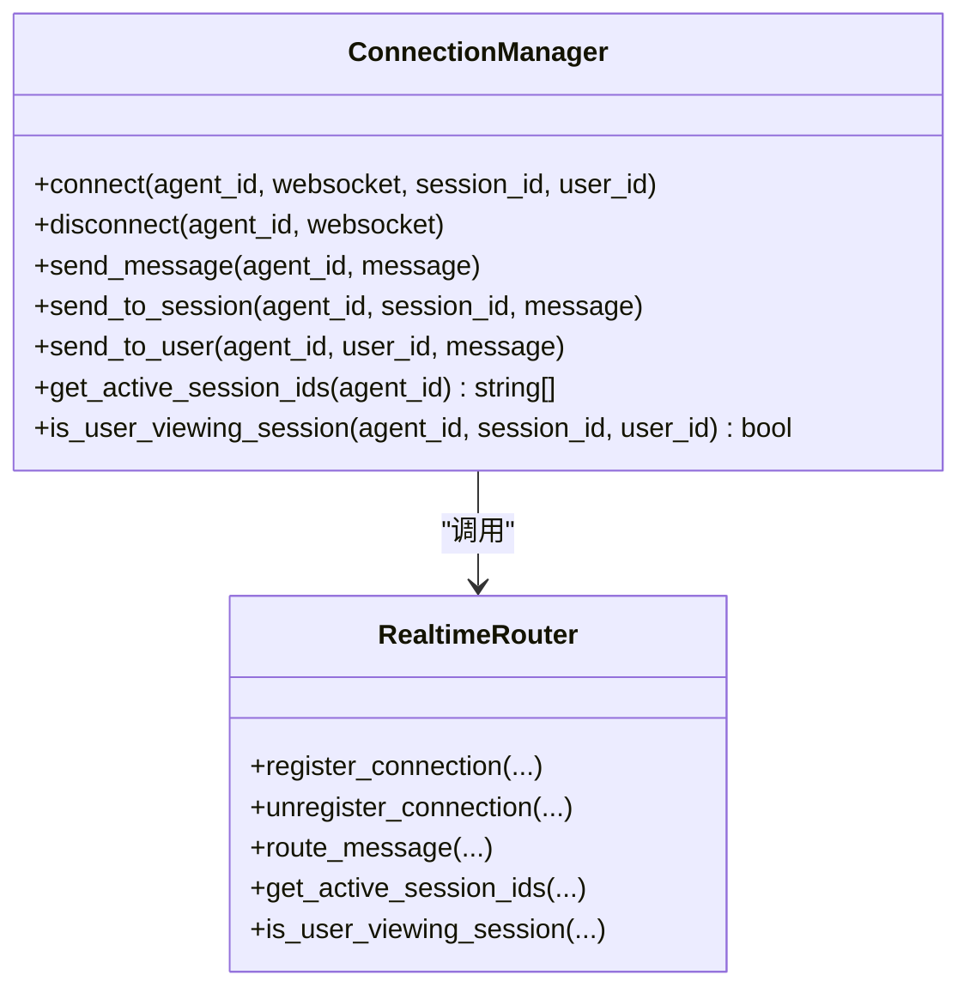
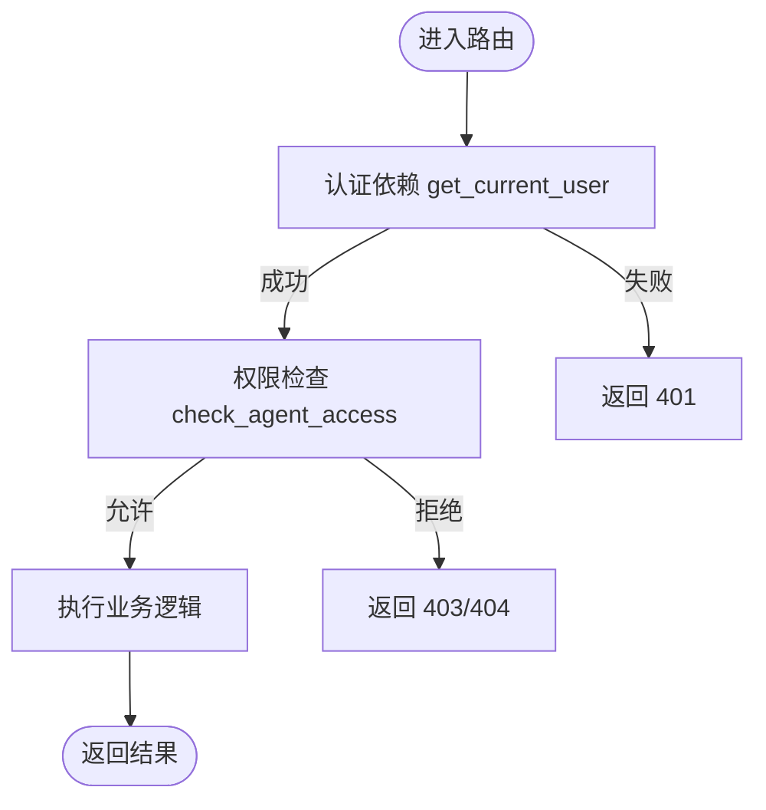
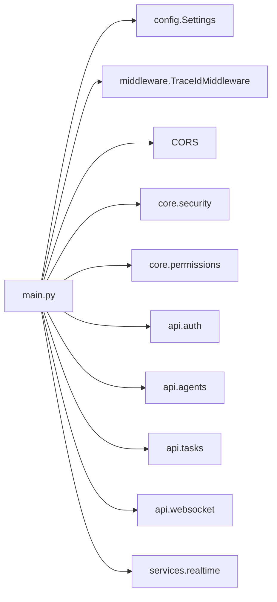

# 路由注册机制

<cite>
**本文引用的文件**   
- [backend/app/main.py](file://backend/app/main.py)
- [backend/app/config.py](file://backend/app/config.py)
- [backend/app/core/middleware.py](file://backend/app/core/middleware.py)
- [backend/app/core/permissions.py](file://backend/app/core/permissions.py)
- [backend/app/core/security.py](file://backend/app/core/security.py)
- [backend/app/api/auth.py](file://backend/app/api/auth.py)
- [backend/app/api/agents.py](file://backend/app/api/agents.py)
- [backend/app/api/tasks.py](file://backend/app/api/tasks.py)
- [backend/app/api/websocket.py](file://backend/app/api/websocket.py)
- [backend/app/services/realtime.py](file://backend/app/services/realtime.py)
</cite>

## 目录
1. [简介](#简介)
2. [项目结构](#项目结构)
3. [核心组件](#核心组件)
4. [架构总览](#架构总览)
5. [详细组件分析](#详细组件分析)
6. [依赖关系分析](#依赖关系分析)
7. [性能考量](#性能考量)
8. [故障排查指南](#故障排查指南)
9. [结论](#结论)
10. [附录](#附录)

## 简介
本技术文档聚焦于 Clawith 后端基于 FastAPI 的路由注册机制，系统性阐述：
- 路由模块化设计与导入机制
- API 前缀管理与版本控制、路径命名规范
- 路由装饰器使用模式（参数验证、响应模型、标签分组）
- WebSocket 路由的特殊处理（连接管理、消息路由）
- 中间件集成、权限控制与请求拦截
- 自定义路由扩展、插件化注册与动态发现的最佳实践

## 项目结构
Clawith 后端采用按功能域划分的模块组织方式，路由集中在 backend/app/api 下，每个领域一个 router；应用入口在 main.py 中统一装配。配置集中通过 Settings 提供全局常量（如 API_PREFIX）。中间件与安全能力位于 core 包，实时通信能力通过 services.realtime 暴露。

图表来源 
- [backend/app/main.py:352-470](file://backend/app/main.py#L352-L470)
- [backend/app/core/middleware.py:12-53](file://backend/app/core/middleware.py#L12-L53)
- [backend/app/core/security.py:153-200](file://backend/app/core/security.py#L153-L200)
- [backend/app/core/permissions.py:481-518](file://backend/app/core/permissions.py#L481-L518)
- [backend/app/api/auth.py:43](file://backend/app/api/auth.py#L43)
- [backend/app/api/agents.py:39](file://backend/app/api/agents.py#L39)
- [backend/app/api/tasks.py:16](file://backend/app/api/tasks.py#L16)
- [backend/app/api/websocket.py:57](file://backend/app/api/websocket.py#L57)
- [backend/app/services/realtime.py:1-20](file://backend/app/services/realtime.py#L1-L20)

章节来源
- [backend/app/main.py:352-470](file://backend/app/main.py#L352-L470)
- [backend/app/config.py:79-120](file://backend/app/config.py#L79-L120)

## 核心组件
- 应用启动与生命周期：lifespan 钩子负责日志、数据库初始化、后台任务、WebSocket 订阅等。
- 中间件：TraceIdMiddleware 注入追踪 ID、记录请求耗时；CORS 跨域策略。
- 安全与鉴权：HTTPBearer + JWT 解码 + 用户加载；管理员角色依赖。
- 权限控制：RBAC 工具函数用于 Agent 访问控制、可见性判断。
- 路由装配：统一从 app.api.* 导入各 router，并通过 settings.API_PREFIX 挂载。
- 实时通信：realtime_router 作为门面，封装 Pub/Sub、连接管理与消息路由。

章节来源
- [backend/app/main.py:121-350](file://backend/app/main.py#L121-L350)
- [backend/app/core/middleware.py:12-53](file://backend/app/core/middleware.py#L12-L53)
- [backend/app/core/security.py:128-200](file://backend/app/core/security.py#L128-L200)
- [backend/app/core/permissions.py:481-518](file://backend/app/core/permissions.py#L481-L518)
- [backend/app/services/realtime.py:1-20](file://backend/app/services/realtime.py#L1-L20)

## 架构总览
下图展示了请求进入后的关键路径：中间件 → 认证依赖 → 权限检查 → 业务路由 → 实时推送（如适用）。

图表来源 
- [backend/app/core/middleware.py:12-53](file://backend/app/core/middleware.py#L12-L53)
- [backend/app/core/security.py:153-200](file://backend/app/core/security.py#L153-L200)
- [backend/app/core/permissions.py:481-518](file://backend/app/core/permissions.py#L481-L518)
- [backend/app/api/websocket.py:76-162](file://backend/app/api/websocket.py#L76-L162)
- [backend/app/services/realtime.py:1-20](file://backend/app/services/realtime.py#L1-L20)

## 详细组件分析

### 路由模块化与装配
- 模块化设计：每个功能域定义独立的 APIRouter，并在模块内声明 prefix 与 tags。
- 统一装配：main.py 集中导入所有 router，并通过 include_router 挂载，统一使用 settings.API_PREFIX。
- 前缀策略：除明确说明的公共端点（如 webhooks、pages_public），其余均走 /api 前缀。
- 版本控制：当前未启用 URL 级版本前缀，建议通过网关或反向代理实现版本隔离，或在路由层以独立 router 区分 v1/v2。

图表来源 
- [backend/app/main.py:374-470](file://backend/app/main.py#L374-L470)
- [backend/app/config.py:87](file://backend/app/config.py#L87)
- [backend/app/api/auth.py:43](file://backend/app/api/auth.py#L43)
- [backend/app/api/agents.py:39](file://backend/app/api/agents.py#L39)
- [backend/app/api/tasks.py:16](file://backend/app/api/tasks.py#L16)

章节来源
- [backend/app/main.py:374-470](file://backend/app/main.py#L374-L470)
- [backend/app/config.py:79-120](file://backend/app/config.py#L79-L120)
- [backend/app/api/auth.py:43](file://backend/app/api/auth.py#L43)
- [backend/app/api/agents.py:39](file://backend/app/api/agents.py#L39)
- [backend/app/api/tasks.py:16](file://backend/app/api/tasks.py#L16)

### API 前缀管理与路径命名规范
- 前缀来源：settings.API_PREFIX 默认 "/api"，所有受保护接口统一归口。
- 命名规范：router.prefix 使用小写、短横线分隔的资源名（如 /agents、/auth）；路径段保持语义清晰。
- 版本演进：建议在网关层做版本路由（如 /v1/...、/v2/...），或在应用层拆分独立 router 并分别挂载。

章节来源
- [backend/app/config.py:87](file://backend/app/config.py#L87)
- [backend/app/main.py:422-470](file://backend/app/main.py#L422-L470)

### 路由装饰器使用模式
- 参数验证：通过 Pydantic 模型作为请求体参数，自动完成类型校验与序列化。
- 响应模型：response_model 指定输出结构，确保契约稳定。
- 标签分组：tags 用于 OpenAPI 分组展示，便于文档检索。
- 依赖注入：Depends(get_current_user)、Depends(get_db) 等实现横切关注点解耦。

章节来源
- [backend/app/api/auth.py:114-200](file://backend/app/api/auth.py#L114-L200)
- [backend/app/api/agents.py:142-168](file://backend/app/api/agents.py#L142-L168)
- [backend/app/api/tasks.py:30-108](file://backend/app/api/tasks.py#L30-L108)
- [backend/app/core/security.py:153-200](file://backend/app/core/security.py#L153-L200)

### WebSocket 路由与实时通信
- 连接管理：ConnectionManager 维护 agent_id -> 连接列表，支持按 session_id 或 user_id 定向推送。
- 消息路由：通过 realtime_router.route_message 将消息分发到本地连接或跨进程通道。
- 生命周期：应用启动时启动订阅器，关闭时清理连接。
- 错误处理：捕获异常避免单连接失败影响整体。

图表来源 
- [backend/app/api/websocket.py:76-162](file://backend/app/api/websocket.py#L76-L162)
- [backend/app/services/realtime.py:1-20](file://backend/app/services/realtime.py#L1-L20)

章节来源
- [backend/app/api/websocket.py:57-162](file://backend/app/api/websocket.py#L57-L162)
- [backend/app/services/realtime.py:1-20](file://backend/app/services/realtime.py#L1-L20)

### 中间件集成与请求拦截
- TraceIdMiddleware：为每个请求生成/复用 trace_id，写入 request.state 和响应头，记录入出栈日志。
- CORS：根据配置设置允许的源、方法、头部与凭据策略。
- 扩展点：可在中间件层统一做限流、审计、灰度开关等拦截逻辑。

章节来源
- [backend/app/core/middleware.py:12-53](file://backend/app/core/middleware.py#L12-L53)
- [backend/app/main.py:359-371](file://backend/app/main.py#L359-L371)

### 权限控制与请求拦截
- 认证依赖：get_current_user 解析 JWT 并加载活跃用户；get_authenticated_user 允许非活跃用户。
- 权限工具：check_agent_access 校验租户隔离、创建者与管理权限，返回访问级别。
- 常见用法：在路由中先调用 check_agent_access 再执行具体逻辑，保证最小权限原则。

图表来源 
- [backend/app/core/security.py:153-200](file://backend/app/core/security.py#L153-L200)
- [backend/app/core/permissions.py:481-518](file://backend/app/core/permissions.py#L481-L518)
- [backend/app/api/tasks.py:30-108](file://backend/app/api/tasks.py#L30-L108)

章节来源
- [backend/app/core/security.py:153-200](file://backend/app/core/security.py#L153-L200)
- [backend/app/core/permissions.py:481-518](file://backend/app/core/permissions.py#L481-L518)
- [backend/app/api/tasks.py:30-108](file://backend/app/api/tasks.py#L30-L108)

### 最佳实践：自定义路由扩展、插件化注册与动态发现
- 自定义路由扩展：
  - 新建 api 模块，定义 APIRouter(prefix=..., tags=...)，遵循命名规范。
  - 在 main.py 中导入并 include_router，统一使用 API_PREFIX。
- 插件化注册：
  - 可通过约定式扫描 app.api.plugins 下的模块，动态 import 并收集 router。
  - 结合环境变量开关控制插件启用，避免冷启动开销。
- 动态路由发现：
  - 使用 importlib 扫描包，按模块名映射路由前缀，支持热插拔。
  - 对第三方插件提供标准接口（如 register_routes(app)），降低耦合。

[本节为通用指导，不直接分析具体文件]

## 依赖关系分析
- main.py 依赖：
  - 配置：Settings(API_PREFIX、CORS_ORIGINS 等)
  - 中间件：TraceIdMiddleware、CORS
  - 安全与权限：security、permissions
  - 路由：app.api.* 下的所有 router
  - 实时：services.realtime
- 路由模块依赖：
  - auth.py：security、schemas、DAO
  - agents.py：permissions、security、models、schemas
  - tasks.py：permissions、security、models、schemas
  - websocket.py：realtime、permissions、security、models、schemas

图表来源 
- [backend/app/main.py:352-470](file://backend/app/main.py#L352-L470)
- [backend/app/config.py:79-120](file://backend/app/config.py#L79-L120)
- [backend/app/core/middleware.py:12-53](file://backend/app/core/middleware.py#L12-L53)
- [backend/app/core/security.py:153-200](file://backend/app/core/security.py#L153-L200)
- [backend/app/core/permissions.py:481-518](file://backend/app/core/permissions.py#L481-L518)
- [backend/app/api/auth.py:43](file://backend/app/api/auth.py#L43)
- [backend/app/api/agents.py:39](file://backend/app/api/agents.py#L39)
- [backend/app/api/tasks.py:16](file://backend/app/api/tasks.py#L16)
- [backend/app/api/websocket.py:57](file://backend/app/api/websocket.py#L57)
- [backend/app/services/realtime.py:1-20](file://backend/app/services/realtime.py#L1-L20)

章节来源
- [backend/app/main.py:352-470](file://backend/app/main.py#L352-L470)
- [backend/app/config.py:79-120](file://backend/app/config.py#L79-L120)

## 性能考量
- 中间件开销：TraceIdMiddleware 仅轻量日志与头部操作，影响可控。
- 认证成本：JWT 解码为 CPU 密集，已使用线程池避免阻塞事件循环。
- 数据库查询：权限检查与用户加载使用异步 SQLAlchemy，注意 N+1 问题，批量加载关联数据。
- WebSocket：连接管理内存占用与消息广播需考虑并发与过滤条件，避免全量广播。

[本节为通用指导，不直接分析具体文件]

## 故障排查指南
- 常见问题定位：
  - 401 未授权：检查 JWT 是否有效、过期、密钥是否正确。
  - 403 禁止访问：确认租户隔离、Agent 访问模式与权限记录。
  - 路由未生效：核对 include_router 顺序与前缀，确认模块已导入。
  - WebSocket 推送失败：检查连接是否在 manager 中、session/user 过滤条件。
- 日志与追踪：
  - 使用 X-Trace-Id 贯穿请求链路，结合中间件日志快速定位。
  - 关注 lifespan 启动日志，确认后台任务与订阅器状态。

章节来源
- [backend/app/core/middleware.py:12-53](file://backend/app/core/middleware.py#L12-L53)
- [backend/app/core/security.py:128-200](file://backend/app/core/security.py#L128-L200)
- [backend/app/core/permissions.py:481-518](file://backend/app/core/permissions.py#L481-L518)
- [backend/app/api/websocket.py:76-162](file://backend/app/api/websocket.py#L76-L162)

## 结论
Clawith 的路由注册机制以 FastAPI 为核心，通过模块化 router、统一前缀与中间件/依赖注入，实现了高内聚、低耦合的可扩展架构。权限与认证解耦，实时通信通过门面抽象，便于横向扩展与维护。建议在生产环境中引入网关级版本控制与插件化路由发现，进一步提升可运维性与灵活性。

[本节为总结，不直接分析具体文件]

## 附录
- 路径命名建议：小写、短横线分隔，资源名词复数形式（如 /agents、/tasks）。
- 标签分组建议：按业务域划分 tags，便于 OpenAPI 文档检索。
- 版本控制建议：优先在网关层实现，应用层保持向后兼容。
- 插件化建议：约定式扫描 + 环境变量开关，避免冷启动负担。

[本节为通用指导，不直接分析具体文件]