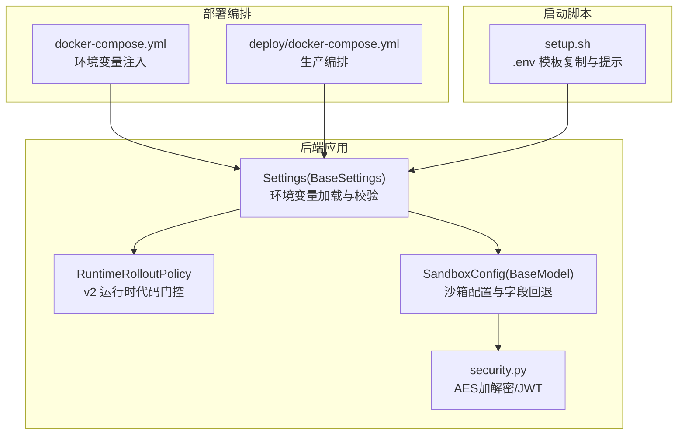
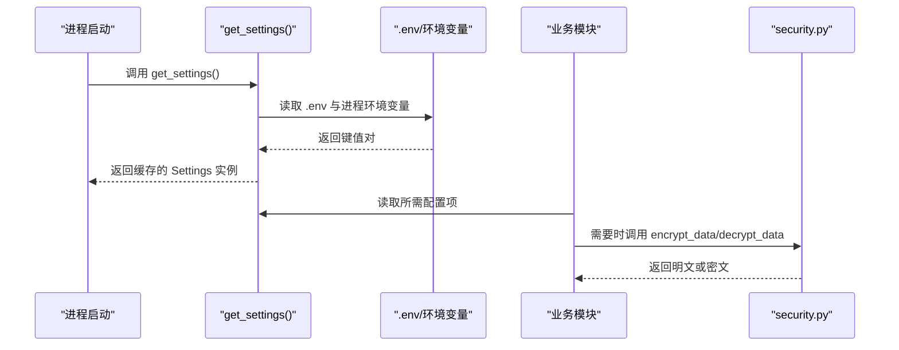
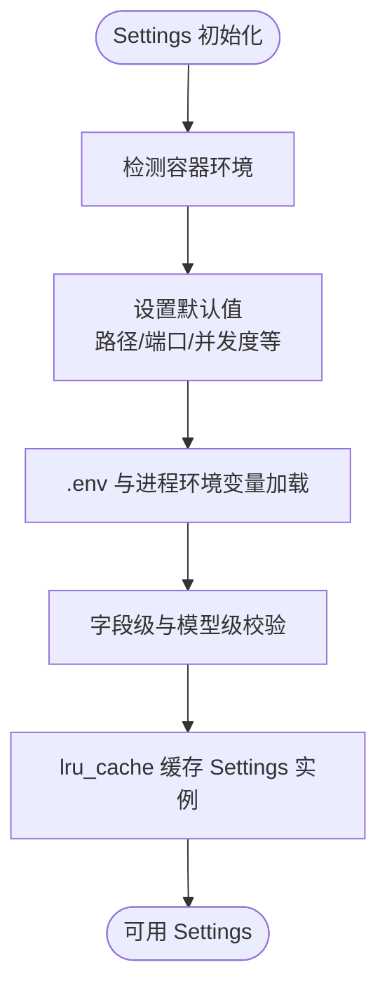
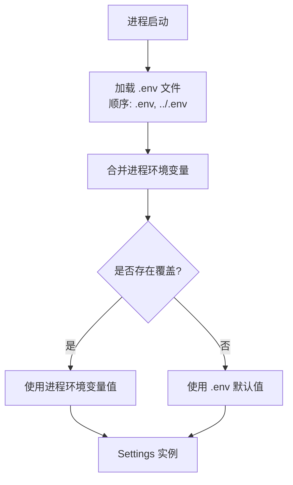
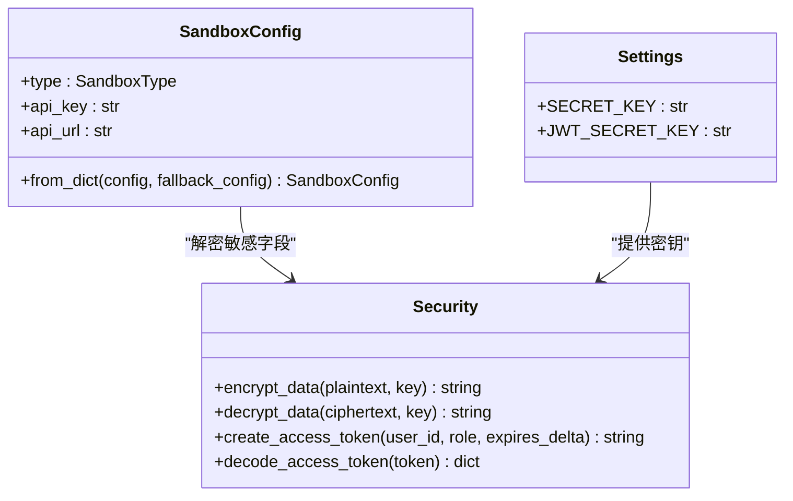
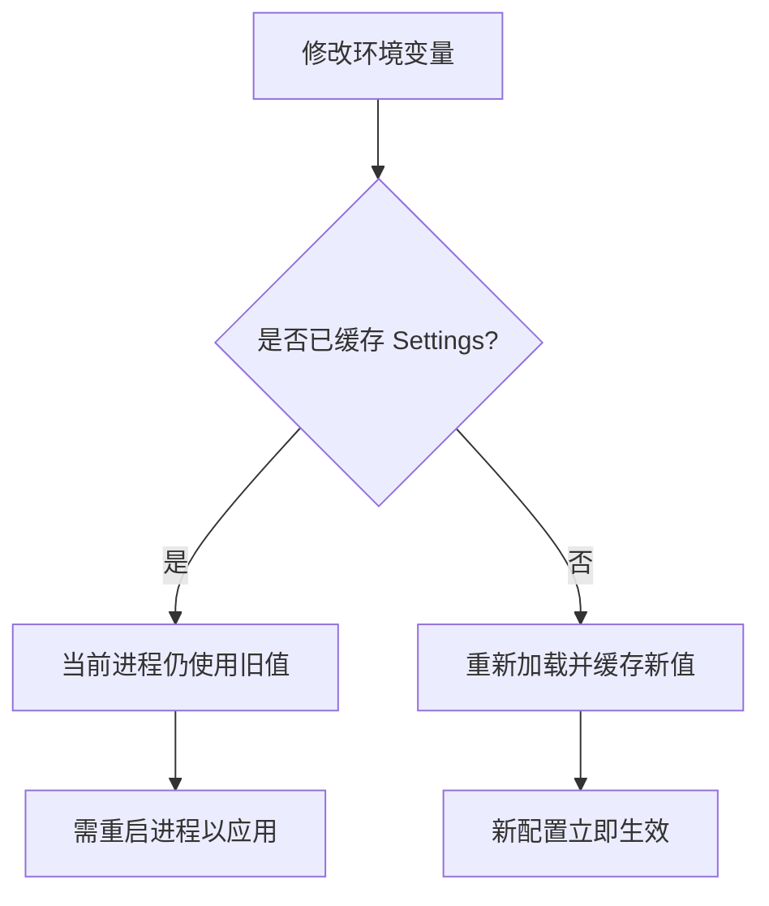
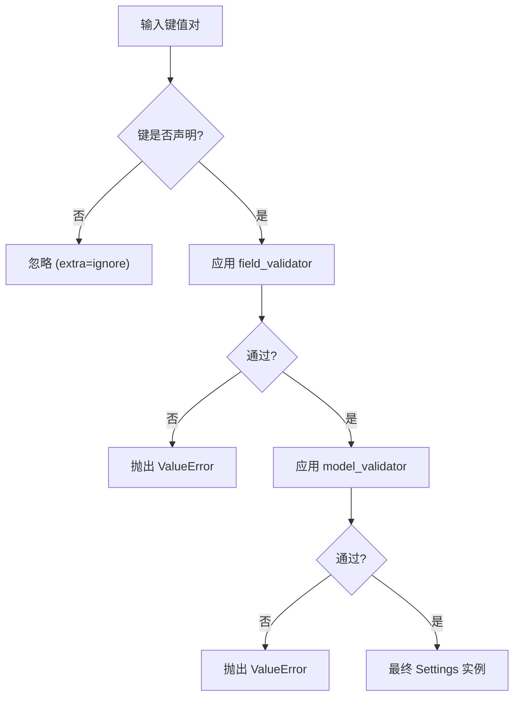
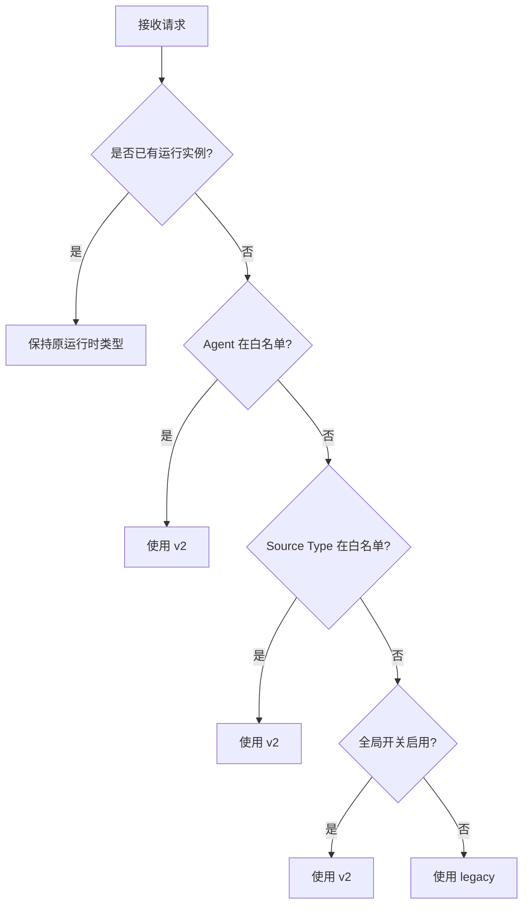
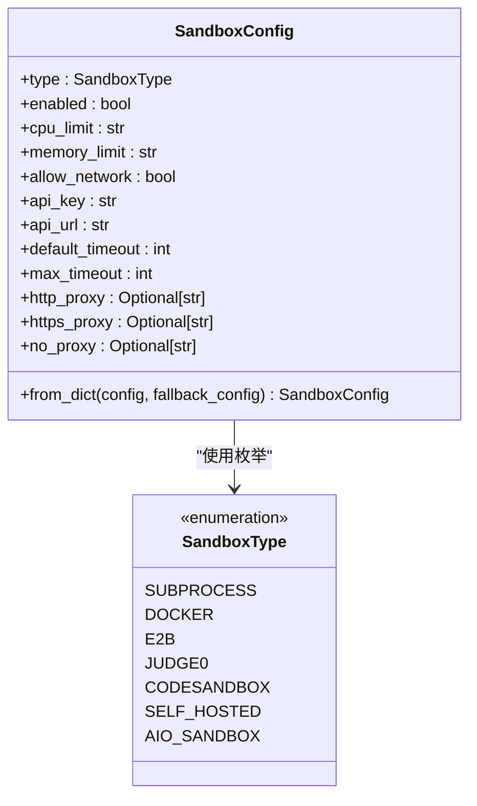
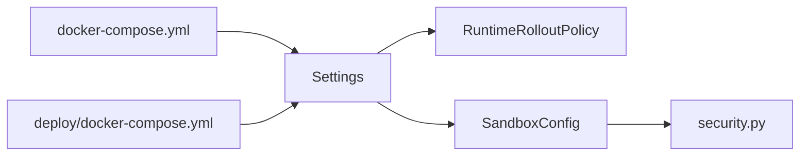

# 配置系统

<cite>
**本文引用的文件**   
- [backend/app/config.py](file://backend/app/config.py)
- [backend/app/services/agent_runtime/config.py](file://backend/app/services/agent_runtime/config.py)
- [backend/app/services/sandbox/config.py](file://backend/app/services/sandbox/config.py)
- [backend/app/core/security.py](file://backend/app/core/security.py)
- [docker-compose.yml](file://docker-compose.yml)
- [deploy/docker-compose.yml](file://deploy/docker-compose.yml)
- [setup.sh](file://setup.sh)
</cite>

## 目录
1. [简介](#简介)
2. [项目结构](#项目结构)
3. [核心组件](#核心组件)
4. [架构总览](#架构总览)
5. [详细组件分析](#详细组件分析)
6. [依赖关系分析](#依赖关系分析)
7. [性能考虑](#性能考虑)
8. [故障排查指南](#故障排查指南)
9. [结论](#结论)
10. [附录](#附录)

## 简介
本技术文档聚焦于 Clawith 的配置系统，围绕 Pydantic Settings 模型的设计与实现展开，涵盖环境变量映射、类型验证与默认值管理；多环境差异化配置（开发、测试、生产）；敏感信息管理（密钥加密、环境变量注入与安全最佳实践）；运行时配置热重载机制与变更影响范围；配置文件优先级、覆盖规则与验证规则定义；并提供配置模板、环境变量清单与部署配置示例。

## 项目结构
Clawith 后端采用基于 FastAPI 的应用组织方式，配置集中在应用层，并通过 Pydantic Settings 统一加载与校验。关键路径如下：
- 应用级 Settings 模型与环境变量加载：backend/app/config.py
- Agent 运行时策略与开关解析：backend/app/services/agent_runtime/config.py
- 沙箱后端配置与字段级回退/解密：backend/app/services/sandbox/config.py
- 安全工具（AES 加解密、JWT）：backend/app/core/security.py
- Docker Compose 环境与变量注入：docker-compose.yml、deploy/docker-compose.yml
- 初始化脚本与环境模板生成：setup.sh

**图表来源** 
- [backend/app/config.py:79-247](file://backend/app/config.py#L79-L247)
- [backend/app/services/agent_runtime/config.py:80-147](file://backend/app/services/agent_runtime/config.py#L80-L147)
- [backend/app/services/sandbox/config.py:21-126](file://backend/app/services/sandbox/config.py#L21-L126)
- [backend/app/core/security.py:54-123](file://backend/app/core/security.py#L54-L123)
- [docker-compose.yml:32-69](file://docker-compose.yml#L32-L69)
- [deploy/docker-compose.yml:32-65](file://deploy/docker-compose.yml#L32-L65)
- [setup.sh:66-74](file://setup.sh#L66-L74)

**章节来源**
- [backend/app/config.py:79-247](file://backend/app/config.py#L79-L247)
- [docker-compose.yml:32-69](file://docker-compose.yml#L32-L69)
- [deploy/docker-compose.yml:32-65](file://deploy/docker-compose.yml#L32-L65)
- [setup.sh:66-74](file://setup.sh#L66-L74)

## 核心组件
- Settings(BaseSettings)：集中定义所有应用级配置项，提供默认值、类型约束、字段级与模型级校验，并指定 .env 文件加载顺序与大小写敏感性。
- RuntimeRolloutPolicy：解析 v2 运行时的启用策略（全局开关、Agent 白名单、Source Type 白名单），决定新任务是否走 v2 通道。
- SandboxConfig：沙箱后端配置，支持字段级回退与敏感字段解密，兼容多种后端类型。
- security.py：提供 AES-256-CBC 加解密与 JWT 编解码能力，被多处配置读取与存储流程调用。

**章节来源**
- [backend/app/config.py:79-247](file://backend/app/config.py#L79-L247)
- [backend/app/services/agent_runtime/config.py:80-147](file://backend/app/services/agent_runtime/config.py#L80-L147)
- [backend/app/services/sandbox/config.py:21-126](file://backend/app/services/sandbox/config.py#L21-L126)
- [backend/app/core/security.py:54-123](file://backend/app/core/security.py#L54-L123)

## 架构总览
配置系统的整体数据流如下：
- 启动时通过 get_settings() 缓存 Settings 实例，从 .env 与进程环境变量中加载配置。
- 各模块按需读取 Settings 中的键值，如数据库连接、Redis、CORS、代理、Agent 运行时参数等。
- 对敏感字段（如 API Key、Secret）在写入或读取时进行加解密处理。
- 运行时策略由 RuntimeRolloutPolicy 根据 Settings 动态计算，决定是否使用 v2 运行时代码。
- 沙箱配置通过 SandboxConfig.from_dict 构建，支持字段级回退与解密。

**图表来源** 
- [backend/app/config.py:244-247](file://backend/app/config.py#L244-L247)
- [backend/app/core/security.py:54-123](file://backend/app/core/security.py#L54-L123)

**章节来源**
- [backend/app/config.py:244-247](file://backend/app/config.py#L244-L247)
- [backend/app/core/security.py:54-123](file://backend/app/core/security.py#L54-L123)

## 详细组件分析

### Settings 模型与环境变量映射
- 环境变量映射：Settings 类字段名直接对应环境变量名（区分大小写），Pydantic Settings 自动完成类型转换与空值处理。
- 默认值管理：为每个字段设置合理默认值，例如数据库 URL、Redis URL、CORS 源列表、Agent 运行时并发度等。
- 容器感知默认值：根据是否在容器中运行选择不同默认路径（如 AGENT_DATA_DIR、AGENT_TEMPLATE_DIR）。
- 版本读取：从本地 VERSION 文件读取 APP_VERSION，失败则回退到“0.0.0”。
- 实例 ID：结合主机名、进程 PID 与随机后缀生成稳定但进程内唯一的 INSTANCE_ID。

**图表来源** 
- [backend/app/config.py:16-46](file://backend/app/config.py#L16-L46)
- [backend/app/config.py:67-77](file://backend/app/config.py#L67-L77)
- [backend/app/config.py:79-186](file://backend/app/config.py#L79-L186)
- [backend/app/config.py:244-247](file://backend/app/config.py#L244-L247)

**章节来源**
- [backend/app/config.py:16-46](file://backend/app/config.py#L16-L46)
- [backend/app/config.py:67-77](file://backend/app/config.py#L67-L77)
- [backend/app/config.py:79-186](file://backend/app/config.py#L79-L186)
- [backend/app/config.py:244-247](file://backend/app/config.py#L244-L247)

### 多环境配置支持
- 开发环境：使用 docker-compose.yml 注入默认 DATABASE_URL、REDIS_URL、CORS_ORIGINS 等，便于本地调试。
- 测试环境：CI/CD compose 文件可覆盖部分变量，确保隔离与稳定性。
- 生产环境：deploy/docker-compose.yml 强调最小暴露面与必要变量，建议通过外部密钥管理服务注入 SECRET_KEY、JWT_SECRET_KEY 等。
- 环境变量优先级：进程环境变量 > .env 文件（按 model_config.env_file 顺序），且 case_sensitive=True 保证严格匹配。

**图表来源** 
- [backend/app/config.py:236-241](file://backend/app/config.py#L236-L241)
- [docker-compose.yml:40-69](file://docker-compose.yml#L40-L69)
- [deploy/docker-compose.yml:40-65](file://deploy/docker-compose.yml#L40-L65)

**章节来源**
- [backend/app/config.py:236-241](file://backend/app/config.py#L236-L241)
- [docker-compose.yml:40-69](file://docker-compose.yml#L40-L69)
- [deploy/docker-compose.yml:40-65](file://deploy/docker-compose.yml#L40-L65)

### 敏感信息管理
- 加密算法：AES-256-CBC，IV 前置并 Base64 编码，密钥由 SECRET_KEY 经 SHA-256 派生。
- 使用场景：
  - 工具配置与渠道配置中的敏感字段（如 api_key、app_secret）在写入时加密、读取时解密。
  - SandboxConfig.from_dict 支持字段级 decrypt 回退，失败时使用 fallback 配置。
- 安全最佳实践：
  - 生产环境必须设置强 SECRET_KEY 与 JWT_SECRET_KEY。
  - 避免将明文密钥提交至代码库，优先使用环境变量或密钥管理服务。
  - 对日志输出进行脱敏，防止泄露敏感信息。

**图表来源** 
- [backend/app/core/security.py:54-123](file://backend/app/core/security.py#L54-L123)
- [backend/app/services/sandbox/config.py:58-126](file://backend/app/services/sandbox/config.py#L58-L126)
- [backend/app/config.py:83-103](file://backend/app/config.py#L83-L103)

**章节来源**
- [backend/app/core/security.py:54-123](file://backend/app/core/security.py#L54-L123)
- [backend/app/services/sandbox/config.py:58-126](file://backend/app/services/sandbox/config.py#L58-L126)
- [backend/app/config.py:83-103](file://backend/app/config.py#L83-L103)

### 运行时配置热重载与变更影响范围
- 热重载现状：Settings 实例通过 lru_cache 缓存，进程内多次调用 get_settings() 返回同一实例。若需热重载，需重启进程或显式清除缓存。
- 变更影响范围：
  - 数据库/Redis 连接字符串变更需重启服务以重建连接池。
  - CORS、代理、CORS_ORIGINS 等网络相关配置可在网关层生效，但后端仍需重启以应用。
  - Agent 运行时参数（并发度、TTL、阈值）可通过环境变量覆盖，但同样需要重启生效。
- 建议：在 CI/CD 中通过滚动更新或蓝绿部署实现平滑切换，避免单点重启导致的服务中断。

**图表来源** 
- [backend/app/config.py:244-247](file://backend/app/config.py#L244-L247)

**章节来源**
- [backend/app/config.py:244-247](file://backend/app/config.py#L244-L247)

### 配置文件优先级、覆盖规则与验证规则
- 优先级：进程环境变量 > .env 文件（按 model_config.env_file 顺序）> 字段默认值。
- 覆盖规则：
  - 相同键名，进程环境变量始终覆盖 .env 与默认值。
  - extra="ignore" 忽略未声明的环境变量，避免意外污染。
- 验证规则：
  - 字段级校验：field_validator 用于空白可选值归一化、非空标识符检查等。
  - 模型级校验：model_validator 用于跨字段一致性检查（如 TTL 与 Renew 时间关系）。

**图表来源** 
- [backend/app/config.py:236-241](file://backend/app/config.py#L236-L241)
- [backend/app/config.py:201-234](file://backend/app/config.py#L201-L234)

**章节来源**
- [backend/app/config.py:236-241](file://backend/app/config.py#L236-L241)
- [backend/app/config.py:201-234](file://backend/app/config.py#L201-L234)

### Agent 运行时策略（v2 门控）
- 策略来源：从 Settings 中读取 AGENT_RUNTIME_V2_ENABLED、AGENT_RUNTIME_V2_AGENT_IDS、AGENT_RUNTIME_V2_SOURCE_TYPES。
- 决策逻辑：
  - 已有运行实例：保持原运行时类型（langgraph 或 legacy），确保可恢复性。
  - 新任务：优先 Agent 白名单，其次 Source Type 白名单，最后全局开关。
- 错误处理：不支持的 source_type 或 runtime_type 会抛出 RuntimeConfigurationError。

**图表来源** 
- [backend/app/services/agent_runtime/config.py:80-147](file://backend/app/services/agent_runtime/config.py#L80-L147)

**章节来源**
- [backend/app/services/agent_runtime/config.py:80-147](file://backend/app/services/agent_runtime/config.py#L80-L147)

### 沙箱配置（SandboxConfig）
- 支持的后端类型：subprocess、docker、e2b、judge0、codesandbox、self_hosted、aio_sandbox。
- 字段级回退：from_dict 支持从配置字典与 fallback_config 合并取值，缺失时使用默认值。
- 敏感字段解密：api_key 等字段在读取时尝试解密，失败则回退至 fallback_config 或默认值。

**图表来源** 
- [backend/app/services/sandbox/config.py:9-57](file://backend/app/services/sandbox/config.py#L9-L57)
- [backend/app/services/sandbox/config.py:58-126](file://backend/app/services/sandbox/config.py#L58-L126)

**章节来源**
- [backend/app/services/sandbox/config.py:9-57](file://backend/app/services/sandbox/config.py#L9-L57)
- [backend/app/services/sandbox/config.py:58-126](file://backend/app/services/sandbox/config.py#L58-L126)

## 依赖关系分析
- Settings 依赖 Pydantic Settings 与自定义默认值函数，提供统一的配置入口。
- RuntimeRolloutPolicy 依赖 Settings 获取运行时开关与白名单。
- SandboxConfig 依赖 security.py 进行敏感字段解密，并可选择 fallback_config。
- 部署文件（docker-compose）负责注入环境变量，影响 Settings 的最终值。

**图表来源** 
- [backend/app/config.py:79-247](file://backend/app/config.py#L79-L247)
- [backend/app/services/agent_runtime/config.py:80-147](file://backend/app/services/agent_runtime/config.py#L80-L147)
- [backend/app/services/sandbox/config.py:21-126](file://backend/app/services/sandbox/config.py#L21-L126)
- [backend/app/core/security.py:54-123](file://backend/app/core/security.py#L54-L123)
- [docker-compose.yml:32-69](file://docker-compose.yml#L32-L69)
- [deploy/docker-compose.yml:32-65](file://deploy/docker-compose.yml#L32-L65)

**章节来源**
- [backend/app/config.py:79-247](file://backend/app/config.py#L79-L247)
- [backend/app/services/agent_runtime/config.py:80-147](file://backend/app/services/agent_runtime/config.py#L80-L147)
- [backend/app/services/sandbox/config.py:21-126](file://backend/app/services/sandbox/config.py#L21-L126)
- [backend/app/core/security.py:54-123](file://backend/app/core/security.py#L54-L123)
- [docker-compose.yml:32-69](file://docker-compose.yml#L32-L69)
- [deploy/docker-compose.yml:32-65](file://deploy/docker-compose.yml#L32-L65)

## 性能考虑
- Settings 缓存：get_settings() 使用 lru_cache，避免重复解析 .env 与类型转换开销。
- 并发与超时：Agent 运行时命令并发度、Claim TTL、扫描间隔等参数直接影响吞吐与延迟，需根据负载调优。
- 沙箱资源限制：CPU/Memory 限制与超时策略需平衡执行效率与资源占用。
- 网络 I/O：代理配置与 S3 连接池大小影响外部服务调用性能。

[本节为通用指导，不直接分析具体文件]

## 故障排查指南
- 环境变量未生效：
  - 检查 .env 文件路径与命名是否正确（model_config.env_file 顺序）。
  - 确认进程环境变量是否覆盖了预期值。
  - 注意 case_sensitive=True，键名大小写必须一致。
- 敏感字段解密失败：
  - 确认 SECRET_KEY 是否与加密时一致。
  - 检查日志中是否有解密失败的警告，必要时回退至 fallback_config。
- 运行时策略异常：
  - 验证 AGENT_RUNTIME_V2_* 配置是否符合白名单格式（UUID、逗号分隔）。
  - 检查 source_type 是否为受支持的值。
- 容器环境问题：
  - 确认 AGENT_DATA_DIR、AGENT_TEMPLATE_DIR 路径在容器内可访问。
  - 检查 Docker Network 名称与端口映射是否正确。

**章节来源**
- [backend/app/config.py:236-241](file://backend/app/config.py#L236-L241)
- [backend/app/services/sandbox/config.py:82-98](file://backend/app/services/sandbox/config.py#L82-L98)
- [backend/app/services/agent_runtime/config.py:36-77](file://backend/app/services/agent_runtime/config.py#L36-L77)
- [docker-compose.yml:40-69](file://docker-compose.yml#L40-L69)

## 结论
Clawith 的配置系统以 Pydantic Settings 为核心，实现了类型安全、可验证、易扩展的配置管理。通过环境变量与 .env 文件的灵活组合，支持多环境差异化部署；借助 AES 加解密与字段级回退，保障敏感信息安全；运行时策略与沙箱配置进一步增强了系统的可观测性与可控性。建议在生产环境中严格管理密钥、优化运行时参数，并结合 CI/CD 实现平滑升级。

[本节为总结性内容，不直接分析具体文件]

## 附录

### 配置模板与示例
- 首次安装脚本会自动复制 .env.example 到 .env，并提示设置 SECRET_KEY 与 JWT_SECRET_KEY。
- docker-compose.yml 与 deploy/docker-compose.yml 提供了常见环境变量注入示例，便于快速启动。

**章节来源**
- [setup.sh:66-74](file://setup.sh#L66-L74)
- [docker-compose.yml:40-69](file://docker-compose.yml#L40-L69)
- [deploy/docker-compose.yml:40-65](file://deploy/docker-compose.yml#L40-L65)

### 环境变量清单（节选）
- 应用基础：APP_NAME、APP_VERSION、DEBUG、SECRET_KEY、API_PREFIX
- 数据库与缓存：DATABASE_URL、DATABASE_AUTO_CREATE_TABLES、REDIS_URL
- 认证与令牌：JWT_SECRET_KEY、JWT_ALGORITHM、JWT_ACCESS_TOKEN_EXPIRE_MINUTES、PASSWORD_RESET_TOKEN_EXPIRE_MINUTES、EMAIL_VERIFICATION_TOKEN_EXPIRE_MINUTES、EMAIL_VERIFICATION_REQUIRED
- 存储：STORAGE_BACKEND、AGENT_DATA_DIR、AGENT_TEMPLATE_DIR、STORAGE_LOCAL_ROOT、S3_* 系列
- 进程角色：PROCESS_ROLE
- Agent 运行时：AGENT_RUNTIME_V2_*、LANGGRAPH_CHECKPOINT_DATABASE_URL、LANGGRAPH_AES_KEY、AGENT_RUNTIME_COMMAND_CONCURRENCY、AGENT_RUNTIME_COMMAND_CLAIM_TTL_SECONDS、AGENT_RUNTIME_SUMMARY_THRESHOLD_RATIO 等
- 代理与 CORS：HTTP_PROXY、HTTPS_PROXY、NO_PROXY、CORS_ORIGINS
- 第三方集成：FEISHU_APP_ID、FEISHU_APP_SECRET、JINA_API_KEY、EXA_API_KEY
- 沙箱：SANDBOX_TYPE、SANDBOX_API_KEY、SANDBOX_API_URL、SANDBOX_CPU_LIMIT、SANDBOX_MEMORY_LIMIT、SANDBOX_ALLOW_NETWORK、SANDBOX_DEFAULT_TIMEOUT、SANDBOX_MAX_TIMEOUT、SANDBOX_HTTP_PROXY、SANDBOX_HTTPS_PROXY、SANDBOX_NO_PROXY

**章节来源**
- [backend/app/config.py:83-200](file://backend/app/config.py#L83-L200)

### 部署配置示例
- 开发环境：使用 docker-compose.yml，注入默认数据库、Redis、CORS 等变量。
- 生产环境：使用 deploy/docker-compose.yml，建议通过外部密钥管理服务注入敏感变量，并限制网络暴露面。

**章节来源**
- [docker-compose.yml:32-69](file://docker-compose.yml#L32-L69)
- [deploy/docker-compose.yml:32-65](file://deploy/docker-compose.yml#L32-L65)