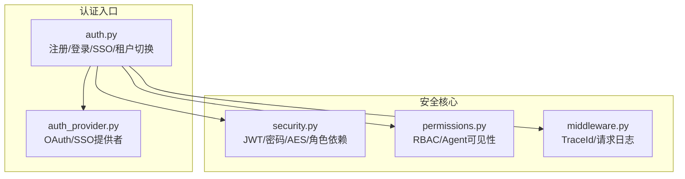
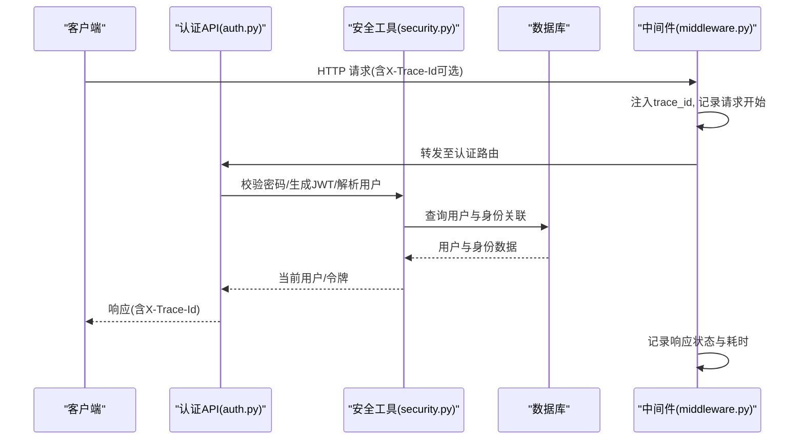
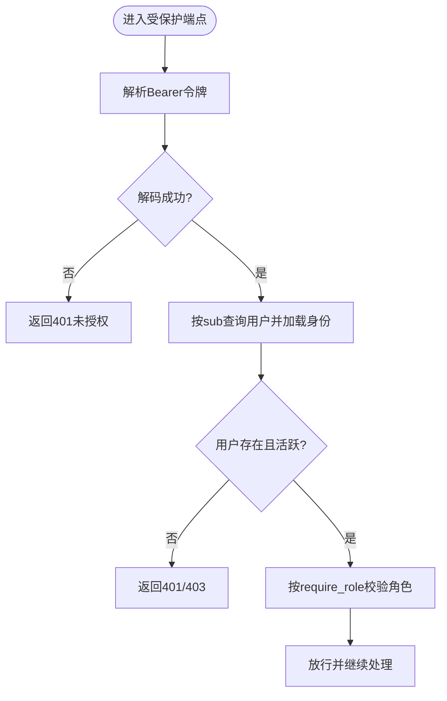
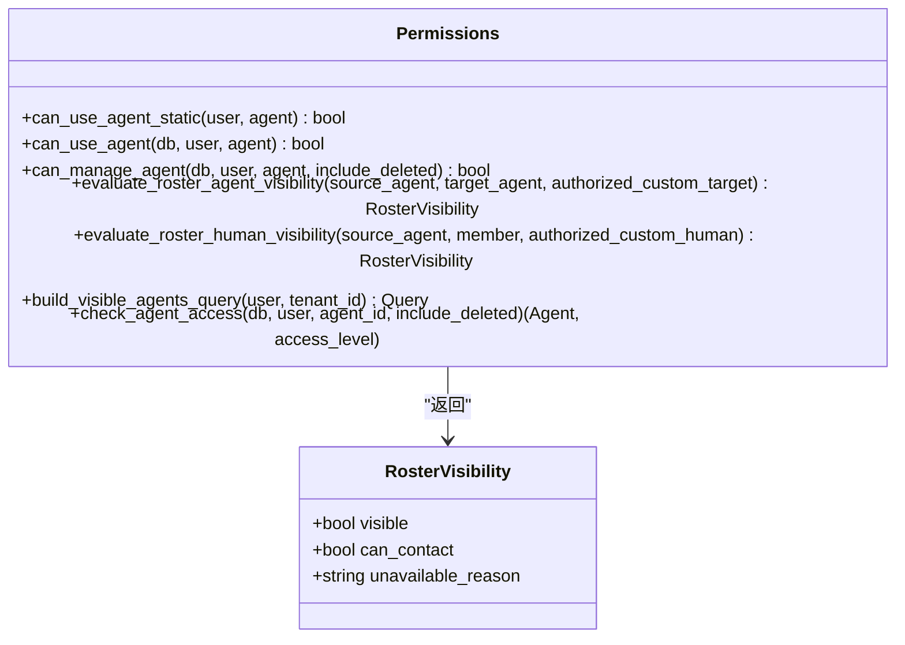
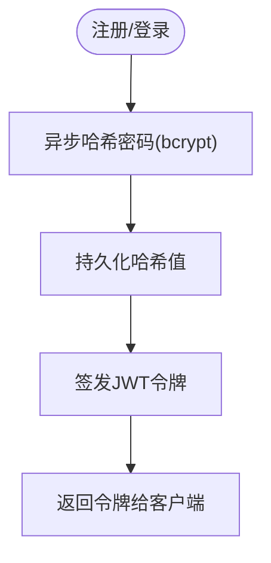
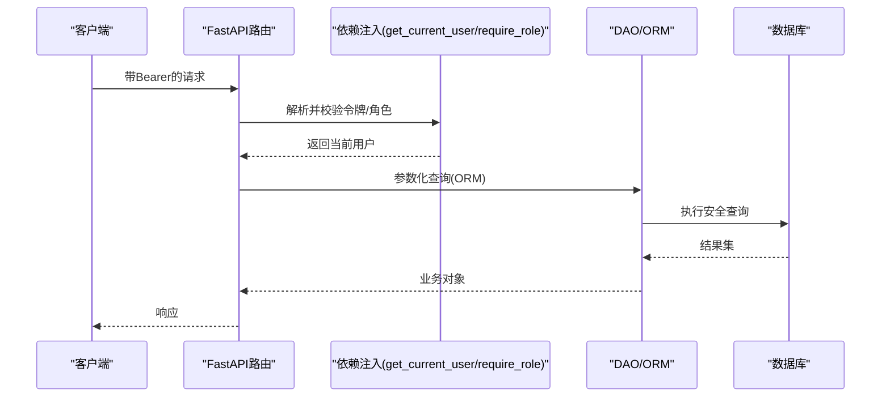
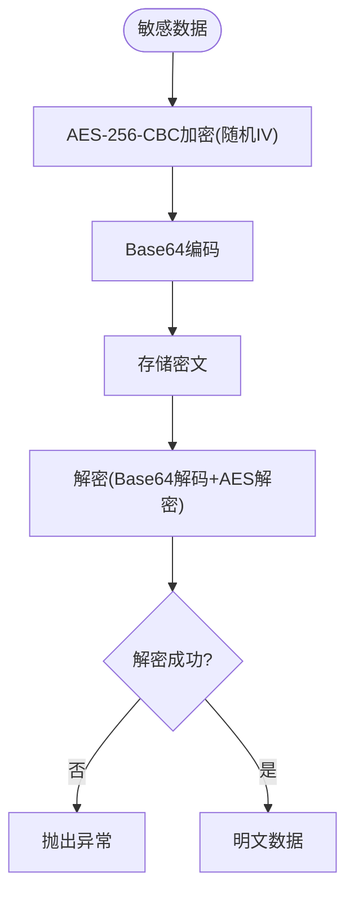
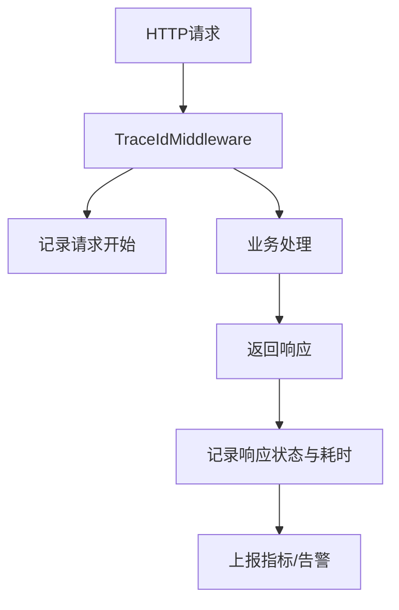
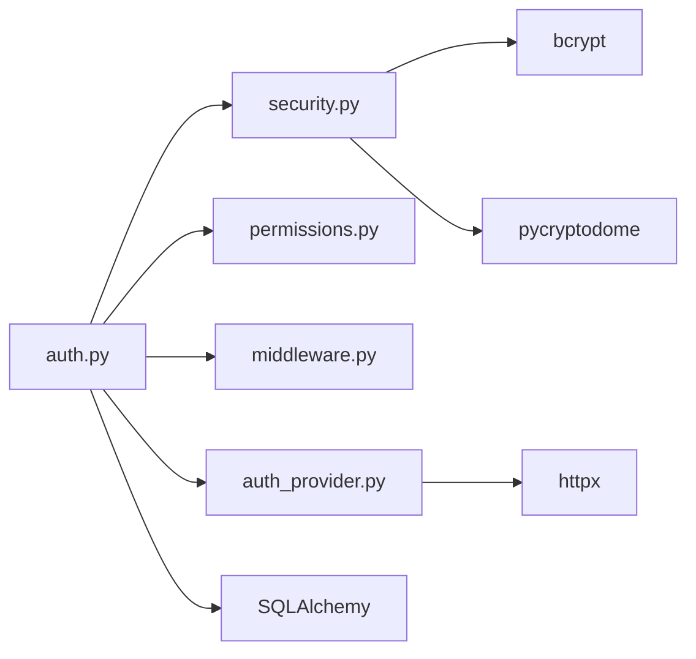

# 安全架构

<cite>
**本文引用的文件**   
- [backend/app/core/security.py](file://backend/app/core/security.py)
- [backend/app/core/middleware.py](file://backend/app/core/middleware.py)
- [backend/app/core/permissions.py](file://backend/app/core/permissions.py)
- [backend/app/api/auth.py](file://backend/app/api/auth.py)
- [backend/app/services/auth_provider.py](file://backend/app/services/auth_provider.py)
</cite>

## 目录
1. [简介](#简介)
2. [项目结构](#项目结构)
3. [核心组件](#核心组件)
4. [架构总览](#架构总览)
5. [详细组件分析](#详细组件分析)
6. [依赖关系分析](#依赖关系分析)
7. [性能考虑](#性能考虑)
8. [故障排查指南](#故障排查指南)
9. [结论](#结论)
10. [附录](#附录)

## 简介
本文件面向Clawith的安全架构，聚焦以下主题：JWT令牌认证、多租户身份验证与切换、RBAC权限控制、密码加密存储、会话管理、CSRF防护策略、API访问控制、输入验证与SQL注入防护、敏感数据加密与密钥管理、审计日志与安全监控、威胁检测、配额限制与速率限制、滥用防护、安全最佳实践、漏洞扫描与渗透测试。文档以代码级为依据，提供可视化图示与可操作建议，帮助读者快速理解并落地安全能力。

## 项目结构
后端安全相关的关键位置如下：
- 认证与安全工具：core/security.py（JWT、密码哈希、AES加解密、角色依赖）
- 请求追踪中间件：core/middleware.py（TraceId注入、请求响应日志）
- RBAC与资源访问：core/permissions.py（Agent可见性、使用与管理权限、组织成员校验）
- 认证API路由：api/auth.py（注册、登录、SSO、邮箱验证、重置密码、租户切换等）
- 第三方身份提供方：services/auth_provider.py（飞书、钉钉、企业微信、Google Workspace等OAuth/SSO实现）

**图表来源** 
- [backend/app/core/security.py:128-151](file://backend/app/core/security.py#L128-L151)
- [backend/app/core/permissions.py:44-93](file://backend/app/core/permissions.py#L44-L93)
- [backend/app/core/middleware.py:12-53](file://backend/app/core/middleware.py#L12-L53)
- [backend/app/api/auth.py:422-542](file://backend/app/api/auth.py#L422-L542)
- [backend/app/services/auth_provider.py:44-164](file://backend/app/services/auth_provider.py#L44-L164)

**章节来源**
- [backend/app/core/security.py:1-227](file://backend/app/core/security.py#L1-L227)
- [backend/app/core/middleware.py:1-53](file://backend/app/core/middleware.py#L1-L53)
- [backend/app/core/permissions.py:1-554](file://backend/app/core/permissions.py#L1-L554)
- [backend/app/api/auth.py:1-800](file://backend/app/api/auth.py#L1-L800)
- [backend/app/services/auth_provider.py:1-800](file://backend/app/services/auth_provider.py#L1-L800)

## 核心组件
- JWT令牌认证
  - 生成与解码：基于配置算法与密钥签发短期有效令牌；解码失败返回未授权错误。
  - 当前用户解析：从Bearer头提取令牌，反序列化为载荷后查询用户并加载身份关联信息。
  - 角色依赖：支持按角色或平台管理员身份进行接口保护。
- 密码加密存储
  - 采用bcrypt进行哈希，异步执行避免阻塞事件循环；提供同步与异步两套方法。
- 敏感数据加密
  - AES-256-CBC，随机IV，Base64编码输出；解密失败抛出异常。
- 多租户身份验证
  - 登录流程支持多租户选择与跨租户校验；切换租户时重新签发令牌并可选携带重定向URL。
- RBAC权限控制
  - 基于用户角色与Agent访问模式（公司/私有/自定义）判定可见性与使用/管理能力；支持显式授权记录。
- 请求追踪与审计
  - 中间件注入TraceId到请求与响应头，记录请求方法与路径、客户端IP、耗时与错误堆栈。

**章节来源**
- [backend/app/core/security.py:128-151](file://backend/app/core/security.py#L128-L151)
- [backend/app/core/security.py:153-196](file://backend/app/core/security.py#L153-L196)
- [backend/app/core/security.py:199-227](file://backend/app/core/security.py#L199-L227)
- [backend/app/core/security.py:32-52](file://backend/app/core/security.py#L32-L52)
- [backend/app/core/security.py:54-124](file://backend/app/core/security.py#L54-L124)
- [backend/app/api/auth.py:422-542](file://backend/app/api/auth.py#L422-L542)
- [backend/app/api/auth.py:748-792](file://backend/app/api/auth.py#L748-L792)
- [backend/app/core/permissions.py:44-93](file://backend/app/core/permissions.py#L44-L93)
- [backend/app/core/middleware.py:12-53](file://backend/app/core/middleware.py#L12-L53)

## 架构总览
下图展示认证与鉴权在请求生命周期中的关键节点：中间件注入追踪ID，认证路由完成身份核验与令牌签发，后续受保护端点通过依赖注入解析当前用户并进行RBAC检查。

**图表来源** 
- [backend/app/core/middleware.py:12-53](file://backend/app/core/middleware.py#L12-L53)
- [backend/app/api/auth.py:422-542](file://backend/app/api/auth.py#L422-L542)
- [backend/app/core/security.py:153-196](file://backend/app/core/security.py#L153-L196)

## 详细组件分析

### JWT令牌认证机制
- 令牌生成
  - 载荷包含用户标识、角色与过期时间；过期时间由配置决定。
- 令牌解码与校验
  - 使用配置的算法与密钥解码；失败返回未授权。
- 当前用户解析
  - 从Bearer头获取令牌，解码后根据用户ID查询用户并加载身份关联；若用户不存在或未激活则拒绝。
- 角色依赖
  - 提供require_role工厂函数，用于限定接口访问的角色集合；同时支持平台管理员身份的等价判定。

**图表来源** 
- [backend/app/core/security.py:128-151](file://backend/app/core/security.py#L128-L151)
- [backend/app/core/security.py:153-196](file://backend/app/core/security.py#L153-L196)
- [backend/app/core/security.py:199-227](file://backend/app/core/security.py#L199-L227)

**章节来源**
- [backend/app/core/security.py:128-151](file://backend/app/core/security.py#L128-L151)
- [backend/app/core/security.py:153-196](file://backend/app/core/security.py#L153-L196)
- [backend/app/core/security.py:199-227](file://backend/app/core/security.py#L199-L227)

### 多租户身份验证与切换
- 登录流程
  - 校验凭证与全局身份有效性；如未验证邮箱，触发邮件验证流程并返回需要验证的提示。
  - 若用户属于多个租户，返回租户选择列表；否则直接签发令牌。
- 切换租户
  - 校验目标租户成员资格与租户状态；重新签发新令牌并可附带重定向URL（支持跨域场景）。

```mermaid
sequenceDiagram
participant U as "用户"
participant A as "auth.py"
participant D as "DAO/DB"
participant S as "security.py"
U->>A : POST /login (login_identifier, password, tenant_id?)
A->>D : 查询Identity与User
D-->>A : 返回用户与租户信息
alt 多租户
A-->>U : 返回租户选择
U->>A : 选择tenant_id
A->>S : 签发新令牌
A-->>U : 返回令牌与重定向URL
else 单租户
A->>S : 签发令牌
A-->>U : 返回令牌
end
```

**图表来源** 
- [backend/app/api/auth.py:422-542](file://backend/app/api/auth.py#L422-L542)
- [backend/app/api/auth.py:748-792](file://backend/app/api/auth.py#L748-L792)

**章节来源**
- [backend/app/api/auth.py:422-542](file://backend/app/api/auth.py#L422-L542)
- [backend/app/api/auth.py:748-792](file://backend/app/api/auth.py#L748-L792)

### RBAC权限控制系统
- 访问模式
  - Agent支持company/private/custom三种访问模式；结合用户角色与创建者身份判定可见性与使用/管理能力。
- 静态与动态检查
  - 静态检查快速判断常见场景；动态检查通过AgentPermission表进行细粒度授权。
- 可见性评估
  - evaluate_roster_*系列函数用于目录中Agent与人类成员的可见性与可联系性评估。
- 关系状态评估
  - evaluate_agent_relationship_status与evaluate_human_relationship_status用于计算关系的有效状态与原因。

**图表来源** 
- [backend/app/core/permissions.py:17-24](file://backend/app/core/permissions.py#L17-L24)
- [backend/app/core/permissions.py:44-93](file://backend/app/core/permissions.py#L44-L93)
- [backend/app/core/permissions.py:149-180](file://backend/app/core/permissions.py#L149-L180)
- [backend/app/core/permissions.py:213-250](file://backend/app/core/permissions.py#L213-L250)
- [backend/app/core/permissions.py:481-518](file://backend/app/core/permissions.py#L481-L518)

**章节来源**
- [backend/app/core/permissions.py:44-93](file://backend/app/core/permissions.py#L44-L93)
- [backend/app/core/permissions.py:149-180](file://backend/app/core/permissions.py#L149-L180)
- [backend/app/core/permissions.py:213-250](file://backend/app/core/permissions.py#L213-L250)
- [backend/app/core/permissions.py:481-518](file://backend/app/core/permissions.py#L481-L518)

### 密码加密存储与会话管理
- 密码哈希
  - bcrypt哈希，异步线程池执行避免阻塞；提供同步与异步方法。
- 会话管理
  - 无状态JWT；不依赖服务端会话存储；每次请求携带Bearer令牌。
- CSRF防护
  - 当前实现未启用CSRF中间件；对于纯API服务通常无需CSRF，但需确保仅接受可信来源的Bearer令牌。

**图表来源** 
- [backend/app/core/security.py:32-52](file://backend/app/core/security.py#L32-L52)
- [backend/app/api/auth.py:138-253](file://backend/app/api/auth.py#L138-L253)

**章节来源**
- [backend/app/core/security.py:32-52](file://backend/app/core/security.py#L32-L52)
- [backend/app/api/auth.py:138-253](file://backend/app/api/auth.py#L138-L253)

### API访问控制、输入验证与SQL注入防护
- 访问控制
  - 通过Depends注入get_current_user/get_authenticated_user进行身份校验；require_role进行角色校验。
- 输入验证
  - FastAPI Pydantic模型自动校验请求体字段类型与必填项；业务层对唯一性、范围等进行二次校验。
- SQL注入防护
  - 使用SQLAlchemy ORM与参数化查询，避免拼接SQL字符串；所有条件通过ORM表达式构建。

**图表来源** 
- [backend/app/core/security.py:153-196](file://backend/app/core/security.py#L153-L196)
- [backend/app/core/security.py:199-227](file://backend/app/core/security.py#L199-L227)

**章节来源**
- [backend/app/core/security.py:153-196](file://backend/app/core/security.py#L153-L196)
- [backend/app/core/security.py:199-227](file://backend/app/core/security.py#L199-L227)

### 敏感数据加密、密钥管理与安全配置
- 敏感数据加密
  - AES-256-CBC，随机IV，Base64编码；解密失败抛出异常，防止静默失败。
- 密钥管理
  - 密钥来源于配置；建议使用环境变量或密钥管理服务注入；定期轮换并最小化权限。
- 安全配置
  - JWT算法与过期时间、令牌密钥等通过配置中心管理；生产环境禁用调试与详细错误回显。

**图表来源** 
- [backend/app/core/security.py:54-124](file://backend/app/core/security.py#L54-L124)

**章节来源**
- [backend/app/core/security.py:54-124](file://backend/app/core/security.py#L54-L124)

### 审计日志、安全监控与威胁检测
- 审计日志
  - 中间件记录请求方法、路径、客户端IP、耗时与错误；TraceId贯穿请求链路便于追踪。
- 安全监控
  - 建议集中收集日志并设置告警规则（如高频401/403、异常耗时、错误率突增）。
- 威胁检测
  - 基于日志与指标识别暴力破解、枚举攻击、异常地域访问等；联动限流与封禁策略。

**图表来源** 
- [backend/app/core/middleware.py:12-53](file://backend/app/core/middleware.py#L12-L53)

**章节来源**
- [backend/app/core/middleware.py:12-53](file://backend/app/core/middleware.py#L12-L53)

### 配额限制、速率限制与滥用防护
- 配额限制
  - 建议在网关或应用层对用户/租户维度实施调用配额（如每日令牌用量、API调用次数），结合数据库与缓存统计。
- 速率限制
  - 使用Redis或内存计数器实现滑动窗口限流；对登录、注册、重置密码等高敏接口加强限制。
- 滥用防护
  - 针对暴力破解与枚举攻击，增加验证码、冷却时间与IP封禁；统一错误消息避免信息泄露。

[本节为通用指导，不直接分析具体文件]

## 依赖关系分析
- 模块耦合
  - auth.py依赖security.py进行令牌与用户解析，依赖permissions.py进行资源访问控制，依赖中间件进行追踪。
  - auth_provider.py作为OAuth/SSO抽象基类，派生多种提供商实现，统一外部身份接入。
- 外部依赖
  - httpx用于外部OAuth调用；SQLAlchemy用于ORM查询；bcrypt与pycryptodome用于密码与加密。

**图表来源** 
- [backend/app/api/auth.py:1-800](file://backend/app/api/auth.py#L1-L800)
- [backend/app/core/security.py:1-227](file://backend/app/core/security.py#L1-L227)
- [backend/app/core/permissions.py:1-554](file://backend/app/core/permissions.py#L1-L554)
- [backend/app/core/middleware.py:1-53](file://backend/app/core/middleware.py#L1-L53)
- [backend/app/services/auth_provider.py:1-800](file://backend/app/services/auth_provider.py#L1-L800)

**章节来源**
- [backend/app/api/auth.py:1-800](file://backend/app/api/auth.py#L1-L800)
- [backend/app/core/security.py:1-227](file://backend/app/core/security.py#L1-L227)
- [backend/app/core/permissions.py:1-554](file://backend/app/core/permissions.py#L1-L554)
- [backend/app/core/middleware.py:1-53](file://backend/app/core/middleware.py#L1-L53)
- [backend/app/services/auth_provider.py:1-800](file://backend/app/services/auth_provider.py#L1-L800)

## 性能考虑
- 密码哈希异步化
  - 使用线程池执行bcrypt以避免阻塞事件循环，提升吞吐。
- 数据库查询优化
  - 使用selectinload预加载关联数据，减少N+1查询；合理索引tenant_id、role、is_active等常用过滤字段。
- 令牌解码开销
  - JWT解码轻量，但应避免重复解析；可在请求上下文中缓存已解析的用户信息。
- 加密操作
  - AES加解密为CPU密集操作，必要时使用独立工作进程或硬件加速。

**章节来源**
- [backend/app/core/security.py:32-52](file://backend/app/core/security.py#L32-L52)
- [backend/app/core/security.py:153-196](file://backend/app/core/security.py#L153-L196)

## 故障排查指南
- 常见问题
  - 令牌无效或过期：检查JWT密钥与算法配置；确认客户端正确传递Bearer令牌。
  - 用户未激活或不存在：检查用户状态与身份关联；确认登录流程是否完成邮箱验证。
  - 租户切换失败：确认用户具备目标租户成员资格且租户处于激活状态。
  - 解密失败：检查密钥一致性与密文完整性；捕获并记录异常详情。
- 日志定位
  - 使用TraceId串联请求链路；关注中间件的错误日志与响应耗时。
- 修复建议
  - 统一错误消息，避免泄露内部细节；对高敏接口增加重试与熔断策略。

**章节来源**
- [backend/app/core/middleware.py:12-53](file://backend/app/core/middleware.py#L12-L53)
- [backend/app/core/security.py:128-151](file://backend/app/core/security.py#L128-L151)
- [backend/app/api/auth.py:422-542](file://backend/app/api/auth.py#L422-L542)

## 结论
Clawith的安全架构围绕JWT无状态认证、多租户隔离与RBAC权限控制展开，配合bcrypt密码哈希、AES敏感数据加密与TraceId审计日志，形成端到端的安全闭环。建议在生产环境中完善速率限制、配额管理与威胁检测，持续进行漏洞扫描与渗透测试，确保安全能力随业务发展不断演进。

[本节为总结性内容，不直接分析具体文件]

## 附录
- 安全最佳实践
  - 最小权限原则：仅授予必要角色与资源访问权限。
  - 密钥轮换：定期更换JWT密钥与加密密钥，使用密钥管理服务。
  - 输入校验：严格校验与白名单过滤，避免注入与越权。
  - 日志脱敏：避免记录敏感信息（密码、令牌、手机号等）。
- 漏洞扫描与渗透测试
  - 自动化扫描：集成SAST/DAST工具，纳入CI流水线。
  - 渗透测试：定期开展黑盒与灰盒测试，覆盖认证、授权、数据加密与接口边界。
  - 修复闭环：建立缺陷分级与修复SLA，跟踪回归验证。

[本节为通用指导，不直接分析具体文件]