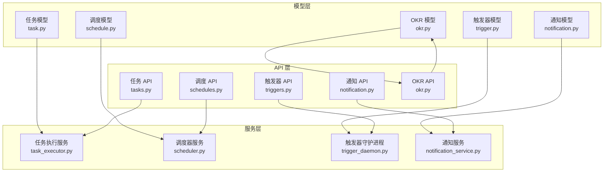
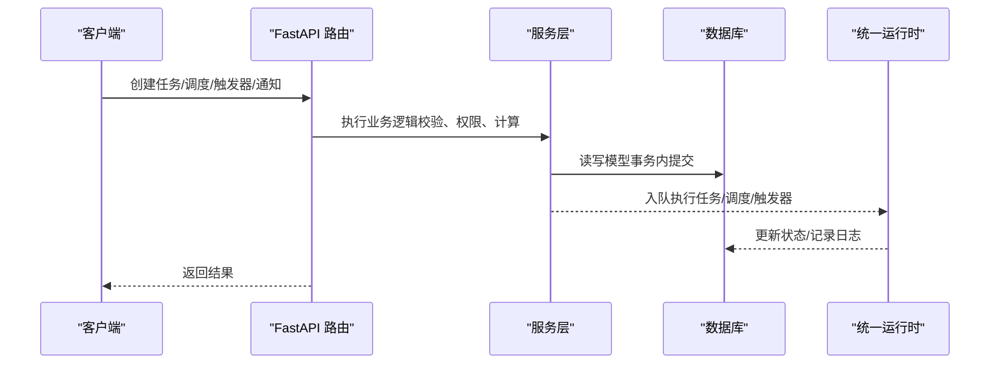
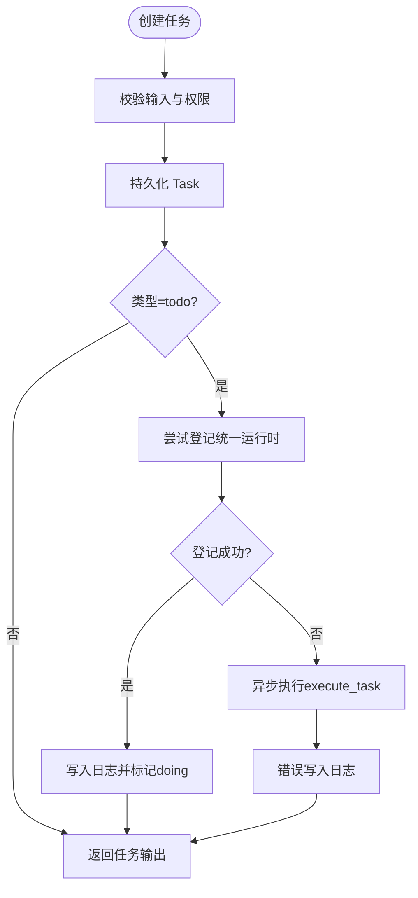
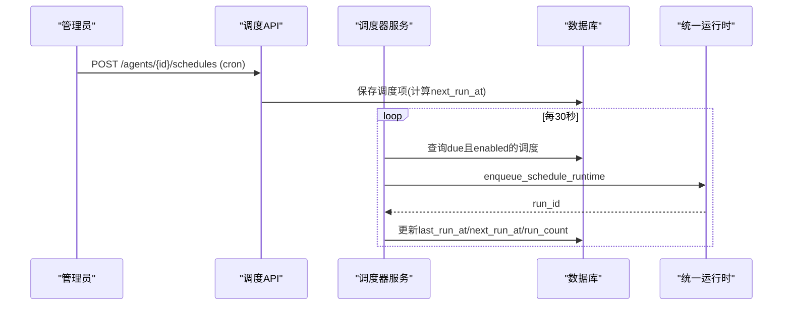
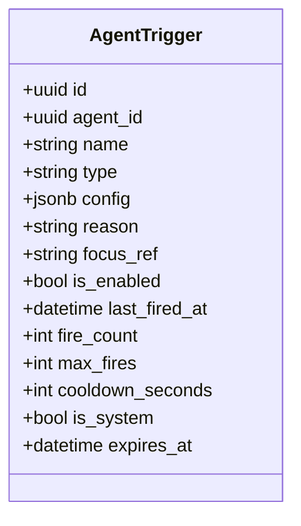
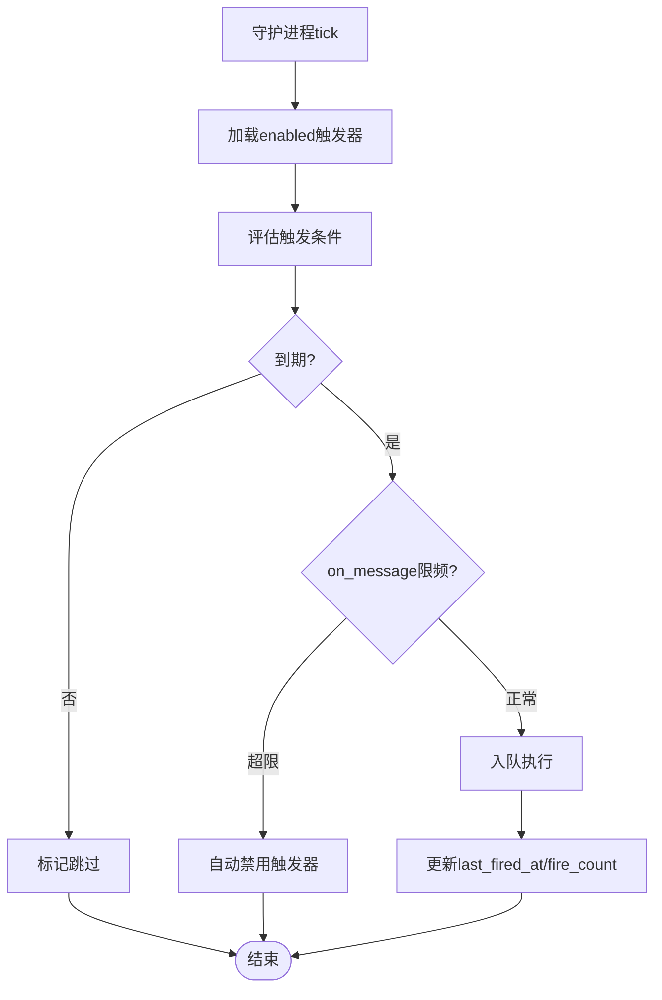
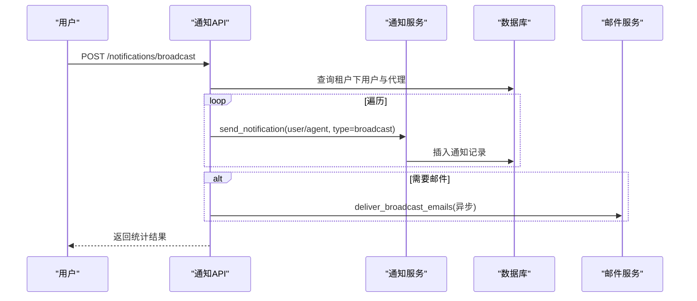
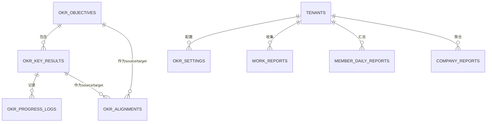
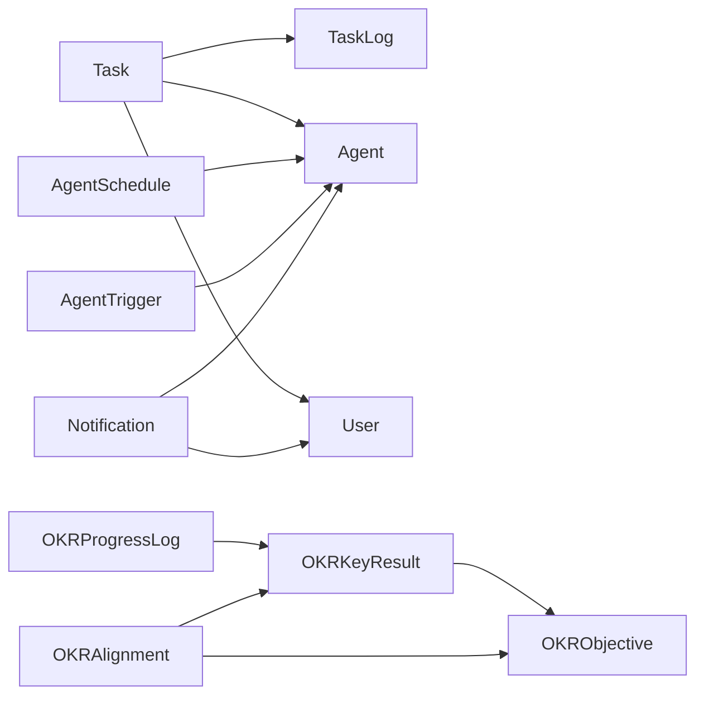

# 业务实体模型

<cite>
**本文引用的文件**
- [backend/app/models/task.py](file://backend/app/models/task.py)
- [backend/app/models/schedule.py](file://backend/app/models/schedule.py)
- [backend/app/models/trigger.py](file://backend/app/models/trigger.py)
- [backend/app/models/notification.py](file://backend/app/models/notification.py)
- [backend/app/models/okr.py](file://backend/app/models/okr.py)
- [backend/app/api/tasks.py](file://backend/app/api/tasks.py)
- [backend/app/api/schedules.py](file://backend/app/api/schedules.py)
- [backend/app/api/triggers.py](file://backend/app/api/triggers.py)
- [backend/app/api/notification.py](file://backend/app/api/notification.py)
- [backend/app/api/okr.py](file://backend/app/api/okr.py)
- [backend/app/services/task_executor.py](file://backend/app/services/task_executor.py)
- [backend/app/services/scheduler.py](file://backend/app/services/scheduler.py)
- [backend/app/services/trigger_daemon.py](file://backend/app/services/trigger_daemon.py)
- [backend/app/services/notification_service.py](file://backend/app/services/notification_service.py)
- [backend/alembic/versions/021_add_okr_tables.py](file://backend/alembic/versions/021_add_okr_tables.py)
</cite>

## 目录
1. [简介](#简介)
2. [项目结构](#项目结构)
3. [核心组件](#核心组件)
4. [架构总览](#架构总览)
5. [详细组件分析](#详细组件分析)
6. [依赖关系分析](#依赖关系分析)
7. [性能考虑](#性能考虑)
8. [故障排查指南](#故障排查指南)
9. [结论](#结论)
10. [附录](#附录)

## 简介
本文件围绕 Clawith 的业务实体模型进行系统化文档化，重点覆盖以下方面：
- 任务模型：状态机、优先级与执行结果记录
- 调度模型：定时任务与周期性任务的配置与执行
- 触发器模型：事件驱动机制（监听、条件评估、执行编排）
- 通知模型：多渠道推送与用户偏好
- OKR 目标管理：业务流程与数据关系
- 业务实体的 CRUD 操作示例与关联查询模式

## 项目结构
后端采用 FastAPI + SQLAlchemy ORM，按“模型-服务-API”分层组织。关键路径如下：
- 模型层：定义数据库表结构与关系
- 服务层：封装领域逻辑、后台任务与集成点
- API 层：对外暴露 REST 接口，负责鉴权、参数校验与响应序列化

**图表来源**
- [backend/app/models/task.py:13-57](file://backend/app/models/task.py#L13-L57)
- [backend/app/models/schedule.py:13-31](file://backend/app/models/schedule.py#L13-L31)
- [backend/app/models/trigger.py:13-48](file://backend/app/models/trigger.py#L13-L48)
- [backend/app/models/notification.py:13-31](file://backend/app/models/notification.py#L13-L31)
- [backend/app/models/okr.py:35-384](file://backend/app/models/okr.py#L35-L384)
- [backend/app/services/task_executor.py:42-121](file://backend/app/services/task_executor.py#L42-L121)
- [backend/app/services/scheduler.py:27-116](file://backend/app/services/scheduler.py#L27-L116)
- [backend/app/services/trigger_daemon.py:107-172](file://backend/app/services/trigger_daemon.py#L107-L172)
- [backend/app/services/notification_service.py:12-55](file://backend/app/services/notification_service.py#L12-L55)
- [backend/app/api/tasks.py:30-107](file://backend/app/api/tasks.py#L30-L107)
- [backend/app/api/schedules.py:81-110](file://backend/app/api/schedules.py#L81-L110)
- [backend/app/api/triggers.py:42-71](file://backend/app/api/triggers.py#L42-L71)
- [backend/app/api/notification.py:34-64](file://backend/app/api/notification.py#L34-L64)
- [backend/app/api/okr.py:484-506](file://backend/app/api/okr.py#L484-L506)

**章节来源**
- [backend/app/models/task.py:13-57](file://backend/app/models/task.py#L13-L57)
- [backend/app/models/schedule.py:13-31](file://backend/app/models/schedule.py#L13-L31)
- [backend/app/models/trigger.py:13-48](file://backend/app/models/trigger.py#L13-L48)
- [backend/app/models/notification.py:13-31](file://backend/app/models/notification.py#L13-L31)
- [backend/app/models/okr.py:35-384](file://backend/app/models/okr.py#L35-L384)

## 核心组件
- 任务模型（Task/TaskLog）：支持待办与督办两类任务，具备状态机与优先级；通过日志记录执行过程与结果。
- 调度模型（AgentSchedule）：基于 cron 表达式实现周期任务，维护最近/下次运行时间与执行次数。
- 触发器模型（AgentTrigger）：支持多种触发类型（cron/once/interval/poll/on_message），具备冷却、限次、过期等控制。
- 通知模型（Notification）：面向用户与代理的通知记录，支持分类、未读计数与广播。
- OKR 模型（Objective/KeyResult/Alignment/ProgressLog/Reports/Settings）：目标-关键结果-对齐-进度日志-报告-配置的完整闭环。

**章节来源**
- [backend/app/models/task.py:13-75](file://backend/app/models/task.py#L13-L75)
- [backend/app/models/schedule.py:13-31](file://backend/app/models/schedule.py#L13-L31)
- [backend/app/models/trigger.py:13-48](file://backend/app/models/trigger.py#L13-L48)
- [backend/app/models/notification.py:13-31](file://backend/app/models/notification.py#L13-L31)
- [backend/app/models/okr.py:35-384](file://backend/app/models/okr.py#L35-L384)

## 架构总览
整体流程由 API 层接收请求，调用服务层完成业务编排，持久化到模型层；后台守护进程与调度器轮询数据库，驱动触发器与定时任务执行。

**图表来源**
- [backend/app/api/tasks.py:62-107](file://backend/app/api/tasks.py#L62-L107)
- [backend/app/api/schedules.py:81-110](file://backend/app/api/schedules.py#L81-L110)
- [backend/app/api/triggers.py:74-109](file://backend/app/api/triggers.py#L74-L109)
- [backend/app/api/notification.py:122-216](file://backend/app/api/notification.py#L122-L216)
- [backend/app/services/task_executor.py:163-194](file://backend/app/services/task_executor.py#L163-L194)
- [backend/app/services/scheduler.py:27-116](file://backend/app/services/scheduler.py#L27-L116)
- [backend/app/services/trigger_daemon.py:107-172](file://backend/app/services/trigger_daemon.py#L107-L172)

## 详细组件分析

### 任务模型与执行流
- 字段与关系
  - Task：id、agent_id、title、description、type(todo/supervision)、status(pending/doing/done)、priority(low/medium/high/urgent)、assignee、created_by、due_date、completed_at、supervision_* 等扩展字段；与 Agent、User、TaskLog 建立关系。
  - TaskLog：记录任务进展与错误信息。
- 状态机
  - pending → doing → done；完成时记录 completed_at。
- 执行入口
  - API 创建任务后，若类型为 todo，则尝试通过统一运行时登记执行；失败则回退为异步任务执行。
  - 督办任务在 goal 中注入督办对象与汇报要求。
- 结果记录
  - 执行过程中写入 TaskLog；错误路径会追加错误日志。

**图表来源**
- [backend/app/api/tasks.py:62-107](file://backend/app/api/tasks.py#L62-L107)
- [backend/app/services/task_executor.py:42-121](file://backend/app/services/task_executor.py#L42-L121)
- [backend/app/services/task_executor.py:163-194](file://backend/app/services/task_executor.py#L163-L194)

**章节来源**
- [backend/app/models/task.py:13-75](file://backend/app/models/task.py#L13-L75)
- [backend/app/api/tasks.py:30-107](file://backend/app/api/tasks.py#L30-L107)
- [backend/app/services/task_executor.py:42-121](file://backend/app/services/task_executor.py#L42-L121)

### 调度模型与定时执行
- 字段与能力
  - AgentSchedule：name、instruction、cron_expr、is_enabled、last_run_at、next_run_at、run_count、created_by。
- 调度器
  - 每 30 秒扫描 due 的调度项，锁定并排队执行；失败或 Agent 不可用时推进 next_run_at 并计数。
- API 能力
  - 创建/更新/删除/手动触发/历史查看；创建时校验 cron 表达式并计算 next_run_at。

**图表来源**
- [backend/app/api/schedules.py:81-110](file://backend/app/api/schedules.py#L81-L110)
- [backend/app/services/scheduler.py:27-116](file://backend/app/services/scheduler.py#L27-L116)

**章节来源**
- [backend/app/models/schedule.py:13-31](file://backend/app/models/schedule.py#L13-L31)
- [backend/app/api/schedules.py:53-110](file://backend/app/api/schedules.py#L53-L110)
- [backend/app/services/scheduler.py:27-116](file://backend/app/services/scheduler.py#L27-L116)

### 触发器模型与事件驱动
- 触发类型
  - cron、once、interval、poll、on_message；config 使用 JSONB 存储具体配置。
- 控制策略
  - is_enabled、max_fires、cooldown_seconds、expires_at、is_system；支持非工作日跳过与 on_message 速率限制。
- 守护进程
  - 每 15 秒轮询 enabled 触发器，评估条件，必要时入队执行；对 on_message 做每小时限频，超限自动禁用。

**图表来源**
- [backend/app/models/trigger.py:13-48](file://backend/app/models/trigger.py#L13-L48)

**图表来源**
- [backend/app/services/trigger_daemon.py:107-172](file://backend/app/services/trigger_daemon.py#L107-L172)

**章节来源**
- [backend/app/models/trigger.py:13-48](file://backend/app/models/trigger.py#L13-L48)
- [backend/app/api/triggers.py:42-109](file://backend/app/api/triggers.py#L42-L109)
- [backend/app/services/trigger_daemon.py:107-172](file://backend/app/services/trigger_daemon.py#L107-L172)

### 通知模型与多渠道推送
- 数据结构
  - Notification：user_id/agent_id、type、title、body、link、ref_id、sender_name、is_read、created_at。
- API 能力
  - 列表、未读数、批量已读、广播（可选邮件）。
- 服务层
  - send_notification 统一落库；广播接口根据租户范围向所有用户与代理发送通知，并可异步发送邮件。

**图表来源**
- [backend/app/api/notification.py:122-216](file://backend/app/api/notification.py#L122-L216)
- [backend/app/services/notification_service.py:12-55](file://backend/app/services/notification_service.py#L12-L55)

**章节来源**
- [backend/app/models/notification.py:13-31](file://backend/app/models/notification.py#L13-L31)
- [backend/app/api/notification.py:34-64](file://backend/app/api/notification.py#L34-L64)
- [backend/app/services/notification_service.py:12-55](file://backend/app/services/notification_service.py#L12-L55)

### OKR 目标管理与业务流程
- 数据模型
  - OKRObjective：公司/用户/代理级别目标，包含周期与状态。
  - OKRKeyResult：关键结果，含目标值、当前值、单位、focus_ref、状态。
  - OKRAlignment：多对多对齐关系（O↔KR、KR↔KR、O↔O）。
  - OKRProgressLog：不可变进度变更日志。
  - WorkReport/MemberDailyReport/CompanyReport：工作日报、成员日报与公司级汇总。
  - OKRSettings：租户级开关与收集策略（每日/每周时间、周期频率等）。
- 业务流程
  - 设置启用后自动生成 OKR Agent 与系统触发器（日报收集、日/周/月报告生成）。
  - 周期计算函数保证前后端一致；支持季度/月度/自定义长度。
  - 同步关系接口将 OKR Agent 与活跃成员及公司可见代理建立关系。

**图表来源**
- [backend/app/models/okr.py:35-384](file://backend/app/models/okr.py#L35-L384)
- [backend/alembic/versions/021_add_okr_tables.py:20-200](file://backend/alembic/versions/021_add_okr_tables.py#L20-L200)

**章节来源**
- [backend/app/models/okr.py:35-384](file://backend/app/models/okr.py#L35-L384)
- [backend/app/api/okr.py:484-506](file://backend/app/api/okr.py#L484-L506)
- [backend/alembic/versions/021_add_okr_tables.py:20-200](file://backend/alembic/versions/021_add_okr_tables.py#L20-L200)

### CRUD 操作示例与关联查询模式
- 任务
  - 列表：按 agent_id 过滤，支持 status/type 筛选，批量加载 creator_username。
  - 创建：写入 Task，todo 类型入队执行；返回 TaskOut。
  - 更新：部分字段更新，返回 TaskOut。
  - 日志：按 task_id 获取/新增日志。
- 调度
  - 列表/创建/更新/删除/手动触发/历史：创建时校验 cron 并计算 next_run_at；触发时入队并更新计数。
- 触发器
  - 列表/更新/删除：前端管理 UI 常用；支持冷却、限次、过期时间。
- 通知
  - 列表/未读数/已读/全部已读/广播：支持分类过滤与异步邮件。
- OKR
  - 设置/周期/目标/关键结果/进度/报告：租户隔离，周期计算一致，自动同步关系与系统触发器。

**章节来源**
- [backend/app/api/tasks.py:30-107](file://backend/app/api/tasks.py#L30-L107)
- [backend/app/api/schedules.py:53-110](file://backend/app/api/schedules.py#L53-L110)
- [backend/app/api/triggers.py:42-109](file://backend/app/api/triggers.py#L42-L109)
- [backend/app/api/notification.py:34-64](file://backend/app/api/notification.py#L34-L64)
- [backend/app/api/okr.py:728-787](file://backend/app/api/okr.py#L728-L787)

## 依赖关系分析
- 模型间依赖
  - TaskLog 依赖 Task；Task 依赖 Agent、User。
  - OKRKeyResult 依赖 OKRObjective；OKRProgressLog 依赖 OKRKeyResult；OKRAlignment 双向引用 Objective/KR。
  - AgentSchedule 依赖 Agent、User；AgentTrigger 依赖 Agent。
  - Notification 可指向 User 或 Agent。
- 服务与 API 依赖
  - tasks API 依赖 task_executor；schedules API 依赖 scheduler；triggers API 依赖 trigger_daemon；notification API 依赖 notification_service；okr API 依赖 models 与 seeder。
- 外部集成
  - 统一运行时（用于任务/调度/触发器的执行编排）；邮件服务（广播可选）。

**图表来源**
- [backend/app/models/task.py:13-75](file://backend/app/models/task.py#L13-L75)
- [backend/app/models/okr.py:35-384](file://backend/app/models/okr.py#L35-L384)
- [backend/app/models/schedule.py:13-31](file://backend/app/models/schedule.py#L13-L31)
- [backend/app/models/trigger.py:13-48](file://backend/app/models/trigger.py#L13-L48)
- [backend/app/models/notification.py:13-31](file://backend/app/models/notification.py#L13-L31)

**章节来源**
- [backend/app/models/task.py:13-75](file://backend/app/models/task.py#L13-L75)
- [backend/app/models/okr.py:35-384](file://backend/app/models/okr.py#L35-L384)
- [backend/app/models/schedule.py:13-31](file://backend/app/models/schedule.py#L13-L31)
- [backend/app/models/trigger.py:13-48](file://backend/app/models/trigger.py#L13-L48)
- [backend/app/models/notification.py:13-31](file://backend/app/models/notification.py#L13-L31)

## 性能考虑
- 批量加载与去重
  - 列表接口批量加载用户名/显示名，减少 N+1 查询。
- 索引与约束
  - 常用过滤字段（如 created_at、tenant_id、agent_id、next_run_at）具备索引；唯一约束避免重复（如 uq_agent_trigger_name、uq_okr_alignment）。
- 后台轮询间隔
  - 调度器 30s、触发器守护 15s，兼顾实时性与负载。
- 幂等与限流
  - 触发器支持 max_fires、cooldown_seconds、on_message 限频；运行时登记使用 idempotency_key。
- 事务与锁
  - 调度 tick 使用 with_for_update(skip_locked=True) 避免并发重复执行。

[本节为通用指导，不直接分析具体文件]

## 故障排查指南
- 任务执行失败
  - 检查 task_executor 的错误日志与 TaskLog；确认 Agent 是否可用、模型是否配置。
- 调度未触发
  - 检查 cron 表达式合法性、Agent 状态与过期情况、next_run_at 计算；查看审计日志 schedule_tick/schedule_fire。
- 触发器未生效
  - 检查 is_enabled、expires_at、cooldown、on_message 限频；查看守护进程日志与自动禁用行为。
- 通知未送达
  - 检查 user_id/agent_id 是否正确、租户范围、邮件配置；查看广播统计与异步邮件队列。
- OKR 数据不一致
  - 检查周期计算函数、settings.first_enabled_at 锁定、关系同步接口；确认系统触发器是否随 settings 更新。

**章节来源**
- [backend/app/services/task_executor.py:163-194](file://backend/app/services/task_executor.py#L163-L194)
- [backend/app/services/scheduler.py:27-116](file://backend/app/services/scheduler.py#L27-L116)
- [backend/app/services/trigger_daemon.py:107-172](file://backend/app/services/trigger_daemon.py#L107-L172)
- [backend/app/api/notification.py:122-216](file://backend/app/api/notification.py#L122-L216)
- [backend/app/api/okr.py:509-585](file://backend/app/api/okr.py#L509-L585)

## 结论
Clawith 的业务实体模型以清晰的分层与强一致的数据库设计为基础，结合统一的运行时与后台守护进程，实现了任务、调度、触发器与通知的可靠执行与追踪。OKR 模块提供从目标设定到报告生成的完整闭环，并通过系统触发器与关系同步保障自动化运转。建议在扩展新业务时遵循现有模式：明确状态机、完善日志与审计、合理索引与约束、后台任务解耦与限流保护。

[本节为总结性内容，不直接分析具体文件]

## 附录
- 术语
  - 任务：待办/督办类工作项，具备状态与优先级。
  - 调度：基于 cron 的周期任务。
  - 触发器：事件驱动的唤醒条件，支持多种类型与控制策略。
  - 通知：面向用户/代理的消息记录与广播。
  - OKR：目标与关键结果管理体系，包含周期、对齐、进度与报告。

[本节为补充说明，不直接分析具体文件]