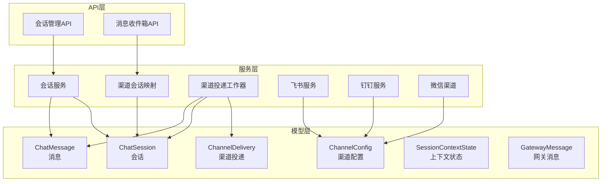
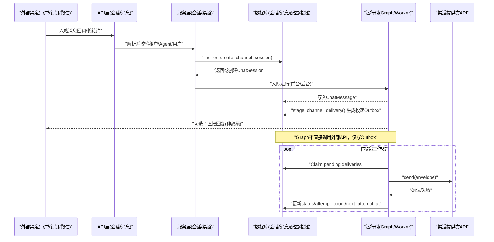
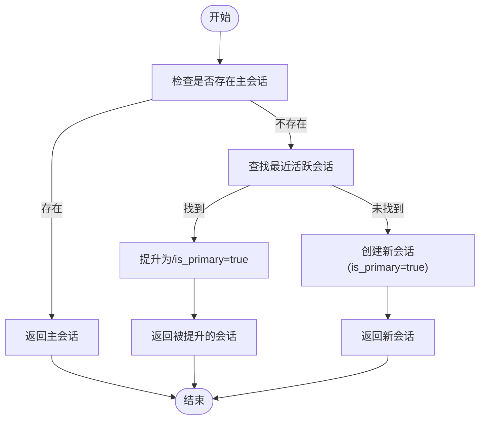
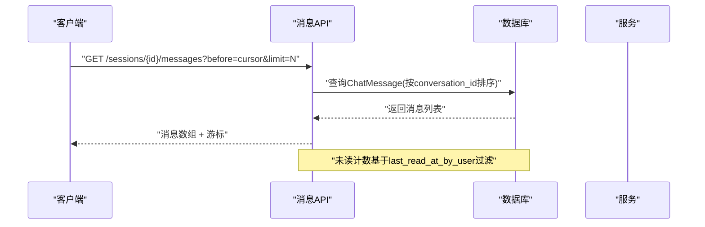
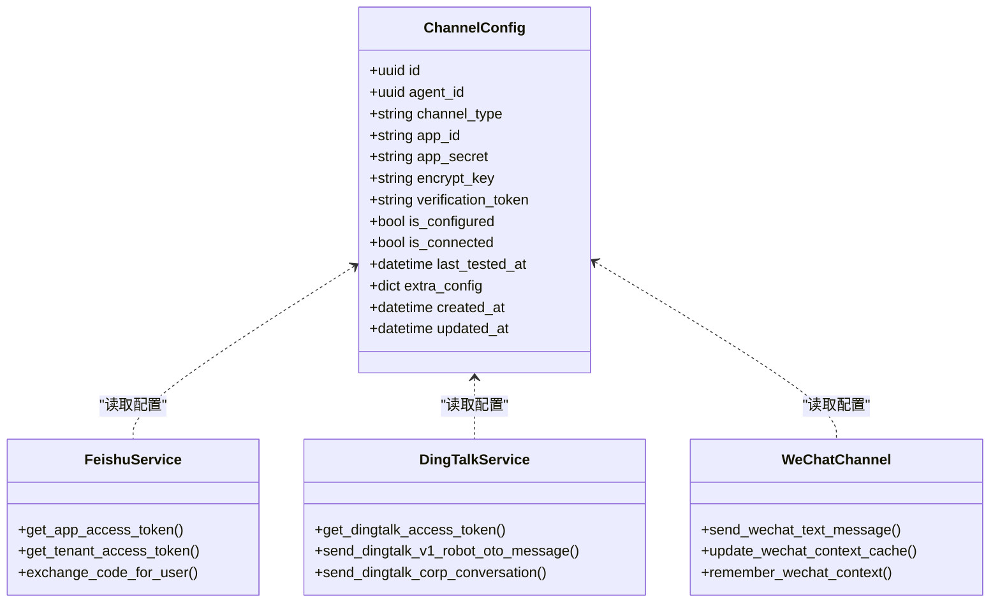
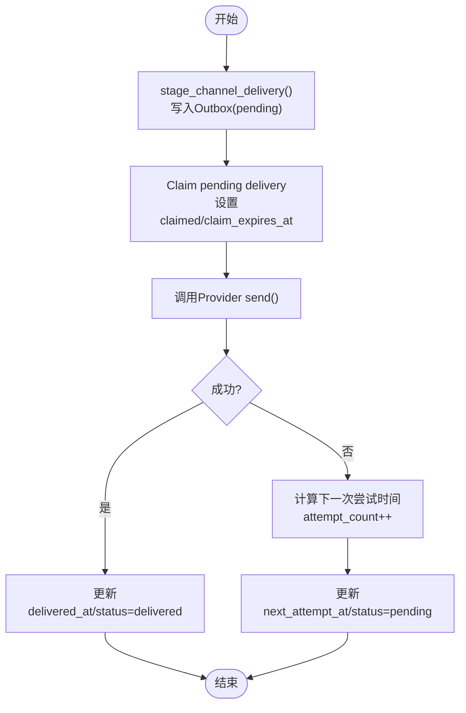
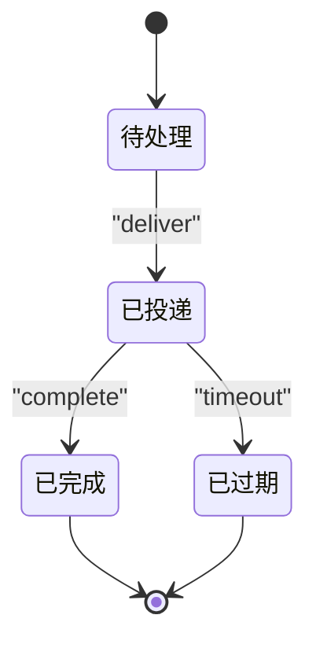
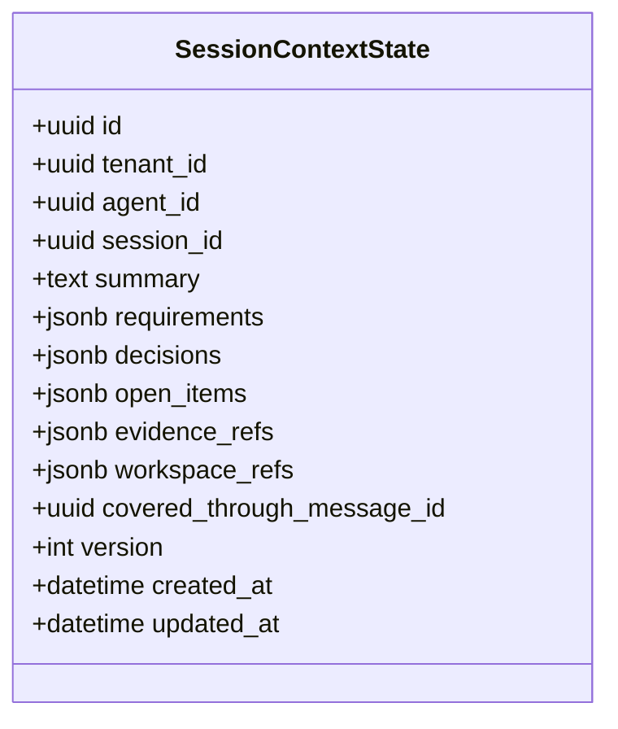
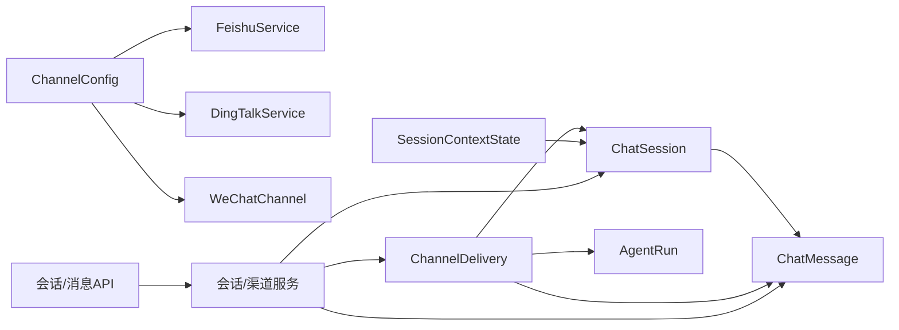

# 会话和消息模型

<cite>
**本文引用的文件**   
- [chat_session.py](file://backend/app/models/chat_session.py)
- [audit.py](file://backend/app/models/audit.py)
- [channel_config.py](file://backend/app/models/channel_config.py)
- [channel_delivery.py](file://backend/app/models/channel_delivery.py)
- [session_context_state.py](file://backend/app/models/session_context_state.py)
- [gateway_message.py](file://backend/app/models/gateway_message.py)
- [chat_sessions.py](file://backend/app/api/chat_sessions.py)
- [messages.py](file://backend/app/api/messages.py)
- [chat_session_service.py](file://backend/app/services/chat_session_service.py)
- [channel_session.py](file://backend/app/services/channel_session.py)
- [channel_delivery.py](file://backend/app/services/agent_runtime/channel_delivery.py)
- [feishu_service.py](file://backend/app/services/feishu_service.py)
- [dingtalk_service.py](file://backend/app/services/dingtalk_service.py)
- [wechat_channel.py](file://backend/app/services/wechat_channel.py)
</cite>

## 目录
1. [简介](#简介)
2. [项目结构](#项目结构)
3. [核心组件](#核心组件)
4. [架构总览](#架构总览)
5. [详细组件分析](#详细组件分析)
6. [依赖关系分析](#依赖关系分析)
7. [性能考量](#性能考量)
8. [故障排查指南](#故障排查指南)
9. [结论](#结论)
10. [附录](#附录)

## 简介
本文件围绕Clawith的“会话与消息”体系进行系统化文档化，覆盖以下关键目标：
- 统一聊天会话模型设计：支持单聊、群聊、Agent间对话（A2A）与触发器会话；提供会话状态管理、上下文持久化与主会话策略。
- 网关消息模型：面向OpenClaw Agent通信的入站/出站队列，具备生命周期跟踪。
- 渠道配置模型：统一管理飞书、钉钉、微信等渠道的连接信息与认证存储，支持扩展字段。
- 消息投递模型：基于Outbox模式的状态跟踪与重试机制，确保外部渠道投递的最终一致性。
- 数据流与流程图：包含消息流转图、会话生命周期图，以及性能优化建议。

## 项目结构
后端以模块化分层组织：
- models：数据模型定义（会话、消息、渠道配置、投递、上下文状态、网关消息）。
- api：REST接口（会话管理、消息收件箱等）。
- services：业务服务（会话创建/删除、渠道会话映射、渠道投递工作器、各渠道集成）。
- agent_runtime：运行时相关能力（含投递、事件、命令工作器等）。

图表来源
- [chat_session.py:1-116](file://backend/app/models/chat_session.py#L1-L116)
- [audit.py:46-72](file://backend/app/models/audit.py#L46-L72)
- [channel_config.py:13-52](file://backend/app/models/channel_config.py#L13-L52)
- [channel_delivery.py:26-169](file://backend/app/models/channel_delivery.py#L26-L169)
- [session_context_state.py:25-101](file://backend/app/models/session_context_state.py#L25-L101)
- [gateway_message.py:13-38](file://backend/app/models/gateway_message.py#L13-L38)
- [chat_sessions.py:216-356](file://backend/app/api/chat_sessions.py#L216-L356)
- [messages.py:26-82](file://backend/app/api/messages.py#L26-L82)
- [chat_session_service.py:136-211](file://backend/app/services/chat_session_service.py#L136-L211)
- [channel_session.py:24-184](file://backend/app/services/channel_session.py#L24-L184)
- [channel_delivery.py:143-174](file://backend/app/services/agent_runtime/channel_delivery.py#L143-L174)
- [feishu_service.py:77-176](file://backend/app/services/feishu_service.py#L77-L176)
- [dingtalk_service.py:8-32](file://backend/app/services/dingtalk_service.py#L8-L32)
- [wechat_channel.py:74-118](file://backend/app/services/wechat_channel.py#L74-L118)

章节来源
- [chat_session.py:1-116](file://backend/app/models/chat_session.py#L1-L116)
- [audit.py:46-72](file://backend/app/models/audit.py#L46-L72)
- [channel_config.py:13-52](file://backend/app/models/channel_config.py#L13-L52)
- [channel_delivery.py:26-169](file://backend/app/models/channel_delivery.py#L26-L169)
- [session_context_state.py:25-101](file://backend/app/models/session_context_state.py#L25-L101)
- [gateway_message.py:13-38](file://backend/app/models/gateway_message.py#L13-L38)
- [chat_sessions.py:216-356](file://backend/app/api/chat_sessions.py#L216-L356)
- [messages.py:26-82](file://backend/app/api/messages.py#L26-L82)
- [chat_session_service.py:136-211](file://backend/app/services/chat_session_service.py#L136-L211)
- [channel_session.py:24-184](file://backend/app/services/channel_session.py#L24-L184)
- [channel_delivery.py:143-174](file://backend/app/services/agent_runtime/channel_delivery.py#L143-L174)
- [feishu_service.py:77-176](file://backend/app/services/feishu_service.py#L77-L176)
- [dingtalk_service.py:8-32](file://backend/app/services/dingtalk_service.py#L8-L32)
- [wechat_channel.py:74-118](file://backend/app/services/wechat_channel.py#L74-L118)

## 核心组件
- 统一会话模型（ChatSession）
  - 支持会话类型：direct、group、a2a、trigger。
  - 主会话策略：is_primary标记，保证用户与Agent的单聊唯一主会话。
  - 外部会话ID：external_conv_id用于跨平台可靠查找或创建。
  - 未读计数依据：last_read_at_by_user作为时间戳基准。
- 消息模型（ChatMessage）
  - 角色：user、assistant、system、tool_call。
  - 会话关联：conversation_id指向ChatSession.id（字符串形式）。
  - 参与者身份：participant_id统一User/Agent身份。
- 渠道配置模型（ChannelConfig）
  - channel_type枚举：feishu、wecom、wechat、whatsapp、dingtalk、slack、discord、atlassian、microsoft_teams、agentbay。
  - 认证信息：app_id、app_secret、encrypt_key、verification_token等。
  - 扩展字段：extra_config(JSON)。
- 渠道投递模型（ChannelDelivery）
  - Outbox表：记录一次可重试的外部投递任务。
  - 状态机：pending → claimed → delivered → failed。
  - 幂等键：idempotency_key与run_id组合保证去重。
  - 重试策略：attempt_count、next_attempt_at、claim_expires_at。
- 会话上下文状态（SessionContextState）
  - 滚动摘要：summary、requirements、decisions、open_items、evidence_refs、workspace_refs。
  - 乐观锁版本：version字段。
  - 覆盖范围：covered_through_message_id。
- 网关消息模型（GatewayMessage）
  - 生命周期：pending → delivered → completed（或过期）。
  - 路由：conversation_id用于响应回路由。

章节来源
- [chat_session.py:23-116](file://backend/app/models/chat_session.py#L23-L116)
- [audit.py:46-72](file://backend/app/models/audit.py#L46-L72)
- [channel_config.py:13-52](file://backend/app/models/channel_config.py#L13-L52)
- [channel_delivery.py:26-169](file://backend/app/models/channel_delivery.py#L26-L169)
- [session_context_state.py:25-101](file://backend/app/models/session_context_state.py#L25-L101)
- [gateway_message.py:13-38](file://backend/app/models/gateway_message.py#L13-L38)

## 架构总览
下图展示从外部渠道到内部会话与消息，再到外部渠道投递的整体流程。

图表来源
- [channel_session.py:24-184](file://backend/app/services/channel_session.py#L24-L184)
- [channel_delivery.py:143-174](file://backend/app/services/agent_runtime/channel_delivery.py#L143-L174)
- [chat_sessions.py:216-356](file://backend/app/api/chat_sessions.py#L216-L356)
- [messages.py:26-82](file://backend/app/api/messages.py#L26-L82)
- [channel_delivery.py:26-169](file://backend/app/models/channel_delivery.py#L26-L169)

## 详细组件分析

### 会话模型与生命周期
- 会话类型与主会话
  - direct：用户与Agent的单聊；is_primary确保唯一主会话。
  - group：群聊（飞书群、企业微信群、Slack频道等），显示group_name。
  - a2a：Agent间对话，peer_agent_id标识对端Agent。
  - trigger：触发器触发的会话。
- 会话创建与复用
  - find_or_create_channel_session：按tenant_id+agent_id+external_conv_id唯一约束查找或创建。
  - ensure_primary_direct_session：在事务内通过PG advisory锁序列化主会话变更。
- 会话删除与清理
  - soft_delete_direct_session：软删除后修复主会话，并取消前台协作Run。
- 未读计数
  - last_read_at_by_user作为基准，统计该时间之后非用户消息数量。

图表来源
- [chat_session_service.py:136-211](file://backend/app/services/chat_session_service.py#L136-L211)
- [channel_session.py:24-184](file://backend/app/services/channel_session.py#L24-L184)

章节来源
- [chat_session.py:23-116](file://backend/app/models/chat_session.py#L23-L116)
- [chat_session_service.py:136-211](file://backend/app/services/chat_session_service.py#L136-L211)
- [channel_session.py:24-184](file://backend/app/services/channel_session.py#L24-L184)

### 消息模型与流转
- ChatMessage
  - role区分消息来源与用途（user/assistant/system/tool_call）。
  - conversation_id与ChatSession.id对应，便于查询历史。
  - participant_id统一参与者身份。
- 消息读取与分页
  - 使用cursor（created_at|message_id）实现稳定分页。
- 工具调用日志
  - save_tool_call_log将工具执行结果写入ChatMessage以便审计与回放。

图表来源
- [chat_sessions.py:794-800](file://backend/app/api/chat_sessions.py#L794-L800)
- [audit.py:46-72](file://backend/app/models/audit.py#L46-L72)

章节来源
- [audit.py:46-72](file://backend/app/models/audit.py#L46-L72)
- [chat_sessions.py:794-800](file://backend/app/api/chat_sessions.py#L794-L800)

### 渠道配置模型
- ChannelConfig
  - channel_type枚举支持多渠道路由。
  - 认证字段：app_id、app_secret、encrypt_key、verification_token。
  - extra_config用于渠道特定扩展（如微信上下文缓存）。
- 渠道服务示例
  - 飞书：OAuth与消息发送、token缓存。
  - 钉钉：access_token获取与消息发送。
  - 微信：iLink长轮询、文本分片发送、上下文缓存。

图表来源
- [channel_config.py:13-52](file://backend/app/models/channel_config.py#L13-L52)
- [feishu_service.py:77-176](file://backend/app/services/feishu_service.py#L77-L176)
- [dingtalk_service.py:8-32](file://backend/app/services/dingtalk_service.py#L8-L32)
- [wechat_channel.py:74-118](file://backend/app/services/wechat_channel.py#L74-L118)

章节来源
- [channel_config.py:13-52](file://backend/app/models/channel_config.py#L13-L52)
- [feishu_service.py:77-176](file://backend/app/services/feishu_service.py#L77-L176)
- [dingtalk_service.py:8-32](file://backend/app/services/dingtalk_service.py#L8-L32)
- [wechat_channel.py:74-118](file://backend/app/services/wechat_channel.py#L74-L118)

### 消息投递模型与重试机制
- ChannelDelivery（Outbox）
  - 幂等性：idempotency_key与run_id唯一约束。
  - 状态机：pending → claimed → delivered → failed。
  - 重试策略：attempt_count递增，next_attempt_at指数退避（上限300秒）。
  - 声明式索引：pending_due、run_created等加速查询。
- 投递工作器
  - stage_channel_delivery：在消息事务中追加投递行。
  - ChannelDeliveryWorker：Claim并发送，失败不恢复Graph，仅更新投递状态。

图表来源
- [channel_delivery.py:143-174](file://backend/app/services/agent_runtime/channel_delivery.py#L143-L174)
- [channel_delivery.py:26-169](file://backend/app/models/channel_delivery.py#L26-L169)

章节来源
- [channel_delivery.py:26-169](file://backend/app/models/channel_delivery.py#L26-L169)
- [channel_delivery.py:143-174](file://backend/app/services/agent_runtime/channel_delivery.py#L143-L174)

### 网关消息模型
- GatewayMessage
  - 生命周期：pending → delivered → completed（或过期）。
  - 路由：conversation_id用于响应回路由。
  - 适用场景：OpenClaw Agent间通信的入站/出站队列。

图表来源
- [gateway_message.py:13-38](file://backend/app/models/gateway_message.py#L13-L38)

章节来源
- [gateway_message.py:13-38](file://backend/app/models/gateway_message.py#L13-L38)

### 会话上下文状态
- SessionContextState
  - 滚动摘要：summary、requirements、decisions、open_items、evidence_refs、workspace_refs。
  - 乐观锁：version字段避免并发覆盖。
  - 覆盖范围：covered_through_message_id指示摘要覆盖的消息边界。

图表来源
- [session_context_state.py:25-101](file://backend/app/models/session_context_state.py#L25-L101)

章节来源
- [session_context_state.py:25-101](file://backend/app/models/session_context_state.py#L25-L101)

## 依赖关系分析
- 模型依赖
  - ChatSession与ChatMessage通过conversation_id关联。
  - ChannelDelivery与ChatMessage、ChatSession、AgentRun建立外键关系。
  - SessionContextState与ChatSession、ChatMessage建立外键关系。
- 服务依赖
  - 渠道服务依赖ChannelConfig获取认证与扩展配置。
  - 投递工作器依赖ChannelDelivery与AgentRun元数据进行幂等与路由。
- API依赖
  - 会话API依赖会话服务进行主会话策略与删除清理。
  - 消息API依赖会话与消息模型进行收件箱与未读计数。

图表来源
- [chat_session.py:23-116](file://backend/app/models/chat_session.py#L23-L116)
- [audit.py:46-72](file://backend/app/models/audit.py#L46-L72)
- [channel_delivery.py:26-169](file://backend/app/models/channel_delivery.py#L26-L169)
- [session_context_state.py:25-101](file://backend/app/models/session_context_state.py#L25-L101)
- [channel_config.py:13-52](file://backend/app/models/channel_config.py#L13-L52)
- [chat_sessions.py:216-356](file://backend/app/api/chat_sessions.py#L216-L356)
- [messages.py:26-82](file://backend/app/api/messages.py#L26-L82)

章节来源
- [chat_session.py:23-116](file://backend/app/models/chat_session.py#L23-L116)
- [audit.py:46-72](file://backend/app/models/audit.py#L46-L72)
- [channel_delivery.py:26-169](file://backend/app/models/channel_delivery.py#L26-L169)
- [session_context_state.py:25-101](file://backend/app/models/session_context_state.py#L25-L101)
- [channel_config.py:13-52](file://backend/app/models/channel_config.py#L13-L52)
- [chat_sessions.py:216-356](file://backend/app/api/chat_sessions.py#L216-L356)
- [messages.py:26-82](file://backend/app/api/messages.py#L26-L82)

## 性能考量
- 数据库索引
  - ChatSession：tenant_id、group_id、is_primary、last_message_at等索引优化查询。
  - ChannelDelivery：pending_due、run_created索引加速投递与查询。
  - ChatMessage：conversation_id、created_at索引优化历史与分页。
- 并发控制
  - PG advisory锁用于直接会话主会话变更与渠道会话创建，避免竞态。
- 重试与退避
  - 指数退避限制最大间隔，防止雪崩；幂等键保障重复投递安全。
- 上下文压缩
  - SessionContextState滚动摘要减少上下文长度，降低LLM调用成本。
- 连接池与缓存
  - 飞书SDK客户端LRU缓存减少连接开销。

[本节为通用指导，无需具体文件引用]

## 故障排查指南
- 渠道投递失败
  - 检查ChannelDelivery.status与last_error_code/last_error。
  - 查看attempt_count与next_attempt_at是否合理。
  - 确认幂等键与run_id一致，避免重复投递。
- 会话主会话异常
  - 检查is_primary标记与deleted_at状态。
  - 确认PG advisory锁是否阻塞。
- 未读计数不准确
  - 核对last_read_at_by_user与消息created_at。
- 渠道认证问题
  - 检查ChannelConfig.app_id/app_secret与extra_config。
  - 查看渠道服务日志与HTTP状态码。

章节来源
- [channel_delivery.py:26-169](file://backend/app/models/channel_delivery.py#L26-L169)
- [chat_session_service.py:271-324](file://backend/app/services/chat_session_service.py#L271-L324)
- [chat_sessions.py:216-356](file://backend/app/api/chat_sessions.py#L216-L356)
- [channel_config.py:13-52](file://backend/app/models/channel_config.py#L13-L52)

## 结论
Clawith的会话与消息模型通过统一的会话抽象、稳定的消息持久化、可扩展的渠道配置与可靠的Outbox投递机制，构建了高可用、可扩展的多渠道聊天系统。结合会话上下文压缩与并发控制，系统在性能与一致性之间取得良好平衡。

[本节为总结，无需具体文件引用]

## 附录
- 术语
  - 会话：用户/Agent间的对话单元，支持多种类型。
  - 消息：会话内的结构化内容，支持多种角色。
  - 渠道：外部IM平台（飞书、钉钉、微信等）。
  - 投递：将消息发送到外部渠道的过程。
  - 上下文：会话的滚动摘要与决策记录。

[本节为概念说明，无需具体文件引用]