# 数据库设计

<cite>
**本文引用的文件**   
- [backend/app/database.py](file://backend/app/database.py)
- [backend/alembic/env.py](file://backend/alembic/env.py)
- [backend/app/models/user.py](file://backend/app/models/user.py)
- [backend/app/models/tenant.py](file://backend/app/models/tenant.py)
- [backend/app/models/agent.py](file://backend/app/models/agent.py)
- [backend/app/models/chat_session.py](file://backend/app/models/chat_session.py)
- [backend/app/models/tool.py](file://backend/app/models/tool.py)
- [backend/app/models/skill.py](file://backend/app/models/skill.py)
- [backend/app/models/audit.py](file://backend/app/models/audit.py)
- [backend/app/models/org.py](file://backend/app/models/org.py)
- [backend/alembic/versions/028_refactor_user_system_phase2.py](file://backend/alembic/versions/028_refactor_user_system_phase2.py)
- [backend/alembic/versions/057_perf_indexes.py](file://backend/alembic/versions/057_perf_indexes.py)
- [backend/app/core/permissions.py](file://backend/app/core/permissions.py)
- [backend/app/core/middleware.py](file://backend/app/core/middleware.py)
</cite>

## 目录
1. [引言](#引言)
2. [项目结构](#项目结构)
3. [核心组件](#核心组件)
4. [架构总览](#架构总览)
5. [详细组件分析](#详细组件分析)
6. [依赖关系分析](#依赖关系分析)
7. [性能与索引优化](#性能与索引优化)
8. [事务、并发与一致性](#事务并发与一致性)
9. [备份、归档与存储优化](#备份归档与存储优化)
10. [故障排查指南](#故障排查指南)
11. [结论](#结论)
12. [附录：ER图与常用查询模式](#附录er图与常用查询模式)

## 引言
本文件为 Clawith 后端数据库的架构文档，聚焦多租户数据隔离、用户权限模型与 RBAC 实现；详述核心实体（用户、Agent、聊天会话、工具、技能等）的数据模型；阐述 Alembic 迁移策略、索引优化与查询调优；说明事务处理、并发控制与数据一致性保证；并给出备份恢复、归档策略与存储优化建议。同时提供 ER 图、表结构说明与常用查询模式，帮助读者快速理解与落地。

## 项目结构
后端采用 SQLAlchemy 异步 ORM + Alembic 进行数据库建模与迁移，PostgreSQL 作为主存储。关键目录与职责：
- backend/app/database.py：异步引擎、会话工厂、事务上下文管理
- backend/alembic/env.py：Alembic 环境配置，统一注册所有模型元数据
- backend/app/models/*：领域模型定义（用户、租户、Agent、会话、工具、技能、审计、组织等）
- backend/app/core/permissions.py：RBAC 权限判定与可见性规则
- backend/app/core/middleware.py：请求追踪中间件（用于审计与排障）

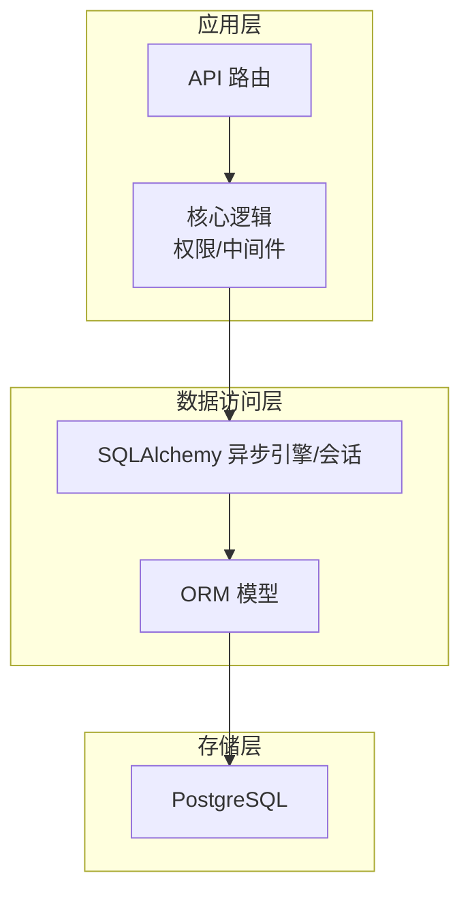

**图表来源** 
- [backend/app/database.py:14-21](file://backend/app/database.py#L14-L21)
- [backend/alembic/env.py:54-56](file://backend/alembic/env.py#L54-L56)

**章节来源**
- [backend/app/database.py:1-79](file://backend/app/database.py#L1-L79)
- [backend/alembic/env.py:1-99](file://backend/alembic/env.py#L1-L99)

## 核心组件
- 多租户边界：Tenant 表作为租户隔离根，所有业务表通过 tenant_id 限定作用域
- 身份体系：Identity（全局自然人）+ User（租户内成员），支持邮箱/手机/用户名唯一登录
- Agent（数字员工）：拥有创建者、租户归属、访问模式（company/private/custom）、配额与运行态字段
- 聊天会话：统一会话抽象 ChatSession，支持 P2P、群组、A2A、触发器会话
- 工具与技能：Tool/AgentTool 动态绑定；Skill/SkillFile 能力包管理
- 审计与消息：AuditLog、ChatMessage、ApprovalRequest 支撑合规与可追溯
- 组织同步：OrgDepartment/OrgMember 与平台用户关联，支撑目录与可见性

**章节来源**
- [backend/app/models/tenant.py:13-73](file://backend/app/models/tenant.py#L13-L73)
- [backend/app/models/user.py:16-119](file://backend/app/models/user.py#L16-L119)
- [backend/app/models/agent.py:19-235](file://backend/app/models/agent.py#L19-L235)
- [backend/app/models/chat_session.py:23-116](file://backend/app/models/chat_session.py#L23-L116)
- [backend/app/models/tool.py:13-63](file://backend/app/models/tool.py#L13-L63)
- [backend/app/models/skill.py:13-44](file://backend/app/models/skill.py#L13-L44)
- [backend/app/models/audit.py:13-89](file://backend/app/models/audit.py#L13-L89)
- [backend/app/models/org.py:13-98](file://backend/app/models/org.py#L13-L98)

## 架构总览
下图展示从请求到数据库的关键路径，以及多租户与权限校验在数据访问中的位置。

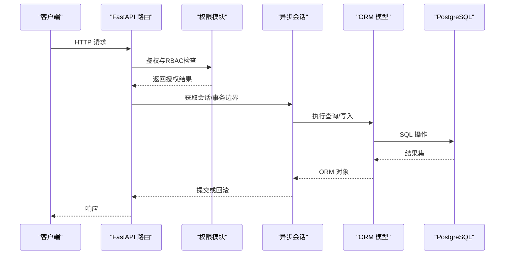

**图表来源** 
- [backend/app/core/permissions.py:481-518](file://backend/app/core/permissions.py#L481-L518)
- [backend/app/database.py:30-42](file://backend/app/database.py#L30-L42)
- [backend/alembic/env.py:78-92](file://backend/alembic/env.py#L78-L92)

## 详细组件分析

### 多租户数据隔离
- 隔离边界：Tenant 表承载租户元信息与默认配额、时区、SSO 等配置
- 数据切分：各业务表通过 tenant_id 外键约束与索引，确保跨租户不可见
- 典型用法：查询需强制携带 tenant_id 过滤；部分视图/接口以当前用户 tenant_id 注入

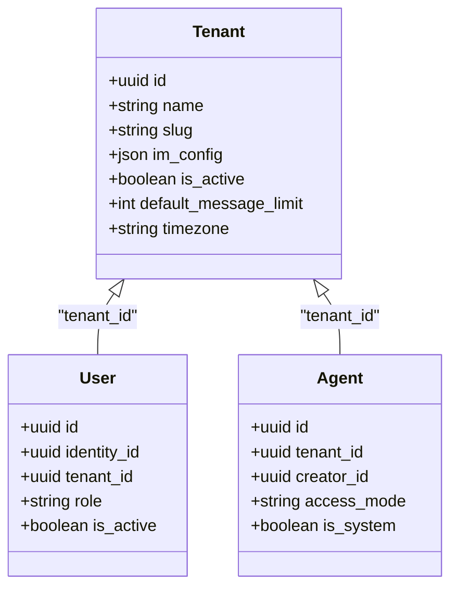

**图表来源** 
- [backend/app/models/tenant.py:13-73](file://backend/app/models/tenant.py#L13-L73)
- [backend/app/models/user.py:52-119](file://backend/app/models/user.py#L52-L119)
- [backend/app/models/agent.py:19-150](file://backend/app/models/agent.py#L19-L150)

**章节来源**
- [backend/app/models/tenant.py:13-73](file://backend/app/models/tenant.py#L13-L73)

### 用户与身份模型（RBAC 基础）
- Identity：全局自然人，唯一标识 email/phone/username，密码哈希与平台管理员标记
- User：租户内成员，角色枚举 platform_admin/org_admin/agent_admin/member，配额与状态
- 历史迁移：028 将旧用户字段迁移至 Identity，保持幂等与可回滚

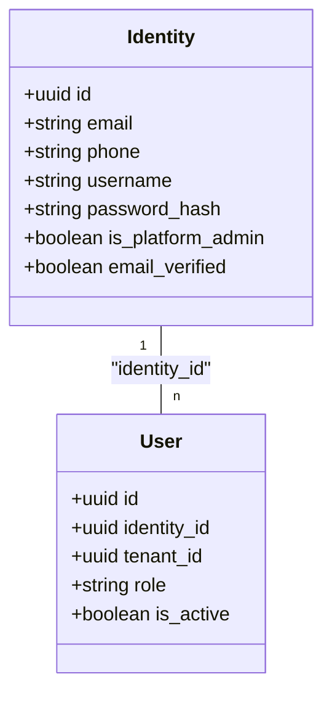

**图表来源** 
- [backend/app/models/user.py:16-119](file://backend/app/models/user.py#L16-L119)
- [backend/alembic/versions/028_refactor_user_system_phase2.py:22-152](file://backend/alembic/versions/028_refactor_user_system_phase2.py#L22-L152)

**章节来源**
- [backend/app/models/user.py:16-119](file://backend/app/models/user.py#L16-L119)
- [backend/alembic/versions/028_refactor_user_system_phase2.py:22-152](file://backend/alembic/versions/028_refactor_user_system_phase2.py#L22-L152)

### Agent 与权限模型（RBAC）
- Agent 访问模式：company（公司可见）、private（仅创建者）、custom（自定义白名单）
- AgentPermission：按 scope_type（company/department/user）与 access_level（use/manage）细粒度授权
- 权限判定：can_use_agent/can_manage_agent/check_agent_access 组合实现 RBAC 决策

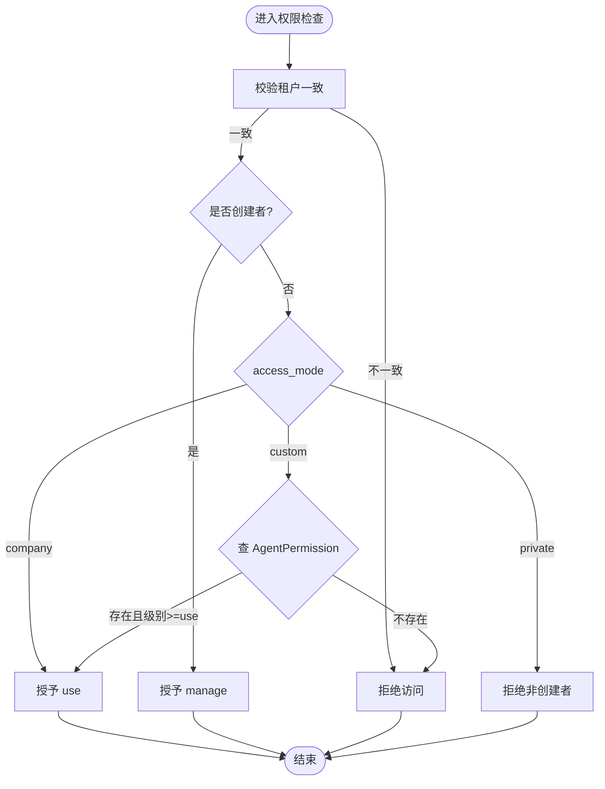

**图表来源** 
- [backend/app/core/permissions.py:44-92](file://backend/app/core/permissions.py#L44-L92)
- [backend/app/core/permissions.py:95-129](file://backend/app/core/permissions.py#L95-L129)
- [backend/app/core/permissions.py:481-518](file://backend/app/core/permissions.py#L481-L518)
- [backend/app/models/agent.py:162-179](file://backend/app/models/agent.py#L162-L179)

**章节来源**
- [backend/app/models/agent.py:19-235](file://backend/app/models/agent.py#L19-L235)
- [backend/app/core/permissions.py:44-129](file://backend/app/core/permissions.py#L44-L129)
- [backend/app/core/permissions.py:481-518](file://backend/app/core/permissions.py#L481-L518)

### 聊天会话与会话状态
- ChatSession：统一会话抽象，区分 direct/group/a2a/trigger，支持 primary session 与未读计数
- 索引与约束：外部会话 ID 唯一、租户内 id 唯一、primary 唯一约束、软删除过滤条件索引

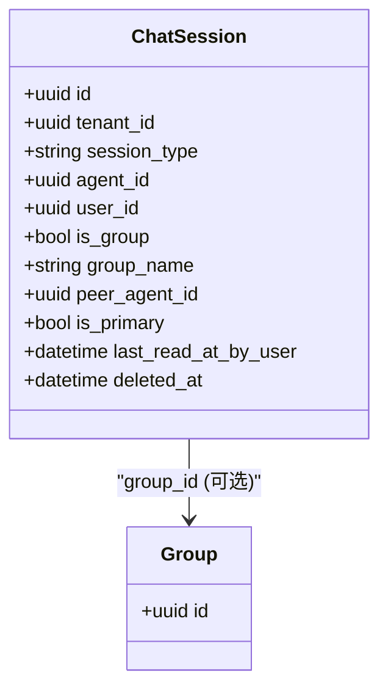

**图表来源** 
- [backend/app/models/chat_session.py:23-116](file://backend/app/models/chat_session.py#L23-L116)

**章节来源**
- [backend/app/models/chat_session.py:23-116](file://backend/app/models/chat_session.py#L23-L116)

### 工具与技能
- Tool：内置/外部（MCP）工具定义，参数 schema、运行时配置、启用开关、来源
- AgentTool：Agent 与 Tool 的多对多绑定，支持 per-agent 覆盖配置
- Skill/SkillFile：技能包与文件内容，便于模板化装配

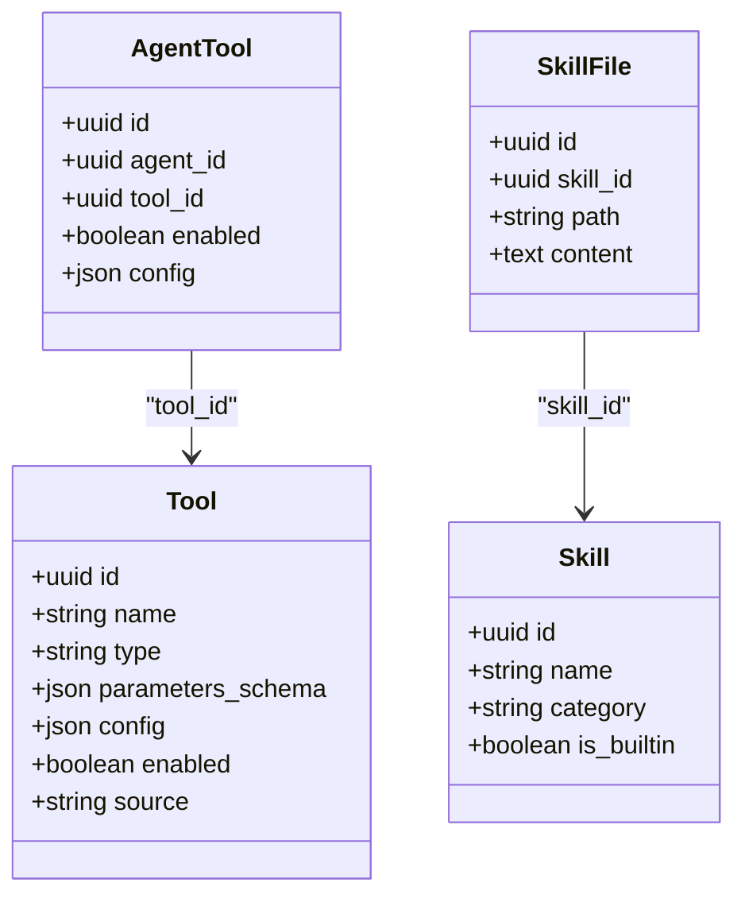

**图表来源** 
- [backend/app/models/tool.py:13-63](file://backend/app/models/tool.py#L13-L63)
- [backend/app/models/skill.py:13-44](file://backend/app/models/skill.py#L13-L44)

**章节来源**
- [backend/app/models/tool.py:13-63](file://backend/app/models/tool.py#L13-L63)
- [backend/app/models/skill.py:13-44](file://backend/app/models/skill.py#L13-L44)

### 审计日志与审批流
- AuditLog：记录操作主体、动作、详情、IP、时间戳
- ApprovalRequest：L3 高敏操作的审批单，状态机 pending/approved/rejected
- ChatMessage：统一消息体，角色、内容、提及、思考过程

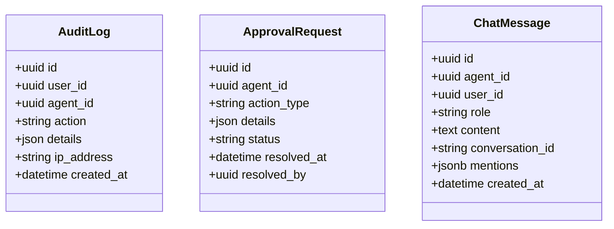

**图表来源** 
- [backend/app/models/audit.py:13-89](file://backend/app/models/audit.py#L13-L89)

**章节来源**
- [backend/app/models/audit.py:13-89](file://backend/app/models/audit.py#L13-L89)

### 组织与关系
- OrgDepartment/OrgMember：来自飞书等组织的部门与成员，软耦合 provider_id
- AgentRelationship/AgentAgentRelationship：Agent 与人、Agent 与 Agent 的关系维护

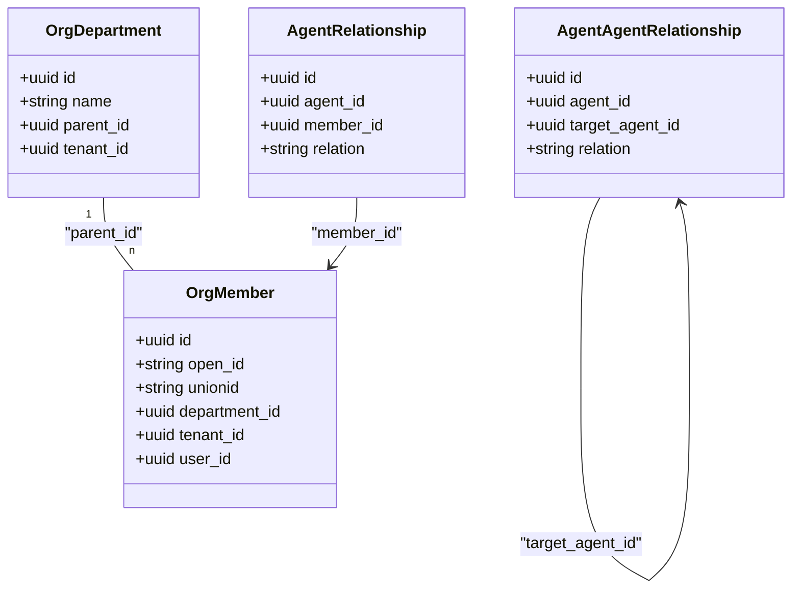

**图表来源** 
- [backend/app/models/org.py:13-98](file://backend/app/models/org.py#L13-L98)

**章节来源**
- [backend/app/models/org.py:13-98](file://backend/app/models/org.py#L13-L98)

## 依赖关系分析
- 模型注册：Alembic env.py 显式导入所有模型，确保 Base.metadata 完整
- 会话与事务：database.py 提供 async_sessionmaker 与 transaction 上下文管理器
- 权限依赖：permissions.py 依赖 Agent、AgentPermission、OrgMember、User 等模型

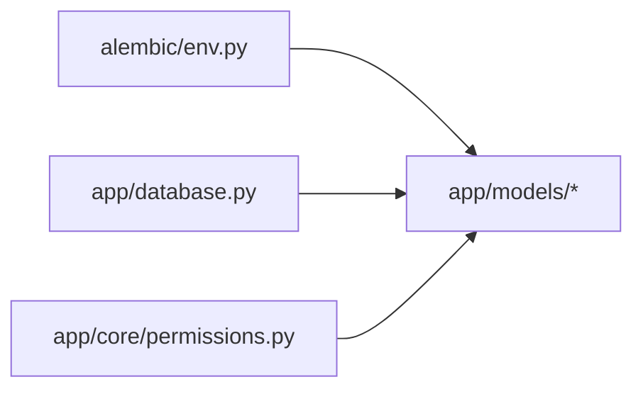

**图表来源** 
- [backend/alembic/env.py:13-46](file://backend/alembic/env.py#L13-L46)
- [backend/app/database.py:14-21](file://backend/app/database.py#L14-L21)
- [backend/app/core/permissions.py:12-14](file://backend/app/core/permissions.py#L12-L14)

**章节来源**
- [backend/alembic/env.py:13-46](file://backend/alembic/env.py#L13-L46)
- [backend/app/database.py:14-21](file://backend/app/database.py#L14-L21)

## 性能与索引优化
- 会话与连接池：engine 设置 pool_size=20、max_overflow=10，减少连接争用
- 关键索引：
  - agents.tenant_id, created_at 软删除过滤复合索引
  - chat_sessions.tenant_id、group_id、is_primary 等高频查询索引
  - org_members.email/phone/user_id 加速注册与匹配
  - agents.tenant_id,is_system,name 加速系统 Agent 查找
- 查询建议：
  - 始终携带 tenant_id 过滤，避免全表扫描
  - 使用 partial index 条件（如 deleted_at IS NULL）提升命中率
  - 大 JSON 字段按需展开，必要时使用 JSONB 并建立 GIN 索引

**章节来源**
- [backend/app/database.py:14-19](file://backend/app/database.py#L14-L19)
- [backend/app/models/agent.py:26-33](file://backend/app/models/agent.py#L26-L33)
- [backend/app/models/chat_session.py:35-63](file://backend/app/models/chat_session.py#L35-L63)
- [backend/alembic/versions/057_perf_indexes.py:16-29](file://backend/alembic/versions/057_perf_indexes.py#L16-L29)

## 事务、并发与一致性
- 会话生命周期：get_db() 自动 commit/rollback，异常安全
- 事务边界：transaction() 支持嵌套与上下文变量传递，保证原子性
- 并发控制：
  - 基于 PostgreSQL 行级锁与事务隔离级别保障一致性
  - 针对热点写（如计数器）建议使用 UPDATE ... WHERE 条件与版本号字段
  - 长事务应避免，尽量拆分短事务
- 幂等性：迁移脚本具备 IF NOT EXISTS/幂等更新，避免重复执行风险

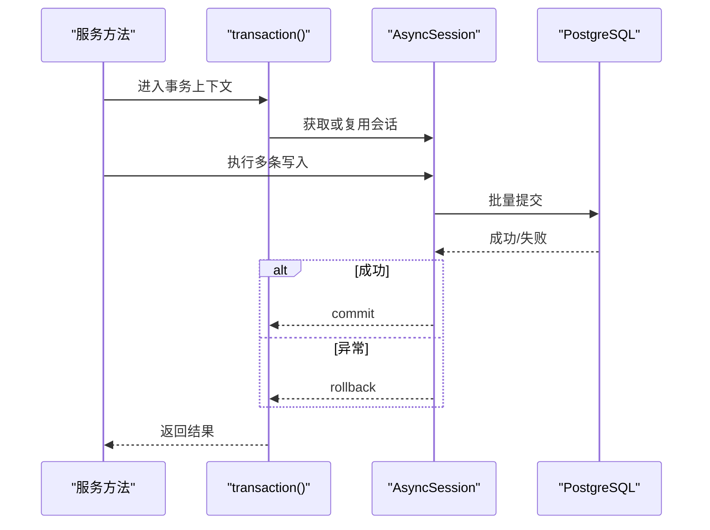

**图表来源** 
- [backend/app/database.py:47-79](file://backend/app/database.py#L47-L79)

**章节来源**
- [backend/app/database.py:30-79](file://backend/app/database.py#L30-L79)

## 备份、归档与存储优化
- 备份策略：
  - 定期逻辑备份（pg_dump）与物理备份（WAL 归档），保留多版本
  - 按租户维度导出/导入，便于灾备与迁移
- 归档策略：
  - 冷数据（如历史消息、审计日志）按月/年分区或归档表
  - 软删除字段（deleted_at）配合分区表清理
- 存储优化：
  - 大文本/JSON 字段考虑压缩或外置对象存储
  - 合理选择数据类型（UUID、TIMESTAMPTZ、JSONB）
  - 定期 VACUUM/ANALYZE 维护统计信息

[本节为通用指导，不直接分析具体文件]

## 故障排查指南
- 请求追踪：TraceIdMiddleware 注入 X-Trace-Id，便于链路定位
- 常见错误：
  - 权限不足：检查租户一致性、access_mode 与 AgentPermission
  - 会话冲突：检查 external_conv_id 唯一性与 is_primary 约束
  - 迁移失败：核对 alembic/env.py 模型导入与版本链
- 诊断步骤：
  - 查看日志中的 trace_id 与耗时
  - 使用 EXPLAIN ANALYZE 分析慢查询
  - 检查索引命中与锁等待

**章节来源**
- [backend/app/core/middleware.py:12-53](file://backend/app/core/middleware.py#L12-L53)
- [backend/alembic/env.py:78-92](file://backend/alembic/env.py#L78-L92)

## 结论
Clawith 数据库设计以 Tenant 为核心构建强隔离的多租户体系，结合 Identity/User 的身份解耦与 Agent 的灵活权限模型，形成可扩展的 RBAC。通过 Alembic 规范化管理演进，配合完善的索引与事务策略，满足高并发与一致性要求。建议在后续迭代中持续优化冷热数据分层、审计与监控能力，进一步提升可运维性与性能。

## 附录：ER图与常用查询模式

### ER 图（核心实体）
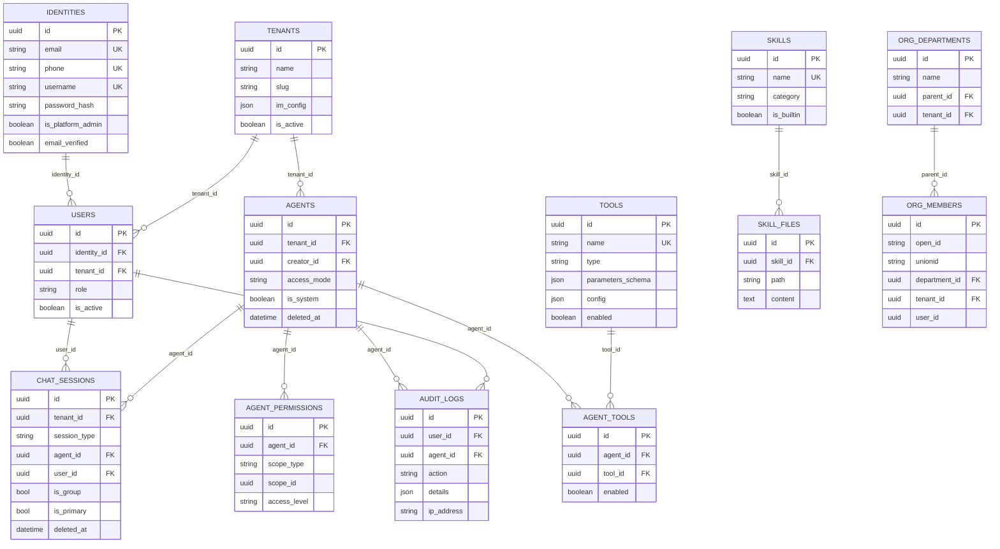

**图表来源** 
- [backend/app/models/tenant.py:13-73](file://backend/app/models/tenant.py#L13-L73)
- [backend/app/models/user.py:16-119](file://backend/app/models/user.py#L16-L119)
- [backend/app/models/agent.py:19-235](file://backend/app/models/agent.py#L19-L235)
- [backend/app/models/chat_session.py:23-116](file://backend/app/models/chat_session.py#L23-L116)
- [backend/app/models/tool.py:13-63](file://backend/app/models/tool.py#L13-L63)
- [backend/app/models/skill.py:13-44](file://backend/app/models/skill.py#L13-L44)
- [backend/app/models/audit.py:13-89](file://backend/app/models/audit.py#L13-L89)
- [backend/app/models/org.py:13-98](file://backend/app/models/org.py#L13-L98)

### 常用查询模式
- 列出某租户下可见的 Agent（含公司/自定义/创建者）
  - 条件：tenant_id、deleted_at IS NULL、access_mode、creator_id、AgentPermission
- 获取用户的 Primary Session（direct/group）
  - 条件：tenant_id、user_id/group_id、session_type、is_primary=true、deleted_at IS NULL
- 计算某 Agent 的可访问用户集合
  - 条件：access_mode=company 则同租户活跃用户；custom 则聚合管理员与 AgentPermission.scope_id
- 审计日志分页与筛选
  - 条件：user_id/agent_id/action/time_range，按 created_at 倒序

[本节为概念性说明，不直接分析具体文件]