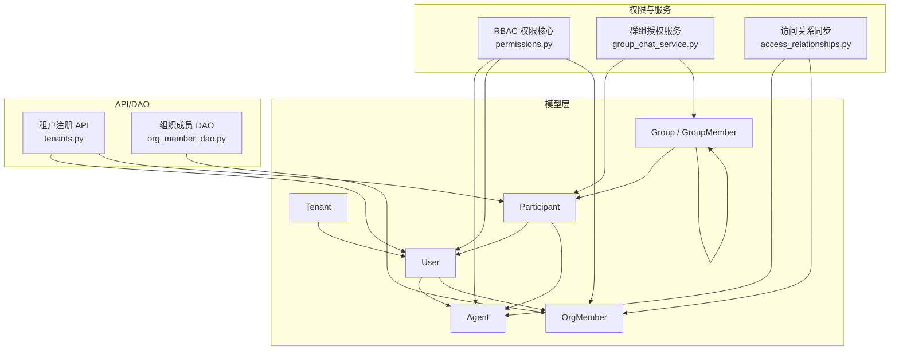
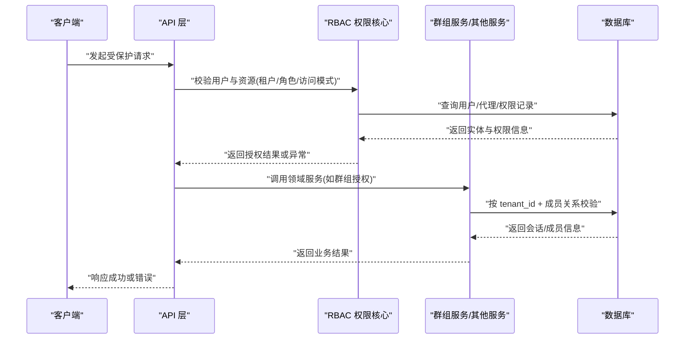
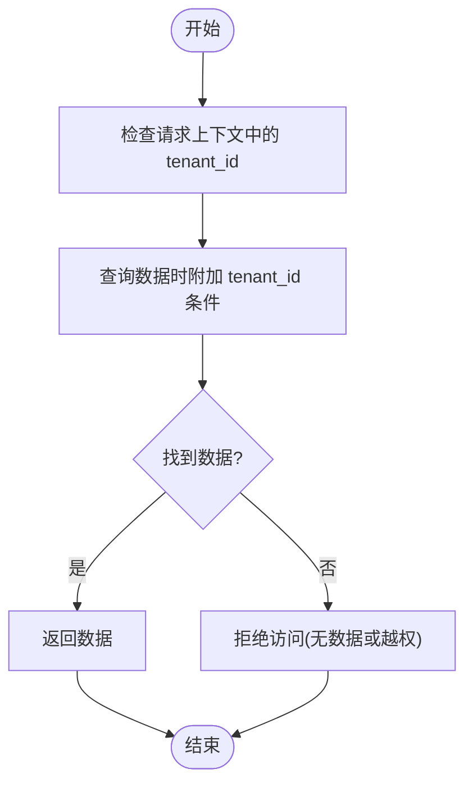
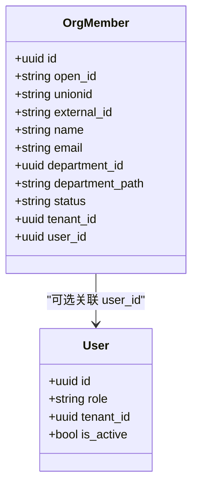
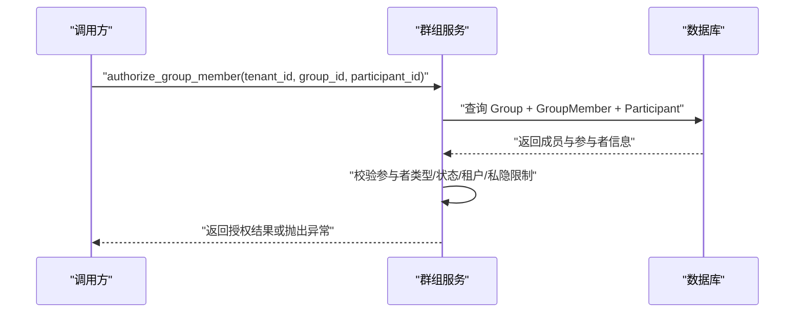
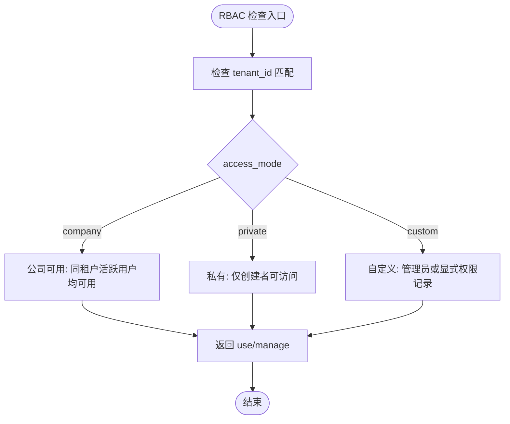
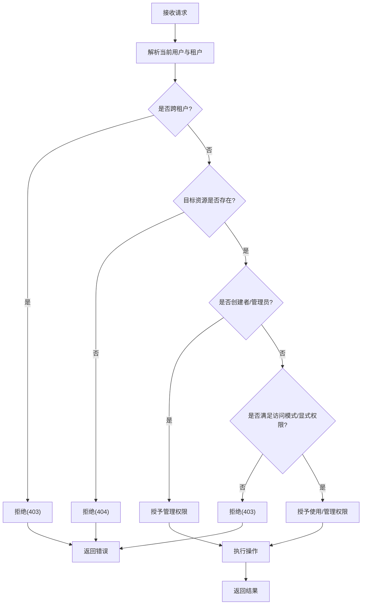
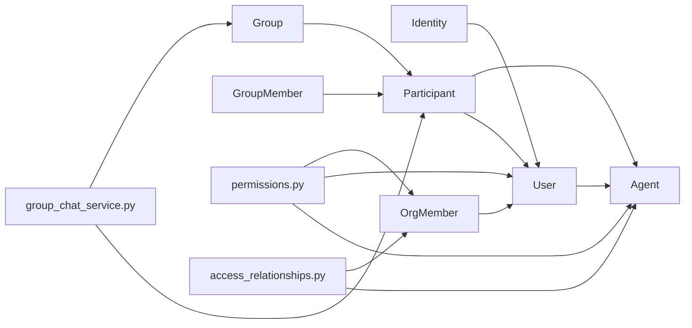

# 权限和数据隔离模型

<cite>
**本文引用的文件**   
- [backend/app/core/permissions.py](file://backend/app/core/permissions.py)
- [backend/app/models/tenant.py](file://backend/app/models/tenant.py)
- [backend/app/models/user.py](file://backend/app/models/user.py)
- [backend/app/models/agent.py](file://backend/app/models/agent.py)
- [backend/app/models/org.py](file://backend/app/models/org.py)
- [backend/app/models/participant.py](file://backend/app/models/participant.py)
- [backend/app/models/group.py](file://backend/app/models/group.py)
- [backend/app/services/group_chat_service.py](file://backend/app/services/group_chat_service.py)
- [backend/app/services/access_relationships.py](file://backend/app/services/access_relationships.py)
- [backend/app/api/tenants.py](file://backend/app/api/tenants.py)
- [backend/app/dao/org_member_dao.py](file://backend/app/dao/org_member_dao.py)
- [backend/alembic/versions/013_multi_tenant_registration.py](file://backend/alembic/versions/013_multi_tenant_registration.py)
</cite>

## 目录
1. [简介](#简介)
2. [项目结构](#项目结构)
3. [核心组件](#核心组件)
4. [架构总览](#架构总览)
5. [详细组件分析](#详细组件分析)
6. [依赖关系分析](#依赖关系分析)
7. [性能考量](#性能考量)
8. [故障排查指南](#故障排查指南)
9. [结论](#结论)
10. [附录](#附录)

## 简介
本文件系统化阐述 Clawith 的权限与数据隔离模型，覆盖多租户架构的数据隔离策略、组织成员模型（OrgMember）的权限体系与角色继承、群组参与者模型的权限控制，以及 RBAC 在资源访问、操作校验与数据行级安全上的实现。文档同时提供权限检查流程图与常见权限场景的处理方案，帮助读者快速理解并正确扩展系统的安全边界。

## 项目结构
围绕权限与隔离的核心代码主要分布在以下模块：
- 模型层：Tenant、User、Agent、OrgMember、Participant、Group 等实体定义
- 权限核心：RBAC 工具函数与可见性评估
- 服务层：群组聊天授权、访问关系同步
- API 层：租户注册与用户绑定
- DAO 层：组织成员查询辅助
- 迁移脚本：多租户注册与初始角色分配

**图表来源** 
- [backend/app/models/tenant.py:1-73](file://backend/app/models/tenant.py#L1-L73)
- [backend/app/models/user.py:1-119](file://backend/app/models/user.py#L1-L119)
- [backend/app/models/agent.py:1-235](file://backend/app/models/agent.py#L1-L235)
- [backend/app/models/org.py:1-98](file://backend/app/models/org.py#L1-L98)
- [backend/app/models/participant.py:1-32](file://backend/app/models/participant.py#L1-L32)
- [backend/app/models/group.py:1-95](file://backend/app/models/group.py#L1-L95)
- [backend/app/core/permissions.py:1-554](file://backend/app/core/permissions.py#L1-L554)
- [backend/app/services/group_chat_service.py:1-800](file://backend/app/services/group_chat_service.py#L1-L800)
- [backend/app/services/access_relationships.py:1-83](file://backend/app/services/access_relationships.py#L1-L83)
- [backend/app/api/tenants.py:311-344](file://backend/app/api/tenants.py#L311-L344)
- [backend/app/dao/org_member_dao.py:1-121](file://backend/app/dao/org_member_dao.py#L1-L121)

**章节来源**
- [backend/app/models/tenant.py:1-73](file://backend/app/models/tenant.py#L1-L73)
- [backend/app/models/user.py:1-119](file://backend/app/models/user.py#L1-L119)
- [backend/app/models/agent.py:1-235](file://backend/app/models/agent.py#L1-L235)
- [backend/app/models/org.py:1-98](file://backend/app/models/org.py#L1-L98)
- [backend/app/models/participant.py:1-32](file://backend/app/models/participant.py#L1-L32)
- [backend/app/models/group.py:1-95](file://backend/app/models/group.py#L1-L95)
- [backend/app/core/permissions.py:1-554](file://backend/app/core/permissions.py#L1-L554)
- [backend/app/services/group_chat_service.py:1-800](file://backend/app/services/group_chat_service.py#L1-L800)
- [backend/app/services/access_relationships.py:1-83](file://backend/app/services/access_relationships.py#L1-L83)
- [backend/app/api/tenants.py:311-344](file://backend/app/api/tenants.py#L311-L344)
- [backend/app/dao/org_member_dao.py:1-121](file://backend/app/dao/org_member_dao.py#L1-L121)

## 核心组件
- 多租户隔离边界：Tenant 作为公司/组织边界，所有 User、Agent、Group、ChatSession 等关键表均通过 tenant_id 进行行级隔离。
- 用户与身份：Identity 为跨租户全局身份，User 为租户内成员身份，role 支持 platform_admin、org_admin、agent_admin、member。
- 数字员工（Agent）：具备 access_mode（company/private/custom）、状态、过期控制、创建者归属等字段，决定可见性与使用权限。
- 组织成员（OrgMember）：来自身份提供商的组织结构映射，包含部门、路径、状态、租户、关联 user_id 等。
- 参与者（Participant）：统一抽象用户与代理的身份，用于会话、消息与群组成员管理。
- 群组（Group/GroupMember）：租户内长期存在的群组，成员角色为 manager/member，支持软删除与读状态。

**章节来源**
- [backend/app/models/tenant.py:1-73](file://backend/app/models/tenant.py#L1-L73)
- [backend/app/models/user.py:1-119](file://backend/app/models/user.py#L1-L119)
- [backend/app/models/agent.py:1-235](file://backend/app/models/agent.py#L1-L235)
- [backend/app/models/org.py:1-98](file://backend/app/models/org.py#L1-L98)
- [backend/app/models/participant.py:1-32](file://backend/app/models/participant.py#L1-L32)
- [backend/app/models/group.py:1-95](file://backend/app/models/group.py#L1-L95)

## 架构总览
下图展示从请求到权限校验与数据访问的整体流程，强调租户隔离、RBAC 决策与群组参与者的授权链路。

**图表来源** 
- [backend/app/core/permissions.py:1-554](file://backend/app/core/permissions.py#L1-L554)
- [backend/app/services/group_chat_service.py:1-800](file://backend/app/services/group_chat_service.py#L1-L800)

## 详细组件分析

### 多租户数据隔离策略
- 隔离边界：Tenant.id 作为隔离键，所有敏感实体（User、Agent、Group、ChatSession、LLM 配置等）均携带 tenant_id。
- 行级安全：查询时强制附加 tenant_id 条件，避免跨租户数据泄露；例如群组与会话查询均限定 tenant_id。
- 租户注册与用户绑定：当用户已属于某租户并加入新租户时，后端会创建新的 User 记录并绑定 OrgMember，确保每个租户内的身份独立。

**图表来源** 
- [backend/app/services/group_chat_service.py:286-332](file://backend/app/services/group_chat_service.py#L286-L332)
- [backend/app/api/tenants.py:311-344](file://backend/app/api/tenants.py#L311-L344)

**章节来源**
- [backend/app/models/tenant.py:1-73](file://backend/app/models/tenant.py#L1-L73)
- [backend/app/api/tenants.py:311-344](file://backend/app/api/tenants.py#L311-L344)
- [backend/app/services/group_chat_service.py:286-332](file://backend/app/services/group_chat_service.py#L286-L332)

### 组织成员模型（OrgMember）权限体系与角色继承
- 成员属性：open_id/unionid/external_id、name、email、department_id、department_path、status、tenant_id、user_id 等。
- 角色与继承：User.role 决定平台/组织级别权限；OrgMember 通过 user_id 与平台用户关联，结合 department_path 可实现基于部门的可见性。
- 未绑定成员处理：DAO 提供按 email/phone/provider 查找未绑定成员的接口，便于后续绑定与权限下发。

**图表来源** 
- [backend/app/models/org.py:34-63](file://backend/app/models/org.py#L34-L63)
- [backend/app/models/user.py:52-119](file://backend/app/models/user.py#L52-L119)
- [backend/app/dao/org_member_dao.py:17-121](file://backend/app/dao/org_member_dao.py#L17-L121)

**章节来源**
- [backend/app/models/org.py:34-63](file://backend/app/models/org.py#L34-L63)
- [backend/app/models/user.py:52-119](file://backend/app/models/user.py#L52-L119)
- [backend/app/dao/org_member_dao.py:17-121](file://backend/app/dao/org_member_dao.py#L17-L121)

### 参与者模型在群组聊天中的权限控制
- 参与者类型：Participant.type 为 'user' 或 'agent'，ref_id 指向具体实体。
- 群组授权：authorize_group_member 校验参与者是否为活跃成员，且满足租户与状态约束；private Agent 禁止加入群组。
- 邀请与候选：list_group_member_candidates 与 list_tenant_member_candidates 根据 actor_user 的可见性规则生成候选列表，Agent 需满足 can_use_agent 与可见性条件。

**图表来源** 
- [backend/app/services/group_chat_service.py:255-284](file://backend/app/services/group_chat_service.py#L255-L284)
- [backend/app/services/group_chat_service.py:565-723](file://backend/app/services/group_chat_service.py#L565-L723)

**章节来源**
- [backend/app/models/participant.py:1-32](file://backend/app/models/participant.py#L1-L32)
- [backend/app/models/group.py:24-95](file://backend/app/models/group.py#L24-L95)
- [backend/app/services/group_chat_service.py:255-284](file://backend/app/services/group_chat_service.py#L255-L284)
- [backend/app/services/group_chat_service.py:565-723](file://backend/app/services/group_chat_service.py#L565-L723)

### RBAC 权限模型的具体实现
- 资源访问控制：
  - 代理访问：can_use_agent/can_manage_agent 依据 access_mode（company/private/custom）、创建者、管理员与显式权限记录（AgentPermission）判定。
  - 可见性：build_visible_agents_query 构建用户可见的代理集合，考虑 creator、company 模式、custom 模式与管理员。
- 操作权限验证：
  - check_agent_access 返回 (agent, access_level)，其中 access_level 为 manage 或 use，并在失败时抛出 403。
  - evaluate_agent_relationship_status/evaluate_human_relationship_status 计算代理间与代理-人关系的实际状态。
- 数据行级安全：
  - 所有查询强制附加 tenant_id 条件，确保跨租户隔离。
  - 群组与会话查询严格限定 tenant_id 与 deleted_at 条件。

**图表来源** 
- [backend/app/core/permissions.py:44-129](file://backend/app/core/permissions.py#L44-L129)
- [backend/app/core/permissions.py:213-251](file://backend/app/core/permissions.py#L213-L251)
- [backend/app/core/permissions.py:481-519](file://backend/app/core/permissions.py#L481-L519)

**章节来源**
- [backend/app/core/permissions.py:44-129](file://backend/app/core/permissions.py#L44-L129)
- [backend/app/core/permissions.py:213-251](file://backend/app/core/permissions.py#L213-L251)
- [backend/app/core/permissions.py:481-519](file://backend/app/core/permissions.py#L481-L519)
- [backend/app/models/agent.py:115-179](file://backend/app/models/agent.py#L115-L179)

### 权限检查流程图（通用）

**图表来源** 
- [backend/app/core/permissions.py:481-519](file://backend/app/core/permissions.py#L481-L519)
- [backend/app/services/group_chat_service.py:255-284](file://backend/app/services/group_chat_service.py#L255-L284)

### 常见权限场景处理方案
- 场景一：用户访问公司级代理
  - 条件：同租户、代理 access_mode=company、用户活跃
  - 结果：use 权限；若为用户创建或管理员，则 manage
- 场景二：私有代理访问
  - 条件：仅创建者可访问；非创建者一律拒绝
- 场景三：自定义代理访问
  - 条件：管理员或存在显式 AgentPermission(scope_type=user, access_level in [use, manage])
- 场景四：群组邀请代理
  - 条件：邀请者为活跃人类成员；被邀代理对邀请者可见（can_use_agent）；代理非 private
- 场景五：跨租户访问
  - 条件：tenant_id 不匹配
  - 结果：直接拒绝（403）

**章节来源**
- [backend/app/core/permissions.py:44-129](file://backend/app/core/permissions.py#L44-L129)
- [backend/app/core/permissions.py:213-251](file://backend/app/core/permissions.py#L213-L251)
- [backend/app/services/group_chat_service.py:565-723](file://backend/app/services/group_chat_service.py#L565-L723)

## 依赖关系分析
- 模型依赖：
  - User 与 Identity 双向关联；User 与 Agent 通过 creator_id 关联；OrgMember 可选关联 User。
  - Participant 统一抽象 User/Agent；Group/GroupMember 通过 Participant 建立成员关系。
- 权限依赖：
  - permissions.py 依赖 Agent、AgentPermission、OrgMember、User；用于计算可见性与访问级别。
  - group_chat_service.py 依赖 Participant、Group、Agent、User；用于群组授权与候选成员生成。
  - access_relationships.py 依赖 Agent、OrgMember、User；用于保持旧版关系表面与权限一致。

**图表来源** 
- [backend/app/models/user.py:1-119](file://backend/app/models/user.py#L1-L119)
- [backend/app/models/agent.py:1-235](file://backend/app/models/agent.py#L1-L235)
- [backend/app/models/org.py:1-98](file://backend/app/models/org.py#L1-L98)
- [backend/app/models/participant.py:1-32](file://backend/app/models/participant.py#L1-L32)
- [backend/app/models/group.py:1-95](file://backend/app/models/group.py#L1-L95)
- [backend/app/core/permissions.py:1-554](file://backend/app/core/permissions.py#L1-L554)
- [backend/app/services/group_chat_service.py:1-800](file://backend/app/services/group_chat_service.py#L1-L800)
- [backend/app/services/access_relationships.py:1-83](file://backend/app/services/access_relationships.py#L1-L83)

**章节来源**
- [backend/app/models/user.py:1-119](file://backend/app/models/user.py#L1-L119)
- [backend/app/models/agent.py:1-235](file://backend/app/models/agent.py#L1-L235)
- [backend/app/models/org.py:1-98](file://backend/app/models/org.py#L1-L98)
- [backend/app/models/participant.py:1-32](file://backend/app/models/participant.py#L1-L32)
- [backend/app/models/group.py:1-95](file://backend/app/models/group.py#L1-L95)
- [backend/app/core/permissions.py:1-554](file://backend/app/core/permissions.py#L1-L554)
- [backend/app/services/group_chat_service.py:1-800](file://backend/app/services/group_chat_service.py#L1-L800)
- [backend/app/services/access_relationships.py:1-83](file://backend/app/services/access_relationships.py#L1-L83)

## 性能考量
- 索引优化：
  - agents.active_tenant_created_at 复合索引提升按租户与时间排序的查询效率。
  - org_members、users、participants 等常用过滤字段建议建立索引（如 tenant_id、status）。
- 查询最小化：
  - build_visible_agents_query 使用 exists 子查询减少不必要连接。
  - 群组候选成员查询先获取已存在 ref_ids 再排除，降低重复数据。
- 事务与锁：
  - 群组授权与成员变更使用 with_for_update 保证一致性，避免并发冲突。
- 缓存与批量：
  - 对于频繁读取的可见代理集合，可考虑短期缓存（注意租户隔离与失效策略）。

[本节为通用指导，无需特定文件引用]

## 故障排查指南
- 常见问题定位：
  - 403 无权限：检查 tenant_id 是否匹配、access_mode 是否为 private、是否存在显式权限记录。
  - 404 资源不存在：确认资源是否被软删除（deleted_at 非空）或不在当前租户。
  - 群组授权失败：确认参与者是否为活跃成员、代理是否非 private、邀请者是否对代理可见。
- 日志与诊断：
  - 关注 GroupChatServiceError 的 code 字段，快速定位失败原因。
  - 使用 evaluate_*_relationship_status 返回的 access_status_reason 判断关系有效性。

**章节来源**
- [backend/app/services/group_chat_service.py:31-37](file://backend/app/services/group_chat_service.py#L31-L37)
- [backend/app/core/permissions.py:481-519](file://backend/app/core/permissions.py#L481-L519)

## 结论
Clawith 的权限与数据隔离模型以 Tenant 为核心边界，结合 User/Agent/OrgMember/Participant/Group 等实体与 RBAC 工具函数，实现了严格的行级安全与细粒度访问控制。群组聊天通过参与者模型与授权服务保障成员权限与可见性。通过清晰的权限检查流程与常见场景处理方案，系统可在多租户环境下稳定运行并提供灵活的角色与权限管理能力。

[本节为总结，无需特定文件引用]

## 附录
- 多租户注册迁移要点：
  - 为 invitation_codes 添加 tenant_id 并清理历史数据。
  - 将各租户最早加入的用户设置为 org_admin，确保初始管理权限。

**章节来源**
- [backend/alembic/versions/013_multi_tenant_registration.py:1-57](file://backend/alembic/versions/013_multi_tenant_registration.py#L1-L57)