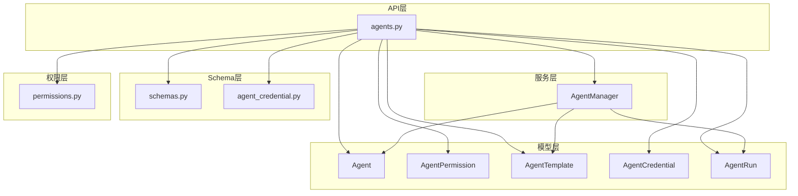
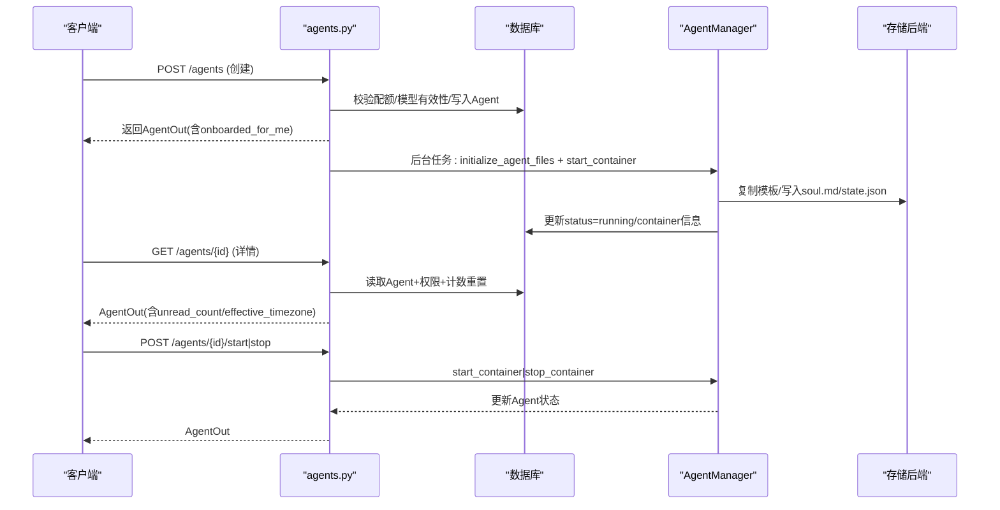
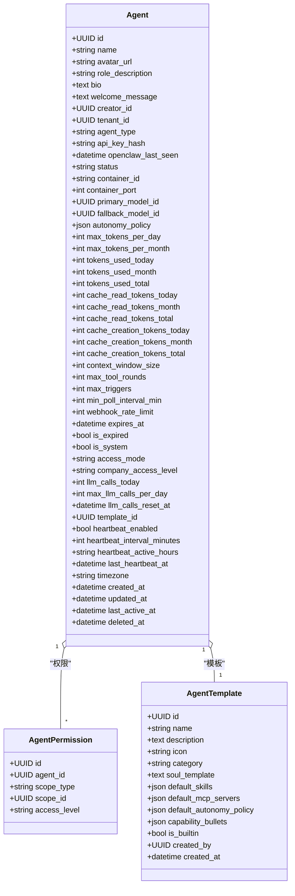
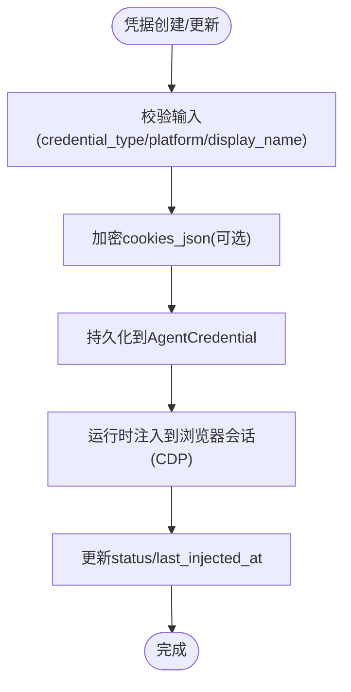
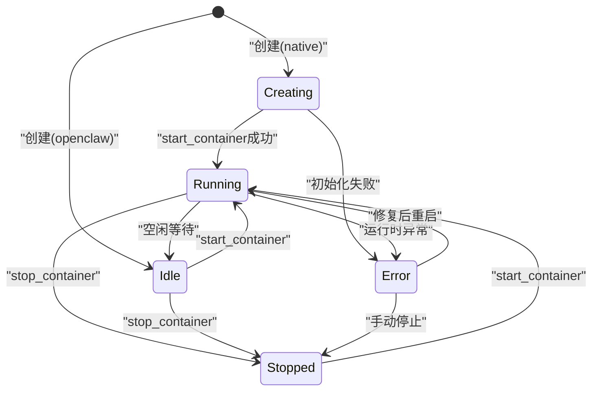
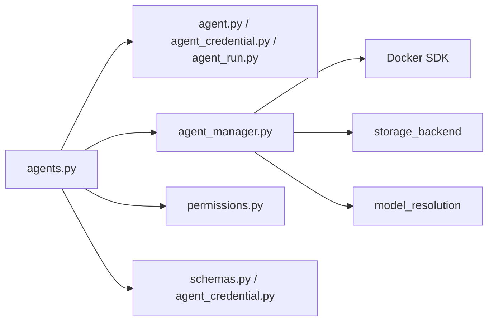

# Agent模型

<cite>
**本文引用的文件**
- [backend/app/models/agent.py](file://backend/app/models/agent.py)
- [backend/app/api/agents.py](file://backend/app/api/agents.py)
- [backend/app/services/agent_manager.py](file://backend/app/services/agent_manager.py)
- [backend/app/models/agent_credential.py](file://backend/app/models/agent_credential.py)
- [backend/app/schemas/agent_credential.py](file://backend/app/schemas/agent_credential.py)
- [backend/app/schemas/schemas.py](file://backend/app/schemas/schemas.py)
- [backend/app/core/permissions.py](file://backend/app/core/permissions.py)
- [backend/app/models/agent_run.py](file://backend/app/models/agent_run.py)
</cite>

## 目录
1. [简介](#简介)
2. [项目结构](#项目结构)
3. [核心组件](#核心组件)
4. [架构总览](#架构总览)
5. [详细组件分析](#详细组件分析)
6. [依赖关系分析](#依赖关系分析)
7. [性能考量](#性能考量)
8. [故障排查指南](#故障排查指南)
9. [结论](#结论)
10. [附录：示例与最佳实践](#附录示例与最佳实践)

## 简介
本文件为Clawith Agent模型的权威技术文档，聚焦Agent实体的字段设计、配置与安全、状态机与生命周期、权限与多租户关系映射、运行态跟踪与错误处理，以及CRUD与批量操作、查询优化。同时提供创建、配置、启动与停止的端到端流程说明与参考路径，帮助开发者快速理解并正确使用Agent能力。

## 项目结构
Agent相关代码主要分布在以下模块：
- 数据模型：Agent、AgentPermission、AgentTemplate、AgentUserOnboarding、AgentCredential、AgentRun等
- API路由：Agent的CRUD、权限管理、启停控制、OpenClaw密钥管理等
- 服务层：AgentManager负责容器化运行环境（Docker）与模板初始化
- Schema：请求/响应校验与输出结构
- 权限：RBAC与访问模式（company/private/custom）判定

图表来源
- [backend/app/models/agent.py:19-160](file://backend/app/models/agent.py#L19-L160)
- [backend/app/api/agents.py:409-591](file://backend/app/api/agents.py#L409-L591)
- [backend/app/services/agent_manager.py:51-376](file://backend/app/services/agent_manager.py#L51-L376)
- [backend/app/schemas/schemas.py:215-326](file://backend/app/schemas/schemas.py#L215-L326)
- [backend/app/schemas/agent_credential.py:13-52](file://backend/app/schemas/agent_credential.py#L13-L52)
- [backend/app/core/permissions.py:44-129](file://backend/app/core/permissions.py#L44-L129)

章节来源
- [backend/app/models/agent.py:19-160](file://backend/app/models/agent.py#L19-L160)
- [backend/app/api/agents.py:409-591](file://backend/app/api/agents.py#L409-L591)
- [backend/app/services/agent_manager.py:51-376](file://backend/app/services/agent_manager.py#L51-L376)
- [backend/app/schemas/schemas.py:215-326](file://backend/app/schemas/schemas.py#L215-L326)
- [backend/app/schemas/agent_credential.py:13-52](file://backend/app/schemas/agent_credential.py#L13-L52)
- [backend/app/core/permissions.py:44-129](file://backend/app/core/permissions.py#L44-L129)

## 核心组件
- Agent实体：数字员工实例，包含名称、描述、头像、角色描述、简介、欢迎语、归属（creator_id、tenant_id）、类型（native/openclaw）、运行时（status、container_id/port）、LLM模型（primary/fallback）、自主策略（autonomy_policy）、Token用量与限额、触发器限制、过期控制、系统标识、访问模式（access_mode/company_access_level）、心跳、时区、审计时间戳、软删除等。
- AgentPermission：细粒度访问控制（公司/部门/用户），支持use/manage两级。
- AgentTemplate：模板定义，用于快速创建Agent并预置技能、MCP服务器、自主策略等。
- AgentCredential：平台会话凭据（加密Cookie），用于浏览器自动化登录注入。
- AgentRun：不可变执行记录，承载来源、目标、调度、交付状态等元信息。

章节来源
- [backend/app/models/agent.py:19-160](file://backend/app/models/agent.py#L19-L160)
- [backend/app/models/agent.py:162-179](file://backend/app/models/agent.py#L162-L179)
- [backend/app/models/agent.py:181-205](file://backend/app/models/agent.py#L181-L205)
- [backend/app/models/agent_credential.py:18-78](file://backend/app/models/agent_credential.py#L18-L78)
- [backend/app/models/agent_run.py:27-195](file://backend/app/models/agent_run.py#L27-L195)

## 架构总览
Agent的生命周期由API路由驱动，结合AgentManager进行容器化部署与文件初始化；权限由permissions模块统一判定；Schema负责输入输出校验；AgentRun持久化执行事实。

图表来源
- [backend/app/api/agents.py:409-591](file://backend/app/api/agents.py#L409-L591)
- [backend/app/services/agent_manager.py:250-316](file://backend/app/services/agent_manager.py#L250-L316)
- [backend/app/api/agents.py:1121-1154](file://backend/app/api/agents.py#L1121-L1154)

## 详细组件分析

### Agent实体与字段设计
- 基础信息：name、avatar_url、role_description、bio、welcome_message
- 归属与类型：creator_id、tenant_id、agent_type（native/openclaw）、api_key_hash、openclaw_last_seen
- 运行时：status（creating/running/idle/stopped/error）、container_id、container_port
- LLM配置：primary_model_id、fallback_model_id
- 自主策略：autonomy_policy（JSON，按动作分级L1/L2/L3）
- Token与限额：max_tokens_per_day/month、tokens_used_*、cache_*_tokens_*、context_window_size、max_tool_rounds
- 触发器限制：max_triggers、min_poll_interval_min、webhook_rate_limit
- 过期控制：expires_at、is_expired
- 系统标识：is_system（系统Agent不可删除）
- 访问模式：access_mode（company/private/custom）、company_access_level
- 调用限额：llm_calls_today、max_llm_calls_per_day、llm_calls_reset_at
- 模板关联：template_id
- 心跳：heartbeat_enabled/interval_minutes/active_hours、last_heartbeat_at
- 时区：timezone（继承自tenant）
- 审计时间：created_at/updated_at/last_active_at/deleted_at

图表来源
- [backend/app/models/agent.py:19-160](file://backend/app/models/agent.py#L19-L160)
- [backend/app/models/agent.py:162-179](file://backend/app/models/agent.py#L162-L179)
- [backend/app/models/agent.py:181-205](file://backend/app/models/agent.py#L181-L205)

章节来源
- [backend/app/models/agent.py:19-160](file://backend/app/models/agent.py#L19-L160)

### 配置结构与凭据管理
- 配置结构：通过AgentUpdate允许动态调整模型、上下文窗口、Token限额、触发器限制、心跳参数、时区、过期时间等；部分字段受租户下限/上限约束（如心跳最小间隔、触发器轮询下限、Webhook速率上限）。
- 凭据管理：AgentCredential用于存储加密的浏览器Cookie，支持website/email/social/api_key类型，自动注入Playwright会话，避免明文密码；响应中不暴露敏感字段，仅返回has_cookies标志。

图表来源
- [backend/app/schemas/agent_credential.py:13-52](file://backend/app/schemas/agent_credential.py#L13-L52)
- [backend/app/models/agent_credential.py:18-78](file://backend/app/models/agent_credential.py#L18-L78)

章节来源
- [backend/app/schemas/agent_credential.py:13-52](file://backend/app/schemas/agent_credential.py#L13-L52)
- [backend/app/models/agent_credential.py:18-78](file://backend/app/models/agent_credential.py#L18-L78)

### 与用户、组织、工作空间的关系映射
- 用户：creator_id指向创建者；Participant表维护Agent作为参与者的显示名与头像；权限通过AgentPermission实现公司/用户/自定义范围。
- 组织：通过OrgMember与Tenant进行多租户隔离；权限判定遵循access_mode（company/private/custom）与管理员特权。
- 工作空间：Agent拥有独立的工作空间（storage key前缀），模板文件与skills被复制到Agent专属目录；删除逻辑会清理WorkspaceEditLock。

章节来源
- [backend/app/models/agent.py:149-160](file://backend/app/models/agent.py#L149-L160)
- [backend/app/api/agents.py:507-545](file://backend/app/api/agents.py#L507-L545)
- [backend/app/core/permissions.py:44-129](file://backend/app/core/permissions.py#L44-L129)

### 状态机设计与运行状态跟踪
- 状态枚举：creating、running、idle、stopped、error
- 生命周期：
  - 创建：status=creating（native）或idle（openclaw）
  - 启动：start_container后status=running，记录container_id/port
  - 停止：stop_container后status=stopped
  - 错误：异常捕获后status=error
- 运行跟踪：AgentRun记录source_type/run_kind/runtime_type/delivery_status等；事件流通过AgentRunEvent追踪完成/失败/取消；调度队列使用lane_held与position字段保证并发安全。

图表来源
- [backend/app/models/agent.py:54-58](file://backend/app/models/agent.py#L54-L58)
- [backend/app/services/agent_manager.py:250-316](file://backend/app/services/agent_manager.py#L250-L316)
- [backend/app/models/agent_run.py:27-195](file://backend/app/models/agent_run.py#L27-L195)

章节来源
- [backend/app/models/agent.py:54-58](file://backend/app/models/agent.py#L54-L58)
- [backend/app/services/agent_manager.py:250-316](file://backend/app/services/agent_manager.py#L250-L316)
- [backend/app/models/agent_run.py:27-195](file://backend/app/models/agent_run.py#L27-L195)

### CRUD操作、批量操作与查询优化
- 列表：GET /agents，基于build_visible_agents_query过滤可见性，懒重置Token计数器，聚合unread_count，批量加载onboarded状态。
- 详情：GET /agents/{id}，检查访问权限，解析effective_timezone，按需加载creator身份。
- 更新：PATCH /agents/{id}，字段级更新，租户下限/上限钳制，同步Participant显示信息。
- 删除：DELETE /agents/{id}，软删除（deleted_at），记录审计日志，取消未完成的AgentRun，清理编辑锁，移除容器。
- 权限：PUT /agents/{id}/permissions，支持company/user/custom三种范围，自动注入必需的管理员/创建者权限。
- 启停：POST /agents/{id}/start|stop，调用AgentManager更新状态。
- OpenClaw密钥：POST /agents/{id}/api-key，生成/重置API Key（仅openclaw类型）。
- 网关消息：GET /agents/{id}/gateway-messages，列出最近消息。

章节来源
- [backend/app/api/agents.py:201-239](file://backend/app/api/agents.py#L201-L239)
- [backend/app/api/agents.py:593-633](file://backend/app/api/agents.py#L593-L633)
- [backend/app/api/agents.py:913-1027](file://backend/app/api/agents.py#L913-L1027)
- [backend/app/api/agents.py:1030-1119](file://backend/app/api/agents.py#L1030-L1119)
- [backend/app/api/agents.py:636-829](file://backend/app/api/agents.py#L636-L829)
- [backend/app/api/agents.py:1121-1154](file://backend/app/api/agents.py#L1121-L1154)
- [backend/app/api/agents.py:1228-1245](file://backend/app/api/agents.py#L1228-L1245)
- [backend/app/api/agents.py:1248-1286](file://backend/app/api/agents.py#L1248-L1286)

### 模板关联与初始化
- 模板选择：create_agent支持template_id，读取default_skills/default_mcp_servers/default_autonomy_policy。
- 文件初始化：AgentManager.initialize_agent_files从模板目录复制文件，渲染soul.md（替换{{agent_name}}/{{creator_name}}/{{created_at}}），写入memory/reflections/HEARTBEAT等默认文件，定制state.json。
- 技能与MCP：后台任务并行复制技能文件，并通过import_mcp_from_smithery安装模板MCP服务器。

章节来源
- [backend/app/api/agents.py:563-588](file://backend/app/api/agents.py#L563-L588)
- [backend/app/services/agent_manager.py:94-228](file://backend/app/services/agent_manager.py#L94-L228)

### 安全设置与访问控制
- 访问模式：company（全公司可用）、private（仅创建者）、custom（显式授权用户）。
- 权限判定：can_use_agent/can_manage_agent结合access_mode与AgentPermission表判断；管理员在特定模式下具有特权。
- 系统Agent：is_system=true的Agent不可删除，需通过公司设置禁用功能。
- OpenClaw认证：api_key_hash存储哈希值，创建/openclaw类型Agent时生成一次性raw_key返回前端。

章节来源
- [backend/app/core/permissions.py:44-129](file://backend/app/core/permissions.py#L44-L129)
- [backend/app/api/agents.py:547-561](file://backend/app/api/agents.py#L547-L561)
- [backend/app/api/agents.py:1050-1056](file://backend/app/api/agents.py#L1050-L1056)

## 依赖关系分析
- API层依赖：models（Agent/AgentPermission/AgentTemplate/AgentCredential/AgentRun）、services（AgentManager）、core（permissions）、schemas（AgentCreate/AgentUpdate/AgentOut）
- 服务层依赖：docker SDK、storage后端、LLM模型解析
- 权限层依赖：Agent、AgentPermission、OrgMember、User

图表来源
- [backend/app/api/agents.py:1-38](file://backend/app/api/agents.py#L1-L38)
- [backend/app/services/agent_manager.py:1-21](file://backend/app/services/agent_manager.py#L1-L21)
- [backend/app/core/permissions.py:1-15](file://backend/app/core/permissions.py#L1-L15)

章节来源
- [backend/app/api/agents.py:1-38](file://backend/app/api/agents.py#L1-L38)
- [backend/app/services/agent_manager.py:1-21](file://backend/app/services/agent_manager.py#L1-L21)
- [backend/app/core/permissions.py:1-15](file://backend/app/core/permissions.py#L1-L15)

## 性能考量
- 列表接口懒重置Token计数器，避免频繁写盘；批量加载onboarded状态减少N+1查询。
- 技能文件复制与MCP安装采用异步并发（asyncio.gather）提升I/O吞吐。
- AgentRun索引优化：按tenant/thread/created_at/source等维度建立复合索引，加速查询与去重。
- 容器启动分配端口采用哈希取模避免冲突。

章节来源
- [backend/app/api/agents.py:101-133](file://backend/app/api/agents.py#L101-L133)
- [backend/app/api/agents.py:326-349](file://backend/app/api/agents.py#L326-L349)
- [backend/app/models/agent_run.py:162-195](file://backend/app/models/agent_run.py#L162-L195)
- [backend/app/services/agent_manager.py:282-282](file://backend/app/services/agent_manager.py#L282-L282)

## 故障排查指南
- 容器启动失败：检查Docker可用性、镜像配置、端口占用；查看Agent.status是否为error。
- 权限不足：确认access_mode与AgentPermission记录；管理员权限仅在非private模式下生效。
- 模板初始化异常：检查模板目录是否存在、soul.md渲染是否成功、存储后端可写性。
- 删除卡住：检查是否有未完成的AgentRun事件，确保enqueue_cancel已触发；清理WorkspaceEditLock。
- OpenClaw密钥问题：确认agent_type=openclaw；重新生成密钥后验证哈希存储。

章节来源
- [backend/app/services/agent_manager.py:312-316](file://backend/app/services/agent_manager.py#L312-L316)
- [backend/app/core/permissions.py:114-129](file://backend/app/core/permissions.py#L114-L129)
- [backend/app/api/agents.py:1058-1119](file://backend/app/api/agents.py#L1058-L1119)
- [backend/app/api/agents.py:1228-1245](file://backend/app/api/agents.py#L1228-L1245)

## 结论
Clawith Agent模型以清晰的字段设计、严格的权限控制、健壮的状态机与完善的生命周期管理为核心，结合模板化初始化与容器化运行，提供了可扩展、可观测、可运维的数字员工能力。通过Schema校验、索引优化与异步并发，系统在易用性与性能之间取得平衡。

## 附录：示例与最佳实践
- 创建Agent（native）：
  - 调用POST /agents，传入name、role_description、template_id、skill_ids、autonomy_policy等；后台任务初始化文件与启动容器。
  - 参考路径：[backend/app/api/agents.py:409-591](file://backend/app/api/agents.py#L409-L591)
- 创建Agent（openclaw）：
  - 调用POST /agents，agent_type="openclaw"；返回一次性raw_key；无需文件与容器初始化。
  - 参考路径：[backend/app/api/agents.py:547-561](file://backend/app/api/agents.py#L547-L561)
- 更新Agent配置：
  - 调用PATCH /agents/{id}，支持模型、限额、心跳、时区等字段；租户下限/上限自动钳制。
  - 参考路径：[backend/app/api/agents.py:913-1027](file://backend/app/api/agents.py#L913-L1027)
- 启动/停止Agent：
  - 调用POST /agents/{id}/start|stop；AgentManager更新容器状态与Agent.status。
  - 参考路径：[backend/app/api/agents.py:1121-1154](file://backend/app/api/agents.py#L1121-L1154)
- 管理权限：
  - 调用PUT /agents/{id}/permissions，设置scope_type与user_access；自动注入必需管理员。
  - 参考路径：[backend/app/api/agents.py:636-829](file://backend/app/api/agents.py#L636-L829)
- 重置OpenClaw密钥：
  - 调用POST /agents/{id}/api-key；生成新密钥并存储哈希。
  - 参考路径：[backend/app/api/agents.py:1228-1245](file://backend/app/api/agents.py#L1228-L1245)

章节来源
- [backend/app/api/agents.py:409-591](file://backend/app/api/agents.py#L409-L591)
- [backend/app/api/agents.py:913-1027](file://backend/app/api/agents.py#L913-L1027)
- [backend/app/api/agents.py:1121-1154](file://backend/app/api/agents.py#L1121-L1154)
- [backend/app/api/agents.py:636-829](file://backend/app/api/agents.py#L636-L829)
- [backend/app/api/agents.py:1228-1245](file://backend/app/api/agents.py#L1228-L1245)