# 工作空间和组织模型

<cite>
**本文引用的文件**   
- [backend/app/models/workspace.py](file://backend/app/models/workspace.py)
- [backend/app/models/org.py](file://backend/app/models/org.py)
- [backend/app/models/tenant.py](file://backend/app/models/tenant.py)
- [backend/app/models/user.py](file://backend/app/models/user.py)
- [backend/app/models/agent.py](file://backend/app/models/agent.py)
- [backend/app/core/permissions.py](file://backend/app/core/permissions.py)
- [backend/app/services/workspace_collaboration.py](file://backend/app/services/workspace_collaboration.py)
- [backend/app/services/workspace_locking.py](file://backend/app/services/workspace_locking.py)
- [backend/app/api/organization.py](file://backend/app/api/organization.py)
- [backend/app/api/tenants.py](file://backend/app/api/tenants.py)
- [backend/app/api/files.py](file://backend/app/api/files.py)
</cite>

## 目录
1. [简介](#简介)
2. [项目结构](#项目结构)
3. [核心组件](#核心组件)
4. [架构总览](#架构总览)
5. [详细组件分析](#详细组件分析)
6. [依赖关系分析](#依赖关系分析)
7. [性能考量](#性能考量)
8. [故障排查指南](#故障排查指南)
9. [结论](#结论)
10. [附录](#附录)

## 简介
本文件系统化阐述 Clawith 的“工作空间（Workspace）”与“组织（Organization）”模型，覆盖多租户隔离、资源管理、权限控制、成员邀请与角色分配、数据共享与访问策略等关键主题。文档面向技术与非技术读者，提供从概念到代码级实现的完整说明，并给出实践指导与排错建议。

## 项目结构
Clawith 后端采用分层设计：
- 模型层：定义租户、用户、组织、Agent、工作空间等实体
- 服务层：实现工作空间协作、锁机制、运行时工具编排等
- API 层：暴露组织管理、租户管理、文件操作等接口
- 存储层：通过统一存储后端抽象文件系统与版本控制

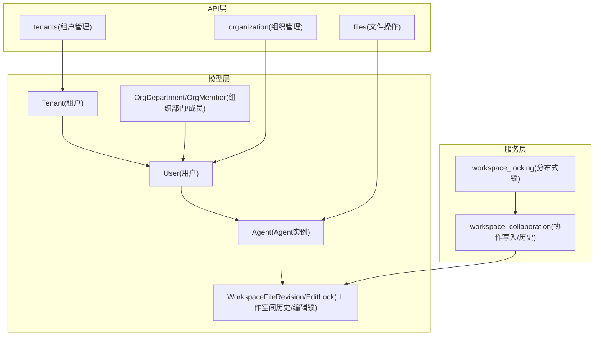

**图示来源** 
- [backend/app/models/tenant.py:1-73](file://backend/app/models/tenant.py#L1-L73)
- [backend/app/models/user.py:1-119](file://backend/app/models/user.py#L1-L119)
- [backend/app/models/org.py:1-98](file://backend/app/models/org.py#L1-L98)
- [backend/app/models/agent.py:1-200](file://backend/app/models/agent.py#L1-L200)
- [backend/app/models/workspace.py:1-108](file://backend/app/models/workspace.py#L1-L108)
- [backend/app/services/workspace_collaboration.py:1-800](file://backend/app/services/workspace_collaboration.py#L1-L800)
- [backend/app/services/workspace_locking.py:1-81](file://backend/app/services/workspace_locking.py#L1-L81)
- [backend/app/api/organization.py:1-106](file://backend/app/api/organization.py#L1-L106)
- [backend/app/api/tenants.py:1-200](file://backend/app/api/tenants.py#L1-L200)
- [backend/app/api/files.py:198-220](file://backend/app/api/files.py#L198-L220)

**章节来源**
- [backend/app/models/tenant.py:1-73](file://backend/app/models/tenant.py#L1-L73)
- [backend/app/models/user.py:1-119](file://backend/app/models/user.py#L1-L119)
- [backend/app/models/org.py:1-98](file://backend/app/models/org.py#L1-L98)
- [backend/app/models/agent.py:1-200](file://backend/app/models/agent.py#L1-L200)
- [backend/app/models/workspace.py:1-108](file://backend/app/models/workspace.py#L1-L108)
- [backend/app/services/workspace_collaboration.py:1-800](file://backend/app/services/workspace_collaboration.py#L1-L800)
- [backend/app/services/workspace_locking.py:1-81](file://backend/app/services/workspace_locking.py#L1-L81)
- [backend/app/api/organization.py:1-106](file://backend/app/api/organization.py#L1-L106)
- [backend/app/api/tenants.py:1-200](file://backend/app/api/tenants.py#L1-L200)
- [backend/app/api/files.py:198-220](file://backend/app/api/files.py#L198-L220)

## 核心组件
- 租户（Tenant）：多租户边界，承载企业配置、默认配额、时区、SSO、A2A开关等
- 用户（User/Identity）：全局身份与租户内角色、配额、状态
- 组织（OrgDepartment/OrgMember）：部门树与成员信息，支持同步与路径字段
- Agent：数字员工实例，具备访问模式、权限、运行态、限额等
- 工作空间（Workspace）：基于 Agent/Group 的文件修订与人类编辑锁，保障协作一致性

**章节来源**
- [backend/app/models/tenant.py:1-73](file://backend/app/models/tenant.py#L1-L73)
- [backend/app/models/user.py:1-119](file://backend/app/models/user.py#L1-L119)
- [backend/app/models/org.py:1-98](file://backend/app/models/org.py#L1-L98)
- [backend/app/models/agent.py:1-200](file://backend/app/models/agent.py#L1-L200)
- [backend/app/models/workspace.py:1-108](file://backend/app/models/workspace.py#L1-L108)

## 架构总览
下图展示工作空间写流程中的权限校验、锁控制、存储写入与历史记录记录的关键交互。

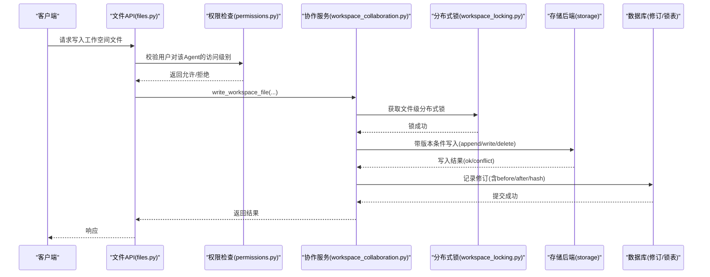

**图示来源** 
- [backend/app/api/files.py:198-220](file://backend/app/api/files.py#L198-L220)
- [backend/app/core/permissions.py:1-554](file://backend/app/core/permissions.py#L1-L554)
- [backend/app/services/workspace_collaboration.py:1-800](file://backend/app/services/workspace_collaboration.py#L1-L800)
- [backend/app/services/workspace_locking.py:1-81](file://backend/app/services/workspace_locking.py#L1-L81)

## 详细组件分析

### 工作空间模型（Workspace）
- 文件修订（WorkspaceFileRevision）：记录 scope_type(scope_id)、path、operation、actor、session、before/after 内容与哈希，支持 agent/group 两种作用域
- 编辑锁（WorkspaceEditLock）：短生命周期的人类编辑锁，包含过期时间、心跳计数，避免人机冲突

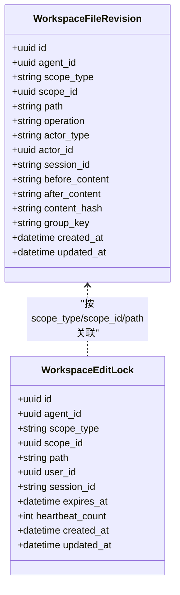

**图示来源** 
- [backend/app/models/workspace.py:1-108](file://backend/app/models/workspace.py#L1-L108)

**章节来源**
- [backend/app/models/workspace.py:1-108](file://backend/app/models/workspace.py#L1-L108)

### 工作空间协作服务（workspace_collaboration）
- 路径规范化与安全校验：防止目录穿越
- 人类编辑锁：获取/释放/查询活跃锁，自动清理过期锁
- 修订记录：支持合并用户自动保存、group runtime prepared/finalize 两阶段提交
- 文件操作：write/append/delete/move，均通过存储后端条件写入并记录修订

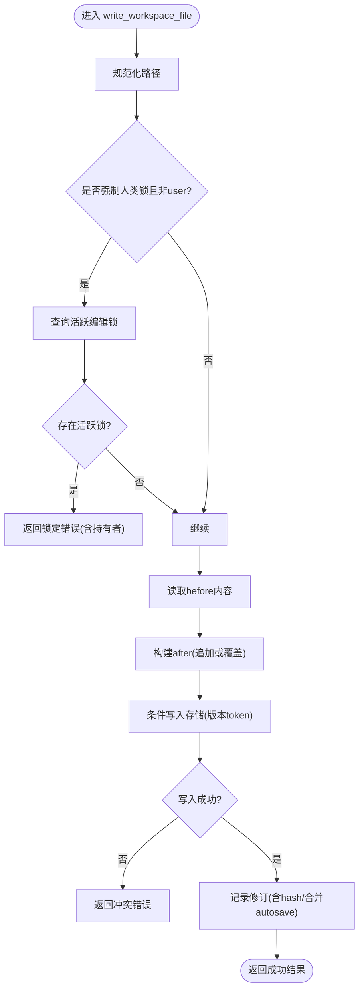

**图示来源** 
- [backend/app/services/workspace_collaboration.py:1-800](file://backend/app/services/workspace_collaboration.py#L1-L800)

**章节来源**
- [backend/app/services/workspace_collaboration.py:1-800](file://backend/app/services/workspace_collaboration.py#L1-L800)

### 工作空间分布式锁（workspace_locking）
- Redis 原子性加锁与按所有者释放脚本
- 上下文管理器批量加锁/释放，保证并发安全

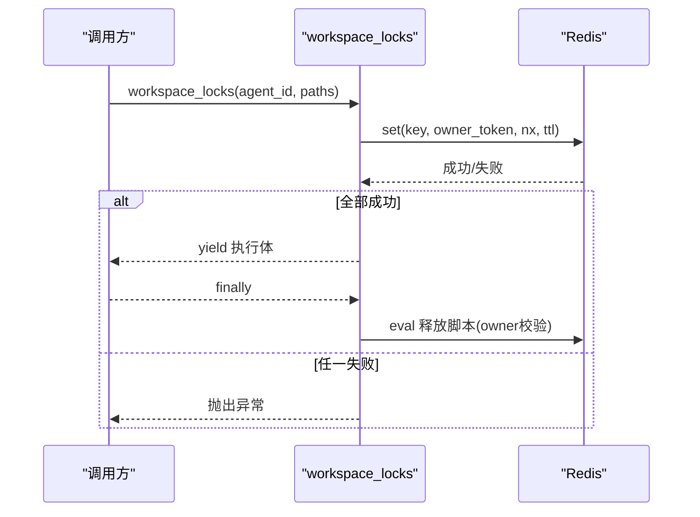

**图示来源** 
- [backend/app/services/workspace_locking.py:1-81](file://backend/app/services/workspace_locking.py#L1-L81)

**章节来源**
- [backend/app/services/workspace_locking.py:1-81](file://backend/app/services/workspace_locking.py#L1-L81)

### 组织模型（Org）
- OrgDepartment：部门树，含 parent_id、path、member_count、status、tenant_id
- OrgMember：成员通用标识（open_id/unionid/external_id）、姓名、邮箱、电话、职位、部门、状态、租户、用户软关联
- AgentRelationship/AgentAgentRelationship：Agent 与成员、Agent 与 Agent 的关系及描述

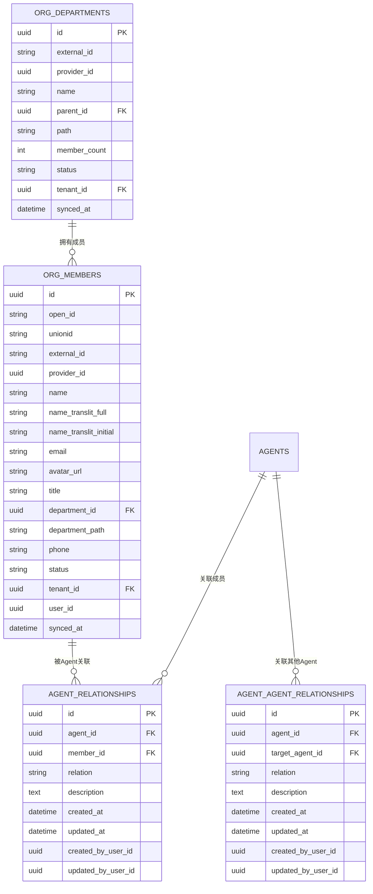

**图示来源** 
- [backend/app/models/org.py:1-98](file://backend/app/models/org.py#L1-L98)

**章节来源**
- [backend/app/models/org.py:1-98](file://backend/app/models/org.py#L1-L98)

### 租户与多租户隔离（Tenant）
- Tenant 作为隔离边界，包含 IM 提供商、配置、默认配额、时区、国家地区、SSO、A2A 异步开关、默认 LLM 模型等
- 用户创建公司（self-create）与加入公司（join）流程由 tenants API 提供

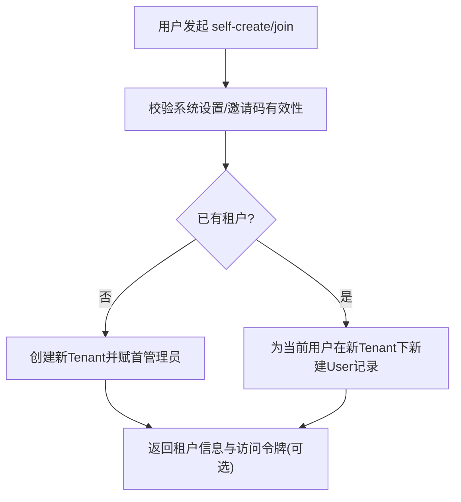

**图示来源** 
- [backend/app/api/tenants.py:1-200](file://backend/app/api/tenants.py#L1-L200)
- [backend/app/models/tenant.py:1-73](file://backend/app/models/tenant.py#L1-L73)

**章节来源**
- [backend/app/api/tenants.py:1-200](file://backend/app/api/tenants.py#L1-L200)
- [backend/app/models/tenant.py:1-73](file://backend/app/models/tenant.py#L1-L73)

### 用户与权限（User & Permissions）
- User/Identity：全局身份与租户内角色（platform_admin/org_admin/agent_admin/member），配额与状态
- 权限策略：基于 Agent 的 access_mode（company/private/custom）与显式权限表（AgentPermission）进行细粒度控制
- 可见性与可用性：评估 Agent 间、Agent 与人之间的可见性与可联系性

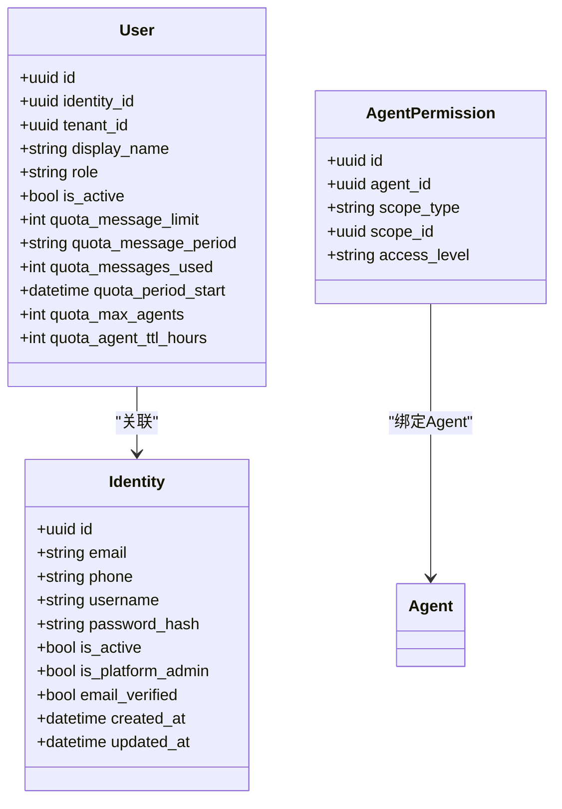

**图示来源** 
- [backend/app/models/user.py:1-119](file://backend/app/models/user.py#L1-L119)
- [backend/app/models/agent.py:1-200](file://backend/app/models/agent.py#L1-L200)
- [backend/app/core/permissions.py:1-554](file://backend/app/core/permissions.py#L1-L554)

**章节来源**
- [backend/app/models/user.py:1-119](file://backend/app/models/user.py#L1-L119)
- [backend/app/core/permissions.py:1-554](file://backend/app/core/permissions.py#L1-L554)

### 组织管理 API（organization）
- 列出用户（可按租户过滤）
- 管理员更新用户资料，并在邮箱/手机变更时同步至 OrgMember

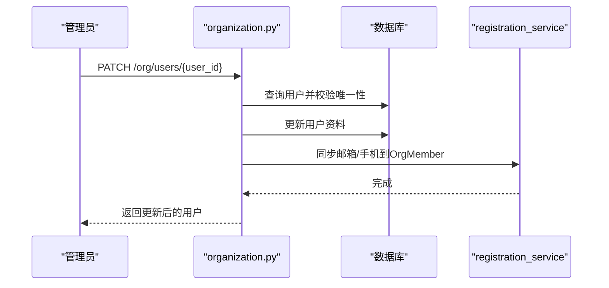

**图示来源** 
- [backend/app/api/organization.py:1-106](file://backend/app/api/organization.py#L1-L106)

**章节来源**
- [backend/app/api/organization.py:1-106](file://backend/app/api/organization.py#L1-L106)

### 文件操作与删除保护（files）
- 删除操作需具备 manage 级别或管理员角色
- 企业可见路径与普通 Agent 路径区分处理

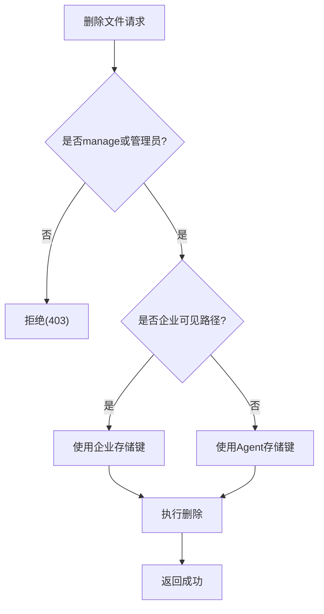

**图示来源** 
- [backend/app/api/files.py:198-220](file://backend/app/api/files.py#L198-L220)

**章节来源**
- [backend/app/api/files.py:198-220](file://backend/app/api/files.py#L198-L220)

## 依赖关系分析
- 模型依赖：User→Identity；Agent→User(tenant_id/creator_id)；OrgMember→OrgDepartment；WorkspaceRevision/EditLock→Agent/User
- 服务依赖：workspace_collaboration→storage_backend、workspace_locking、DB
- API 依赖：organization→User/Identity；tenants→Tenant/User；files→Agent/permissions

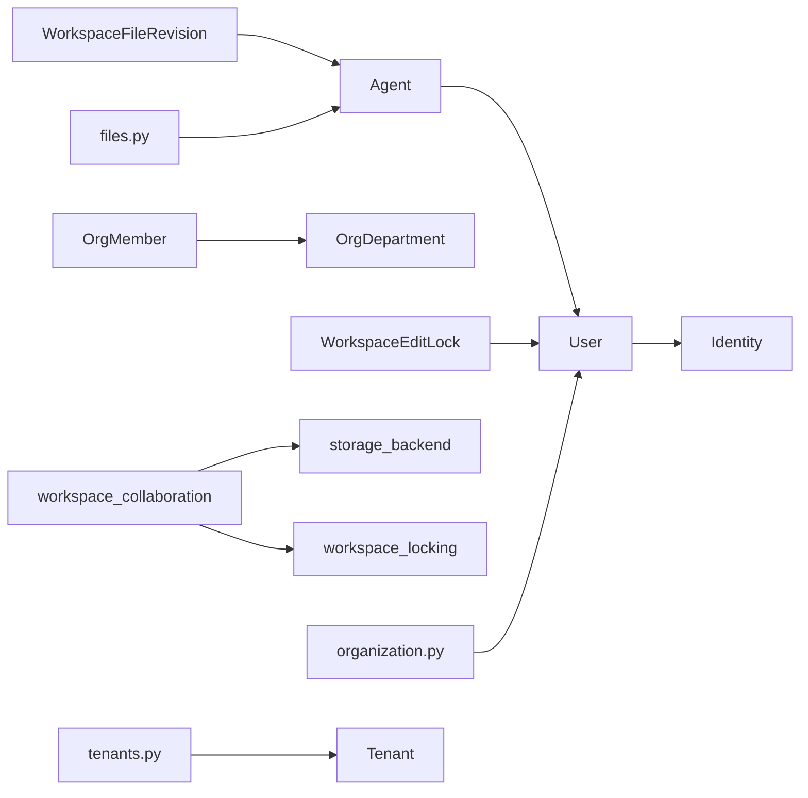

**图示来源** 
- [backend/app/models/user.py:1-119](file://backend/app/models/user.py#L1-L119)
- [backend/app/models/agent.py:1-200](file://backend/app/models/agent.py#L1-L200)
- [backend/app/models/org.py:1-98](file://backend/app/models/org.py#L1-L98)
- [backend/app/models/workspace.py:1-108](file://backend/app/models/workspace.py#L1-L108)
- [backend/app/services/workspace_collaboration.py:1-800](file://backend/app/services/workspace_collaboration.py#L1-L800)
- [backend/app/services/workspace_locking.py:1-81](file://backend/app/services/workspace_locking.py#L1-L81)
- [backend/app/api/organization.py:1-106](file://backend/app/api/organization.py#L1-L106)
- [backend/app/api/tenants.py:1-200](file://backend/app/api/tenants.py#L1-L200)
- [backend/app/api/files.py:198-220](file://backend/app/api/files.py#L198-L220)

**章节来源**
- [backend/app/models/user.py:1-119](file://backend/app/models/user.py#L1-L119)
- [backend/app/models/agent.py:1-200](file://backend/app/models/agent.py#L1-L200)
- [backend/app/models/org.py:1-98](file://backend/app/models/org.py#L1-L98)
- [backend/app/models/workspace.py:1-108](file://backend/app/models/workspace.py#L1-L108)
- [backend/app/services/workspace_collaboration.py:1-800](file://backend/app/services/workspace_collaboration.py#L1-L800)
- [backend/app/services/workspace_locking.py:1-81](file://backend/app/services/workspace_locking.py#L1-L81)
- [backend/app/api/organization.py:1-106](file://backend/app/api/organization.py#L1-L106)
- [backend/app/api/tenants.py:1-200](file://backend/app/api/tenants.py#L1-L200)
- [backend/app/api/files.py:198-220](file://backend/app/api/files.py#L198-L220)

## 性能考量
- 修订合并：用户自动保存在同一 key/time window 内合并，减少冗余历史
- 二进制文件：跳过文本修订记录，仅保留元数据，降低存储压力
- 分布式锁：Redis 原子操作，避免跨进程竞争；批量加锁确保顺序一致
- 版本控制：存储层条件写入（version token）避免覆盖冲突
- 索引优化：对常用查询字段建立索引（如 scope_type/scope_id/path、expires_at、tenant_id）

[本节为通用性能建议，不直接分析具体文件]

## 故障排查指南
- 人类编辑锁冲突：确认是否存在活跃锁，必要时等待或提示用户结束编辑
- 写入冲突：检查 version token 是否过期，重试前重新读取最新内容
- 路径穿越错误：确保路径已规范化，禁止“..”越界
- 权限不足：核查用户角色与 Agent 的 access_mode/权限表
- 组织同步问题：检查邮箱/手机号唯一性约束与同步逻辑

**章节来源**
- [backend/app/services/workspace_collaboration.py:1-800](file://backend/app/services/workspace_collaboration.py#L1-L800)
- [backend/app/core/permissions.py:1-554](file://backend/app/core/permissions.py#L1-L554)
- [backend/app/api/organization.py:1-106](file://backend/app/api/organization.py#L1-L106)

## 结论
Clawith 的工作空间与组织模型以多租户为边界，结合严格的权限策略与协作机制，实现了安全的资源隔离与高效的团队协作。通过修订历史、分布式锁与版本控制，系统在并发场景下保持数据一致性与可追溯性。组织模型支持层级结构与成员管理，配合邀请与角色分配流程，满足企业级需求。

[本节为总结，不直接分析具体文件]

## 附录

### 工作空间创建与成员管理示例（步骤）
- 创建租户：通过 tenants/self-create 创建公司，首个用户成为 org_admin
- 邀请成员：生成邀请码，新用户注册后加入公司并分配角色
- 创建工作空间：在 Agent 下初始化 workspace 目录结构
- 分配权限：根据 access_mode 与 AgentPermission 配置成员使用/管理权限
- 协作编辑：人类编辑时获取编辑锁，Agent 写入遵循锁与版本控制

**章节来源**
- [backend/app/api/tenants.py:1-200](file://backend/app/api/tenants.py#L1-L200)
- [backend/app/core/permissions.py:1-554](file://backend/app/core/permissions.py#L1-L554)
- [backend/app/services/workspace_collaboration.py:1-800](file://backend/app/services/workspace_collaboration.py#L1-L800)

### 多租户数据隔离与安全访问实践
- 所有查询附加 tenant_id 过滤，确保数据隔离
- 敏感操作（删除/移动）要求 manage 级别或管理员角色
- 企业可见路径与普通路径分离，避免越权访问
- 使用 Redis 分布式锁与版本 token 防止并发破坏

**章节来源**
- [backend/app/api/files.py:198-220](file://backend/app/api/files.py#L198-L220)
- [backend/app/services/workspace_locking.py:1-81](file://backend/app/services/workspace_locking.py#L1-L81)
- [backend/app/core/permissions.py:1-554](file://backend/app/core/permissions.py#L1-L554)