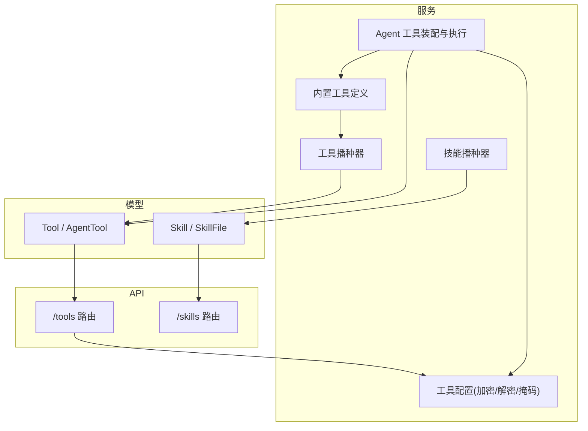
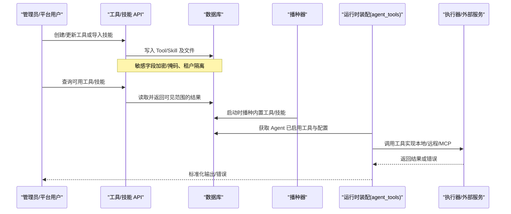
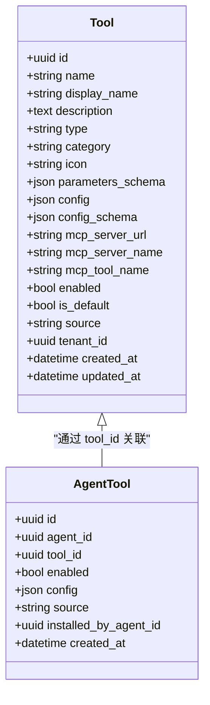
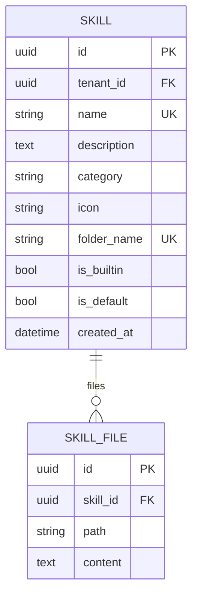
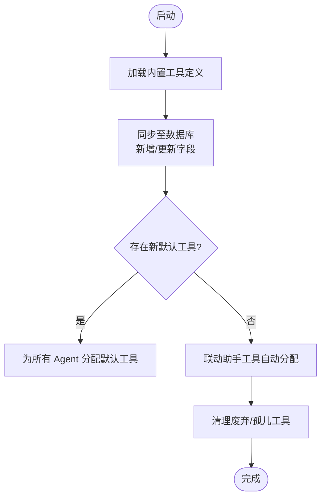
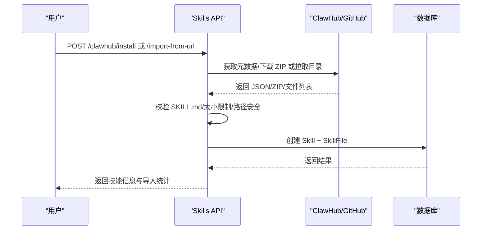
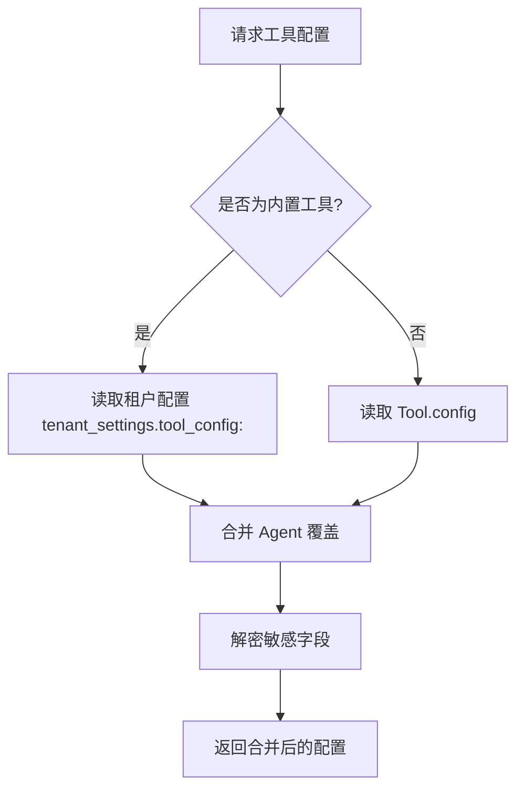
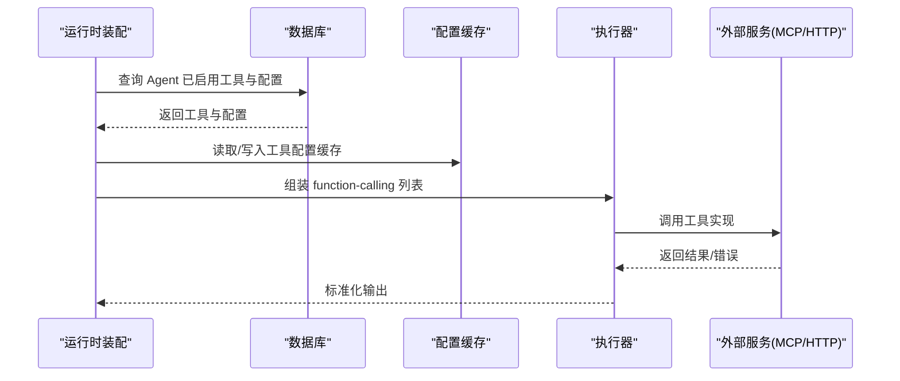
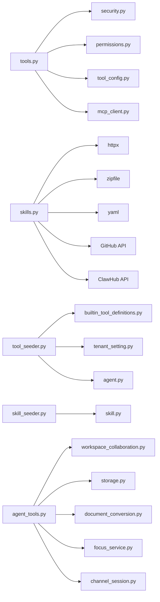

# 工具和技能模型

<cite>
**本文引用的文件**   
- [backend/app/models/tool.py](file://backend/app/models/tool.py)
- [backend/app/models/skill.py](file://backend/app/models/skill.py)
- [backend/app/api/tools.py](file://backend/app/api/tools.py)
- [backend/app/api/skills.py](file://backend/app/api/skills.py)
- [backend/app/services/builtin_tool_definitions.py](file://backend/app/services/builtin_tool_definitions.py)
- [backend/app/services/tool_seeder.py](file://backend/app/services/tool_seeder.py)
- [backend/app/services/tool_config.py](file://backend/app/services/tool_config.py)
- [backend/app/services/agent_tools.py](file://backend/app/services/agent_tools.py)
- [backend/app/services/skill_seeder.py](file://backend/app/services/skill_seeder.py)
</cite>

## 目录
1. [简介](#简介)
2. [项目结构](#项目结构)
3. [核心组件](#核心组件)
4. [架构总览](#架构总览)
5. [详细组件分析](#详细组件分析)
6. [依赖关系分析](#依赖关系分析)
7. [性能考虑](#性能考虑)
8. [故障排查指南](#故障排查指南)
9. [结论](#结论)
10. [附录](#附录)

## 简介
本文件系统化阐述 Clawith 的“工具（Tool）”与“技能（Skill）”模型、API、运行时装配与执行机制，覆盖字段设计、参数校验、执行环境、依赖管理、权限控制、使用统计、故障恢复，以及自定义工具开发、技能包创建与部署实践。读者可据此理解：
- Tool 如何定义能力、参数与配置，并在多租户环境下安全分发；
- Skill 如何以 SKILL.md 为中心组织内容、脚本与示例，支持从 ClawHub/GitHub 导入与版本化；
- 工具与技能的关联、动态加载、沙箱隔离与权限策略；
- 工具调用、结果处理与错误处理的完整流程与最佳实践。

## 项目结构
围绕工具与技能的关键代码分布在以下模块：
- 数据模型：tool.py、skill.py
- API 层：tools.py、skills.py
- 内置定义与播种：builtin_tool_definitions.py、tool_seeder.py、skill_seeder.py
- 配置与安全：tool_config.py
- 运行时装配与执行：agent_tools.py

图表来源
- [backend/app/models/tool.py:13-63](file://backend/app/models/tool.py#L13-L63)
- [backend/app/models/skill.py:13-44](file://backend/app/models/skill.py#L13-L44)
- [backend/app/api/tools.py:195-800](file://backend/app/api/tools.py#L195-L800)
- [backend/app/api/skills.py:24-800](file://backend/app/api/skills.py#L24-L800)
- [backend/app/services/builtin_tool_definitions.py:1-120](file://backend/app/services/builtin_tool_definitions.py#L1-L120)
- [backend/app/services/tool_seeder.py:68-371](file://backend/app/services/tool_seeder.py#L68-L371)
- [backend/app/services/skill_seeder.py:9-120](file://backend/app/services/skill_seeder.py#L9-L120)
- [backend/app/services/tool_config.py:22-161](file://backend/app/services/tool_config.py#L22-L161)
- [backend/app/services/agent_tools.py:752-800](file://backend/app/services/agent_tools.py#L752-L800)

章节来源
- [backend/app/models/tool.py:13-63](file://backend/app/models/tool.py#L13-L63)
- [backend/app/models/skill.py:13-44](file://backend/app/models/skill.py#L13-L44)
- [backend/app/api/tools.py:195-800](file://backend/app/api/tools.py#L195-L800)
- [backend/app/api/skills.py:24-800](file://backend/app/api/skills.py#L24-L800)

## 核心组件
- Tool 与 AgentTool
  - Tool 描述工具元数据、OpenAI 函数式参数 schema、运行时配置与 MCP 信息；支持 builtin/mcp 类型与多租户隔离。
  - AgentTool 为 Agent 与 Tool 的分配表，记录启用状态与按 Agent 的配置覆盖。
- Skill 与 SkillFile
  - Skill 是全局注册的技能包，包含名称、分类、图标、文件夹名与是否内置/默认等属性。
  - SkillFile 存储每个技能包内的文件（如 SKILL.md、scripts/*.py、examples/*）。
- 内置工具定义与播种
  - builtin_tool_definitions.py 提供统一的工具契约（名称、描述、schema、配置 schema、默认值）。
  - tool_seeder.py 在启动时同步内置工具到数据库，并自动为 Agent 分配默认工具。
- 技能播种与导入
  - skill_seeder.py 预置常用技能包（如 Web Research、Data Analysis 等）。
  - skills API 支持从 ClawHub 或 GitHub URL 导入技能包，校验 SKILL.md 并持久化。
- 工具配置与安全
  - tool_config.py 负责敏感字段加密/解密、掩码显示、租户级配置读写。
- 运行时装配与执行
  - agent_tools.py 负责将 DB 中的可用工具装配为 LLM 可用的 function-calling 列表，合并配置、应用权限与可见性规则，并驱动执行。

章节来源
- [backend/app/models/tool.py:13-63](file://backend/app/models/tool.py#L13-L63)
- [backend/app/models/skill.py:13-44](file://backend/app/models/skill.py#L13-L44)
- [backend/app/services/builtin_tool_definitions.py:1-120](file://backend/app/services/builtin_tool_definitions.py#L1-L120)
- [backend/app/services/tool_seeder.py:68-371](file://backend/app/services/tool_seeder.py#L68-L371)
- [backend/app/services/skill_seeder.py:9-120](file://backend/app/services/skill_seeder.py#L9-L120)
- [backend/app/api/skills.py:24-800](file://backend/app/api/skills.py#L24-L800)
- [backend/app/services/tool_config.py:22-161](file://backend/app/services/tool_config.py#L22-L161)
- [backend/app/services/agent_tools.py:752-800](file://backend/app/services/agent_tools.py#L752-L800)

## 架构总览
下图展示工具与技能在系统中的端到端流转：从模型定义、API 暴露、播种初始化、配置管理到运行时装配与执行。

图表来源
- [backend/app/api/tools.py:195-800](file://backend/app/api/tools.py#L195-L800)
- [backend/app/api/skills.py:24-800](file://backend/app/api/skills.py#L24-L800)
- [backend/app/services/tool_seeder.py:68-371](file://backend/app/services/tool_seeder.py#L68-L371)
- [backend/app/services/skill_seeder.py:9-120](file://backend/app/services/skill_seeder.py#L9-L120)
- [backend/app/services/agent_tools.py:752-800](file://backend/app/services/agent_tools.py#L752-L800)

## 详细组件分析

### Tool 模型与 Agent 分配
- 字段设计要点
  - name/display_name/description/type/category/icon：工具标识与展示信息。
  - parameters_schema：OpenAI 函数式参数 schema，用于 LLM 调用前校验与提示。
  - config/config_schema：运行时配置与 UI 表单 schema，支持密码字段加密与掩码。
  - mcp_server_url/mcp_server_name/mcp_tool_name：MCP 工具连接信息。
  - enabled/is_default/source/tenant_id：启用开关、默认分配、来源（builtin/admin/agent）、租户隔离。
- AgentTool 分配
  - 记录 Agent 对工具的启用状态与 per-agent 配置覆盖。
  - 支持系统级工具不可禁用（category=system）保护。
- 可见性与权限
  - 内置工具全局可见；admin 工具受租户边界限制；显式分配的 agent 工具始终可见。
  - OKR Agent 专属工具仅对系统 Agent 可见。
  - Feishu 工具仅在 Agent 具备飞书通道时可见。

图表来源
- [backend/app/models/tool.py:13-63](file://backend/app/models/tool.py#L13-L63)

章节来源
- [backend/app/models/tool.py:13-63](file://backend/app/models/tool.py#L13-L63)
- [backend/app/api/tools.py:55-91](file://backend/app/api/tools.py#L55-L91)
- [backend/app/api/tools.py:362-448](file://backend/app/api/tools.py#L362-L448)

### Skill 模型与文件组织
- 字段设计要点
  - name/folder_name：唯一标识与文件夹名，便于资源定位。
  - description/category/icon：展示与分类信息。
  - is_builtin/is_default：内置与默认标记。
  - files：一对多关系，存储 SKILL.md 与辅助脚本/示例。
- 文件约束
  - 必须包含 SKILL.md，否则视为无效技能包。
  - 支持 ZIP 归档解析与路径前缀剥离，限制总大小。
- 导入来源
  - ClawHub：搜索、详情、安装（下载 ZIP 并解析）。
  - GitHub：URL 导入，递归拉取目录内容，校验 SKILL.md。

图表来源
- [backend/app/models/skill.py:13-44](file://backend/app/models/skill.py#L13-L44)

章节来源
- [backend/app/models/skill.py:13-44](file://backend/app/models/skill.py#L13-L44)
- [backend/app/api/skills.py:111-154](file://backend/app/api/skills.py#L111-L154)
- [backend/app/api/skills.py:344-416](file://backend/app/api/skills.py#L344-L416)

### 内置工具定义与播种
- 内置契约
  - 统一维护工具名称、描述、schema、config_schema、默认值与可见性策略。
  - 支持按引擎拆分搜索工具（DuckDuckGo/Tavily/Exa/Jina 等），并提供专用参数。
- 启动播种
  - 同步内置工具到数据库，修正 is_default 与 config_schema 变更。
  - 自动为新工具分配给已有 Agent，并智能联动相关助手工具（如浏览器截图保存、代码文件读写等）。
  - 清理废弃工具与孤儿 MCP 工具。

图表来源
- [backend/app/services/builtin_tool_definitions.py:1-120](file://backend/app/services/builtin_tool_definitions.py#L1-L120)
- [backend/app/services/tool_seeder.py:68-371](file://backend/app/services/tool_seeder.py#L68-L371)

章节来源
- [backend/app/services/builtin_tool_definitions.py:1-120](file://backend/app/services/builtin_tool_definitions.py#L1-L120)
- [backend/app/services/tool_seeder.py:68-371](file://backend/app/services/tool_seeder.py#L68-L371)

### 技能播种与导入流程
- 内置技能
  - 预置 Web Research、Data Analysis、Content Writing、Competitive Analysis、Meeting Notes、Complex Task Executor、Skill Creator、MCP Tool Installer、Market Data、Financial Calendar 等。
- 导入流程
  - ClawHub：搜索→详情→下载 ZIP→解析文件→校验 SKILL.md→入库。
  - GitHub：解析 URL→递归拉取→校验 SKILL.md→入库。
  - 支持预览导入（不保存），计算文件大小与脚本存在性。

图表来源
- [backend/app/api/skills.py:503-624](file://backend/app/api/skills.py#L503-L624)
- [backend/app/api/skills.py:344-416](file://backend/app/api/skills.py#L344-L416)

章节来源
- [backend/app/services/skill_seeder.py:9-120](file://backend/app/services/skill_seeder.py#L9-L120)
- [backend/app/api/skills.py:503-624](file://backend/app/api/skills.py#L503-L624)

### 工具配置与安全
- 敏感字段
  - 基于 config_schema 中 type=password 与硬编码键集合进行识别。
  - 加密存储于工具配置或租户设置中，读取时解密，UI 显示时掩码。
- 租户级配置
  - 内置工具的公司级配置存储在 tenant_settings 下 key=tool_config:<tool_name>。
  - 非内置工具配置直接保存在 Tool.config。
- 合并优先级
  - Agent 覆盖 > 租户配置（内置）> 全局默认（Tool.config）。

图表来源
- [backend/app/services/tool_config.py:22-161](file://backend/app/services/tool_config.py#L22-L161)
- [backend/app/services/agent_tools.py:248-321](file://backend/app/services/agent_tools.py#L248-L321)

章节来源
- [backend/app/services/tool_config.py:22-161](file://backend/app/services/tool_config.py#L22-L161)
- [backend/app/api/tools.py:751-800](file://backend/app/api/tools.py#L751-L800)

### 运行时装配与执行
- 工具装配
  - 根据 Agent 的启用状态与可见性规则生成 OpenAI function-calling 列表。
  - 动态注入系统核心工具（如 write_file、send_channel_file）与通道工具（如 send_channel_message）。
  - 针对 AgentBay 工具按 OS 类型（windows/linux）动态修补描述与路径示例。
- 执行上下文
  - 工作区路径约定（soul.md、memory、skills、workspace）。
  - 文件操作工具集与二进制扩展名白名单。
  - 缓存工具配置以减少数据库访问。
- 执行隔离
  - 工作区锁与存储后端抽象，确保并发安全与跨环境一致性。
  - MCP 客户端与外部服务调用封装，支持认证模式（Bearer/URL 嵌入密钥）。

图表来源
- [backend/app/services/agent_tools.py:752-800](file://backend/app/services/agent_tools.py#L752-L800)
- [backend/app/services/agent_tools.py:248-321](file://backend/app/services/agent_tools.py#L248-L321)

章节来源
- [backend/app/services/agent_tools.py:752-800](file://backend/app/services/agent_tools.py#L752-L800)
- [backend/app/services/agent_tools.py:248-321](file://backend/app/services/agent_tools.py#L248-L321)

## 依赖关系分析
- 模型依赖
  - Tool/AgentTool 与 Agent、Tenant、TenantSetting 的多租户关联。
  - Skill/SkillFile 的一对多关系，支持级联删除。
- API 依赖
  - tools.py 依赖 security、permissions、tool_config、mcp_client 等。
  - skills.py 依赖 httpx、zipfile、yaml、GitHub/ClawHub 接口。
- 服务依赖
  - tool_seeder.py 依赖 builtin_tool_definitions、tenant_setting、agent。
  - skill_seeder.py 依赖 skill 模型与种子数据。
  - agent_tools.py 依赖 workspace_collaboration、storage、document_conversion、focus_service、channel_session 等。

图表来源
- [backend/app/api/tools.py:1-80](file://backend/app/api/tools.py#L1-L80)
- [backend/app/api/skills.py:1-80](file://backend/app/api/skills.py#L1-L80)
- [backend/app/services/tool_seeder.py:1-80](file://backend/app/services/tool_seeder.py#L1-L80)
- [backend/app/services/skill_seeder.py:1-60](file://backend/app/services/skill_seeder.py#L1-L60)
- [backend/app/services/agent_tools.py:1-120](file://backend/app/services/agent_tools.py#L1-L120)

章节来源
- [backend/app/api/tools.py:1-80](file://backend/app/api/tools.py#L1-L80)
- [backend/app/api/skills.py:1-80](file://backend/app/api/skills.py#L1-L80)
- [backend/app/services/tool_seeder.py:1-80](file://backend/app/services/tool_seeder.py#L1-L80)
- [backend/app/services/skill_seeder.py:1-60](file://backend/app/services/skill_seeder.py#L1-L60)
- [backend/app/services/agent_tools.py:1-120](file://backend/app/services/agent_tools.py#L1-L120)

## 性能考虑
- 配置缓存
  - 工具配置按 (agent_id, tool_name) 缓存，TTL 60 秒，减少频繁 DB 查询。
- 批量操作
  - 工具启用状态批量更新、MCP 服务器凭据批量更新，降低事务开销。
- 资源限制
  - 技能包大小上限（512KB）、ZIP 解压与路径安全检查，防止滥用。
- 异步 I/O
  - API 与服务层广泛使用异步会话与 HTTP 客户端，提升吞吐。
- 索引与查询
  - 模型字段合理索引（如 tenant_id、folder_name），优化常见查询路径。

[本节为通用指导，无需特定文件引用]

## 故障排查指南
- 参数校验失败
  - 现象：工具调用报 INVALID_PARAMETER，JSON 无法反序列化为期望结构。
  - 排查：检查 parameters_schema 与实际传入参数类型是否一致（例如数组 vs 字符串）。
  - 参考：工具定义与 schema 维护位置。
- MCP 授权状态不可用
  - 现象：Smithery 授权状态返回 unavailable 或需要重新授权。
  - 排查：确认 api_key 是否存在、connection_id 与 namespace 是否正确、网络可达性。
  - 参考：MCP 授权状态查询与重试逻辑。
- 技能导入失败
  - 现象：无 SKILL.md、ZIP 损坏、超过大小限制、GitHub 限流。
  - 排查：验证 ZIP 有效性、检查路径安全、确认 GitHub Token 与速率限制。
  - 参考：ClawHub/GitHub 导入流程与异常处理。
- 工具配置未生效
  - 现象：租户配置未覆盖或敏感字段未解密。
  - 排查：确认 config_schema 中 password 字段、加密密钥、租户 ID 正确性。
  - 参考：工具配置合并与加解密逻辑。

章节来源
- [backend/app/api/tools.py:492-571](file://backend/app/api/tools.py#L492-L571)
- [backend/app/api/skills.py:111-154](file://backend/app/api/skills.py#L111-L154)
- [backend/app/services/tool_config.py:22-161](file://backend/app/services/tool_config.py#L22-L161)

## 结论
Clawith 的工具与技能模型以强契约、强安全、强隔离为核心设计原则：
- Tool 通过 OpenAI 函数式 schema 与租户级配置实现灵活而安全的扩展；
- Skill 以 SKILL.md 为中心，支持多源导入与版本化管理；
- 运行时装配与执行兼顾性能与可靠性，提供完善的权限、可见性与错误处理；
- 通过播种器与 API 协同，实现开箱即用与生态扩展。

[本节为总结，无需特定文件引用]

## 附录
- 自定义工具开发建议
  - 在 builtin_tool_definitions.py 中补充工具契约（名称、描述、schema、config_schema、默认值）。
  - 若为 MCP 工具，通过 tools API 创建并配置 server_url、api_key。
  - 使用 tool_config.py 管理敏感字段，确保加密与掩码。
- 技能包创建与部署
  - 准备 SKILL.md（含 frontmatter 元数据）与可选脚本/示例。
  - 通过 /skills/import-from-url 或 /skills/clawhub/install 导入。
  - 验证 SKILL.md 存在性与大小限制，确保路径安全。
- 工具调用与错误处理
  - 遵循 parameters_schema 传递参数，避免类型不匹配。
  - 捕获并上报工具执行错误，结合日志与审计追踪问题根因。
  - 对于 MCP/外部服务，实现重试与降级策略。

[本节为实践指导，无需特定文件引用]