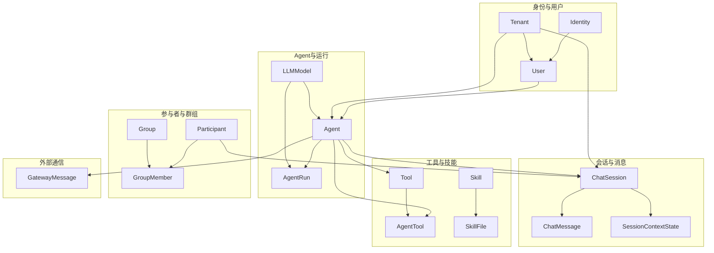
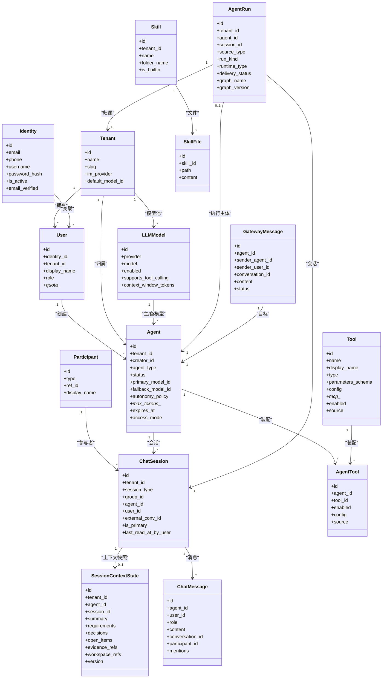
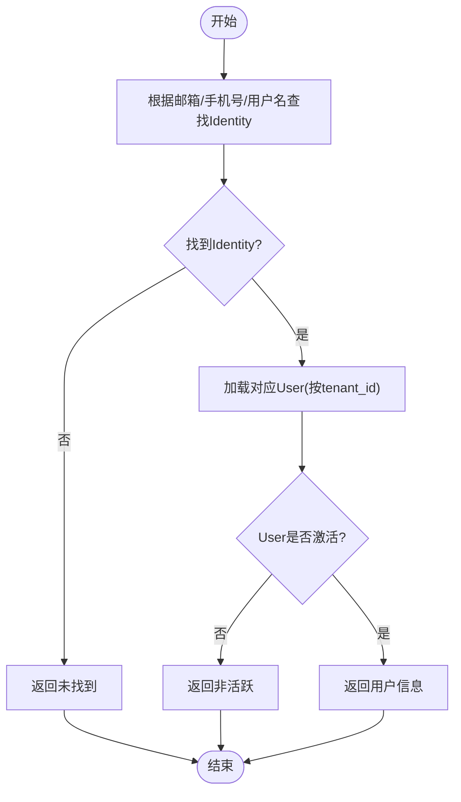
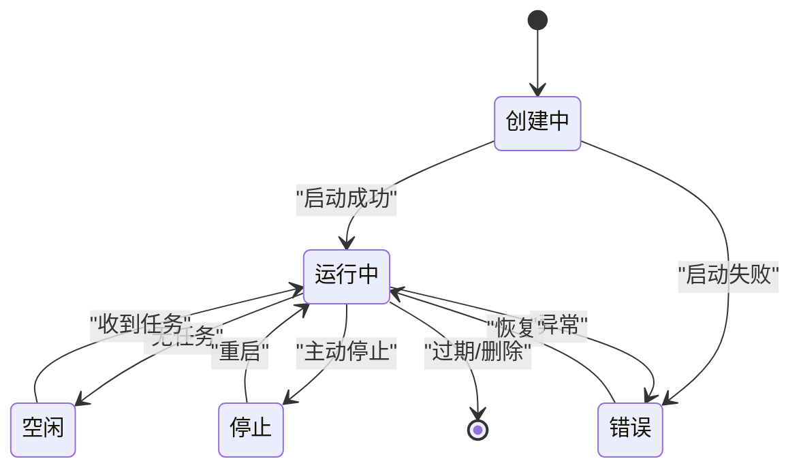
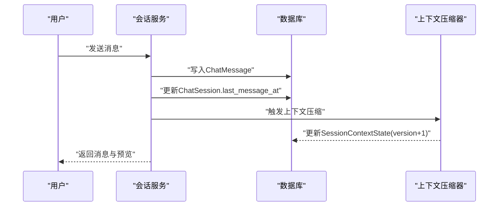
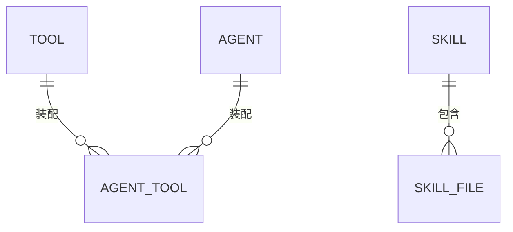
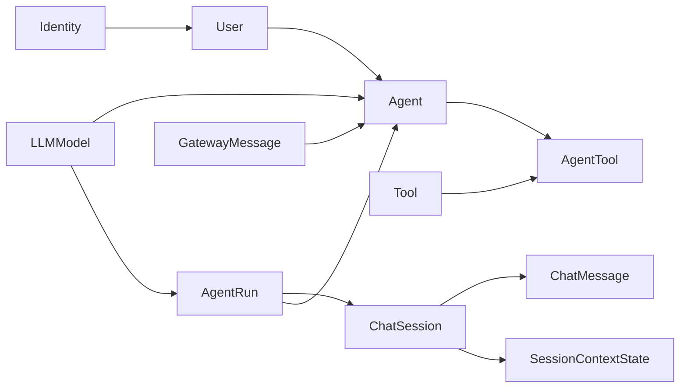

# 核心数据模型

<cite>
**本文引用的文件**
- [backend/app/models/identity.py](file://backend/app/models/identity.py)
- [backend/app/models/user.py](file://backend/app/models/user.py)
- [backend/app/models/agent.py](file://backend/app/models/agent.py)
- [backend/app/models/chat_session.py](file://backend/app/models/chat_session.py)
- [backend/app/models/tool.py](file://backend/app/models/tool.py)
- [backend/app/models/skill.py](file://backend/app/models/skill.py)
- [backend/app/models/participant.py](file://backend/app/models/participant.py)
- [backend/app/models/group.py](file://backend/app/models/group.py)
- [backend/app/models/tenant.py](file://backend/app/models/tenant.py)
- [backend/app/models/session_context_state.py](file://backend/app/models/session_context_state.py)
- [backend/app/models/agent_run.py](file://backend/app/models/agent_run.py)
- [backend/app/models/gateway_message.py](file://backend/app/models/gateway_message.py)
- [backend/app/models/llm.py](file://backend/app/models/llm.py)
- [backend/app/models/audit.py](file://backend/app/models/audit.py)
</cite>

## 目录
1. [简介](#简介)
2. [项目结构](#项目结构)
3. [核心组件](#核心组件)
4. [架构总览](#架构总览)
5. [详细组件分析](#详细组件分析)
6. [依赖关系分析](#依赖关系分析)
7. [性能考虑](#性能考虑)
8. [故障排查指南](#故障排查指南)
9. [结论](#结论)
10. [附录](#附录)

## 简介
本文件面向Clawith后端核心数据模型，系统性阐述用户身份系统（Identity与User）、Agent模型、聊天会话与消息存储、上下文管理、工具与技能模型及其版本与依赖管理。文档包含实体关系图、字段类型定义、业务规则约束、常用查询示例与性能优化建议，帮助读者快速理解并高效使用这些模型。

## 项目结构
- 数据模型位于 backend/app/models 下，按领域划分：身份与会话、Agent与运行、工具与技能、租户与组织等。
- 关键领域文件：
  - 身份与用户：identity.py, user.py
  - Agent与运行：agent.py, agent_run.py, llm.py
  - 会话与消息：chat_session.py, audit.py（ChatMessage）, session_context_state.py
  - 工具与技能：tool.py, skill.py
  - 参与者与群组：participant.py, group.py
  - 租户：tenant.py
  - A2A网关消息：gateway_message.py

图表来源
- [backend/app/models/user.py:16-119](file://backend/app/models/user.py#L16-L119)
- [backend/app/models/agent.py:19-235](file://backend/app/models/agent.py#L19-L235)
- [backend/app/models/chat_session.py:23-116](file://backend/app/models/chat_session.py#L23-L116)
- [backend/app/models/audit.py:46-77](file://backend/app/models/audit.py#L46-L77)
- [backend/app/models/session_context_state.py:25-101](file://backend/app/models/session_context_state.py#L25-L101)
- [backend/app/models/tool.py:13-63](file://backend/app/models/tool.py#L13-L63)
- [backend/app/models/skill.py:13-44](file://backend/app/models/skill.py#L13-L44)
- [backend/app/models/participant.py:13-32](file://backend/app/models/participant.py#L13-L32)
- [backend/app/models/group.py:24-95](file://backend/app/models/group.py#L24-L95)
- [backend/app/models/tenant.py:13-73](file://backend/app/models/tenant.py#L13-L73)
- [backend/app/models/agent_run.py:27-195](file://backend/app/models/agent_run.py#L27-L195)
- [backend/app/models/gateway_message.py:13-38](file://backend/app/models/gateway_message.py#L13-L38)
- [backend/app/models/llm.py:13-80](file://backend/app/models/llm.py#L13-L80)

章节来源
- [backend/app/models/user.py:16-119](file://backend/app/models/user.py#L16-L119)
- [backend/app/models/agent.py:19-235](file://backend/app/models/agent.py#L19-L235)
- [backend/app/models/chat_session.py:23-116](file://backend/app/models/chat_session.py#L23-L116)
- [backend/app/models/audit.py:46-77](file://backend/app/models/audit.py#L46-L77)
- [backend/app/models/session_context_state.py:25-101](file://backend/app/models/session_context_state.py#L25-L101)
- [backend/app/models/tool.py:13-63](file://backend/app/models/tool.py#L13-L63)
- [backend/app/models/skill.py:13-44](file://backend/app/models/skill.py#L13-L44)
- [backend/app/models/participant.py:13-32](file://backend/app/models/participant.py#L13-L32)
- [backend/app/models/group.py:24-95](file://backend/app/models/group.py#L24-L95)
- [backend/app/models/tenant.py:13-73](file://backend/app/models/tenant.py#L13-L73)
- [backend/app/models/agent_run.py:27-195](file://backend/app/models/agent_run.py#L27-L195)
- [backend/app/models/gateway_message.py:13-38](file://backend/app/models/gateway_message.py#L13-L38)
- [backend/app/models/llm.py:13-80](file://backend/app/models/llm.py#L13-L80)

## 核心组件
- 身份系统
  - Identity：全局唯一自然人标识（邮箱、手机号、用户名），跨租户共享登录凭据与状态。
  - User：租户内成员身份，绑定到Identity，承载角色、配额、展示信息等租户上下文。
  - IdentityProvider/SSOScanSession：多认证提供商配置与SSO扫码会话。
- Agent模型
  - Agent：数字员工实例，支持原生与远程OpenClaw两种类型；具备运行时状态、模型配置、自主策略、用量控制、过期与访问模式等。
  - AgentPermission：细粒度访问权限（公司/部门/用户）。
  - AgentTemplate：模板化创建Agent的元数据与默认能力。
  - AgentUserOnboarding：记录每个Agent对用户的引导阶段。
- 聊天会话与消息
  - ChatSession：统一会话（直聊、群聊、A2A、触发器），支持主会话标记、外部会话ID、最后阅读时间等。
  - ChatMessage：统一消息表，角色（user/assistant/system/tool_call）、内容、提及、时间戳等。
  - SessionContextState：会话上下文压缩后的最新摘要、需求、决策、待办、证据与工作区引用，带乐观锁版本。
- 工具与技能
  - Tool：内置或MCP外部工具，含参数Schema、运行时配置、启用开关、来源与租户隔离。
  - AgentTool：Agent与Tool的关联，支持每Agent覆盖配置与安装来源。
  - Skill/SkillFile：技能注册与文件集合（SKILL.md及辅助脚本）。
- 参与者与群组
  - Participant：统一参与者身份（User或Agent），被会话与群组复用。
  - Group/GroupMember：租户级群组与成员角色、加入/移除时间、会话读取状态。
- 租户与模型池
  - Tenant：企业边界，IM提供者、默认配额、时区、A2A异步开关、默认LLM模型等。
  - LLMModel：平台模型池，含能力探测、工具调用能力、上下文窗口与请求超时等。
- 运行与网关
  - AgentRun：不可变执行事实，来源类型、运行种类、调度槽位、投递状态、图名/版本等。
  - GatewayMessage：OpenClaw网关消息队列，生命周期pending→delivered→completed。

章节来源
- [backend/app/models/identity.py:26-67](file://backend/app/models/identity.py#L26-L67)
- [backend/app/models/user.py:16-119](file://backend/app/models/user.py#L16-L119)
- [backend/app/models/agent.py:19-235](file://backend/app/models/agent.py#L19-L235)
- [backend/app/models/chat_session.py:23-116](file://backend/app/models/chat_session.py#L23-L116)
- [backend/app/models/audit.py:46-77](file://backend/app/models/audit.py#L46-L77)
- [backend/app/models/session_context_state.py:25-101](file://backend/app/models/session_context_state.py#L25-L101)
- [backend/app/models/tool.py:13-63](file://backend/app/models/tool.py#L13-L63)
- [backend/app/models/skill.py:13-44](file://backend/app/models/skill.py#L13-L44)
- [backend/app/models/participant.py:13-32](file://backend/app/models/participant.py#L13-L32)
- [backend/app/models/group.py:24-95](file://backend/app/models/group.py#L24-L95)
- [backend/app/models/tenant.py:13-73](file://backend/app/models/tenant.py#L13-L73)
- [backend/app/models/agent_run.py:27-195](file://backend/app/models/agent_run.py#L27-L195)
- [backend/app/models/gateway_message.py:13-38](file://backend/app/models/gateway_message.py#L13-L38)
- [backend/app/models/llm.py:13-80](file://backend/app/models/llm.py#L13-L80)

## 架构总览
下图展示了核心实体之间的关系与主要数据流，包括身份分离、会话与消息、上下文压缩、Agent运行与模型选择、工具与技能装配。

图表来源
- [backend/app/models/tenant.py:13-73](file://backend/app/models/tenant.py#L13-L73)
- [backend/app/models/user.py:16-119](file://backend/app/models/user.py#L16-L119)
- [backend/app/models/agent.py:19-235](file://backend/app/models/agent.py#L19-L235)
- [backend/app/models/llm.py:13-80](file://backend/app/models/llm.py#L13-L80)
- [backend/app/models/participant.py:13-32](file://backend/app/models/participant.py#L13-L32)
- [backend/app/models/chat_session.py:23-116](file://backend/app/models/chat_session.py#L23-L116)
- [backend/app/models/audit.py:46-77](file://backend/app/models/audit.py#L46-L77)
- [backend/app/models/session_context_state.py:25-101](file://backend/app/models/session_context_state.py#L25-L101)
- [backend/app/models/tool.py:13-63](file://backend/app/models/tool.py#L13-L63)
- [backend/app/models/skill.py:13-44](file://backend/app/models/skill.py#L13-L44)
- [backend/app/models/agent_run.py:27-195](file://backend/app/models/agent_run.py#L27-L195)
- [backend/app/models/gateway_message.py:13-38](file://backend/app/models/gateway_message.py#L13-L38)

## 详细组件分析

### 用户身份系统（Identity与User）
- 设计要点
  - Identity为全局唯一自然人标识，提供邮箱、手机、用户名等登录维度，以及密码哈希与验证状态。
  - User为租户内成员，通过identity_id与Identity关联，承载显示名、头像、职位、角色、配额等租户上下文。
  - association_proxy将Identity字段代理到User，保持向后兼容。
- 业务规则
  - email/phone/username在Identity层全局唯一。
  - User的role枚举限制平台管理员、组织管理员、Agent管理员与普通成员。
  - 配额字段用于限制消息与Agent数量/TTL等。
- 常用查询
  - 根据邮箱查找用户：先查Identity再关联User。
  - 获取某租户所有活跃成员：过滤User.tenant_id与is_active。
  - 统计各角色人数：按User.role分组计数。

图表来源
- [backend/app/models/user.py:16-119](file://backend/app/models/user.py#L16-L119)

章节来源
- [backend/app/models/user.py:16-119](file://backend/app/models/user.py#L16-L119)
- [backend/app/models/identity.py:26-67](file://backend/app/models/identity.py#L26-L67)

### Agent模型（字段、状态与生命周期）
- 字段设计
  - 基础信息：名称、头像、角色描述、简介、欢迎语。
  - 所有权：creator_id、tenant_id。
  - 类型与网关：agent_type（native/openclaw）、api_key_hash、openclaw_last_seen。
  - 运行时：status（creating/running/idle/stopped/error）、容器信息。
  - 模型：primary_model_id、fallback_model_id。
  - 自主策略：JSON格式的autonomy_policy。
  - 用量控制：每日/每月token上限与已用、缓存读写计数、上下文窗口大小、最大轮次。
  - 触发器限制：max_triggers、min_poll_interval_min、webhook_rate_limit。
  - 过期控制：expires_at、is_expired。
  - 系统标志：is_system（系统Agent不可删除）。
  - 访问模式：access_mode（company/private/custom）与公司访问级别。
  - LLM调用限制：llm_calls_today、max_llm_calls_per_day、重置时间。
  - 心跳：heartbeat_enabled/interval_hours/active_hours/last_heartbeat_at。
  - 时区：timezone。
  - 审计字段：created_at/updated_at/last_active_at/deleted_at。
- 状态管理与生命周期
  - 状态机：创建→运行→空闲/停止/错误；结合心跳与最后活跃时间判断在线性。
  - 过期与软删除：expires_at与deleted_at配合清理。
  - 模板与引导：template_id与AgentUserOnboarding跟踪首次交互。
- 常用查询
  - 按租户列出活跃Agent：WHERE tenant_id=? AND deleted_at IS NULL AND status IN ('running','idle')。
  - 统计各状态Agent数量：GROUP BY status。
  - 查找最近活跃的Agent：ORDER BY last_active_at DESC LIMIT N。

图表来源
- [backend/app/models/agent.py:19-235](file://backend/app/models/agent.py#L19-L235)

章节来源
- [backend/app/models/agent.py:19-235](file://backend/app/models/agent.py#L19-L235)

### 聊天会话模型（数据结构、消息存储与上下文管理）
- 数据结构
  - ChatSession：统一会话，支持直聊/群聊/A2A/触发器；external_conv_id用于跨渠道可靠定位；is_primary标记主会话；last_read_at_by_user用于未读计算。
  - ChatMessage：统一消息，role区分用户/助手/系统/工具调用；conversation_id关联会话；participant_id统一参与者；mentions支持@。
  - SessionContextState：会话上下文压缩快照，包含摘要、需求、决策、待办、证据与工作区引用；version用于乐观锁更新。
- 业务规则
  - 会话类型受CheckConstraint约束。
  - 主会话唯一性由部分唯一索引保障。
  - 上下文状态与会话强关联，删除会话时级联删除。
- 常用查询
  - 获取会话历史消息：WHERE conversation_id=? ORDER BY created_at ASC。
  - 获取最近N条消息：LIMIT N。
  - 计算未读消息数：WHERE created_at > last_read_at_by_user。
  - 上下文快照：按session_id取最新version。

图表来源
- [backend/app/models/chat_session.py:23-116](file://backend/app/models/chat_session.py#L23-L116)
- [backend/app/models/audit.py:46-77](file://backend/app/models/audit.py#L46-L77)
- [backend/app/models/session_context_state.py:25-101](file://backend/app/models/session_context_state.py#L25-L101)

章节来源
- [backend/app/models/chat_session.py:23-116](file://backend/app/models/chat_session.py#L23-L116)
- [backend/app/models/audit.py:46-77](file://backend/app/models/audit.py#L46-L77)
- [backend/app/models/session_context_state.py:25-101](file://backend/app/models/session_context_state.py#L25-L101)

### 工具与技能模型（关系、版本与依赖）
- 关系设计
  - Tool：定义工具元数据、参数Schema、运行时配置、MCP服务器信息、启用与默认标记、来源与租户隔离。
  - AgentTool：Agent与Tool的多对多关联，支持每Agent覆盖配置与安装来源。
  - Skill/SkillFile：技能包由多个文件组成，SKILL.md为核心说明，辅助脚本可独立存在。
- 版本与依赖
  - Tool的parameters_schema与config/config_schema实现参数与UI配置的版本化管理。
  - AgentTemplate的default_skills与default_mcp_servers在新建Agent时自动导入与绑定。
  - Skill文件路径与内容变更通过SkillFile记录，便于回滚与追踪。
- 常用查询
  - 列出可用工具：WHERE enabled=true且source在允许范围。
  - 查看Agent已启用工具：JOIN AgentTool WHERE agent_id=? AND enabled=true。
  - 获取技能文件：WHERE skill_id=? ORDER BY path。

图表来源
- [backend/app/models/tool.py:13-63](file://backend/app/models/tool.py#L13-L63)
- [backend/app/models/skill.py:13-44](file://backend/app/models/skill.py#L13-L44)

章节来源
- [backend/app/models/tool.py:13-63](file://backend/app/models/tool.py#L13-L63)
- [backend/app/models/skill.py:13-44](file://backend/app/models/skill.py#L13-L44)

### 参与者与群组（统一身份与协作）
- Participant：统一User/Agent身份，供会话与群组复用。
- Group/GroupMember：租户级群组与成员角色（manager/member），记录加入/移除时间与会话读取状态。
- 常用查询
  - 获取群组成员：WHERE group_id=? JOIN GroupMember。
  - 获取会话参与者：WHERE participant_id=?。

章节来源
- [backend/app/models/participant.py:13-32](file://backend/app/models/participant.py#L13-L32)
- [backend/app/models/group.py:24-95](file://backend/app/models/group.py#L24-L95)

### 租户与模型池（多租户隔离与模型能力）
- Tenant：企业边界，IM提供者、默认配额、时区、A2A异步开关、默认LLM模型等。
- LLMModel：平台模型池，含能力探测、工具调用能力、上下文窗口与请求超时等。
- 常用查询
  - 获取租户默认模型：SELECT default_model_id FROM tenants WHERE id=?。
  - 列出可用模型：WHERE enabled=true AND tenant_id=?。

章节来源
- [backend/app/models/tenant.py:13-73](file://backend/app/models/tenant.py#L13-L73)
- [backend/app/models/llm.py:13-80](file://backend/app/models/llm.py#L13-L80)

### 运行与网关（不可变执行事实与A2A消息）
- AgentRun：不可变执行事实，记录来源类型、运行种类、调度槽位、投递状态、图名/版本等；与租户、Agent、会话、模型建立外键关系。
- GatewayMessage：OpenClaw网关消息队列，生命周期pending→delivered→completed，用于A2A异步通信。
- 常用查询
  - 按会话查询执行历史：WHERE session_id=? ORDER BY created_at DESC。
  - 查询待投递消息：WHERE status='pending'。

章节来源
- [backend/app/models/agent_run.py:27-195](file://backend/app/models/agent_run.py#L27-L195)
- [backend/app/models/gateway_message.py:13-38](file://backend/app/models/gateway_message.py#L13-L38)

## 依赖关系分析
- 耦合与内聚
  - Identity与User解耦，通过外键与association_proxy保持兼容性。
  - ChatSession与ChatMessage松耦合，通过conversation_id与participant_id关联。
  - Agent与Tool通过AgentTool解耦，支持动态装配与覆盖。
- 外部依赖
  - LLMModel与Agent/AgentRun形成模型选择与执行链路。
  - GatewayMessage与Agent形成A2A通道。
- 潜在循环依赖
  - 通过延迟导入与forward reference避免循环引用（如User→Agent、Agent→Task等）。

图表来源
- [backend/app/models/user.py:16-119](file://backend/app/models/user.py#L16-L119)
- [backend/app/models/agent.py:19-235](file://backend/app/models/agent.py#L19-L235)
- [backend/app/models/tool.py:13-63](file://backend/app/models/tool.py#L13-L63)
- [backend/app/models/chat_session.py:23-116](file://backend/app/models/chat_session.py#L23-L116)
- [backend/app/models/audit.py:46-77](file://backend/app/models/audit.py#L46-L77)
- [backend/app/models/session_context_state.py:25-101](file://backend/app/models/session_context_state.py#L25-L101)
- [backend/app/models/agent_run.py:27-195](file://backend/app/models/agent_run.py#L27-L195)
- [backend/app/models/llm.py:13-80](file://backend/app/models/llm.py#L13-L80)
- [backend/app/models/gateway_message.py:13-38](file://backend/app/models/gateway_message.py#L13-L38)

章节来源
- [backend/app/models/user.py:16-119](file://backend/app/models/user.py#L16-L119)
- [backend/app/models/agent.py:19-235](file://backend/app/models/agent.py#L19-L235)
- [backend/app/models/chat_session.py:23-116](file://backend/app/models/chat_session.py#L23-L116)
- [backend/app/models/audit.py:46-77](file://backend/app/models/audit.py#L46-L77)
- [backend/app/models/session_context_state.py:25-101](file://backend/app/models/session_context_state.py#L25-L101)
- [backend/app/models/tool.py:13-63](file://backend/app/models/tool.py#L13-L63)
- [backend/app/models/agent_run.py:27-195](file://backend/app/models/agent_run.py#L27-L195)
- [backend/app/models/llm.py:13-80](file://backend/app/models/llm.py#L13-L80)
- [backend/app/models/gateway_message.py:13-38](file://backend/app/models/gateway_message.py#L13-L38)

## 性能考虑
- 索引与约束
  - ChatSession：针对tenant_id、group_id、created_at、is_primary等建立索引；部分唯一索引保障主会话唯一性。
  - ChatMessage：conversation_id与created_at索引加速历史查询。
  - SessionContextState：按tenant_id、agent_id、updated_at降序索引提升上下文检索性能。
  - Agent：按tenant_id与created_at建立条件索引（排除软删除）。
  - LLMModel：按tenant_id与created_at条件索引。
- 查询优化
  - 使用分页与游标（after=created_at,id）避免深翻页。
  - 按需加载关联（selectin/eager）避免N+1问题。
  - 对大文本字段（content/bio）避免全表扫描，必要时分表或归档。
- 并发与一致性
  - SessionContextState使用version乐观锁防止并发覆盖。
  - AgentRun与GatewayMessage通过状态机与唯一约束保证幂等与顺序。

[本节为通用指导，不直接分析具体文件]

## 故障排查指南
- 常见问题
  - 会话未读计数异常：检查last_read_at_by_user是否正确更新。
  - 上下文压缩失败：核对SessionContextState.version递增与覆盖逻辑。
  - 工具装配失败：确认AgentTool.enabled与Tool.enabled一致。
  - A2A消息丢失：检查GatewayMessage.status流转与重试策略。
- 诊断步骤
  - 查看相关表的索引与约束是否生效。
  - 检查事务提交与flush时机。
  - 核对外键关系与级联删除行为。

章节来源
- [backend/app/models/chat_session.py:23-116](file://backend/app/models/chat_session.py#L23-L116)
- [backend/app/models/session_context_state.py:25-101](file://backend/app/models/session_context_state.py#L25-L101)
- [backend/app/models/tool.py:13-63](file://backend/app/models/tool.py#L13-L63)
- [backend/app/models/gateway_message.py:13-38](file://backend/app/models/gateway_message.py#L13-L38)

## 结论
Clawith的核心数据模型以多租户隔离为基础，通过Identity/User分离实现全局身份与租户身份的解耦；Agent模型提供丰富的运行时与用量控制能力；统一的会话与消息模型支撑多渠道与A2A场景；工具与技能模型支持动态装配与版本化管理；上下文压缩与不可变执行事实确保系统的一致性与可观测性。合理运用索引与约束、分页与游标、乐观锁与状态机，可在高并发与大数据量下保持稳定性能。

[本节为总结，不直接分析具体文件]

## 附录
- 常用查询示例（概念性）
  - 获取租户活跃Agent列表：按tenant_id过滤并按last_active_at排序。
  - 会话历史消息：按conversation_id与created_at分页。
  - 上下文快照：按session_id取最新version。
  - 工具装配：按agent_id与enabled筛选。
  - 执行历史：按session_id与created_at倒序。
- 字段类型定义与约束
  - UUID主键、字符串长度限制、布尔默认值、JSON/JSONB灵活存储。
  - CheckConstraint与UniqueConstraint保障业务规则与数据完整性。
- 最佳实践
  - 避免在大字段上建立索引。
  - 使用部分唯一索引处理NULL值场景。
  - 对高频查询字段建立复合索引。
  - 使用事务与幂等键保证一致性。

[本节为补充信息，不直接分析具体文件]