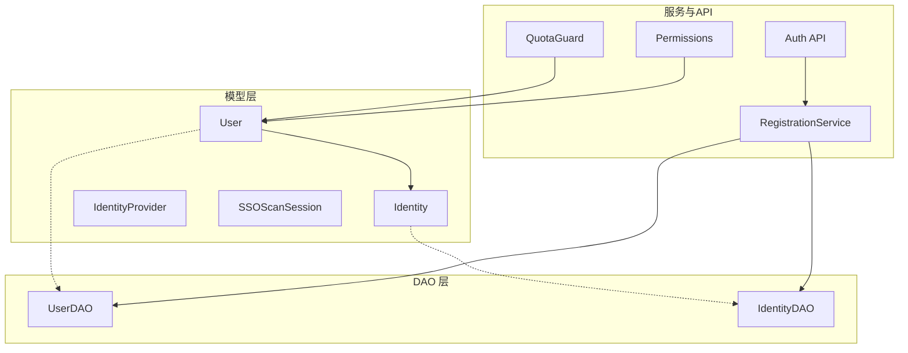
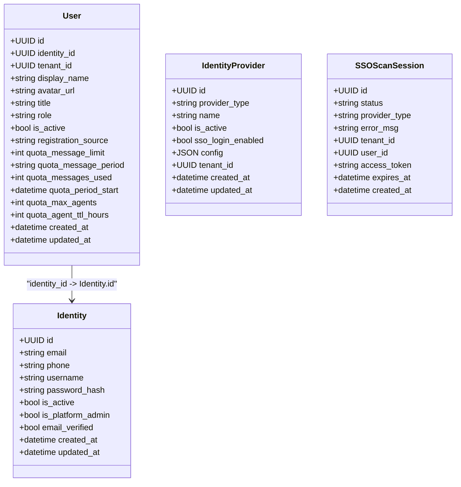
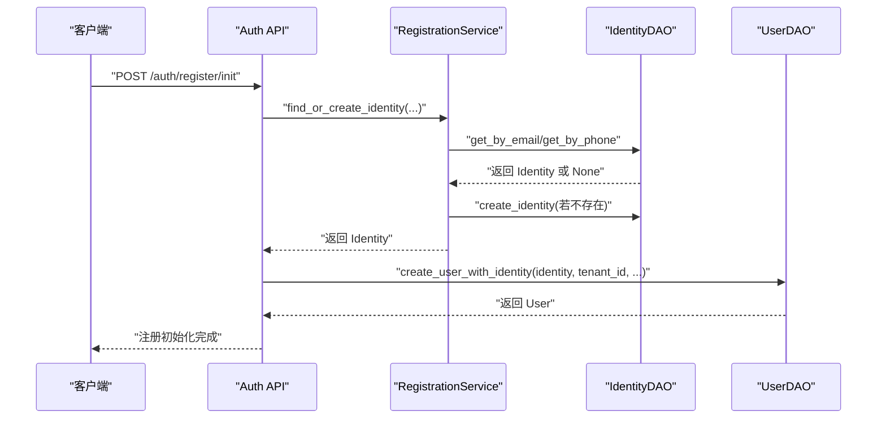
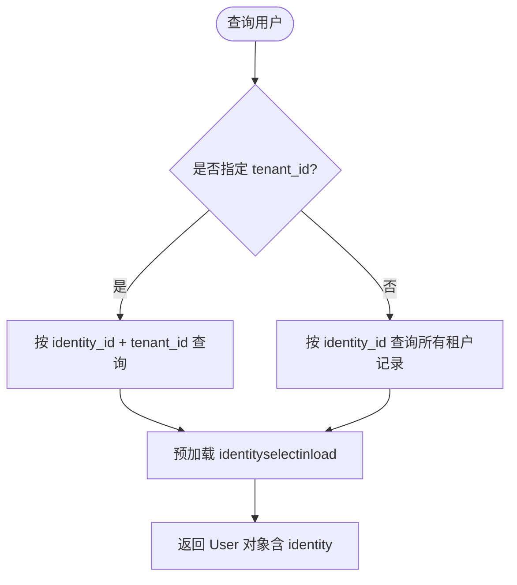
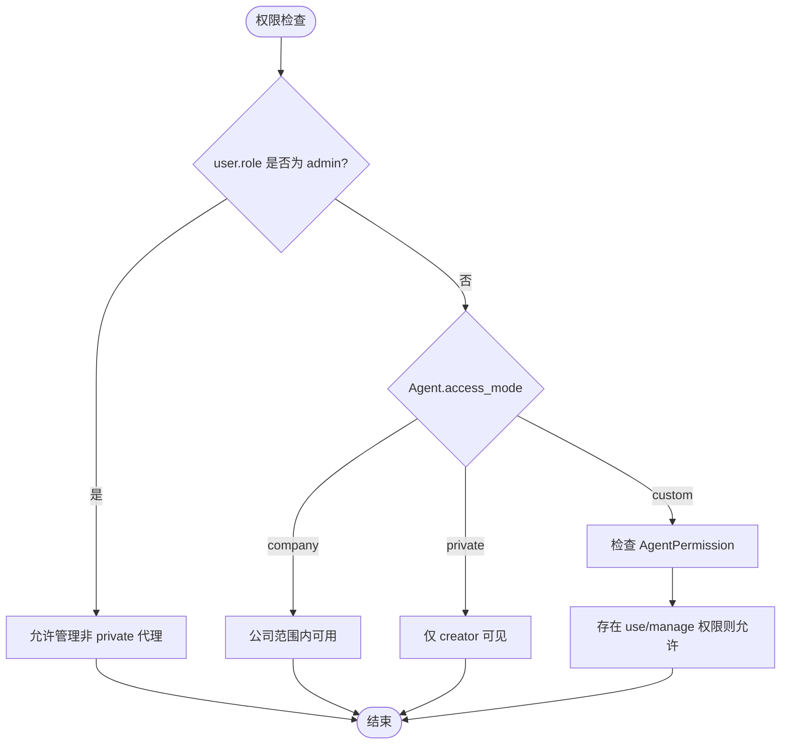
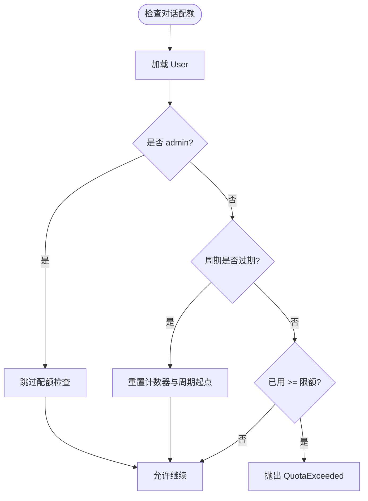
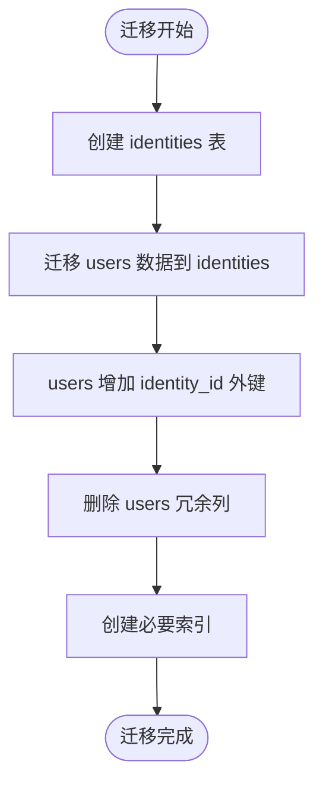
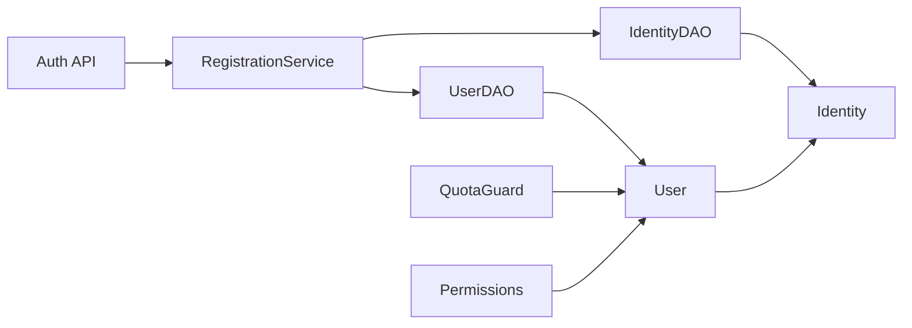

# 用户身份模型

<cite>
**本文引用的文件**
- [backend/app/models/user.py](file://backend/app/models/user.py)
- [backend/app/models/identity.py](file://backend/app/models/identity.py)
- [backend/app/dao/identity_dao.py](file://backend/app/dao/identity_dao.py)
- [backend/app/dao/user_dao.py](file://backend/app/dao/user_dao.py)
- [backend/alembic/versions/028_refactor_user_system_phase2.py](file://backend/alembic/versions/028_refactor_user_system_phase2.py)
- [backend/alembic/versions/024_user_refactor.py](file://backend/alembic/versions/024_user_refactor.py)
- [backend/alembic/versions/002_add_quota_fields.py](file://backend/alembic/versions/002_add_quota_fields.py)
- [backend/app/core/permissions.py](file://backend/app/core/permissions.py)
- [backend/app/services/quota_guard.py](file://backend/app/services/quota_guard.py)
- [backend/app/api/auth.py](file://backend/app/api/auth.py)
- [backend/app/services/registration_service.py](file://backend/app/services/registration_service.py)
</cite>

## 目录
1. [简介](#简介)
2. [项目结构](#项目结构)
3. [核心组件](#核心组件)
4. [架构总览](#架构总览)
5. [详细组件分析](#详细组件分析)
6. [依赖关系分析](#依赖关系分析)
7. [性能考虑](#性能考虑)
8. [故障排查指南](#故障排查指南)
9. [结论](#结论)
10. [附录](#附录)

## 简介
本文件为 Clawith 用户身份系统的权威文档，围绕 Identity 与 User 双表设计模式展开，阐述“全局身份”与“租户身份”的分离策略、认证机制、角色权限体系（platform_admin、org_admin、agent_admin、member）、使用配额控制、两表关系映射、数据同步机制以及向后兼容的 association_proxy 设计。同时提供实体关系图、字段类型定义、业务规则约束、常用查询示例与性能优化建议，帮助读者快速理解并正确使用该身份系统。

## 项目结构
与用户身份相关的代码主要分布在以下模块：
- 模型层：Identity、User、IdentityProvider、SSOScanSession
- DAO 层：IdentityDAO、UserDAO
- 迁移脚本：用户系统重构、配额字段、索引优化等
- 权限与配额：RBAC 权限检查、配额守卫
- API 与服务：注册流程、认证入口、多租户检测与绑定

图表来源
- [backend/app/models/user.py:16-119](file://backend/app/models/user.py#L16-L119)
- [backend/app/models/identity.py:26-67](file://backend/app/models/identity.py#L26-L67)
- [backend/app/dao/user_dao.py:10-95](file://backend/app/dao/user_dao.py#L10-L95)
- [backend/app/dao/identity_dao.py:11-83](file://backend/app/dao/identity_dao.py#L11-L83)
- [backend/app/services/registration_service.py:32-198](file://backend/app/services/registration_service.py#L32-L198)
- [backend/app/api/auth.py:114-200](file://backend/app/api/auth.py#L114-L200)
- [backend/app/services/quota_guard.py:30-83](file://backend/app/services/quota_guard.py#L30-L83)
- [backend/app/core/permissions.py:258-260](file://backend/app/core/permissions.py#L258-L260)

章节来源
- [backend/app/models/user.py:16-119](file://backend/app/models/user.py#L16-L119)
- [backend/app/models/identity.py:26-67](file://backend/app/models/identity.py#L26-L67)
- [backend/app/dao/user_dao.py:10-95](file://backend/app/dao/user_dao.py#L10-L95)
- [backend/app/dao/identity_dao.py:11-83](file://backend/app/dao/identity_dao.py#L11-L83)
- [backend/app/services/registration_service.py:32-198](file://backend/app/services/registration_service.py#L32-L198)
- [backend/app/api/auth.py:114-200](file://backend/app/api/auth.py#L114-L200)
- [backend/app/services/quota_guard.py:30-83](file://backend/app/services/quota_guard.py#L30-L83)
- [backend/app/core/permissions.py:258-260](file://backend/app/core/permissions.py#L258-L260)

## 核心组件
- Identity（全局身份）
  - 作用：跨租户唯一标识自然人，承载登录凭据与全局状态
  - 关键字段：email、phone、username（均唯一）、password_hash、is_active、is_platform_admin、email_verified、时间戳
  - 关系：与 User 一对多（一个 Identity 可对应多个租户中的 User）
- User（租户身份）
  - 作用：在特定租户内的成员身份，包含显示名、头像、职位、角色、活跃状态、注册来源、配额等
  - 关键字段：identity_id（外键到 Identity）、tenant_id、display_name、avatar_url、title、role、is_active、registration_source、各类 quota_* 字段
  - 关系：通过 identity 关联 Identity；通过 tenant_id 限定租户上下文
- IdentityProvider / SSOScanSession
  - 作用：外部身份提供方配置与临时 SSO 扫码会话记录，采用软耦合（无强外键）

章节来源
- [backend/app/models/user.py:16-119](file://backend/app/models/user.py#L16-L119)
- [backend/app/models/identity.py:26-67](file://backend/app/models/identity.py#L26-L67)

## 架构总览
下图展示 Identity 与 User 的双表关系及关键交互路径：注册时先创建或查找 Identity，再创建租户级 User；认证时通过 Identity 校验凭据，随后定位 User 以获取租户上下文与权限。

图表来源
- [backend/app/models/user.py:16-119](file://backend/app/models/user.py#L16-L119)
- [backend/app/models/identity.py:26-67](file://backend/app/models/identity.py#L26-L67)

## 详细组件分析

### Identity 表设计与认证机制
- 字段设计要点
  - 唯一性：email、phone、username 均为全局唯一，确保跨租户身份不冲突
  - 认证：password_hash 用于密码认证；email_verified 表示邮箱验证状态
  - 平台管理员：is_platform_admin 标记是否为平台管理员
- 认证流程
  - 登录识别：支持按 email、phone、username 任一标识查找 Identity
  - 密码校验：通过安全模块进行哈希比对
  - 多租户选择：认证成功后根据 identity 查找其在目标租户的 User 记录，进入租户上下文

图表来源
- [backend/app/api/auth.py:114-200](file://backend/app/api/auth.py#L114-L200)
- [backend/app/services/registration_service.py:96-198](file://backend/app/services/registration_service.py#L96-L198)
- [backend/app/dao/identity_dao.py:17-83](file://backend/app/dao/identity_dao.py#L17-L83)
- [backend/app/dao/user_dao.py:16-95](file://backend/app/dao/user_dao.py#L16-L95)

章节来源
- [backend/app/models/user.py:16-47](file://backend/app/models/user.py#L16-L47)
- [backend/app/dao/identity_dao.py:17-83](file://backend/app/dao/identity_dao.py#L17-L83)
- [backend/app/api/auth.py:114-200](file://backend/app/api/auth.py#L114-L200)
- [backend/app/services/registration_service.py:96-198](file://backend/app/services/registration_service.py#L96-L198)

### User 表与租户上下文管理
- 字段设计要点
  - 租户隔离：tenant_id 限定用户所属租户
  - 角色权限：role 枚举包括 platform_admin、org_admin、agent_admin、member
  - 个人资料：display_name、avatar_url、title
  - 配额控制：quota_message_limit、quota_message_period、quota_messages_used、quota_period_start、quota_max_agents、quota_agent_ttl_hours
- 关联 Identity
  - identity_id 指向 Identity.id，实现全局身份与租户身份的解耦
  - 通过 relationship 与 association_proxy 向后兼容旧接口（如 email、username、password_hash、email_verified、primary_mobile）

图表来源
- [backend/app/dao/user_dao.py:16-95](file://backend/app/dao/user_dao.py#L16-L95)
- [backend/app/models/user.py:99-112](file://backend/app/models/user.py#L99-L112)

章节来源
- [backend/app/models/user.py:52-119](file://backend/app/models/user.py#L52-L119)
- [backend/app/dao/user_dao.py:16-95](file://backend/app/dao/user_dao.py#L16-L95)

### 角色权限体系（RBAC）
- 角色定义与作用域
  - platform_admin：平台管理员，拥有最高权限
  - org_admin：组织管理员，对组织内资源有管理权限
  - agent_admin：代理管理员，对代理相关资源有管理权限
  - member：普通成员
- 权限判断逻辑
  - _is_admin(user) 判定 admin 角色（platform_admin、org_admin）
  - 基于 Agent 的访问模式（company/private/custom）与用户角色决定可见性与操作权限
  - 自定义访问需通过 AgentPermission 显式授权

图表来源
- [backend/app/core/permissions.py:258-260](file://backend/app/core/permissions.py#L258-L260)
- [backend/app/core/permissions.py:44-129](file://backend/app/core/permissions.py#L44-L129)

章节来源
- [backend/app/core/permissions.py:258-260](file://backend/app/core/permissions.py#L258-L260)
- [backend/app/core/permissions.py:44-129](file://backend/app/core/permissions.py#L44-L129)

### 使用配额控制
- 对话配额
  - 字段：quota_message_limit、quota_message_period、quota_messages_used、quota_period_start
  - 行为：周期重置后清零计数；达到上限抛出 QuotaExceeded
- 代理 LLM 调用配额
  - 字段：llm_calls_today、max_llm_calls_per_day、llm_calls_reset_at
  - 行为：每日重置计数；达到上限抛出 QuotaExceeded
- 代理创建配额
  - 字段：quota_max_agents、quota_agent_ttl_hours
  - 行为：限制用户可创建的代理数量与生命周期

图表来源
- [backend/app/services/quota_guard.py:30-83](file://backend/app/services/quota_guard.py#L30-L83)
- [backend/alembic/versions/002_add_quota_fields.py:14-21](file://backend/alembic/versions/002_add_quota_fields.py#L14-L21)

章节来源
- [backend/app/services/quota_guard.py:30-83](file://backend/app/services/quota_guard.py#L30-L83)
- [backend/alembic/versions/002_add_quota_fields.py:14-21](file://backend/alembic/versions/002_add_quota_fields.py#L14-L21)

### 数据迁移与向后兼容
- 用户系统重构（Phase 2）
  - 新增 identities 表，迁移 users 中的 email、phone、username、password_hash、email_verified 等字段至 Identity
  - users 表增加 identity_id 外键，删除冗余列，保持向后兼容
- 用户系统重构（Phase 1）
  - 引入 identity_providers、sso_scan_sessions，扩展 org_members/org_departments 字段
  - 清理历史字段与索引，建立新索引提升性能
- association_proxy
  - User 暴露 email、username、password_hash、email_verified、primary_mobile 等属性，实际委托到 Identity，避免上层代码改动

图表来源
- [backend/alembic/versions/028_refactor_user_system_phase2.py:22-152](file://backend/alembic/versions/028_refactor_user_system_phase2.py#L22-L152)
- [backend/alembic/versions/024_user_refactor.py:20-274](file://backend/alembic/versions/024_user_refactor.py#L20-L274)
- [backend/app/models/user.py:106-112](file://backend/app/models/user.py#L106-L112)

章节来源
- [backend/alembic/versions/028_refactor_user_system_phase2.py:22-152](file://backend/alembic/versions/028_refactor_user_system_phase2.py#L22-L152)
- [backend/alembic/versions/024_user_refactor.py:20-274](file://backend/alembic/versions/024_user_refactor.py#L20-L274)
- [backend/app/models/user.py:106-112](file://backend/app/models/user.py#L106-L112)

## 依赖关系分析
- 模型依赖
  - User 依赖 Identity（外键 identity_id）
  - IdentityProvider、SSOScanSession 独立配置与临时会话，无强外键约束
- DAO 依赖
  - IdentityDAO 负责 Identity 的增删改查与唯一性校验
  - UserDAO 负责 User 的多条件查询与 identity 预加载
- 服务与 API
  - RegistrationService 协调 Identity 与 User 的创建与绑定
  - Auth API 提供注册与认证入口
  - QuotaGuard 执行配额检查与更新
  - Permissions 提供 RBAC 权限判断

图表来源
- [backend/app/dao/identity_dao.py:11-83](file://backend/app/dao/identity_dao.py#L11-L83)
- [backend/app/dao/user_dao.py:10-95](file://backend/app/dao/user_dao.py#L10-L95)
- [backend/app/services/registration_service.py:32-198](file://backend/app/services/registration_service.py#L32-L198)
- [backend/app/api/auth.py:114-200](file://backend/app/api/auth.py#L114-L200)
- [backend/app/services/quota_guard.py:30-83](file://backend/app/services/quota_guard.py#L30-L83)
- [backend/app/core/permissions.py:258-260](file://backend/app/core/permissions.py#L258-L260)

章节来源
- [backend/app/dao/identity_dao.py:11-83](file://backend/app/dao/identity_dao.py#L11-L83)
- [backend/app/dao/user_dao.py:10-95](file://backend/app/dao/user_dao.py#L10-L95)
- [backend/app/services/registration_service.py:32-198](file://backend/app/services/registration_service.py#L32-L198)
- [backend/app/api/auth.py:114-200](file://backend/app/api/auth.py#L114-L200)
- [backend/app/services/quota_guard.py:30-83](file://backend/app/services/quota_guard.py#L30-L83)
- [backend/app/core/permissions.py:258-260](file://backend/app/core/permissions.py#L258-L260)

## 性能考虑
- 索引优化
  - identities.email、identities.phone、identities.username 唯一索引
  - users.identity_id 索引
  - org_members.email、org_members.phone、org_members.user_id 索引
  - agents.tenant_id、is_system、name 复合索引
- 查询优化
  - 使用 selectinload 预加载 identity，避免异步上下文下的同步 IO 触发 MissingGreenlet
  - 按 tenant_id 过滤减少扫描范围
- 事务与并发
  - 注册流程在事务中创建或查找 Identity，防止并发重复
  - 配额检查与更新在同一事务内提交，保证一致性

章节来源
- [backend/alembic/versions/057_perf_indexes.py:16-30](file://backend/alembic/versions/057_perf_indexes.py#L16-L30)
- [backend/app/models/user.py:100-104](file://backend/app/models/user.py#L100-L104)
- [backend/app/api/auth.py:191-200](file://backend/app/api/auth.py#L191-L200)

## 故障排查指南
- 常见问题
  - 邮箱/用户名冲突：检查 identities 的唯一性约束
  - 认证失败：确认 password_hash 与输入密码匹配
  - 配额超限：检查 quota_* 字段与周期重置逻辑
  - 权限不足：确认 user.role 与 Agent 的 access_mode
- 调试建议
  - 查看 DAO 查询日志，确认 SQL 是否正确
  - 检查迁移脚本是否成功执行
  - 使用 QuotaGuard 的异常信息定位问题

章节来源
- [backend/app/dao/identity_dao.py:17-83](file://backend/app/dao/identity_dao.py#L17-L83)
- [backend/app/services/quota_guard.py:30-83](file://backend/app/services/quota_guard.py#L30-L83)
- [backend/app/core/permissions.py:258-260](file://backend/app/core/permissions.py#L258-L260)

## 结论
Clawith 的用户身份系统通过 Identity 与 User 双表设计实现了全局身份与租户身份的清晰分离，结合 RBAC 权限体系与配额控制，提供了安全、可扩展且高性能的身份管理能力。迁移脚本确保了数据平滑过渡，association_proxy 保障了向后兼容。建议在生产环境中严格遵循索引与查询优化实践，并定期审计权限与配额策略。

## 附录
- 常用查询示例
  - 按邮箱查找 Identity：identity_dao.get_by_email(email)
  - 按用户名查找 Identity：identity_dao.get_by_username(username)
  - 按手机号查找 Identity：identity_dao.get_by_phone(phone)
  - 按 identity_id 与 tenant_id 查找 User：user_dao.get_by_identity_and_tenant(identity_id, tenant_id)
  - 按 identity_id 查找所有 User：user_dao.get_by_identity_id(identity_id, include_identity=True)
  - 按 identity username 查找 User：user_dao.get_by_identity_username(username)
  - 按 email 与 tenant 查找 User：user_dao.get_by_email_and_tenant(email, tenant_id)
  - 按 phone 与 tenant 查找 User：user_dao.get_by_phone_and_tenant(phone, tenant_id)
  - 带 identity 预加载的 User 查询：user_dao.get_with_identity(user_id)
  - 代表用户查询（最新创建）：user_dao.get_representative_user_for_identity(identity_id)

章节来源
- [backend/app/dao/identity_dao.py:17-83](file://backend/app/dao/identity_dao.py#L17-L83)
- [backend/app/dao/user_dao.py:16-95](file://backend/app/dao/user_dao.py#L16-L95)