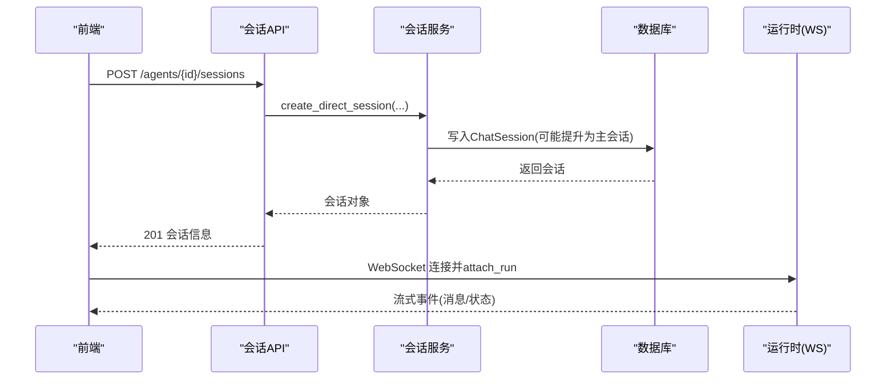
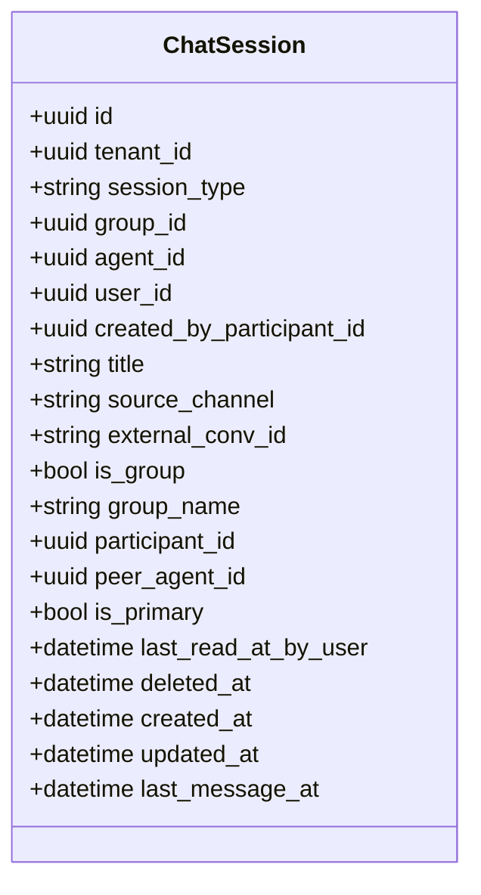
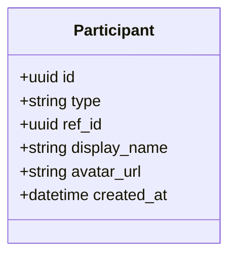
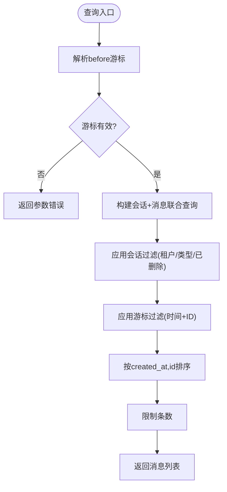
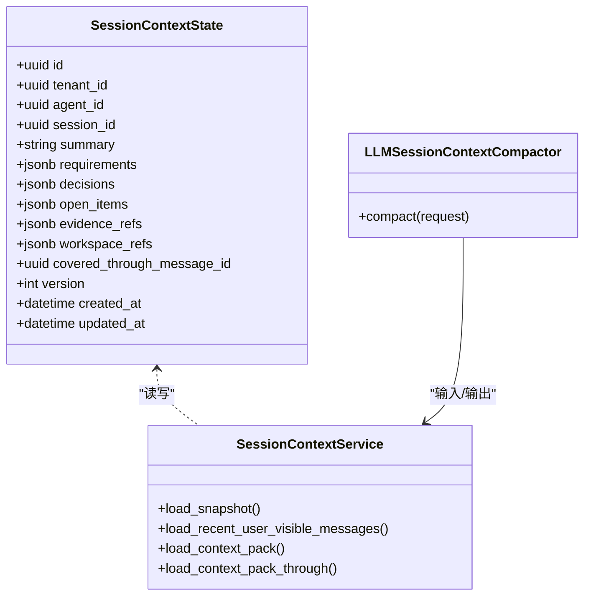
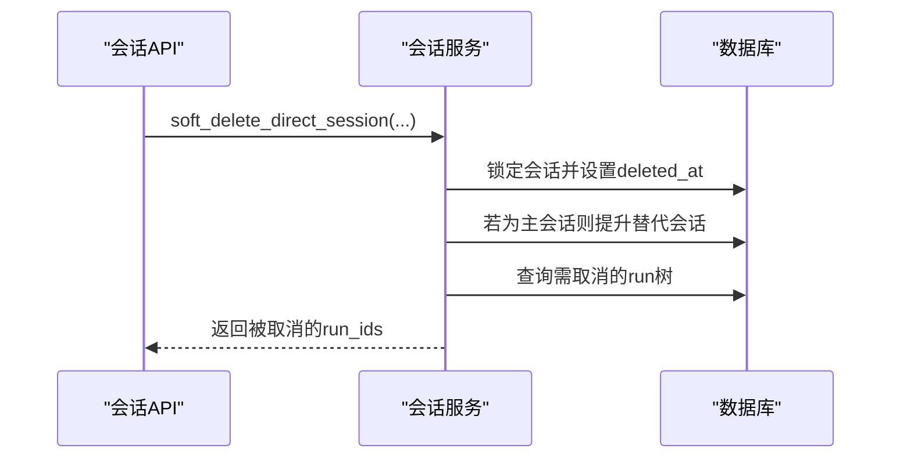
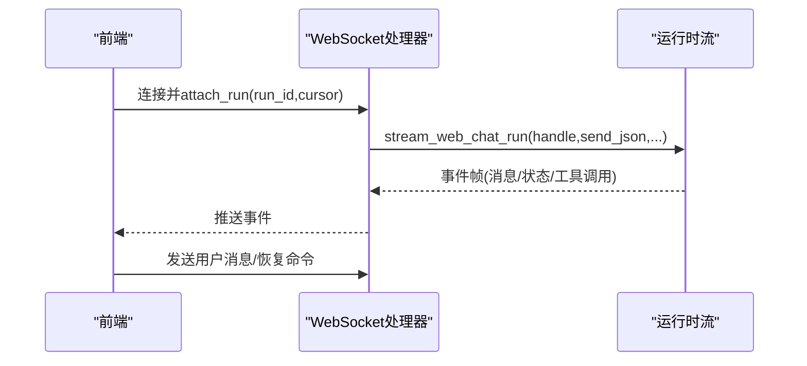
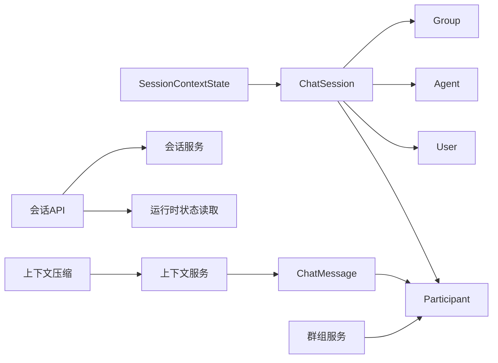

# 聊天会话模型

<cite>
**本文引用的文件**   
- [chat_session.py](file://backend/app/models/chat_session.py)
- [participant.py](file://backend/app/models/participant.py)
- [audit.py](file://backend/app/models/audit.py)
- [session_context_state.py](file://backend/app/models/session_context_state.py)
- [chat_sessions.py](file://backend/app/api/chat_sessions.py)
- [messages.py](file://backend/app/api/messages.py)
- [chat_session_service.py](file://backend/app/services/chat_session_service.py)
- [group_chat_service.py](file://backend/app/services/group_chat_service.py)
- [session_context_service.py](file://backend/app/services/agent_runtime/session_context_service.py)
- [session_context_compactor.py](file://backend/app/services/agent_runtime/session_context_compactor.py)
- [004_add_chat_sessions.py](file://backend/alembic/versions/004_add_chat_sessions.py)
- [006_add_participants.py](file://backend/alembic/versions/006_add_participants.py)
- [websocket.py](file://backend/app/api/websocket.py)
</cite>

## 目录
1. [简介](#简介)
2. [项目结构](#项目结构)
3. [核心组件](#核心组件)
4. [架构总览](#架构总览)
5. [详细组件分析](#详细组件分析)
6. [依赖关系分析](#依赖关系分析)
7. [性能考量](#性能考量)
8. [故障排查指南](#故障排查指南)
9. [结论](#结论)
10. [附录](#附录)

## 简介
本文件为 Clawith 聊天会话模型的权威文档，聚焦以下目标：
- 解释 ChatSession 表的结构设计：会话类型、状态管理、消息存储机制。
- 阐述参与者模型（Participant）的设计：统一身份抽象、多人协作与权限控制。
- 说明会话上下文管理、消息流处理与实时通信机制。
- 描述会话生命周期管理、自动清理策略与数据归档机制。
- 提供会话创建、消息发送、历史查询与性能优化示例。
- 给出群组聊天与私聊场景的实现指导。

## 项目结构
后端围绕“会话模型 + 服务层 + API 层”组织：
- 模型层：ChatSession、Participant、ChatMessage、SessionContextState。
- 服务层：会话生命周期（直聊）、群组会话、上下文快照与压缩、运行时集成。
- API 层：会话 CRUD、运行态查询、工具执行对账、消息收件箱等。
- 迁移脚本：定义并演进数据库结构。

```mermaid
graph TB
subgraph "模型"
CS["ChatSession"]
P["Participant"]
CM["ChatMessage"]
SC["SessionContextState"]
end
subgraph "服务"
Svc["会话服务(chat_session_service)"]
GSvc["群组服务(group_chat_service)"]
CtxSvc["上下文服务(session_context_service)"]
Comp["上下文压缩(session_context_compactor)"]
end
subgraph "API"
API["会话API(chat_sessions)"]
MsgAPI["消息API(messages)"]
WS["WebSocket(websocket)"]
end
CS --> CM
CS --> P
CS --> SC
API --> Svc
API --> GSvc
API --> CtxSvc
WS --> API
Comp --> CtxSvc
```

图表来源
- [chat_session.py:23-116](file://backend/app/models/chat_session.py#L23-L116)
- [participant.py:13-32](file://backend/app/models/participant.py#L13-L32)
- [audit.py:46-77](file://backend/app/models/audit.py#L46-L77)
- [session_context_state.py:25-101](file://backend/app/models/session_context_state.py#L25-L101)
- [chat_sessions.py:1-120](file://backend/app/api/chat_sessions.py#L1-L120)
- [messages.py:1-101](file://backend/app/api/messages.py#L1-L101)
- [chat_session_service.py:1-120](file://backend/app/services/chat_session_service.py#L1-L120)
- [group_chat_service.py:1-120](file://backend/app/services/group_chat_service.py#L1-L120)
- [session_context_service.py:1-120](file://backend/app/services/agent_runtime/session_context_service.py#L1-L120)
- [session_context_compactor.py:1-120](file://backend/app/services/agent_runtime/session_context_compactor.py#L1-L120)
- [websocket.py:1085-1119](file://backend/app/api/websocket.py#L1085-L1119)

章节来源
- [chat_session.py:23-116](file://backend/app/models/chat_session.py#L23-L116)
- [participant.py:13-32](file://backend/app/models/participant.py#L13-L32)
- [audit.py:46-77](file://backend/app/models/audit.py#L46-L77)
- [session_context_state.py:25-101](file://backend/app/models/session_context_state.py#L25-L101)
- [chat_sessions.py:1-120](file://backend/app/api/chat_sessions.py#L1-L120)
- [messages.py:1-101](file://backend/app/api/messages.py#L1-L101)
- [chat_session_service.py:1-120](file://backend/app/services/chat_session_service.py#L1-L120)
- [group_chat_service.py:1-120](file://backend/app/services/group_chat_service.py#L1-L120)
- [session_context_service.py:1-120](file://backend/app/services/agent_runtime/session_context_service.py#L1-L120)
- [session_context_compactor.py:1-120](file://backend/app/services/agent_runtime/session_context_compactor.py#L1-L120)
- [websocket.py:1085-1119](file://backend/app/api/websocket.py#L1085-L1119)

## 核心组件
- ChatSession：统一会话实体，支持 direct、group、a2a、trigger 四种类型；维护 is_primary、last_read_at_by_user、deleted_at 等状态字段；通过索引保障主会话唯一性与查询效率。
- Participant：统一参与者身份，type 为 user 或 agent，ref_id 指向具体主体，用于会话与消息的归属与展示。
- ChatMessage：统一消息存储，role 包含 user、assistant、system、tool_call；conversation_id 关联会话；participant_id 标识发送者。
- SessionContextState：会话上下文的滚动摘要与版本控制，记录 summary、requirements、decisions、open_items、evidence_refs、workspace_refs 及 covered_through_message_id。

章节来源
- [chat_session.py:23-116](file://backend/app/models/chat_session.py#L23-L116)
- [participant.py:13-32](file://backend/app/models/participant.py#L13-L32)
- [audit.py:46-77](file://backend/app/models/audit.py#L46-L77)
- [session_context_state.py:25-101](file://backend/app/models/session_context_state.py#L25-L101)

## 架构总览
聊天系统以“会话为中心”，消息与上下文围绕会话展开，API 与服务层解耦，运行时通过 WebSocket 推送事件。



图表来源
- [chat_sessions.py:358-395](file://backend/app/api/chat_sessions.py#L358-L395)
- [chat_session_service.py:175-211](file://backend/app/services/chat_session_service.py#L175-L211)
- [websocket.py:1085-1119](file://backend/app/api/websocket.py#L1085-L1119)

## 详细组件分析

### ChatSession 表结构与状态管理
- 会话类型：direct、group、a2a、trigger，通过 CheckConstraint 约束。
- 主会话策略：is_primary 标记平台主会话；针对 direct 与 group 分别有条件唯一索引保证每个租户/用户或群组仅一个主会话。
- 多租户隔离：tenant_id 参与索引与约束；external_conv_id 用于跨渠道可靠 find-or-create。
- 读取状态：last_read_at_by_user 驱动未读数计算。
- 软删除：deleted_at 实现逻辑删除。
- 时间戳：created_at、updated_at、last_message_at 支撑排序与活跃度。



图表来源
- [chat_session.py:23-116](file://backend/app/models/chat_session.py#L23-L116)

章节来源
- [chat_session.py:23-116](file://backend/app/models/chat_session.py#L23-L116)
- [004_add_chat_sessions.py:13-33](file://backend/alembic/versions/004_add_chat_sessions.py#L13-L33)

### Participant 参与者模型与权限控制
- 统一身份：type=user|agent，ref_id 指向 users.id 或 agents.id，display_name/avatar_url 用于展示。
- 唯一性：uq_participants_type_ref 避免重复。
- 权限校验：群组邀请时检查 Agent 可见性与访问模式；成员角色 manager/member 控制操作权限。



图表来源
- [participant.py:13-32](file://backend/app/models/participant.py#L13-L32)

章节来源
- [participant.py:13-32](file://backend/app/models/participant.py#L13-L32)
- [006_add_participants.py:13-107](file://backend/alembic/versions/006_add_participants.py#L13-L107)
- [group_chat_service.py:106-146](file://backend/app/services/group_chat_service.py#L106-L146)

### 消息存储与历史查询
- ChatMessage 使用 conversation_id 关联 ChatSession；role 区分消息来源；participant_id 标识发送者；mentions JSONB 支持 @提及。
- 历史分页：基于 before 游标（ISO 时间 | 消息UUID），确保稳定顺序与去重。
- 未读数：按 last_read_at_by_user 统计 assistant/system/tool_call 类型消息。



图表来源
- [chat_sessions.py:733-756](file://backend/app/api/chat_sessions.py#L733-L756)
- [audit.py:46-77](file://backend/app/models/audit.py#L46-L77)

章节来源
- [audit.py:46-77](file://backend/app/models/audit.py#L46-L77)
- [chat_sessions.py:733-756](file://backend/app/api/chat_sessions.py#L733-L756)

### 会话上下文管理与压缩
- SessionContextState：保存会话级摘要与结构化字段，version 乐观锁，covered_through_message_id 作为水位线。
- SessionContextService：读取快照、加载最近消息、增量合并、生成上下文包（snapshot + recent + pending）。
- LLMSessionContextCompactor：调用 LLM 将消息窗口压缩为新上下文候选，严格输出校验与预算控制。



图表来源
- [session_context_state.py:25-101](file://backend/app/models/session_context_state.py#L25-L101)
- [session_context_service.py:553-720](file://backend/app/services/agent_runtime/session_context_service.py#L553-L720)
- [session_context_compactor.py:266-456](file://backend/app/services/agent_runtime/session_context_compactor.py#L266-L456)

章节来源
- [session_context_state.py:25-101](file://backend/app/models/session_context_state.py#L25-L101)
- [session_context_service.py:553-720](file://backend/app/services/agent_runtime/session_context_service.py#L553-L720)
- [session_context_compactor.py:266-456](file://backend/app/services/agent_runtime/session_context_compactor.py#L266-L456)

### 会话生命周期与自动清理
- 直聊会话：ensure_primary_direct_session 复用/提升主会话；create_direct_session 创建新会话；soft_delete_direct_session 软删并修复主会话，同时取消前台协作任务。
- 群组会话：GroupChatService 负责成员邀请/移除、会话授权、读水位更新等。
- 运行态取消：删除会话时递归查找前台/编排类 run 并排队取消。



图表来源
- [chat_session_service.py:271-323](file://backend/app/services/chat_session_service.py#L271-L323)
- [chat_sessions.py:697-731](file://backend/app/api/chat_sessions.py#L697-L731)

章节来源
- [chat_session_service.py:136-173](file://backend/app/services/chat_session_service.py#L136-L173)
- [chat_session_service.py:271-323](file://backend/app/services/chat_session_service.py#L271-L323)
- [group_chat_service.py:378-453](file://backend/app/services/group_chat_service.py#L378-L453)

### 实时通信机制
- WebSocket：前端建立 ws 连接后 attach_run，服务端异步流式推送运行事件与消息。
- 运行态查询：GET /runtime-state 返回 active_run 与可操作标志（can_resume/cancel）。
- 工具执行对账：在 waiting_user 状态下，客户端可对未知回执进行确认/失败对账。



图表来源
- [websocket.py:1085-1119](file://backend/app/api/websocket.py#L1085-L1119)
- [chat_sessions.py:397-560](file://backend/app/api/chat_sessions.py#L397-L560)
- [chat_sessions.py:562-667](file://backend/app/api/chat_sessions.py#L562-L667)

章节来源
- [websocket.py:1085-1119](file://backend/app/api/websocket.py#L1085-L1119)
- [chat_sessions.py:397-560](file://backend/app/api/chat_sessions.py#L397-L560)
- [chat_sessions.py:562-667](file://backend/app/api/chat_sessions.py#L562-L667)

### 私聊与群组聊天实现指导
- 私聊（direct）：
  - 创建：POST /agents/{agent_id}/sessions，内部 ensure/create 主会话。
  - 消息：通过 WebSocket 发送内容，服务端持久化 ChatMessage 并更新 last_message_at。
  - 历史：GET /messages/{session_id} 使用游标分页；未读数基于 last_read_at_by_user。
- 群组（group）：
  - 创建与成员：GroupChatService.create_group、invite/remove 成员，manager 权限控制。
  - 会话授权：authorize_group_session 校验成员与活跃状态。
  - 上下文：支持按触发器位置 cutoff 生成上下文包，保证一致性。

章节来源
- [chat_sessions.py:358-395](file://backend/app/api/chat_sessions.py#L358-L395)
- [chat_session_service.py:175-211](file://backend/app/services/chat_session_service.py#L175-L211)
- [group_chat_service.py:378-453](file://backend/app/services/group_chat_service.py#L378-L453)
- [group_chat_service.py:725-781](file://backend/app/services/group_chat_service.py#L725-L781)
- [session_context_service.py:722-800](file://backend/app/services/agent_runtime/session_context_service.py#L722-L800)

## 依赖关系分析
- 模型依赖：ChatSession 依赖 tenants、users、agents、participants、groups；ChatMessage 依赖 participants；SessionContextState 依赖 chat_sessions、chat_messages。
- 服务依赖：会话服务依赖审计模型与运行时取消队列；群组服务依赖成员与权限；上下文服务依赖消息与模型能力。
- API 依赖：会话 API 依赖会话服务、运行时状态读取、工具执行对账；消息 API 依赖会话与参与者。



图表来源
- [chat_session.py:23-116](file://backend/app/models/chat_session.py#L23-L116)
- [audit.py:46-77](file://backend/app/models/audit.py#L46-L77)
- [session_context_state.py:25-101](file://backend/app/models/session_context_state.py#L25-L101)
- [chat_sessions.py:1-120](file://backend/app/api/chat_sessions.py#L1-L120)
- [group_chat_service.py:1-120](file://backend/app/services/group_chat_service.py#L1-L120)
- [session_context_service.py:1-120](file://backend/app/services/agent_runtime/session_context_service.py#L1-L120)
- [session_context_compactor.py:1-120](file://backend/app/services/agent_runtime/session_context_compactor.py#L1-L120)

章节来源
- [chat_session.py:23-116](file://backend/app/models/chat_session.py#L23-L116)
- [audit.py:46-77](file://backend/app/models/audit.py#L46-L77)
- [session_context_state.py:25-101](file://backend/app/models/session_context_state.py#L25-L101)
- [chat_sessions.py:1-120](file://backend/app/api/chat_sessions.py#L1-L120)
- [group_chat_service.py:1-120](file://backend/app/services/group_chat_service.py#L1-L120)
- [session_context_service.py:1-120](file://backend/app/services/agent_runtime/session_context_service.py#L1-L120)
- [session_context_compactor.py:1-120](file://backend/app/services/agent_runtime/session_context_compactor.py#L1-L120)

## 性能考量
- 索引与约束：
  - 主会话唯一索引（direct/group）减少冲突与扫描。
  - tenant_id、group_id、created_at 等索引加速常见查询。
- 游标分页：基于时间与 ID 的组合游标避免深分页开销。
- 上下文压缩：按 token 预算分批打包消息，避免超出模型限制。
- 未读数计算：利用 last_read_at_by_user 与 role 过滤，降低聚合成本。
- 运行时并发：会话级别 advisory lock 序列化关键路径，避免竞态。

[本节为通用指导，不直接分析具体文件]

## 故障排查指南
- 会话不存在/无权限：
  - 检查会话是否被软删除（deleted_at）；确认当前用户是否为会话所有者或具备管理员权限。
- 运行态不一致：
  - GET /runtime-state 返回 409 表示状态不匹配，检查是否存在多个 lane holder 或状态越界。
- 工具执行对账失败：
  - 确认 correlation_id 一致且运行处于 waiting_user；注意 note 必填。
- 上下文压缩失败：
  - 检查模型能力与预算；确认消息 ID 稳定且可解析为 UUID；关注 compact 输出字段校验。

章节来源
- [chat_sessions.py:397-560](file://backend/app/api/chat_sessions.py#L397-L560)
- [chat_sessions.py:562-667](file://backend/app/api/chat_sessions.py#L562-L667)
- [session_context_compactor.py:266-456](file://backend/app/services/agent_runtime/session_context_compactor.py#L266-L456)

## 结论
Clawith 的聊天会话模型以 ChatSession 为核心，结合 Participant 统一身份、ChatMessage 统一消息与 SessionContextState 上下文快照，形成可扩展、可归档、可压缩的统一聊天基座。通过严格的约束、索引与事务/锁机制，保障了多租户、多角色、多通道场景下的正确性与性能。API 与服务层清晰分层，配合 WebSocket 实时通信，满足私聊与群组的多样化需求。

[本节为总结，不直接分析具体文件]

## 附录
- 会话创建示例（伪代码）：
  - 调用 POST /agents/{agent_id}/sessions，传入可选 title；服务端确保主会话存在或创建新会话。
- 消息发送示例（伪代码）：
  - 通过 WebSocket 发送 content，服务端持久化为 ChatMessage，更新 last_message_at。
- 历史查询示例（伪代码）：
  - GET /agents/{agent_id}/sessions/{session_id}/messages?limit=20&before=ISO|UUID；服务端解析游标并分页。
- 群组聊天示例（伪代码）：
  - GroupChatService.create_group -> invite_group_member -> authorize_group_session -> 发送消息并更新读水位。

[本节为概念性示例，不直接分析具体文件]