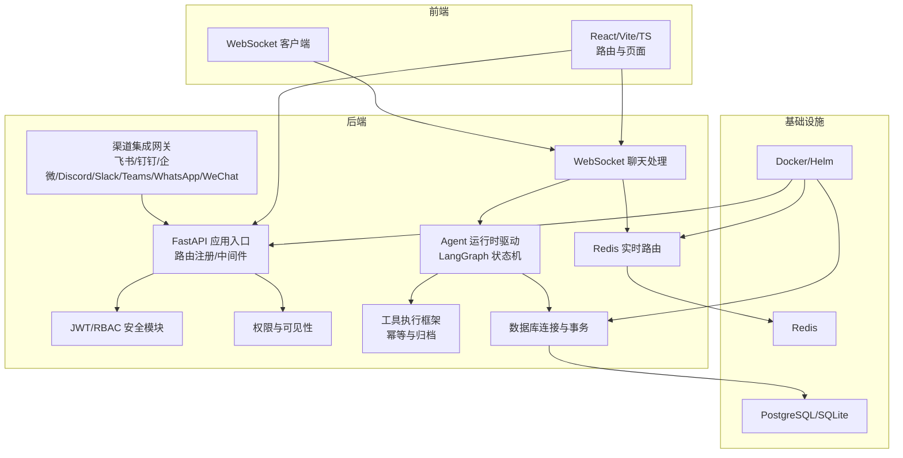
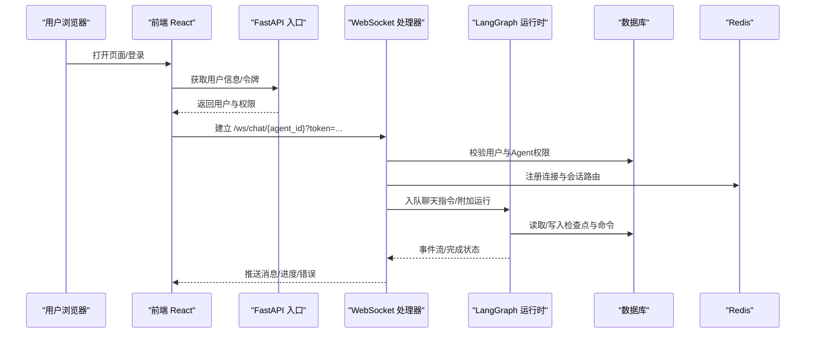
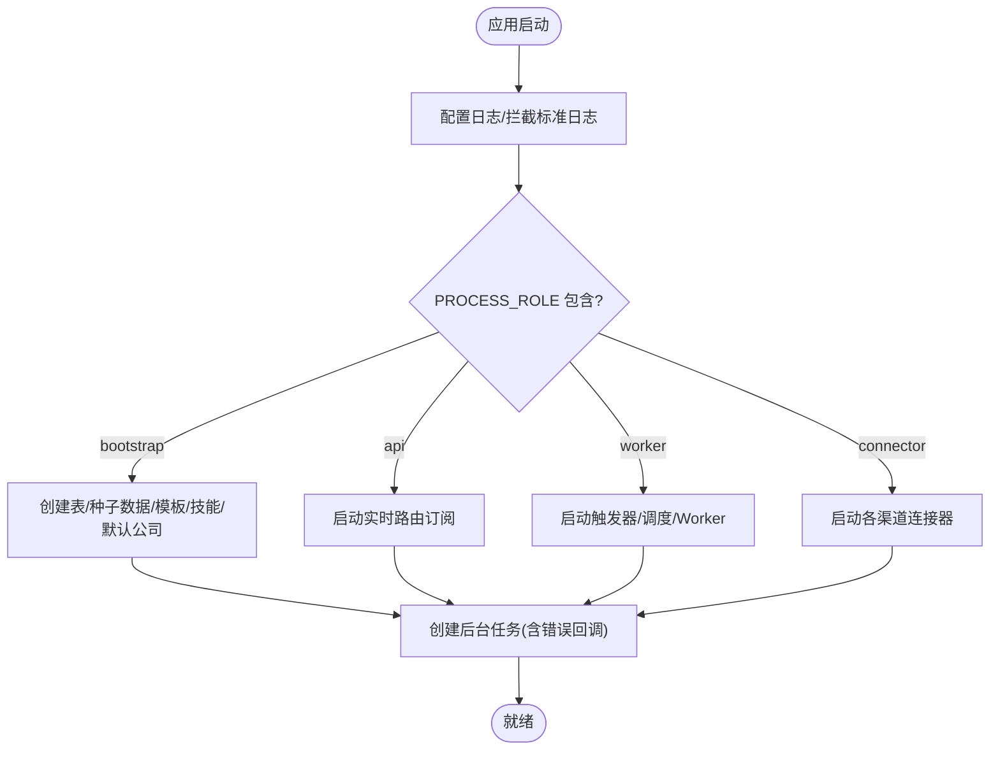
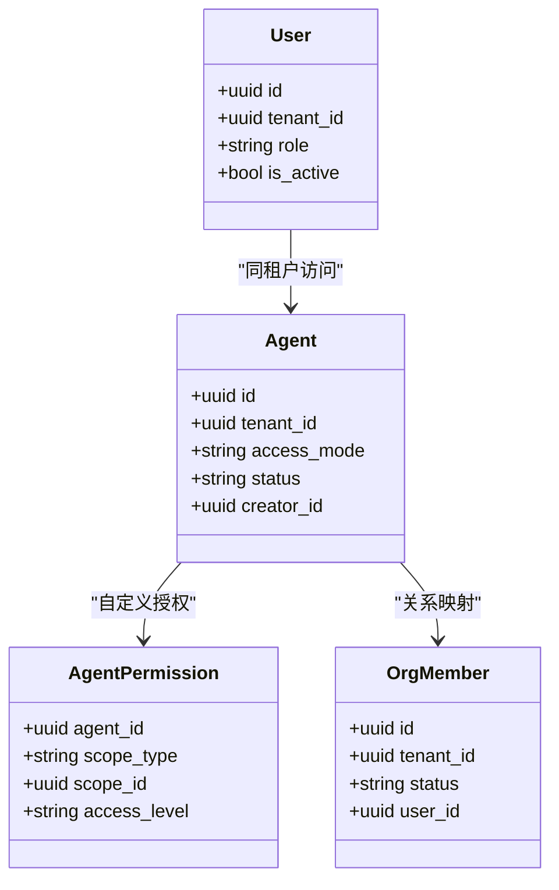
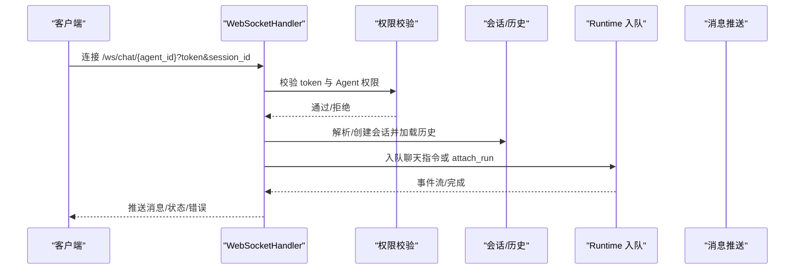
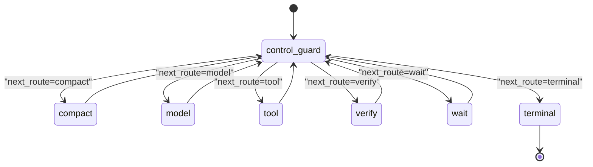
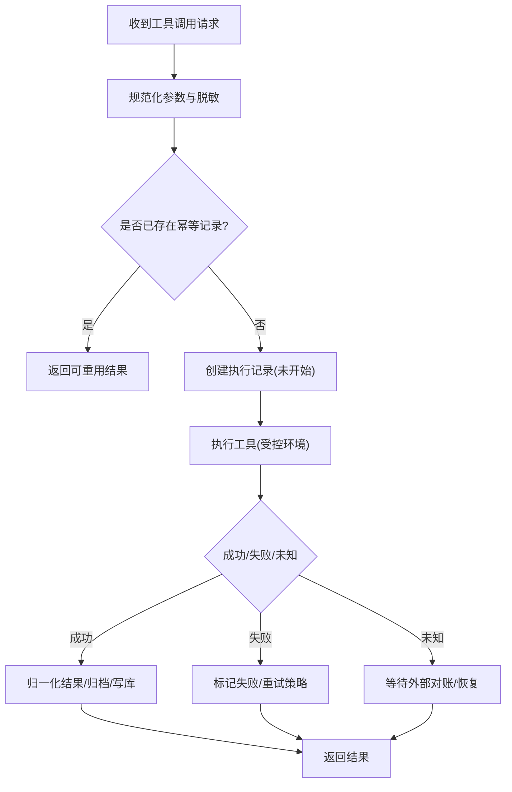
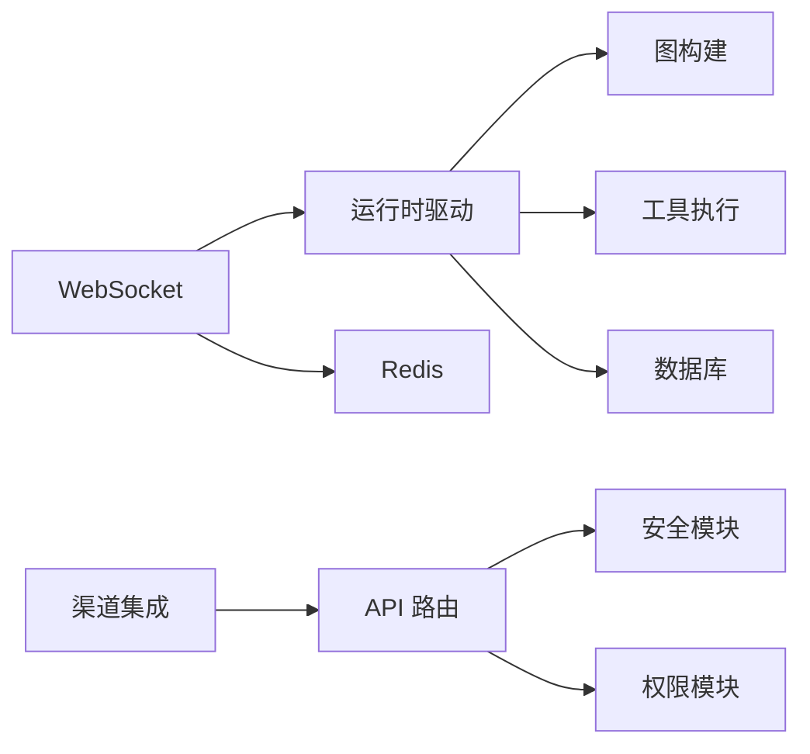

# 架构设计

<cite>
**本文引用的文件**   
- [backend/app/main.py](file://backend/app/main.py)
- [backend/app/config.py](file://backend/app/config.py)
- [backend/app/database.py](file://backend/app/database.py)
- [backend/app/core/security.py](file://backend/app/core/security.py)
- [backend/app/core/permissions.py](file://backend/app/core/permissions.py)
- [backend/app/api/websocket.py](file://backend/app/api/websocket.py)
- [backend/app/services/agent_runtime/langgraph_driver.py](file://backend/app/services/agent_runtime/langgraph_driver.py)
- [backend/app/services/agent_runtime/graph.py](file://backend/app/services/agent_runtime/graph.py)
- [backend/app/services/agent_runtime/tool_execution.py](file://backend/app/services/agent_runtime/tool_execution.py)
- [backend/app/models/tenant.py](file://backend/app/models/tenant.py)
- [frontend/src/App.tsx](file://frontend/src/App.tsx)
- [README.md](file://README.md)
</cite>

## 目录
1. [简介](#简介)
2. [项目结构](#项目结构)
3. [核心组件](#核心组件)
4. [架构总览](#架构总览)
5. [详细组件分析](#详细组件分析)
6. [依赖关系分析](#依赖关系分析)
7. [性能考虑](#性能考虑)
8. [故障排查指南](#故障排查指南)
9. [结论](#结论)
10. [附录](#附录)

## 简介
本文件为 Clawith 平台的全面架构设计文档，面向前后端分离的微服务架构：FastAPI 后端、React 前端、数据库层与基础设施层。重点阐述多租户隔离、RBAC 权限控制、WebSocket 实时通信机制；Agent 运行时基于 LangGraph 的状态机设计、工具执行框架的幂等与可恢复性、多渠道集成（飞书、钉钉、企业微信、Discord、Slack、Teams、WhatsApp、WeChat）以及系统边界、组件交互、数据流向和扩展点设计。同时给出技术选型理由、性能与安全设计要点。

## 项目结构
Clawith 采用前后端分离与模块化组织：
- 前端（React + Vite + TypeScript）：路由与页面、状态管理、国际化、WebSocket 客户端、API 调用封装。
- 后端（FastAPI）：REST API、WebSocket、认证鉴权、多租户 RBAC、Agent 运行时驱动、工具执行、渠道集成、调度与触发器、存储与沙箱。
- 数据库（PostgreSQL/SQLite）：SQLAlchemy ORM、Alembic 迁移、Checkpointer 持久化。
- 基础设施（Redis、Docker、Helm）：会话与消息分发、缓存、容器编排与部署。

图表来源
- [backend/app/main.py:352-470](file://backend/app/main.py#L352-L470)
- [backend/app/api/websocket.py:229-240](file://backend/app/api/websocket.py#L229-L240)
- [backend/app/services/agent_runtime/langgraph_driver.py:323-491](file://backend/app/services/agent_runtime/langgraph_driver.py#L323-L491)
- [backend/app/services/agent_runtime/graph.py:241-291](file://backend/app/services/agent_runtime/graph.py#L241-L291)
- [backend/app/services/agent_runtime/tool_execution.py:568-614](file://backend/app/services/agent_runtime/tool_execution.py#L568-L614)
- [backend/app/database.py:14-21](file://backend/app/database.py#L14-L21)

章节来源
- [README.md:205-225](file://README.md#L205-L225)
- [backend/app/main.py:352-470](file://backend/app/main.py#L352-L470)

## 核心组件
- FastAPI 应用入口与生命周期管理：启动日志、角色开关（bootstrap/api/worker/connector）、后台任务（触发器、调度、渠道连接器）、错误处理与 CORS、健康检查与版本接口。
- 配置中心：集中式 Settings（Pydantic），环境变量加载、默认值推导、校验与约束。
- 数据库层：异步引擎、会话工厂、事务上下文、模型基类。
- 安全与认证：JWT 签发/校验、密码哈希、角色依赖注入。
- 权限与多租户：按租户隔离、Agent 访问模式（company/private/custom）、RBAC、可见性与关系评估。
- WebSocket 实时聊天：连接管理、会话解析、历史加载、运行态接入与流式输出、取消与重连。
- Agent 运行时（LangGraph）：图构建、节点编排、检查点与恢复、命令执行（start/resume/cancel）。
- 工具执行框架：幂等指纹、结果归一化、敏感信息脱敏、重试策略、归档与引用。
- 渠道集成：统一接入与事件转发（飞书、钉钉、企微、Discord、Slack、Teams、WhatsApp、WeChat）。

章节来源
- [backend/app/main.py:121-350](file://backend/app/main.py#L121-L350)
- [backend/app/config.py:79-247](file://backend/app/config.py#L79-L247)
- [backend/app/database.py:14-79](file://backend/app/database.py#L14-L79)
- [backend/app/core/security.py:128-227](file://backend/app/core/security.py#L128-L227)
- [backend/app/core/permissions.py:44-129](file://backend/app/core/permissions.py#L44-L129)
- [backend/app/api/websocket.py:229-391](file://backend/app/api/websocket.py#L229-L391)
- [backend/app/services/agent_runtime/graph.py:241-291](file://backend/app/services/agent_runtime/graph.py#L241-L291)
- [backend/app/services/agent_runtime/langgraph_driver.py:323-491](file://backend/app/services/agent_runtime/langgraph_driver.py#L323-L491)
- [backend/app/services/agent_runtime/tool_execution.py:568-730](file://backend/app/services/agent_runtime/tool_execution.py#L568-L730)

## 架构总览
整体采用“前端单页应用 + 后端微服务化 API + 事件驱动运行时”的分层架构。前端通过 REST 与 WebSocket 与后端交互；后端以 FastAPI 为中心，承载认证、权限、业务路由、Agent 运行时与渠道集成；数据库与 Redis 提供持久化与实时能力；容器化部署支持横向扩展。

图表来源
- [backend/app/api/websocket.py:229-391](file://backend/app/api/websocket.py#L229-L391)
- [backend/app/services/agent_runtime/langgraph_driver.py:395-491](file://backend/app/services/agent_runtime/langgraph_driver.py#L395-L491)
- [backend/app/database.py:30-79](file://backend/app/database.py#L30-L79)

## 详细组件分析

### 后端应用与生命周期（FastAPI）
- 启动阶段：初始化日志、CORS、TraceId 中间件、注册错误处理、导入并挂载所有 API 路由。
- 角色开关：根据 PROCESS_ROLE 控制 bootstrap/api/worker/connector 子进程职责。
- 后台任务：触发器守护、调度器、渠道连接器（飞书/钉钉/企微/WeChat/Discord）、ss-local 代理。
- 健康与版本：/api/health、/api/version。

图表来源
- [backend/app/main.py:121-350](file://backend/app/main.py#L121-L350)

章节来源
- [backend/app/main.py:121-350](file://backend/app/main.py#L121-L350)

### 配置与设置（Settings）
- 集中式 Settings：涵盖 App、数据库、Redis、JWT、存储、Agent 运行时、沙箱、代理、第三方 API Key 等。
- 校验与约束：非空字段校验、时间参数顺序校验、可选空字符串转 None。
- 沙箱配置：类型、网络、超时、代理、bwrap 降级策略。

章节来源
- [backend/app/config.py:79-247](file://backend/app/config.py#L79-L247)

### 数据库层（SQLAlchemy 异步）
- 引擎与会话：连接池、异步会话工厂、自动提交/回滚。
- 事务上下文：ContextVar 传递当前 Session，支持嵌套事务。
- Base 模型：所有 ORM 模型继承 Base。

章节来源
- [backend/app/database.py:14-79](file://backend/app/database.py#L14-L79)

### 安全与认证（JWT/RBAC）
- JWT 签发与解码：HS256，过期时间、角色载荷。
- 密码哈希：bcrypt，线程池避免阻塞事件循环。
- 依赖注入：get_current_user、get_authenticated_user、require_role。
- AES 加解密：用于敏感字段加密存储。

章节来源
- [backend/app/core/security.py:128-227](file://backend/app/core/security.py#L128-L227)

### 权限与多租户（RBAC + Tenant）
- 租户隔离：User/Agent 均绑定 tenant_id，跨租户拒绝访问。
- Agent 访问模式：company/private/custom，结合管理员与显式授权。
- 可见性与关系评估：Agent-Agent、Agent-Human 的关系有效性、可用性判断。
- 查询构建：按用户与租户动态生成可见 Agent 列表。

图表来源
- [backend/app/core/permissions.py:44-129](file://backend/app/core/permissions.py#L44-L129)
- [backend/app/models/tenant.py:13-73](file://backend/app/models/tenant.py#L13-L73)

章节来源
- [backend/app/core/permissions.py:44-129](file://backend/app/core/permissions.py#L44-L129)
- [backend/app/models/tenant.py:13-73](file://backend/app/models/tenant.py#L13-L73)

### WebSocket 实时通信
- 连接管理：按 agent_id 维护连接集合，支持按 session_id/user_id 定向投递。
- 认证与鉴权：解析 token、校验用户与 Agent 权限、会话范围校验。
- 会话与历史：优先复用主会话或新建，加载最近 N 条历史。
- 运行态接入：attach_run 重连已有 Run，支持事件游标恢复。
- 消息循环：接收用户输入、入队 Runtime、流式推送结果、错误与取消处理。

图表来源
- [backend/app/api/websocket.py:229-391](file://backend/app/api/websocket.py#L229-L391)

章节来源
- [backend/app/api/websocket.py:229-391](file://backend/app/api/websocket.py#L229-L391)

### Agent 运行时（LangGraph 状态机）
- 图构建：定义控制节点（compact/model/tool/verify/wait/terminal），条件路由由 lifecycle 决定。
- 驱动层：读取最新检查点、按命令执行（start/resume/cancel），保证一致性。
- 快照工厂：捕获不可变初始输入，确保可恢复性。
- 上下文与身份：携带 tenant/run/command/actor 等元数据。

图表来源
- [backend/app/services/agent_runtime/graph.py:241-291](file://backend/app/services/agent_runtime/graph.py#L241-L291)

章节来源
- [backend/app/services/agent_runtime/langgraph_driver.py:323-491](file://backend/app/services/agent_runtime/langgraph_driver.py#L323-L491)
- [backend/app/services/agent_runtime/graph.py:241-291](file://backend/app/services/agent_runtime/graph.py#L241-L291)

### 工具执行框架（幂等与可恢复）
- 幂等指纹：对参数进行规范化与哈希，避免重复执行。
- 结果归一化：摘要截断、二进制归档、敏感键脱敏、元数据限制。
- 重试策略：safe/conditional/never，仅对安全读允许重试。
- 审计与归档：artifact/evidence 引用、内容哈希、归档状态。

图表来源
- [backend/app/services/agent_runtime/tool_execution.py:568-730](file://backend/app/services/agent_runtime/tool_execution.py#L568-L730)

章节来源
- [backend/app/services/agent_runtime/tool_execution.py:568-730](file://backend/app/services/agent_runtime/tool_execution.py#L568-L730)

### 渠道集成架构
- 统一接入：各渠道独立管理器（飞书 ws、钉钉 stream、企微 stream、WeChat poll、Discord gateway）。
- 事件路由：将外部事件转换为平台内部命令/消息，进入 Runtime 或聊天通道。
- 代理与网络：ss-local SOCKS5 代理用于 Discord 等受限场景。

章节来源
- [backend/app/main.py:313-326](file://backend/app/main.py#L313-L326)
- [backend/app/main.py:72-118](file://backend/app/main.py#L72-L118)

### 前端路由与权限
- 路由保护：ProtectedRoute、CompanyAdminRoute 控制访问。
- 跨域租户切换：URL 中 token 注入与清理。
- 通知栏：动态配置与滚动显示。

章节来源
- [frontend/src/App.tsx:27-45](file://frontend/src/App.tsx#L27-L45)
- [frontend/src/App.tsx:212-306](file://frontend/src/App.tsx#L212-L306)

## 依赖关系分析
- 模块耦合：API 路由依赖安全与权限；WebSocket 依赖运行时与数据库；运行时依赖图构建与工具执行；渠道集成依赖网络与代理。
- 外部依赖：PostgreSQL/SQLite、Redis、JWT、bcrypt、LangGraph、Alembic、Docker/Helm。
- 潜在循环：通过分层与接口解耦避免循环依赖；运行时与工具执行通过契约与检查点隔离。

图表来源
- [backend/app/main.py:374-470](file://backend/app/main.py#L374-L470)
- [backend/app/api/websocket.py:229-391](file://backend/app/api/websocket.py#L229-L391)
- [backend/app/services/agent_runtime/langgraph_driver.py:323-491](file://backend/app/services/agent_runtime/langgraph_driver.py#L323-L491)
- [backend/app/services/agent_runtime/graph.py:241-291](file://backend/app/services/agent_runtime/graph.py#L241-L291)
- [backend/app/services/agent_runtime/tool_execution.py:568-730](file://backend/app/services/agent_runtime/tool_execution.py#L568-L730)

章节来源
- [backend/app/main.py:374-470](file://backend/app/main.py#L374-L470)

## 性能考虑
- 并发与限流：Agent 运行时命令并发度、轮询间隔、检查点保留天数、会话压缩阈值。
- 数据库优化：连接池大小、溢出上限、索引与查询构造（可见性过滤）。
- 实时通信：WebSocket 连接分组、按会话/用户路由、批量推送。
- 存储与归档：工具结果内联上限、二进制归档、引用与哈希去重。
- 沙箱资源：CPU/内存限制、超时、代理与网络策略。

章节来源
- [backend/app/config.py:124-161](file://backend/app/config.py#L124-L161)
- [backend/app/database.py:14-21](file://backend/app/database.py#L14-L21)
- [backend/app/services/agent_runtime/tool_execution.py:409-565](file://backend/app/services/agent_runtime/tool_execution.py#L409-L565)

## 故障排查指南
- 启动问题：检查 bwrap 可用性、ss-local 代理配置、环境变量与密钥。
- 认证失败：确认 JWT 密钥、过期时间、token 传递方式。
- 权限拒绝：核对租户 ID、Agent 访问模式、用户角色与显式授权。
- WebSocket 断开：查看连接管理、会话范围、Run 状态与事件游标。
- 运行时异常：检查检查点一致性、命令作用域、lifecycle 状态与路由合法性。
- 工具执行失败：查看幂等记录、重试策略、归档状态与敏感信息脱敏。

章节来源
- [backend/app/main.py:37-70](file://backend/app/main.py#L37-L70)
- [backend/app/core/security.py:141-174](file://backend/app/core/security.py#L141-L174)
- [backend/app/core/permissions.py:482-518](file://backend/app/core/permissions.py#L482-L518)
- [backend/app/api/websocket.py:173-206](file://backend/app/api/websocket.py#L173-L206)
- [backend/app/services/agent_runtime/langgraph_driver.py:458-491](file://backend/app/services/agent_runtime/langgraph_driver.py#L458-L491)
- [backend/app/services/agent_runtime/tool_execution.py:177-206](file://backend/app/services/agent_runtime/tool_execution.py#L177-L206)

## 结论
Clawith 平台通过清晰的层次划分与强一致的运行时设计，实现了多租户隔离、细粒度权限控制、高可靠 Agent 执行与多渠道集成。LangGraph 状态机与工具执行框架确保了可恢复性与幂等性，WebSocket 提供了低延迟实时体验。配合容器化与 Helm 部署，具备良好扩展性与运维友好性。建议在生产环境中严格配置密钥、启用 HTTPS、使用 PostgreSQL 与合理的资源限制，并持续监控运行时与渠道健康状态。

## 附录
- 技术选型理由：
  - FastAPI：高性能异步框架，天然支持 OpenAPI 与依赖注入。
  - React + Vite：现代前端工程化，快速开发与热更新。
  - SQLAlchemy async + Alembic：稳定 ORM 与迁移管理。
  - LangGraph：声明式状态机与检查点，适合复杂 Agent 流程。
  - Redis：轻量级消息路由与缓存。
  - Docker/Helm：标准化部署与扩缩容。
- 安全性设计：
  - JWT 签名与短过期、密码 bcrypt 哈希、AES 敏感字段加密。
  - 租户隔离与 RBAC、最小权限原则、操作审计。
  - 沙箱隔离与网络策略、代理与白名单。
- 扩展点设计：
  - 新增渠道：实现对应管理器与事件转换逻辑，注册到启动流程。
  - 新增工具：遵循工具执行契约，定义副作用分类与重试策略。
  - 新增图节点：在 graph.py 中扩展节点与路由规则，保持生命周期一致。