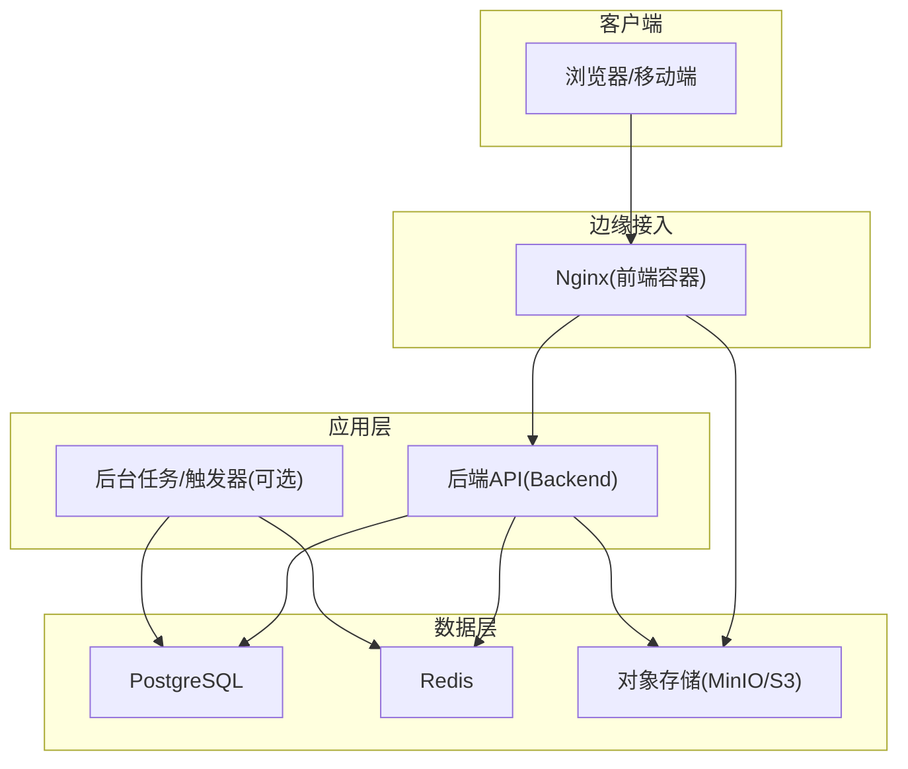
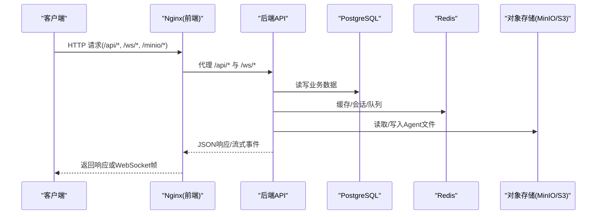
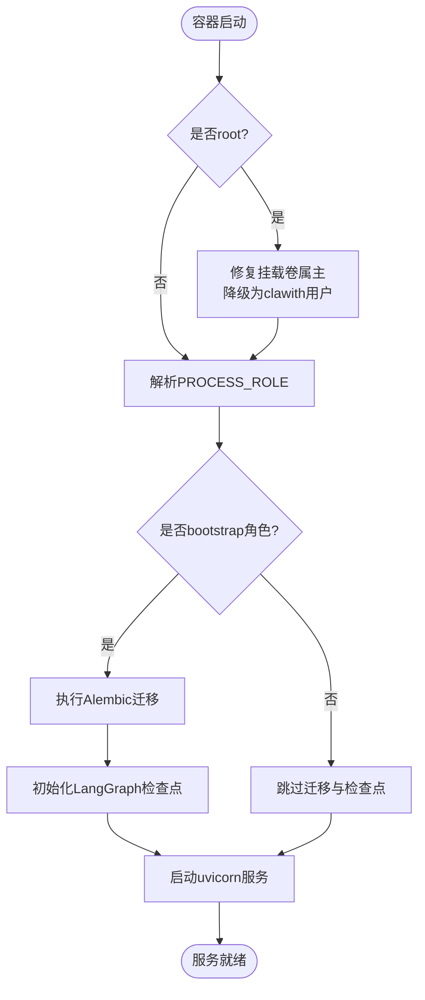
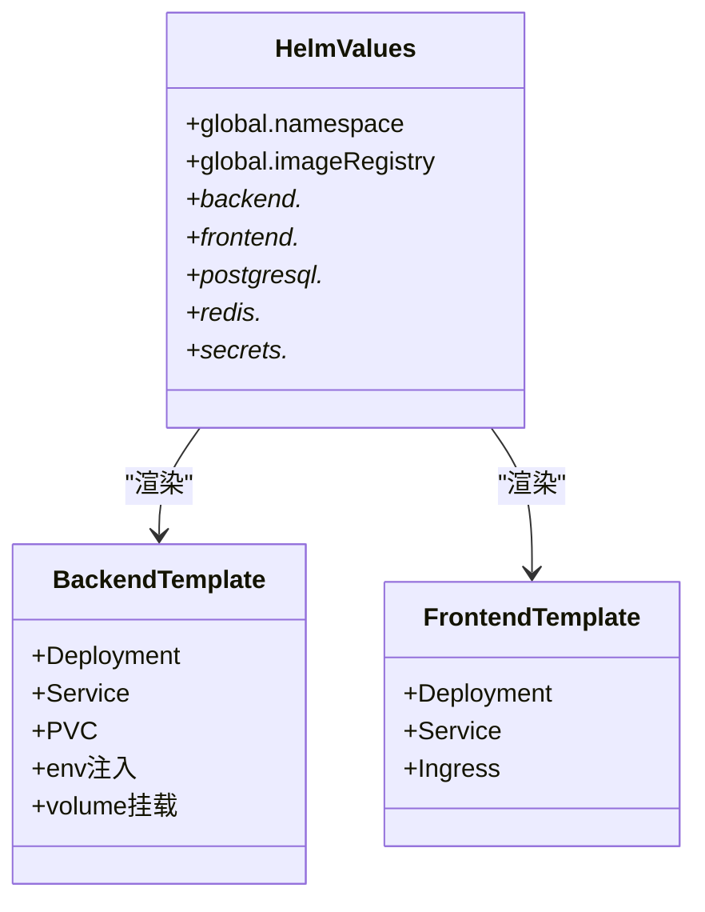
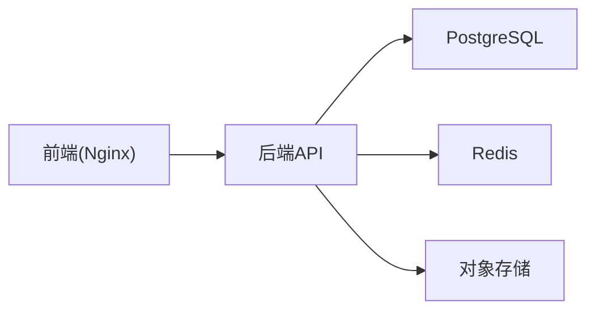

# 部署架构

<cite>
**本文引用的文件**   
- [backend/Dockerfile](file://backend/Dockerfile)
- [frontend/Dockerfile](file://frontend/Dockerfile)
- [deploy/docker-compose.yml](file://deploy/docker-compose.yml)
- [deploy/docker-compose-multi.yml](file://deploy/docker-compose-multi.yml)
- [docker-compose.ci.yml](file://docker-compose.ci.yml)
- [deploy/nginx/nginx.conf](file://deploy/nginx/nginx.conf)
- [helm/clawith/Chart.yaml](file://helm/clawith/Chart.yaml)
- [helm/clawith/values.yaml](file://helm/clawith/values.yaml)
- [helm/clawith/templates/backend.yaml](file://helm/clawith/templates/backend.yaml)
- [helm/clawith/templates/frontend.yaml](file://helm/clawith/templates/frontend.yaml)
- [helm/clawith/templates/ingress.yaml](file://helm/clawith/templates/ingress.yaml)
- [backend/entrypoint.sh](file://backend/entrypoint.sh)
- [README.md](file://README.md)
</cite>

## 目录
1. [简介](#简介)
2. [项目结构](#项目结构)
3. [核心组件](#核心组件)
4. [架构总览](#架构总览)
5. [详细组件分析](#详细组件分析)
6. [依赖关系分析](#依赖关系分析)
7. [性能考量](#性能考量)
8. [故障排查指南](#故障排查指南)
9. [结论](#结论)
10. [附录](#附录)

## 简介
本文件面向Clawith的部署与运维，系统性阐述Docker容器化策略、镜像构建优化（多阶段构建）、Kubernetes/Helm部署方案、微服务编排与服务发现、负载均衡配置、CI/CD流水线与自动化测试、监控告警与健康检查、环境管理与密钥管理，以及生产最佳实践、故障排查与性能调优建议。内容基于仓库中的Dockerfile、Compose、Helm模板与脚本等实际实现进行提炼与说明。

## 项目结构
- 后端：Python应用，提供REST API与WebSocket能力，使用PostgreSQL与Redis作为持久化与缓存，支持S3兼容对象存储（MinIO）。
- 前端：Node.js构建产物由Nginx静态托管，反向代理API与WebSocket到后端。
- 部署：提供本地开发/测试的Docker Compose与CI专用Compose；生产级Kubernetes通过Helm Chart统一编排。
- 入口与网关：Nginx负责静态资源、API代理、WebSocket转发与MinIO代理。

图表来源 
- [deploy/nginx/nginx.conf:1-82](file://deploy/nginx/nginx.conf#L1-L82)
- [deploy/docker-compose.yml:1-111](file://deploy/docker-compose.yml#L1-L111)
- [deploy/docker-compose-multi.yml:1-196](file://deploy/docker-compose-multi.yml#L1-L196)

章节来源
- [README.md:119-136](file://README.md#L119-L136)
- [deploy/docker-compose.yml:1-111](file://deploy/docker-compose.yml#L1-L111)
- [deploy/docker-compose-multi.yml:1-196](file://deploy/docker-compose-multi.yml#L1-L196)

## 核心组件
- 后端镜像构建：多阶段构建，分离依赖安装与运行环境，最小化镜像体积并提升构建缓存命中率。
- 前端镜像构建：Node构建+Nginx静态托管，固定兼容的Nginx版本以规避内核seccomp限制。
- 启动流程：Entrypoint脚本负责权限修复、数据库迁移、LangGraph检查点初始化，再启动Web服务。
- 服务编排：Docker Compose用于开发与CI；Helm Chart用于Kubernetes部署，包含Deployment、Service、Ingress、PVC等。
- 存储与缓存：PostgreSQL持久化业务数据，Redis用于会话/缓存/队列，对象存储用于Agent工作区与文件。

章节来源
- [backend/Dockerfile:1-63](file://backend/Dockerfile#L1-L63)
- [frontend/Dockerfile:1-16](file://frontend/Dockerfile#L1-L16)
- [backend/entrypoint.sh:1-95](file://backend/entrypoint.sh#L1-L95)
- [helm/clawith/values.yaml:1-229](file://helm/clawith/values.yaml#L1-L229)

## 架构总览
下图展示从浏览器到后端、数据层的请求路径，以及Nginx对API、WebSocket与对象存储的反向代理规则。

图表来源 
- [deploy/nginx/nginx.conf:26-80](file://deploy/nginx/nginx.conf#L26-L80)
- [deploy/docker-compose.yml:32-76](file://deploy/docker-compose.yml#L32-L76)
- [deploy/docker-compose-multi.yml:49-109](file://deploy/docker-compose-multi.yml#L49-L109)

## 详细组件分析

### Docker镜像与构建优化
- 后端镜像
  - 多阶段构建：deps阶段安装系统依赖与Python依赖，production阶段仅拷贝运行时所需包与代码，显著减小镜像体积。
  - 构建参数：支持传入PIP索引与可信主机，便于企业内网加速与私有源。
  - 健康检查：内置HEALTHCHECK探测后端健康端点。
- 前端镜像
  - Node构建产物由Nginx托管，固定Nginx版本以避免内核seccomp拒绝特定syscall导致的服务异常。
  - 静态资源按哈希命名，开启长期缓存；SPA入口禁用缓存确保更新即时生效。

章节来源
- [backend/Dockerfile:1-63](file://backend/Dockerfile#L1-L63)
- [frontend/Dockerfile:1-16](file://frontend/Dockerfile#L1-L16)

### 启动流程与权限控制
- Entrypoint职责
  - 若以root运行，自动修复挂载卷属主后降级为普通用户执行，避免容器内写权限问题。
  - 根据PROCESS_ROLE决定是否执行Alembic迁移与LangGraph检查点初始化。
  - 最终启动uvicorn服务，端口默认8000。
- 环境变量
  - DATABASE_URL、REDIS_URL、AGENT_DATA_DIR、AGENT_TEMPLATE_DIR、STORAGE_*、SECRET_KEY、JWT_SECRET_KEY等。
  - 支持PUBLIC_BASE_URL用于生成密码重置链接与OAuth回调。

图表来源 
- [backend/entrypoint.sh:1-95](file://backend/entrypoint.sh#L1-L95)

章节来源
- [backend/entrypoint.sh:1-95](file://backend/entrypoint.sh#L1-L95)

### Nginx反向代理与负载均衡
- 路由规则
  - /：SPA回退至index.html，禁止缓存。
  - /assets/：静态资源强缓存。
  - /api/：代理至后端，设置超时与上传大小限制。
  - /p/：公开页面代理。
  - /minio/：重写路径并代理至对象存储，关闭缓冲以支持大文件。
  - /ws/：WebSocket代理，长连接保持。
- 负载均衡
  - 单实例场景下由Nginx直接代理；多副本时可通过Kubernetes Service/Ingress实现集群内负载均衡。

章节来源
- [deploy/nginx/nginx.conf:1-82](file://deploy/nginx/nginx.conf#L1-L82)

### Docker Compose编排（开发/CI）
- 基础版compose
  - 包含PostgreSQL、Redis、后端、前端四个服务，定义网络、卷、健康检查与依赖顺序。
  - 后端挂载agent_data目录与docker.sock，启用特权与安全选项以满足Agent沙箱需求。
- 多服务版compose
  - 拆分后端为API与Trigger/Worker进程，引入MinIO作为对象存储，支持S3兼容配置。
- CI专用compose
  - 使用预构建镜像，不构建、不挂载持久卷，快速验证升级与集成测试。

章节来源
- [deploy/docker-compose.yml:1-111](file://deploy/docker-compose.yml#L1-L111)
- [deploy/docker-compose-multi.yml:1-196](file://deploy/docker-compose-multi.yml#L1-L196)
- [docker-compose.ci.yml:1-71](file://docker-compose.ci.yml#L1-L71)

### Kubernetes与Helm部署
- Helm Chart结构
  - Chart.yaml：元信息与版本。
  - values.yaml：全局与组件配置（镜像、资源、存储、TLS、Secrets等）。
  - templates：Deployment、Service、Ingress、StorageClass等模板。
- 关键配置项
  - backend：副本数、镜像、环境变量、持久化、资源限制、证书注入。
  - frontend：副本数、镜像、Service端口、Ingress域名与TLS。
  - postgresql/redis：内置或外部依赖，持久化与资源。
  - secrets：创建或复用现有Secret，注入敏感信息。
- 服务发现与负载均衡
  - Service暴露ClusterIP，Ingress将域名路由至前端，再由前端代理至后端。
  - 水平扩展通过调整replicaCount实现。

图表来源 
- [helm/clawith/values.yaml:1-229](file://helm/clawith/values.yaml#L1-L229)
- [helm/clawith/templates/backend.yaml:1-142](file://helm/clawith/templates/backend.yaml#L1-L142)
- [helm/clawith/templates/frontend.yaml:1-57](file://helm/clawith/templates/frontend.yaml#L1-L57)
- [helm/clawith/templates/ingress.yaml:1-37](file://helm/clawith/templates/ingress.yaml#L1-L37)
- [helm/clawith/Chart.yaml:1-14](file://helm/clawith/Chart.yaml#L1-L14)

章节来源
- [helm/clawith/Chart.yaml:1-14](file://helm/clawith/Chart.yaml#L1-L14)
- [helm/clawith/values.yaml:1-229](file://helm/clawith/values.yaml#L1-L229)
- [helm/clawith/templates/backend.yaml:1-142](file://helm/clawith/templates/backend.yaml#L1-L142)
- [helm/clawith/templates/frontend.yaml:1-57](file://helm/clawith/templates/frontend.yaml#L1-L57)
- [helm/clawith/templates/ingress.yaml:1-37](file://helm/clawith/templates/ingress.yaml#L1-L37)

### 微服务编排、服务发现与负载均衡
- 服务划分
  - 后端API：处理HTTP/WebSocket请求。
  - 后台任务：触发器、定时任务、异步工具轮询等（在multi compose中独立进程）。
- 服务发现
  - Docker Compose：通过容器名解析（如postgres、redis、backend）。
  - Kubernetes：Service DNS名称（如clawith-backend）供Pod间访问。
- 负载均衡
  - K8s Service对后端Pod进行轮询；Ingress对外部流量进行七层负载均衡。

章节来源
- [deploy/docker-compose-multi.yml:49-170](file://deploy/docker-compose-multi.yml#L49-L170)
- [helm/clawith/templates/backend.yaml:122-141](file://helm/clawith/templates/backend.yaml#L122-L141)
- [helm/clawith/templates/ingress.yaml:1-37](file://helm/clawith/templates/ingress.yaml#L1-L37)

### CI/CD流水线与自动化测试
- CI专用Compose
  - 使用预构建镜像，快速拉起依赖与后端/前端，便于Drone CI执行集成与升级测试。
- 发布流水线
  - 参考release工作流（仓库中存在），通常包括构建镜像、推送镜像、更新Helm值、部署到目标集群。
- 测试策略
  - 单元测试与契约测试覆盖后端与前端关键逻辑；CI中通过Compose拉起依赖执行测试用例。

章节来源
- [docker-compose.ci.yml:1-71](file://docker-compose.ci.yml#L1-L71)
- [README.md:119-136](file://README.md#L119-L136)

### 监控告警、日志收集与健康检查
- 健康检查
  - 后端镜像内置HEALTHCHECK调用/api/health。
  - PostgreSQL与Redis在Compose中定义健康检查命令。
- 日志
  - Compose中配置json-file驱动与轮转策略（max-size/max-file）。
  - Kubernetes环境下建议对接集中式日志采集（如Fluent Bit/Vector + Loki/Elasticsearch）。
- 指标与告警
  - 建议在K8s中启用Prometheus抓取应用指标，结合Grafana可视化与Alertmanager告警。

章节来源
- [backend/Dockerfile:56-58](file://backend/Dockerfile#L56-L58)
- [deploy/docker-compose.yml:13-30](file://deploy/docker-compose.yml#L13-L30)
- [deploy/docker-compose.yml:82-86](file://deploy/docker-compose.yml#L82-L86)

### 环境管理、配置中心与密钥管理
- 环境变量
  - 通过Compose/Env变量注入DATABASE_URL、REDIS_URL、STORAGE_*、SECRET_KEY、JWT_SECRET_KEY等。
- 密钥管理
  - Helm支持创建或引用现有Secret，将敏感信息注入环境变量。
- 配置中心
  - 当前实现以环境变量为主；如需动态配置可引入ConfigMap/外部配置中心（如Consul/Nacos）。

章节来源
- [deploy/docker-compose.yml:40-65](file://deploy/docker-compose.yml#L40-L65)
- [helm/clawith/values.yaml:25-49](file://helm/clawith/values.yaml#L25-L49)
- [helm/clawith/templates/backend.yaml:79-88](file://helm/clawith/templates/backend.yaml#L79-L88)

### 生产环境最佳实践
- 镜像与构建
  - 使用多阶段构建与只读根文件系统；固定基础镜像版本与Digest。
  - 使用私有镜像仓库与镜像签名校验。
- 安全加固
  - 非root运行、最小权限原则；谨慎使用privileged与SYS_ADMIN能力。
  - 使用NetworkPolicy限制跨Namespace通信。
- 高可用与弹性
  - 多副本Deployment、HPA基于CPU/内存或自定义指标扩缩容。
  - PodDisruptionBudget保障滚动更新可用性。
- 存储与备份
  - 使用高性能存储类（如SSD），定期备份PostgreSQL与对象存储。
- 可观测性
  - 结构化日志、分布式追踪、指标采集与告警联动。

[本节为通用指导，不直接分析具体文件]

## 依赖关系分析
- 后端依赖
  - PostgreSQL：业务数据持久化。
  - Redis：缓存、会话、任务队列。
  - 对象存储：Agent工作区与文件（MinIO/S3）。
- 前端依赖
  - Nginx：静态资源与反向代理。
- 编排依赖
  - Docker Compose：开发/CI环境。
  - Kubernetes/Helm：生产环境。

图表来源 
- [deploy/docker-compose.yml:1-111](file://deploy/docker-compose.yml#L1-L111)
- [deploy/docker-compose-multi.yml:1-196](file://deploy/docker-compose-multi.yml#L1-L196)

章节来源
- [deploy/docker-compose.yml:1-111](file://deploy/docker-compose.yml#L1-L111)
- [deploy/docker-compose-multi.yml:1-196](file://deploy/docker-compose-multi.yml#L1-L196)

## 性能考量
- 镜像构建
  - 利用多阶段构建与缓存层优化，减少构建时间与镜像体积。
- 运行时
  - 合理设置uvicorn workers与线程数；根据负载调整AGENT_RUNTIME_COMMAND_CONCURRENCY。
  - 使用连接池与缓存命中策略降低数据库压力。
- 网络
  - WebSocket长连接超时与代理缓冲需根据业务场景调优。
- 存储
  - 选择合适IOPS的存储类；对象存储分桶与前缀规划避免热点。

[本节为通用指导，不直接分析具体文件]

## 故障排查指南
- 启动失败
  - 检查环境变量是否正确（DATABASE_URL、REDIS_URL、SECRET_KEY等）。
  - 查看entrypoint日志确认迁移与检查点是否成功。
- 权限问题
  - 确认挂载卷属主是否为clawith；必要时手动修复或调整SELinux/AppArmor策略。
- 网络连通
  - 验证DNS解析与防火墙规则；检查Ingress与Service配置。
- 健康检查失败
  - 检查/api/health端点与依赖服务状态；查看容器日志定位错误。
- 日志与指标
  - 查看容器日志与K8s事件；结合Prometheus/Grafana定位瓶颈。

章节来源
- [backend/entrypoint.sh:42-91](file://backend/entrypoint.sh#L42-L91)
- [backend/Dockerfile:56-58](file://backend/Dockerfile#L56-L58)
- [deploy/docker-compose.yml:82-86](file://deploy/docker-compose.yml#L82-L86)

## 结论
Clawith采用清晰的容器化与编排策略：后端与前端分别构建最小化镜像，通过Docker Compose快速搭建开发/CI环境，借助Helm在Kubernetes上实现标准化部署。Nginx承担静态资源与反向代理职责，后端通过环境变量与Secret管理配置与密钥，配合PostgreSQL、Redis与对象存储形成稳定可靠的数据层。生产环境应强化安全、可观测性与弹性能力，遵循本文的最佳实践与排障建议，以获得更高的稳定性与可维护性。

## 附录
- 快速上手
  - 参考README中的Docker与一键启动说明，完成本地部署与首次登录。
- 扩展阅读
  - Helm Quickstart文档与仓库中的Helm模板，了解更多自定义能力。

章节来源
- [README.md:119-136](file://README.md#L119-L136)
- [helm/QUICKSTART.md](file://helm/QUICKSTART.md)
- [helm/QUICKSTART_EN.md](file://helm/QUICKSTART_EN.md)