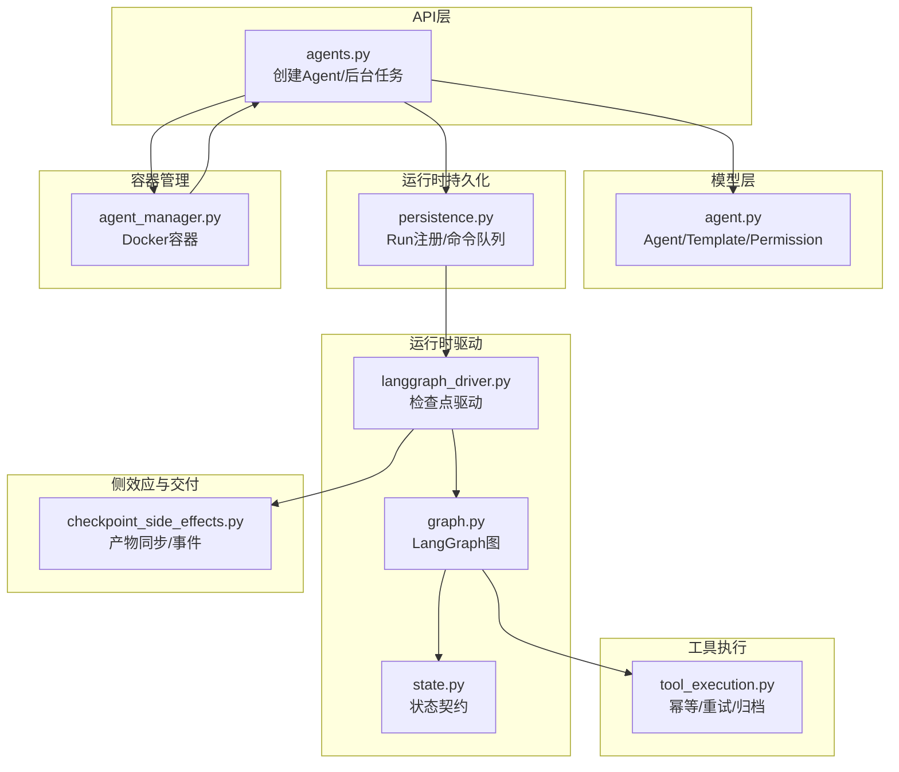
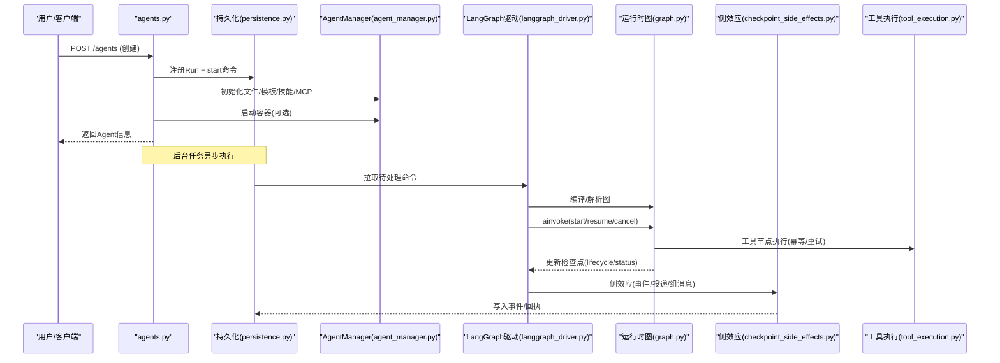
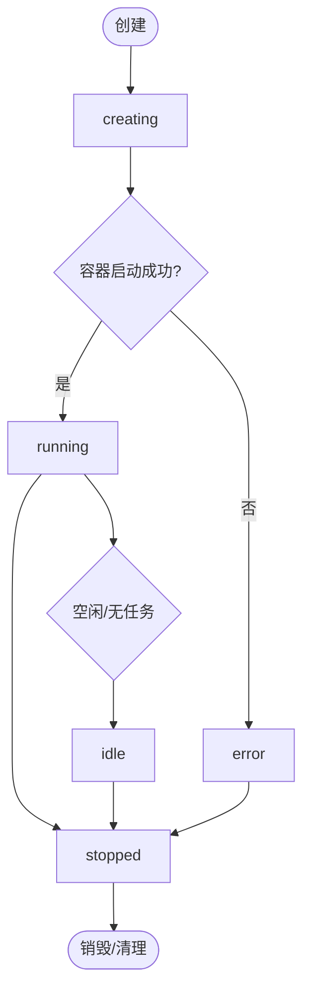
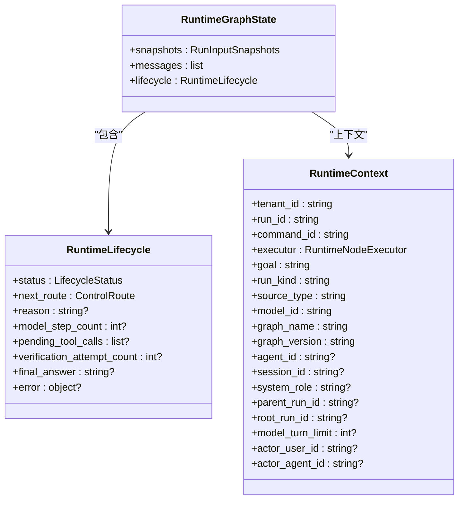
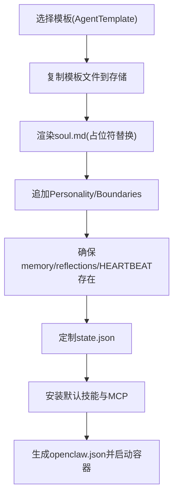
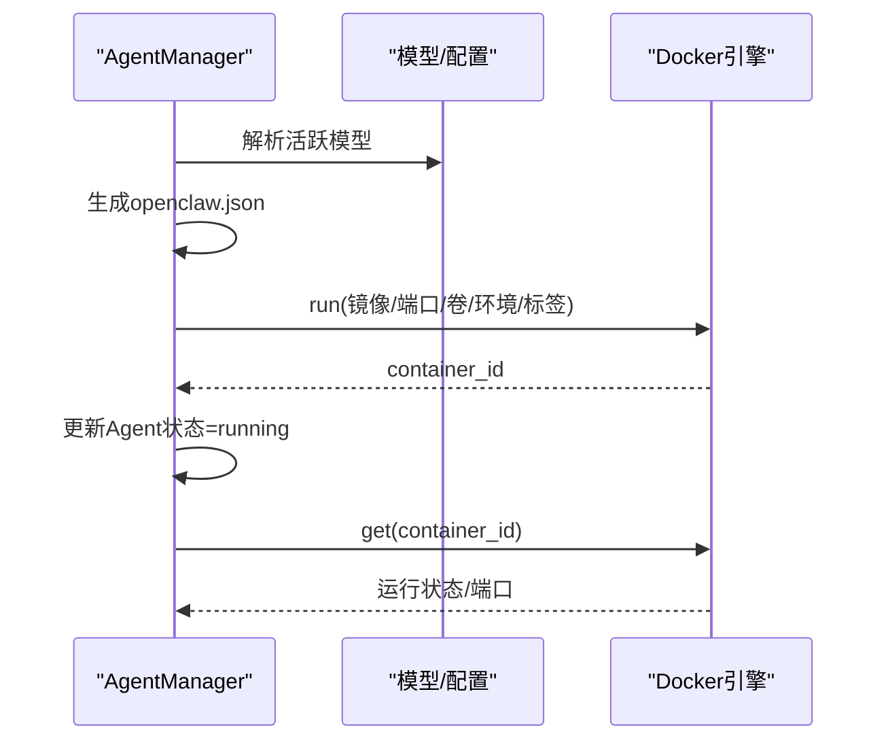
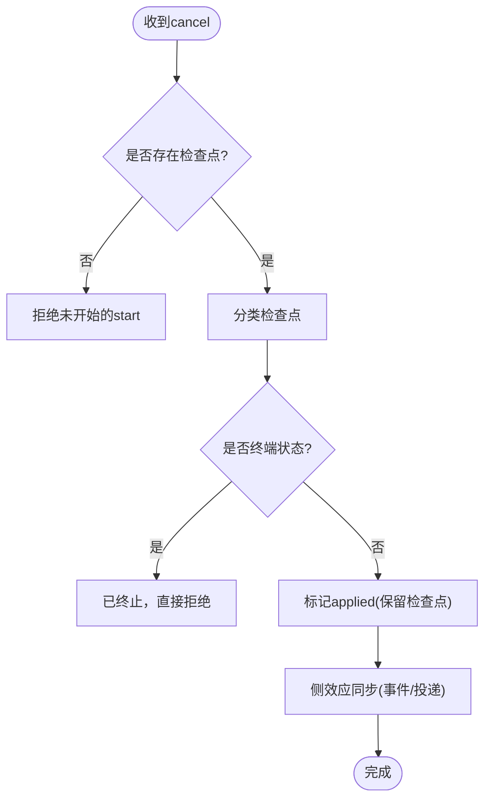
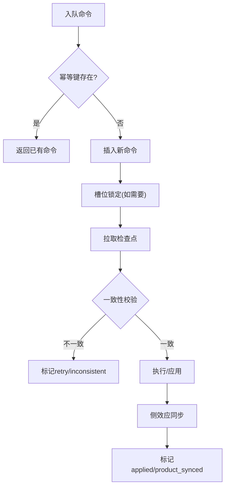
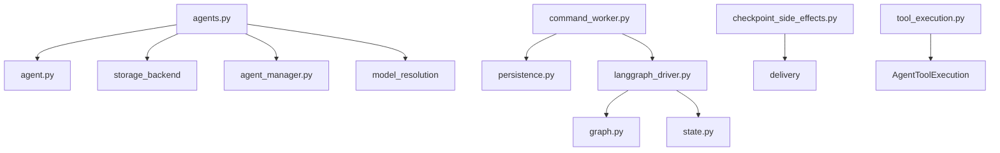

# Agent生命周期管理

<cite>
**本文引用的文件**   
- [agent_manager.py](file://backend/app/services/agent_manager.py)
- [agent.py](file://backend/app/models/agent.py)
- [agents.py](file://backend/app/api/agents.py)
- [state.py](file://backend/app/services/agent_runtime/state.py)
- [graph.py](file://backend/app/services/agent_runtime/graph.py)
- [langgraph_driver.py](file://backend/app/services/agent_runtime/langgraph_driver.py)
- [checkpoint_side_effects.py](file://backend/app/services/agent_runtime/checkpoint_side_effects.py)
- [persistence.py](file://backend/app/services/agent_runtime/persistence.py)
- [command_worker.py](file://backend/app/services/agent_runtime/command_worker.py)
- [tool_execution.py](file://backend/app/services/agent_runtime/tool_execution.py)
</cite>

## 目录
1. [简介](#简介)
2. [项目结构](#项目结构)
3. [核心组件](#核心组件)
4. [架构总览](#架构总览)
5. [详细组件分析](#详细组件分析)
6. [依赖关系分析](#依赖关系分析)
7. [性能考量](#性能考量)
8. [故障排查指南](#故障排查指南)
9. [结论](#结论)
10. [附录](#附录)

## 简介
本文件系统化阐述Agent从创建到销毁的完整生命周期，覆盖状态机（creating、running、idle、stopped、error）与运行时图状态（created、queued、running、waiting_*、verifying、completed、failed、cancelled），并解释初始化流程、容器化部署、运行时监控与优雅关闭。同时说明模板系统（内置与自定义）如何参与Agent初始化，以及资源管理与故障恢复的最佳实践。

## 项目结构
围绕Agent生命周期的关键代码分布在以下模块：
- API层：创建Agent、后台任务编排、模板与技能装配、容器启动钩子
- 模型层：Agent实体、权限、模板定义
- 运行时持久化：Run注册、命令入队、幂等性、调度槽位
- 运行时驱动：LangGraph图编译、检查点读取/执行、命令分发
- 侧效应与交付：基于检查点的产物同步、消息投递、事件记录
- 工具执行账本：幂等决策、重试策略、结果归档与脱敏
- 容器管理：Docker容器生命周期、端口映射、配置注入

**图表来源** 
- [agents.py:409-590](file://backend/app/api/agents.py#L409-L590)
- [agent.py:19-160](file://backend/app/models/agent.py#L19-L160)
- [persistence.py:321-401](file://backend/app/services/agent_runtime/persistence.py#L321-L401)
- [langgraph_driver.py:323-491](file://backend/app/services/agent_runtime/langgraph_driver.py#L323-L491)
- [graph.py:241-291](file://backend/app/services/agent_runtime/graph.py#L241-L291)
- [state.py:100-135](file://backend/app/services/agent_runtime/state.py#L100-L135)
- [checkpoint_side_effects.py:554-800](file://backend/app/services/agent_runtime/checkpoint_side_effects.py#L554-L800)
- [tool_execution.py:568-615](file://backend/app/services/agent_runtime/tool_execution.py#L568-L615)
- [agent_manager.py:250-316](file://backend/app/services/agent_manager.py#L250-L316)

**章节来源**
- [agents.py:409-590](file://backend/app/api/agents.py#L409-L590)
- [agent.py:19-160](file://backend/app/models/agent.py#L19-L160)
- [persistence.py:321-401](file://backend/app/services/agent_runtime/persistence.py#L321-L401)
- [langgraph_driver.py:323-491](file://backend/app/services/agent_runtime/langgraph_driver.py#L323-L491)
- [graph.py:241-291](file://backend/app/services/agent_runtime/graph.py#L241-L291)
- [state.py:100-135](file://backend/app/services/agent_runtime/state.py#L100-L135)
- [checkpoint_side_effects.py:554-800](file://backend/app/services/agent_runtime/checkpoint_side_effects.py#L554-L800)
- [tool_execution.py:568-615](file://backend/app/services/agent_runtime/tool_execution.py#L568-615)
- [agent_manager.py:250-316](file://backend/app/services/agent_manager.py#L250-316)

## 核心组件
- AgentManager：负责Agent工作区文件初始化、OpenClaw配置生成、Docker容器启动/停止/删除、容器状态查询
- Agent模型：定义Agent状态枚举、模板关联、权限、配额、心跳等字段
- 运行时持久化：Run注册、命令入队、幂等键、槽位锁定、尝试次数控制
- LangGraph驱动：读取检查点、执行命令（start/resume/cancel）、构建初始状态、路由控制
- 侧效应处理器：将已落盘的检查点投影为产品事件、消息投递、组内实时推送
- 工具执行账本：对工具调用进行幂等决策、安全脱敏、结果归档、重试策略
- 运行时状态契约：定义LifecycleStatus、RuntimeGraphState、RuntimeContext等类型

**章节来源**
- [agent_manager.py:51-376](file://backend/app/services/agent_manager.py#L51-376)
- [agent.py:19-160](file://backend/app/models/agent.py#L19-L160)
- [persistence.py:321-401](file://backend/app/services/agent_runtime/persistence.py#L321-L401)
- [langgraph_driver.py:323-491](file://backend/app/services/agent_runtime/langgraph_driver.py#L323-491)
- [checkpoint_side_effects.py:554-800](file://backend/app/services/agent_runtime/checkpoint_side_effects.py#L554-800)
- [tool_execution.py:568-615](file://backend/app/services/agent_runtime/tool_execution.py#L568-615)
- [state.py:100-135](file://backend/app/services/agent_runtime/state.py#L100-135)

## 架构总览
下图展示Agent从创建到运行、等待、完成/失败/取消的全链路交互，包括API、持久化、运行时图、侧效应与容器管理。

**图表来源** 
- [agents.py:409-590](file://backend/app/api/agents.py#L409-L590)
- [persistence.py:321-401](file://backend/app/services/agent_runtime/persistence.py#L321-L401)
- [agent_manager.py:250-316](file://backend/app/services/agent_manager.py#L250-L316)
- [langgraph_driver.py:395-491](file://backend/app/services/agent_runtime/langgraph_driver.py#L395-L491)
- [graph.py:241-291](file://backend/app/services/agent_runtime/graph.py#L241-L291)
- [checkpoint_side_effects.py:554-800](file://backend/app/services/agent_runtime/checkpoint_side_effects.py#L554-800)
- [tool_execution.py:568-615](file://backend/app/services/agent_runtime/tool_execution.py#L568-615)

## 详细组件分析

### Agent生命周期状态机（平台级）
- 状态枚举：creating、running、idle、stopped、error
- 转换规则：
  - 创建后进入creating；若Docker不可用则回退为idle
  - 容器启动成功设为running；失败设为error
  - 停止或移除容器后设为stopped
  - 异常时置error，需人工或自动修复后重启

**图表来源** 
- [agent.py:54-60](file://backend/app/models/agent.py#L54-L60)
- [agent_manager.py:250-316](file://backend/app/services/agent_manager.py#L250-L316)
- [agent_manager.py:317-356](file://backend/app/services/agent_manager.py#L317-L356)

**章节来源**
- [agent.py:54-60](file://backend/app/models/agent.py#L54-L60)
- [agent_manager.py:250-316](file://backend/app/services/agent_manager.py#L250-316)
- [agent_manager.py:317-356](file://backend/app/services/agent_manager.py#L317-356)

### 运行时图状态机（LangGraph）
- 状态类型：created、queued、running、waiting_user/waiting_external/waiting_agent、verifying、completed、failed、cancelled
- 路由控制：compact/model/tool/verify/wait/terminal
- 检查点分类：not_started、runnable、execution_error_recoverable、waiting、terminal、inconsistent

**图表来源** 
- [state.py:100-135](file://backend/app/services/agent_runtime/state.py#L100-L135)
- [state.py:194-216](file://backend/app/services/agent_runtime/state.py#L194-L216)

**章节来源**
- [state.py:100-135](file://backend/app/services/agent_runtime/state.py#L100-135)
- [state.py:194-216](file://backend/app/services/agent_runtime/state.py#L194-216)

### 模板系统与初始化
- 模板来源：数据库中的AgentTemplate（soul_template、default_skills、default_mcp_servers等）
- 初始化步骤：
  - 复制模板文件到Agent存储前缀
  - 渲染soul.md（替换{{agent_name}}、{{creator_name}}、{{created_at}}等占位符）
  - 追加/替换Personality与Boundaries段落
  - 确保memory.md、reflections.md、HEARTBEAT.md存在
  - 定制state.json（写入agent_id/name）
  - 安装默认技能与MCP服务器（Smithery导入）
  - 启动容器（openclaw.json配置注入）

**图表来源** 
- [agents.py:563-590](file://backend/app/api/agents.py#L563-L590)
- [agent_manager.py:94-229](file://backend/app/services/agent_manager.py#L94-L229)
- [agent_manager.py:230-249](file://backend/app/services/agent_manager.py#L230-L249)

**章节来源**
- [agents.py:563-590](file://backend/app/api/agents.py#L563-590)
- [agent_manager.py:94-229](file://backend/app/services/agent_manager.py#L94-229)
- [agent_manager.py:230-249](file://backend/app/services/agent_manager.py#L230-249)

### 容器化部署与监控
- 配置生成：根据活跃模型动态注入环境变量（API Key）
- 容器启动：分配唯一端口、挂载工作区、设置标签与重启策略
- 状态查询：实时获取容器运行状态、端口映射、创建时间
- 优雅关闭：stop(timeout=10)，失败时降级为stopped并清理container_id/port

**图表来源** 
- [agent_manager.py:230-249](file://backend/app/services/agent_manager.py#L230-L249)
- [agent_manager.py:250-316](file://backend/app/services/agent_manager.py#L250-L316)
- [agent_manager.py:357-374](file://backend/app/services/agent_manager.py#L357-L374)

**章节来源**
- [agent_manager.py:230-249](file://backend/app/services/agent_manager.py#L230-249)
- [agent_manager.py:250-316](file://backend/app/services/agent_manager.py#L250-316)
- [agent_manager.py:357-374](file://backend/app/services/agent_manager.py#L357-374)

### 运行时监控与优雅关闭
- 监控：通过检查点分类与事件记录观察运行状态（thinking/progress/tool_call）
- 优雅关闭：cancel命令保留最后检查点，标记applied，触发侧效应投递
- 健康检查：容器状态查询、last_active_at更新时间、心跳间隔

**图表来源** 
- [command_worker.py:768-800](file://backend/app/services/agent_runtime/command_worker.py#L768-L800)
- [checkpoint_side_effects.py:688-704](file://backend/app/services/agent_runtime/checkpoint_side_effects.py#L688-L704)

**章节来源**
- [command_worker.py:768-800](file://backend/app/services/agent_runtime/command_worker.py#L768-800)
- [checkpoint_side_effects.py:688-704](file://backend/app/services/agent_runtime/checkpoint_side_effects.py#L688-704)

### 资源管理与故障恢复最佳实践
- 幂等性：Run注册与命令入队使用idempotency_key，避免重复执行
- 槽位锁定：按scheduling_lane_key串行化start命令，防止并发冲突
- 尝试次数：max_attempts限制，超限进入隔离队列
- 工具执行：safe read可重试，external_write不重试，结果归档与脱敏
- 检查点一致性：values/next/tasks/interrupts必须一致，否则视为inconsistent

**图表来源** 
- [persistence.py:321-401](file://backend/app/services/agent_runtime/persistence.py#L321-L401)
- [persistence.py:599-633](file://backend/app/services/agent_runtime/persistence.py#L599-L633)
- [tool_execution.py:568-615](file://backend/app/services/agent_runtime/tool_execution.py#L568-615)

**章节来源**
- [persistence.py:321-401](file://backend/app/services/agent_runtime/persistence.py#L321-401)
- [persistence.py:599-633](file://backend/app/services/agent_runtime/persistence.py#L599-633)
- [tool_execution.py:568-615](file://backend/app/services/agent_runtime/tool_execution.py#L568-615)

## 依赖关系分析
- API层依赖：模型、存储后端、AgentManager、LLM模型解析、权限校验
- 运行时依赖：LangGraph驱动、检查点读取器、节点执行器、侧效应处理器
- 容器依赖：Docker SDK、网络配置、镜像名称、端口分配策略
- 数据依赖：PostgreSQL（Run/Command/Event）、对象存储（工作区文件）

**图表来源** 
- [agents.py:409-590](file://backend/app/api/agents.py#L409-L590)
- [agent.py:19-160](file://backend/app/models/agent.py#L19-L160)
- [command_worker.py:312-361](file://backend/app/services/agent_runtime/command_worker.py#L312-L361)
- [persistence.py:321-401](file://backend/app/services/agent_runtime/persistence.py#L321-L401)
- [langgraph_driver.py:323-491](file://backend/app/services/agent_runtime/langgraph_driver.py#L323-491)
- [graph.py:241-291](file://backend/app/services/agent_runtime/graph.py#L241-291)
- [state.py:100-135](file://backend/app/services/agent_runtime/state.py#L100-135)
- [checkpoint_side_effects.py:554-800](file://backend/app/services/agent_runtime/checkpoint_side_effects.py#L554-800)
- [tool_execution.py:568-615](file://backend/app/services/agent_runtime/tool_execution.py#L568-615)

**章节来源**
- [agents.py:409-590](file://backend/app/api/agents.py#L409-590)
- [agent.py:19-160](file://backend/app/models/agent.py#L19-160)
- [command_worker.py:312-361](file://backend/app/services/agent_runtime/command_worker.py#L312-361)
- [persistence.py:321-401](file://backend/app/services/agent_runtime/persistence.py#L321-401)
- [langgraph_driver.py:323-491](file://backend/app/services/agent_runtime/langgraph_driver.py#L323-491)
- [graph.py:241-291](file://backend/app/services/agent_runtime/graph.py#L241-291)
- [state.py:100-135](file://backend/app/services/agent_runtime/state.py#L100-135)
- [checkpoint_side_effects.py:554-800](file://backend/app/services/agent_runtime/checkpoint_side_effects.py#L554-800)
- [tool_execution.py:568-615](file://backend/app/services/agent_runtime/tool_execution.py#L568-615)

## 性能考量
- 并发上传模板文件：使用asyncio.gather批量写入存储，减少I/O延迟
- 懒重置令牌计数器：在列表/详情接口按需重置，避免频繁写库
- 检查点分类快速路径：waiting/terminal直接应用，减少无效执行
- 工具执行重试：仅对safe read且明确标记retryable的错误重试，降低不必要开销
- 槽位锁定：按lane串行化start，避免热点竞争

[本节为通用指导，无需特定文件引用]

## 故障排查指南
- 容器启动失败：检查Docker可用性、镜像名称、端口冲突、环境变量（API Key）
- 状态卡住：查看检查点分类是否为inconsistent，确认values/next/tasks/interrupts一致性
- 命令被拒绝：检查idempotency_key冲突、run_scope_mismatch、legacy_runtime不支持
- 工具执行异常：查看ToolExecutionOutcome的error_code与metadata，确认是否需归档或重试
- 侧效应失败：关注product_sync_pending标记，重试投递与组消息发布

**章节来源**
- [agent_manager.py:312-335](file://backend/app/services/agent_manager.py#L312-335)
- [command_worker.py:630-663](file://backend/app/services/agent_runtime/command_worker.py#L630-663)
- [tool_execution.py:409-465](file://backend/app/services/agent_runtime/tool_execution.py#L409-465)
- [checkpoint_side_effects.py:665-704](file://backend/app/services/agent_runtime/checkpoint_side_effects.py#L665-704)

## 结论
本系统通过分层设计实现了Agent全生命周期管理：API层负责任务编排与权限控制，持久化层保障幂等与并发安全，运行时驱动基于LangGraph实现可恢复的执行流，侧效应处理器确保产物一致性，容器管理层提供隔离与弹性。结合模板系统与工具执行账本，系统在可扩展性与可靠性之间取得平衡。建议在生产环境中加强监控告警、定期巡检检查点一致性、优化模板加载与容器启动性能。

[本节为总结性内容，无需特定文件引用]

## 附录
- 状态参考：
  - 平台级Agent状态：creating、running、idle、stopped、error
  - 运行时图状态：created、queued、running、waiting_user、waiting_external、waiting_agent、verifying、completed、failed、cancelled
- 关键接口路径：
  - 创建Agent：POST /agents
  - 列出模板：GET /agents/templates
  - 获取Agent详情：GET /agents/{agent_id}
  - 更新权限：PUT /agents/{agent_id}/permissions

[本节为补充信息，无需特定文件引用]