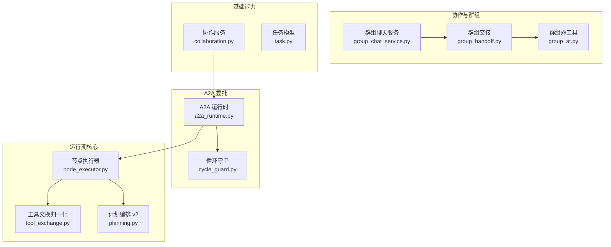
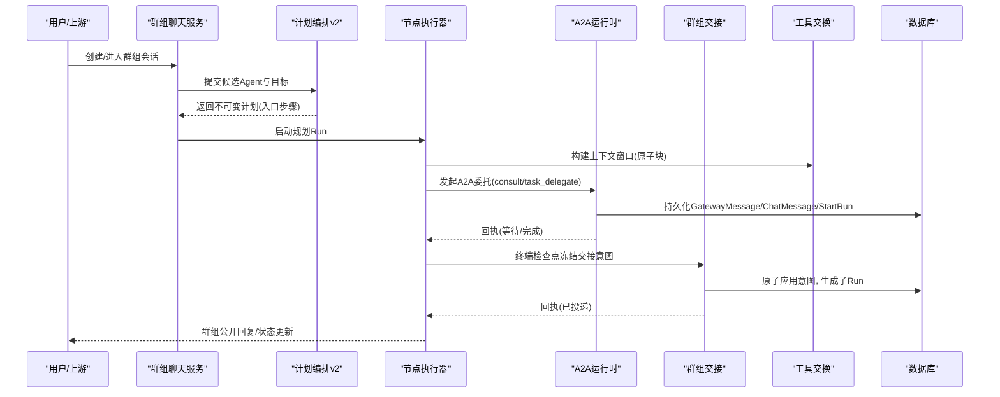
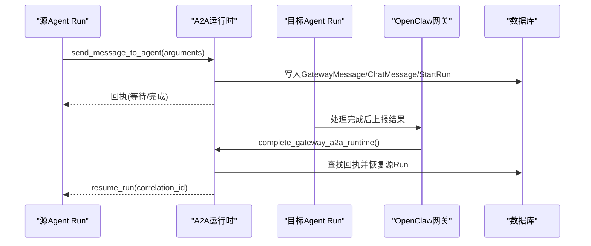
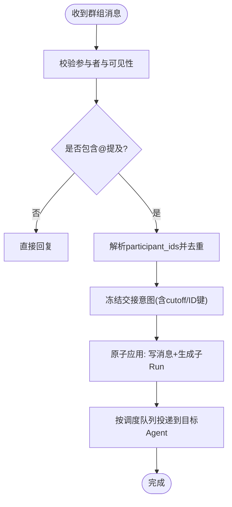
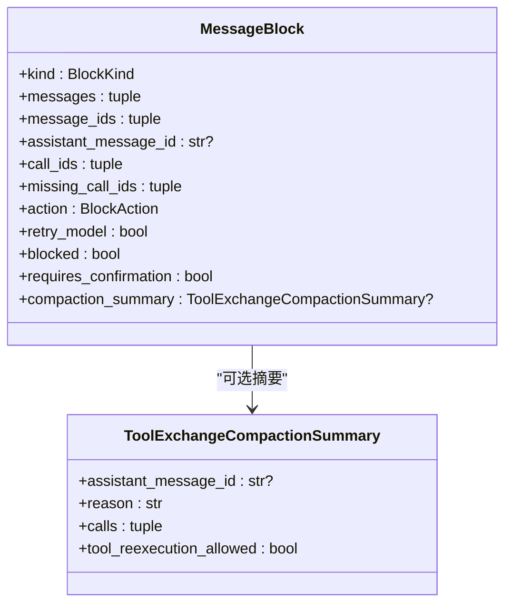
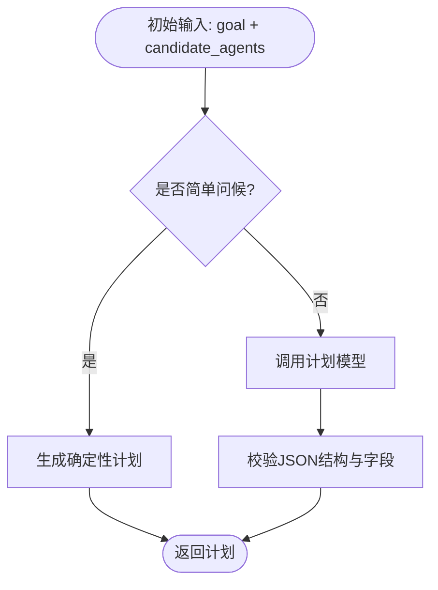
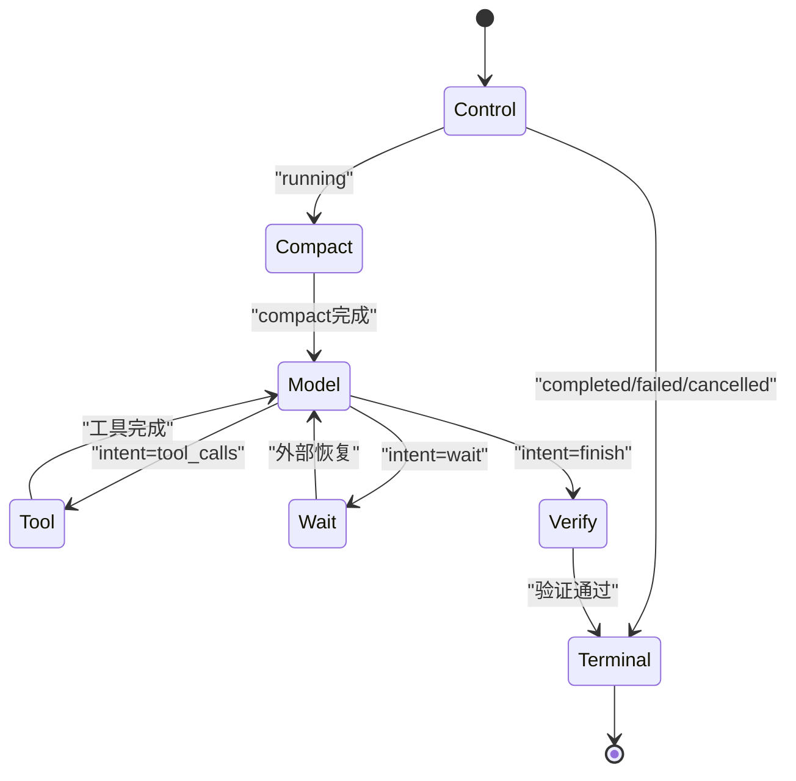
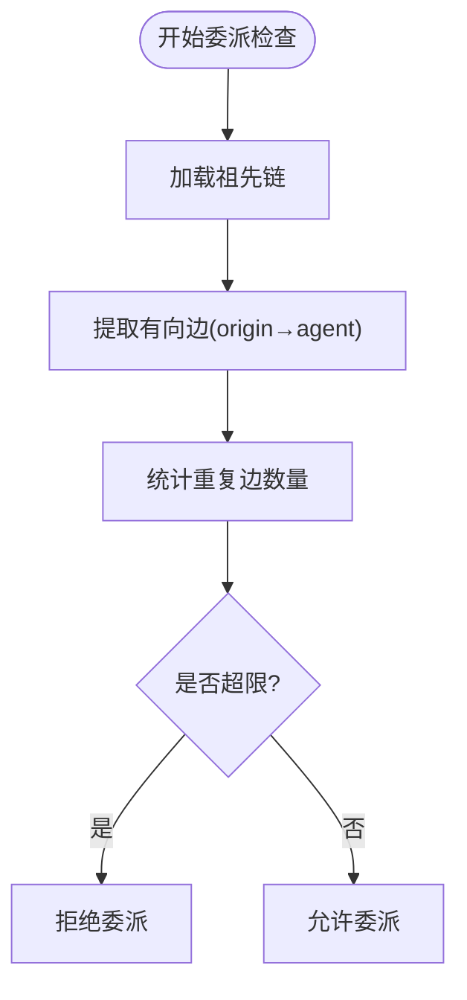
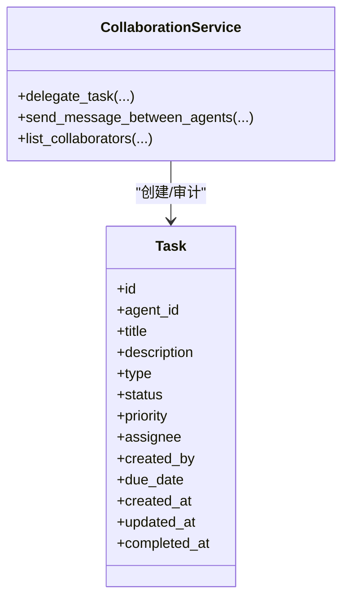
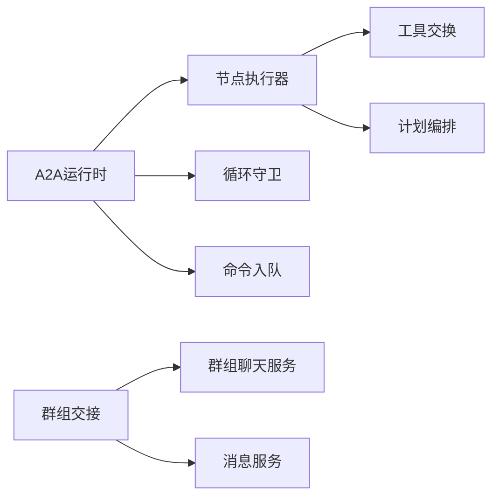

# 多智能体协作模式

<cite>
**本文引用的文件**   
- [collaboration.py](file://backend/app/services/collaboration.py)
- [a2a_runtime.py](file://backend/app/services/agent_runtime/a2a_runtime.py)
- [group_chat_service.py](file://backend/app/services/group_chat_service.py)
- [group_handoff.py](file://backend/app/services/agent_runtime/group_handoff.py)
- [group_at.py](file://backend/app/services/agent_runtime/group_at.py)
- [tool_exchange.py](file://backend/app/services/agent_runtime/tool_exchange.py)
- [planning.py](file://backend/app/services/agent_runtime/planning.py)
- [node_executor.py](file://backend/app/services/agent_runtime/node_executor.py)
- [cycle_guard.py](file://backend/app/services/agent_runtime/cycle_guard.py)
- [task.py](file://backend/app/models/task.py)
</cite>

## 目录
1. [简介](#简介)
2. [项目结构](#项目结构)
3. [核心组件](#核心组件)
4. [架构总览](#架构总览)
5. [详细组件分析](#详细组件分析)
6. [依赖关系分析](#依赖关系分析)
7. [性能考虑](#性能考虑)
8. [故障排查指南](#故障排查指南)
9. [结论](#结论)
10. [附录](#附录)

## 简介
本文件系统化阐述多智能体协作模式，覆盖以下关键主题：
- Agent 间通信机制与协作协议（消息传递、任务分配、结果同步）
- 群组聊天中的参与机制（@提及、轮询与负载均衡策略）
- 依赖关系管理与执行顺序控制（工作流编排）
- 典型协作示例（任务分解、并行执行、结果聚合）
- 错误处理与重试机制（一致性、事务完整性）

该体系以“运行时图 + 工具交换原子性 + 计划编排 + 群内公开交接”为核心设计思想，确保跨 Agent 的调用可追踪、可恢复、可审计。

## 项目结构
后端服务围绕“Agent 运行时”“群组协作”“A2A 委托”“工具交换”“计划编排”五大模块组织，配合数据库模型与权限校验，形成高内聚、低耦合的多智能体协作平台。

**图表来源** 
- [group_chat_service.py:1-200](file://backend/app/services/group_chat_service.py#L1-L200)
- [group_handoff.py:1-120](file://backend/app/services/agent_runtime/group_handoff.py#L1-L120)
- [group_at.py:1-88](file://backend/app/services/agent_runtime/group_at.py#L1-L88)
- [a2a_runtime.py:1-120](file://backend/app/services/agent_runtime/a2a_runtime.py#L1-L120)
- [cycle_guard.py:1-80](file://backend/app/services/agent_runtime/cycle_guard.py#L1-L80)
- [node_executor.py:1-120](file://backend/app/services/agent_runtime/node_executor.py#L1-L120)
- [tool_exchange.py:1-120](file://backend/app/services/agent_runtime/tool_exchange.py#L1-L120)
- [planning.py:1-120](file://backend/app/services/agent_runtime/planning.py#L1-L120)
- [collaboration.py:1-60](file://backend/app/services/collaboration.py#L1-L60)
- [task.py:1-60](file://backend/app/models/task.py#L1-L60)

**章节来源**
- [group_chat_service.py:1-200](file://backend/app/services/group_chat_service.py#L1-L200)
- [a2a_runtime.py:1-120](file://backend/app/services/agent_runtime/a2a_runtime.py#L1-L120)
- [planning.py:1-120](file://backend/app/services/agent_runtime/planning.py#L1-L120)
- [node_executor.py:1-120](file://backend/app/services/agent_runtime/node_executor.py#L1-L120)
- [tool_exchange.py:1-120](file://backend/app/services/agent_runtime/tool_exchange.py#L1-L120)
- [group_handoff.py:1-120](file://backend/app/services/agent_runtime/group_handoff.py#L1-L120)
- [group_at.py:1-88](file://backend/app/services/agent_runtime/group_at.py#L1-L88)
- [collaboration.py:1-60](file://backend/app/services/collaboration.py#L1-L60)
- [task.py:1-60](file://backend/app/models/task.py#L1-L60)

## 核心组件
- 协作服务（CollaborationService）
  - 提供 Agent 间的委托、通知、咨询三类协作语义；支持审计日志与持久化存储。
- A2A 运行时（RuntimeA2AService / Gateway 集成）
  - 将 send_message_to_agent 工具调用转化为目标 Run 启动或结果回传，保证幂等与关联。
- 群组聊天服务（GroupChatService）
  - 管理群组、成员、会话、读水位线、邀请与可见性，为 @提及与交接提供基础。
- 群组交接（GroupAgentHandoff）
  - 在终端检查点冻结交付意图，随后原子应用，生成子 Run 并投递到群组。
- 群组 @ 工具（group_at）
  - 结构化声明最终回复需要被提及的参与者集合，作为交接前置约束。
- 工具交换（Tool Exchange）
  - 将消息历史分组为原子块，保证工具调用与结果成对出现，避免孤儿消息。
- 计划编排（Planning v2）
  - 基于候选 Agent 列表生成不可变计划（advisory/enforced），驱动后续公共交接。
- 节点执行器（DeterministicRuntimeNodeExecutor）
  - 统一生命周期转换、模型步骤、工具执行、验证与收尾，支撑等待与恢复。
- 循环守卫（AgentCycleGuard）
  - 基于父链重建计算重复边，防止无限递归与过深委派。

**章节来源**
- [collaboration.py:15-167](file://backend/app/services/collaboration.py#L15-L167)
- [a2a_runtime.py:731-800](file://backend/app/services/agent_runtime/a2a_runtime.py#L731-L800)
- [group_chat_service.py:378-500](file://backend/app/services/group_chat_service.py#L378-L500)
- [group_handoff.py:594-703](file://backend/app/services/agent_runtime/group_handoff.py#L594-L703)
- [group_at.py:1-88](file://backend/app/services/agent_runtime/group_at.py#L1-L88)
- [tool_exchange.py:513-654](file://backend/app/services/agent_runtime/tool_exchange.py#L513-L654)
- [planning.py:374-508](file://backend/app/services/agent_runtime/planning.py#L374-L508)
- [node_executor.py:469-800](file://backend/app/services/agent_runtime/node_executor.py#L469-L800)
- [cycle_guard.py:111-240](file://backend/app/services/agent_runtime/cycle_guard.py#L111-L240)

## 架构总览
下图展示从用户输入到多 Agent 协作执行的端到端流程，包括计划编排、A2A 委托、群组交接与工具交换原子性保障。

**图表来源** 
- [planning.py:374-508](file://backend/app/services/agent_runtime/planning.py#L374-L508)
- [node_executor.py:469-800](file://backend/app/services/agent_runtime/node_executor.py#L469-L800)
- [a2a_runtime.py:533-696](file://backend/app/services/agent_runtime/a2a_runtime.py#L533-L696)
- [group_handoff.py:783-901](file://backend/app/services/agent_runtime/group_handoff.py#L783-L901)
- [tool_exchange.py:513-654](file://backend/app/services/agent_runtime/tool_exchange.py#L513-L654)

## 详细组件分析

### A2A 委托与结果同步
- 三种模式：notify（单向）、consult（等待回答）、task_delegate（任务委派）
- 通过工具回执关联源 Run 与目标 Run，使用 correlation_id 实现结果回传
- 支持 OpenClaw 网关桥接，确保跨系统消息一致性与幂等

**图表来源** 
- [a2a_runtime.py:214-321](file://backend/app/services/agent_runtime/a2a_runtime.py#L214-L321)
- [a2a_runtime.py:533-696](file://backend/app/services/agent_runtime/a2a_runtime.py#L533-L696)

**章节来源**
- [a2a_runtime.py:89-156](file://backend/app/services/agent_runtime/a2a_runtime.py#L89-L156)
- [a2a_runtime.py:214-321](file://backend/app/services/agent_runtime/a2a_runtime.py#L214-L321)
- [a2a_runtime.py:533-696](file://backend/app/services/agent_runtime/a2a_runtime.py#L533-L696)

### 群组聊天与 @ 提及
- 成员资格与可见性校验，确保仅活跃且授权的 Agent 参与
- 使用 at 工具声明最终回复需被提及的参与者集合，作为交接前置
- 读水位线与会话状态维护，支持增量拉取与去重

**图表来源** 
- [group_chat_service.py:378-500](file://backend/app/services/group_chat_service.py#L378-L500)
- [group_at.py:1-88](file://backend/app/services/agent_runtime/group_at.py#L1-L88)
- [group_handoff.py:594-703](file://backend/app/services/agent_runtime/group_handoff.py#L594-L703)

**章节来源**
- [group_chat_service.py:378-500](file://backend/app/services/group_chat_service.py#L378-L500)
- [group_at.py:1-88](file://backend/app/services/agent_runtime/group_at.py#L1-L88)
- [group_handoff.py:594-703](file://backend/app/services/agent_runtime/group_handoff.py#L594-L703)

### 工具交换原子性与上下文窗口
- 将消息序列分组为 MessageBlock，保证 tool_calls 与结果成对
- 根据执行账本决定动作：emit、retry_model、summarize、block_reconcile、require_confirmation
- 选择最近窗口时保持原子性，避免截断导致的不一致

**图表来源** 
- [tool_exchange.py:64-98](file://backend/app/services/agent_runtime/tool_exchange.py#L64-L98)
- [tool_exchange.py:188-236](file://backend/app/services/agent_runtime/tool_exchange.py#L188-L236)

**章节来源**
- [tool_exchange.py:513-654](file://backend/app/services/agent_runtime/tool_exchange.py#L513-L654)
- [tool_exchange.py:684-800](file://backend/app/services/agent_runtime/tool_exchange.py#L684-L800)

### 计划编排 v2 与工作流编排
- 输入：候选 Agent 列表、用户目标、显式约束
- 输出：不可变计划（version/mode/goal/plan_prompt/entry_steps）
- 简单问候场景可直接生成确定性计划，减少 LLM 调用开销
- 支持修复上下文，限制最大修复次数

**图表来源** 
- [planning.py:208-271](file://backend/app/services/agent_runtime/planning.py#L208-L271)
- [planning.py:374-508](file://backend/app/services/agent_runtime/planning.py#L374-L508)

**章节来源**
- [planning.py:374-508](file://backend/app/services/agent_runtime/planning.py#L374-L508)
- [planning.py:510-528](file://backend/app/services/agent_runtime/planning.py#L510-L528)

### 节点执行器与等待/恢复
- 统一控制流：control → compact → model → tool → verify → terminal
- 支持 waiting_user/waiting_external/waiting_agent 三种等待类型
- 失败路径记录错误码与原因，支持有限次修复与终止

**图表来源** 
- [node_executor.py:469-800](file://backend/app/services/agent_runtime/node_executor.py#L469-L800)

**章节来源**
- [node_executor.py:469-800](file://backend/app/services/agent_runtime/node_executor.py#L469-L800)

### 循环守卫与深度限制
- 基于父链重建，统计有向边重复次数，超过阈值拒绝委派
- 限制祖先深度，防止过深嵌套
- 区分 delegated/orchestration/foreground/background 等 run_kind

**图表来源** 
- [cycle_guard.py:111-240](file://backend/app/services/agent_runtime/cycle_guard.py#L111-L240)

**章节来源**
- [cycle_guard.py:111-240](file://backend/app/services/agent_runtime/cycle_guard.py#L111-L240)

### 协作服务与任务模型
- CollaborationService 提供 delegate_task、send_message_between_agents、list_collaborators
- Task 模型支持 todo/supervision 类型、优先级、截止日期与审计日志

**图表来源** 
- [collaboration.py:15-167](file://backend/app/services/collaboration.py#L15-L167)
- [task.py:13-75](file://backend/app/models/task.py#L13-L75)

**章节来源**
- [collaboration.py:15-167](file://backend/app/services/collaboration.py#L15-L167)
- [task.py:13-75](file://backend/app/models/task.py#L13-L75)

## 依赖关系分析
- 组件耦合
  - A2A 运行时依赖节点执行器、循环守卫、命令入队与配置决策
  - 群组交接依赖群组聊天服务与消息服务，确保范围与可见性正确
  - 工具交换独立于具体模型，仅依赖执行账本与消息规范
- 外部依赖
  - 数据库用于持久化会话、消息、Run、审计日志与任务
  - LLM 客户端用于计划编排与模型步骤

**图表来源** 
- [a2a_runtime.py:731-800](file://backend/app/services/agent_runtime/a2a_runtime.py#L731-L800)
- [group_handoff.py:783-901](file://backend/app/services/agent_runtime/group_handoff.py#L783-L901)
- [node_executor.py:469-800](file://backend/app/services/agent_runtime/node_executor.py#L469-L800)

**章节来源**
- [a2a_runtime.py:731-800](file://backend/app/services/agent_runtime/a2a_runtime.py#L731-L800)
- [group_handoff.py:783-901](file://backend/app/services/agent_runtime/group_handoff.py#L783-L901)
- [node_executor.py:469-800](file://backend/app/services/agent_runtime/node_executor.py#L469-L800)

## 性能考虑
- 上下文窗口压缩：仅在安全边界内进行，保留原子块完整性
- 计划编排缓存：简单问候场景跳过 LLM 调用，降低延迟
- 调度队列：群组交接按租户与 Agent 维度分 lane，提升吞吐
- 幂等键：所有跨进程/重启操作均使用 idempotency_key 避免重复执行

[本节为通用指导，不直接分析具体文件]

## 故障排查指南
- 常见错误码与定位
  - a2a_target_not_found / a2a_target_unavailable：检查目标 Agent 可见性与状态
  - group_handoff_source_invalid：核对 source Run 的 delivery target 与上下文
  - incomplete_tool_exchange：检查工具调用与结果是否成对，查看执行账本
  - planning_failed / invalid_plan：检查候选 Agent 列表与 JSON 结构
- 调试建议
  - 启用审计日志与工具执行账本，观察完整链路
  - 使用 correlation_id 与 result_ref 追踪跨 Run 的依赖
  - 检查循环守卫计数与祖先深度，避免环路或过深委派

**章节来源**
- [a2a_runtime.py:89-156](file://backend/app/services/agent_runtime/a2a_runtime.py#L89-L156)
- [group_handoff.py:594-703](file://backend/app/services/agent_runtime/group_handoff.py#L594-L703)
- [tool_exchange.py:667-682](file://backend/app/services/agent_runtime/tool_exchange.py#L667-L682)
- [planning.py:374-508](file://backend/app/services/agent_runtime/planning.py#L374-L508)

## 结论
本方案通过“计划编排 + 工具交换原子性 + 群组公开交接 + A2A 委托”的组合，实现了可扩展、可观测、可恢复的多智能体协作。其关键优势在于：
- 强一致的消息与工具交换，避免孤儿与不一致
- 明确的依赖与顺序控制，支持复杂工作流编排
- 幂等与事务化的跨 Run 操作，保障数据一致性
- 灵活的群组参与机制，支持 @ 提及与负载均衡

[本节为总结，不直接分析具体文件]

## 附录
- 术语表
  - A2A：Agent-to-Agent 委托
  - Group Handoff：群组公开交接
  - Tool Exchange：工具交换原子块
  - Planning v2：计划编排 v2 契约
- 最佳实践
  - 明确候选 Agent 列表与职责绑定，避免歧义
  - 使用 consult/task_delegate 模式表达不同协作语义
  - 在群组中使用 at 工具限定最终回复的提及范围
  - 利用 correlation_id/result_ref 建立跨 Run 的可追溯性

[本节为补充信息，不直接分析具体文件]