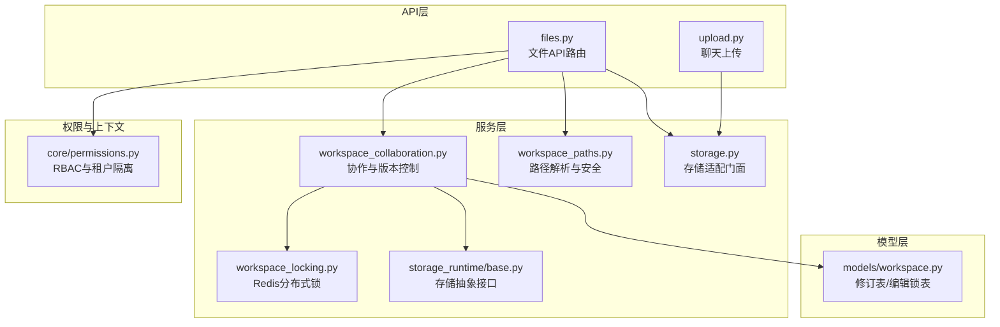
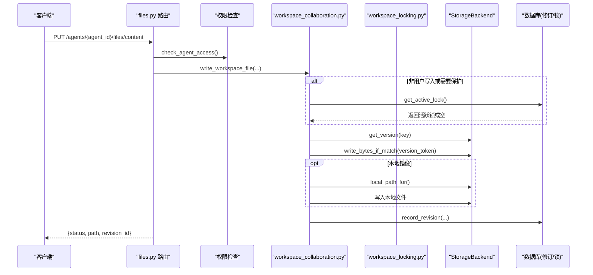
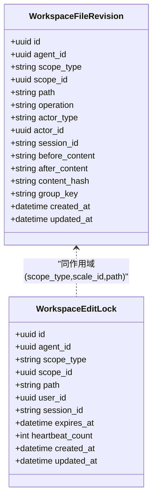
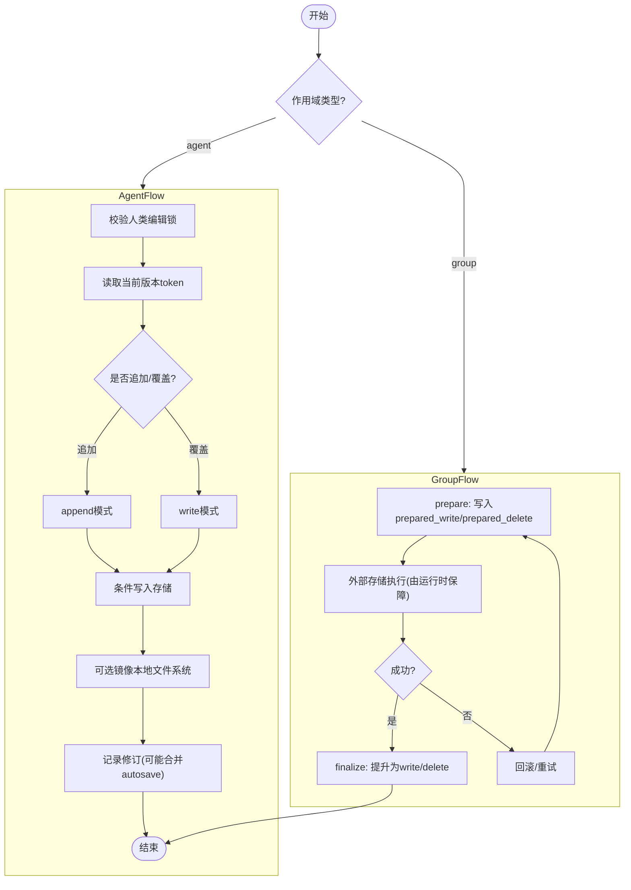
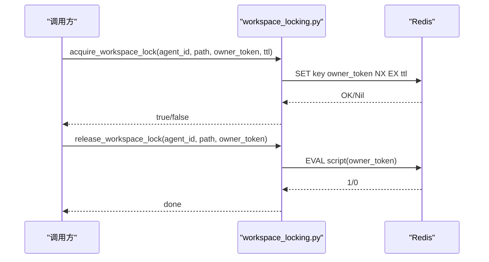
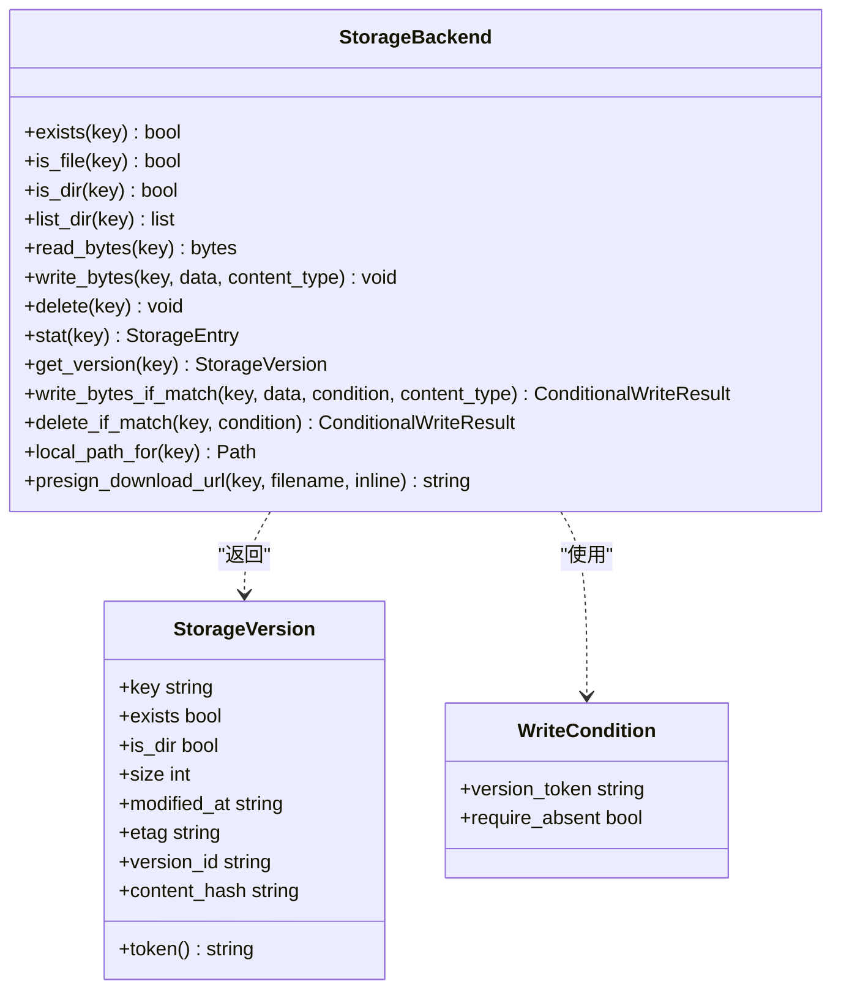
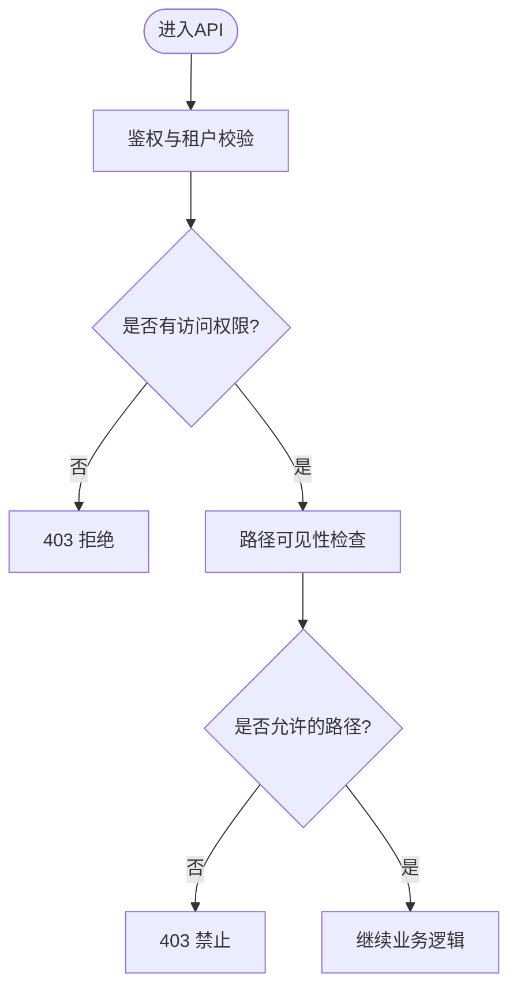
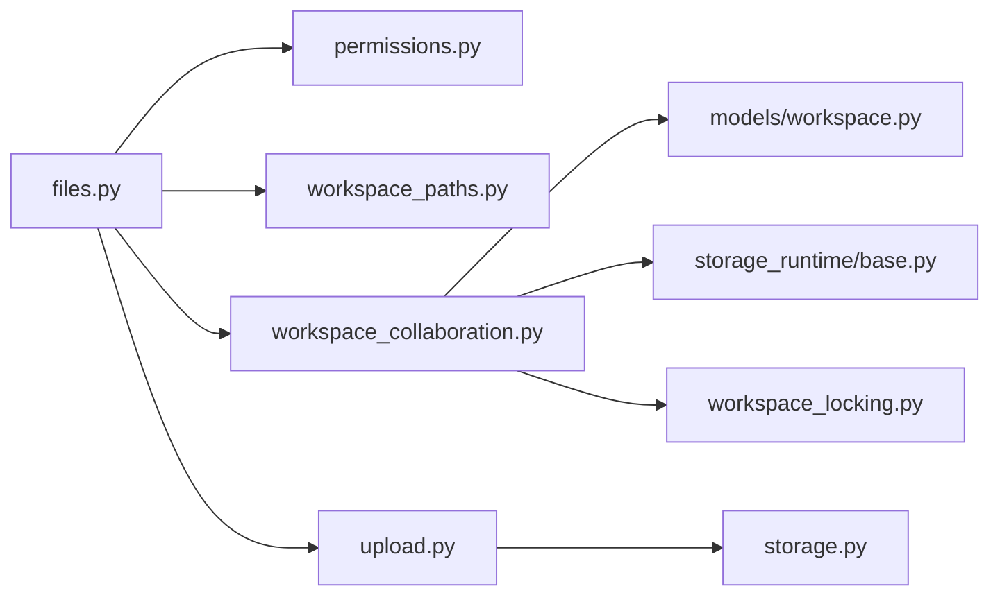

# 工作空间管理

<cite>
**本文引用的文件**   
- [backend/app/models/workspace.py](file://backend/app/models/workspace.py)
- [backend/app/services/workspace_locking.py](file://backend/app/services/workspace_locking.py)
- [backend/app/services/workspace_collaboration.py](file://backend/app/services/workspace_collaboration.py)
- [backend/app/api/files.py](file://backend/app/api/files.py)
- [backend/app/api/upload.py](file://backend/app/api/upload.py)
- [backend/app/services/storage_runtime/base.py](file://backend/app/services/storage_runtime/base.py)
- [backend/app/services/storage.py](file://backend/app/services/storage.py)
- [backend/app/core/permissions.py](file://backend/app/core/permissions.py)
- [backend/app/services/workspace_paths.py](file://backend/app/services/workspace_paths.py)
</cite>

## 目录
1. [简介](#简介)
2. [项目结构](#项目结构)
3. [核心组件](#核心组件)
4. [架构总览](#架构总览)
5. [详细组件分析](#详细组件分析)
6. [依赖关系分析](#依赖关系分析)
7. [性能考虑](#性能考虑)
8. [故障排查指南](#故障排查指南)
9. [结论](#结论)
10. [附录：API使用示例](#附录api使用示例)

## 简介
本文件面向“工作空间管理系统”的设计与实现，覆盖以下关键主题：
- 工作空间的层次结构与数据隔离机制（个人工作空间 vs 团队工作空间）
- 文件版本控制、协作编辑与冲突解决
- 工作空间锁机制（人类编辑锁 + Redis分布式锁）及其并发安全原理
- 权限控制与访问策略（租户隔离、RBAC、路径可见性）
- 工作空间API的使用示例（上传、下载、读写、版本管理与恢复）

## 项目结构
后端围绕 FastAPI 路由层、服务层、模型层与存储抽象构建。与工作空间相关的核心代码分布如下：
- API 路由：文件列表、读取、预览、下载、写入、锁定、版本历史、删除等
- 服务层：工作空间协作（写/删/移动、版本记录、自动合并）、分布式锁、路径解析
- 模型层：工作空间文件修订表、编辑锁表
- 存储抽象：统一 StorageBackend 接口，支持本地与对象存储（如 S3），提供条件写入与版本令牌
- 权限与路径：基于租户与角色的访问控制，以及企业知识库与企业信息目录的可见性控制

**图表来源** 
- [backend/app/api/files.py](file://backend/app/api/files.py)
- [backend/app/api/upload.py](file://backend/app/api/upload.py)
- [backend/app/services/workspace_collaboration.py](file://backend/app/services/workspace_collaboration.py)
- [backend/app/services/workspace_locking.py](file://backend/app/services/workspace_locking.py)
- [backend/app/services/workspace_paths.py](file://backend/app/services/workspace_paths.py)
- [backend/app/services/storage_runtime/base.py](file://backend/app/services/storage_runtime/base.py)
- [backend/app/services/storage.py](file://backend/app/services/storage.py)
- [backend/app/models/workspace.py](file://backend/app/models/workspace.py)
- [backend/app/core/permissions.py](file://backend/app/core/permissions.py)

**章节来源**
- [backend/app/api/files.py](file://backend/app/api/files.py)
- [backend/app/api/upload.py](file://backend/app/api/upload.py)
- [backend/app/services/workspace_collaboration.py](file://backend/app/services/workspace_collaboration.py)
- [backend/app/services/workspace_locking.py](file://backend/app/services/workspace_locking.py)
- [backend/app/services/workspace_paths.py](file://backend/app/services/workspace_paths.py)
- [backend/app/services/storage_runtime/base.py](file://backend/app/services/storage_runtime/base.py)
- [backend/app/services/storage.py](file://backend/app/services/storage.py)
- [backend/app/models/workspace.py](file://backend/app/models/workspace.py)
- [backend/app/core/permissions.py](file://backend/app/core/permissions.py)

## 核心组件
- 工作空间模型
  - WorkspaceFileRevision：记录一次有意义的文件变更（操作类型、前后内容、内容哈希、作用域 scope_type/scope_id、执行者 actor_type/actor_id、会话 session_id 等）
  - WorkspaceEditLock：短生命周期的人类编辑锁（用户、会话、过期时间、心跳计数）
- 工作空间协作服务
  - 写/删/移动文件，强制人类编辑锁检查，条件写入（version_token），自动合并用户自动保存（autosave）
  - 团队工作空间（group）通过 group_key 关联到工具执行 ID，支持 prepare/finalize 两阶段提交
- 分布式锁
  - 基于 Redis 的原子 set-if-absent 与 Lua 脚本释放，保证跨进程/实例的互斥
- 存储抽象
  - StorageBackend 定义 exists/is_file/is_dir/list/read/write/delete/stat/get_version 等接口
  - ConditionalWriteResult 与 WriteCondition 提供乐观并发控制（version_token）
- 权限与路径
  - check_agent_access 实现租户隔离与 RBAC（creator/admin/显式授权）
  - resolve_agent_visible_path 将 enterprise_info 与企业租户目录映射为可见路径，防止越权访问

**章节来源**
- [backend/app/models/workspace.py](file://backend/app/models/workspace.py)
- [backend/app/services/workspace_collaboration.py](file://backend/app/services/workspace_collaboration.py)
- [backend/app/services/workspace_locking.py](file://backend/app/services/workspace_locking.py)
- [backend/app/services/storage_runtime/base.py](file://backend/app/services/storage_runtime/base.py)
- [backend/app/core/permissions.py](file://backend/app/core/permissions.py)
- [backend/app/services/workspace_paths.py](file://backend/app/services/workspace_paths.py)

## 架构总览
下图展示从 HTTP 请求到存储落盘与版本记录的完整链路，包括人类编辑锁与分布式锁的协同。

**图表来源** 
- [backend/app/api/files.py](file://backend/app/api/files.py)
- [backend/app/services/workspace_collaboration.py](file://backend/app/services/workspace_collaboration.py)
- [backend/app/services/workspace_locking.py](file://backend/app/services/workspace_locking.py)
- [backend/app/services/storage_runtime/base.py](file://backend/app/services/storage_runtime/base.py)
- [backend/app/models/workspace.py](file://backend/app/models/workspace.py)

## 详细组件分析

### 工作空间模型与数据隔离
- 作用域（scope_type）
  - agent：个人工作空间，scope_id=agent_id，agent_id 必填
  - group：团队工作空间，scope_id=group_id，agent_id 为空
- 修订记录（WorkspaceFileRevision）
  - 字段包含 path、operation、actor_type/actor_id、session_id、before/after content、content_hash、group_key、时间戳
  - 索引优化：按 scope_type/scope_id/path 查询；created_at/updated_at 排序
- 编辑锁（WorkspaceEditLock）
  - 唯一约束：(scope_type, scope_id, path)，避免重复锁
  - 心跳与过期：expires_at 与 heartbeat_count 用于保活与清理

**图表来源** 
- [backend/app/models/workspace.py](file://backend/app/models/workspace.py)

**章节来源**
- [backend/app/models/workspace.py](file://backend/app/models/workspace.py)

### 协作与版本控制（个人与团队）
- 个人工作空间（agent）
  - write_workspace_file：校验人类编辑锁（非用户写入时），获取当前版本 token，条件写入存储，记录修订
  - delete_workspace_file：递归收集树版本 token，批量条件删除，记录删除修订
  - move_workspace_path：源/目标双重锁，处理覆盖与目录移动，逐条目条件复制/删除
  - autosave 合并：同一用户短时间内的多次自动保存会合并为一条修订，减少噪声
- 团队工作空间（group）
  - prepare_group_runtime_revision：以 Tool Execution ID 作为稳定 key，持久化“准备态”操作
  - finalize_group_runtime_revision：在确认外部存储已变更后，将“准备态”提升为可见的历史修订
  - list_group_revisions：过滤掉 prepared_* 的内部行，仅暴露最终可见历史

**图表来源** 
- [backend/app/services/workspace_collaboration.py](file://backend/app/services/workspace_collaboration.py)

**章节来源**
- [backend/app/services/workspace_collaboration.py](file://backend/app/services/workspace_collaboration.py)

### 分布式锁与并发控制
- Redis 分布式锁
  - acquire_workspace_lock：set key with NX + TTL，确保原子性与超时
  - release_workspace_lock：Lua 脚本比较 owner_token 后删除，避免误释放
  - workspace_locks：对多个路径排序后依次加锁，失败则全部回滚释放
- 人类编辑锁
  - acquire_edit_lock/release_edit_lock：基于数据库的唯一约束与过期清理，心跳更新
  - enforce_human_lock：非用户写入时禁止修改被人类编辑的文件

**图表来源** 
- [backend/app/services/workspace_locking.py](file://backend/app/services/workspace_locking.py)

**章节来源**
- [backend/app/services/workspace_locking.py](file://backend/app/services/workspace_locking.py)
- [backend/app/services/workspace_collaboration.py](file://backend/app/services/workspace_collaboration.py)

### 存储抽象与条件写入
- StorageBackend 接口
  - 提供 exists/is_file/is_dir/list/read/write/delete/stat/get_version/local_path_for/presign_download_url
  - write_bytes_if_match/delete_if_match 支持 WriteCondition（version_token/require_absent）
- 版本令牌（version_token）
  - 由 version_id/etag/content_hash 或 modified_at:size 组成，用于乐观并发控制
- 本地镜像
  - 当后端为 LocalStorageBackend 时，同步镜像到 AGENT_DATA_DIR，便于调试与预览

**图表来源** 
- [backend/app/services/storage_runtime/base.py](file://backend/app/services/storage_runtime/base.py)

**章节来源**
- [backend/app/services/storage_runtime/base.py](file://backend/app/services/storage_runtime/base.py)
- [backend/app/services/storage.py](file://backend/app/services/storage.py)

### 权限控制与访问策略
- 租户隔离
  - check_agent_access 强制 tenant_id 匹配，拒绝跨租户访问
- RBAC
  - creator 拥有 manage；平台/组织管理员可管理非私有代理；显式 AgentPermission 授予 use/manage
- 路径可见性
  - enterprise_info 目录根据 tenant_id 映射到独立子目录，非管理员不可编辑/删除
  - resolve_agent_visible_path 严格限制路径不得逃逸根目录，防止路径遍历

**图表来源** 
- [backend/app/core/permissions.py](file://backend/app/core/permissions.py)
- [backend/app/services/workspace_paths.py](file://backend/app/services/workspace_paths.py)
- [backend/app/api/files.py](file://backend/app/api/files.py)

**章节来源**
- [backend/app/core/permissions.py](file://backend/app/core/permissions.py)
- [backend/app/services/workspace_paths.py](file://backend/app/services/workspace_paths.py)
- [backend/app/api/files.py](file://backend/app/api/files.py)

## 依赖关系分析
- API 层依赖服务层进行权限校验、路径解析、协作与锁控制
- 服务层依赖存储抽象与数据库模型
- 分布式锁依赖 Redis，编辑锁依赖数据库
- 团队工作空间依赖运行时工具链（Operation ID 作为稳定键）

**图表来源** 
- [backend/app/api/files.py](file://backend/app/api/files.py)
- [backend/app/api/upload.py](file://backend/app/api/upload.py)
- [backend/app/services/workspace_collaboration.py](file://backend/app/services/workspace_collaboration.py)
- [backend/app/services/workspace_locking.py](file://backend/app/services/workspace_locking.py)
- [backend/app/services/storage_runtime/base.py](file://backend/app/services/storage_runtime/base.py)
- [backend/app/services/storage.py](file://backend/app/services/storage.py)
- [backend/app/models/workspace.py](file://backend/app/models/workspace.py)
- [backend/app/core/permissions.py](file://backend/app/core/permissions.py)
- [backend/app/services/workspace_paths.py](file://backend/app/services/workspace_paths.py)

**章节来源**
- [backend/app/api/files.py](file://backend/app/api/files.py)
- [backend/app/api/upload.py](file://backend/app/api/upload.py)
- [backend/app/services/workspace_collaboration.py](file://backend/app/services/workspace_collaboration.py)
- [backend/app/services/workspace_locking.py](file://backend/app/services/workspace_locking.py)
- [backend/app/services/storage_runtime/base.py](file://backend/app/services/storage_runtime/base.py)
- [backend/app/services/storage.py](file://backend/app/services/storage.py)
- [backend/app/models/workspace.py](file://backend/app/models/workspace.py)
- [backend/app/core/permissions.py](file://backend/app/core/permissions.py)
- [backend/app/services/workspace_paths.py](file://backend/app/services/workspace_paths.py)

## 性能考虑
- 版本令牌与条件写入：避免全量比对，降低冲突概率与网络开销
- 自动保存合并：短时间内多次 autosave 合并为单条修订，减少数据库写入压力
- 分布式锁 TTL：合理设置 TTL，避免死锁与资源占用
- 本地镜像：仅在本地存储模式下启用，便于调试与预览，但会增加 IO 成本
- 团队工作空间 prepare/finalize：将外部存储操作与历史记录解耦，提高吞吐与可恢复性

[本节为通用指导，不直接分析具体文件]

## 故障排查指南
- 冲突错误（409 Conflict）
  - 原因：version_token 不匹配或并发写入
  - 处理：重新读取最新版本 token 后重试
- 人类编辑锁冲突
  - 现象：非用户写入被拒绝，提示“人类正在编辑”
  - 处理：等待用户完成编辑或切换到其他文件
- 分布式锁忙
  - 现象：acquire_workspace_lock 失败
  - 处理：稍后重试，检查 Redis 连接与 TTL 配置
- 路径越权（403）
  - 原因：enterprise_info 或越界路径
  - 处理：检查权限与路径解析逻辑
- 团队工作空间不一致
  - 现象：prepare 存在但未 finalize
  - 处理：检查运行时任务状态与重试队列

**章节来源**
- [backend/app/api/files.py](file://backend/app/api/files.py)
- [backend/app/services/workspace_collaboration.py](file://backend/app/services/workspace_collaboration.py)
- [backend/app/services/workspace_locking.py](file://backend/app/services/workspace_locking.py)
- [backend/app/core/permissions.py](file://backend/app/core/permissions.py)

## 结论
本系统通过“存储抽象 + 条件写入 + 版本令牌”实现强一致性的文件版本控制，结合“人类编辑锁 + Redis 分布式锁”保障并发安全。个人与团队工作空间通过作用域与 group_key 清晰隔离，权限与路径解析确保细粒度数据隔离。整体设计兼顾可扩展性、可观测性与可恢复性，适用于多租户、多角色协作场景。

[本节为总结，不直接分析具体文件]

## 附录：API使用示例
以下为常用工作空间 API 的使用要点（以路径与参数说明为主，不包含具体代码片段）：

- 列出文件与目录
  - 方法：GET /agents/{agent_id}/files
  - 参数：path（目录路径）
  - 行为：返回条目名称、路径、是否目录、大小、修改时间、版本令牌、下载链接
  - 参考路径：[backend/app/api/files.py](file://backend/app/api/files.py)

- 读取文件内容
  - 方法：GET /agents/{agent_id}/files/content
  - 参数：path（文件路径）
  - 行为：返回文本内容或二进制占位符，附带 version_token
  - 参考路径：[backend/app/api/files.py](file://backend/app/api/files.py)

- 预览文件
  - 方法：GET /agents/{agent_id}/files/preview
  - 参数：path（文件路径）
  - 行为：根据扩展名返回文本、CSV 表格、PDF/Office 文档摘要或 base64 样本
  - 参考路径：[backend/app/api/files.py](file://backend/app/api/files.py)

- 下载文件
  - 方法：GET /agents/{agent_id}/files/download
  - 参数：path、token（Bearer 或 query）、inline（内联显示）
  - 行为：优先返回预签名 URL，否则本地直出或内存流
  - 参考路径：[backend/app/api/files.py](file://backend/app/api/files.py)

- 写入文件（创建/覆盖）
  - 方法：PUT /agents/{agent_id}/files/content
  - 参数：content、autosave、session_id、expected_version_token
  - 行为：条件写入存储，记录修订（autosave 可合并），返回 revision_id
  - 参考路径：[backend/app/api/files.py](file://backend/app/api/files.py)

- 获取版本历史
  - 方法：GET /agents/{agent_id}/files/revisions
  - 参数：path（文件路径）
  - 行为：返回修订列表（id、operation、actor、session、前后内容、时间）
  - 参考路径：[backend/app/api/files.py](file://backend/app/api/files.py)

- 恢复版本
  - 方法：POST /agents/{agent_id}/files/restore
  - 参数：revision_id、expected_version_token
  - 行为：以修订的 after_content 覆盖当前文件，生成新修订
  - 参考路径：[backend/app/api/files.py](file://backend/app/api/files.py)

- 锁定/解锁文件（人类编辑锁）
  - 方法：POST /agents/{agent_id}/files/locks；DELETE /agents/{agent_id}/files/locks
  - 参数：path、session_id
  - 行为：获取/刷新或释放编辑锁，返回过期时间
  - 参考路径：[backend/app/api/files.py](file://backend/app/api/files.py)

- 删除文件
  - 方法：DELETE /agents/{agent_id}/files/content
  - 参数：path、expected_version_token
  - 行为：条件删除（支持目录递归），记录删除修订
  - 参考路径：[backend/app/api/files.py](file://backend/app/api/files.py)

- 聊天上传（保存到工作空间并提取文本）
  - 方法：POST /chat/upload
  - 参数：file、agent_id（可选）
  - 行为：保存到 workspace/uploads，返回提取文本、base64 图片数据 URL、工作空间路径
  - 参考路径：[backend/app/api/upload.py](file://backend/app/api/upload.py)

**章节来源**
- [backend/app/api/files.py](file://backend/app/api/files.py)
- [backend/app/api/upload.py](file://backend/app/api/upload.py)