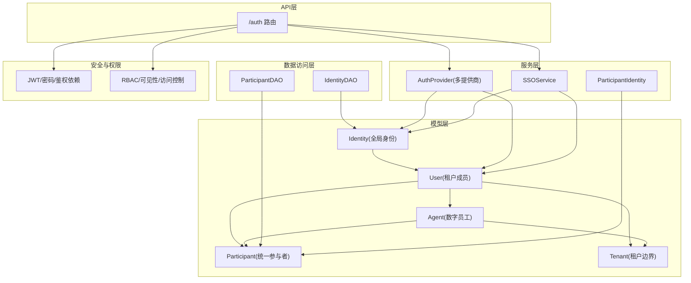
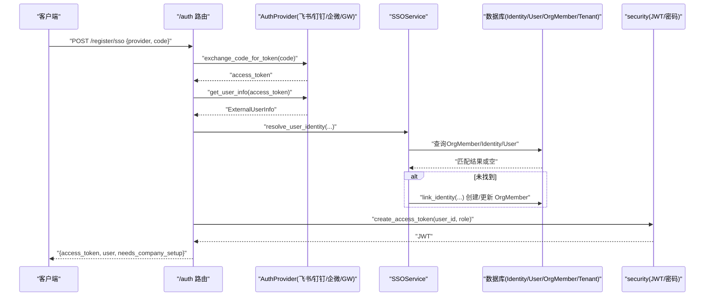
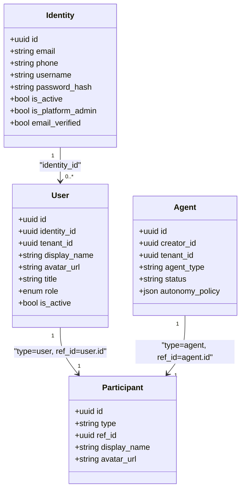
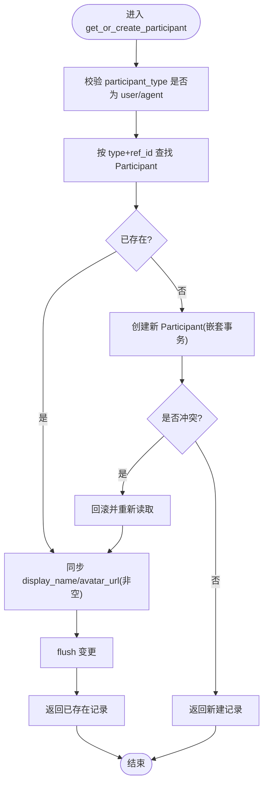
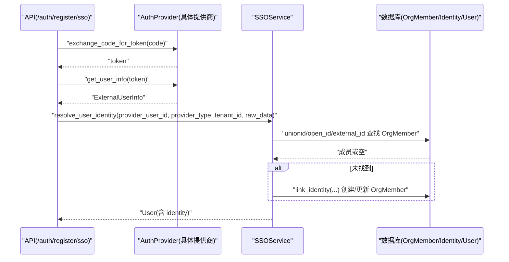
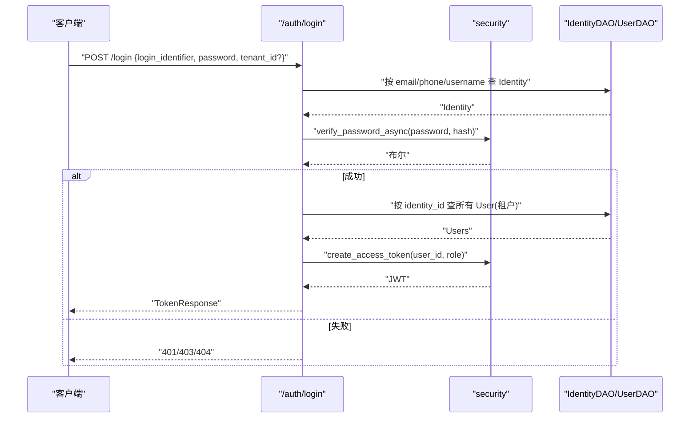
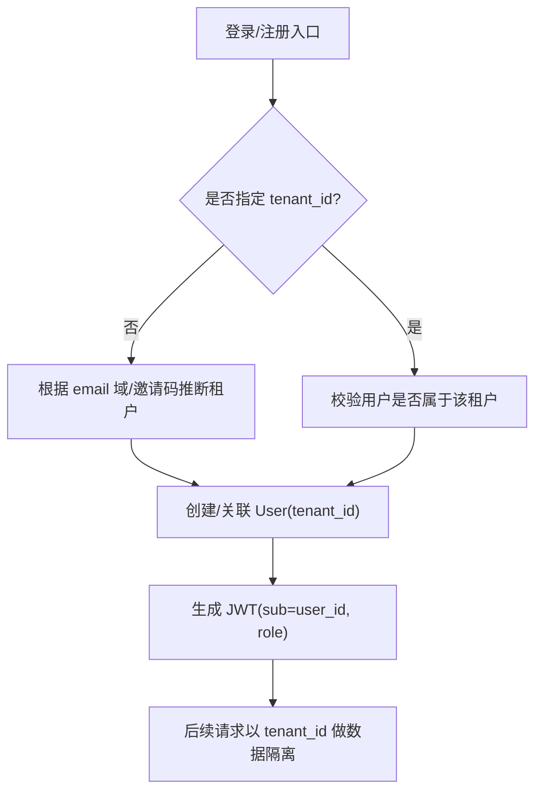
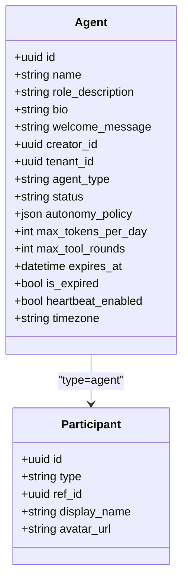
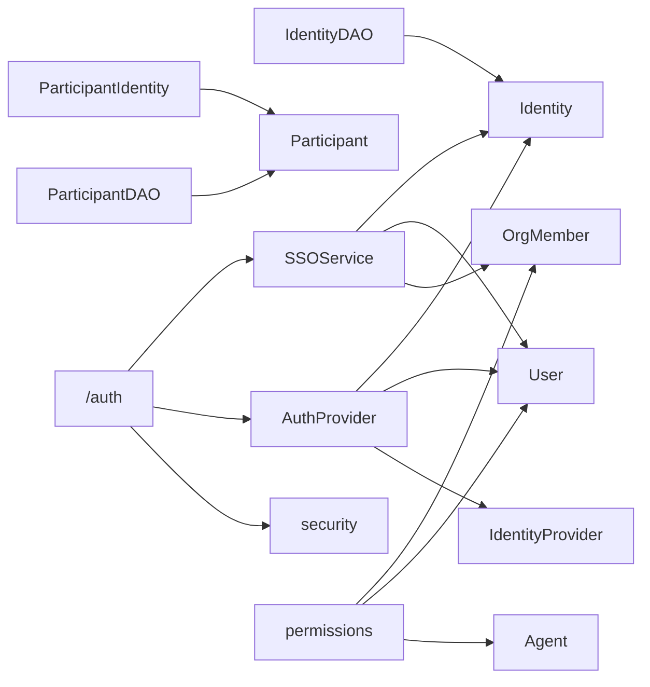

# 持久化身份系统

<cite>
**本文引用的文件**   
- [backend/app/models/identity.py](file://backend/app/models/identity.py)
- [backend/app/models/user.py](file://backend/app/models/user.py)
- [backend/app/models/participant.py](file://backend/app/models/participant.py)
- [backend/app/models/agent.py](file://backend/app/models/agent.py)
- [backend/app/models/tenant.py](file://backend/app/models/tenant.py)
- [backend/app/dao/identity_dao.py](file://backend/app/dao/identity_dao.py)
- [backend/app/dao/participant_dao.py](file://backend/app/dao/participant_dao.py)
- [backend/app/services/auth_provider.py](file://backend/app/services/auth_provider.py)
- [backend/app/services/sso_service.py](file://backend/app/services/sso_service.py)
- [backend/app/services/participant_identity.py](file://backend/app/services/participant_identity.py)
- [backend/app/core/security.py](file://backend/app/core/security.py)
- [backend/app/api/auth.py](file://backend/app/api/auth.py)
- [backend/app/core/permissions.py](file://backend/app/core/permissions.py)
</cite>

## 目录
1. [引言](#引言)
2. [项目结构](#项目结构)
3. [核心组件](#核心组件)
4. [架构总览](#架构总览)
5. [详细组件分析](#详细组件分析)
6. [依赖关系分析](#依赖关系分析)
7. [性能考量](#性能考量)
8. [故障排查指南](#故障排查指南)
9. [结论](#结论)
10. [附录](#附录)

## 引言
本文件系统化阐述 Clawith 的“持久化身份系统”，围绕以下目标展开：
- 每个 Agent 拥有独立身份的设计理念，包括身份标识、记忆存储与行为模式。
- 用户身份与 Agent 身份的映射关系，以及跨渠道（飞书、钉钉、企业微信、Google Workspace、Microsoft Teams、Web）的身份一致性保证。
- 参与者身份解析机制，如何在不同渠道识别和关联同一用户。
- 身份认证与授权的具体实现示例，包括 JWT 令牌管理与多租户身份隔离。
- 身份数据的隐私保护与安全管理措施。

## 项目结构
后端采用分层设计：模型层（models）、数据访问层（dao）、服务层（services）、API 路由（api）、安全与权限（core）。身份相关的关键模块分布如下：
- 模型层：Identity、User、Participant、Agent、Tenant
- DAO 层：IdentityDAO、ParticipantDAO
- 服务层：AuthProvider（OAuth/SSO）、SSOService、ParticipantIdentity
- API 层：/auth 路由（注册、登录、SSO、切换租户等）
- 安全与权限：JWT、密码哈希、角色校验、RBAC

**图表来源** 
- [backend/app/models/user.py:16-119](file://backend/app/models/user.py#L16-L119)
- [backend/app/models/identity.py:26-67](file://backend/app/models/identity.py#L26-L67)
- [backend/app/models/participant.py:13-32](file://backend/app/models/participant.py#L13-L32)
- [backend/app/models/agent.py:19-160](file://backend/app/models/agent.py#L19-L160)
- [backend/app/models/tenant.py:13-73](file://backend/app/models/tenant.py#L13-L73)
- [backend/app/dao/identity_dao.py:11-83](file://backend/app/dao/identity_dao.py#L11-L83)
- [backend/app/dao/participant_dao.py:7-33](file://backend/app/dao/participant_dao.py#L7-L33)
- [backend/app/services/auth_provider.py:44-165](file://backend/app/services/auth_provider.py#L44-L165)
- [backend/app/services/sso_service.py:22-226](file://backend/app/services/sso_service.py#L22-L226)
- [backend/app/services/participant_identity.py:47-103](file://backend/app/services/participant_identity.py#L47-L103)
- [backend/app/api/auth.py:140-302](file://backend/app/api/auth.py#L140-L302)
- [backend/app/core/security.py:128-173](file://backend/app/core/security.py#L128-L173)
- [backend/app/core/permissions.py:44-93](file://backend/app/core/permissions.py#L44-L93)

**章节来源**
- [backend/app/models/user.py:16-119](file://backend/app/models/user.py#L16-L119)
- [backend/app/models/identity.py:26-67](file://backend/app/models/identity.py#L26-L67)
- [backend/app/models/participant.py:13-32](file://backend/app/models/participant.py#L13-L32)
- [backend/app/models/agent.py:19-160](file://backend/app/models/agent.py#L19-L160)
- [backend/app/models/tenant.py:13-73](file://backend/app/models/tenant.py#L13-L73)
- [backend/app/dao/identity_dao.py:11-83](file://backend/app/dao/identity_dao.py#L11-L83)
- [backend/app/dao/participant_dao.py:7-33](file://backend/app/dao/participant_dao.py#L7-L33)
- [backend/app/services/auth_provider.py:44-165](file://backend/app/services/auth_provider.py#L44-L165)
- [backend/app/services/sso_service.py:22-226](file://backend/app/services/sso_service.py#L22-L226)
- [backend/app/services/participant_identity.py:47-103](file://backend/app/services/participant_identity.py#L47-L103)
- [backend/app/api/auth.py:140-302](file://backend/app/api/auth.py#L140-L302)
- [backend/app/core/security.py:128-173](file://backend/app/core/security.py#L128-L173)
- [backend/app/core/permissions.py:44-93](file://backend/app/core/permissions.py#L44-L93)

## 核心组件
- Identity（全局身份）：跨租户唯一，承载邮箱、手机号、用户名、密码哈希、平台管理员标记、邮箱验证状态等。
- User（租户成员）：绑定到具体租户，包含显示名、头像、角色、配额等；通过 identity_id 关联 Identity。
- Participant（统一参与者）：抽象“人”与“Agent”为同等参与者，用于会话、消息、协作等场景。
- Agent（数字员工）：独立的业务实体，具备运行态、权限策略、资源配额、模板、心跳等属性；同样可拥有 Participant 身份。
- Tenant（租户）：多租户隔离边界，决定 IM 提供商、默认配额、时区、SSO 配置等。

关键关系：
- Identity ↔ User（一对多）
- User → Participant（type=user, ref_id=user.id）
- Agent → Participant（type=agent, ref_id=agent.id）
- User/Agent → Tenant（租户上下文）

**章节来源**
- [backend/app/models/user.py:16-119](file://backend/app/models/user.py#L16-L119)
- [backend/app/models/participant.py:13-32](file://backend/app/models/participant.py#L13-L32)
- [backend/app/models/agent.py:19-160](file://backend/app/models/agent.py#L19-L160)
- [backend/app/models/tenant.py:13-73](file://backend/app/models/tenant.py#L13-L73)

## 架构总览
身份系统由“外部身份提供商 + SSO 服务 + 内部用户/身份模型 + 参与者抽象 + 认证授权”构成。

**图表来源** 
- [backend/app/api/auth.py:256-302](file://backend/app/api/auth.py#L256-L302)
- [backend/app/services/auth_provider.py:98-165](file://backend/app/services/auth_provider.py#L98-L165)
- [backend/app/services/sso_service.py:183-226](file://backend/app/services/sso_service.py#L183-L226)
- [backend/app/core/security.py:128-139](file://backend/app/core/security.py#L128-L139)

## 详细组件分析

### 身份模型与映射（Identity/User/Participant）
- Identity：全局唯一登录标识（email/phone/username），支持密码与平台管理员标记。
- User：租户内成员，role 决定权限层级（member/agent_admin/org_admin/platform_admin）。
- Participant：统一参与者，type 区分 user/agent，ref_id 指向对应主键。

**图表来源** 
- [backend/app/models/user.py:16-119](file://backend/app/models/user.py#L16-L119)
- [backend/app/models/participant.py:13-32](file://backend/app/models/participant.py#L13-L32)
- [backend/app/models/agent.py:19-160](file://backend/app/models/agent.py#L19-L160)

**章节来源**
- [backend/app/models/user.py:16-119](file://backend/app/models/user.py#L16-L119)
- [backend/app/models/participant.py:13-32](file://backend/app/models/participant.py#L13-L32)
- [backend/app/models/agent.py:19-160](file://backend/app/models/agent.py#L19-L160)

### 参与者身份解析（跨渠道一致性与去重）
- get_or_create_participant：在并发下使用 savepoint 确保幂等创建，避免重复行。
- 同步非空字段：display_name/avatar_url 增量更新，不覆盖已有值。
- 提供 user/agent 便捷方法，简化调用方逻辑。

**图表来源** 
- [backend/app/services/participant_identity.py:47-103](file://backend/app/services/participant_identity.py#L47-L103)

**章节来源**
- [backend/app/services/participant_identity.py:47-103](file://backend/app/services/participant_identity.py#L47-L103)

### 多提供商 OAuth/SSO 与用户匹配
- BaseAuthProvider：定义授权 URL、换令牌、获取用户信息、find_or_create_user 流程。
- 各提供商实现：Feishu/DingTalk/WeCom/GoogleWorkspace/MicrosoftTeams/Google。
- SSOService：基于 OrgMember 的 unionid/open_id/external_id 链式查找，自动关联租户，被动填充资料。

**图表来源** 
- [backend/app/services/auth_provider.py:98-165](file://backend/app/services/auth_provider.py#L98-L165)
- [backend/app/services/sso_service.py:183-226](file://backend/app/services/sso_service.py#L183-L226)
- [backend/app/api/auth.py:256-302](file://backend/app/api/auth.py#L256-L302)

**章节来源**
- [backend/app/services/auth_provider.py:273-348](file://backend/app/services/auth_provider.py#L273-L348)
- [backend/app/services/auth_provider.py:350-433](file://backend/app/services/auth_provider.py#L350-L433)
- [backend/app/services/auth_provider.py:435-635](file://backend/app/services/auth_provider.py#L435-L635)
- [backend/app/services/auth_provider.py:637-756](file://backend/app/services/auth_provider.py#L637-L756)
- [backend/app/services/sso_service.py:28-84](file://backend/app/services/sso_service.py#L28-84)
- [backend/app/services/sso_service.py:85-141](file://backend/app/services/sso_service.py#L85-141)
- [backend/app/services/sso_service.py:142-182](file://backend/app/services/sso_service.py#L142-182)
- [backend/app/services/sso_service.py:328-445](file://backend/app/services/sso_service.py#L328-L445)

### 认证与授权（JWT 与 RBAC）
- JWT：create_access_token/decode_access_token，依赖 get_current_user/get_authenticated_user 注入当前用户。
- 密码：bcrypt 异步哈希与校验，避免阻塞事件循环。
- 角色与权限：require_role 检查角色；permissions 模块提供 Agent 可见性与访问控制（公司/私有/自定义）。

**图表来源** 
- [backend/app/api/auth.py:422-543](file://backend/app/api/auth.py#L422-L543)
- [backend/app/core/security.py:128-173](file://backend/app/core/security.py#L128-L173)
- [backend/app/dao/identity_dao.py:17-46](file://backend/app/dao/identity_dao.py#L17-L46)

**章节来源**
- [backend/app/core/security.py:128-173](file://backend/app/core/security.py#L128-L173)
- [backend/app/core/permissions.py:44-93](file://backend/app/core/permissions.py#L44-L93)
- [backend/app/core/permissions.py:95-130](file://backend/app/core/permissions.py#L95-L130)
- [backend/app/core/permissions.py:213-251](file://backend/app/core/permissions.py#L213-L251)
- [backend/app/core/permissions.py:481-519](file://backend/app/core/permissions.py#L481-L519)

### 多租户身份隔离
- Tenant：隔离边界，包含 IM 提供商、默认配额、时区、SSO 域名等。
- User/Agent 均携带 tenant_id，权限判断强制同租户。
- 登录/注册流程根据 email 域或邀请码自动归属租户，支持多租户选择与切换。

**图表来源** 
- [backend/app/models/tenant.py:13-73](file://backend/app/models/tenant.py#L13-L73)
- [backend/app/api/auth.py:422-543](file://backend/app/api/auth.py#L422-L543)
- [backend/app/services/sso_service.py:142-182](file://backend/app/services/sso_service.py#L142-182)

**章节来源**
- [backend/app/models/tenant.py:13-73](file://backend/app/models/tenant.py#L13-L73)
- [backend/app/api/auth.py:748-793](file://backend/app/api/auth.py#L748-L793)
- [backend/app/services/sso_service.py:142-182](file://backend/app/services/sso_service.py#L142-182)

### Agent 独立身份与行为模式
- 独立标识：Agent.id 作为唯一标识，同时拥有 Participant(type=agent, ref_id=agent.id)。
- 行为模式：autonomy_policy 控制工具调用级别（L1/L2/L3），限制读写、发送消息、修改灵魂、访问业务系统等。
- 生命周期：status、expires_at、is_expired、last_active_at、heartbeat_* 等字段支撑运行态与心跳。
- 访问控制：company/private/custom 三种模式，结合 AgentPermission 进行细粒度授权。

**图表来源** 
- [backend/app/models/agent.py:19-160](file://backend/app/models/agent.py#L19-L160)
- [backend/app/models/participant.py:13-32](file://backend/app/models/participant.py#L13-L32)

**章节来源**
- [backend/app/models/agent.py:19-160](file://backend/app/models/agent.py#L19-L160)
- [backend/app/core/permissions.py:44-93](file://backend/app/core/permissions.py#L44-L93)

## 依赖关系分析
- 模型依赖：Identity→User→Participant；Agent→Participant；User/Agent→Tenant。
- DAO 依赖：IdentityDAO→Identity；ParticipantDAO→Participant。
- 服务依赖：AuthProvider→IdentityProvider/User/Identity；SSOService→OrgMember/Identity/User；ParticipantIdentity→Participant。
- API 依赖：/auth→security、DAO、SSO、AuthProvider。
- 权限依赖：permissions→Agent/User/OrgMember。

**图表来源** 
- [backend/app/dao/identity_dao.py:11-83](file://backend/app/dao/identity_dao.py#L11-L83)
- [backend/app/dao/participant_dao.py:7-33](file://backend/app/dao/participant_dao.py#L7-L33)
- [backend/app/services/auth_provider.py:44-165](file://backend/app/services/auth_provider.py#L44-L165)
- [backend/app/services/sso_service.py:22-226](file://backend/app/services/sso_service.py#L22-L226)
- [backend/app/services/participant_identity.py:47-103](file://backend/app/services/participant_identity.py#L47-L103)
- [backend/app/api/auth.py:140-302](file://backend/app/api/auth.py#L140-L302)
- [backend/app/core/permissions.py:44-93](file://backend/app/core/permissions.py#L44-L93)

**章节来源**
- [backend/app/dao/identity_dao.py:11-83](file://backend/app/dao/identity_dao.py#L11-L83)
- [backend/app/dao/participant_dao.py:7-33](file://backend/app/dao/participant_dao.py#L7-L33)
- [backend/app/services/auth_provider.py:44-165](file://backend/app/services/auth_provider.py#L44-L165)
- [backend/app/services/sso_service.py:22-226](file://backend/app/services/sso_service.py#L22-L226)
- [backend/app/services/participant_identity.py:47-103](file://backend/app/services/participant_identity.py#L47-L103)
- [backend/app/api/auth.py:140-302](file://backend/app/api/auth.py#L140-L302)
- [backend/app/core/permissions.py:44-93](file://backend/app/core/permissions.py#L44-L93)

## 性能考量
- bcrypt 操作通过线程池异步执行，避免阻塞事件循环。
- 参与者创建使用嵌套事务（savepoint）降低并发冲突成本。
- 查询使用 selectinload 预加载必要关系，减少 N+1 问题。
- 登录/注册流程将 CPU 密集型任务（哈希）移出事务，缩短锁持有时间。

[本节为通用指导，无需引用具体文件]

## 故障排查指南
- 登录失败：检查 Identity 是否存在、密码是否正确、邮箱是否已验证、账户是否激活。
- SSO 登录失败：确认提供商配置（client_id/secret、scope、IP 白名单）、回调地址、state 校验。
- 租户切换失败：校验用户是否属于目标租户、租户是否启用、SSO 域名映射是否正确。
- 参与者重复：检查并发写入路径，确认 get_or_create_participant 的 savepoint 逻辑生效。
- 权限不足：确认 access_mode、AgentPermission、用户角色与租户一致性。

**章节来源**
- [backend/app/api/auth.py:422-543](file://backend/app/api/auth.py#L422-L543)
- [backend/app/services/auth_provider.py:273-348](file://backend/app/services/auth_provider.py#L273-L348)
- [backend/app/services/sso_service.py:514-563](file://backend/app/services/sso_service.py#L514-L563)
- [backend/app/services/participant_identity.py:47-103](file://backend/app/services/participant_identity.py#L47-L103)
- [backend/app/core/permissions.py:481-519](file://backend/app/core/permissions.py#L481-L519)

## 结论
本身份系统以“全局 Identity + 租户 User + 统一 Participant + 多提供商 SSO + JWT/RBAC”为核心，实现了：
- 每个 Agent 拥有独立身份与行为策略，参与会话与协作。
- 跨渠道身份一致性通过 unionid/open_id/external_id 链式匹配与被动资料填充保障。
- 多租户隔离贯穿用户、Agent、权限与数据访问。
- 认证与授权通过 JWT 与 RBAC 组合实现，兼顾灵活与安全。
- 隐私与安全通过密码哈希、AES 加密工具、最小权限原则与审计日志（trace_id）等措施强化。

[本节为总结，无需引用具体文件]

## 附录
- 常用接口参考：/auth/register/init、/auth/register/sso、/auth/login、/auth/me、/auth/switch-tenant。
- 关键常量：DEFAULT_CONTEXT_WINDOW_SIZE、ROLE_HIERARCHY、AuthProviderType。
- 扩展点：新增提供商需实现 BaseAuthProvider 的三个抽象方法，并在注册中心登记。

[本节为补充说明，无需引用具体文件]