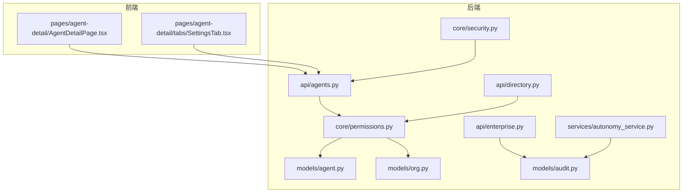
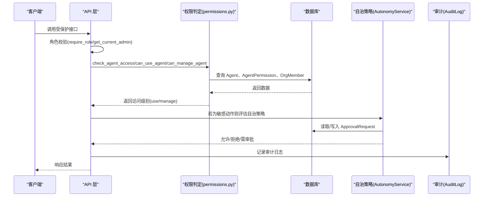
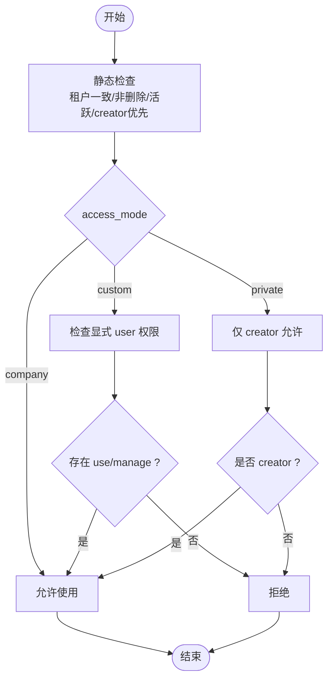
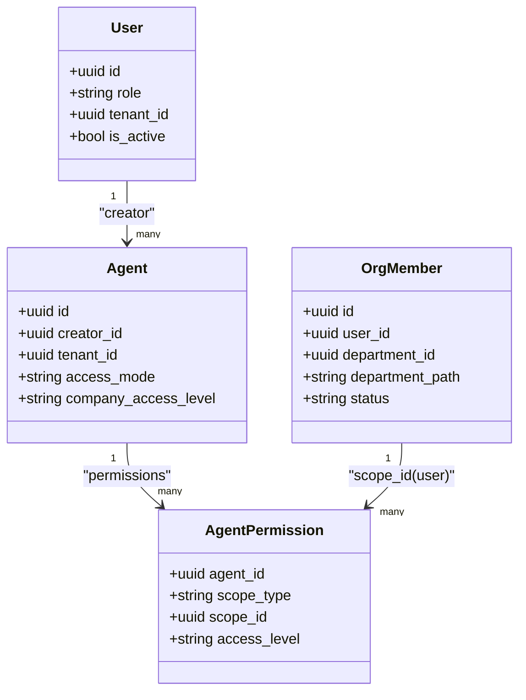
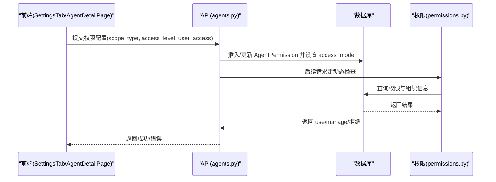
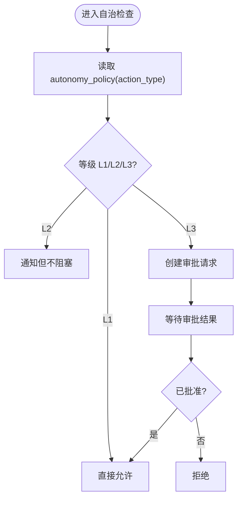
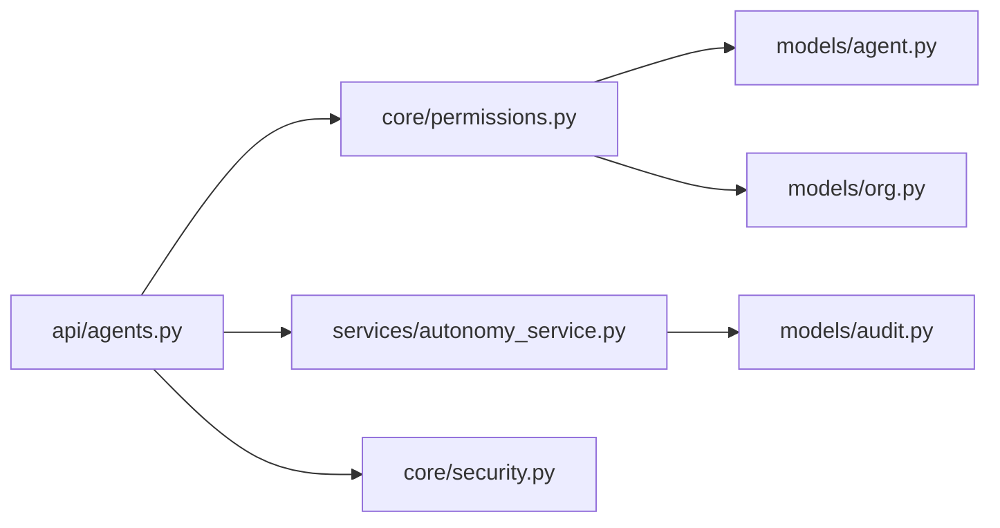

# 权限模型

<cite>
**本文引用的文件**   
- [permissions.py](file://backend/app/core/permissions.py)
- [agent.py](file://backend/app/models/agent.py)
- [org.py](file://backend/app/models/org.py)
- [audit.py](file://backend/app/models/audit.py)
- [security.py](file://backend/app/core/security.py)
- [agents.py](file://backend/app/api/agents.py)
- [directory.py](file://backend/app/api/directory.py)
- [enterprise.py](file://backend/app/api/enterprise.py)
- [autonomy_service.py](file://backend/app/services/autonomy_service.py)
- [052_add_agent_access_policy.py](file://backend/alembic/versions/052_add_agent_access_policy.py)
- [AgentDetailPage.tsx](file://frontend/src/pages/agent-detail/AgentDetailPage.tsx)
- [SettingsTab.tsx](file://frontend/src/pages/agent-detail/tabs/SettingsTab.tsx)
</cite>

## 目录
1. [引言](#引言)
2. [项目结构](#项目结构)
3. [核心组件](#核心组件)
4. [架构总览](#架构总览)
5. [详细组件分析](#详细组件分析)
6. [依赖关系分析](#依赖关系分析)
7. [性能考量](#性能考量)
8. [故障排查指南](#故障排查指南)
9. [结论](#结论)
10. [附录](#附录)

## 引言
本文件系统性阐述 Clawith 中的 RBAC（基于角色的访问控制）与 Agent 访问模式，覆盖公司级、部门级和用户级的权限层次结构；详解 Agent 的三种访问模式（company、private、custom）的特点与使用场景；说明权限继承与覆盖机制、细粒度资源访问控制实现；提供权限配置示例（角色定义、权限分配、动态权限检查）；并给出权限审计与日志记录机制及监控建议。

## 项目结构
Clawith 的权限相关代码主要分布在后端 core、models、api、services 以及前端页面中：
- 核心权限判定逻辑集中在 core/permissions.py
- 数据模型在 models/agent.py、models/org.py、models/audit.py
- API 层在 api/agents.py、api/directory.py、api/enterprise.py
- 自治策略与审批在服务 autonomy_service.py
- 迁移脚本 052_add_agent_access_policy.py 定义了 access_mode 与 company_access_level 字段
- 前端在 agent-detail 页面展示与编辑权限设置

图表来源
- [permissions.py:1-120](file://backend/app/core/permissions.py#L1-L120)
- [agent.py:115-179](file://backend/app/models/agent.py#L115-L179)
- [org.py:13-98](file://backend/app/models/org.py#L13-L98)
- [audit.py:13-44](file://backend/app/models/audit.py#L13-L44)
- [autonomy_service.py:25-162](file://backend/app/services/autonomy_service.py#L25-L162)
- [agents.py:762-815](file://backend/app/api/agents.py#L762-L815)
- [directory.py:37-74](file://backend/app/api/directory.py#L37-L74)
- [enterprise.py:668-691](file://backend/app/api/enterprise.py#L668-L691)
- [security.py:199-226](file://backend/app/core/security.py#L199-L226)
- [AgentDetailPage.tsx:599-633](file://frontend/src/pages/agent-detail/AgentDetailPage.tsx#L599-L633)
- [SettingsTab.tsx:276-290](file://frontend/src/pages/agent-detail/tabs/SettingsTab.tsx#L276-L290)

章节来源
- [permissions.py:1-120](file://backend/app/core/permissions.py#L1-L120)
- [agent.py:115-179](file://backend/app/models/agent.py#L115-L179)
- [org.py:13-98](file://backend/app/models/org.py#L13-L98)
- [audit.py:13-44](file://backend/app/models/audit.py#L13-L44)
- [autonomy_service.py:25-162](file://backend/app/services/autonomy_service.py#L25-L162)
- [agents.py:762-815](file://backend/app/api/agents.py#L762-L815)
- [directory.py:37-74](file://backend/app/api/directory.py#L37-L74)
- [enterprise.py:668-691](file://backend/app/api/enterprise.py#L668-L691)
- [security.py:199-226](file://backend/app/core/security.py#L199-L226)
- [AgentDetailPage.tsx:599-633](file://frontend/src/pages/agent-detail/AgentDetailPage.tsx#L599-L633)
- [SettingsTab.tsx:276-290](file://frontend/src/pages/agent-detail/tabs/SettingsTab.tsx#L276-L290)

## 核心组件
- 用户与角色
  - User.role 支持 platform_admin、org_admin、agent_admin、member，用于全局与租户内角色控制
  - security.py 提供 require_role 与 get_current_admin 等依赖，统一角色校验
- Agent 与权限模型
  - Agent.access_mode 决定访问范围：company、private、custom
  - Agent.company_access_level 为 UI 默认级别（use/manage），实际运行时由 access_mode 与显式权限决定
  - AgentPermission(scope_type, scope_id, access_level) 提供细粒度授权：company、department、user
- 组织与成员
  - OrgDepartment.path 支持部门层级查询；OrgMember.department_path 便于按部门过滤
- 审计与审批
  - AuditLog 记录操作轨迹；ApprovalRequest 管理 L3 自治操作的审批流

章节来源
- [user.py:52-119](file://backend/app/models/user.py#L52-L119)
- [security.py:199-226](file://backend/app/core/security.py#L199-L226)
- [agent.py:115-179](file://backend/app/models/agent.py#L115-L179)
- [org.py:13-98](file://backend/app/models/org.py#L13-L98)
- [audit.py:13-44](file://backend/app/models/audit.py#L13-L44)

## 架构总览
RBAC 与 Agent 访问模式的整体流程如下：
- 请求进入 API 层，先进行身份认证与角色校验（security.py）
- 根据 Agent 的 access_mode 与 AgentPermission 判定用户是否可“使用”或“管理”
- 对敏感操作通过 AutonomyService 执行 L1/L2/L3 自治策略，必要时生成 ApprovalRequest
- 所有关键操作写入 AuditLog，供企业后台审计

图表来源
- [security.py:199-226](file://backend/app/core/security.py#L199-L226)
- [permissions.py:481-518](file://backend/app/core/permissions.py#L481-L518)
- [autonomy_service.py:50-162](file://backend/app/services/autonomy_service.py#L50-L162)
- [audit.py:13-25](file://backend/app/models/audit.py#L13-L25)

## 详细组件分析

### RBAC 与 Agent 访问模式
- 访问模式
  - company：公司可见，同租户活跃用户均可使用；Plaza 启用
  - private：仅创建者可管理/使用；隐藏于 Plaza
  - custom：像 company 一样可用，但通过显式 user 行授予管理权限；Plaza 禁用
- 权限判定
  - can_use_agent_static：快速静态判断（租户一致、非删除、活跃、creator 优先、access_mode 为 company/private）
  - can_use_agent：当 access_mode=custom 时，需存在 scope_type=user 且 access_level 为 use/manage 的记录
  - can_manage_agent：creator 或 admin（非 private）或 custom 下拥有 manage 权限的用户
  - build_visible_agents_query：构建用户可见 Agent 列表的条件（creator、company、custom+管理员或显式授权）
- 目录可见性
  - evaluate_roster_agent_visibility/human_visibility：依据 source/target 的 access_mode 与状态计算可见性与可联系性

图表来源
- [permissions.py:44-93](file://backend/app/core/permissions.py#L44-L93)
- [permissions.py:95-130](file://backend/app/core/permissions.py#L95-L130)
- [permissions.py:213-251](file://backend/app/core/permissions.py#L213-L251)
- [permissions.py:149-211](file://backend/app/core/permissions.py#L149-L211)

章节来源
- [permissions.py:44-130](file://backend/app/core/permissions.py#L44-L130)
- [permissions.py:213-251](file://backend/app/core/permissions.py#L213-L251)
- [permissions.py:149-211](file://backend/app/core/permissions.py#L149-L211)

### 权限继承与覆盖机制
- 继承规则
  - 同租户继承：User.tenant_id 必须与 Agent.tenant_id 一致
  - Creator 继承：Agent.creator_id 对应用户天然拥有 manage 权限
  - Admin 继承：platform_admin/org_admin 在非 private 模式下拥有管理权
- 覆盖规则
  - custom 模式下，显式的 AgentPermission(user scope) 可覆盖默认行为，授予特定用户的 use/manage
  - private 模式覆盖 company 默认，仅 creator 有效
- 部门级影响
  - OrgMember.department_path 与 OrgDepartment.path 支持按部门范围筛选（如经验库 visibility_scope=department）

图表来源
- [agent.py:115-179](file://backend/app/models/agent.py#L115-L179)
- [org.py:34-62](file://backend/app/models/org.py#L34-L62)
- [permissions.py:213-251](file://backend/app/core/permissions.py#L213-L251)

章节来源
- [agent.py:115-179](file://backend/app/models/agent.py#L115-L179)
- [org.py:34-62](file://backend/app/models/org.py#L34-L62)
- [permissions.py:213-251](file://backend/app/core/permissions.py#L213-L251)

### Agent 访问模式的三种类型与使用场景
- company
  - 特点：公司可见，同租户活跃用户可使用；Plaza 启用
  - 场景：通用工具型 Agent，面向全公司开放
- private
  - 特点：仅创建者可见/可用；隐藏于公共广场
  - 场景：个人专属助手或敏感业务 Agent
- custom
  - 特点：像 company 一样可用，但通过显式 user 权限授予管理；Plaza 禁用
  - 场景：需要精确控制管理者的协作型 Agent

章节来源
- [agent.py:115-123](file://backend/app/models/agent.py#L115-L123)
- [permissions.py:44-93](file://backend/app/core/permissions.py#L44-L93)

### 细粒度资源访问控制
- 目录与联系人
  - directory.py 限制仅 custom 模式可维护手动目录；check_agent_access 确保访问级别
  - _custom_human_authorized_condition/_custom_agent_authorized_condition 结合 OrgMember 与 AgentPermission 实现细粒度可见性
- 会话与消息
  - chat_sessions 与 files API 通过 check_agent_access 与 access_level 控制读写与删除

章节来源
- [directory.py:37-74](file://backend/app/api/directory.py#L37-L74)
- [directory.py:158-178](file://backend/app/api/directory.py#L158-L178)
- [test_files_api.py:47-85](file://backend/tests/test_files_api.py#L47-L85)

### 权限配置示例（角色定义、权限分配、动态检查）
- 角色定义
  - User.role：platform_admin、org_admin、agent_admin、member
  - security.py 的 require_role 与 get_current_admin 用于端点级角色校验
- 权限分配
  - agents.py 中根据 scope_type(company/private/custom) 写入 AgentPermission 并更新 Agent.access_mode/company_access_level
  - 前端 SettingsTab 与 AgentDetailPage 提供可视化配置界面
- 动态检查
  - permissions.py 的 can_use_agent/can_manage_agent/check_agent_access 在运行时动态判定

图表来源
- [agents.py:762-815](file://backend/app/api/agents.py#L762-L815)
- [settings_tab.tsx:276-290](file://frontend/src/pages/agent-detail/tabs/SettingsTab.tsx#L276-L290)
- [agent_detail_page.tsx:599-633](file://frontend/src/pages/agent-detail/AgentDetailPage.tsx#L599-L633)
- [permissions.py:481-518](file://backend/app/core/permissions.py#L481-L518)

章节来源
- [agents.py:762-815](file://backend/app/api/agents.py#L762-L815)
- [permissions.py:481-518](file://backend/app/core/permissions.py#L481-L518)
- [security.py:199-226](file://backend/app/core/security.py#L199-L226)

### 自治策略与审批（L1/L2/L3）
- AutonomyService.check_and_enforce 根据 agent.autonomy_policy 决定动作等级
  - L1：自动允许
  - L2：通知（不阻塞）
  - L3：需审批（创建 ApprovalRequest 并阻塞直到批准/拒绝）
- 运行时身份关联 run_id 与 tool_call_id，保证审批与具体调用上下文绑定

图表来源
- [autonomy_service.py:50-162](file://backend/app/services/autonomy_service.py#L50-L162)
- [audit.py:27-44](file://backend/app/models/audit.py#L27-L44)

章节来源
- [autonomy_service.py:50-162](file://backend/app/services/autonomy_service.py#L50-L162)
- [audit.py:27-44](file://backend/app/models/audit.py#L27-L44)

### 权限审计与日志记录
- AuditLog：记录用户、Agent、动作、详情、IP 与时间戳
- enterprise.py 提供 /enterprise/audit-logs 接口，支持按租户与 Agent 过滤
- 前端 EnterpriseSettings 页面展示审计日志并按背景任务/动作分类

章节来源
- [audit.py:13-25](file://backend/app/models/audit.py#L13-L25)
- [enterprise.py:668-691](file://backend/app/api/enterprise.py#L668-L691)
- [EnterpriseSettings.tsx:427-454](file://frontend/src/pages/EnterpriseSettings.tsx#L427-L454)

## 依赖关系分析
- 模块耦合
  - API 层依赖 core/permissions 进行访问控制，依赖 services/autonomy_service 处理自治策略
  - models/agent.py、models/org.py、models/audit.py 被权限与服务层广泛引用
  - 前端通过 API 暴露的配置接口完成权限设置与查看
- 外部依赖
  - SQLAlchemy 异步会话用于权限查询与写入
  - FastAPI 依赖注入用于角色校验

图表来源
- [agents.py:762-815](file://backend/app/api/agents.py#L762-L815)
- [permissions.py:1-120](file://backend/app/core/permissions.py#L1-L120)
- [autonomy_service.py:25-162](file://backend/app/services/autonomy_service.py#L25-L162)
- [security.py:199-226](file://backend/app/core/security.py#L199-L226)

章节来源
- [agents.py:762-815](file://backend/app/api/agents.py#L762-L815)
- [permissions.py:1-120](file://backend/app/core/permissions.py#L1-L120)
- [autonomy_service.py:25-162](file://backend/app/services/autonomy_service.py#L25-L162)
- [security.py:199-226](file://backend/app/core/security.py#L199-L226)

## 性能考量
- 权限查询优化
  - 使用 exists() 子查询减少 JOIN 开销（如 build_visible_agents_query）
  - 利用索引（tenant_id、created_at、deleted_at）加速常见过滤
- 缓存与批量
  - 对频繁读的场景（如可见 Agent 列表）可在上层引入缓存
  - 批量写入权限时去重（seen_user_ids）避免重复记录
- 自治策略
  - L3 审批路径涉及额外 IO，应合理设置超时与重试

[本节为通用指导，无需源码引用]

## 故障排查指南
- 常见问题
  - 跨租户访问被拒：确认 User.tenant_id 与 Agent.tenant_id 一致
  - private Agent 不可见：仅 creator 可访问，检查 access_mode 与 creator_id
  - custom 模式无权限：检查是否存在 scope_type=user 且 access_level 为 use/manage 的记录
  - L3 审批未通过：查看 ApprovalRequest 状态与 correlation_id
- 定位步骤
  - 通过 /enterprise/audit-logs 查看最近操作与错误
  - 使用 check_agent_access 返回值（manage/use/拒绝）定位问题
  - 检查 OrgMember.status 与 Agent.status 是否为 active/running/idle

章节来源
- [enterprise.py:668-691](file://backend/app/api/enterprise.py#L668-L691)
- [permissions.py:481-518](file://backend/app/core/permissions.py#L481-L518)
- [audit.py:13-25](file://backend/app/models/audit.py#L13-L25)

## 结论
Clawith 的权限模型以 RBAC 为基础，结合 Agent 的访问模式（company/private/custom）与显式 AgentPermission，实现了从公司到部门再到用户的细粒度控制。AutonomyService 提供 L1/L2/L3 自治策略与审批机制，保障高风险操作安全可控。审计日志与前端展示形成闭环，便于监控与排障。建议在部署中合理配置角色与权限，并结合租户隔离与索引优化提升性能。

[本节为总结，无需源码引用]

## 附录
- 迁移与字段
  - 052_add_agent_access_policy.py 新增 access_mode 与 company_access_level，并对历史数据进行回填
- 前端交互
  - SettingsTab 与 AgentDetailPage 提供权限设置与展示，支持 scope_type 映射（private→user）

章节来源
- [052_add_agent_access_policy.py:19-54](file://backend/alembic/versions/052_add_agent_access_policy.py#L19-L54)
- [SettingsTab.tsx:276-290](file://frontend/src/pages/agent-detail/tabs/SettingsTab.tsx#L276-L290)
- [AgentDetailPage.tsx:599-633](file://frontend/src/pages/agent-detail/AgentDetailPage.tsx#L599-L633)