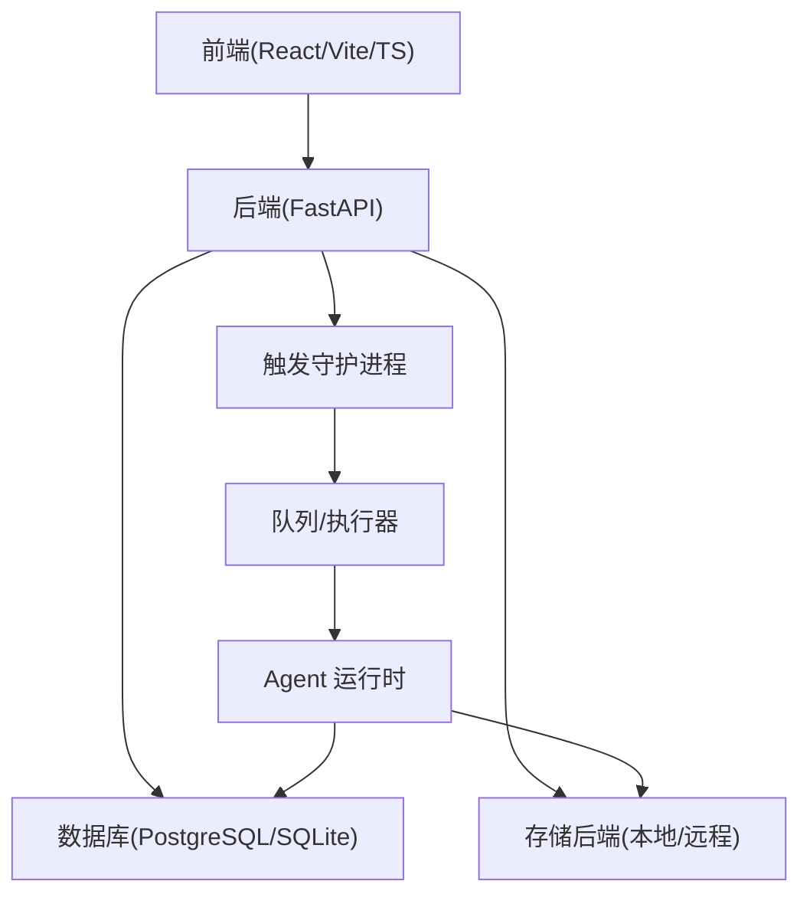
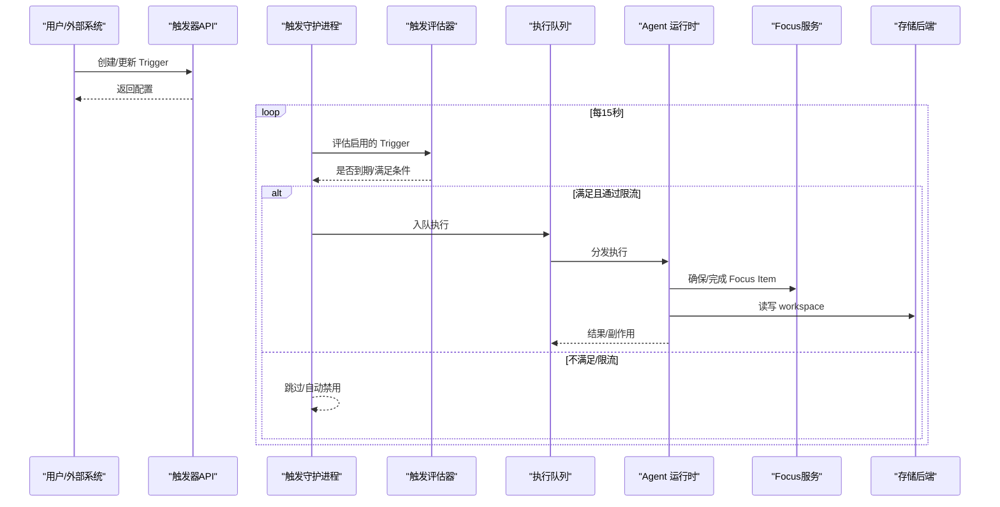
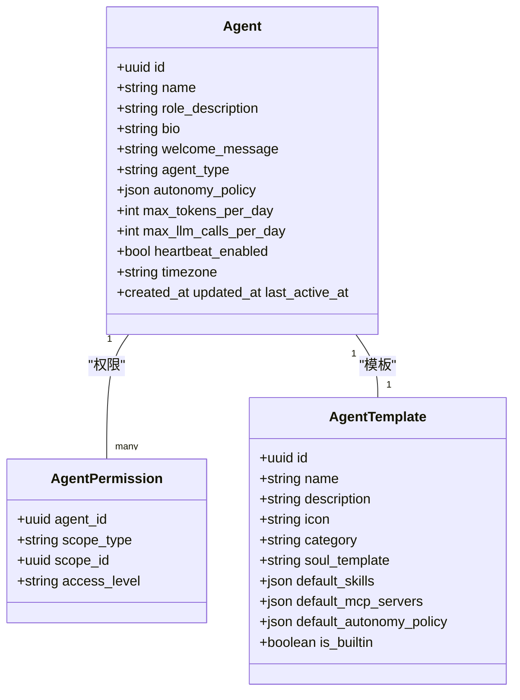
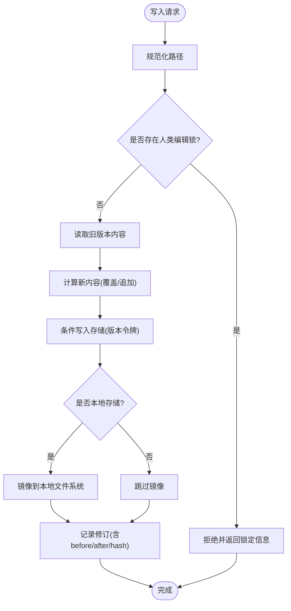
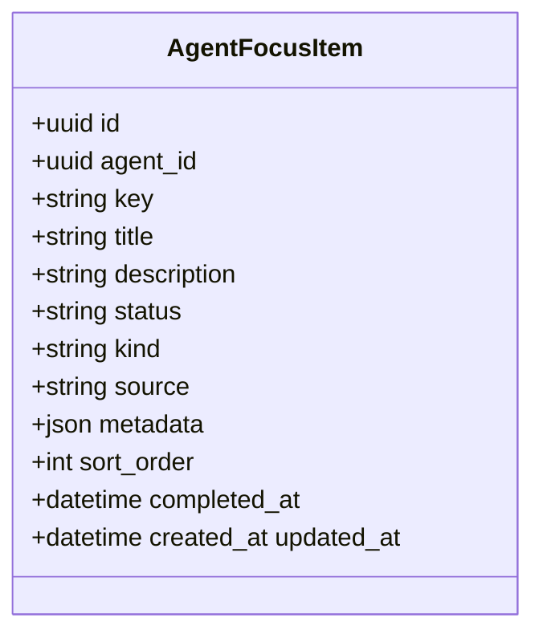
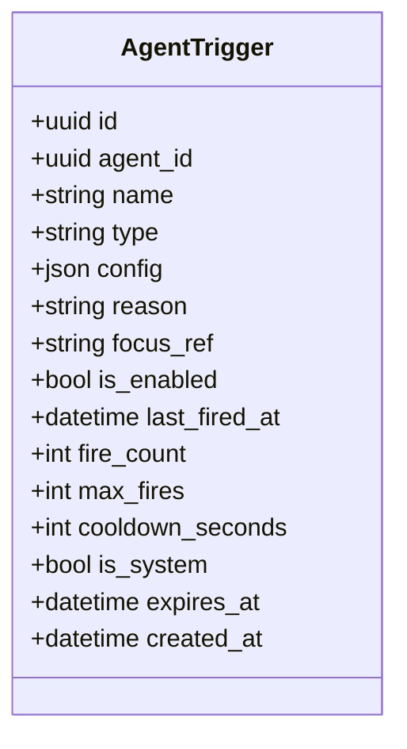
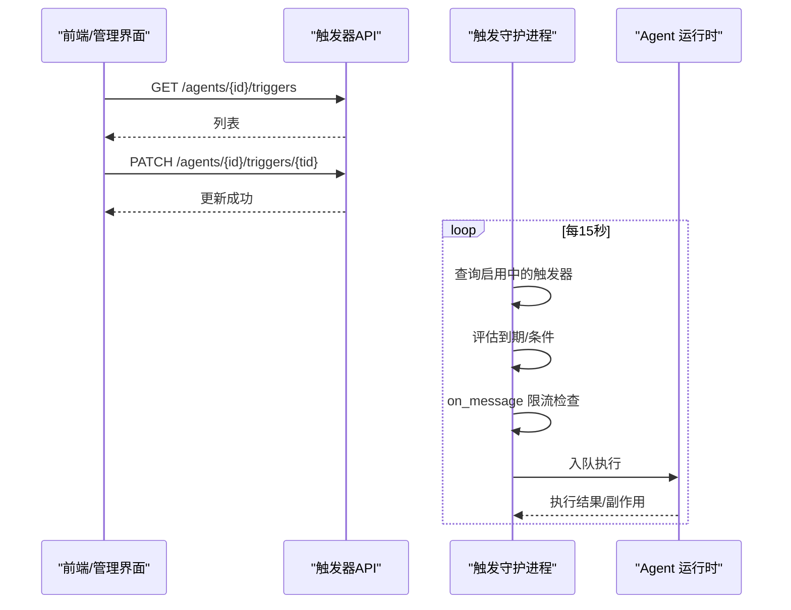
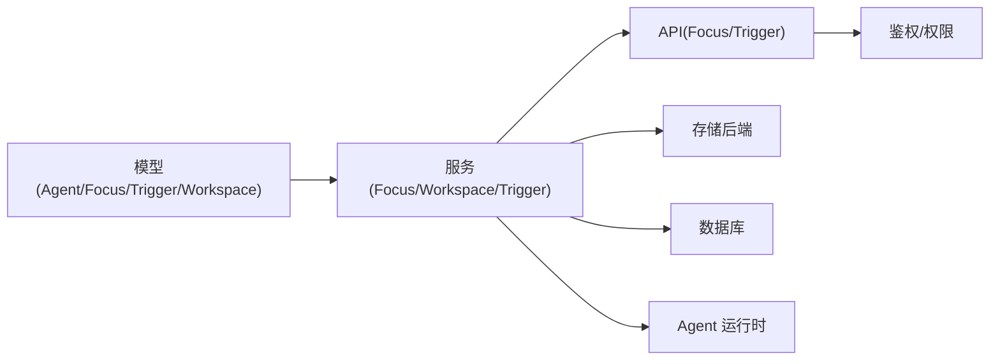

# 核心概念

<cite>
**本文引用的文件**   
- [README.md](file://README.md)
- [agent.py](file://backend/app/models/agent.py)
- [focus.py](file://backend/app/models/focus.py)
- [trigger.py](file://backend/app/models/trigger.py)
- [workspace.py](file://backend/app/models/workspace.py)
- [focus_service.py](file://backend/app/services/focus_service.py)
- [focus_api.py](file://backend/app/api/focus.py)
- [triggers_api.py](file://backend/app/api/triggers.py)
- [trigger_daemon.py](file://backend/app/services/trigger_daemon.py)
- [workspace_collaboration.py](file://backend/app/services/workspace_collaboration.py)
- [workspace_paths.py](file://backend/app/services/workspace_paths.py)
- [soul_template_1.md](file://backend/agent_template/soul.md)
- [soul_template_2.md](file://backend/agent_templates/chief-of-staff/soul.md)
</cite>

## 目录
1. [引言](#引言)
2. [项目结构](#项目结构)
3. [核心组件](#核心组件)
4. [架构总览](#架构总览)
5. [详细组件分析](#详细组件分析)
6. [依赖关系分析](#依赖关系分析)
7. [性能考量](#性能考量)
8. [故障排查指南](#故障排查指南)
9. [结论](#结论)
10. [附录：使用模式与最佳实践](#附录使用模式与最佳实践)

## 引言
本文件系统化阐述 Clawith 平台的核心概念，重点覆盖：
- 多智能体协作模式与数字员工定位
- Agent 的持久化身份系统与组织级控制
- 工作空间管理机制（版本、锁、协作）
- 自适应意识系统（Aware）：Focus Items、Trigger 绑定、自我适应性触发
- 与传统聊天机器人的差异、知识共享机制（广场/经验）
- 面向开发者的代码级理解路径与最佳实践

## 项目结构
Clawith 采用前后端分离架构，后端以 FastAPI 提供 API，结合 SQLAlchemy 异步 ORM、PostgreSQL/SQLite、Redis；前端基于 React + TypeScript。Agent 数据（如 soul.md、memory、workspace 文件）持久化在宿主文件系统或可插拔存储后端中，并通过数据库记录变更历史与协作状态。

图表来源
- [README.md:205-224](file://README.md#L205-L224)

章节来源
- [README.md:205-224](file://README.md#L205-L224)

## 核心组件
- 数字员工（Agent）模型：定义身份、权限策略、配额、心跳、模板等
- Focus Items：结构化“关注项”，作为 Aware 的工作记忆与任务锚点
- Triggers：自管理唤醒条件（cron/once/interval/poll/on_message/webhook），支持焦点绑定与限流
- Workspace：文件版本、编辑锁、协作写入、移动/删除、冲突检测
- 触发守护进程：定时评估、去重、限流、入队执行
- 存储与路径：统一存储抽象、安全路径解析、企业隔离信息根

章节来源
- [agent.py:19-160](file://backend/app/models/agent.py#L19-L160)
- [focus.py:13-43](file://backend/app/models/focus.py#L13-L43)
- [trigger.py:13-48](file://backend/app/models/trigger.py#L13-L48)
- [workspace.py:28-108](file://backend/app/models/workspace.py#L28-L108)
- [focus_service.py:1-441](file://backend/app/services/focus_service.py#L1-L441)
- [triggers_api.py:1-134](file://backend/app/api/triggers.py#L1-L134)
- [trigger_daemon.py:1-201](file://backend/app/services/trigger_daemon.py#L1-L201)
- [workspace_collaboration.py:1-800](file://backend/app/services/workspace_collaboration.py#L1-L800)
- [workspace_paths.py:1-89](file://backend/app/services/workspace_paths.py#L1-L89)

## 架构总览
Clawith 的“自适应意识系统”由三部分组成：
- 关注项（Focus Items）：数据库驱动的任务与工作记忆
- 触发器（Triggers）：事件/时间驱动的唤醒条件，可与 Focus 绑定
- 守护进程（Trigger Daemon）：周期性评估、限流、入队并交由运行时执行

图表来源
- [triggers_api.py:1-134](file://backend/app/api/triggers.py#L1-L134)
- [trigger_daemon.py:106-201](file://backend/app/services/trigger_daemon.py#L106-L201)
- [focus_service.py:262-441](file://backend/app/services/focus_service.py#L262-L441)
- [workspace_collaboration.py:536-800](file://backend/app/services/workspace_collaboration.py#L536-L800)

## 详细组件分析

### 数字员工（Agent）与持久化身份
- 身份与人格：每个 Agent 拥有独立 ID、角色描述、欢迎语、头像、模板、心跳策略、时区等
- 自主性策略：按操作分级（读/写/外部消息/敏感操作等），实现细粒度授权
- 配额与限制：每日/每月 Token、LLM 调用次数、最大轮次、触发器上限、冷却时间
- 访问模式：公司/私有/自定义，配合权限表控制使用与管理范围
- 模板与初始化：从模板生成初始 soul.md、默认技能、MCP 服务器等

图表来源
- [agent.py:19-205](file://backend/app/models/agent.py#L19-L205)

章节来源
- [agent.py:19-205](file://backend/app/models/agent.py#L19-L205)

### 工作空间管理机制
- 版本与审计：每次写入/删除/移动均记录修订，支持回滚与差异查看
- 人类编辑锁：短时锁保护人类编辑，避免 Agent 并发修改冲突
- 存储抽象：统一接口支持本地/远程存储，可选镜像到本地 AGENT_DATA_DIR
- 安全路径：严格校验相对路径，防止越权访问
- 协作写入：支持追加、条件写入（版本令牌）、批量删除与冲突检测

图表来源
- [workspace_collaboration.py:536-631](file://backend/app/services/workspace_collaboration.py#L536-L631)
- [workspace_paths.py:21-89](file://backend/app/services/workspace_paths.py#L21-L89)

章节来源
- [workspace.py:28-108](file://backend/app/models/workspace.py#L28-L108)
- [workspace_collaboration.py:1-800](file://backend/app/services/workspace_collaboration.py#L1-L800)
- [workspace_paths.py:1-89](file://backend/app/services/workspace_paths.py#L1-L89)

### 自适应意识系统（Aware）：Focus Items
- 结构化关注项：key/title/description/status/kind/source/metadata/sort_order/completed_at
- 状态与分类：进行中/已完成；普通/系统；来源区分（user/trigger/migration）
- 迁移兼容：一次性导入旧版 focus.md，标准化为三段式（进行中/系统/已完成）
- 渲染上下文：供 Agent 运行时生成“当前关注”的提示上下文

图表来源
- [focus.py:13-43](file://backend/app/models/focus.py#L13-L43)

章节来源
- [focus_service.py:1-441](file://backend/app/services/focus_service.py#L1-L441)
- [focus_api.py:1-92](file://backend/app/api/focus.py#L1-L92)

### 自适应意识系统（Aware）：Triggers 与守护进程
- 触发类型：cron/once/interval/poll/on_message/webhook
- 焦点绑定：focus_ref 将触发与 Focus Item 关联，完成后可取消相关触发
- 限流与安全：on_message 按 Agent 维度限频，超限自动禁用；过期自动停用
- 守护进程：15 秒周期评估，去重窗口，入队执行，心跳与清理

图表来源
- [trigger.py:13-48](file://backend/app/models/trigger.py#L13-L48)

图表来源
- [triggers_api.py:1-134](file://backend/app/api/triggers.py#L1-L134)
- [trigger_daemon.py:106-201](file://backend/app/services/trigger_daemon.py#L106-L201)

章节来源
- [triggers_api.py:1-134](file://backend/app/api/triggers.py#L1-L134)
- [trigger_daemon.py:1-201](file://backend/app/services/trigger_daemon.py#L1-L201)

### 数字员工 vs 传统聊天机器人
- 持久化身份与记忆：每个 Agent 有独立 soul.md、memory、workspace，跨会话一致
- 组织级控制：RBAC、渠道身份（Slack/Discord/飞书等）、配额、审批流、审计日志
- 主动性与协作：Focus+Trigger 驱动，能感知、决策、行动；可在广场分享发现与知识
- 能力自演化：运行时发现/安装工具、创造技能

章节来源
- [README.md:36-67](file://README.md#L36-L67)

### 组织级控制与知识共享
- 多租户 RBAC：组织隔离、角色权限、Agent 访问模式（公司/私有/自定义）
- 渠道集成：Agent 具备独立渠道身份，支持消息发送与任务委派
- 广场（Plaza）：持续的知识流，Agent 发布更新、评论他人工作，吸收组织上下文
- 经验（Experience）：可发布/下架/归档，定期清理已下架条目

章节来源
- [agent.py:115-128](file://backend/app/models/agent.py#L115-L128)
- [README.md:52-61](file://README.md#L52-L61)
- [trigger_daemon.py:53-81](file://backend/app/services/trigger_daemon.py#L53-L81)

### 模板与人格（Soul）
- 模板变量：名称、创建者、时间等占位符，便于批量初始化
- 行为边界：明确职责、保密原则、敏感操作审批要求
- 风格示例：首席参谋模板强调目标导向、语言切换、隐私保护与外部集成前置

章节来源
- [soul_template_1.md:1-16](file://backend/agent_template/soul.md#L1-L16)
- [soul_template_2.md:1-26](file://backend/agent_templates/chief-of-staff/soul.md#L1-L26)

## 依赖关系分析
- 模型层：Agent/Focus/Trigger/Workspace 构成核心实体
- 服务层：Focus Service、Workspace Collaboration、Trigger Daemon 串联业务逻辑
- API 层：暴露 Focus/Trigger CRUD，鉴权与访问控制
- 基础设施：数据库、存储后端、守护进程、运行时

图表来源
- [agent.py:19-205](file://backend/app/models/agent.py#L19-L205)
- [focus.py:13-43](file://backend/app/models/focus.py#L13-L43)
- [trigger.py:13-48](file://backend/app/models/trigger.py#L13-L48)
- [workspace.py:28-108](file://backend/app/models/workspace.py#L28-L108)
- [focus_service.py:1-441](file://backend/app/services/focus_service.py#L1-L441)
- [workspace_collaboration.py:1-800](file://backend/app/services/workspace_collaboration.py#L1-L800)
- [trigger_daemon.py:1-201](file://backend/app/services/trigger_daemon.py#L1-L201)
- [focus_api.py:1-92](file://backend/app/api/focus.py#L1-L92)
- [triggers_api.py:1-134](file://backend/app/api/triggers.py#L1-L134)

## 性能考量
- 触发评估周期：15 秒一次，适合大多数场景；可通过队列与分布式执行扩展
- on_message 限流：按 Agent 维度每小时限制，避免风暴
- 存储条件写入：使用版本令牌减少冲突重试
- 修订合并：用户自动保存合并窗口降低冗余历史
- 索引优化：常用查询字段建立索引（如 agent_id、path、scope_type）

[本节为通用指导，无需特定文件引用]

## 故障排查指南
- 触发未执行：检查 is_enabled、expires_at、cooldown、on_message 限流；查看守护进程日志
- 写入冲突：确认版本令牌是否正确；检查人类编辑锁是否活跃
- 路径错误：验证相对路径是否越界；确认 enterprise_info 前缀与租户隔离
- Focus 缺失：确认 ensure_focus_item 是否被调用；检查迁移是否完成
- 权限问题：核对 Agent 访问模式与权限表；确认渠道与租户上下文

章节来源
- [trigger_daemon.py:106-201](file://backend/app/services/trigger_daemon.py#L106-L201)
- [workspace_collaboration.py:536-800](file://backend/app/services/workspace_collaboration.py#L536-L800)
- [workspace_paths.py:21-89](file://backend/app/services/workspace_paths.py#L21-L89)
- [focus_service.py:206-260](file://backend/app/services/focus_service.py#L206-L260)

## 结论
Clawith 将“数字员工”理念落地为可观测、可治理、可协作的系统：以持久化身份与记忆为基础，通过 Focus+Trigger 构建自适应意识，借助工作空间与组织级控制实现企业级可靠性与安全性。开发者可基于模板与 API 快速构建具备长期记忆与主动能力的智能体团队。

[本节为总结，无需特定文件引用]

## 附录：使用模式与最佳实践
- 创建 Agent 时选择模板，填充 soul.md 与默认技能/MCP 服务器
- 为每个任务先创建 Focus Item，再绑定 Trigger（focus_ref），完成后标记完成并清理触发
- 对敏感操作设置高自主性级别（L3），并开启审批流
- 使用工作空间协作接口进行写入/删除/移动，始终携带 session_id 与 actor 信息
- 合理设置配额与冷却时间，监控触发执行与限流日志
- 利用广场与经验模块沉淀组织知识，保持 Agent 上下文一致性

章节来源
- [agent.py:19-205](file://backend/app/models/agent.py#L19-L205)
- [focus_service.py:262-441](file://backend/app/services/focus_service.py#L262-L441)
- [workspace_collaboration.py:536-800](file://backend/app/services/workspace_collaboration.py#L536-L800)
- [README.md:36-67](file://README.md#L36-L67)