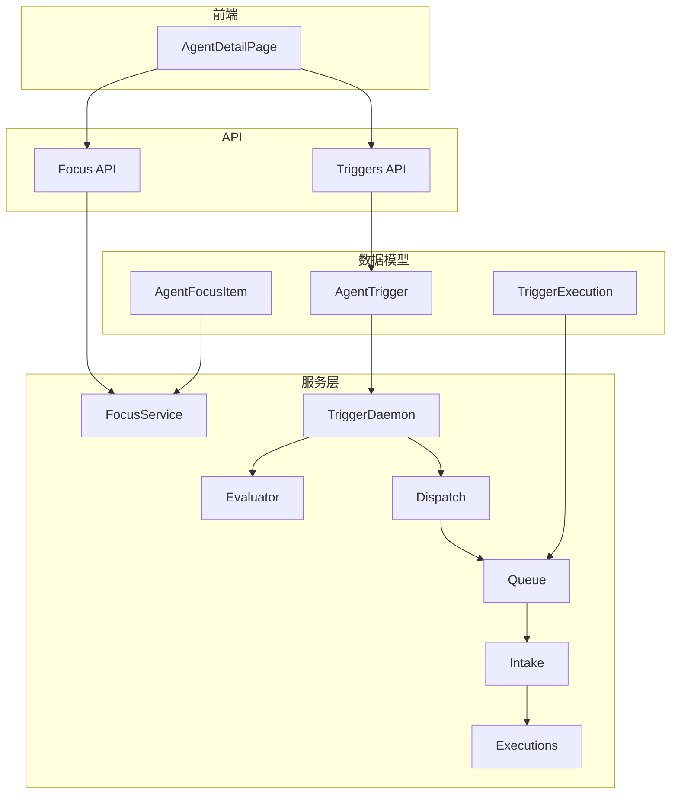
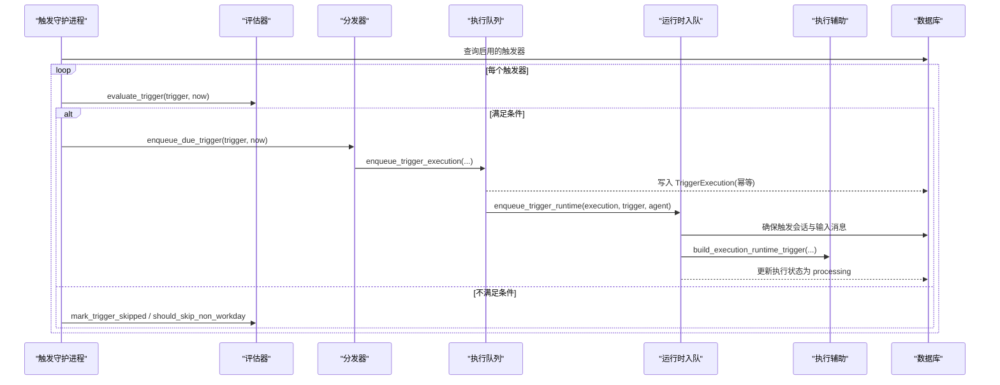
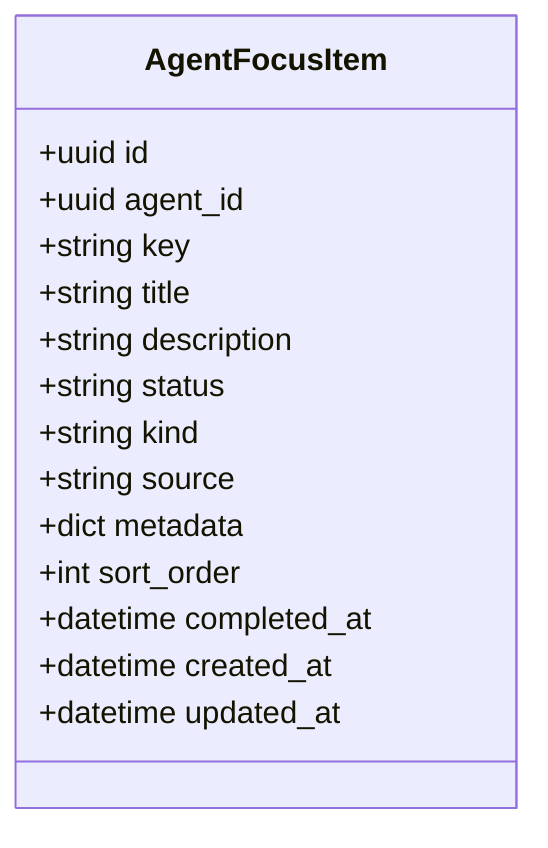
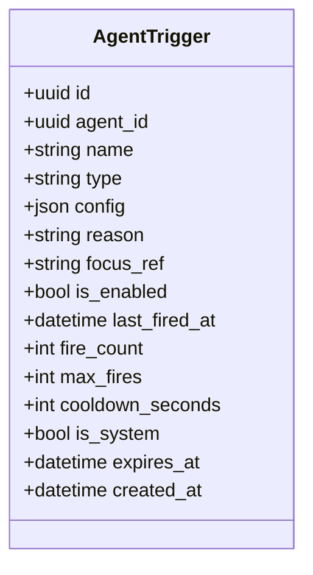
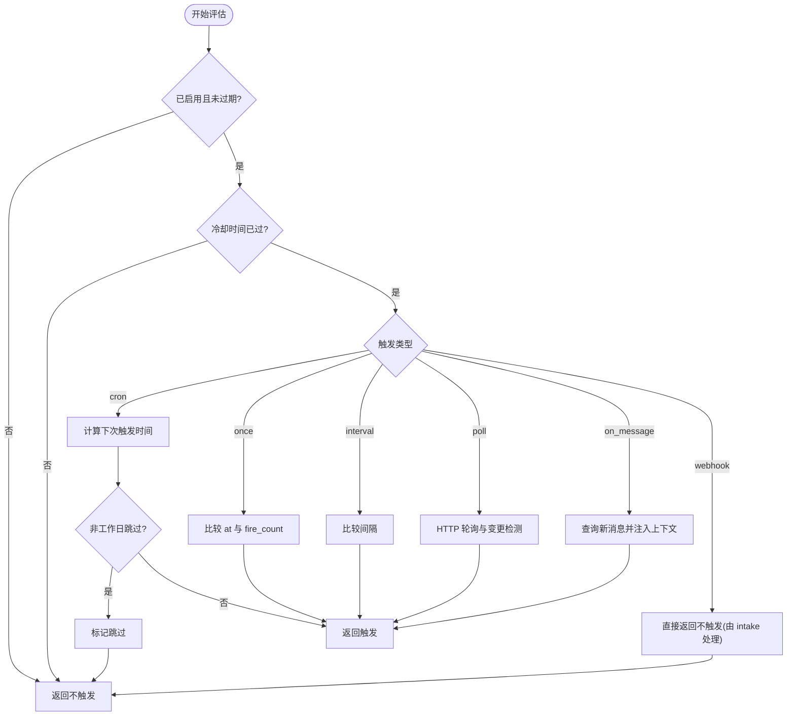
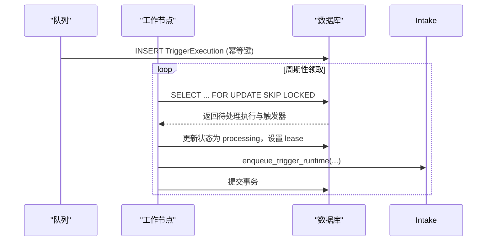
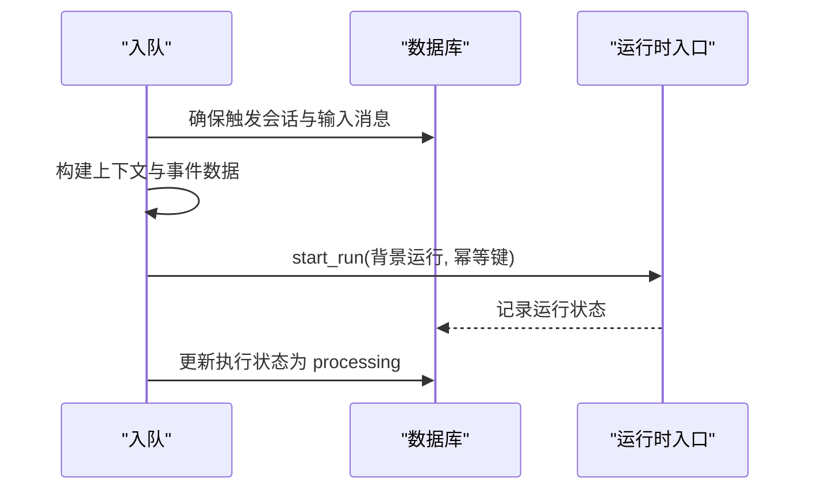
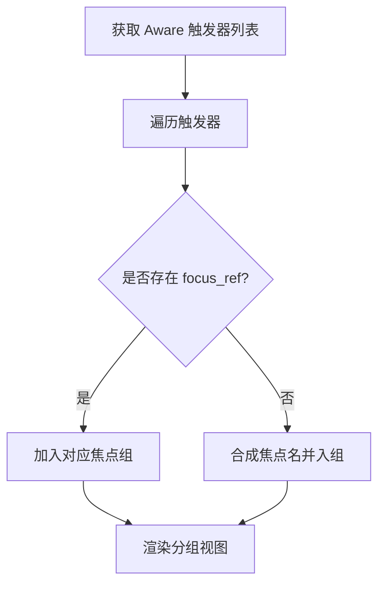
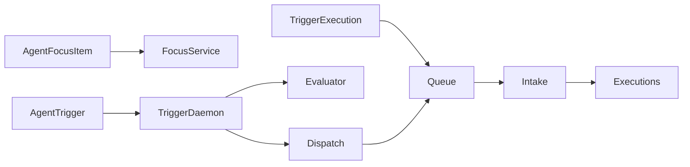

# 自适应意识系统

<cite>
**本文引用的文件**   
- [focus.py](file://backend/app/models/focus.py)
- [trigger.py](file://backend/app/models/trigger.py)
- [trigger_execution.py](file://backend/app/models/trigger_execution.py)
- [focus_service.py](file://backend/app/services/focus_service.py)
- [focus_api.py](file://backend/app/api/focus.py)
- [triggers_api.py](file://backend/app/api/triggers.py)
- [trigger_daemon.py](file://backend/app/services/trigger_daemon.py)
- [evaluator.py](file://backend/app/services/trigger_runtime/evaluator.py)
- [dispatch.py](file://backend/app/services/trigger_runtime/dispatch.py)
- [queue.py](file://backend/app/services/trigger_runtime/queue.py)
- [intake.py](file://backend/app/services/trigger_runtime/intake.py)
- [executions.py](file://backend/app/services/trigger_runtime/executions.py)
- [builtin_tool_definitions.py](file://backend/app/services/builtin_tool_definitions.py)
- [AgentDetailPage.tsx](file://frontend/src/pages/agent-detail/AgentDetailPage.tsx)
</cite>

## 目录
1. [简介](#简介)
2. [项目结构](#项目结构)
3. [核心组件](#核心组件)
4. [架构总览](#架构总览)
5. [详细组件分析](#详细组件分析)
6. [依赖关系分析](#依赖关系分析)
7. [性能考量](#性能考量)
8. [故障排查指南](#故障排查指南)
9. [结论](#结论)
10. [附录：配置示例与最佳实践](#附录配置示例与最佳实践)

## 简介
本文件系统化阐述 Clawith 的“自适应意识系统”（Aware），重点围绕以下能力展开：
- Focus Items（焦点项）：结构化工作记忆，支持状态标记、排序与持久化。
- Trigger 绑定系统：事件监听、条件评估、执行调度与幂等保障。
- 自我适应性触发：Agent 根据任务进展动态创建、调整、取消触发器。
- 监控与调试：运行态追踪、限流保护、失败回退与可观测性。
- 优化建议：提升 Agent 自主决策质量与系统吞吐稳定性。

## 项目结构
Aware 系统由“数据模型 + 服务层 + API + 运行时守护进程 + 前端展示”构成：
- 数据模型：焦点项、触发器、触发执行记录。
- 服务层：焦点管理、触发器评估与分发、执行队列与领取、运行时入队。
- API：焦点项 CRUD、触发器管理与查询。
- 守护进程：定时轮询、条件判定、安全限流、执行入队。
- 前端：将触发器按 focus_ref 分组展示，便于理解任务上下文。

**图表来源** 
- [focus.py:1-43](file://backend/app/models/focus.py#L1-L43)
- [trigger.py:1-48](file://backend/app/models/trigger.py#L1-L48)
- [trigger_execution.py:1-42](file://backend/app/models/trigger_execution.py#L1-L42)
- [focus_service.py:1-441](file://backend/app/services/focus_service.py#L1-L441)
- [focus_api.py:1-92](file://backend/app/api/focus.py#L1-L92)
- [triggers_api.py:1-134](file://backend/app/api/triggers.py#L1-L134)
- [trigger_daemon.py:1-201](file://backend/app/services/trigger_daemon.py#L1-L201)
- [evaluator.py:1-461](file://backend/app/services/trigger_runtime/evaluator.py#L1-L461)
- [dispatch.py:1-42](file://backend/app/services/trigger_runtime/dispatch.py#L1-L42)
- [queue.py:1-45](file://backend/app/services/trigger_runtime/queue.py#L1-L45)
- [intake.py:1-359](file://backend/app/services/trigger_runtime/intake.py#L1-L359)
- [executions.py:1-115](file://backend/app/services/trigger_runtime/executions.py#L1-L115)
- [AgentDetailPage.tsx:5818-5831](file://frontend/src/pages/agent-detail/AgentDetailPage.tsx#L5818-L5831)

**章节来源**
- [focus.py:1-43](file://backend/app/models/focus.py#L1-L43)
- [trigger.py:1-48](file://backend/app/models/trigger.py#L1-L48)
- [trigger_execution.py:1-42](file://backend/app/models/trigger_execution.py#L1-L42)
- [focus_service.py:1-441](file://backend/app/services/focus_service.py#L1-L441)
- [focus_api.py:1-92](file://backend/app/api/focus.py#L1-L92)
- [triggers_api.py:1-134](file://backend/app/api/triggers.py#L1-L134)
- [trigger_daemon.py:1-201](file://backend/app/services/trigger_daemon.py#L1-L201)
- [evaluator.py:1-461](file://backend/app/services/trigger_runtime/evaluator.py#L1-L461)
- [dispatch.py:1-42](file://backend/app/services/trigger_runtime/dispatch.py#L1-L42)
- [queue.py:1-45](file://backend/app/services/trigger_runtime/queue.py#L1-L45)
- [intake.py:1-359](file://backend/app/services/trigger_runtime/intake.py#L1-L359)
- [executions.py:1-115](file://backend/app/services/trigger_runtime/executions.py#L1-L115)
- [AgentDetailPage.tsx:5818-5831](file://frontend/src/pages/agent-detail/AgentDetailPage.tsx#L5818-L5831)

## 核心组件
- 焦点项（AgentFocusItem）：数据库持久化的结构化关注点，包含 key/title/description/status/kind/source/metadata/sort_order/completed_at 等字段，用于统一工作记忆与跨模块共享。
- 触发器（AgentTrigger）：Agent 自管理的唤醒条件，支持 cron/once/interval/poll/on_message/webhook 六种类型，具备冷却时间、最大触发次数、过期时间、是否系统级等控制字段。
- 触发执行（TriggerExecution）：分布式执行队列中的幂等记录，包含 idempotency_key、payload、lease 机制、状态流转等，保证多实例并发下的唯一性与可恢复性。
- 焦点服务（FocusService）：提供 upsert/list/complete/render 等方法，兼容历史 focus.md 迁移，维护排序与分类（进行中/系统/已完成）。
- 触发守护（TriggerDaemon）：主循环每 15s 扫描启用中的触发器，进行条件评估、限流、特殊处理（OKR 报表/收集）、入队执行。
- 评估器（Evaluator）：实现各类型触发器的确定性判断逻辑，包括 cron 时区、poll 变更检测、on_message 消息匹配、非工作日跳过等。
- 分发与队列（Dispatch/Queue）：将符合条件的触发器转换为执行请求，写入 TriggerExecution 并设置幂等键；支持 webhook/cron/once/interval/poll/on_message 等多源。
- 运行时入队（Intake）：在 v2 运行时路径下，构造会话与输入消息，调用 RuntimeCommandIntake.start_run 启动后台运行，并维护投递目标。
- 执行辅助（Executions）：分布式领取（claim）与完成标记，合并 payload 到运行时触发器上下文。

**章节来源**
- [focus.py:1-43](file://backend/app/models/focus.py#L1-L43)
- [trigger.py:1-48](file://backend/app/models/trigger.py#L1-L48)
- [trigger_execution.py:1-42](file://backend/app/models/trigger_execution.py#L1-L42)
- [focus_service.py:1-441](file://backend/app/services/focus_service.py#L1-L441)
- [trigger_daemon.py:1-201](file://backend/app/services/trigger_daemon.py#L1-L201)
- [evaluator.py:1-461](file://backend/app/services/trigger_runtime/evaluator.py#L1-L461)
- [dispatch.py:1-42](file://backend/app/services/trigger_runtime/dispatch.py#L1-L42)
- [queue.py:1-45](file://backend/app/services/trigger_runtime/queue.py#L1-L45)
- [intake.py:1-359](file://backend/app/services/trigger_runtime/intake.py#L1-L359)
- [executions.py:1-115](file://backend/app/services/trigger_runtime/executions.py#L1-L115)

## 架构总览
下图展示了从“触发器评估”到“运行时执行”的完整链路，以及焦点项与触发器的关联关系。

**图表来源** 
- [trigger_daemon.py:105-172](file://backend/app/services/trigger_daemon.py#L105-L172)
- [evaluator.py:173-254](file://backend/app/services/trigger_runtime/evaluator.py#L173-L254)
- [dispatch.py:34-42](file://backend/app/services/trigger_runtime/dispatch.py#L34-L42)
- [queue.py:1-45](file://backend/app/services/trigger_runtime/queue.py#L1-L45)
- [intake.py:231-336](file://backend/app/services/trigger_runtime/intake.py#L231-L336)
- [executions.py:71-114](file://backend/app/services/trigger_runtime/executions.py#L71-L114)

## 详细组件分析

### 焦点项（Focus Items）
- 数据结构与约束：key 唯一（agent_id+key），status 支持 in_progress/completed，kind 支持 normal/system，source 标识来源，metadata 扩展业务信息，sort_order 控制顺序。
- 生命周期：upsert 创建或更新，complete 标记完成并记录时间，list 支持过滤已完成项并按状态/种类/排序输出。
- 渲染上下文：render_focus_context 生成面向 Agent 的上下文文本，区分进行中、系统、最近完成三类，便于 Agent 感知当前关注点。
- 历史兼容：migrate_legacy_focus_file 一次性导入旧 focus.md，自动规范化分区与标记。

**图表来源** 
- [focus.py:13-43](file://backend/app/models/focus.py#L13-L43)

**章节来源**
- [focus_service.py:262-441](file://backend/app/services/focus_service.py#L262-L441)
- [focus_api.py:45-92](file://backend/app/api/focus.py#L45-L92)
- [focus.py:13-43](file://backend/app/models/focus.py#L13-L43)

### 触发器（Triggers）与绑定
- 类型与配置：
  - cron：expr 表达式，支持 timezone；last_fired_at/created_at 作为基准计算下次触发。
  - once：at 指定绝对时间，仅触发一次。
  - interval：minutes 间隔，基于 last_fired_at 或 created_at。
  - poll：HTTP 轮询，支持 json_path 提取值，change/match 两种 fire_on 策略，内部保存 _last_value。
  - on_message：监听特定 agent/user 的新消息，过滤内部工具调用与 trigger 会话，避免误触发。
  - webhook：外部 HTTP POST 事件，通过 intake 直接入队。
- 绑定关系：focus_ref 指向焦点项 key，未显式提供时由 reason 自动生成；完成焦点项后应取消相关触发器。
- 控制字段：is_enabled、max_fires、cooldown_seconds、expires_at、is_system、fire_count、last_fired_at。

**图表来源** 
- [trigger.py:13-48](file://backend/app/models/trigger.py#L13-L48)

**章节来源**
- [trigger.py:13-48](file://backend/app/models/trigger.py#L13-L48)
- [triggers_api.py:42-134](file://backend/app/api/triggers.py#L42-L134)
- [builtin_tool_definitions.py:358-433](file://backend/app/services/builtin_tool_definitions.py#L358-L433)

### 触发器评估与调度
- 评估流程：evaluate_trigger 先检查启用/过期/最大次数/冷却时间，再按类型分支判断；cron 使用 croniter 与时区转换；poll 进行 HTTP 请求与 JSONPath 比较；on_message 查询新消息并注入匹配上下文。
- 特殊处理：should_skip_non_workday 针对 OKR 日报在非工作日跳过；handle_okr_report_trigger/handle_okr_collection_trigger 自动汇总与收集。
- 限流保护：on_message 按 agent 维度限制每小时最多 30 次，超限自动禁用触发器。

**图表来源** 
- [evaluator.py:173-254](file://backend/app/services/trigger_runtime/evaluator.py#L173-L254)
- [evaluator.py:256-303](file://backend/app/services/trigger_runtime/evaluator.py#L256-L303)
- [evaluator.py:321-458](file://backend/app/services/trigger_runtime/evaluator.py#L321-L458)
- [trigger_daemon.py:147-169](file://backend/app/services/trigger_daemon.py#L147-L169)

**章节来源**
- [evaluator.py:173-458](file://backend/app/services/trigger_runtime/evaluator.py#L173-L458)
- [trigger_daemon.py:105-172](file://backend/app/services/trigger_daemon.py#L105-L172)

### 执行队列与分布式领取
- 入队：enqueue_trigger_execution 写入 TriggerExecution，设置 idempotency_key 防止重复；payload 携带运行时上下文（如 matched_message、okr_member_id 等）。
- 领取：claim_pending_trigger_executions 使用 with_for_update(skip_locked=True) 锁定行，分配 lease_owner 与 lease_expires_at，避免多实例重复处理。
- 完成：mark_base_triggers_fired 批量更新触发器 last_fired_at/fire_count，并在 once 或达到 max_fires 时禁用。

**图表来源** 
- [queue.py:1-45](file://backend/app/services/trigger_runtime/queue.py#L1-L45)
- [executions.py:19-68](file://backend/app/services/trigger_runtime/executions.py#L19-L68)
- [dispatch.py:34-42](file://backend/app/services/trigger_runtime/dispatch.py#L34-L42)

**章节来源**
- [queue.py:1-45](file://backend/app/services/trigger_runtime/queue.py#L1-L45)
- [executions.py:19-114](file://backend/app/services/trigger_runtime/executions.py#L19-L114)
- [dispatch.py:34-42](file://backend/app/services/trigger_runtime/dispatch.py#L34-L42)

### 运行时入队与会话构造
- 构建上下文：build_trigger_context 生成稳定的人类可读唤醒上下文，包含触发器名称、原因、focus_ref 与特定执行要求（如 OKR 收集/报表）。
- 会话与消息：_ensure_trigger_session 确保触发会话存在并写入输入消息，避免重复与不一致。
- 投递目标：_resolve_trigger_delivery_target 解析用户侧投递目标（平台会话），A2A 场景单独处理。
- 启动运行：RuntimeCommandIntake.start_run 以 background 模式启动运行，附带 idempotency_key 与 payload。

**图表来源** 
- [intake.py:127-200](file://backend/app/services/trigger_runtime/intake.py#L127-L200)
- [intake.py:231-336](file://backend/app/services/trigger_runtime/intake.py#L231-L336)

**章节来源**
- [intake.py:62-116](file://backend/app/services/trigger_runtime/intake.py#L62-L116)
- [intake.py:127-200](file://backend/app/services/trigger_runtime/intake.py#L127-L200)
- [intake.py:231-336](file://backend/app/services/trigger_runtime/intake.py#L231-L336)

### 前端展示与分组
- 分组逻辑：前端将触发器按 focus_ref 分组，若无对应焦点项则合成一个临时焦点名，便于 UI 呈现任务上下文。
- 交互：支持查看触发器列表、启用/禁用、更新配置与原因，帮助运维与用户理解触发行为。

**图表来源** 
- [AgentDetailPage.tsx:5818-5831](file://frontend/src/pages/agent-detail/AgentDetailPage.tsx#L5818-L5831)

**章节来源**
- [AgentDetailPage.tsx:5818-5831](file://frontend/src/pages/agent-detail/AgentDetailPage.tsx#L5818-L5831)
- [triggers_api.py:42-134](file://backend/app/api/triggers.py#L42-L134)

## 依赖关系分析
- 模型依赖：AgentTrigger 与 AgentFocusItem 通过 focus_ref 建立语义关联；TriggerExecution 通过 trigger_id 与 AgentTrigger 关联。
- 服务耦合：TriggerDaemon 依赖 Evaluator/Dispatch/Queue/Intake/Executions；FocusService 独立于触发器但被 API 与 Agent 工具调用。
- 外部集成：poll 类型依赖 httpx；cron 依赖 croniter；on_message 依赖 ChatMessage/ChatSession/Participant/User 等会话与身份模型。
- 潜在环依赖：无直接循环导入，服务间通过函数调用与异步会话解耦。

**图表来源** 
- [focus.py:13-43](file://backend/app/models/focus.py#L13-L43)
- [trigger.py:13-48](file://backend/app/models/trigger.py#L13-L48)
- [trigger_execution.py:13-42](file://backend/app/models/trigger_execution.py#L13-L42)
- [focus_service.py:1-441](file://backend/app/services/focus_service.py#L1-L441)
- [trigger_daemon.py:1-201](file://backend/app/services/trigger_daemon.py#L1-L201)
- [evaluator.py:1-461](file://backend/app/services/trigger_runtime/evaluator.py#L1-L461)
- [dispatch.py:1-42](file://backend/app/services/trigger_runtime/dispatch.py#L1-L42)
- [queue.py:1-45](file://backend/app/services/trigger_runtime/queue.py#L1-L45)
- [intake.py:1-359](file://backend/app/services/trigger_runtime/intake.py#L1-L359)
- [executions.py:1-115](file://backend/app/services/trigger_runtime/executions.py#L1-L115)

**章节来源**
- [focus.py:13-43](file://backend/app/models/focus.py#L13-L43)
- [trigger.py:13-48](file://backend/app/models/trigger.py#L13-L48)
- [trigger_execution.py:13-42](file://backend/app/models/trigger_execution.py#L13-L42)
- [focus_service.py:1-441](file://backend/app/services/focus_service.py#L1-L441)
- [trigger_daemon.py:1-201](file://backend/app/services/trigger_daemon.py#L1-L201)
- [evaluator.py:1-461](file://backend/app/services/trigger_runtime/evaluator.py#L1-L461)
- [dispatch.py:1-42](file://backend/app/services/trigger_runtime/dispatch.py#L1-L42)
- [queue.py:1-45](file://backend/app/services/trigger_runtime/queue.py#L1-L45)
- [intake.py:1-359](file://backend/app/services/trigger_runtime/intake.py#L1-L359)
- [executions.py:1-115](file://backend/app/services/trigger_runtime/executions.py#L1-L115)

## 性能考量
- 评估频率：守护进程每 15s 轮询一次，平衡实时性与负载。
- 冷却与上限：cooldown_seconds 与 max_fires 有效抑制高频触发与无限执行。
- 幂等与锁：idempotency_key 与 for update skip locked 避免重复执行与竞争。
- 网络 I/O：poll 类型最小间隔 5 分钟，超时 10s，降低外部依赖抖动影响。
- 内存限流：on_message 按 agent 维度小时级限流，超限自动禁用，防止雪崩。
- 索引与查询：TriggerExecution.status_scheduled 索引加速领取；AgentTrigger.agent_id/name 唯一约束减少冲突。

[本节为通用指导，无需具体文件引用]

## 故障排查指南
- 触发器未触发：
  - 检查 is_enabled、expires_at、cooldown_seconds、max_fires 与 last_fired_at。
  - 确认 cron expr 与时区设置正确；poll 的 url/json_path/fire_on 配置合理。
  - on_message 需确保 from_agent_name/from_user_name 匹配且会话渠道合法。
- 重复执行：
  - 核查 idempotency_key 是否唯一；检查 queue 领取逻辑是否正确设置 lease。
- 性能问题：
  - 观察 on_message 限流日志；适当增大 cooldown_seconds 或降低 poll interval_min。
  - 检查数据库索引与查询计划，避免全表扫描。
- 运行时错误：
  - intake 抛出 TriggerRuntimeIntakeError 时，检查 agent.tenant_id、primary_model_id、状态是否为可用。
  - 会话与输入消息一致性校验失败会导致拒绝，需核对上下文构造逻辑。

**章节来源**
- [evaluator.py:173-458](file://backend/app/services/trigger_runtime/evaluator.py#L173-L458)
- [trigger_daemon.py:147-169](file://backend/app/services/trigger_daemon.py#L147-L169)
- [intake.py:231-336](file://backend/app/services/trigger_runtime/intake.py#L231-L336)
- [executions.py:19-68](file://backend/app/services/trigger_runtime/executions.py#L19-L68)

## 结论
Clawith 的自适应意识系统通过数据库驱动的焦点项与触发器模型，结合守护进程、评估器、队列与运行时入队，实现了高可靠、可扩展、可观测的自动化触发体系。Agent 可在任务演进中动态管理触发器，形成“人类设定目标、Agent 管理日程”的协作范式。通过冷却、限流、幂等与分布式领取等机制，系统在复杂环境下保持稳定与高效。

[本节为总结性内容，无需具体文件引用]

## 附录：配置示例与最佳实践
- 焦点项配置建议：
  - key 保持简洁稳定，title 描述业务含义，description 明确目标与范围。
  - 使用 system 类型存放系统级关注点，normal 类型存放业务任务。
  - 完成时及时 complete，以便清理与统计。
- 触发器配置建议：
  - cron：expr 与 timezone 一致，避免跨时区误判；合理设置 cooldown_seconds。
  - once：at 使用 ISO 8601 带时区；适用于一次性提醒或快照采集。
  - interval：minutes 不宜过小，避免频繁轮询；配合 poll 时注意最小间隔。
  - poll：url 必须公网可达；json_path 精确提取变化字段；fire_on=change 更通用。
  - on_message：from_agent_name/from_user_name 精确匹配；避免内部会话干扰。
  - webhook：确保 intake 能接收并解析 payload；必要时限定来源 IP。
- 绑定与生命周期：
  - 先创建焦点项，再设置触发器并关联 focus_ref；任务完成后取消触发器。
  - 使用 set_trigger/update_trigger/cancel_trigger 工具统一管理。
- 监控与调试：
  - 通过 Triggers API 查看触发器状态、fire_count、last_fired_at、expires_at。
  - 关注守护进程日志中的限流与跳过提示；检查 TriggerExecution 状态流转。
  - 前端按 focus_ref 分组查看，快速定位任务上下文。

**章节来源**
- [focus_service.py:284-387](file://backend/app/services/focus_service.py#L284-L387)
- [builtin_tool_definitions.py:358-433](file://backend/app/services/builtin_tool_definitions.py#L358-L433)
- [triggers_api.py:42-134](file://backend/app/api/triggers.py#L42-L134)
- [evaluator.py:173-458](file://backend/app/services/trigger_runtime/evaluator.py#L173-L458)
- [AgentDetailPage.tsx:5818-5831](file://frontend/src/pages/agent-detail/AgentDetailPage.tsx#L5818-L5831)