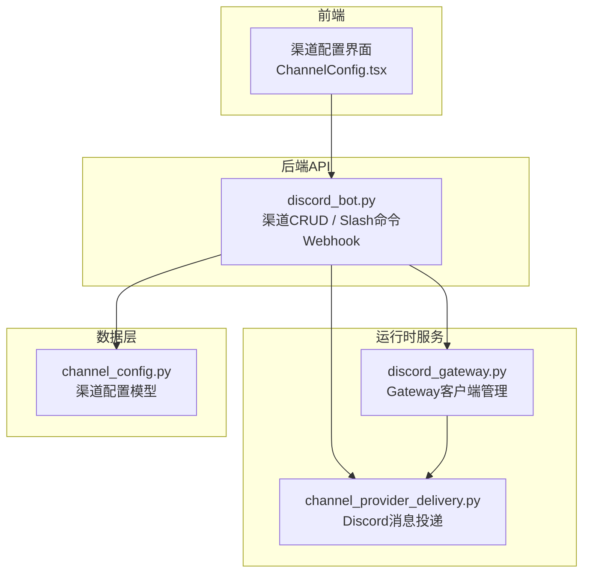
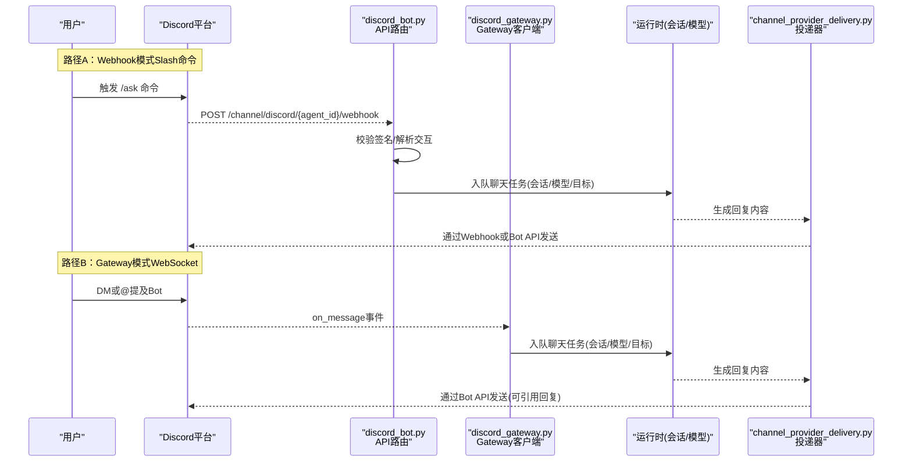
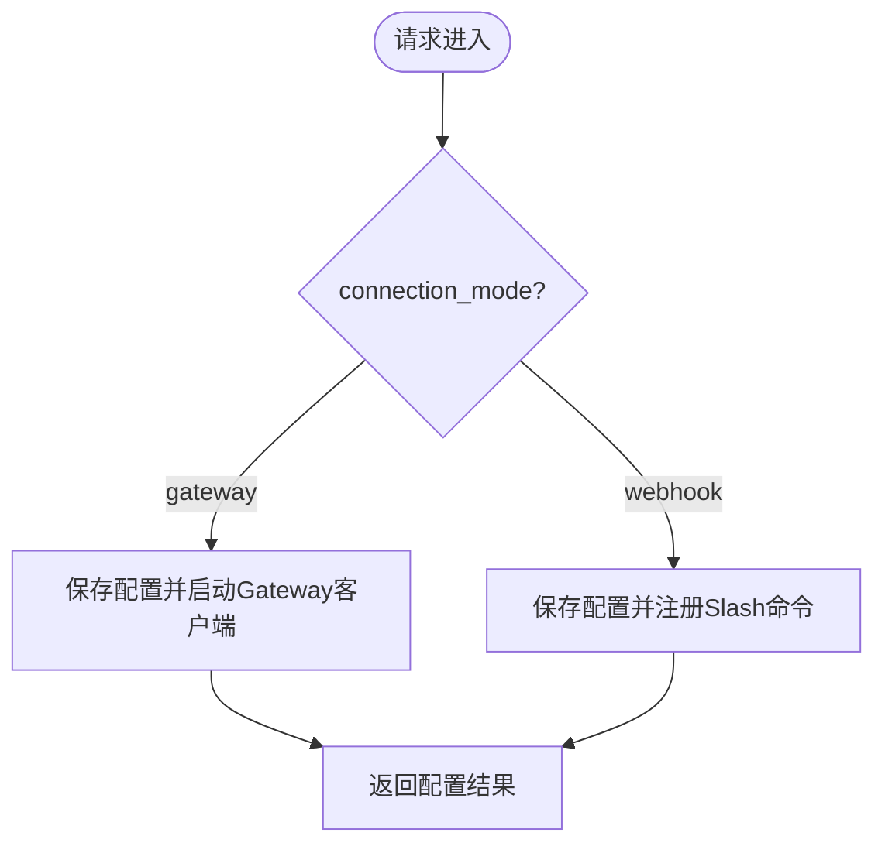
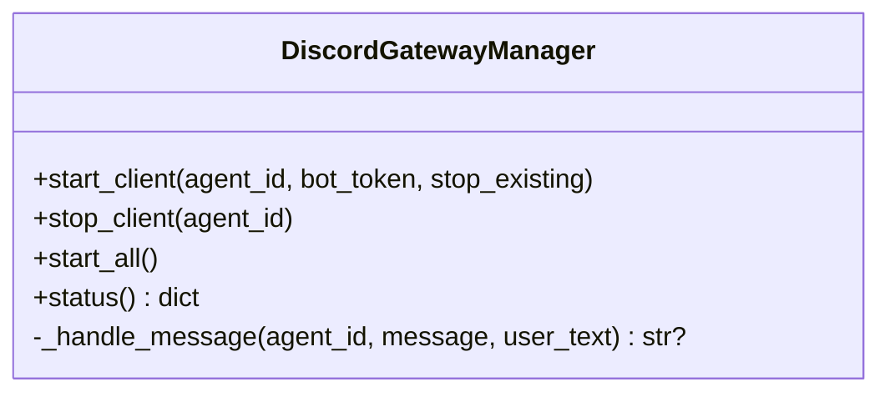
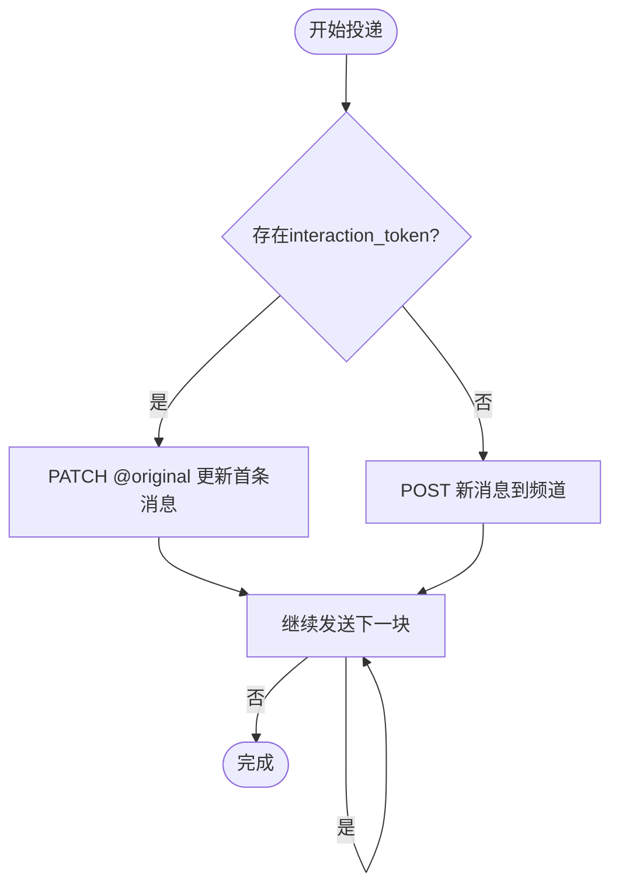
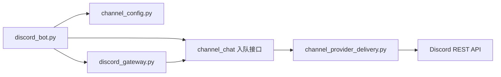

# Discord集成

<cite>
**本文引用的文件**   
- [backend/app/api/discord_bot.py](file://backend/app/api/discord_bot.py)
- [backend/app/services/discord_gateway.py](file://backend/app/services/discord_gateway.py)
- [backend/app/services/agent_runtime/channel_provider_delivery.py](file://backend/app/services/agent_runtime/channel_provider_delivery.py)
- [backend/app/models/channel_config.py](file://backend/app/models/channel_config.py)
- [frontend/src/components/ChannelConfig.tsx](file://frontend/src/components/ChannelConfig.tsx)
</cite>

## 目录
1. [简介](#简介)
2. [项目结构](#项目结构)
3. [核心组件](#核心组件)
4. [架构总览](#架构总览)
5. [详细组件分析](#详细组件分析)
6. [依赖关系分析](#依赖关系分析)
7. [性能与速率限制](#性能与速率限制)
8. [故障排查指南](#故障排查指南)
9. [结论](#结论)
10. [附录：配置与权限清单](#附录配置与权限清单)

## 简介
本文件面向需要在系统中集成Discord Bot的开发者与运维人员，系统性说明以下能力与流程：
- 认证与连接：Bot Token鉴权、WebSocket（Gateway）长连接、Webhook交互回调
- 消息API使用：Slash命令注册与处理、消息发送与回复、分块策略
- 权限模型：服务器、频道、角色的权限管理建议（概念性说明）
- 功能实现：Embed消息、Reaction、文件上传、语音通道（概念性说明与扩展建议）
- 应用创建与配置：Discord应用创建、Bot添加、权限配置、Webhook端点设置
- 平台特性：Discord消息格式、事件系统、速率限制等注意事项

## 项目结构
Discord集成的后端由“API路由 + Gateway管理器 + 渠道投递器”三部分组成，前端提供渠道配置界面。

图表来源
- [backend/app/api/discord_bot.py:1-120](file://backend/app/api/discord_bot.py#L1-L120)
- [backend/app/services/discord_gateway.py:1-120](file://backend/app/services/discord_gateway.py#L1-L120)
- [backend/app/services/agent_runtime/channel_provider_delivery.py:380-505](file://backend/app/services/agent_runtime/channel_provider_delivery.py#L380-L505)
- [backend/app/models/channel_config.py:1-52](file://backend/app/models/channel_config.py#L1-L52)
- [frontend/src/components/ChannelConfig.tsx:115-135](file://frontend/src/components/ChannelConfig.tsx#L115-L135)

章节来源
- [backend/app/api/discord_bot.py:1-120](file://backend/app/api/discord_bot.py#L1-L120)
- [backend/app/services/discord_gateway.py:1-120](file://backend/app/services/discord_gateway.py#L1-L120)
- [backend/app/models/channel_config.py:1-52](file://backend/app/models/channel_config.py#L1-L52)
- [frontend/src/components/ChannelConfig.tsx:115-135](file://frontend/src/components/ChannelConfig.tsx#L115-L135)

## 核心组件
- 渠道配置API（discord_bot.py）
  - 支持两种连接模式：gateway（WebSocket）与webhook（交互回调）
  - 提供渠道配置的增删改查、获取Webhook URL、Slash命令自动注册
- Gateway管理器（discord_gateway.py）
  - 基于discord.py维护每个Agent的Bot客户端
  - 监听DM或@提及消息，转发到统一运行时
- 渠道投递器（channel_provider_delivery.py）
  - 将运行时生成的回复通过Discord Webhook或Bot API发送
  - 支持按2000字符分块、引用回复、失败回退

章节来源
- [backend/app/api/discord_bot.py:25-93](file://backend/app/api/discord_bot.py#L25-L93)
- [backend/app/services/discord_gateway.py:38-134](file://backend/app/services/discord_gateway.py#L38-L134)
- [backend/app/services/agent_runtime/channel_provider_delivery.py:387-464](file://backend/app/services/agent_runtime/channel_provider_delivery.py#L387-L464)

## 架构总览
下图展示了从用户输入到Bot回复的端到端流程，涵盖Webhook与Gateway两条路径。

图表来源
- [backend/app/api/discord_bot.py:197-320](file://backend/app/api/discord_bot.py#L197-L320)
- [backend/app/services/discord_gateway.py:79-134](file://backend/app/services/discord_gateway.py#L79-L134)
- [backend/app/services/agent_runtime/channel_provider_delivery.py:387-464](file://backend/app/services/agent_runtime/channel_provider_delivery.py#L387-L464)

## 详细组件分析

### 渠道配置API（discord_bot.py）
- 功能要点
  - 支持connection_mode=gateway/webhook；gateway需bot_token，webhook需application_id与public_key
  - gateway模式下启动Gateway客户端；webhook模式下调用Discord API注册全局Slash命令
  - 提供获取Webhook URL接口，便于在Discord应用后台配置
  - 删除渠道时停止对应Gateway客户端
- 关键流程
  - 配置保存：校验参数→写入ChannelConfig→根据模式执行后续动作
  - Slash命令注册：PUT /applications/{id}/commands
  - Webhook接收：验证ed25519签名→处理PING与APPLICATION_COMMAND→入队运行

图表来源
- [backend/app/api/discord_bot.py:25-93](file://backend/app/api/discord_bot.py#L25-L93)
- [backend/app/api/discord_bot.py:151-176](file://backend/app/api/discord_bot.py#L151-L176)

章节来源
- [backend/app/api/discord_bot.py:25-120](file://backend/app/api/discord_bot.py#L25-L120)
- [backend/app/api/discord_bot.py:151-176](file://backend/app/api/discord_bot.py#L151-L176)

### Gateway管理器（discord_gateway.py）
- 功能要点
  - 为每个Agent维护一个discord.Client实例与异步任务
  - 启用message_content意图以读取文本
  - 仅响应DM或@提及的消息，自动去除@mention前缀
  - 处理过程中显示typing状态，回复超过2000字符时分块发送
- 错误处理
  - 登录失败、异常捕获、任务取消与资源清理

图表来源
- [backend/app/services/discord_gateway.py:38-134](file://backend/app/services/discord_gateway.py#L38-L134)
- [backend/app/services/discord_gateway.py:135-227](file://backend/app/services/discord_gateway.py#L135-L227)

章节来源
- [backend/app/services/discord_gateway.py:38-134](file://backend/app/services/discord_gateway.py#L38-L134)
- [backend/app/services/discord_gateway.py:135-227](file://backend/app/services/discord_gateway.py#L135-L227)

### 渠道投递器（channel_provider_delivery.py）
- 功能要点
  - _discord方法负责将运行时回复发送到Discord
  - 优先使用Webhook更新原消息（interaction_token），否则直接通过Bot API发送
  - 支持reply_to_message_id进行引用回复
  - 按2000字符分块，确保符合Discord消息长度限制
  - 对401/404等错误进行回退处理

图表来源
- [backend/app/services/agent_runtime/channel_provider_delivery.py:387-464](file://backend/app/services/agent_runtime/channel_provider_delivery.py#L387-L464)

章节来源
- [backend/app/services/agent_runtime/channel_provider_delivery.py:387-464](file://backend/app/services/agent_runtime/channel_provider_delivery.py#L387-L464)

### 渠道配置模型（channel_config.py）
- 字段说明
  - channel_type包含"discord"枚举值
  - app_id/app_secret/encrypt_key用于存储Application ID、Bot Token、Public Key
  - extra_config记录connection_mode等扩展信息
  - is_configured/is_connected标识配置与连接状态

章节来源
- [backend/app/models/channel_config.py:1-52](file://backend/app/models/channel_config.py#L1-L52)

### 前端渠道配置（ChannelConfig.tsx）
- 行为说明
  - Discord渠道支持connection_mode切换（Gateway/Webhook）
  - Webhook模式需要application_id、bot_token、public_key
  - Gateway模式仅需bot_token
  - 提供引导步骤数与Webhook标签文案

章节来源
- [frontend/src/components/ChannelConfig.tsx:115-135](file://frontend/src/components/ChannelConfig.tsx#L115-L135)

## 依赖关系分析
- 模块耦合
  - discord_bot.py依赖ChannelConfig模型、安全与权限检查、运行时入队接口
  - discord_gateway.py依赖数据库会话、ChannelConfig查询、运行时入队接口
  - channel_provider_delivery.py依赖httpx与Discord REST API，使用Bot Token或Webhook Token
- 外部依赖
  - discord.py（可选，仅在gateway模式需要）
  - nacl（用于ed25519签名校验）
  - httpx（HTTP客户端，支持代理）

图表来源
- [backend/app/api/discord_bot.py:1-120](file://backend/app/api/discord_bot.py#L1-L120)
- [backend/app/services/discord_gateway.py:1-120](file://backend/app/services/discord_gateway.py#L1-L120)
- [backend/app/services/agent_runtime/channel_provider_delivery.py:387-464](file://backend/app/services/agent_runtime/channel_provider_delivery.py#L387-L464)

章节来源
- [backend/app/api/discord_bot.py:1-120](file://backend/app/api/discord_bot.py#L1-L120)
- [backend/app/services/discord_gateway.py:1-120](file://backend/app/services/discord_gateway.py#L1-L120)
- [backend/app/services/agent_runtime/channel_provider_delivery.py:387-464](file://backend/app/services/agent_runtime/channel_provider_delivery.py#L387-L464)

## 性能与速率限制
- 消息长度限制
  - Discord单条消息最大2000字符；系统已实现自动分块发送
- 速率限制
  - Discord REST API存在严格的速率限制（如每频道每秒/每分钟请求数）
  - 建议在批量发送或高频场景增加重试与退避策略
- 代理支持
  - 通过环境变量DISCORD_PROXY或HTTPS_PROXY为httpx客户端设置代理，便于网络受限环境部署

章节来源
- [backend/app/services/agent_runtime/channel_provider_delivery.py:387-464](file://backend/app/services/agent_runtime/channel_provider_delivery.py#L387-L464)
- [backend/app/api/discord_bot.py:151-176](file://backend/app/api/discord_bot.py#L151-L176)

## 故障排查指南
- Webhook签名校验失败
  - 确认public_key正确且与Discord应用一致
  - 检查x-signature-timestamp与x-signature-ed25519头是否存在
- Slash命令未生效
  - 确认已调用注册接口成功
  - 刷新Discord客户端缓存或等待生效时间
- Gateway无法连接
  - 检查bot_token有效性
  - 确认已安装discord.py并启用message_content意图
- 消息发送失败
  - 检查interaction_token是否过期（401/404会回退到Bot API）
  - 确认channel_id有效且Bot具备发送权限

章节来源
- [backend/app/api/discord_bot.py:180-221](file://backend/app/api/discord_bot.py#L180-L221)
- [backend/app/services/discord_gateway.py:116-134](file://backend/app/services/discord_gateway.py#L116-L134)
- [backend/app/services/agent_runtime/channel_provider_delivery.py:417-431](file://backend/app/services/agent_runtime/channel_provider_delivery.py#L417-L431)

## 结论
本项目实现了Discord的双模接入（Gateway与Webhook），覆盖Slash命令、消息收发、签名校验、分块发送与错误回退等关键能力。通过统一的运行时入队与渠道投递机制，Discord与其他渠道保持一致的对话体验。生产环境建议关注速率限制、代理配置与权限最小化原则。

## 附录：配置与权限清单

### Discord应用创建与Bot添加（操作步骤）
- 在Discord开发者门户创建应用
- 添加Bot账户并复制Bot Token
- 如需Webhook模式，记录Application ID与Public Key
- 将Webhook URL配置到应用后台（用于Slash命令交互回调）

章节来源
- [backend/app/api/discord_bot.py:115-120](file://backend/app/api/discord_bot.py#L115-L120)
- [backend/app/api/discord_bot.py:151-176](file://backend/app/api/discord_bot.py#L151-L176)

### 权限配置建议（概念性说明）
- 服务器与频道权限
  - 确保Bot具有在目标频道发送消息、读取消息内容的权限
  - 若使用@提及，需允许Bot被提及
- 角色权限
  - 建议为Bot分配最小必要角色，避免过度授权
- 应用权限
  - Webhook模式：需要Interactions Endpoint权限
  - Gateway模式：需要Server Members、Message Content等意图

注意：以上为通用实践建议，具体权限以Discord官方文档为准。

### Embed消息、Reaction、文件上传、语音通道（概念性说明）
- Embed消息
  - 可在channel_provider_delivery中构造Embed JSON并通过Discord API发送
- Reaction
  - 发送消息后调用React API添加表情回应
- 文件上传
  - 使用Discord上传接口上传媒体，并在消息中附带链接或嵌入
- 语音通道
  - 使用discord.py的VoiceClient接入语音通道，播放音频流或录制

注意：当前代码未内置上述功能的UI与默认实现，可按需在投递器或Gateway中扩展。