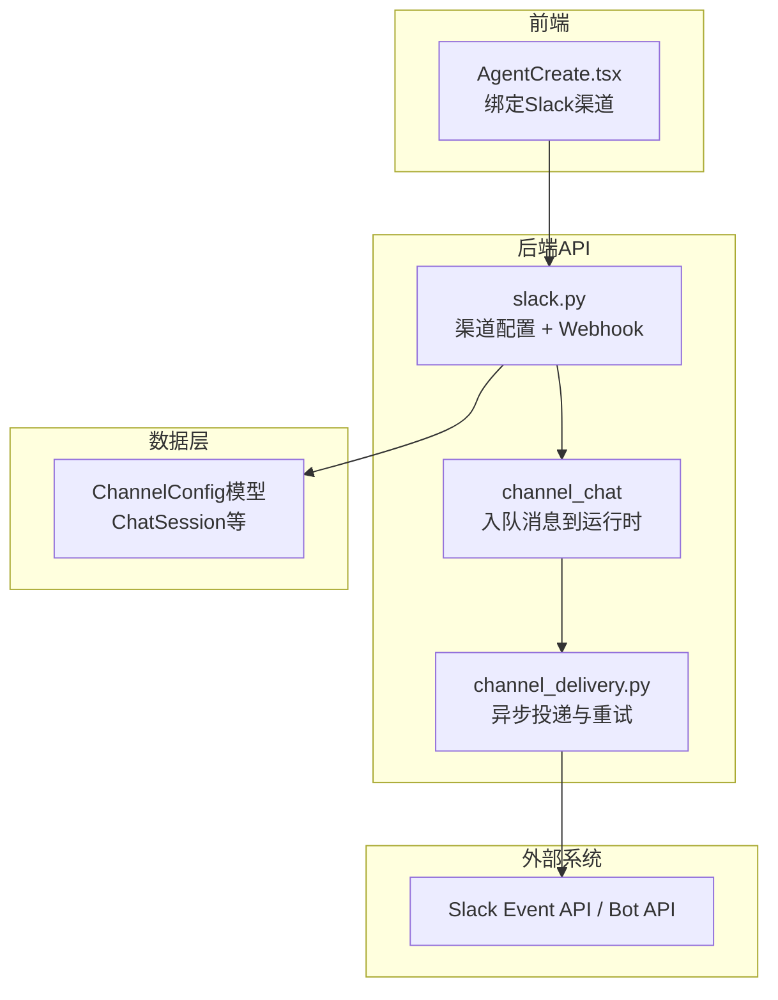
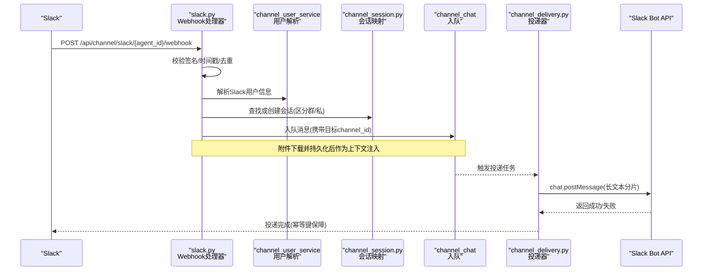
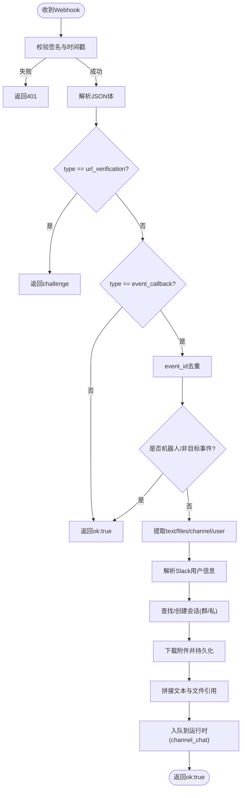
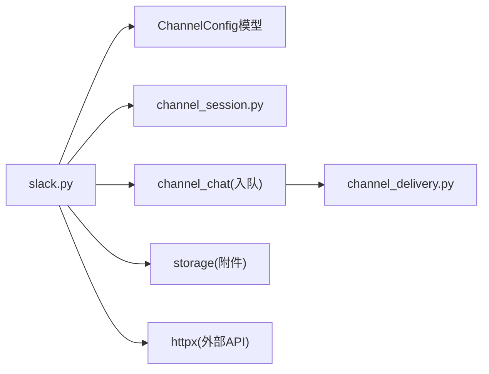

# Slack集成

<cite>
**本文引用的文件**   
- [backend/app/api/slack.py](file://backend/app/api/slack.py)
- [backend/app/models/channel_config.py](file://backend/app/models/channel_config.py)
- [backend/app/services/channel_session.py](file://backend/app/services/channel_session.py)
- [backend/app/services/agent_runtime/channel_delivery.py](file://backend/app/services/agent_runtime/channel_delivery.py)
- [frontend/src/pages/AgentCreate.tsx](file://frontend/src/pages/AgentCreate.tsx)
</cite>

## 目录
1. [简介](#简介)
2. [项目结构](#项目结构)
3. [核心组件](#核心组件)
4. [架构总览](#架构总览)
5. [详细组件分析](#详细组件分析)
6. [依赖关系分析](#依赖关系分析)
7. [性能与速率限制](#性能与速率限制)
8. [故障排查指南](#故障排查指南)
9. [结论](#结论)
10. [附录：Slack应用创建与权限配置步骤](#附录slack应用创建与权限配置步骤)

## 简介
本文件面向需要在系统中集成Slack Bot的开发者，系统性说明以下能力：
- Slack事件回调接入、签名校验与URL验证
- 消息处理（文本、@提及、附件下载）
- 工作区、频道、私聊的消息路由与会话映射
- 通过Bot API发送消息（含长文本分片）
- 与平台统一会话、用户、渠道投递机制的对接
- 部署与配置要点、常见问题定位

注意：当前实现未包含Slack OAuth授权流程；OAuth相关步骤见附录。

## 项目结构
Slack集成的后端入口位于FastAPI路由模块，负责：
- 渠道配置CRUD（保存Bot Token与Signing Secret）
- 接收Slack事件Webhook并处理
- 调用平台服务进行会话管理、用户解析与消息入队

图表来源
- [backend/app/api/slack.py:32-99](file://backend/app/api/slack.py#L32-L99)
- [backend/app/services/agent_runtime/channel_delivery.py:188-211](file://backend/app/services/agent_runtime/channel_delivery.py#L188-L211)
- [frontend/src/pages/AgentCreate.tsx:116-147](file://frontend/src/pages/AgentCreate.tsx#L116-L147)

章节来源
- [backend/app/api/slack.py:1-120](file://backend/app/api/slack.py#L1-L120)
- [backend/app/models/channel_config.py:13-52](file://backend/app/models/channel_config.py#L13-L52)
- [frontend/src/pages/AgentCreate.tsx:116-147](file://frontend/src/pages/AgentCreate.tsx#L116-L147)

## 核心组件
- 渠道配置接口
  - 新增/获取/删除Slack渠道配置，存储Bot Token与Signing Secret
  - 提供Webhook地址生成接口
- Slack事件Webhook处理器
  - URL验证挑战应答
  - 事件签名校验（HMAC-SHA256，时间戳防重放）
  - 去重、忽略机器人消息、过滤事件类型
  - 解析用户、频道、私聊与会话映射
  - 附件下载与本地持久化
  - 将消息入队至运行时处理
- 会话与会话映射
  - 按(租户, Agent, external_conv_id)唯一性保证会话复用
  - 区分群聊与私聊会话，维护group_name与标题
- 渠道投递
  - 异步出队、幂等键、指数退避重试
  - 失败不干扰Graph状态

章节来源
- [backend/app/api/slack.py:32-120](file://backend/app/api/slack.py#L32-L120)
- [backend/app/api/slack.py:155-367](file://backend/app/api/slack.py#L155-L367)
- [backend/app/services/channel_session.py:24-184](file://backend/app/services/channel_session.py#L24-L184)
- [backend/app/services/agent_runtime/channel_delivery.py:188-211](file://backend/app/services/agent_runtime/channel_delivery.py#L188-L211)

## 架构总览
Slack事件从Slack服务器进入后端Webhook端点，经过安全校验后进入统一的通道处理管线，最终由投递器将结果写回Slack。

图表来源
- [backend/app/api/slack.py:155-367](file://backend/app/api/slack.py#L155-L367)
- [backend/app/services/channel_session.py:24-184](file://backend/app/services/channel_session.py#L24-L184)
- [backend/app/services/agent_runtime/channel_delivery.py:188-211](file://backend/app/services/agent_runtime/channel_delivery.py#L188-L211)

## 详细组件分析

### 渠道配置API
- 功能
  - 新增/更新渠道配置：保存bot_token与signing_secret
  - 查询渠道配置
  - 删除渠道配置
  - 获取Webhook地址
- 关键点
  - 仅Agent创建者可配置/删除
  - 使用ChannelConfig表存储渠道凭证
  - Webhook地址基于平台公开基础域名动态生成

章节来源
- [backend/app/api/slack.py:32-99](file://backend/app/api/slack.py#L32-L99)
- [backend/app/models/channel_config.py:13-52](file://backend/app/models/channel_config.py#L13-L52)

### Slack事件Webhook处理
- 功能
  - URL验证挑战应答
  - HMAC-SHA256签名校验，拒绝超过5分钟的请求
  - 事件去重（event_id），忽略机器人消息与非目标事件类型
  - 解析文本与附件，识别群聊/私聊
  - 调用Slack users.info获取显示名/邮箱/头像
  - 附件下载并保存到工作区，失败时提示权限问题
  - 构建用户与会话上下文，入队到运行时
- 关键路径
  - 签名校验：_verify_slack_signature
  - 发送消息：_send_slack_messages（按4000字符分片）
  - 会话映射：find_or_create_channel_session
  - 用户解析：channel_user_service.resolve_channel_user

图表来源
- [backend/app/api/slack.py:128-153](file://backend/app/api/slack.py#L128-L153)
- [backend/app/api/slack.py:155-367](file://backend/app/api/slack.py#L155-L367)
- [backend/app/services/channel_session.py:24-184](file://backend/app/services/channel_session.py#L24-L184)

章节来源
- [backend/app/api/slack.py:128-153](file://backend/app/api/slack.py#L128-L153)
- [backend/app/api/slack.py:155-367](file://backend/app/api/slack.py#L155-L367)
- [backend/app/services/channel_session.py:24-184](file://backend/app/services/channel_session.py#L24-L184)

### 会话与会话映射
- 唯一性约束
  - 基于tenant_id、agent_id、external_conv_id确保会话唯一
- 群聊与私聊
  - 群聊会话user_id为Agent创建者占位，is_group=true，支持group_name
  - 私聊会话user_id为实际用户ID
- 并发保护
  - 使用数据库 advisory lock避免并发重复创建

章节来源
- [backend/app/services/channel_session.py:24-184](file://backend/app/services/channel_session.py#L24-L184)

### 渠道投递与重试
- 特性
  - 幂等键：run_id:terminal:completed等
  - 指数退避：最大间隔约300秒
  - 失败不恢复Graph状态，保证稳定性

章节来源
- [backend/app/services/agent_runtime/channel_delivery.py:188-211](file://backend/app/services/agent_runtime/channel_delivery.py#L188-L211)

### 前端绑定Slack渠道
- 在Agent创建流程中，若填写了Slack bot token与signing secret，则调用渠道创建接口绑定Slack渠道。

章节来源
- [frontend/src/pages/AgentCreate.tsx:116-147](file://frontend/src/pages/AgentCreate.tsx#L116-L147)

## 依赖关系分析
- slack.py依赖
  - ChannelConfig模型：渠道凭证存储
  - channel_session：会话映射
  - channel_chat：消息入队
  - storage：附件持久化
  - httpx：HTTP客户端（Slack API调用）
- 外部依赖
  - Slack Event API（事件回调）
  - Slack Bot API（chat.postMessage、users.info）

图表来源
- [backend/app/api/slack.py:1-120](file://backend/app/api/slack.py#L1-L120)
- [backend/app/models/channel_config.py:13-52](file://backend/app/models/channel_config.py#L13-L52)
- [backend/app/services/channel_session.py:24-184](file://backend/app/services/channel_session.py#L24-L184)
- [backend/app/services/agent_runtime/channel_delivery.py:188-211](file://backend/app/services/agent_runtime/channel_delivery.py#L188-L211)

章节来源
- [backend/app/api/slack.py:1-120](file://backend/app/api/slack.py#L1-L120)
- [backend/app/models/channel_config.py:13-52](file://backend/app/models/channel_config.py#L13-L52)

## 性能与速率限制
- 消息长度限制
  - Slack文本消息上限4000字符，实现已自动分片发送
- 事件去重
  - 内存集合缓存event_id，超过阈值后清理，避免重复处理
- 超时与重试
  - HTTP请求设置超时
  - 投递器采用指数退避策略，最大间隔约300秒
- 建议
  - 对频繁调用的Slack API增加限流与熔断
  - 附件下载失败需快速失败并给出明确错误提示
  - 日志记录关键路径耗时以便定位瓶颈

章节来源
- [backend/app/api/slack.py:142-153](file://backend/app/api/slack.py#L142-L153)
- [backend/app/api/slack.py:196-203](file://backend/app/api/slack.py#L196-L203)
- [backend/app/services/agent_runtime/channel_delivery.py:188-211](file://backend/app/services/agent_runtime/channel_delivery.py#L188-L211)

## 故障排查指南
- 签名校验失败
  - 检查Signing Secret是否正确配置
  - 确认服务器时间与Slack时间差在5分钟内
- 无法下载附件
  - 检查Slack App是否授予files:read权限
  - 若返回HTML内容，通常为SSO重定向，需补全权限
- 事件未处理
  - 确认事件类型为message或app_mention
  - 检查是否被当作机器人消息或subtype过滤
- 会话冲突
  - 检查external_conv_id是否与现有会话冲突
  - 确认租户与Agent范围一致

章节来源
- [backend/app/api/slack.py:128-153](file://backend/app/api/slack.py#L128-L153)
- [backend/app/api/slack.py:208-220](file://backend/app/api/slack.py#L208-L220)
- [backend/app/api/slack.py:305-340](file://backend/app/api/slack.py#L305-L340)
- [backend/app/services/channel_session.py:109-184](file://backend/app/services/channel_session.py#L109-L184)

## 结论
当前Slack集成实现了事件回调接入、安全校验、消息与附件处理、会话映射与异步投递等核心能力。尚未实现OAuth授权流程，需在Slack侧完成应用创建与权限配置后，通过渠道配置接口绑定凭证即可使用。后续可考虑扩展Block Kit消息格式与交互式组件支持，以及更完善的速率限制与监控告警。

## 附录：Slack应用创建与权限配置步骤
- 创建Slack应用
  - 在Slack API控制台创建应用，启用Bot功能
  - 生成Bot User OAuth Token（以xoxb开头）
  - 生成Signing Secret用于事件签名校验
- 订阅事件
  - 在“事件订阅”中添加所需事件（如message、app_mention）
  - 将Webhook URL指向系统的/api/channel/slack/{agent_id}/webhook
- 安装到工作区
  - 将Bot添加到目标频道或私聊
- 权限配置
  - 至少需要channels:read、groups:read、im:read、mpim:read、users:read、files:read等权限
  - 若出现HTML响应而非文件内容，通常是files:read未授权导致
- 绑定渠道
  - 在前端Agent创建页面或渠道设置中填入Bot Token与Signing Secret
  - 系统将保存配置并返回Webhook地址供Slack回调使用

[本节为概念性指导，不直接分析具体代码文件]