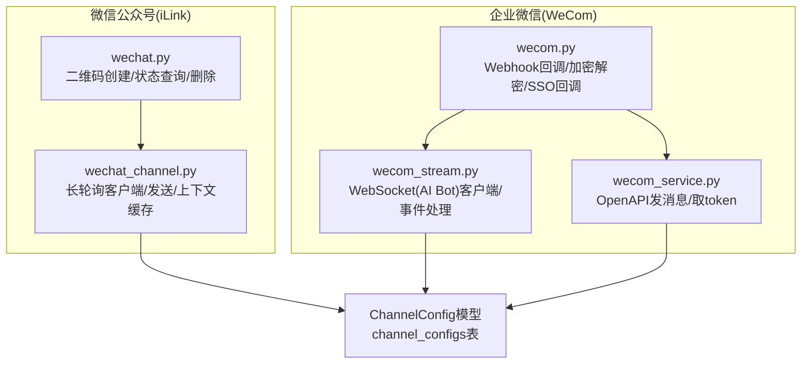
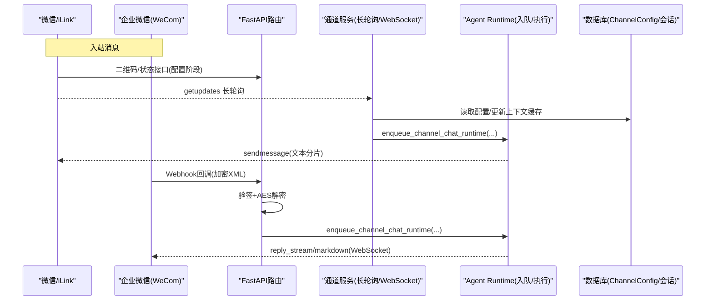
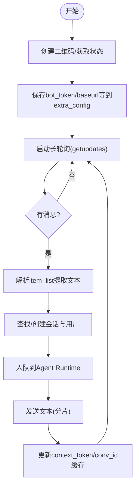
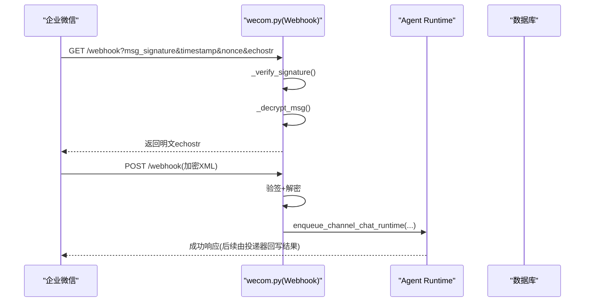
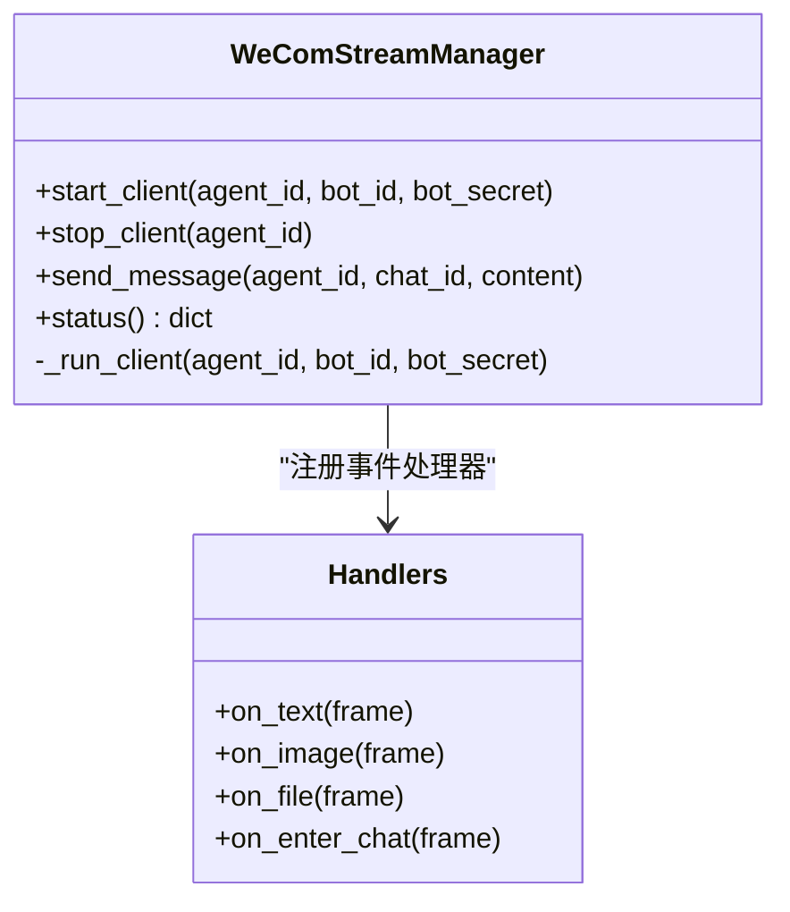
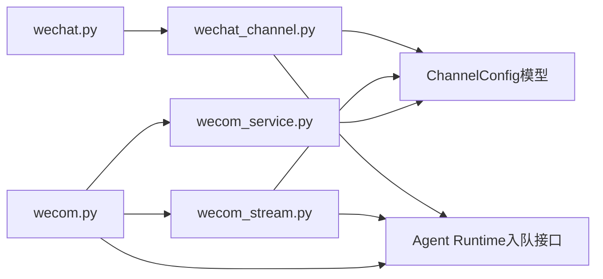

# 微信集成

<cite>
**本文引用的文件**   
- [backend/app/api/wechat.py](file://backend/app/api/wechat.py)
- [backend/app/services/wechat_channel.py](file://backend/app/services/wechat_channel.py)
- [backend/app/api/wecom.py](file://backend/app/api/wecom.py)
- [backend/app/services/wecom_stream.py](file://backend/app/services/wecom_stream.py)
- [backend/app/services/wecom_service.py](file://backend/app/services/wecom_service.py)
- [backend/app/models/channel_config.py](file://backend/app/models/channel_config.py)
- [backend/tests/test_wechat_channel_runtime.py](file://backend/tests/test_wechat_channel_runtime.py)
- [backend/tests/test_wecom_stream.py](file://backend/tests/test_wecom_stream.py)
</cite>

## 目录
1. [简介](#简介)
2. [项目结构](#项目结构)
3. [核心组件](#核心组件)
4. [架构总览](#架构总览)
5. [详细组件分析](#详细组件分析)
6. [依赖关系分析](#依赖关系分析)
7. [性能与限制](#性能与限制)
8. [故障排查指南](#故障排查指南)
9. [结论](#结论)
10. [附录：部署与配置要点](#附录部署与配置要点)

## 简介
本文件面向企业级“微信”生态的集成，覆盖微信公众号（iLink）与企业微信（WeCom）两类通道。内容包含认证授权、消息收发、用户身份映射、安全机制（签名校验、AES 加解密）、客服接口、模板/Markdown 消息、文件传输能力现状与限制，以及应用配置、服务器部署、域名绑定等完整指南。同时给出频率控制、错误处理与可观测性建议，帮助开发者快速落地并稳定运行。

## 项目结构
后端围绕 FastAPI 路由与服务模块组织，微信相关能力分为两条主线：
- 微信公众号（iLink）：基于长轮询获取消息，通过 HTTP API 发送文本；会话上下文持久化在 ChannelConfig.extra_config 中。
- 企业微信（WeCom）：支持两种模式
  - WebSocket（AI Bot）：使用 SDK 建立长连接，无需回调域名验证；适合低延迟交互。
  - Webhook（传统回调）：需要域名验证与 AES 加解密，适合已有回调基础设施的场景。

**图表来源** 
- [backend/app/api/wechat.py:1-217](file://backend/app/api/wechat.py#L1-L217)
- [backend/app/services/wechat_channel.py:1-450](file://backend/app/services/wechat_channel.py#L1-L450)
- [backend/app/api/wecom.py:1-691](file://backend/app/api/wecom.py#L1-L691)
- [backend/app/services/wecom_stream.py:1-430](file://backend/app/services/wecom_stream.py#L1-L430)
- [backend/app/services/wecom_service.py:1-87](file://backend/app/services/wecom_service.py#L1-L87)
- [backend/app/models/channel_config.py:1-52](file://backend/app/models/channel_config.py#L1-L52)

**章节来源**
- [backend/app/api/wechat.py:1-217](file://backend/app/api/wechat.py#L1-L217)
- [backend/app/services/wechat_channel.py:1-450](file://backend/app/services/wechat_channel.py#L1-L450)
- [backend/app/api/wecom.py:1-691](file://backend/app/api/wecom.py#L1-L691)
- [backend/app/services/wecom_stream.py:1-430](file://backend/app/services/wecom_stream.py#L1-L430)
- [backend/app/services/wecom_service.py:1-87](file://backend/app/services/wecom_service.py#L1-L87)
- [backend/app/models/channel_config.py:1-52](file://backend/app/models/channel_config.py#L1-L52)

## 核心组件
- 微信公众号（iLink）通道
  - 路由层：提供二维码生成、状态轮询、图片代理、通道配置读取与删除。
  - 服务层：长轮询拉取消息、解析文本、维护 context_token 与 conv_id 的映射、调用发送接口。
- 企业微信（WeCom）通道
  - Webhook 路由：回调验签、AES 解密、事件分发、客服消息同步、SSO 回调登录。
  - WebSocket（AI Bot）：SDK 长连接管理、事件处理、流式回复、欢迎语。
  - OpenAPI 工具：获取 access_token、发送文本消息（作为备用或独立场景）。

**章节来源**
- [backend/app/api/wechat.py:1-217](file://backend/app/api/wechat.py#L1-L217)
- [backend/app/services/wechat_channel.py:1-450](file://backend/app/services/wechat_channel.py#L1-L450)
- [backend/app/api/wecom.py:1-691](file://backend/app/api/wecom.py#L1-L691)
- [backend/app/services/wecom_stream.py:1-430](file://backend/app/services/wecom_stream.py#L1-L430)
- [backend/app/services/wecom_service.py:1-87](file://backend/app/services/wecom_service.py#L1-L87)

## 架构总览
下图展示从外部平台到内部运行时（Agent Runtime）的端到端流程，涵盖入站消息接入、会话/用户解析、任务入队与出站投递。

**图表来源** 
- [backend/app/api/wechat.py:54-172](file://backend/app/api/wechat.py#L54-L172)
- [backend/app/services/wechat_channel.py:74-118](file://backend/app/services/wechat_channel.py#L74-L118)
- [backend/app/api/wecom.py:347-450](file://backend/app/api/wecom.py#L347-L450)
- [backend/app/services/wecom_stream.py:125-188](file://backend/app/services/wecom_stream.py#L125-L188)

## 详细组件分析

### 微信公众号（iLink）通道
- 功能要点
  - 二维码创建与状态轮询：用于绑定 bot_token、ilink_user_id、baseurl 等。
  - 长轮询拉取消息：getupdates 接口，维护 cursor（get_updates_buf），处理 session_expired。
  - 文本发送：sendmessage 接口，按协议拆分超长文本（默认 2000 字符上限）。
  - 上下文缓存：将 from_user_id -> {context_token, conv_id} 映射持久化至 extra_config。
- 关键实现路径
  - 路由：[backend/app/api/wechat.py:54-172](file://backend/app/api/wechat.py#L54-L172)
  - 长轮询与发送：[backend/app/services/wechat_channel.py:275-449](file://backend/app/services/wechat_channel.py#L275-L449)
  - 文本分片策略：[backend/app/services/wechat_channel.py:57-72](file://backend/app/services/wechat_channel.py#L57-L72)
  - 上下文缓存读写：[backend/app/services/wechat_channel.py:120-178](file://backend/app/services/wechat_channel.py#L120-L178)

**图表来源** 
- [backend/app/api/wechat.py:80-151](file://backend/app/api/wechat.py#L80-L151)
- [backend/app/services/wechat_channel.py:330-406](file://backend/app/services/wechat_channel.py#L330-L406)

**章节来源**
- [backend/app/api/wechat.py:54-172](file://backend/app/api/wechat.py#L54-L172)
- [backend/app/services/wechat_channel.py:57-178](file://backend/app/services/wechat_channel.py#L57-L178)
- [backend/tests/test_wechat_channel_runtime.py:49-130](file://backend/tests/test_wechat_channel_runtime.py#L49-L130)

### 企业微信（WeCom）通道 — Webhook 模式
- 功能要点
  - 域名验证文件托管：为多租户提供 WW_verify_*.txt 动态返回。
  - 回调验签与解密：SHA1 签名校验 + AES-CBC 解密 XML。
  - 事件分发：文本消息直接入队；客服事件异步拉取并入库。
  - SSO 回调：根据 code 换取 token，获取用户信息后统一登录注册。
- 关键实现路径
  - 验签/解密/回调路由：[backend/app/api/wecom.py:87-91](file://backend/app/api/wecom.py#L87-L91), [backend/app/api/wecom.py:347-450](file://backend/app/api/wecom.py#L347-L450)
  - 域名验证文件：[backend/app/api/wecom.py:111-148](file://backend/app/api/wecom.py#L111-L148)
  - 客服消息同步：[backend/app/api/wecom.py:453-518](file://backend/app/api/wecom.py#L453-L518)
  - SSO 回调：[backend/app/api/wecom.py:606-691](file://backend/app/api/wecom.py#L606-L691)

**图表来源** 
- [backend/app/api/wecom.py:309-345](file://backend/app/api/wecom.py#L309-L345)
- [backend/app/api/wecom.py:347-450](file://backend/app/api/wecom.py#L347-L450)

**章节来源**
- [backend/app/api/wecom.py:87-91](file://backend/app/api/wecom.py#L87-L91)
- [backend/app/api/wecom.py:111-148](file://backend/app/api/wecom.py#L111-L148)
- [backend/app/api/wecom.py:347-450](file://backend/app/api/wecom.py#L347-L450)
- [backend/app/api/wecom.py:453-518](file://backend/app/api/wecom.py#L453-L518)
- [backend/app/api/wecom.py:606-691](file://backend/app/api/wecom.py#L606-L691)

### 企业微信（WeCom）通道 — WebSocket（AI Bot）模式
- 功能要点
  - 长连接管理：自动重连、心跳、断线恢复。
  - 事件处理：文本/图片/文件/进入聊天事件；文本消息入队并流式回复。
  - 主动推送：通过已连接客户端向 chat_id 发送 Markdown 消息。
- 关键实现路径
  - 客户端管理与事件处理：[backend/app/services/wecom_stream.py:65-283](file://backend/app/services/wecom_stream.py#L65-L283)
  - 文本处理与入队：[backend/app/services/wecom_stream.py:352-426](file://backend/app/services/wecom_stream.py#L352-L426)
  - 主动发送：[backend/app/services/wecom_stream.py:298-314](file://backend/app/services/wecom_stream.py#L298-L314)

**图表来源** 
- [backend/app/services/wecom_stream.py:65-283](file://backend/app/services/wecom_stream.py#L65-L283)
- [backend/app/services/wecom_stream.py:298-314](file://backend/app/services/wecom_stream.py#L298-L314)

**章节来源**
- [backend/app/services/wecom_stream.py:65-283](file://backend/app/services/wecom_stream.py#L65-L283)
- [backend/app/services/wecom_stream.py:352-426](file://backend/app/services/wecom_stream.py#L352-L426)
- [backend/tests/test_wecom_stream.py:1-64](file://backend/tests/test_wecom_stream.py#L1-L64)

### 企业微信（WeCom）OpenAPI 工具
- 功能要点
  - 获取 access_token：corp_id + corpsecret。
  - 发送文本消息：touser + agentid + text.content。
- 关键实现路径
  - [backend/app/services/wecom_service.py:7-87](file://backend/app/services/wecom_service.py#L7-L87)

**章节来源**
- [backend/app/services/wecom_service.py:7-87](file://backend/app/services/wecom_service.py#L7-L87)

### 数据模型与配置存储
- ChannelConfig 表承载各通道凭证与状态，微信/企微均复用该模型，通过 channel_type 区分。
- extra_config 字段用于扩展存储（如 iLink 的 baseurl、bot_token、route_tag、get_updates_buf、session_expired；WeCom 的 bot_id/bot_secret/connection_mode 等）。

**章节来源**
- [backend/app/models/channel_config.py:13-52](file://backend/app/models/channel_config.py#L13-L52)

## 依赖关系分析
- 路由层依赖服务层进行业务编排，服务层依赖数据库访问与第三方平台 API。
- WeChat 通道依赖 httpx 发起 HTTP 请求，WeCom 通道依赖 wecom-aibot-sdk-python 的 WSClient。
- 两者都通过统一的 Agent Runtime 入队接口完成消息处理与结果投递。

**图表来源** 
- [backend/app/api/wechat.py:1-217](file://backend/app/api/wechat.py#L1-L217)
- [backend/app/services/wechat_channel.py:1-450](file://backend/app/services/wechat_channel.py#L1-L450)
- [backend/app/api/wecom.py:1-691](file://backend/app/api/wecom.py#L1-L691)
- [backend/app/services/wecom_stream.py:1-430](file://backend/app/services/wecom_stream.py#L1-L430)
- [backend/app/services/wecom_service.py:1-87](file://backend/app/services/wecom_service.py#L1-L87)
- [backend/app/models/channel_config.py:1-52](file://backend/app/models/channel_config.py#L1-L52)

**章节来源**
- [backend/app/api/wechat.py:1-217](file://backend/app/api/wechat.py#L1-L217)
- [backend/app/services/wechat_channel.py:1-450](file://backend/app/services/wechat_channel.py#L1-L450)
- [backend/app/api/wecom.py:1-691](file://backend/app/api/wecom.py#L1-L691)
- [backend/app/services/wecom_stream.py:1-430](file://backend/app/services/wecom_stream.py#L1-L430)
- [backend/app/services/wecom_service.py:1-87](file://backend/app/services/wecom_service.py#L1-L87)
- [backend/app/models/channel_config.py:1-52](file://backend/app/models/channel_config.py#L1-L52)

## 性能与限制
- 微信公众号（iLink）
  - 文本长度限制：单条 2000 字符，超出需分片发送（见 split_wechat_text）。
  - 长轮询超时与重试：getupdates 超时 40s，失败指数退避；session_expired 时清理游标并重试。
  - 上下文缓存上限：最多保留 100 个 from_user_id 的上下文条目，按更新时间淘汰。
- 企业微信（WeCom）
  - WebSocket 模式：无限重连、心跳 30s，断线指数退避（最大 120s）。
  - Webhook 模式：内存去重集合限制（约 1000 条），避免重复处理。
  - 客服消息同步：分页拉取，超过 24 小时的消息丢弃，减少无效负载。
- 通用
  - 所有出站调用均设置合理超时（httpx AsyncClient timeout），避免阻塞。
  - 日志记录关键节点（连接、错误、重试、异常堆栈），便于定位问题。

**章节来源**
- [backend/app/services/wechat_channel.py:57-72](file://backend/app/services/wechat_channel.py#L57-L72)
- [backend/app/services/wechat_channel.py:330-406](file://backend/app/services/wechat_channel.py#L330-L406)
- [backend/app/services/wecom_stream.py:242-266](file://backend/app/services/wecom_stream.py#L242-L266)
- [backend/app/api/wecom.py:410-436](file://backend/app/api/wecom.py#L410-L436)
- [backend/app/api/wecom.py:475-518](file://backend/app/api/wecom.py#L475-L518)

## 故障排查指南
- 常见问题与定位
  - 签名不匹配：检查 token、timestamp、nonce、encrypt 参数顺序与大小写；核对 _verify_signature 实现。
  - 解密失败：确认 encoding_aes_key 是否正确（Base64 解码补 "="），AES CBC IV 与填充一致。
  - 长轮询无消息：检查 get_updates_buf 游标是否更新；关注 session_expired 标志位。
  - WebSocket 断线：查看重连日志与退避间隔；确认网络代理是否影响（SDK 已强制禁用代理）。
  - 客服消息未同步：检查 next_cursor 与 has_more；确认时间过滤逻辑（>24h 丢弃）。
- 诊断步骤
  - 打开对应模块日志（[wechat_channel.py:330-406](file://backend/app/services/wechat_channel.py#L330-L406)、[wecom_stream.py:242-266](file://backend/app/services/wecom_stream.py#L242-L266)、[wecom.py:347-450](file://backend/app/api/wecom.py#L347-L450)）。
  - 检查 ChannelConfig 的 is_configured/is_connected 与 extra_config 关键字段。
  - 复现最小用例：仅发送短文本，逐步增加复杂度（图片/文件/群聊）。

**章节来源**
- [backend/app/api/wecom.py:347-450](file://backend/app/api/wecom.py#L347-L450)
- [backend/app/services/wechat_channel.py:330-406](file://backend/app/services/wechat_channel.py#L330-L406)
- [backend/app/services/wecom_stream.py:242-266](file://backend/app/services/wecom_stream.py#L242-L266)

## 结论
本项目对微信公众号与企业微信提供了双通道、双模式的集成方案：公众号以长轮询为主，企业微信支持 WebSocket 与 Webhook 两种模式。通过统一的运行时入队与投递机制，实现了跨渠道一致的会话与用户管理。安全方面采用签名校验与 AES 加解密，稳定性方面具备重连、退避、超时与日志可观测性。建议在部署时严格遵循域名绑定与回调配置要求，并结合限流与监控提升系统韧性。

## 附录：部署与配置要点
- 微信公众号（iLink）
  - 通过前端触发二维码绑定流程，成功后保存 bot_token、baseurl、route_tag 等。
  - 启动长轮询管理器，确保 get_updates_buf 正确持久化与恢复。
- 企业微信（WeCom）
  - WebSocket 模式：配置 bot_id 与 bot_secret，无需回调域名；启动后自动连接。
  - Webhook 模式：配置 corp_id、secret、token、encoding_aes_key；在 Nginx 根路径下转发 WW_verify_*.txt 到后端。
  - 如需客服消息同步，确保 access_token 可用且权限正确。
- 安全与合规
  - 回调 URL 必须启用 HTTPS，校验签名后再解密。
  - 敏感密钥（app_secret、encoding_aes_key、bot_secret）应存储在受保护的环境变量或密钥管理系统中。
- 监控与告警
  - 关注连接状态（is_connected）、重连次数、错误码分布、消息吞吐与延迟。
  - 对 session_expired、signature mismatch、HTTP 4xx/5xx 等关键错误设置告警。

**章节来源**
- [backend/app/api/wechat.py:54-172](file://backend/app/api/wechat.py#L54-L172)
- [backend/app/services/wechat_channel.py:330-406](file://backend/app/services/wechat_channel.py#L330-L406)
- [backend/app/api/wecom.py:111-148](file://backend/app/api/wecom.py#L111-L148)
- [backend/app/services/wecom_stream.py:65-283](file://backend/app/services/wecom_stream.py#L65-L283)