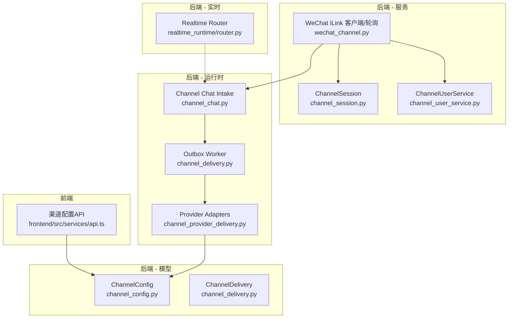
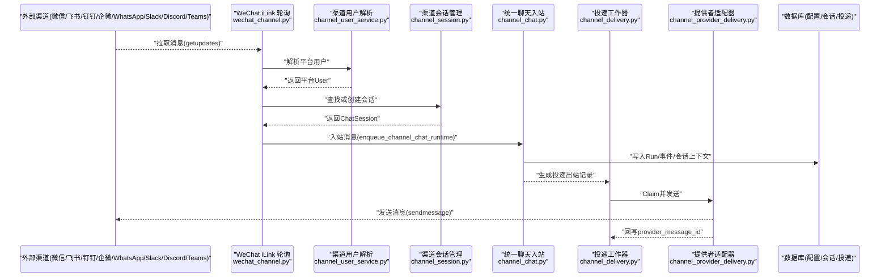
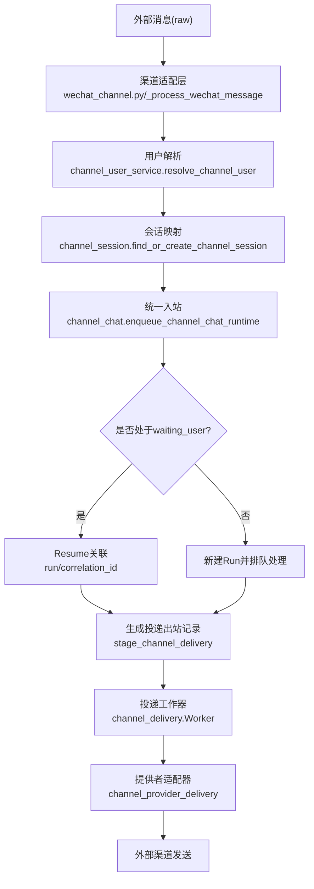
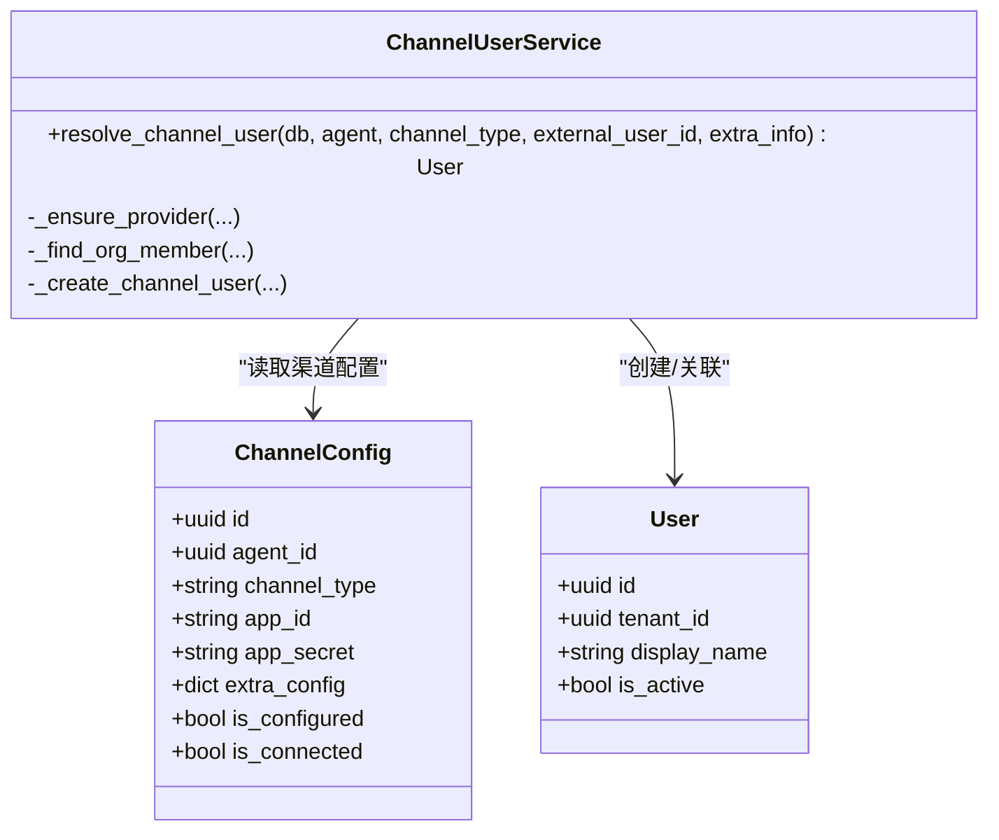
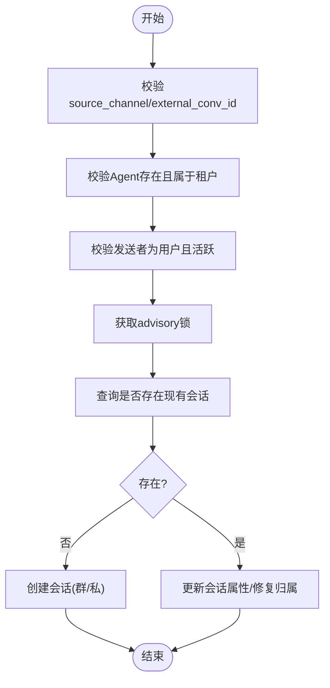
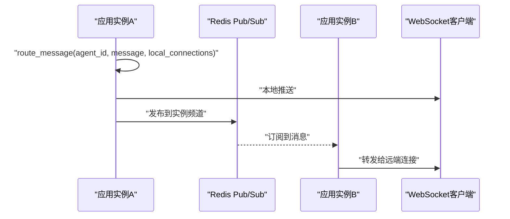
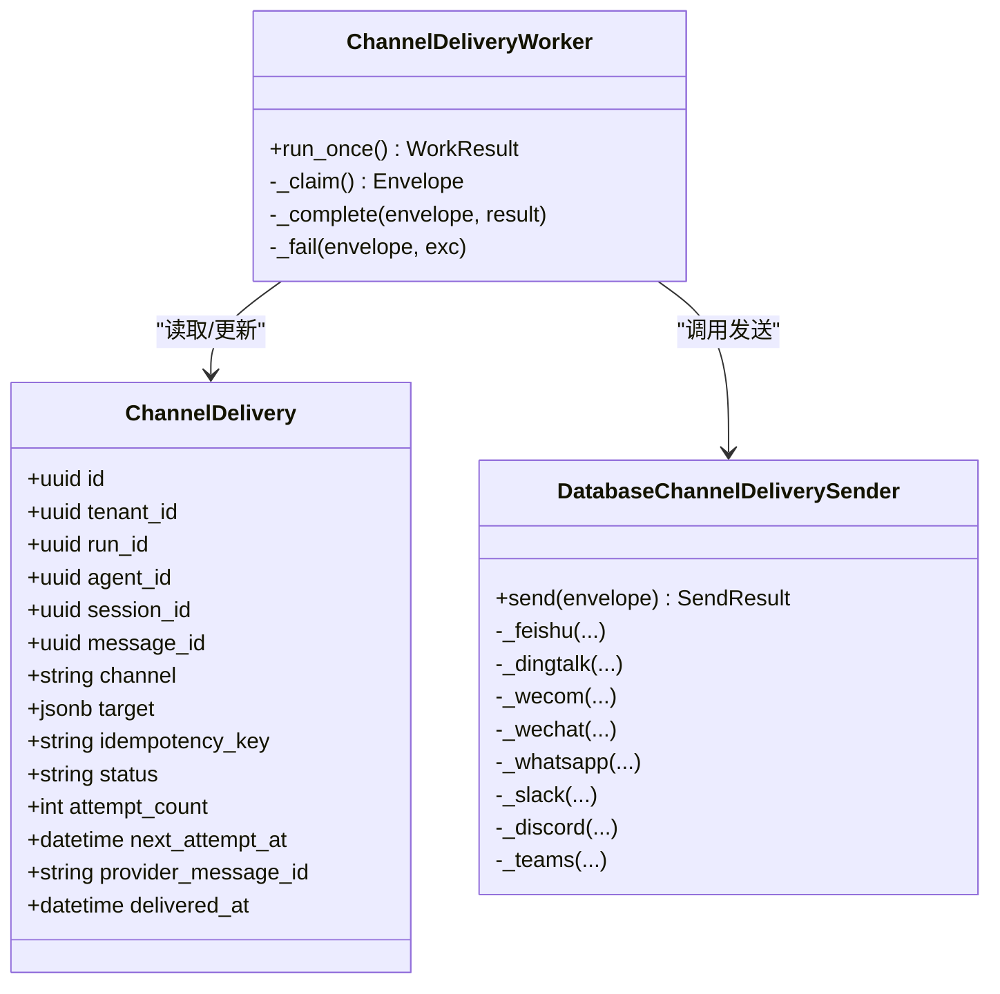
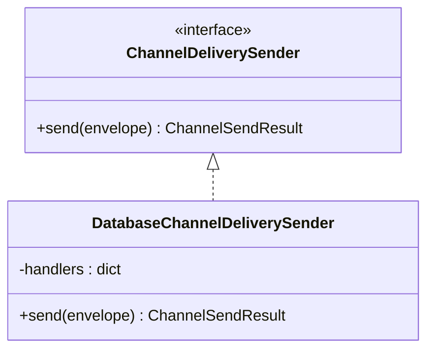
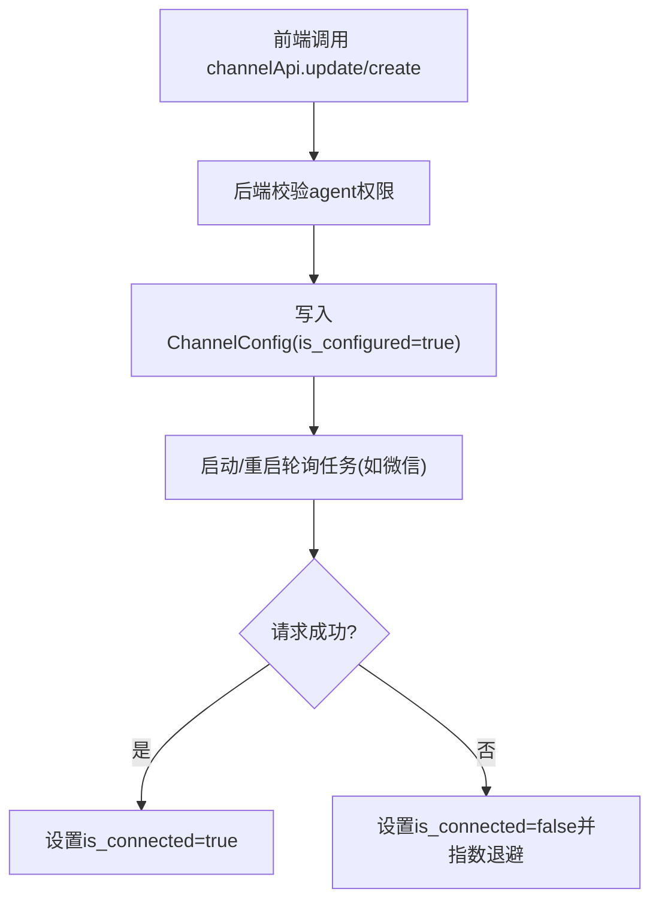
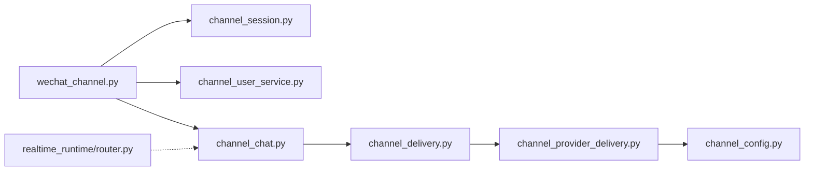

# 渠道架构设计

<cite>
**本文引用的文件**
- [backend/app/models/channel_config.py](file://backend/app/models/channel_config.py)
- [backend/app/models/channel_delivery.py](file://backend/app/models/channel_delivery.py)
- [backend/app/services/channel_session.py](file://backend/app/services/channel_session.py)
- [backend/app/services/channel_user_service.py](file://backend/app/services/channel_user_service.py)
- [backend/app/services/wechat_channel.py](file://backend/app/services/wechat_channel.py)
- [backend/app/services/agent_runtime/channel_chat.py](file://backend/app/services/agent_runtime/channel_chat.py)
- [backend/app/services/agent_runtime/channel_delivery.py](file://backend/app/services/agent_runtime/channel_delivery.py)
- [backend/app/services/agent_runtime/channel_provider_delivery.py](file://backend/app/services/agent_runtime/channel_provider_delivery.py)
- [backend/app/services/realtime_runtime/router.py](file://backend/app/services/realtime_runtime/router.py)
- [frontend/src/services/api.ts](file://frontend/src/services/api.ts)
</cite>

## 目录
1. [简介](#简介)
2. [项目结构](#项目结构)
3. [核心组件](#核心组件)
4. [架构总览](#架构总览)
5. [详细组件分析](#详细组件分析)
6. [依赖关系分析](#依赖关系分析)
7. [性能考量](#性能考量)
8. [故障排查指南](#故障排查指南)
9. [结论](#结论)
10. [附录](#附录)

## 简介
本文件系统化阐述 Clawith 的“统一渠道接入”架构，覆盖统一的渠道接入接口、消息格式转换机制、认证授权流程、会话管理、实时通信协议、消息路由策略、配置管理、连接状态监控、故障恢复与负载均衡。同时给出适配器抽象层、插件化架构与扩展点定义，并配以架构图和数据流图，帮助读者快速理解各组件交互关系。

## 项目结构
后端围绕“渠道模型 + 渠道服务 + 运行时通道 + 持久化投递”分层组织：
- 数据模型层：渠道配置、投递出站表等
- 服务层：渠道用户解析、渠道会话管理、具体渠道实现（如微信）
- 运行时层：统一聊天入站、投递工作器、提供者适配器
- 实时层：基于 Redis 的 WebSocket 跨实例路由
- 前端：渠道配置的 API 封装

**图表来源**
- [frontend/src/services/api.ts:375-391](file://frontend/src/services/api.ts#L375-L391)
- [backend/app/models/channel_config.py:13-52](file://backend/app/models/channel_config.py#L13-L52)
- [backend/app/models/channel_delivery.py:26-169](file://backend/app/models/channel_delivery.py#L26-L169)
- [backend/app/services/channel_session.py:24-184](file://backend/app/services/channel_session.py#L24-L184)
- [backend/app/services/channel_user_service.py:27-208](file://backend/app/services/channel_user_service.py#L27-L208)
- [backend/app/services/wechat_channel.py:275-450](file://backend/app/services/wechat_channel.py#L275-L450)
- [backend/app/services/agent_runtime/channel_chat.py:104-155](file://backend/app/services/agent_runtime/channel_chat.py#L104-L155)
- [backend/app/services/agent_runtime/channel_delivery.py:192-416](file://backend/app/services/agent_runtime/channel_delivery.py#L192-L416)
- [backend/app/services/agent_runtime/channel_provider_delivery.py:57-102](file://backend/app/services/agent_runtime/channel_provider_delivery.py#L57-L102)
- [backend/app/services/realtime_runtime/router.py:21-119](file://backend/app/services/realtime_runtime/router.py#L21-L119)

**章节来源**
- [frontend/src/services/api.ts:375-391](file://frontend/src/services/api.ts#L375-L391)
- [backend/app/models/channel_config.py:13-52](file://backend/app/models/channel_config.py#L13-L52)
- [backend/app/models/channel_delivery.py:26-169](file://backend/app/models/channel_delivery.py#L26-L169)

## 核心组件
- 渠道配置模型 ChannelConfig：存储各渠道凭据、连接状态与扩展字段
- 渠道会话管理 ChannelSession：统一外部会话到内部 ChatSession 的映射与创建
- 渠道用户解析 ChannelUserService：将平台用户映射为平台 User，支持懒注册与去重
- 渠道入站 Channel Chat Intake：将外部消息原子地挂接到运行中的或等待中的 Agent Run
- 投递出站 Outbox Worker：从 channel_deliveries 出队、重试、幂等发送
- 提供者适配器 Provider Adapters：按渠道分派的具体发送实现
- 实时路由 Realtime Router：Redis Pub/Sub 驱动的跨实例 WebSocket 分发

**章节来源**
- [backend/app/models/channel_config.py:13-52](file://backend/app/models/channel_config.py#L13-L52)
- [backend/app/services/channel_session.py:24-184](file://backend/app/services/channel_session.py#L24-L184)
- [backend/app/services/channel_user_service.py:27-208](file://backend/app/services/channel_user_service.py#L27-L208)
- [backend/app/services/agent_runtime/channel_chat.py:104-155](file://backend/app/services/agent_runtime/channel_chat.py#L104-L155)
- [backend/app/services/agent_runtime/channel_delivery.py:192-416](file://backend/app/services/agent_runtime/channel_delivery.py#L192-L416)
- [backend/app/services/agent_runtime/channel_provider_delivery.py:57-102](file://backend/app/services/agent_runtime/channel_provider_delivery.py#L57-L102)
- [backend/app/services/realtime_runtime/router.py:21-119](file://backend/app/services/realtime_runtime/router.py#L21-L119)

## 架构总览
下图展示从外部渠道到内部运行时，再到外部渠道回复的端到端数据流。

**图表来源**
- [backend/app/services/wechat_channel.py:190-273](file://backend/app/services/wechat_channel.py#L190-L273)
- [backend/app/services/channel_user_service.py:73-208](file://backend/app/services/channel_user_service.py#L73-L208)
- [backend/app/services/channel_session.py:24-184](file://backend/app/services/channel_session.py#L24-L184)
- [backend/app/services/agent_runtime/channel_chat.py:104-155](file://backend/app/services/agent_runtime/channel_chat.py#L104-L155)
- [backend/app/services/agent_runtime/channel_delivery.py:192-416](file://backend/app/services/agent_runtime/channel_delivery.py#L192-L416)
- [backend/app/services/agent_runtime/channel_provider_delivery.py:84-102](file://backend/app/services/agent_runtime/channel_provider_delivery.py#L84-L102)

## 详细组件分析

### 统一渠道接入接口与消息格式转换
- 统一入口：不同渠道通过各自的接入模块（以微信为例）拉取或接收消息，统一转换为内部结构后进入 channel_chat 入站
- 消息ID映射：使用 channel_message_id 将外部事件ID映射为幂等的 ChatMessage ID
- 内容转换：按渠道限制进行文本切分与格式化（如微信 2000 字符限制）
- 目标路由：在运行时中通过 delivery_target.channel_delivery 指定渠道与目标

**图表来源**
- [backend/app/services/wechat_channel.py:190-273](file://backend/app/services/wechat_channel.py#L190-L273)
- [backend/app/services/channel_user_service.py:73-208](file://backend/app/services/channel_user_service.py#L73-L208)
- [backend/app/services/channel_session.py:24-184](file://backend/app/services/channel_session.py#L24-L184)
- [backend/app/services/agent_runtime/channel_chat.py:34-155](file://backend/app/services/agent_runtime/channel_chat.py#L34-L155)
- [backend/app/services/agent_runtime/channel_delivery.py:143-175](file://backend/app/services/agent_runtime/channel_delivery.py#L143-L175)
- [backend/app/services/agent_runtime/channel_provider_delivery.py:84-102](file://backend/app/services/agent_runtime/channel_provider_delivery.py#L84-L102)

**章节来源**
- [backend/app/services/agent_runtime/channel_chat.py:34-155](file://backend/app/services/agent_runtime/channel_chat.py#L34-L155)
- [backend/app/services/wechat_channel.py:190-273](file://backend/app/services/wechat_channel.py#L190-L273)

### 认证授权流程
- 渠道凭据：ChannelConfig 存储 app_id/app_secret/extra_config，is_configured/is_connected 标记配置与连接状态
- 平台用户识别：ChannelUserService 通过 unionid/open_id/external_id/email/mobile 等多维度匹配，避免重复用户
- 租户隔离：所有查询与写入均基于 tenant_id，确保多租户安全
- 鉴权前置：前端通过 /agents/{agentId}/channel 系列接口操作配置，后端校验 agent 访问权限

**图表来源**
- [backend/app/models/channel_config.py:13-52](file://backend/app/models/channel_config.py#L13-L52)
- [backend/app/services/channel_user_service.py:27-208](file://backend/app/services/channel_user_service.py#L27-L208)

**章节来源**
- [backend/app/models/channel_config.py:13-52](file://backend/app/models/channel_config.py#L13-L52)
- [backend/app/services/channel_user_service.py:27-208](file://backend/app/services/channel_user_service.py#L27-L208)
- [frontend/src/services/api.ts:375-391](file://frontend/src/services/api.ts#L375-L391)

### 渠道会话管理
- 唯一性约束：基于 (tenant_id, agent_id, external_conv_id) 保证同一外部会话只对应一个内部 ChatSession
- 群聊/私聊区分：is_group/group_name 等字段区分会话类型
- 并发控制：使用 advisory lock 防止竞态条件导致重复创建
- 修复历史：对旧会话进行 user_id 归属修正与 group_name 更新

**图表来源**
- [backend/app/services/channel_session.py:24-184](file://backend/app/services/channel_session.py#L24-L184)

**章节来源**
- [backend/app/services/channel_session.py:24-184](file://backend/app/services/channel_session.py#L24-L184)

### 实时通信协议与跨实例路由
- 本地推送：根据 session_id/user_id 过滤本地 WebSocket 连接并推送
- 跨实例转发：通过 Redis Pub/Sub 广播消息，其他实例订阅后转发给对应连接
- 心跳与存在性：维护实例级 presence，TTL 过期自动清理

**图表来源**
- [backend/app/services/realtime_runtime/router.py:21-119](file://backend/app/services/realtime_runtime/router.py#L21-L119)

**章节来源**
- [backend/app/services/realtime_runtime/router.py:21-119](file://backend/app/services/realtime_runtime/router.py#L21-L119)

### 消息路由策略与投递出站
- 路由构建：build_channel_delivery_route 校验 channel/target 合法性
- 出站登记：stage_channel_delivery 在同一事务中写入投递记录，保证幂等
- 工作器：Worker 以 with_for_update(skip_locked=True) 抢占式领取任务，失败指数退避重试
- 结果回写：成功时记录 provider_message_id，失败时记录错误码与错误信息

**图表来源**
- [backend/app/models/channel_delivery.py:26-169](file://backend/app/models/channel_delivery.py#L26-L169)
- [backend/app/services/agent_runtime/channel_delivery.py:192-416](file://backend/app/services/agent_runtime/channel_delivery.py#L192-L416)
- [backend/app/services/agent_runtime/channel_provider_delivery.py:57-102](file://backend/app/services/agent_runtime/channel_provider_delivery.py#L57-L102)

**章节来源**
- [backend/app/models/channel_delivery.py:26-169](file://backend/app/models/channel_delivery.py#L26-L169)
- [backend/app/services/agent_runtime/channel_delivery.py:192-416](file://backend/app/services/agent_runtime/channel_delivery.py#L192-L416)
- [backend/app/services/agent_runtime/channel_provider_delivery.py:57-102](file://backend/app/services/agent_runtime/channel_provider_delivery.py#L57-L102)

### 渠道适配器抽象层与插件化扩展
- 抽象协议：ChannelDeliverySender.send(envelope) -> ChannelSendResult
- 分派器：DatabaseChannelDeliverySender 根据 envelope.channel 选择具体处理器
- 扩展点：新增渠道只需实现 _xxx 方法并在 handlers 字典注册
- 幂等与重试：outbox 表 + idempotency_key + 指数退避

**图表来源**
- [backend/app/services/agent_runtime/channel_delivery.py:75-106](file://backend/app/services/agent_runtime/channel_delivery.py#L75-L106)
- [backend/app/services/agent_runtime/channel_provider_delivery.py:57-102](file://backend/app/services/agent_runtime/channel_provider_delivery.py#L57-L102)

**章节来源**
- [backend/app/services/agent_runtime/channel_delivery.py:75-106](file://backend/app/services/agent_runtime/channel_delivery.py#L75-L106)
- [backend/app/services/agent_runtime/channel_provider_delivery.py:57-102](file://backend/app/services/agent_runtime/channel_provider_delivery.py#L57-L102)

### 渠道配置管理与连接状态监控
- 配置项：app_id/app_secret/extra_config（含 bot_token/baseurl/route_tag 等）
- 连接状态：is_connected 由轮询器在成功/失败时更新
- 前端接口：GET/POST/PUT/DELETE 与 webhook-url 获取回调地址

**图表来源**
- [frontend/src/services/api.ts:375-391](file://frontend/src/services/api.ts#L375-L391)
- [backend/app/models/channel_config.py:13-52](file://backend/app/models/channel_config.py#L13-L52)
- [backend/app/services/wechat_channel.py:330-384](file://backend/app/services/wechat_channel.py#L330-L384)

**章节来源**
- [frontend/src/services/api.ts:375-391](file://frontend/src/services/api.ts#L375-L391)
- [backend/app/models/channel_config.py:13-52](file://backend/app/models/channel_config.py#L13-L52)
- [backend/app/services/wechat_channel.py:330-384](file://backend/app/services/wechat_channel.py#L330-L384)

### 故障恢复与负载均衡
- 故障恢复：Outbox 表持久化投递任务，失败自动重试；claim_expires_at 防死锁
- 负载均衡：skip_locked 并行领取任务；实例间通过 Redis Pub/Sub 协作
- 幂等保障：idempotency_key + uuid5 生成稳定 delivery_id/message_id

**章节来源**
- [backend/app/services/agent_runtime/channel_delivery.py:213-276](file://backend/app/services/agent_runtime/channel_delivery.py#L213-L276)
- [backend/app/services/realtime_runtime/router.py:85-119](file://backend/app/services/realtime_runtime/router.py#L85-L119)

## 依赖关系分析
- 低耦合：渠道适配器通过 Protocol 解耦，新增渠道无需改动核心逻辑
- 高内聚：每个渠道的实现集中在各自文件中，便于维护
- 外部依赖：httpx 用于 HTTP 调用；SQLAlchemy 异步会话；Redis 用于实时路由

**图表来源**
- [backend/app/services/wechat_channel.py:190-273](file://backend/app/services/wechat_channel.py#L190-L273)
- [backend/app/services/channel_session.py:24-184](file://backend/app/services/channel_session.py#L24-L184)
- [backend/app/services/channel_user_service.py:27-208](file://backend/app/services/channel_user_service.py#L27-L208)
- [backend/app/services/agent_runtime/channel_chat.py:104-155](file://backend/app/services/agent_runtime/channel_chat.py#L104-L155)
- [backend/app/services/agent_runtime/channel_delivery.py:192-416](file://backend/app/services/agent_runtime/channel_delivery.py#L192-L416)
- [backend/app/services/agent_runtime/channel_provider_delivery.py:57-102](file://backend/app/services/agent_runtime/channel_provider_delivery.py#L57-L102)
- [backend/app/models/channel_config.py:13-52](file://backend/app/models/channel_config.py#L13-L52)
- [backend/app/services/realtime_runtime/router.py:21-119](file://backend/app/services/realtime_runtime/router.py#L21-L119)

**章节来源**
- [backend/app/services/wechat_channel.py:190-273](file://backend/app/services/wechat_channel.py#L190-L273)
- [backend/app/services/agent_runtime/channel_provider_delivery.py:57-102](file://backend/app/services/agent_runtime/channel_provider_delivery.py#L57-L102)

## 性能考量
- 数据库索引：channel_deliveries 针对 pending/due 建立复合索引，提升领取效率
- 并发控制：advisory lock 与 skip_locked 避免竞争与重复处理
- 网络超时：httpx 客户端设置合理超时，避免长尾阻塞
- 文本切分：按渠道限制切分消息，减少单次负载过大

[本节为通用指导，不直接分析具体文件]

## 故障排查指南
- 渠道未配置：检查 ChannelConfig.is_configured 与凭据字段
- 连接异常：查看 is_connected 与日志中的轮询错误码
- 投递失败：检查 channel_deliveries.status/attempt_count/last_error_code
- 用户解析失败：确认 unionid/open_id/external_id 是否正确，邮箱/手机是否可匹配
- 会话冲突：核对 (agent_id, external_conv_id) 唯一性与会话类型一致性

**章节来源**
- [backend/app/models/channel_config.py:13-52](file://backend/app/models/channel_config.py#L13-L52)
- [backend/app/models/channel_delivery.py:26-169](file://backend/app/models/channel_delivery.py#L26-L169)
- [backend/app/services/channel_user_service.py:27-208](file://backend/app/services/channel_user_service.py#L27-L208)
- [backend/app/services/channel_session.py:24-184](file://backend/app/services/channel_session.py#L24-L184)
- [backend/app/services/wechat_channel.py:330-384](file://backend/app/services/wechat_channel.py#L330-L384)

## 结论
Clawith 的渠道架构通过“统一入站 + 持久化出站 + 适配器分派”的设计，实现了多渠道接入的高内聚与低耦合。结合会话与用户解析、实时路由与幂等重试，系统具备可扩展、可观测与高可用的特性。新增渠道仅需实现适配器并注册分派器，即可无缝融入整体链路。

[本节为总结性内容，不直接分析具体文件]

## 附录
- 前端渠道配置 API 路径参考：/agents/{agentId}/channel
- 支持的渠道枚举：feishu、dingtalk、wecom、wechat、whatsapp、slack、discord、microsoft_teams

**章节来源**
- [frontend/src/services/api.ts:375-391](file://frontend/src/services/api.ts#L375-L391)
- [backend/app/models/channel_config.py:20-26](file://backend/app/models/channel_config.py#L20-L26)
- [backend/app/models/channel_delivery.py:36-44](file://backend/app/models/channel_delivery.py#L36-L44)