# 渠道集成

<cite>
**本文档引用的文件**   
- [channel_config.py](file://backend/app/models/channel_config.py)
- [channel_session.py](file://backend/app/services/channel_session.py)
- [feishu_service.py](file://backend/app/services/feishu_service.py)
- [dingtalk_service.py](file://backend/app/services/dingtalk_service.py)
- [wechat_channel.py](file://backend/app/services/wechat_channel.py)
- [discord_gateway.py](file://backend/app/services/discord_gateway.py)
- [slack.py](file://backend/app/api/slack.py)
- [channel_user_service.py](file://backend/app/services/channel_user_service.py)
- [channel_chat.py](file://backend/app/services/agent_runtime/channel_chat.py)
- [channel_delivery.py](file://backend/app/services/agent_runtime/channel_delivery.py)
- [channel_provider_delivery.py](file://backend/app/services/agent_runtime/channel_provider_delivery.py)
</cite>

## 目录
1. [简介](#简介)
2. [项目结构](#项目结构)
3. [核心组件](#核心组件)
4. [架构总览](#架构总览)
5. [详细组件分析](#详细组件分析)
6. [依赖关系分析](#依赖关系分析)
7. [性能考虑](#性能考虑)
8. [故障排查指南](#故障排查指南)
9. [结论](#结论)
10. [附录：自定义渠道适配器开发指南](#附录自定义渠道适配器开发指南)

## 简介
本文件系统化梳理 Clawith 的多渠道 IM 集成实现，覆盖飞书、钉钉、微信、Slack、Discord 等平台的接入方式与统一抽象。文档重点说明：
- 统一的渠道接入接口设计与消息格式转换
- 认证授权机制（OAuth、App Token、Webhook、Gateway）
- 实时消息处理流程（长轮询/WebSocket/Gateway）
- 文件传输与上下文缓存
- 用户身份映射与租户隔离
- 渠道配置管理、连接状态监控与故障恢复策略
- 自定义渠道适配器的接口规范、错误处理与扩展点

## 项目结构
后端围绕“渠道模型 + 渠道会话 + 渠道用户服务 + 各平台服务 + 运行时通道”的层次组织：
- 数据模型层：ChannelConfig 存储各渠道的配置与连接状态
- 会话层：ChannelSession 负责跨渠道会话的统一创建与复用
- 用户解析：ChannelUserService 将外部平台用户映射到平台用户
- 平台服务：FeishuService、DingTalk Service、WeChat iLink、Discord Gateway、Slack Webhook
- 运行时通道：Channel Chat Intake 与 Channel Delivery Outbox 保障可靠投递

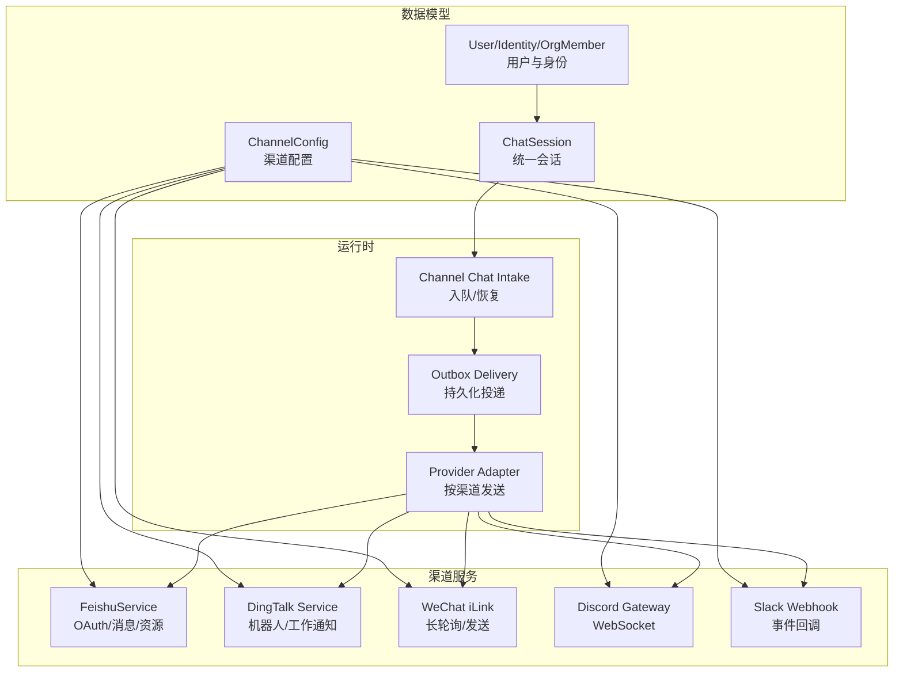

图表来源
- [channel_config.py:1-52](file://backend/app/models/channel_config.py#L1-L52)
- [channel_session.py:1-184](file://backend/app/services/channel_session.py#L1-L184)
- [channel_user_service.py:1-641](file://backend/app/services/channel_user_service.py#L1-L641)
- [feishu_service.py:1-800](file://backend/app/services/feishu_service.py#L1-L800)
- [dingtalk_service.py:1-175](file://backend/app/services/dingtalk_service.py#L1-L175)
- [wechat_channel.py:1-450](file://backend/app/services/wechat_channel.py#L1-L450)
- [discord_gateway.py:1-282](file://backend/app/services/discord_gateway.py#L1-L282)
- [slack.py:1-368](file://backend/app/api/slack.py#L1-L368)
- [channel_chat.py:1-162](file://backend/app/services/agent_runtime/channel_chat.py#L1-L162)
- [channel_delivery.py:1-275](file://backend/app/services/agent_runtime/channel_delivery.py#L1-L275)
- [channel_provider_delivery.py:1-130](file://backend/app/services/agent_runtime/channel_provider_delivery.py#L1-L130)

章节来源
- [channel_config.py:1-52](file://backend/app/models/channel_config.py#L1-L52)
- [channel_session.py:1-184](file://backend/app/services/channel_session.py#L1-L184)

## 核心组件
- 渠道配置 ChannelConfig：记录 agent_id、channel_type、app_id/app_secret/encrypt_key、is_configured/is_connected、extra_config 等，支持多类型枚举与扩展字段
- 渠道会话 ChannelSession：基于 (agent_id, external_conv_id) 唯一约束，区分单聊/群聊，维护 source_channel、group_name、is_primary 等
- 渠道用户服务 ChannelUserService：通过 OrgMember/Identity/User 三级映射，支持邮箱/手机号匹配与懒注册，保证租户隔离与去重
- 渠道运行时通道 Channel Chat Intake：将外部消息原子地入队或恢复到等待中的 Run，生成幂等的 channel_message_id
- 渠道投递 Outbox：stage_channel_delivery 写入投递任务，按指数退避重试，失败安全记录；Provider Adapter 按渠道发送并回写 provider_message_id

章节来源
- [channel_config.py:1-52](file://backend/app/models/channel_config.py#L1-L52)
- [channel_session.py:1-184](file://backend/app/services/channel_session.py#L1-L184)
- [channel_user_service.py:1-641](file://backend/app/services/channel_user_service.py#L1-L641)
- [channel_chat.py:1-162](file://backend/app/services/agent_runtime/channel_chat.py#L1-L162)
- [channel_delivery.py:1-275](file://backend/app/services/agent_runtime/channel_delivery.py#L1-L275)
- [channel_provider_delivery.py:1-130](file://backend/app/services/agent_runtime/channel_provider_delivery.py#L1-L130)

## 架构总览
多渠道接入采用“统一抽象 + 平台适配”的模式：
- 统一抽象：ChannelSession、ChannelUserService、Channel Chat Intake、Outbox Delivery
- 平台适配：各渠道独立服务/网关，负责鉴权、协议转换、消息收发、文件下载
- 运行期：统一 Agent Runtime，支持前台/后台、流式输出、工具调用、检查点持久化

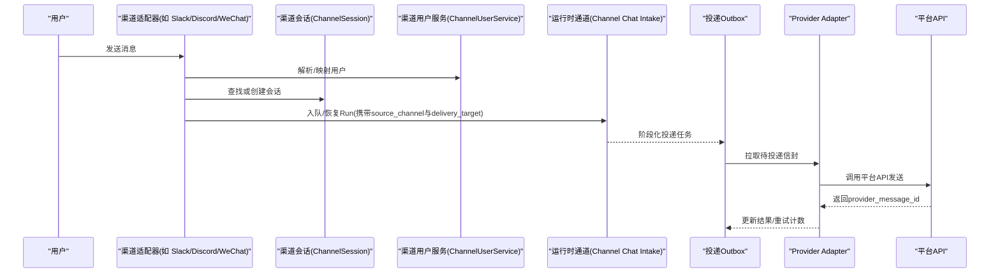

图表来源
- [slack.py:155-368](file://backend/app/api/slack.py#L155-L368)
- [discord_gateway.py:135-227](file://backend/app/services/discord_gateway.py#L135-L227)
- [wechat_channel.py:190-273](file://backend/app/services/wechat_channel.py#L190-L273)
- [channel_session.py:24-184](file://backend/app/services/channel_session.py#L24-L184)
- [channel_user_service.py:73-207](file://backend/app/services/channel_user_service.py#L73-L207)
- [channel_chat.py:104-154](file://backend/app/services/agent_runtime/channel_chat.py#L104-L154)
- [channel_delivery.py:143-175](file://backend/app/services/agent_runtime/channel_delivery.py#L143-L175)
- [channel_provider_delivery.py:111-130](file://backend/app/services/agent_runtime/channel_provider_delivery.py#L111-L130)

## 详细组件分析

### 飞书（Feishu/Lark）
- 认证与令牌：应用级 tenant_access_token，支持 per-agent app_id/app_secret
- OAuth 登录：exchange_code_for_user -> login_or_register，结合 OrgMember/Identity/User 完成绑定
- 消息发送：send_message/patch_message，支持文本与交互式卡片更新
- 文件能力：download_message_resource、upload_and_send_file
- Bitable/Docs/审批：提供多维表格、文档读写与审批实例创建等扩展 API

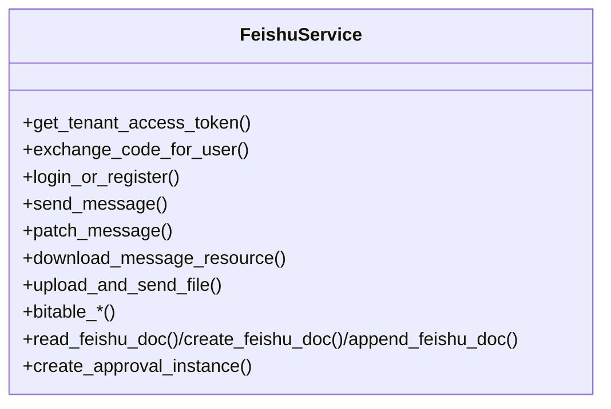

图表来源
- [feishu_service.py:156-800](file://backend/app/services/feishu_service.py#L156-L800)

章节来源
- [feishu_service.py:1-800](file://backend/app/services/feishu_service.py#L1-L800)

### 钉钉（DingTalk）
- 访问令牌：get_dingtalk_access_token
- 消息发送：v1.0 机器人 OTO 批量私聊、企业工作通知
- 媒体下载：download_dingtalk_media（委托 stream 模块）

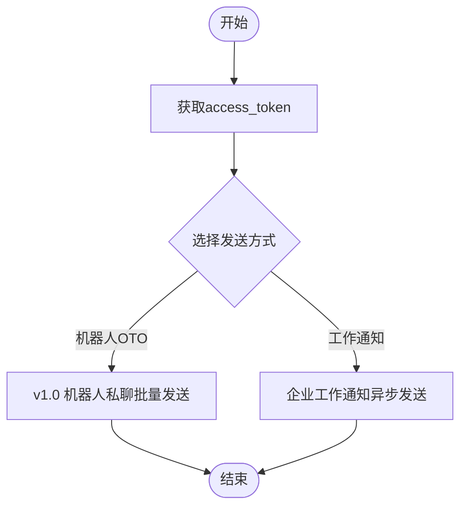

图表来源
- [dingtalk_service.py:8-175](file://backend/app/services/dingtalk_service.py#L8-L175)

章节来源
- [dingtalk_service.py:1-175](file://backend/app/services/dingtalk_service.py#L1-L175)

### 微信（WeChat iLink）
- 长轮询管理器 WeChatPollManager：按 agent 启动/停止轮询任务，自动重连与退避
- 消息发送：split_wechat_text 按协议限制分片发送
- 上下文缓存：remember_wechat_context/update_wechat_context_cache/get_wechat_context_entry
- 消息处理：_process_wechat_message 解析用户文本、解析用户、创建会话、入队运行时

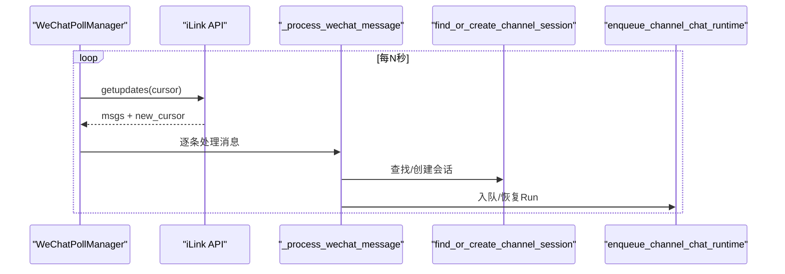

图表来源
- [wechat_channel.py:275-450](file://backend/app/services/wechat_channel.py#L275-L450)
- [wechat_channel.py:190-273](file://backend/app/services/wechat_channel.py#L190-L273)
- [channel_session.py:24-184](file://backend/app/services/channel_session.py#L24-L184)
- [channel_chat.py:104-154](file://backend/app/services/agent_runtime/channel_chat.py#L104-L154)

章节来源
- [wechat_channel.py:1-450](file://backend/app/services/wechat_channel.py#L1-L450)

### Discord（Gateway）
- WebSocket 客户端：start_client/start_all，监听 DM 与 @mention
- 消息处理：strip mention、typing indicator、分片回复
- 运行时对接：统一走 channel_user_service、find_or_create_channel_session、enqueue_channel_chat_runtime

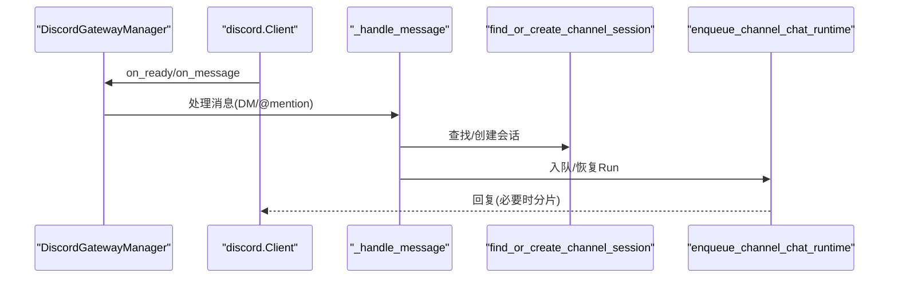

图表来源
- [discord_gateway.py:38-282](file://backend/app/services/discord_gateway.py#L38-L282)
- [channel_session.py:24-184](file://backend/app/services/channel_session.py#L24-L184)
- [channel_chat.py:104-154](file://backend/app/services/agent_runtime/channel_chat.py#L104-L154)

章节来源
- [discord_gateway.py:1-282](file://backend/app/services/discord_gateway.py#L1-L282)

### Slack（Webhook）
- 配置 CRUD：bot_token/signing_secret 持久化至 ChannelConfig
- 事件回调：验证签名、URL challenge、过滤 bot 消息、提取文本与附件
- 文件处理：下载附件到 workspace/uploads，附加到用户消息上下文
- 运行时对接：统一走 channel_user_service、find_or_create_channel_session、enqueue_channel_chat_runtime

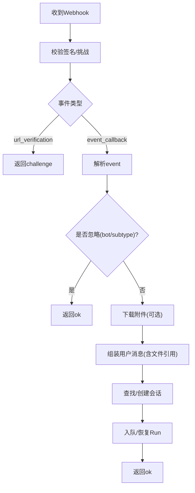

图表来源
- [slack.py:128-368](file://backend/app/api/slack.py#L128-L368)
- [channel_session.py:24-184](file://backend/app/services/channel_session.py#L24-L184)
- [channel_chat.py:104-154](file://backend/app/services/agent_runtime/channel_chat.py#L104-L154)

章节来源
- [slack.py:1-368](file://backend/app/api/slack.py#L1-L368)

### 统一会话与会话复用
- find_or_create_channel_session：基于 (tenant_id, agent_id, external_conv_id) 唯一性，区分 group/direct，修复历史归属，保护并发冲突（ advisory lock ）

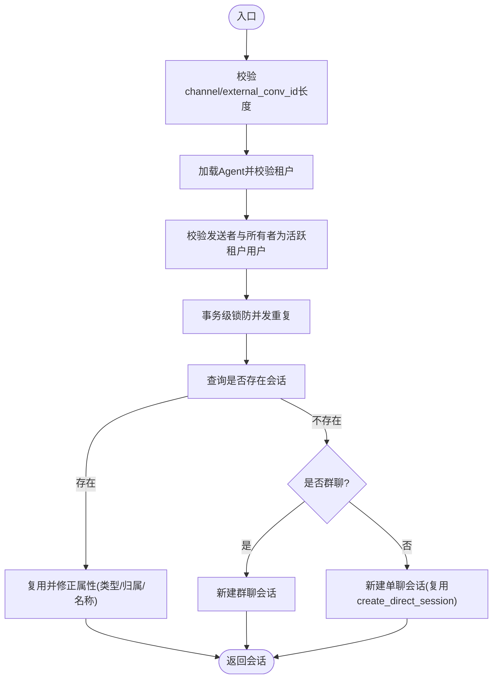

图表来源
- [channel_session.py:24-184](file://backend/app/services/channel_session.py#L24-L184)

章节来源
- [channel_session.py:1-184](file://backend/app/services/channel_session.py#L1-L184)

### 用户身份映射（跨渠道）
- ChannelUserService.resolve_channel_user：优先级 OrgMember->User、邮箱/手机号匹配、懒注册新 User，并维护 IdentityProvider/OrgMember shell
- 渠道别名与标识规范化：microsoft_teams <-> teams，unionid/open_id/external_id 差异化处理

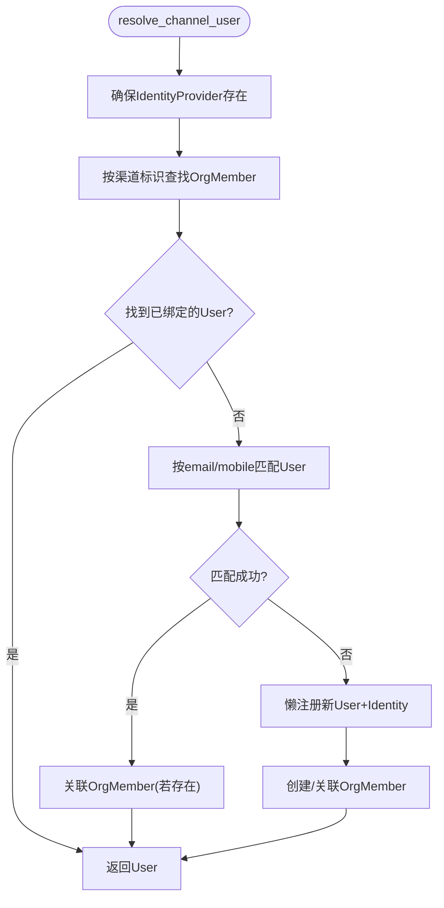

图表来源
- [channel_user_service.py:73-207](file://backend/app/services/channel_user_service.py#L73-L207)

章节来源
- [channel_user_service.py:1-641](file://backend/app/services/channel_user_service.py#L1-L641)

### 运行时通道与可靠投递
- Channel Chat Intake：将外部消息原子地入队或恢复到 waiting_user 的 Run，生成幂等 message_id
- Outbox Delivery：stage_channel_delivery 写入投递任务，按 attempt_count 指数退避重试，失败记录 error_code/error
- Provider Adapter：按 channel/target 路由到具体平台发送，回写 provider_message_id

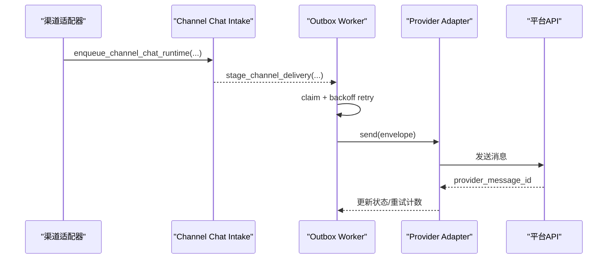

图表来源
- [channel_chat.py:104-154](file://backend/app/services/agent_runtime/channel_chat.py#L104-L154)
- [channel_delivery.py:143-175](file://backend/app/services/agent_runtime/channel_delivery.py#L143-L175)
- [channel_provider_delivery.py:111-130](file://backend/app/services/agent_runtime/channel_provider_delivery.py#L111-L130)

章节来源
- [channel_chat.py:1-162](file://backend/app/services/agent_runtime/channel_chat.py#L1-L162)
- [channel_delivery.py:1-275](file://backend/app/services/agent_runtime/channel_delivery.py#L1-L275)
- [channel_provider_delivery.py:1-130](file://backend/app/services/agent_runtime/channel_provider_delivery.py#L1-L130)

## 依赖关系分析
- ChannelConfig 作为所有渠道配置的单一数据源，包含 is_configured/is_connected 用于生命周期管理
- 各渠道适配器依赖 ChannelSession、ChannelUserService 完成会话与用户解析
- 运行时通道依赖 RunStateReader 与 AgentRun 状态，确保在 waiting_user 场景下正确恢复
- Outbox Delivery 与 Provider Adapter 解耦发送逻辑，便于扩展新渠道

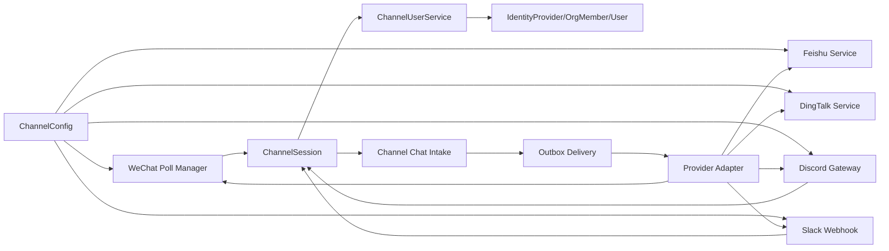

图表来源
- [channel_config.py:1-52](file://backend/app/models/channel_config.py#L1-L52)
- [channel_session.py:1-184](file://backend/app/services/channel_session.py#L1-L184)
- [channel_user_service.py:1-641](file://backend/app/services/channel_user_service.py#L1-L641)
- [channel_chat.py:1-162](file://backend/app/services/agent_runtime/channel_chat.py#L1-L162)
- [channel_delivery.py:1-275](file://backend/app/services/agent_runtime/channel_delivery.py#L1-L275)
- [channel_provider_delivery.py:1-130](file://backend/app/services/agent_runtime/channel_provider_delivery.py#L1-L130)

章节来源
- [channel_config.py:1-52](file://backend/app/models/channel_config.py#L1-L52)
- [channel_session.py:1-184](file://backend/app/services/channel_session.py#L1-L184)
- [channel_user_service.py:1-641](file://backend/app/services/channel_user_service.py#L1-L641)
- [channel_chat.py:1-162](file://backend/app/services/agent_runtime/channel_chat.py#L1-L162)
- [channel_delivery.py:1-275](file://backend/app/services/agent_runtime/channel_delivery.py#L1-L275)
- [channel_provider_delivery.py:1-130](file://backend/app/services/agent_runtime/channel_provider_delivery.py#L1-L130)

## 性能考虑
- 连接池与客户端复用：FeishuService 使用有序字典 LRU 缓存 lark Client 实例，控制内存占用
- 消息分片：WeChat/Slack/Discord 均按平台字符上限分片发送，避免超限
- 幂等与去重：Slack 事件以 event_id 去重；channel_message_id 基于 agent_id + source_channel + external_event_id 生成稳定 ID
- 重试与退避：Outbox Delivery 使用指数退避，限制最大重试间隔，避免雪崩
- 数据库锁：ChannelSession 使用 advisory lock 防止并发重复创建会话

[本节为通用指导，不直接分析具体文件]

## 故障排查指南
- 飞书 API 错误：FeishuAPIError 保留 http_status/code/msg/log_id/troubleshooter/message_id，便于定位
- 微信会话过期：WeChatSessionExpiredError 触发清理 cursor 与 session_expired 标记，重启轮询
- 渠道会话范围不一致：ChannelSessionError.channel_session_scope_mismatch 提示会话绑定异常
- 渠道投递失败：Outbox 记录 last_error_code/last_error，按 attempt_count 重试；检查 target 字段完整性
- 用户解析失败：ChannelUserResolutionError 常见于缺少 unionid/open_id/external_id，需检查上游平台信息

章节来源
- [feishu_service.py:30-75](file://backend/app/services/feishu_service.py#L30-L75)
- [wechat_channel.py:35-40](file://backend/app/services/wechat_channel.py#L35-L40)
- [channel_session.py:16-22](file://backend/app/services/channel_session.py#L16-L22)
- [channel_delivery.py:177-185](file://backend/app/services/agent_runtime/channel_delivery.py#L177-L185)
- [channel_user_service.py:23-28](file://backend/app/services/channel_user_service.py#L23-L28)

## 结论
Clawith 的多渠道集成通过“统一抽象 + 平台适配”实现了高内聚、低耦合的架构设计。借助 ChannelSession、ChannelUserService、Channel Chat Intake 与 Outbox Delivery，系统在保证一致性与可靠性的同时，提供了良好的扩展性。各平台适配器遵循统一的会话与用户解析流程，结合幂等与重试机制，有效提升了稳定性与可运维性。

[本节为总结性内容，不直接分析具体文件]

## 附录：自定义渠道适配器开发指南

### 接口规范
- 渠道配置：在 ChannelConfig 中新增 channel_type 枚举值，并在 extra_config 中保存必要凭据（如 token、secret、base_url）
- 会话创建：使用 find_or_create_channel_session 创建或复用会话，设置 source_channel、external_conv_id、is_group/group_name
- 用户解析：使用 channel_user_service.resolve_channel_user 解析平台用户，传入 channel_type、external_user_id、extra_info（name/email/avatar/mobile）
- 运行时入队：使用 enqueue_channel_chat_runtime 将消息入队或恢复到 waiting_user 的 Run，设置 source_channel、channel_delivery_target、message_id
- 投递目标：channel_delivery_target 必须包含 platform 所需的 receive_id/receive_id_type 或 channel_id/reply_to_message_id 等字段

### 消息协议
- 输入：content（文本）、display_content（展示用）、file_name（文件路径引用）
- 输出：Provider Adapter 根据 channel 路由到对应发送方法，返回 provider_message_id
- 分片与限长：按平台字符限制进行分片发送（参考 WeChat/Slack/Discord 实现）

### 错误处理
- 定义渠道特定错误类（如 FeishuAPIError），保留 code/msg/http_status/log_id 等字段
- Outbox Delivery 捕获异常并记录 last_error_code/last_error，按 attempt_count 指数退避重试
- 会话与用户解析错误抛出 ChannelSessionError/ChannelUserResolutionError，明确错误码与提示信息

### 连接状态监控与故障恢复
- 连接状态：在 ChannelConfig.is_connected 上记录连接状态，定期 reconcile（参考 WeChatPollManager/DiscordGatewayManager）
- 故障恢复：对会话过期、网络异常、权限不足等场景，记录额外状态（如 session_expired/cursor），自动清理并重试
- 健康检查：暴露 status 接口（如 DiscordGatewayManager.status），便于监控与告警

### 示例流程（时序图）
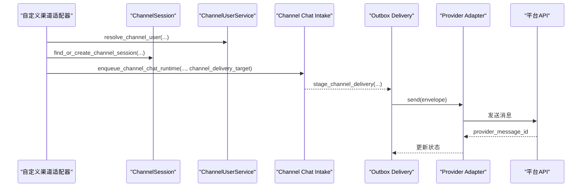

[本节为概念性指导，不直接分析具体文件]