# 自定义渠道开发

<cite>
**本文引用的文件**   
- [channel_config.py](file://backend/app/models/channel_config.py)
- [channel_delivery.py](file://backend/app/models/channel_delivery.py)
- [channel_session.py](file://backend/app/services/channel_session.py)
- [channel_user_service.py](file://backend/app/services/channel_user_service.py)
- [channel_chat.py](file://backend/app/services/agent_runtime/channel_chat.py)
- [channel_delivery_worker.py](file://backend/app/services/agent_runtime/channel_delivery.py)
- [channel_provider_delivery.py](file://backend/app/services/agent_runtime/channel_provider_delivery.py)
- [wechat_channel.py](file://backend/app/services/wechat_channel.py)
- [feishu_api.py](file://backend/app/api/feishu.py)
- [wechat_api.py](file://backend/app/api/wechat.py)
- [wecom_api.py](file://backend/app/api/wecom.py)
- [dingtalk_api.py](file://backend/app/api/dingtalk.py)
- [slack_api.py](file://backend/app/api/slack.py)
- [discord_api.py](file://backend/app/api/discord_bot.py)
- [test_channel_session.py](file://backend/tests/test_channel_session.py)
- [test_channel_delivery_migration.py](file://backend/tests/test_channel_delivery_migration.py)
</cite>

## 目录
1. [简介](#简介)
2. [项目结构](#项目结构)
3. [核心组件](#核心组件)
4. [架构总览](#架构总览)
5. [详细组件分析](#详细组件分析)
6. [依赖关系分析](#依赖关系分析)
7. [性能与可靠性](#性能与可靠性)
8. [故障排查指南](#故障排查指南)
9. [结论](#结论)
10. [附录：开发与发布最佳实践](#附录开发与发布最佳实践)

## 简介
本文件面向“自定义渠道适配器”开发者，系统化阐述渠道适配器的接口规范、消息协议定义、认证授权实现、统一消息格式转换、事件处理机制、错误处理策略，以及渠道配置管理、连接池管理、心跳检测等基础设施。文档同时提供完整的开发示例（以微信 iLink 为例）、配置文件格式、测试方法，并给出渠道发布、版本管理与兼容性保证的最佳实践。

## 项目结构
本项目采用“API 路由 + 服务层 + 模型 + 运行时集成”的分层组织方式：
- API 路由层：各渠道的 Webhook/Gateway/OAuth 入口与配置管理
- 服务层：渠道会话、用户解析、统一入队、投递工作器、提供者适配器
- 模型层：渠道配置、投递出站箱（Outbox）
- 运行时集成：将渠道消息接入统一 Agent Runtime（LangGraph）

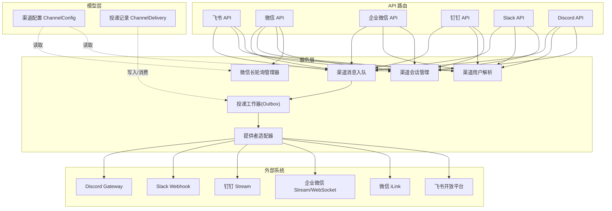

图表来源 
- [feishu_api.py:130-235](file://backend/app/api/feishu.py#L130-L235)
- [wechat_api.py:54-151](file://backend/app/api/wechat.py#L54-L151)
- [wecom_api.py:1-305](file://backend/app/api/wecom.py#L1-L305)
- [dingtalk_api.py:65-95](file://backend/app/api/dingtalk.py#L65-L95)
- [slack_api.py:63-99](file://backend/app/api/slack.py#L63-L99)
- [discord_api.py:34-51](file://backend/app/api/discord_bot.py#L34-L51)
- [channel_session.py:24-180](file://backend/app/services/channel_session.py#L24-L180)
- [channel_user_service.py:73-208](file://backend/app/services/channel_user_service.py#L73-L208)
- [channel_chat.py:104-154](file://backend/app/services/agent_runtime/channel_chat.py#L104-L154)
- [channel_delivery_worker.py:192-416](file://backend/app/services/agent_runtime/channel_delivery.py#L192-L416)
- [channel_provider_delivery.py:1-46](file://backend/app/services/agent_runtime/channel_provider_delivery.py#L1-L46)
- [wechat_channel.py:275-449](file://backend/app/services/wechat_channel.py#L275-L449)
- [channel_config.py:13-52](file://backend/app/models/channel_config.py#L13-L52)
- [channel_delivery.py:26-169](file://backend/app/models/channel_delivery.py#L26-L169)

章节来源
- [channel_config.py:13-52](file://backend/app/models/channel_config.py#L13-L52)
- [channel_delivery.py:26-169](file://backend/app/models/channel_delivery.py#L26-L169)
- [channel_session.py:24-180](file://backend/app/services/channel_session.py#L24-L180)
- [channel_user_service.py:73-208](file://backend/app/services/channel_user_service.py#L73-L208)
- [channel_chat.py:104-154](file://backend/app/services/agent_runtime/channel_chat.py#L104-L154)
- [channel_delivery_worker.py:192-416](file://backend/app/services/agent_runtime/channel_delivery.py#L192-L416)
- [channel_provider_delivery.py:1-46](file://backend/app/services/agent_runtime/channel_provider_delivery.py#L1-L46)
- [wechat_channel.py:275-449](file://backend/app/services/wechat_channel.py#L275-L449)
- [feishu_api.py:130-235](file://backend/app/api/feishu.py#L130-L235)
- [wechat_api.py:54-151](file://backend/app/api/wechat.py#L54-L151)
- [wecom_api.py:1-305](file://backend/app/api/wecom.py#L1-L305)
- [dingtalk_api.py:65-95](file://backend/app/api/dingtalk.py#L65-L95)
- [slack_api.py:63-99](file://backend/app/api/slack.py#L63-L99)
- [discord_api.py:34-51](file://backend/app/api/discord_bot.py#L34-L51)

## 核心组件
- 渠道配置模型 ChannelConfig：按 agent_id + channel_type 唯一约束，存储凭证、状态与扩展字段 extra_config
- 投递出站箱 ChannelDelivery：持久化投递任务，支持重试、幂等键、声明式锁、失败回退
- 渠道会话 ChannelSession：跨渠道统一会话映射，确保多租户隔离与群聊/私聊语义一致
- 渠道用户解析 ChannelUserService：基于 OrgMember/SSO 的用户识别与懒注册
- 渠道消息入队 ChannelChatRuntime：将渠道消息转换为统一运行时输入，支持等待恢复
- 投递工作器 ChannelDeliveryWorker：从 Outbox 拉取、调用提供者发送、更新状态与事件
- 提供者适配器 ChannelProviderDeliverySender：按渠道封装发送逻辑（文本分片、鉴权头、回调处理）
- 微信长轮询 WeChatPollManager：按 agent 维度维护长轮询任务、游标与重连

章节来源
- [channel_config.py:13-52](file://backend/app/models/channel_config.py#L13-L52)
- [channel_delivery.py:26-169](file://backend/app/models/channel_delivery.py#L26-L169)
- [channel_session.py:24-180](file://backend/app/services/channel_session.py#L24-L180)
- [channel_user_service.py:73-208](file://backend/app/services/channel_user_service.py#L73-L208)
- [channel_chat.py:104-154](file://backend/app/services/agent_runtime/channel_chat.py#L104-L154)
- [channel_delivery_worker.py:192-416](file://backend/app/services/agent_runtime/channel_delivery.py#L192-L416)
- [channel_provider_delivery.py:1-46](file://backend/app/services/agent_runtime/channel_provider_delivery.py#L1-L46)
- [wechat_channel.py:275-449](file://backend/app/services/wechat_channel.py#L275-L449)

## 架构总览
下图展示一条典型消息从渠道到运行时的完整链路，以及结果如何经 Outbox 投递回渠道。

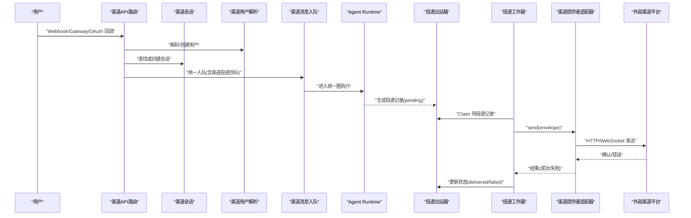

图表来源 
- [feishu_api.py:388-577](file://backend/app/api/feishu.py#L388-L577)
- [wechat_api.py:54-151](file://backend/app/api/wechat.py#L54-L151)
- [channel_session.py:24-180](file://backend/app/services/channel_session.py#L24-L180)
- [channel_user_service.py:73-208](file://backend/app/services/channel_user_service.py#L73-L208)
- [channel_chat.py:104-154](file://backend/app/services/agent_runtime/channel_chat.py#L104-L154)
- [channel_delivery_worker.py:192-416](file://backend/app/services/agent_runtime/channel_delivery.py#L192-L416)
- [channel_provider_delivery.py:1-46](file://backend/app/services/agent_runtime/channel_provider_delivery.py#L1-L46)

## 详细组件分析

### 渠道配置管理（ChannelConfig）
- 唯一性：agent_id + channel_type 唯一，避免重复配置
- 扩展性：extra_config JSON 字段承载各渠道特有参数（如 baseurl、route_tag、connection_mode、get_updates_buf 等）
- 状态：is_configured、is_connected、last_tested_at 用于生命周期与连通性监控

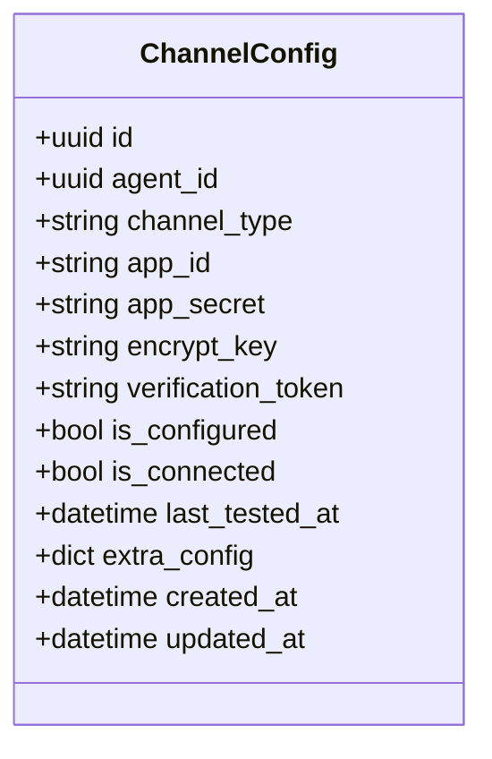

图表来源 
- [channel_config.py:13-52](file://backend/app/models/channel_config.py#L13-L52)

章节来源
- [channel_config.py:13-52](file://backend/app/models/channel_config.py#L13-L52)

### 渠道会话与会话复用（ChannelSession）
- 功能：根据 (agent_id, external_conv_id) 查找或创建 ChatSession，区分 group/direct
- 安全：使用 advisory lock 防止并发冲突；校验 tenant 范围与用户有效性
- 兼容：修复历史 session 归属与 group_name 同步

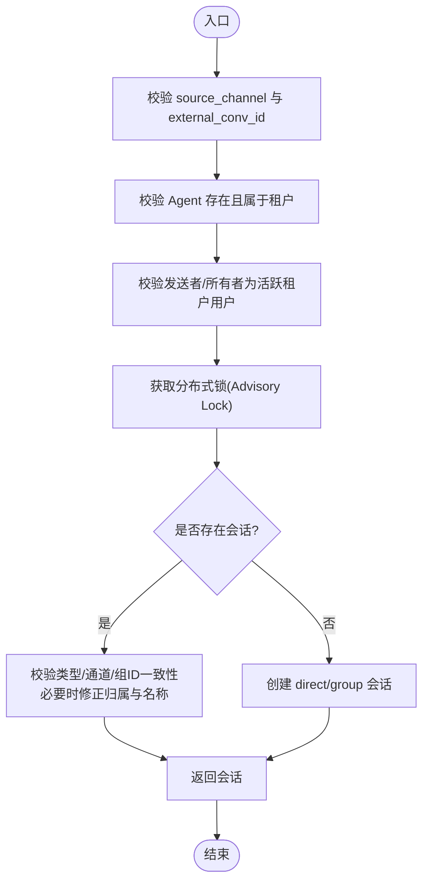

图表来源 
- [channel_session.py:24-180](file://backend/app/services/channel_session.py#L24-L180)

章节来源
- [channel_session.py:24-180](file://backend/app/services/channel_session.py#L24-L180)
- [test_channel_session.py:40-54](file://backend/tests/test_channel_session.py#L40-L54)

### 渠道用户解析（ChannelUserService）
- 优先级：已绑定用户的 OrgMember → 通过 email/mobile 匹配用户 → 懒注册新用户
- 渠道差异：Feishu/DingTalk/WeCom/WeChat 对 unionid/open_id/external_id 的处理不同
- 幂等：避免重复创建 OrgMember shell，优先复用 org-sync 记录

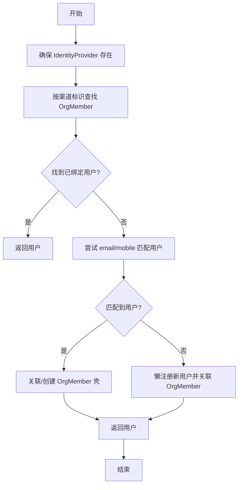

图表来源 
- [channel_user_service.py:73-208](file://backend/app/services/channel_user_service.py#L73-L208)

章节来源
- [channel_user_service.py:73-208](file://backend/app/services/channel_user_service.py#L73-L208)

### 统一消息入队（ChannelChatRuntime）
- 能力：将渠道消息转换为统一运行时输入，支持“等待用户”场景的恢复
- 幂等：channel_message_id 基于 agent_id + source_channel + external_event_id 生成稳定 ID
- 校验：检查模型可用性、运行态是否启用、lane 持有者唯一性

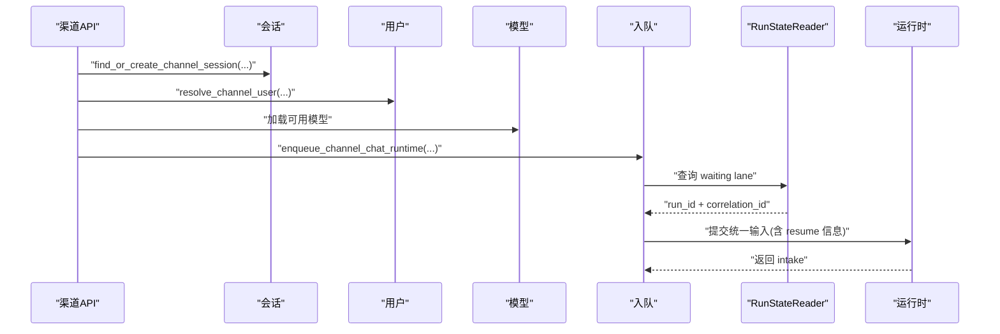

图表来源 
- [channel_chat.py:104-154](file://backend/app/services/agent_runtime/channel_chat.py#L104-L154)

章节来源
- [channel_chat.py:104-154](file://backend/app/services/agent_runtime/channel_chat.py#L104-L154)

### 投递出站箱与工作器（ChannelDelivery）
- 设计：Outbox-only，不参与 Graph 路由与 checkpoint 恢复
- 幂等：run_id + idempotency_key 唯一；delivery_id 由 run_id + idempotency_key 派生
- 重试：指数退避，最大尝试次数可配；失败记录 error_code/error
- 事件：delivered/failed 事件写入 AgentRunEvent，便于追踪

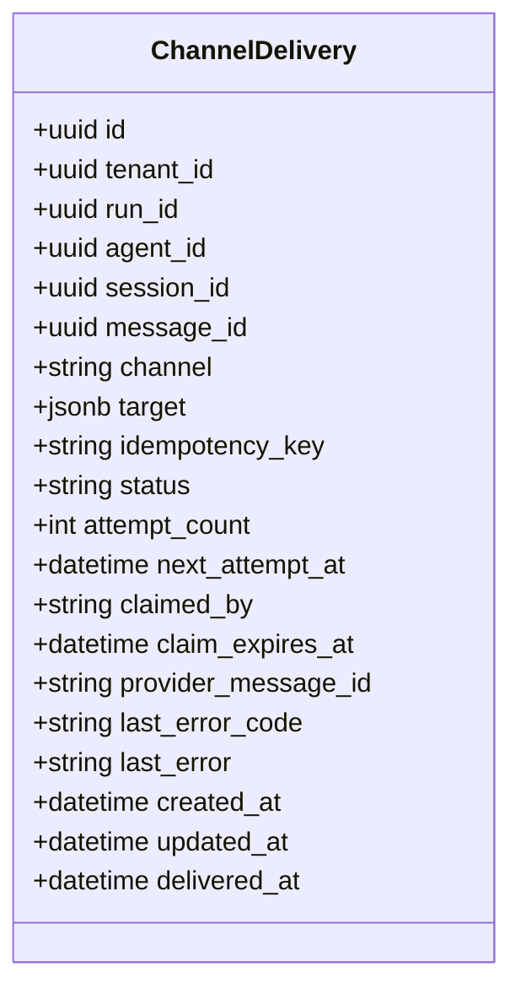

图表来源 
- [channel_delivery.py:26-169](file://backend/app/models/channel_delivery.py#L26-L169)

章节来源
- [channel_delivery.py:26-169](file://backend/app/models/channel_delivery.py#L26-L169)
- [test_channel_delivery_migration.py:28-54](file://backend/tests/test_channel_delivery_migration.py#L28-L54)

### 投递工作器（ChannelDeliveryWorker）
- Claim 策略：SELECT FOR UPDATE SKIP LOCKED，按 next_attempt_at 排序
- 完成流程：标记 claimed → 调用 sender.send → 更新 delivered/failed → 写事件
- 错误处理：屏蔽敏感信息（Bearer/token），URL 脱敏，错误码截断

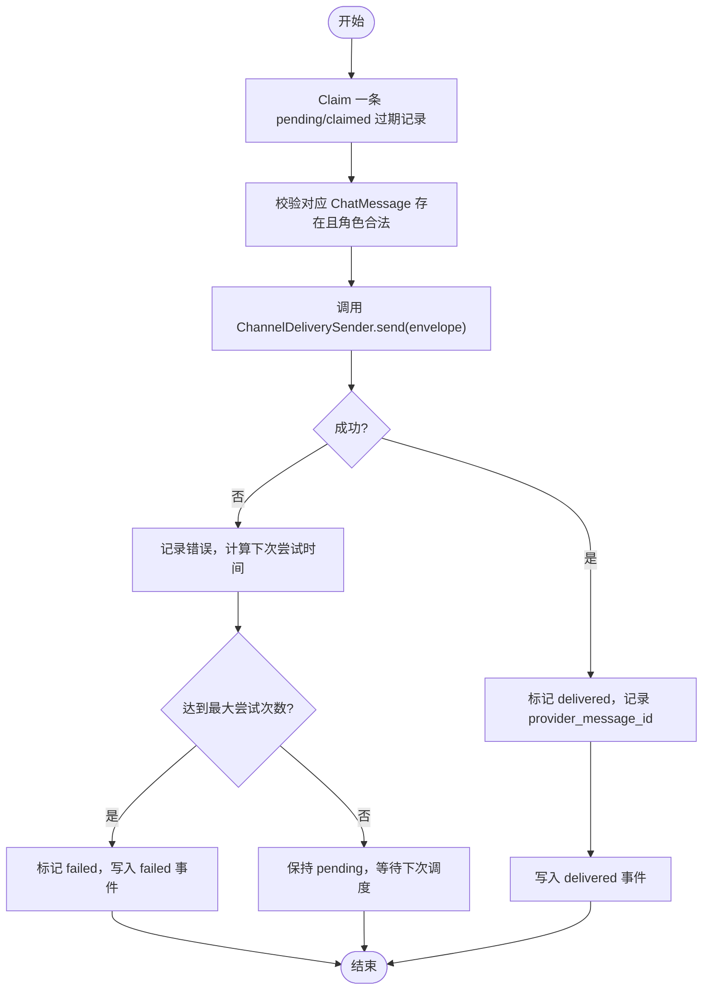

图表来源 
- [channel_delivery_worker.py:192-416](file://backend/app/services/agent_runtime/channel_delivery.py#L192-L416)

章节来源
- [channel_delivery_worker.py:192-416](file://backend/app/services/agent_runtime/channel_delivery.py#L192-L416)

### 提供者适配器（ChannelProviderDeliverySender）
- 职责：按渠道封装发送细节（分片、鉴权头、回调处理）
- 校验：target 必填字段校验，不支持渠道直接拒绝
- 分片：文本超长时按平台限制切分发送

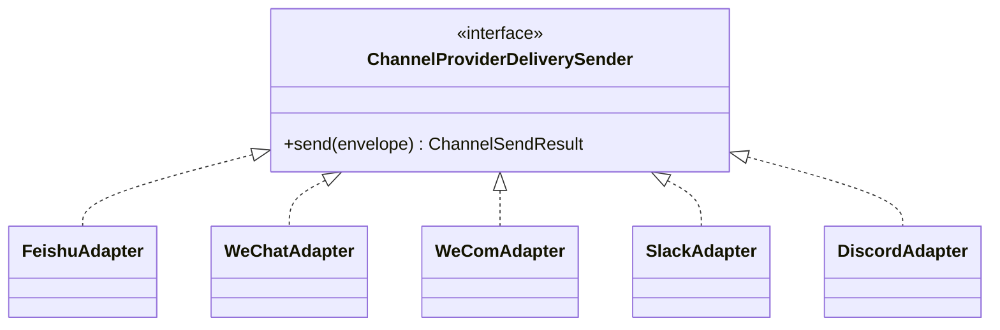

图表来源 
- [channel_provider_delivery.py:1-46](file://backend/app/services/agent_runtime/channel_provider_delivery.py#L1-L46)

章节来源
- [channel_provider_delivery.py:1-46](file://backend/app/services/agent_runtime/channel_provider_delivery.py#L1-L46)

### 微信 iLink 适配器（WeChat Poll Manager）
- 长轮询：按 agent 启动独立任务，维护 get_updates_buf 游标
- 消息处理：提取文本、解析上下文 token、保存上下文缓存、入队统一运行时
- 连接状态：is_connected 与 session_expired 标志位，自动重连与清理

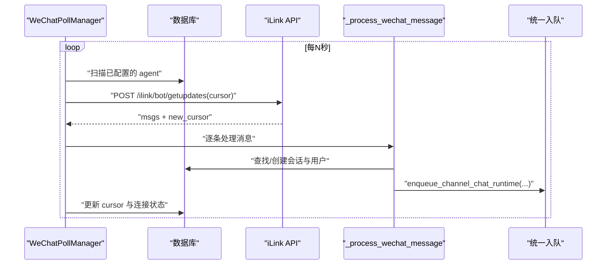

图表来源 
- [wechat_channel.py:275-449](file://backend/app/services/wechat_channel.py#L275-L449)

章节来源
- [wechat_channel.py:275-449](file://backend/app/services/wechat_channel.py#L275-L449)
- [wechat_api.py:54-151](file://backend/app/api/wechat.py#L54-L151)

### 飞书/企业微信/钉钉/Slack/Discord 接入要点
- 飞书：OAuth 回调、Webhook 事件处理、富文本图片下载与内联 base64
- 企业微信：AES 解密、Stream/Websocket 模式切换、Webhook URL 生成
- 钉钉：WebSocket/Webhook 两种模式，动态启停 Stream 客户端
- Slack：Bot Token + Signing Secret，Webhook URL 生成
- Discord：Gateway/Webhook 模式，application_id/public_key 校验

章节来源
- [feishu_api.py:130-235](file://backend/app/api/feishu.py#L130-L235)
- [feishu_api.py:388-577](file://backend/app/api/feishu.py#L388-L577)
- [wecom_api.py:1-305](file://backend/app/api/wecom.py#L1-L305)
- [dingtalk_api.py:65-95](file://backend/app/api/dingtalk.py#L65-L95)
- [slack_api.py:63-99](file://backend/app/api/slack.py#L63-L99)
- [discord_api.py:34-51](file://backend/app/api/discord_bot.py#L34-L51)

## 依赖关系分析
- 低耦合：API 路由仅负责鉴权、参数校验与调用服务层；服务层专注业务编排；模型层只描述数据
- 高内聚：每个渠道的适配器与配置集中在各自模块，通过 ChannelConfig.extra_config 解耦
- 无环依赖：Outbox 与 Worker 不反向依赖 Graph 状态，避免循环

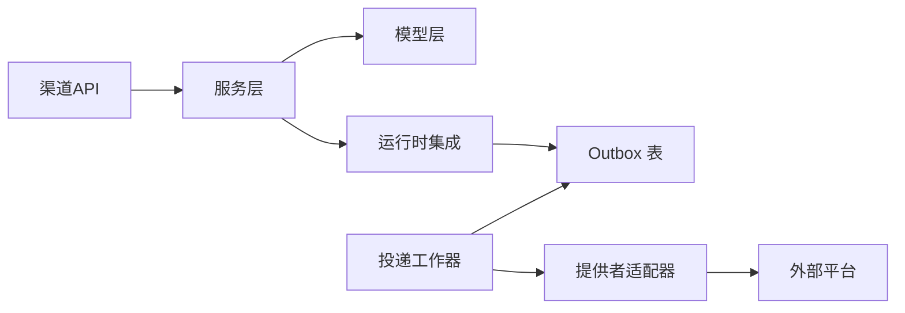

图表来源 
- [channel_config.py:13-52](file://backend/app/models/channel_config.py#L13-L52)
- [channel_delivery.py:26-169](file://backend/app/models/channel_delivery.py#L26-L169)
- [channel_chat.py:104-154](file://backend/app/services/agent_runtime/channel_chat.py#L104-L154)
- [channel_delivery_worker.py:192-416](file://backend/app/services/agent_runtime/channel_delivery.py#L192-L416)
- [channel_provider_delivery.py:1-46](file://backend/app/services/agent_runtime/channel_provider_delivery.py#L1-L46)

## 性能与可靠性
- Outbox 重试：指数退避 + 最大尝试次数，避免雪崩
- 幂等键：channel_message_id 与 delivery_id 均基于确定性哈希，保障重复事件不重复处理
- 并发控制：Advisory Lock 防并发会话冲突；SELECT ... FOR UPDATE SKIP LOCKED 防重复 Claim
- 资源释放：API 中在慢调用前主动关闭 DB 连接，降低阻塞风险
- 日志脱敏：错误信息屏蔽 Bearer 与 URL，避免泄露

章节来源
- [channel_delivery_worker.py:192-416](file://backend/app/services/agent_runtime/channel_delivery.py#L192-L416)
- [channel_chat.py:34-46](file://backend/app/services/agent_runtime/channel_chat.py#L34-L46)
- [channel_session.py:104-107](file://backend/app/services/channel_session.py#L104-L107)
- [wechat_api.py:64-66](file://backend/app/api/wechat.py#L64-L66)

## 故障排查指南
- 常见问题
  - 会话冲突：检查 external_conv_id 与 source_channel 是否一致，确认 Advisory Lock 生效
  - 用户解析失败：核对 unionid/open_id/external_id 的来源与渠道规则
  - 投递失败：查看 last_error_code/last_error，确认渠道限流或权限不足
  - 微信会话过期：检查 session_expired 标志与 cursor 重置
- 定位步骤
  - 查看 ChannelDelivery 最近失败记录与事件
  - 检查 ChannelConfig.is_connected 与 extra_config 关键字段
  - 核对渠道 Webhook/Gateway 回调是否被去重（内存集合或数据库）
  - 验证运行时是否处于 waiting_user 状态，resume 相关字段是否正确

章节来源
- [channel_delivery.py:120-168](file://backend/app/models/channel_delivery.py#L120-L168)
- [channel_user_service.py:73-208](file://backend/app/services/channel_user_service.py#L73-L208)
- [wechat_channel.py:368-383](file://backend/app/services/wechat_channel.py#L368-L383)

## 结论
通过统一的会话、用户解析、运行时入队与 Outbox 投递机制，本项目实现了多渠道的高内聚、低耦合与高可靠接入。开发者只需遵循渠道适配器接口规范与消息协议约定，即可快速扩展新渠道并保持与现有生态的一致性。

## 附录：开发与发布最佳实践

### 渠道适配器接口规范
- 必须实现 ChannelDeliverySender 接口（send 方法）
- 必须遵守 build_channel_delivery_route 的 route 结构（version/channel/target）
- 必须处理文本分片与鉴权头构造（参考微信/飞书实现）

章节来源
- [channel_provider_delivery.py:1-46](file://backend/app/services/agent_runtime/channel_provider_delivery.py#L1-L46)
- [channel_delivery_worker.py:88-106](file://backend/app/services/agent_runtime/channel_delivery.py#L88-L106)

### 消息协议定义
- 统一入队参数：content/display_content/file_name/source_channel/message_id/channel_delivery_target
- 渠道消息 ID：channel_message_id(agent_id, source_channel, external_event_id)
- 投递目标：channel_delivery.target 包含 receive_id/receive_id_type 等渠道特定字段

章节来源
- [channel_chat.py:104-154](file://backend/app/services/agent_runtime/channel_chat.py#L104-L154)
- [channel_chat.py:34-46](file://backend/app/services/agent_runtime/channel_chat.py#L34-L46)
- [feishu_api.py:360-381](file://backend/app/api/feishu.py#L360-L381)

### 认证授权实现
- OAuth：飞书 OAuth 回调，生成 JWT 并可选 SSO 流程
- Webhook：签名校验（Slack/企微 AES）、challenge 响应（飞书）
- 访问控制：仅 Agent 创建者可配置/删除渠道

章节来源
- [feishu_api.py:36-126](file://backend/app/api/feishu.py#L36-L126)
- [slack_api.py:63-99](file://backend/app/api/slack.py#L63-L99)
- [wecom_api.py:1-305](file://backend/app/api/wecom.py#L1-L305)

### 统一消息格式转换
- 富文本转纯文本：飞书 post 内容解析，图片下载后内联 base64
- 提及与 @ 清理：去除无效 mention，保留显示内容
- 附件处理：下载并落盘，提示工具读取路径

章节来源
- [feishu_api.py:440-503](file://backend/app/api/feishu.py#L440-L503)
- [feishu_api.py:580-689](file://backend/app/api/feishu.py#L580-L689)

### 事件处理机制
- 去重：内存集合暂存 event_id，超限清理
- 异步：后台任务启动/停止 Stream/Websocket 客户端
- 状态：is_configured/is_connected 实时更新

章节来源
- [feishu_api.py:384-411](file://backend/app/api/feishu.py#L384-L411)
- [dingtalk_api.py:65-95](file://backend/app/api/dingtalk.py#L65-L95)
- [wechat_api.py:148-151](file://backend/app/api/wechat.py#L148-L151)

### 错误处理策略
- 结构化错误码：ChannelChatRuntimeError/ChannelDeliveryError/ChannelProviderDeliveryError
- 错误脱敏：屏蔽 Bearer/URL，限制长度
- 重试与回退：指数退避、最大尝试次数、最终失败事件

章节来源
- [channel_chat.py:26-32](file://backend/app/services/agent_runtime/channel_chat.py#L26-L32)
- [channel_delivery_worker.py:177-185](file://backend/app/services/agent_runtime/channel_delivery.py#L177-L185)
- [channel_provider_delivery.py:27-42](file://backend/app/services/agent_runtime/channel_provider_delivery.py#L27-L42)

### 渠道配置管理
- 配置项：app_id/app_secret/encrypt_key/verification_token/extra_config
- 连接模式：webhook/websocket/gateway 等，动态启停客户端
- 健康检查：last_tested_at、is_connected

章节来源
- [channel_config.py:13-52](file://backend/app/models/channel_config.py#L13-L52)
- [feishu_api.py:130-188](file://backend/app/api/feishu.py#L130-L188)
- [dingtalk_api.py:65-95](file://backend/app/api/dingtalk.py#L65-L95)

### 连接池管理与心跳检测
- 连接池：httpx.AsyncClient 短连接+超时控制
- 心跳：长轮询间隔、cursor 更新、session_expired 标志
- 资源清理：取消任务、释放连接、清空内存集合

章节来源
- [wechat_channel.py:330-383](file://backend/app/services/wechat_channel.py#L330-L383)
- [wechat_api.py:64-66](file://backend/app/api/wechat.py#L64-L66)

### 开发示例（Python 适配器）
- 最小实现：实现 ChannelDeliverySender.send，构造请求头与分片逻辑
- 配置注入：从 ChannelConfig.extra_config 读取 baseurl/token/route_tag
- 错误上报：抛出带 code 的异常，供工作器记录

章节来源
- [channel_provider_delivery.py:1-46](file://backend/app/services/agent_runtime/channel_provider_delivery.py#L1-L46)
- [wechat_channel.py:74-118](file://backend/app/services/wechat_channel.py#L74-L118)

### 配置文件格式
- ChannelConfigCreate：channel_type/app_id/app_secret/encrypt_key/verification_token/extra_config
- extra_config 示例：baseurl、bot_token、connection_mode、route_tag、get_updates_buf、channel_version

章节来源
- [feishu_api.py:130-188](file://backend/app/api/feishu.py#L130-L188)
- [wechat_api.py:108-146](file://backend/app/api/wechat.py#L108-L146)

### 测试方法
- 单元测试：覆盖 Outbox Claim/Complete/Fail、会话创建/合并、迁移约束
- 契约测试：校验 ChannelDelivery 字段与约束，确保不与运行时状态混用

章节来源
- [test_channel_session.py:40-54](file://backend/tests/test_channel_session.py#L40-L54)
- [test_channel_delivery_migration.py:28-54](file://backend/tests/test_channel_delivery_migration.py#L28-L54)

### 渠道发布、版本管理与兼容性保证
- 版本字段：channel_version/base_info.version，向后兼容旧版
- 灰度发布：route_tag 分流，逐步放量
- 兼容性：supported channels 白名单，非法渠道直接拒绝

章节来源
- [channel_delivery_worker.py:23-34](file://backend/app/services/agent_runtime/channel_delivery.py#L23-L34)
- [wechat_channel.py:28-32](file://backend/app/services/wechat_channel.py#L28-L32)
- [feishu_api.py:160-188](file://backend/app/api/feishu.py#L160-L188)