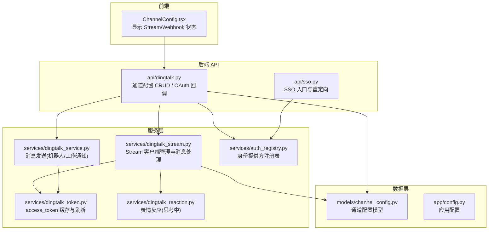
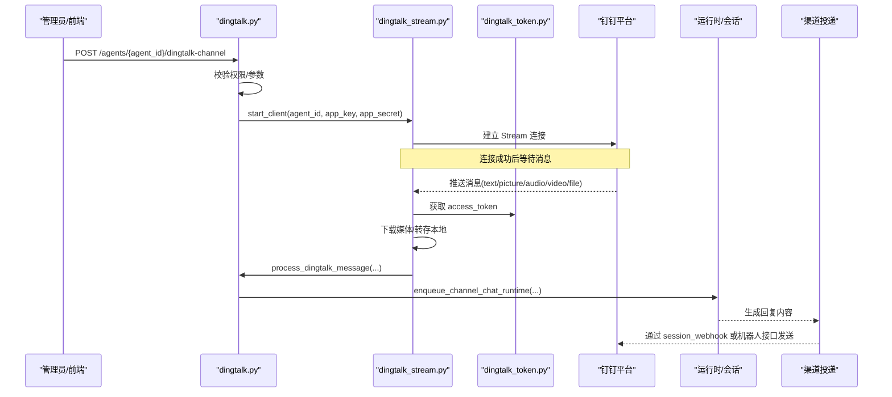
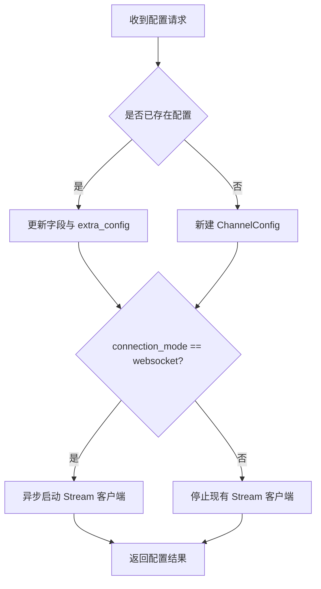
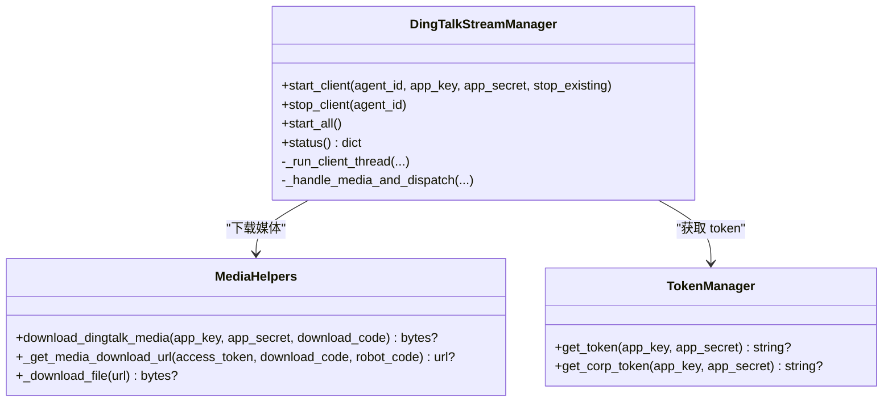
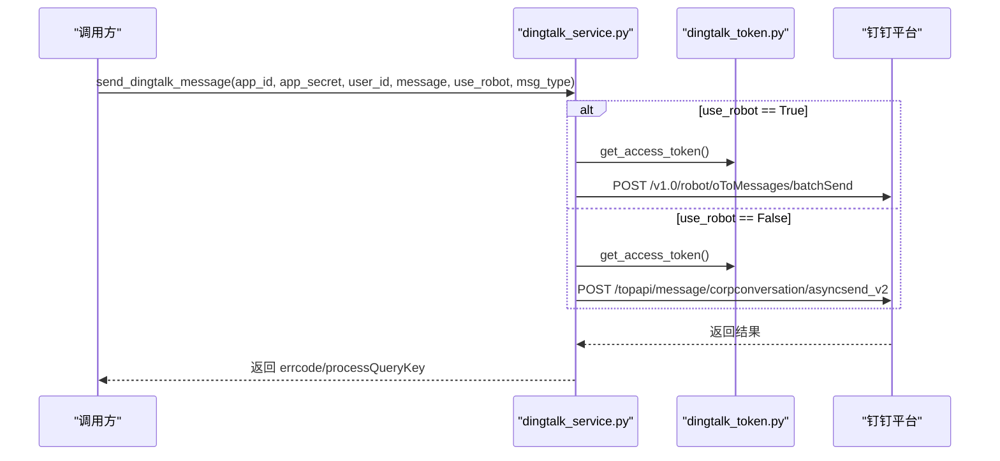
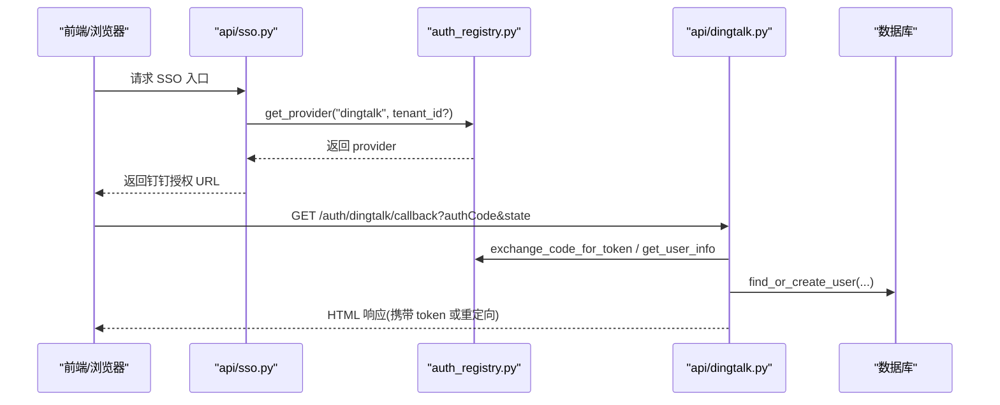
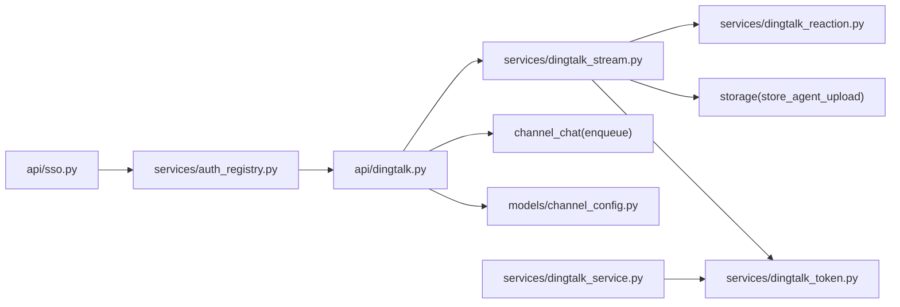

# 钉钉集成

<cite>
**本文引用的文件**   
- [backend/app/api/dingtalk.py](file://backend/app/api/dingtalk.py)
- [backend/app/services/dingtalk_stream.py](file://backend/app/services/dingtalk_stream.py)
- [backend/app/services/dingtalk_service.py](file://backend/app/services/dingtalk_service.py)
- [backend/app/services/dingtalk_token.py](file://backend/app/services/dingtalk_token.py)
- [backend/app/services/dingtalk_reaction.py](file://backend/app/services/dingtalk_reaction.py)
- [backend/app/models/channel_config.py](file://backend/app/models/channel_config.py)
- [backend/app/config.py](file://backend/app/config.py)
- [backend/app/services/auth_registry.py](file://backend/app/services/auth_registry.py)
- [backend/app/api/sso.py](file://backend/app/api/sso.py)
- [frontend/src/components/ChannelConfig.tsx](file://frontend/src/components/ChannelConfig.tsx)
</cite>

## 目录
1. [简介](#简介)
2. [项目结构](#项目结构)
3. [核心组件](#核心组件)
4. [架构总览](#架构总览)
5. [详细组件分析](#详细组件分析)
6. [依赖关系分析](#依赖关系分析)
7. [性能与可靠性](#性能与可靠性)
8. [故障排查指南](#故障排查指南)
9. [结论](#结论)
10. [附录：部署与配置步骤](#附录部署与配置步骤)

## 简介
本文件面向开发者与运维人员，系统化阐述本项目对钉钉开放平台的集成方案，覆盖认证授权、机器人消息收发、事件订阅（Stream 模式）、工作通知、文件上传下载、消息卡片、组织同步等能力。文档同时给出端到端流程图、类图与时序图，帮助快速理解并落地实施。

## 项目结构
后端围绕 FastAPI 路由提供钉钉通道配置与回调处理；服务层封装 Token 管理、Stream 连接、消息发送与媒体处理；模型层持久化通道配置；前端提供通道配置界面与 Stream/Webhook 模式状态展示。

**图表来源** 
- [backend/app/api/dingtalk.py:1-114](file://backend/app/api/dingtalk.py#L1-L114)
- [backend/app/services/dingtalk_stream.py:397-696](file://backend/app/services/dingtalk_stream.py#L397-L696)
- [backend/app/services/dingtalk_service.py:1-175](file://backend/app/services/dingtalk_service.py#L1-L175)
- [backend/app/services/dingtalk_token.py:1-78](file://backend/app/services/dingtalk_token.py#L1-L78)
- [backend/app/services/dingtalk_reaction.py:1-111](file://backend/app/services/dingtalk_reaction.py#L1-L111)
- [backend/app/models/channel_config.py:1-52](file://backend/app/models/channel_config.py#L1-L52)
- [backend/app/config.py:1-268](file://backend/app/config.py#L1-L268)
- [backend/app/services/auth_registry.py:1-230](file://backend/app/services/auth_registry.py#L1-L230)
- [backend/app/api/sso.py:129-153](file://backend/app/api/sso.py#L129-L153)
- [frontend/src/components/ChannelConfig.tsx:995-1010](file://frontend/src/components/ChannelConfig.tsx#L995-L1010)

**章节来源**
- [backend/app/api/dingtalk.py:1-114](file://backend/app/api/dingtalk.py#L1-L114)
- [backend/app/services/dingtalk_stream.py:1-696](file://backend/app/services/dingtalk_stream.py#L1-L696)
- [backend/app/services/dingtalk_service.py:1-175](file://backend/app/services/dingtalk_service.py#L1-L175)
- [backend/app/services/dingtalk_token.py:1-78](file://backend/app/services/dingtalk_token.py#L1-L78)
- [backend/app/services/dingtalk_reaction.py:1-111](file://backend/app/services/dingtalk_reaction.py#L1-L111)
- [backend/app/models/channel_config.py:1-52](file://backend/app/models/channel_config.py#L1-L52)
- [backend/app/config.py:1-268](file://backend/app/config.py#L1-L268)
- [backend/app/services/auth_registry.py:1-230](file://backend/app/services/auth_registry.py#L1-L230)
- [backend/app/api/sso.py:129-153](file://backend/app/api/sso.py#L129-L153)
- [frontend/src/components/ChannelConfig.tsx:995-1010](file://frontend/src/components/ChannelConfig.tsx#L995-L1010)

## 核心组件
- 通道配置与路由：提供 Agent 维度的钉钉通道配置（AppKey/AppSecret、连接模式、AgentId），支持查询与删除。
- Stream 连接管理器：基于 dingtalk-stream SDK 建立 WebSocket 长连接，自动重连，线程隔离运行，统一分发到主事件循环处理消息。
- 消息服务：封装 v1.0 机器人 OTO 私聊与工作通知两种发送路径，统一对外接口。
- Token 管理器：按 app_key 缓存 access_token，提前刷新，并发安全。
- 表情反应：在用户消息上添加“🤔思考中”反应，并在回复完成后撤回。
- 身份提供方注册表：集中管理钉钉等身份提供方实例，用于 SSO 登录流程。

**章节来源**
- [backend/app/api/dingtalk.py:1-114](file://backend/app/api/dingtalk.py#L1-L114)
- [backend/app/services/dingtalk_stream.py:397-696](file://backend/app/services/dingtalk_stream.py#L397-L696)
- [backend/app/services/dingtalk_service.py:1-175](file://backend/app/services/dingtalk_service.py#L1-L175)
- [backend/app/services/dingtalk_token.py:1-78](file://backend/app/services/dingtalk_token.py#L1-L78)
- [backend/app/services/dingtalk_reaction.py:1-111](file://backend/app/services/dingtalk_reaction.py#L1-L111)
- [backend/app/services/auth_registry.py:1-230](file://backend/app/services/auth_registry.py#L1-L230)

## 架构总览
钉钉集成的整体交互包括：
- 配置阶段：通过 API 写入通道配置，选择 Stream/Webhook 模式；若为 Stream，启动独立线程的 Stream 客户端。
- 入站消息：钉钉通过 Stream 推送消息至服务端，解析文本/图片/音视频/文件，下载媒体并保存，构造 LLM 输入，进入运行时队列。
- 出站消息：根据目标类型选择 Webhook 或机器人 OTO/群发消息接口，支持 Markdown、图片、语音、视频、文件等。
- 认证授权：SSO 登录由身份提供方注册表驱动，回调统一处理并签发系统令牌。

**图表来源** 
- [backend/app/api/dingtalk.py:29-95](file://backend/app/api/dingtalk.py#L29-L95)
- [backend/app/services/dingtalk_stream.py:468-557](file://backend/app/services/dingtalk_stream.py#L468-L557)
- [backend/app/services/dingtalk_token.py:31-64](file://backend/app/services/dingtalk_token.py#L31-L64)
- [backend/app/services/dingtalk_service.py:127-158](file://backend/app/services/dingtalk_service.py#L127-L158)

## 详细组件分析

### 通道配置与消息处理（API）
- 配置接口：支持创建/更新/查询/删除 Agent 的钉钉通道配置，包含 AppKey、AppSecret、连接模式（websocket/webhook）、可选的 DingTalk AgentId。
- 消息处理：接收 Stream 回调后，解析对话上下文（私聊/群聊），统一用户解析与会话创建，构建 LLM 输入（含图片标记与文件引用），入队运行时。

**图表来源** 
- [backend/app/api/dingtalk.py:29-95](file://backend/app/api/dingtalk.py#L29-L95)

**章节来源**
- [backend/app/api/dingtalk.py:29-114](file://backend/app/api/dingtalk.py#L29-L114)
- [backend/app/models/channel_config.py:13-52](file://backend/app/models/channel_config.py#L13-L52)

### Stream 连接与消息处理
- 连接管理：每个 Agent 一个独立线程运行 Stream 客户端，捕获主事件循环以便跨线程调度协程；具备指数退避重试与优雅停止。
- 消息解析：支持 text、picture、richText、audio、video、file 等类型；图片/音视频/文件通过 downloadCode 拉取并落盘，构造 base64 标记与本地路径列表供 LLM 使用。
- 反应提示：收到消息后立即添加“🤔思考中”反应，后续可撤回。

**图表来源** 
- [backend/app/services/dingtalk_stream.py:397-696](file://backend/app/services/dingtalk_stream.py#L397-L696)
- [backend/app/services/dingtalk_stream.py:28-78](file://backend/app/services/dingtalk_stream.py#L28-L78)
- [backend/app/services/dingtalk_token.py:14-78](file://backend/app/services/dingtalk_token.py#L14-L78)

**章节来源**
- [backend/app/services/dingtalk_stream.py:1-696](file://backend/app/services/dingtalk_stream.py#L1-L696)
- [backend/app/services/dingtalk_reaction.py:1-111](file://backend/app/services/dingtalk_reaction.py#L1-L111)

### 消息发送与服务
- 统一发送接口：默认走 v1.0 机器人 OTO 私聊；也可切换为工作通知（corpconversation）。
- 媒体发送：先上传媒体获取 mediaId，再按 conversation_type 调用群发或私发接口。

**图表来源** 
- [backend/app/services/dingtalk_service.py:127-158](file://backend/app/services/dingtalk_service.py#L127-L158)
- [backend/app/services/dingtalk_service.py:34-86](file://backend/app/services/dingtalk_service.py#L34-L86)
- [backend/app/services/dingtalk_service.py:88-125](file://backend/app/services/dingtalk_service.py#L88-L125)
- [backend/app/services/dingtalk_token.py:31-64](file://backend/app/services/dingtalk_token.py#L31-L64)

**章节来源**
- [backend/app/services/dingtalk_service.py:1-175](file://backend/app/services/dingtalk_service.py#L1-L175)

### 认证授权与 SSO
- 提供方注册：通过 AuthProviderRegistry 动态加载钉钉身份提供方实例，支持租户级配置。
- 登录回调：/auth/dingtalk/callback 接收 authCode，换取 access_token 并获取用户信息，完成用户解析与系统登录，返回访问令牌或跳转。

**图表来源** 
- [backend/app/api/sso.py:129-153](file://backend/app/api/sso.py#L129-L153)
- [backend/app/services/auth_registry.py:37-88](file://backend/app/services/auth_registry.py#L37-L88)
- [backend/app/api/dingtalk.py:270-351](file://backend/app/api/dingtalk.py#L270-L351)

**章节来源**
- [backend/app/services/auth_registry.py:1-230](file://backend/app/services/auth_registry.py#L1-L230)
- [backend/app/api/sso.py:129-153](file://backend/app/api/sso.py#L129-L153)
- [backend/app/api/dingtalk.py:270-351](file://backend/app/api/dingtalk.py#L270-L351)

### 前端通道配置与模式展示
- 前端在通道配置页展示钉钉 Stream/Webhook 模式状态，Stream 模式下无需回调地址，直接显示 App Key。

**章节来源**
- [frontend/src/components/ChannelConfig.tsx:995-1010](file://frontend/src/components/ChannelConfig.tsx#L995-L1010)

## 依赖关系分析
- API 层依赖：权限检查、数据库会话、通道配置模型、运行时入队函数。
- Stream 层依赖：Token 管理器、存储模块、Reaction 服务、ChannelConfig 模型。
- 服务层依赖：httpx 网络库、日志、Token 管理器。
- 认证层依赖：身份提供方注册表、SSO 会话模型、安全工具。

**图表来源** 
- [backend/app/api/dingtalk.py:1-114](file://backend/app/api/dingtalk.py#L1-L114)
- [backend/app/services/dingtalk_stream.py:1-696](file://backend/app/services/dingtalk_stream.py#L1-L696)
- [backend/app/services/dingtalk_service.py:1-175](file://backend/app/services/dingtalk_service.py#L1-L175)
- [backend/app/services/dingtalk_token.py:1-78](file://backend/app/services/dingtalk_token.py#L1-L78)
- [backend/app/services/dingtalk_reaction.py:1-111](file://backend/app/services/dingtalk_reaction.py#L1-L111)
- [backend/app/services/auth_registry.py:1-230](file://backend/app/services/auth_registry.py#L1-L230)
- [backend/app/api/sso.py:129-153](file://backend/app/api/sso.py#L129-L153)

**章节来源**
- [backend/app/api/dingtalk.py:1-114](file://backend/app/api/dingtalk.py#L1-L114)
- [backend/app/services/dingtalk_stream.py:1-696](file://backend/app/services/dingtalk_stream.py#L1-L696)
- [backend/app/services/dingtalk_service.py:1-175](file://backend/app/services/dingtalk_service.py#L1-L175)
- [backend/app/services/dingtalk_token.py:1-78](file://backend/app/services/dingtalk_token.py#L1-L78)
- [backend/app/services/dingtalk_reaction.py:1-111](file://backend/app/services/dingtalk_reaction.py#L1-L111)
- [backend/app/services/auth_registry.py:1-230](file://backend/app/services/auth_registry.py#L1-L230)
- [backend/app/api/sso.py:129-153](file://backend/app/api/sso.py#L129-L153)

## 性能与可靠性
- Token 缓存：按 app_key 缓存，过期前 300s 主动刷新，避免频繁请求；并发锁保证一致性。
- Stream 连接：独立线程运行 SDK 事件循环，主进程负责业务协程调度；断线自动重试，指数退避策略。
- 媒体处理：下载失败时降级提示；大文件上传/下载设置超时与重定向跟随。
- 反应提示：非阻塞“思考中”反应提升用户体验，失败不阻断主流程。

[本节为通用指导，不直接分析具体文件]

## 故障排查指南
- 无法获取 access_token：检查 AppKey/AppSecret 是否正确；查看 Token 管理器日志与网络连通性。
- Stream 连接失败：确认 SDK 已安装；检查网络代理与防火墙；观察重试日志与退避间隔。
- 媒体下载失败：核对 downloadCode 有效性；检查下载 URL 可达性与权限；查看存储路径权限。
- 消息未送达：检查 session_webhook 是否有效；确认机器人权限与目标用户/群组范围。
- SSO 登录失败：确认回调地址配置正确；检查 state 参数与租户上下文；查看提供方配置是否激活。

**章节来源**
- [backend/app/services/dingtalk_token.py:31-64](file://backend/app/services/dingtalk_token.py#L31-L64)
- [backend/app/services/dingtalk_stream.py:450-608](file://backend/app/services/dingtalk_stream.py#L450-L608)
- [backend/app/services/dingtalk_stream.py:28-78](file://backend/app/services/dingtalk_stream.py#L28-L78)
- [backend/app/api/dingtalk.py:270-351](file://backend/app/api/dingtalk.py#L270-L351)

## 结论
本项目对钉钉的集成以 Stream 模式为核心，结合统一的 Token 管理与媒体处理能力，实现了高可靠的消息收发与丰富的多模态交互。通过身份提供方注册表与 SSO 回调，打通企业级认证与组织架构同步的基础。建议在生产环境启用 Stream 模式以获得更稳定的实时通信体验，并结合错误日志与监控指标持续优化。

[本节为总结性内容，不直接分析具体文件]

## 附录：部署与配置步骤
- 创建钉钉应用
  - 在钉钉开放平台创建企业内部应用，启用机器人能力，记录 AppKey/AppSecret。
  - 如需工作通知，确保应用具备相应权限。
- 配置通道
  - 调用后端接口配置 Agent 的钉钉通道，选择 connection_mode=websocket（推荐）或 webhook。
  - 若选择 websocket，系统将自动启动 Stream 客户端，无需额外回调地址。
- 设置回调地址（仅 Webhook 模式）
  - 在钉钉开放平台将回调地址指向后端提供的 Webhook 端点（如需要）。
- 权限与回调
  - 在 SSO 入口配置钉钉身份提供方，设置回调地址为 /api/auth/dingtalk/callback。
  - 确保回调域名与公网可达。
- 组织与成员同步
  - 在前端企业设置页面触发目录同步，验证部门与成员数据是否正确导入。
- 测试与验证
  - 在钉钉群或私聊中向机器人发送文本、图片、音视频、文件，验证消息流转与回复。
  - 检查工作通知与机器人 OTO 消息是否正常下发。

[本节为操作指引，不直接分析具体文件]