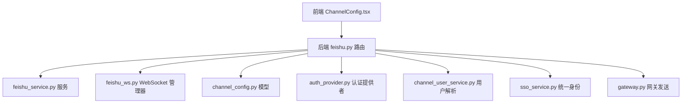
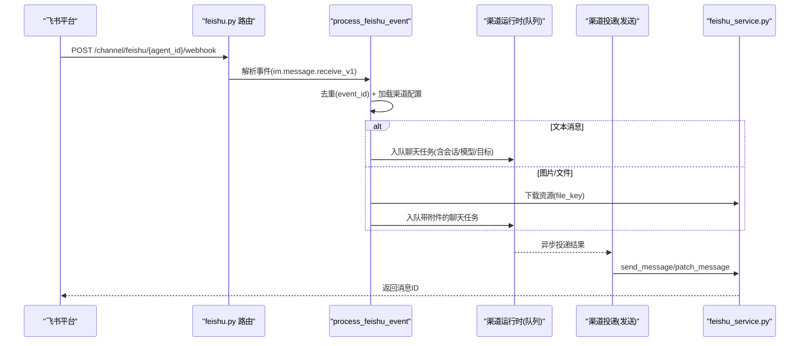
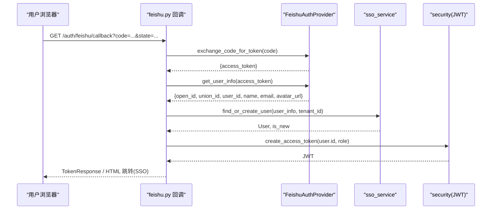
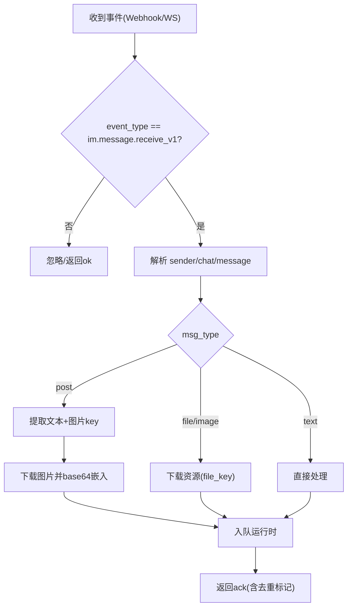
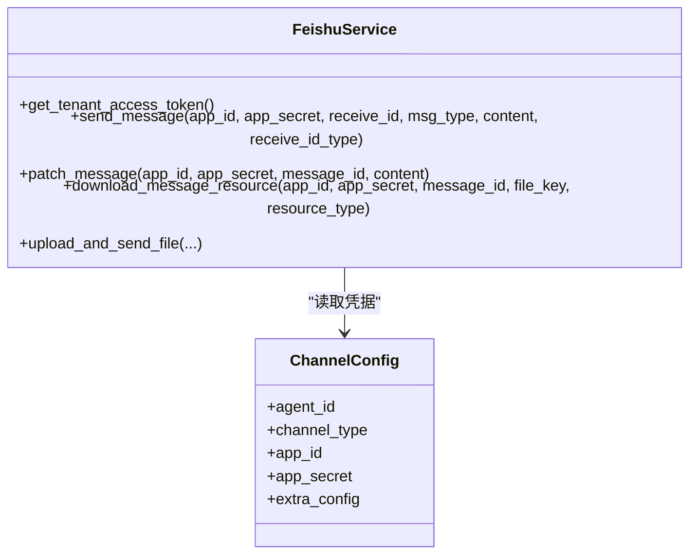
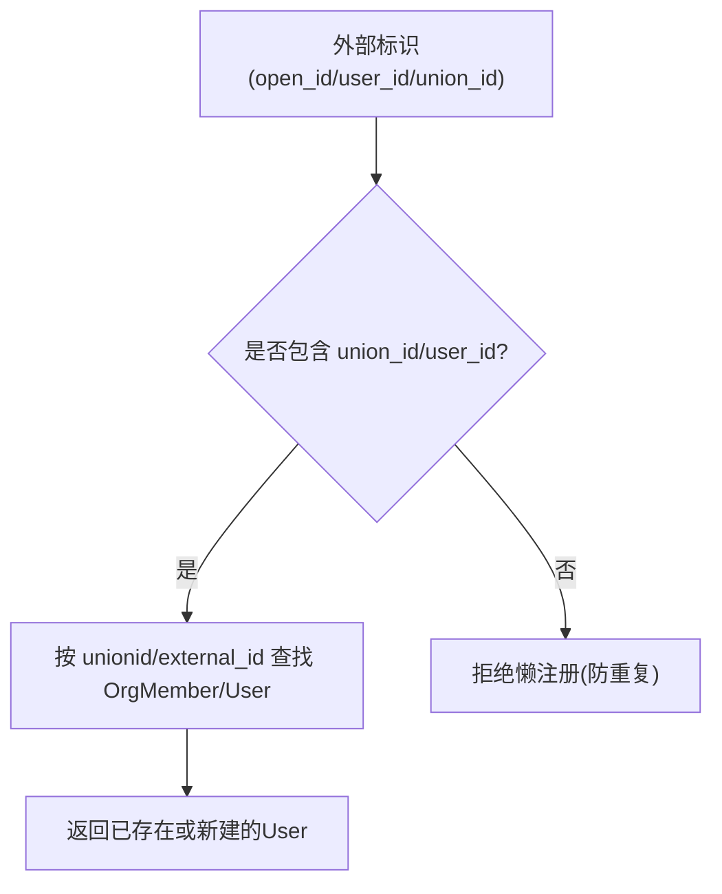
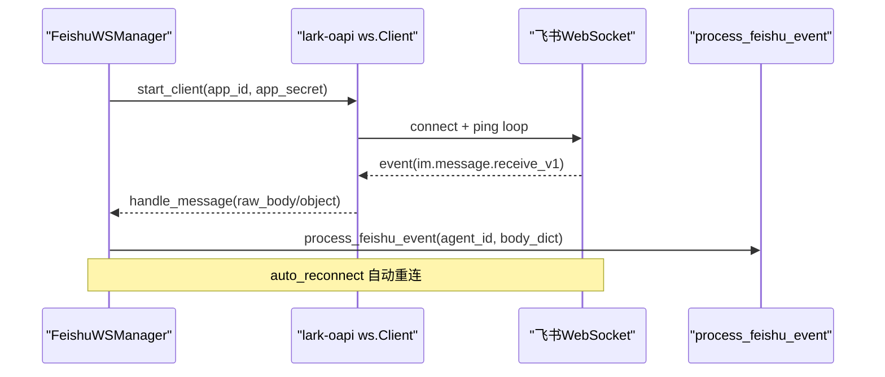
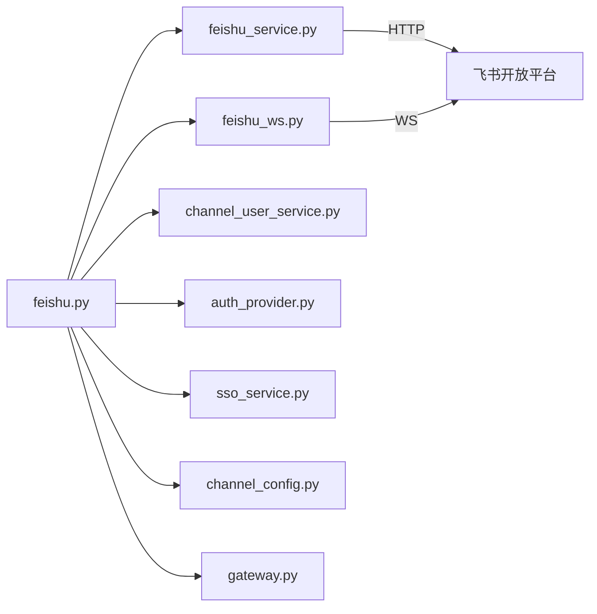

# 飞书集成

<cite>
**本文引用的文件**   
- [backend/app/api/feishu.py](file://backend/app/api/feishu.py)
- [backend/app/services/feishu_service.py](file://backend/app/services/feishu_service.py)
- [backend/app/services/feishu_ws.py](file://backend/app/services/feishu_ws.py)
- [backend/app/models/channel_config.py](file://backend/app/models/channel_config.py)
- [backend/app/services/auth_provider.py](file://backend/app/services/auth_provider.py)
- [backend/app/services/channel_user_service.py](file://backend/app/services/channel_user_service.py)
- [backend/app/services/sso_service.py](file://backend/app/services/sso_service.py)
- [frontend/src/components/ChannelConfig.tsx](file://frontend/src/components/ChannelConfig.tsx)
- [backend/app/api/gateway.py](file://backend/app/api/gateway.py)
</cite>

## 目录
1. [简介](#简介)
2. [项目结构](#项目结构)
3. [核心组件](#核心组件)
4. [架构总览](#架构总览)
5. [详细组件分析](#详细组件分析)
6. [依赖关系分析](#依赖关系分析)
7. [性能与可靠性](#性能与可靠性)
8. [故障排查指南](#故障排查指南)
9. [结论](#结论)
10. [附录：配置与权限清单](#附录配置与权限清单)

## 简介
本文件面向需要集成飞书的开发者与运维人员，系统性说明以下能力：
- 认证授权流程（OAuth 回调、应用级令牌、用户身份映射）
- 事件订阅机制（Webhook 与 WebSocket 双通道）
- 消息收发接口（私聊、群聊、富文本与图片、文件上传下载）
- 工作群与私聊会话管理、用户身份稳定映射（open_id/user_id/union_id）
- WebSocket 实时通信、事件处理、错误重试与去重
- 应用配置步骤、权限设置、回调 URL 配置
- 常见问题排查方法与性能优化建议

## 项目结构
后端围绕 FastAPI 路由、服务层与模型组织飞书集成：
- API 路由：处理 OAuth 回调、渠道配置、事件 Webhook
- 服务层：封装飞书 HTTP API、WebSocket 长连接、消息发送/下载、文档/多维表格等扩展能力
- 模型层：存储渠道配置（app_id/app_secret/加密参数等）
- 前端：提供渠道配置界面与完整权限 JSON 展示

图表来源
- [backend/app/api/feishu.py:1-120](file://backend/app/api/feishu.py#L1-L120)
- [backend/app/services/feishu_service.py:1-120](file://backend/app/services/feishu_service.py#L1-L120)
- [backend/app/services/feishu_ws.py:1-120](file://backend/app/services/feishu_ws.py#L1-L120)
- [backend/app/models/channel_config.py:1-52](file://backend/app/models/channel_config.py#L1-L52)
- [backend/app/services/auth_provider.py:1-120](file://backend/app/services/auth_provider.py#L1-L120)
- [backend/app/services/channel_user_service.py:71-213](file://backend/app/services/channel_user_service.py#L71-L213)
- [backend/app/services/sso_service.py:257-388](file://backend/app/services/sso_service.py#L257-L388)
- [frontend/src/components/ChannelConfig.tsx:254-300](file://frontend/src/components/ChannelConfig.tsx#L254-L300)
- [backend/app/api/gateway.py:513-570](file://backend/app/api/gateway.py#L513-L570)

章节来源
- [backend/app/api/feishu.py:1-120](file://backend/app/api/feishu.py#L1-L120)
- [backend/app/services/feishu_service.py:1-120](file://backend/app/services/feishu_service.py#L1-L120)
- [backend/app/services/feishu_ws.py:1-120](file://backend/app/services/feishu_ws.py#L1-L120)
- [backend/app/models/channel_config.py:1-52](file://backend/app/models/channel_config.py#L1-L52)
- [backend/app/services/auth_provider.py:1-120](file://backend/app/services/auth_provider.py#L1-L120)
- [backend/app/services/channel_user_service.py:71-213](file://backend/app/services/channel_user_service.py#L71-L213)
- [backend/app/services/sso_service.py:257-388](file://backend/app/services/sso_service.py#L257-L388)
- [frontend/src/components/ChannelConfig.tsx:254-300](file://frontend/src/components/ChannelConfig.tsx#L254-L300)
- [backend/app/api/gateway.py:513-570](file://backend/app/api/gateway.py#L513-L570)

## 核心组件
- 飞书 OAuth 回调与用户登录：通过 /api/auth/feishu/callback 完成 code 换 token、获取用户信息、创建或匹配本地用户并签发 JWT。
- 渠道配置：为每个 Agent 绑定飞书机器人凭据（app_id/app_secret/encrypt_key/verification_token），支持 webhook 或 websocket 两种接收模式。
- 事件处理：统一入口 process_feishu_event 处理 im.message.receive_v1，支持文本、post（富文本）、image/file 资源下载与附件处理。
- 消息发送：通过 feishu_service.send_message 向 open_id/user_id/chat_id 发送文本；支持 patch 更新消息（用于流式卡片）。
- WebSocket 长连接：FeishuWSManager 维护 lark-oapi 客户端，自动重连、心跳与健康监控，事件转发至统一处理器。
- 用户身份映射：优先 union_id/user_id，其次 open_id；拒绝仅凭 open_id 懒注册重复用户，保证跨应用稳定性。

章节来源
- [backend/app/api/feishu.py:36-126](file://backend/app/api/feishu.py#L36-L126)
- [backend/app/api/feishu.py:128-236](file://backend/app/api/feishu.py#L128-L236)
- [backend/app/api/feishu.py:388-577](file://backend/app/api/feishu.py#L388-L577)
- [backend/app/services/feishu_service.py:343-408](file://backend/app/services/feishu_service.py#L343-L408)
- [backend/app/services/feishu_ws.py:91-210](file://backend/app/services/feishu_ws.py#L91-L210)
- [backend/app/services/channel_user_service.py:71-213](file://backend/app/services/channel_user_service.py#L71-L213)

## 架构总览
下图展示了从飞书事件到内部运行时处理的端到端路径，以及消息回发路径。

图表来源
- [backend/app/api/feishu.py:388-577](file://backend/app/api/feishu.py#L388-L577)
- [backend/app/services/feishu_service.py:343-408](file://backend/app/services/feishu_service.py#L343-L408)

章节来源
- [backend/app/api/feishu.py:388-577](file://backend/app/api/feishu.py#L388-L577)
- [backend/app/services/feishu_service.py:343-408](file://backend/app/services/feishu_service.py#L343-L408)

## 详细组件分析

### 认证授权流程（OAuth 回调）
- 入口：GET/POST /api/auth/feishu/callback
- 流程要点：
  - 使用 FeishuAuthProvider 交换 code 为 access_token，再拉取用户信息
  - 通过 sso_service 基于 union_id/user_id/open_id 链查找或创建用户
  - 生成 JWT 并返回；SSO 场景下写入 SSOScanSession 并跳转前端完成页

图表来源
- [backend/app/api/feishu.py:36-126](file://backend/app/api/feishu.py#L36-L126)
- [backend/app/services/auth_provider.py:98-164](file://backend/app/services/auth_provider.py#L98-L164)
- [backend/app/services/sso_service.py:257-388](file://backend/app/services/sso_service.py#L257-L388)

章节来源
- [backend/app/api/feishu.py:36-126](file://backend/app/api/feishu.py#L36-L126)
- [backend/app/services/auth_provider.py:98-164](file://backend/app/services/auth_provider.py#L98-L164)
- [backend/app/services/sso_service.py:257-388](file://backend/app/services/sso_service.py#L257-L388)

### 事件订阅机制（Webhook 与 WebSocket）
- Webhook：POST /channel/feishu/{agent_id}/webhook
  - 校验 challenge（首次验证）
  - 解析 header.event_type 与 event 体，统一进入 process_feishu_event
  - 支持 post 富文本转 text + 图片 base64 嵌入；file/image 下载后以附件形式入队
  - 内存去重：_processed_events 集合，避免飞书重试导致重复处理
- WebSocket：FeishuWSManager.start_client
  - 使用 lark-oapi ws.Client，auto_reconnect=True
  - 事件分发器将 raw_body 或对象转换为标准 body_dict，调用 process_feishu_event
  - 健康监控：每 30s 检查连接状态，记录断连/恢复日志

图表来源
- [backend/app/api/feishu.py:388-577](file://backend/app/api/feishu.py#L388-L577)
- [backend/app/services/feishu_ws.py:91-210](file://backend/app/services/feishu_ws.py#L91-L210)

章节来源
- [backend/app/api/feishu.py:388-577](file://backend/app/api/feishu.py#L388-L577)
- [backend/app/services/feishu_ws.py:91-210](file://backend/app/services/feishu_ws.py#L91-L210)

### 消息收发接口（私聊、群聊、富文本、文件）
- 私聊：receive_id_type=open_id 或 user_id（优先 user_id 跨应用稳定）
- 群聊：receive_id_type=chat_id
- 富文本 post：解析 content 段落与链接，提取 image_key 并下载为 base64 嵌入
- 文件/图片：download_message_resource 下载后存入工作区，运行时以附件提示消费
- 消息更新：patch_message 用于流式卡片增量更新

图表来源
- [backend/app/services/feishu_service.py:343-408](file://backend/app/services/feishu_service.py#L343-L408)
- [backend/app/models/channel_config.py:1-52](file://backend/app/models/channel_config.py#L1-L52)

章节来源
- [backend/app/services/feishu_service.py:343-408](file://backend/app/services/feishu_service.py#L343-L408)
- [backend/app/models/channel_config.py:1-52](file://backend/app/models/channel_config.py#L1-L52)

### 用户身份映射（open_id/user_id/union_id）
- 优先级：union_id > external_id(user_id) > open_id
- 若仅 open_id 无法解析稳定用户，拒绝懒注册，防止重复账号
- SSO 链路中，extract_identity_ids/_identity_lookup_chain 确保 union_id/user_id/open_id 正确填充

图表来源
- [backend/app/services/channel_user_service.py:71-213](file://backend/app/services/channel_user_service.py#L71-L213)
- [backend/app/services/sso_service.py:257-388](file://backend/app/services/sso_service.py#L257-L388)

章节来源
- [backend/app/services/channel_user_service.py:71-213](file://backend/app/services/channel_user_service.py#L71-L213)
- [backend/app/services/sso_service.py:257-388](file://backend/app/services/sso_service.py#L257-L388)

### WebSocket 实时通信与重连
- 启动：根据 ChannelConfig.extra_config.connection_mode 决定是否启用 WS
- 连接：lark-oapi ws.Client(auto_reconnect=True)，内部维护 _connect/_ping_loop
- 事件：_create_event_handler 注册 im.message.receive_v1，转发到 process_feishu_event
- 健康：每 30s 检查 conn.closed/_conn_id，记录断连/恢复与连接 ID 变化

图表来源
- [backend/app/services/feishu_ws.py:211-346](file://backend/app/services/feishu_ws.py#L211-L346)
- [backend/app/api/feishu.py:388-577](file://backend/app/api/feishu.py#L388-L577)

章节来源
- [backend/app/services/feishu_ws.py:211-346](file://backend/app/services/feishu_ws.py#L211-L346)
- [backend/app/api/feishu.py:388-577](file://backend/app/api/feishu.py#L388-L577)

### 渠道配置与回调 URL
- 配置接口：POST /agents/{agent_id}/channel（保存 app_id/app_secret/encrypt_key/verification_token/extra_config）
- 查询接口：GET /agents/{agent_id}/channel
- 删除接口：DELETE /agents/{agent_id}/channel
- 获取 Webhook URL：GET /agents/{agent_id}/channel/webhook-url（由 platform_service 计算公网基址拼接）

章节来源
- [backend/app/api/feishu.py:128-236](file://backend/app/api/feishu.py#L128-L236)

## 依赖关系分析
- API 层依赖：
  - feishu_service：HTTP 调用（token、消息、资源、文档、多维表格等）
  - feishu_ws：WebSocket 长连接与事件分发
  - channel_user_service：跨渠道用户解析与 OrgMember 关联
  - auth_provider/sso_service：统一身份与用户生命周期
  - gateway：统一对外发送（优先 user_id，失败回退 open_id）
- 数据模型：
  - ChannelConfig：存储 per-agent 的飞书凭据与扩展配置

图表来源
- [backend/app/api/feishu.py:1-120](file://backend/app/api/feishu.py#L1-L120)
- [backend/app/services/feishu_service.py:1-120](file://backend/app/services/feishu_service.py#L1-L120)
- [backend/app/services/feishu_ws.py:1-120](file://backend/app/services/feishu_ws.py#L1-L120)
- [backend/app/services/channel_user_service.py:71-213](file://backend/app/services/channel_user_service.py#L71-L213)
- [backend/app/services/auth_provider.py:1-120](file://backend/app/services/auth_provider.py#L1-L120)
- [backend/app/services/sso_service.py:257-388](file://backend/app/services/sso_service.py#L257-L388)
- [backend/app/models/channel_config.py:1-52](file://backend/app/models/channel_config.py#L1-L52)
- [backend/app/api/gateway.py:513-570](file://backend/app/api/gateway.py#L513-L570)

章节来源
- [backend/app/api/feishu.py:1-120](file://backend/app/api/feishu.py#L1-L120)
- [backend/app/services/feishu_service.py:1-120](file://backend/app/services/feishu_service.py#L1-L120)
- [backend/app/services/feishu_ws.py:1-120](file://backend/app/services/feishu_ws.py#L1-L120)
- [backend/app/services/channel_user_service.py:71-213](file://backend/app/services/channel_user_service.py#L71-L213)
- [backend/app/services/auth_provider.py:1-120](file://backend/app/services/auth_provider.py#L1-L120)
- [backend/app/services/sso_service.py:257-388](file://backend/app/services/sso_service.py#L257-L388)
- [backend/app/models/channel_config.py:1-52](file://backend/app/models/channel_config.py#L1-L52)
- [backend/app/api/gateway.py:513-570](file://backend/app/api/gateway.py#L513-L570)

## 性能与可靠性
- 事件去重：内存集合 _processed_events 限制大小，避免重复处理与内存泄漏
- 令牌缓存：FeishuService 对默认 app 的 tenant_access_token 进行缓存，减少频繁请求
- 客户端池：lark-oapi Client 实例按 (app_id, app_secret) 键值 LRU 缓存，上限 50，控制内存占用
- 超时与重试：HTTP 调用设置合理 timeout；WS 自动重连；5xx/网络异常分类为可重试，4xx/权限问题为非重试
- 并发与解耦：事件处理入队运行时无阻塞，发送与下载并行化
- 健康监控：WS 每 30s 检查连接状态，记录断连/恢复与连接 ID 变更，便于定位

章节来源
- [backend/app/api/feishu.py:388-577](file://backend/app/api/feishu.py#L388-L577)
- [backend/app/services/feishu_service.py:86-155](file://backend/app/services/feishu_service.py#L86-L155)
- [backend/app/services/feishu_ws.py:299-346](file://backend/app/services/feishu_ws.py#L299-L346)

## 故障排查指南
- OAuth 回调失败
  - 检查 FEISHU_APP_ID/FEISHU_APP_SECRET 是否正确
  - 确认回调地址与 state 传递一致
  - 查看 FeishuAuthProvider 与 sso_service 日志
- Webhook 未触发或重复处理
  - 确认回调 URL 已在飞书后台配置且 challenge 验证通过
  - 检查 _processed_events 去重逻辑与 event_id 是否存在
- 文件/图片下载失败
  - 确认机器人具备 im:resource 权限
  - 检查 file_key 与 message_id 是否正确
  - 关注 download_message_resource 的 HTTP 状态码与业务 code
- 用户解析失败（仅 open_id）
  - 确保能从 Contact API 获取 user_id/union_id
  - 检查 channel_user_service 的解析策略与 OrgMember 绑定
- WebSocket 连接不稳定
  - 检查 lark-oapi 安装与环境代理设置（模块内临时绕过系统代理）
  - 观察健康监控日志中的断连/恢复与连接 ID 变化
- 发送消息失败
  - 优先 user_id，失败回退 open_id
  - 检查 receive_id_type 与 receive_id 是否匹配
  - 查看 feishu_service._parse_api_response 的错误详情（http_status/code/msg/log_id/troubleshooter）

章节来源
- [backend/app/api/feishu.py:388-577](file://backend/app/api/feishu.py#L388-L577)
- [backend/app/services/feishu_service.py:96-155](file://backend/app/services/feishu_service.py#L96-L155)
- [backend/app/services/channel_user_service.py:71-213](file://backend/app/services/channel_user_service.py#L71-L213)
- [backend/app/services/feishu_ws.py:299-346](file://backend/app/services/feishu_ws.py#L299-L346)
- [backend/app/api/gateway.py:513-570](file://backend/app/api/gateway.py#L513-L570)

## 结论
本集成方案通过“Webhook + WebSocket”双通道保障事件可靠到达，结合统一的 process_feishu_event 与严格的身份映射策略，实现了稳定的私聊/群聊交互与文件处理能力。配合完善的权限清单与前端配置界面，能够快速落地企业级飞书机器人场景。在生产环境建议开启 WS 模式以获得更好的实时性与容错性，并结合健康监控与重试策略提升整体可用性。

## 附录：配置与权限清单
- 应用配置步骤
  - 在飞书开放平台创建应用，获取 App ID/App Secret
  - 在平台后台配置回调 URL（Webhook）或启用 WebSocket 长连接
  - 在系统中通过 /agents/{agent_id}/channel 配置凭据与 extra_config（connection_mode）
  - 如需 SSO，确保回调地址与 state 传递正确
- 必要权限（tenant 级别）
  - 消息与资源：im:message、im:message.p2p_msg:readonly、im:message.group_at_msg:readonly、im:resource、im:message:send_as_bot
  - 通讯录：contact:user.base:readonly、contact:user.employee_id:readonly、contact:user.id:readonly
  - 文档与知识库：docx:document、docx:document:create、wiki:wiki、wiki:wiki:readonly
  - 多维表格：bitable:app、bitable:app:readonly
  - 审批：approval:approval
  - 其他可选：calendar、drive、sheets、slides 等按需开启
- 回调 URL 配置
  - Webhook：/api/channel/feishu/{agent_id}/webhook
  - 可通过 /agents/{agent_id}/channel/webhook-url 获取完整公网地址
- 常见错误码与处理
  - HTTP 4xx：非重试（如权限不足、参数错误）
  - HTTP 5xx/超时：可重试（网络抖动或服务不可用）
  - 业务 code != 0：根据 msg/log_id/troubleshooter 定位问题

章节来源
- [frontend/src/components/ChannelConfig.tsx:254-300](file://frontend/src/components/ChannelConfig.tsx#L254-L300)
- [backend/app/api/feishu.py:128-236](file://backend/app/api/feishu.py#L128-L236)
- [backend/app/services/feishu_service.py:96-155](file://backend/app/services/feishu_service.py#L96-L155)