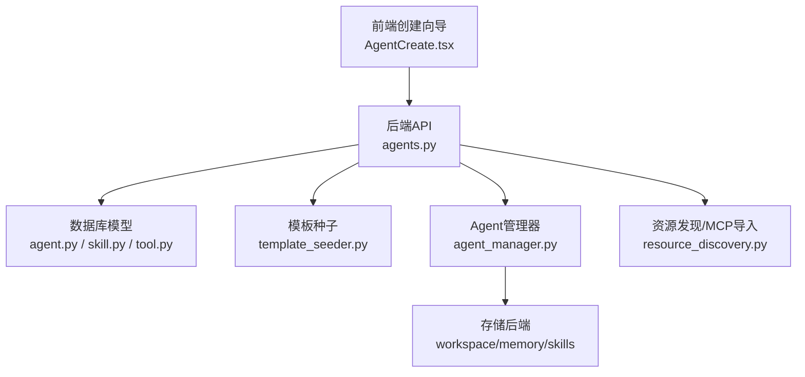
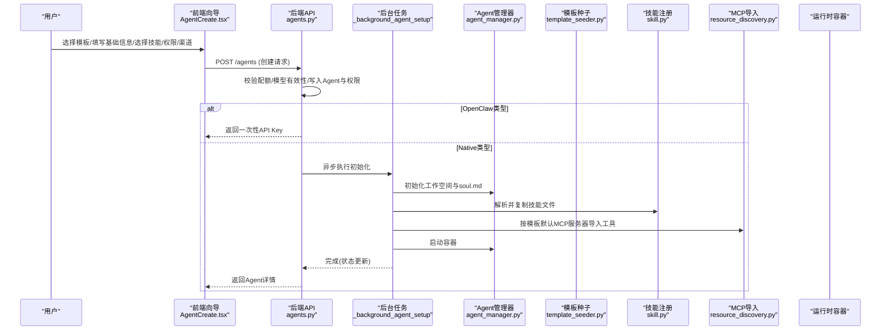
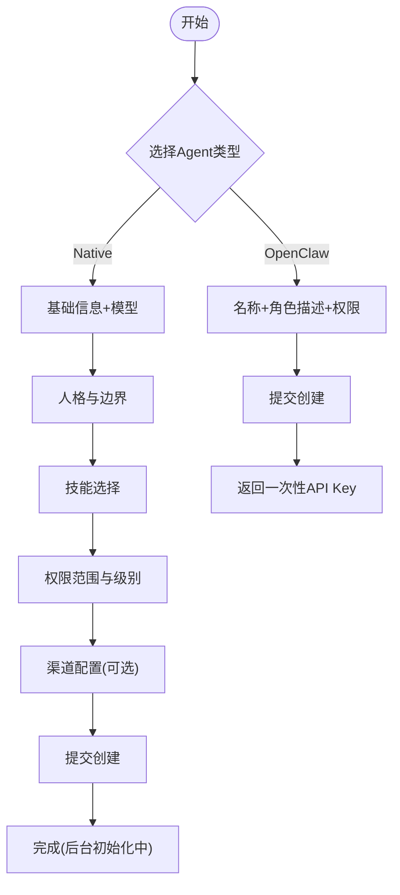
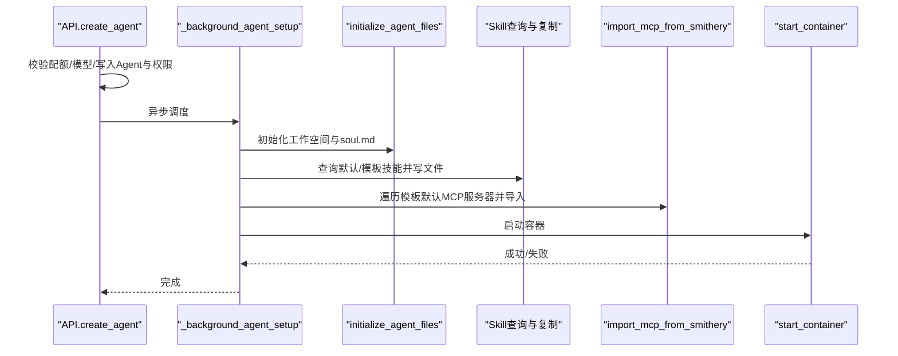
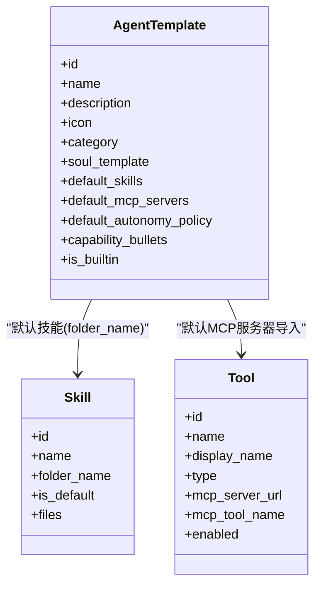
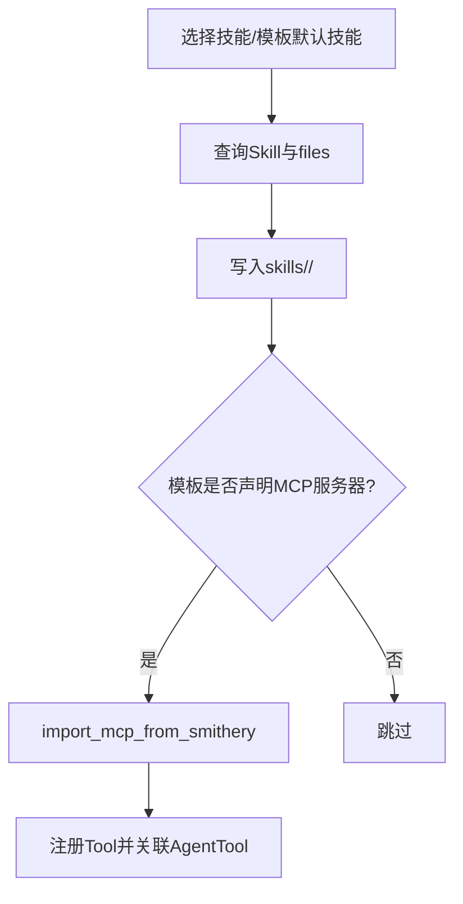
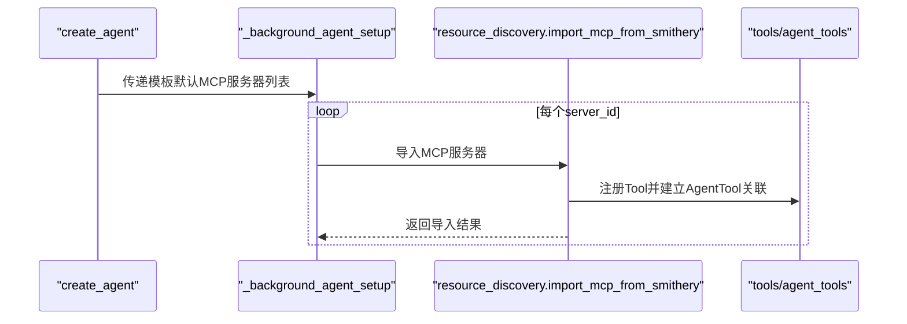
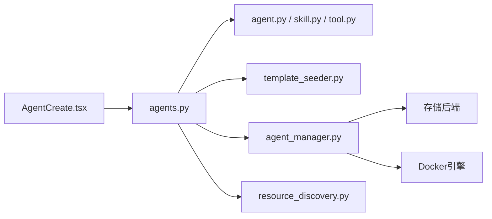

# Agent创建与配置

<cite>
**本文引用的文件**   
- [AgentCreate.tsx](file://frontend/src/pages/AgentCreate.tsx)
- [agents.py](file://backend/app/api/agents.py)
- [agent_manager.py](file://backend/app/services/agent_manager.py)
- [template_seeder.py](file://backend/app/services/template_seeder.py)
- [agent.py](file://backend/app/models/agent.py)
- [skill.py](file://backend/app/models/skill.py)
- [tool.py](file://backend/app/models/tool.py)
- [resource_discovery.py](file://backend/app/services/resource_discovery.py)
- [meta.yaml（后端架构师）](file://backend/agent_templates/backend-architect/meta.yaml)
- [soul.md（后端架构师）](file://backend/agent_templates/backend-architect/soul.md)
- [meta.yaml（私人助理）](file://backend/agent_templates/private-assistant/meta.yaml)
- [soul.md（私人助理）](file://backend/agent_templates/private-assistant/soul.md)
- [meta.yaml（代码评审员）](file://backend/agent_templates/code-reviewer/meta.yaml)
- [soul.md（代码评审员）](file://backend/agent_templates/code-reviewer/soul.md)
</cite>

## 目录
1. [简介](#简介)
2. [项目结构](#项目结构)
3. [核心组件](#核心组件)
4. [架构总览](#架构总览)
5. [详细组件分析](#详细组件分析)
6. [依赖关系分析](#依赖关系分析)
7. [性能考虑](#性能考虑)
8. [故障排查指南](#故障排查指南)
9. [结论](#结论)
10. [附录：模板与最佳实践](#附录模板与最佳实践)

## 简介
本指南面向通过Web界面创建和配置Agent的用户与管理员，覆盖以下主题：
- 如何通过向导式页面创建新Agent（名称、描述、系统提示词、模型选择、权限范围、技能包安装、渠道绑定等）
- Agent模板系统的结构与使用方法（meta.yaml、soul.md、默认能力与自主策略）
- 常见Agent类型的配置示例与最佳实践建议
- 工具集成（MCP服务器）的自动安装与绑定流程

## 项目结构
- 前端创建向导：位于前端页面，提供多步骤表单与渠道配置组件。
- 后端API：负责校验、持久化、后台任务编排（初始化工作空间、技能复制、MCP预装、容器启动）。
- 模板种子：启动时从文件夹加载模板元数据与soul模板，合并到数据库。
- 运行时管理：根据模板生成并写入Agent工作空间文件，渲染soul.md，启动容器。

**图表来源** 
- [AgentCreate.tsx:1-716](file://frontend/src/pages/AgentCreate.tsx#L1-L716)
- [agents.py:409-590](file://backend/app/api/agents.py#L409-L590)
- [template_seeder.py:218-339](file://backend/app/services/template_seeder.py#L218-L339)
- [agent_manager.py:94-229](file://backend/app/services/agent_manager.py#L94-L229)
- [resource_discovery.py:920-1151](file://backend/app/services/resource_discovery.py#L920-L1151)

**章节来源**
- [AgentCreate.tsx:1-716](file://frontend/src/pages/AgentCreate.tsx#L1-L716)
- [agents.py:409-590](file://backend/app/api/agents.py#L409-L590)
- [template_seeder.py:218-339](file://backend/app/services/template_seeder.py#L218-L339)
- [agent_manager.py:94-229](file://backend/app/services/agent_manager.py#L94-L229)

## 核心组件
- 前端创建向导（Native/OpenClaw双模式）
  - Native模式：多步向导（基础信息→人格与边界→技能→权限→渠道），支持令牌限额、主/备模型选择、公司/个人/自定义权限范围。
  - OpenClaw模式：仅填写名称与角色描述，权限范围设置后返回一次性API Key用于外部Agent对接。
- 后端创建API
  - 校验配额与模型有效性，写入Agent记录与权限，OpenClaw类型直接返回API Key；Native类型触发后台任务完成后续初始化。
- 模板种子服务
  - 启动时扫描文件夹模板（meta.yaml + soul.md），合并历史Python模板，去重并upsert至数据库。
- Agent管理器
  - 基于模板初始化工作空间、渲染soul.md（替换占位符、插入用户输入的人格与边界）、确保memory/reflections/HEARTBEAT等文件存在、启动容器。
- 技能与工具
  - 技能包按folder_name复制到Agent工作区skills目录；模板可声明默认技能与MCP服务器ID，创建时自动导入并绑定工具。

**章节来源**
- [AgentCreate.tsx:1-716](file://frontend/src/pages/AgentCreate.tsx#L1-L716)
- [agents.py:409-590](file://backend/app/api/agents.py#L409-L590)
- [template_seeder.py:218-339](file://backend/app/services/template_seeder.py#L218-L339)
- [agent_manager.py:94-229](file://backend/app/services/agent_manager.py#L94-L229)
- [skill.py:1-44](file://backend/app/models/skill.py#L1-L44)
- [tool.py:1-63](file://backend/app/models/tool.py#L1-L63)

## 架构总览
下图展示从“选择模板”到“Agent可用”的端到端流程，包括前台交互、后台任务、模板渲染、技能与MCP安装、容器启动。

**图表来源** 
- [AgentCreate.tsx:1-716](file://frontend/src/pages/AgentCreate.tsx#L1-L716)
- [agents.py:409-590](file://backend/app/api/agents.py#L409-L590)
- [agents.py:242-407](file://backend/app/api/agents.py#L242-L407)
- [agent_manager.py:94-229](file://backend/app/services/agent_manager.py#L94-L229)
- [template_seeder.py:218-339](file://backend/app/services/template_seeder.py#L218-L339)
- [resource_discovery.py:920-1151](file://backend/app/services/resource_discovery.py#L920-L1151)

## 详细组件分析

### 前端创建向导（Native与OpenClaw）
- 步骤划分
  - 基础信息：名称、角色描述、主/备模型、每日/每月令牌上限
  - 人格与边界：注入到soul.md的对应章节
  - 技能：勾选全局技能（含默认必选技能）
  - 权限：公司/个人/自定义，访问级别（使用/管理）
  - 渠道：可选绑定飞书、Slack、Discord、企业微信等
- OpenClaw模式
  - 仅需名称与角色描述，完成后返回一次性API Key，便于外部Agent连接平台网关

**图表来源** 
- [AgentCreate.tsx:1-716](file://frontend/src/pages/AgentCreate.tsx#L1-L716)

**章节来源**
- [AgentCreate.tsx:1-716](file://frontend/src/pages/AgentCreate.tsx#L1-L716)

### 后端创建API与后台任务
- 创建流程要点
  - 校验租户配额与模型有效性
  - 写入Agent与权限记录
  - OpenClaw类型：生成并返回一次性API Key
  - Native类型：进入后台任务，顺序执行：
    1) 初始化工作空间与soul.md
    2) 解析并复制技能文件
    3) 按模板默认MCP服务器导入工具
    4) 启动容器并回调OKR钩子

**图表来源** 
- [agents.py:409-590](file://backend/app/api/agents.py#L409-L590)
- [agents.py:242-407](file://backend/app/api/agents.py#L242-L407)
- [agent_manager.py:94-229](file://backend/app/services/agent_manager.py#L94-L229)
- [resource_discovery.py:920-1151](file://backend/app/services/resource_discovery.py#L920-L1151)

**章节来源**
- [agents.py:409-590](file://backend/app/api/agents.py#L409-L590)
- [agents.py:242-407](file://backend/app/api/agents.py#L242-L407)

### 模板系统：meta.yaml与soul.md
- meta.yaml字段说明
  - name/description/icon/category：模板基本信息与分类
  - capability_bullets：市场卡片能力要点
  - default_skills：默认技能文件夹名列表
  - default_autonomy_policy：默认自主策略（读/写/删除/发消息等动作的等级）
  - default_mcp_servers：默认MCP服务器ID（创建时自动导入）
- soul.md作用
  - 定义Agent身份、性格、工作方式与边界；创建时由后端渲染并注入用户输入的人格与边界段落
  - 支持占位符{name}、{{agent_name}}、{{creator_name}}、{{created_at}}等

**图表来源** 
- [agent.py:181-204](file://backend/app/models/agent.py#L181-L204)
- [skill.py:13-44](file://backend/app/models/skill.py#L13-L44)
- [tool.py:13-63](file://backend/app/models/tool.py#L13-L63)

**章节来源**
- [template_seeder.py:218-339](file://backend/app/services/template_seeder.py#L218-L339)
- [agent_manager.py:138-199](file://backend/app/services/agent_manager.py#L138-L199)
- [meta.yaml（后端架构师）:1-15](file://backend/agent_templates/backend-architect/meta.yaml#L1-L15)
- [soul.md（后端架构师）:1-26](file://backend/agent_templates/backend-architect/soul.md#L1-L26)
- [meta.yaml（私人助理）:1-16](file://backend/agent_templates/private-assistant/meta.yaml#L1-L16)
- [soul.md（私人助理）:1-23](file://backend/agent_templates/private-assistant/soul.md#L1-L23)
- [meta.yaml（代码评审员）:1-15](file://backend/agent_templates/code-reviewer/meta.yaml#L1-L15)
- [soul.md（代码评审员）:1-26](file://backend/agent_templates/code-reviewer/soul.md#L1-L26)

### 技能包安装与工作区结构
- 技能来源
  - 全局技能注册表（包含默认技能与自定义技能）
  - 模板声明的默认技能文件夹名
- 安装过程
  - 后台任务查询技能文件集合，批量写入到Agent工作区的skills目录
  - 若模板指定了MCP服务器，则调用资源发现模块导入并绑定工具

**图表来源** 
- [agents.py:286-350](file://backend/app/api/agents.py#L286-L350)
- [resource_discovery.py:920-1151](file://backend/app/services/resource_discovery.py#L920-L1151)
- [skill.py:13-44](file://backend/app/models/skill.py#L13-L44)

**章节来源**
- [agents.py:286-350](file://backend/app/api/agents.py#L286-L350)
- [resource_discovery.py:920-1151](file://backend/app/services/resource_discovery.py#L920-L1151)

### 工具集成（MCP）自动安装
- 模板中的default_mcp_servers会在创建时被逐一导入
- 导入逻辑会尝试列出工具清单，若不可用则降级为通用工具条目
- 已存在的同名工具会被复用或更新配置

**图表来源** 
- [agents.py:351-372](file://backend/app/api/agents.py#L351-L372)
- [resource_discovery.py:920-1151](file://backend/app/services/resource_discovery.py#L920-L1151)

**章节来源**
- [agents.py:351-372](file://backend/app/api/agents.py#L351-L372)
- [resource_discovery.py:920-1151](file://backend/app/services/resource_discovery.py#L920-L1151)

## 依赖关系分析
- 前端依赖后端API获取模型、技能、模板列表，并在提交时携带权限与渠道配置
- 后端API依赖数据库模型（Agent、AgentTemplate、Skill、Tool）与存储服务
- 模板种子在启动时扫描文件夹模板，合并历史模板并upsert
- Agent管理器依赖存储后端与Docker环境进行工作空间初始化与容器生命周期管理
- 资源发现模块负责MCP服务器的导入与工具注册

**图表来源** 
- [AgentCreate.tsx:1-716](file://frontend/src/pages/AgentCreate.tsx#L1-L716)
- [agents.py:409-590](file://backend/app/api/agents.py#L409-L590)
- [template_seeder.py:218-339](file://backend/app/services/template_seeder.py#L218-L339)
- [agent_manager.py:94-229](file://backend/app/services/agent_manager.py#L94-L229)
- [resource_discovery.py:920-1151](file://backend/app/services/resource_discovery.py#L920-L1151)

**章节来源**
- [agents.py:409-590](file://backend/app/api/agents.py#L409-L590)
- [template_seeder.py:218-339](file://backend/app/services/template_seeder.py#L218-L339)
- [agent_manager.py:94-229](file://backend/app/services/agent_manager.py#L94-L229)

## 性能考虑
- 创建工作流采用后台任务拆分I/O密集操作（文件复制、MCP导入、容器启动），避免阻塞HTTP响应
- 模板种子与技能复制采用并发写入，提升初始化速度
- 模型选择与权限校验前置，减少无效初始化
- 容器启动失败时回滚状态为error，便于快速定位问题

[本节为通用指导，不直接分析具体文件]

## 故障排查指南
- 创建后状态为error
  - 检查后台日志中“初始化工作空间”“技能复制”“MCP导入”“容器启动”的错误信息
  - 确认Docker可用性与网络连通性
- 技能未生效
  - 确认技能已被勾选且非默认只读项；查看工作区skills目录是否存在对应文件
- MCP工具未出现
  - 检查模板是否声明default_mcp_servers；查看导入日志是否报错；必要时手动导入MCP服务器
- 权限异常
  - 核对权限范围与访问级别；确认公司/个人/自定义模式下用户与角色的授权行是否正确写入

**章节来源**
- [agents.py:242-407](file://backend/app/api/agents.py#L242-L407)
- [agent_manager.py:94-229](file://backend/app/services/agent_manager.py#L94-L229)
- [resource_discovery.py:920-1151](file://backend/app/services/resource_discovery.py#L920-L1151)

## 结论
通过本指南，您可以：
- 在Web界面高效创建Agent，选择合适的模板并完成基础参数配置
- 利用模板系统快速统一Agent的身份、能力与行为边界
- 按需安装技能包与MCP工具，实现与业务系统的深度集成
- 遵循最佳实践，保障安全、可控与可维护的Agent运行环境

[本节为总结性内容，不直接分析具体文件]

## 附录：模板与最佳实践

### 模板开发流程
- 新建模板目录：backend/agent_templates/<slug>/
- 编写meta.yaml：包含name、description、icon、category、capability_bullets、default_skills、default_autonomy_policy、default_mcp_servers
- 编写soul.md：定义身份、性格、工作方式与边界，使用占位符{name}、{{agent_name}}、{{creator_name}}、{{created_at}}
- 启动服务后，模板种子会自动加载并upsert到数据库

**章节来源**
- [template_seeder.py:218-339](file://backend/app/services/template_seeder.py#L218-L339)
- [agent_manager.py:138-199](file://backend/app/services/agent_manager.py#L138-L199)

### 常见Agent类型配置示例
- 后端架构师
  - 能力要点：API设计、数据建模、权衡分析
  - 默认自主策略：读取文件L1、写入工作区L1、删除文件L2、发送飞书消息L2
  - soul.md强调架构决策与失败模式分析
- 私人助理
  - 能力要点：日程协调、草稿撰写、跟进记忆
  - 默认技能：meeting-notes
  - soul.md强调隐私与谨慎行动
- 代码评审员
  - 能力要点：正确性、安全性、可维护性审查
  - 默认自主策略：读取文件L1、写入工作区L2、删除文件L2、发送飞书消息L2
  - soul.md强调风险分类与测试协同

**章节来源**
- [meta.yaml（后端架构师）:1-15](file://backend/agent_templates/backend-architect/meta.yaml#L1-L15)
- [soul.md（后端架构师）:1-26](file://backend/agent_templates/backend-architect/soul.md#L1-L26)
- [meta.yaml（私人助理）:1-16](file://backend/agent_templates/private-assistant/meta.yaml#L1-L16)
- [soul.md（私人助理）:1-23](file://backend/agent_templates/private-assistant/soul.md#L1-L23)
- [meta.yaml（代码评审员）:1-15](file://backend/agent_templates/code-reviewer/meta.yaml#L1-L15)
- [soul.md（代码评审员）:1-26](file://backend/agent_templates/code-reviewer/soul.md#L1-L26)

### 最佳实践建议
- 明确角色与边界：在soul.md中清晰定义职责与限制，避免越权行为
- 合理设置自主策略：对高风险操作（删除、外部通信、财务）设置为较高等级
- 最小化技能与工具：按需启用，降低攻击面与复杂度
- 使用模板统一规范：团队内共享模板，保证一致的行为与输出格式
- 监控与审计：关注Token用量、LLM调用次数与错误日志，及时调优

[本节为通用指导，不直接分析具体文件]