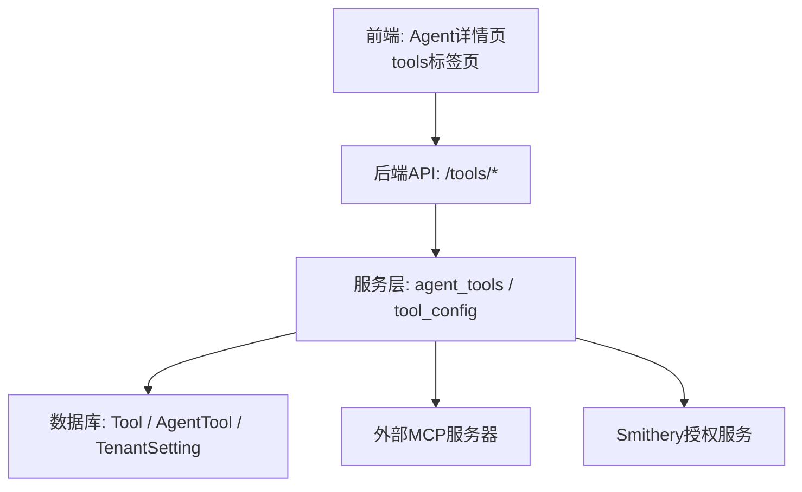
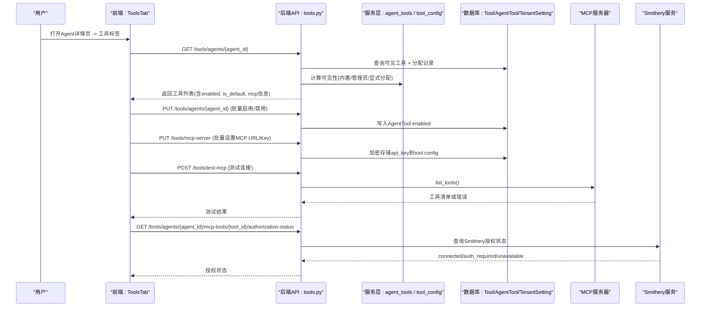
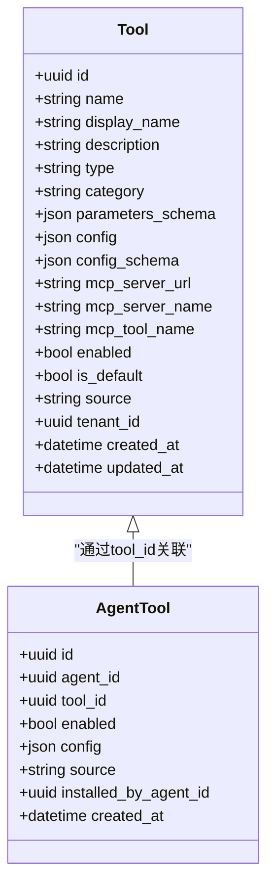
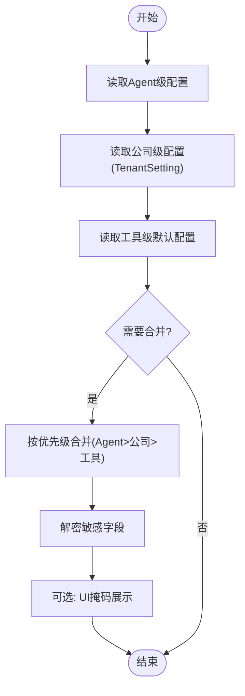
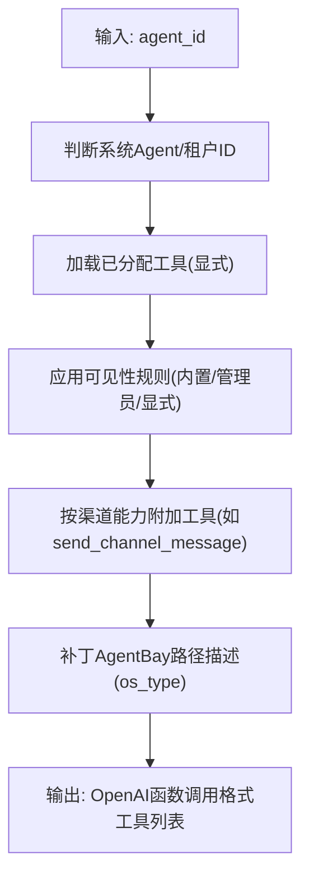
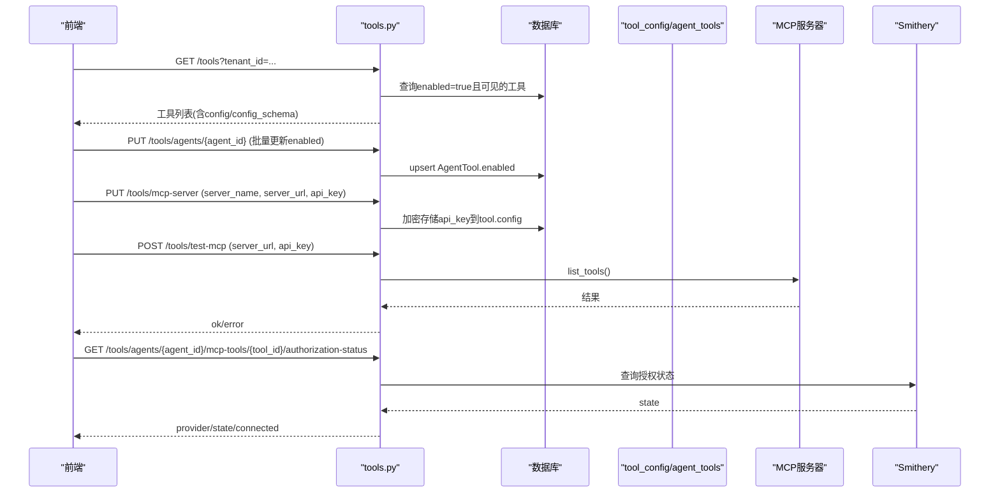
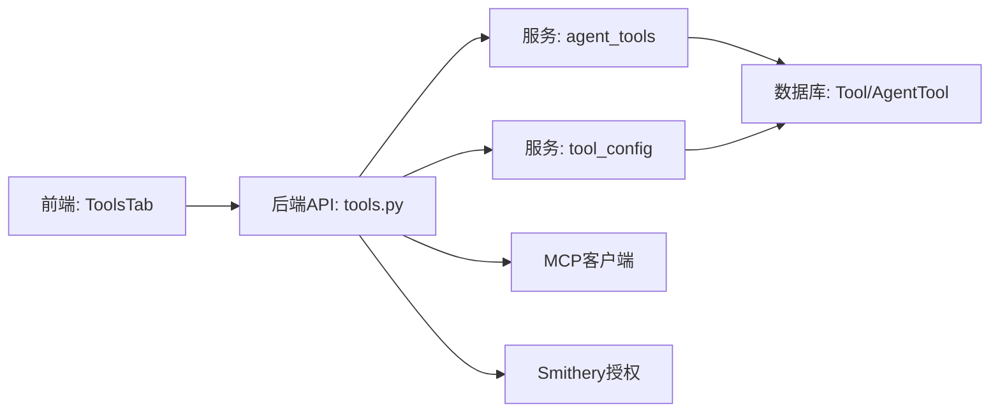

# Agent工具集成

<cite>
**本文引用的文件**
- [backend/app/api/tools.py](file://backend/app/api/tools.py)
- [backend/app/services/agent_tools.py](file://backend/app/services/agent_tools.py)
- [backend/app/services/tool_config.py](file://backend/app/services/tool_config.py)
- [backend/app/models/tool.py](file://backend/app/models/tool.py)
- [backend/app/services/builtin_tool_definitions.py](file://backend/app/services/builtin_tool_definitions.py)
- [frontend/src/pages/agent-detail/tabs/ToolsTab.tsx](file://frontend/src/pages/agent-detail/tabs/ToolsTab.tsx)
- [frontend/src/pages/agent-detail/AgentDetailPage.tsx](file://frontend/src/pages/agent-detail/AgentDetailPage.tsx)
</cite>

## 目录
1. [简介](#简介)
2. [项目结构](#项目结构)
3. [核心组件](#核心组件)
4. [架构总览](#架构总览)
5. [详细组件分析](#详细组件分析)
6. [依赖关系分析](#依赖关系分析)
7. [性能考虑](#性能考虑)
8. [故障排查指南](#故障排查指南)
9. [结论](#结论)
10. [附录](#附录)

## 简介
本文件面向“Agent工具集成”的完整流程，覆盖在Agent详情页中管理与配置各类工具的方法：内置工具的启用/禁用、第三方MCP工具的API密钥配置、自定义工具的注册与部署；并解释工具权限控制、调用限制与安全策略。同时提供常用工具的配置示例与常见问题排查方法，帮助非技术用户也能快速上手。

## 项目结构
围绕Agent工具集成的关键代码分布在后端API、服务层、数据模型以及前端页面中：
- 后端API：工具CRUD、按Agent分配、MCP服务器级凭据管理、Smithery授权状态查询等
- 服务层：工具配置合并与加解密、运行时工具清单构建、内置工具定义
- 数据模型：Tool与AgentTool表结构
- 前端：Agent详情页中的“工具”标签页与工具管理器组件

图表来源
- [backend/app/api/tools.py](file://backend/app/api/tools.py)
- [backend/app/services/agent_tools.py](file://backend/app/services/agent_tools.py)
- [backend/app/services/tool_config.py](file://backend/app/services/tool_config.py)
- [backend/app/models/tool.py](file://backend/app/models/tool.py)
- [frontend/src/pages/agent-detail/tabs/ToolsTab.tsx](file://frontend/src/pages/agent-detail/tabs/ToolsTab.tsx)

章节来源
- [backend/app/api/tools.py](file://backend/app/api/tools.py)
- [backend/app/services/agent_tools.py](file://backend/app/services/agent_tools.py)
- [backend/app/services/tool_config.py](file://backend/app/services/tool_config.py)
- [backend/app/models/tool.py](file://backend/app/models/tool.py)
- [frontend/src/pages/agent-detail/tabs/ToolsTab.tsx](file://frontend/src/pages/agent-detail/tabs/ToolsTab.tsx)

## 核心组件
- 工具模型与分配
  - Tool：描述工具元数据（名称、显示名、分类、参数Schema、是否默认、来源、租户范围等）
  - AgentTool：记录某Agent启用了哪些工具及每工具的配置覆盖
- 工具配置系统
  - 全局/租户/Agent三级配置合并，敏感字段自动加解密
  - 内置工具的公司级配置存储在TenantSetting中，避免跨租户泄露
- 运行时工具清单
  - 根据Agent可见性、渠道能力、系统Agent标记动态生成OpenAI函数调用格式的工具列表
- MCP与第三方工具
  - 支持MCP服务器URL与API Key批量更新，支持Smithery授权状态检查
- 前端工具面板
  - 展示可用工具、开关启用、查看/编辑配置、测试MCP连接、授权状态提示

章节来源
- [backend/app/models/tool.py](file://backend/app/models/tool.py)
- [backend/app/services/tool_config.py](file://backend/app/services/tool_config.py)
- [backend/app/services/agent_tools.py](file://backend/app/services/agent_tools.py)
- [backend/app/api/tools.py](file://backend/app/api/tools.py)
- [frontend/src/pages/agent-detail/tabs/ToolsTab.tsx](file://frontend/src/pages/agent-detail/tabs/ToolsTab.tsx)

## 架构总览
下图展示了从前端到后端的工具管理与执行主流程，包括配置合并、权限过滤、MCP连接与授权。

图表来源
- [backend/app/api/tools.py](file://backend/app/api/tools.py)
- [backend/app/services/agent_tools.py](file://backend/app/services/agent_tools.py)
- [backend/app/services/tool_config.py](file://backend/app/services/tool_config.py)
- [backend/app/models/tool.py](file://backend/app/models/tool.py)

## 详细组件分析

### 工具模型与分配（Tool / AgentTool）
- Tool字段涵盖类型（builtin/mcp）、分类、参数Schema、是否默认、来源（builtin/admin/agent）、租户范围等
- AgentTool为多对多中间表，记录每个Agent启用的工具及其配置覆盖
- 删除工具时清理相关AgentTool关联

图表来源
- [backend/app/models/tool.py](file://backend/app/models/tool.py)

章节来源
- [backend/app/models/tool.py](file://backend/app/models/tool.py)

### 工具配置合并与加解密（tool_config）
- 优先级：Agent级覆盖 > 公司级（TenantSetting）> 工具级默认
- 敏感字段识别：硬编码键 + config_schema中标记password类型的字段
- 读写时自动加解密，对外展示时对敏感字段进行掩码处理

图表来源
- [backend/app/services/tool_config.py](file://backend/app/services/tool_config.py)
- [backend/app/services/agent_tools.py](file://backend/app/services/agent_tools.py)

章节来源
- [backend/app/services/tool_config.py](file://backend/app/services/tool_config.py)
- [backend/app/services/agent_tools.py](file://backend/app/services/agent_tools.py)

### 运行时工具清单构建（agent_tools）
- 基于Agent可见性规则与渠道能力，动态生成OpenAI函数调用格式的工具列表
- 内置工具定义集中维护，确保前后端契约一致
- 针对AgentBay环境动态修补路径描述（Windows/Linux）

图表来源
- [backend/app/services/agent_tools.py](file://backend/app/services/agent_tools.py)
- [backend/app/services/builtin_tool_definitions.py](file://backend/app/services/builtin_tool_definitions.py)

章节来源
- [backend/app/services/agent_tools.py](file://backend/app/services/agent_tools.py)
- [backend/app/services/builtin_tool_definitions.py](file://backend/app/services/builtin_tool_definitions.py)

### 工具API与权限控制（tools.py）
- 列出平台工具（按租户范围）
- 创建/更新/删除工具（内置不可删除）
- 批量启用/禁用工具
- 按Agent获取工具列表（含enabled状态、is_default、MCP授权提供者）
- 批量更新MCP服务器URL与API Key（加密存储）
- 测试MCP连接
- 查询Smithery授权状态（connected/auth_required/unavailable）

图表来源
- [backend/app/api/tools.py](file://backend/app/api/tools.py)
- [backend/app/services/tool_config.py](file://backend/app/services/tool_config.py)

章节来源
- [backend/app/api/tools.py](file://backend/app/api/tools.py)

### 前端工具面板（ToolsTab）
- 在Agent详情页的“工具”标签页中，渲染工具管理器组件
- 支持查看工具列表、切换启用状态、查看/编辑配置、测试MCP连接、查看授权状态

章节来源
- [frontend/src/pages/agent-detail/tabs/ToolsTab.tsx](file://frontend/src/pages/agent-detail/tabs/ToolsTab.tsx)
- [frontend/src/pages/agent-detail/AgentDetailPage.tsx](file://frontend/src/pages/agent-detail/AgentDetailPage.tsx)

## 依赖关系分析
- API层依赖服务层完成配置合并、可见性计算、MCP客户端调用
- 服务层依赖数据模型与数据库会话
- 前端依赖后端API暴露的REST接口

图表来源
- [backend/app/api/tools.py](file://backend/app/api/tools.py)
- [backend/app/services/agent_tools.py](file://backend/app/services/agent_tools.py)
- [backend/app/services/tool_config.py](file://backend/app/services/tool_config.py)
- [backend/app/models/tool.py](file://backend/app/models/tool.py)

章节来源
- [backend/app/api/tools.py](file://backend/app/api/tools.py)
- [backend/app/services/agent_tools.py](file://backend/app/services/agent_tools.py)
- [backend/app/services/tool_config.py](file://backend/app/services/tool_config.py)
- [backend/app/models/tool.py](file://backend/app/models/tool.py)

## 性能考虑
- 工具配置缓存：在服务层对工具配置进行短期缓存，减少频繁DB查询
- 批量操作：支持批量启用/禁用工具与批量更新MCP服务器凭据，降低网络往返
- 可见性过滤：在SQL层使用OR条件组合过滤，避免全表扫描
- 敏感字段处理：仅在必要时加解密，避免不必要的CPU开销

[本节为通用指导，不直接分析具体文件]

## 故障排查指南
- MCP连接失败
  - 使用POST /tools/test-mcp验证服务器可达性与鉴权方式（URL内嵌key或Bearer）
  - 检查MCP服务器URL是否正确，API Key是否有效
- Smithery授权状态异常
  - 确认AgentTool配置中包含smithery_namespace与smithery_connection_id
  - 查询GET /tools/agents/{agent_id}/mcp-tools/{tool_id}/authorization-status获取state
- 工具不可见
  - 检查工具source与tenant_id是否符合可见性规则
  - 确认AgentTool是否存在且enabled=true
- 配置未生效
  - 确认优先级：Agent级覆盖 > 公司级 > 工具级默认
  - 检查敏感字段是否被正确加解密
- 内置工具无法删除
  - 内置工具不允许删除，需通过更新enabled=false来禁用

章节来源
- [backend/app/api/tools.py](file://backend/app/api/tools.py)
- [backend/app/services/tool_config.py](file://backend/app/services/tool_config.py)
- [backend/app/services/agent_tools.py](file://backend/app/services/agent_tools.py)

## 结论
本系统提供了完整的Agent工具集成方案：从工具定义、配置管理、权限控制到运行时加载与外部服务集成。通过清晰的层次结构与安全策略，既满足企业级多租户隔离需求，又保持前端操作的直观易用。建议在生产环境中严格管理API Key与MCP服务器配置，并结合监控与日志进行问题定位。

[本节为总结，不直接分析具体文件]

## 附录
- 常用工具配置示例
  - DuckDuckGo Search：无需API Key，可直接启用
  - Tavily Search：需在config_schema中填写api_key
  - Jina Search/Read：需配置Jina AI API Key
  - Exa Search：需配置Exa API Key
- 安全策略要点
  - 敏感字段自动加解密，UI展示时掩码
  - 内置工具公司级配置隔离，防止跨租户泄露
  - 系统级工具强制启用，禁止禁用
- 权限控制要点
  - 内置工具全局可见，管理员工具按租户隔离，显式分配工具始终可见
  - OKR专用工具仅系统Agent可见
  - 渠道工具按需启用（如Feishu工具需配置飞书渠道）

[本节为补充说明，不直接分析具体文件]