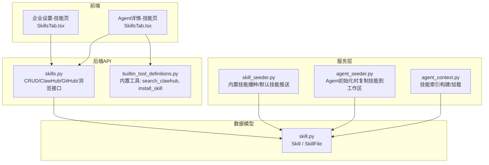
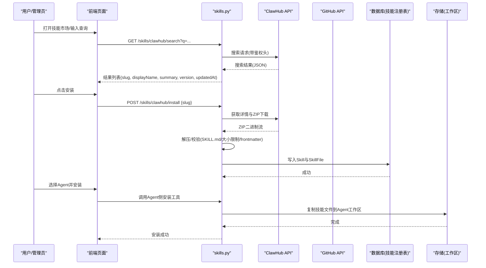
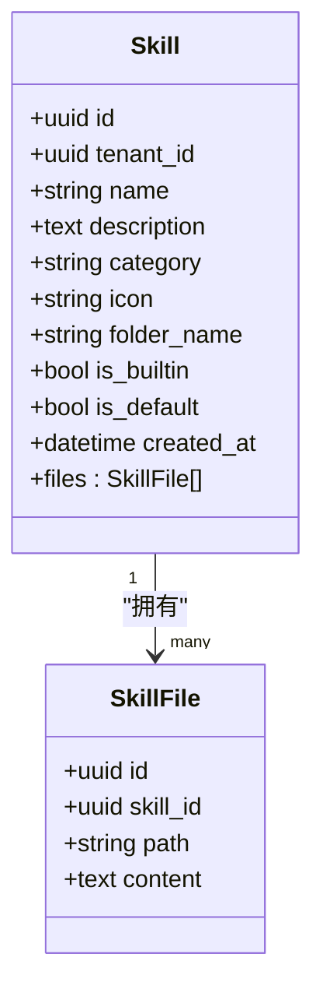
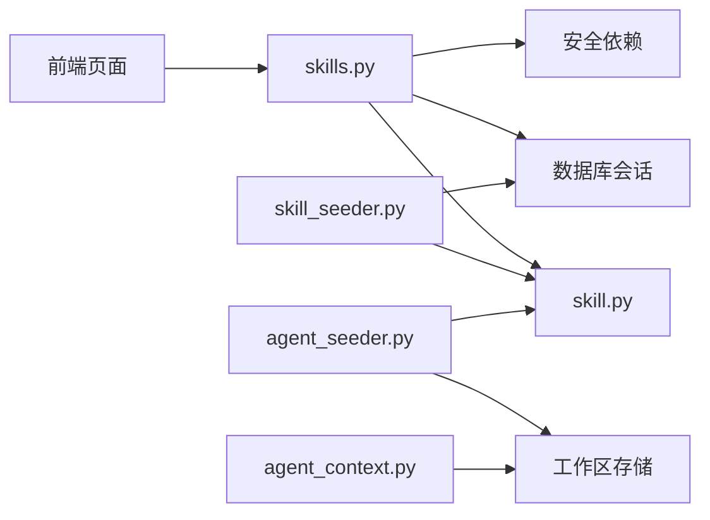
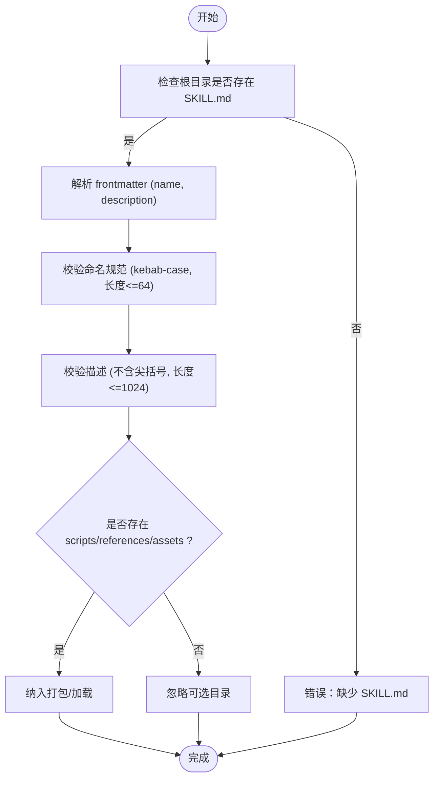
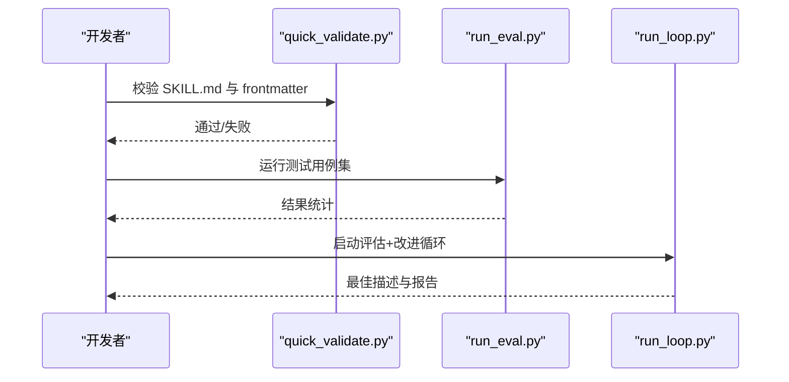

# Agent技能市场

<cite>
**本文引用的文件**   
- [backend/app/api/skills.py](file://backend/app/api/skills.py)
- [backend/app/models/skill.py](file://backend/app/models/skill.py)
- [backend/app/services/skill_seeder.py](file://backend/app/services/skill_seeder.py)
- [backend/app/services/agent_seeder.py](file://backend/app/services/agent_seeder.py)
- [backend/app/services/agent_context.py](file://backend/app/services/agent_context.py)
- [backend/app/services/builtin_tool_definitions.py](file://backend/app/services/builtin_tool_definitions.py)
- [backend/app/services/skill_creator_content.py](file://backend/app/services/skill_creator_content.py)
- [backend/app/services/skill_creator_files/scripts__package_skill.py](file://backend/app/services/skill_creator_files/scripts__package_skill.py)
- [backend/app/services/skill_creator_files/scripts__quick_validate.py](file://backend/app/services/skill_creator_files/scripts__quick_validate.py)
- [backend/app/services/skill_creator_files/scripts__run_eval.py](file://backend/app/services/skill_creator_files/scripts__run_eval.py)
- [backend/app/services/skill_creator_files/scripts__run_loop.py](file://backend/app/services/skill_creator_files/scripts__run_loop.py)
- [skills-lock.json](file://skills-lock.json)
- [frontend/src/pages/enterprise-settings/tabs/SkillsTab.tsx](file://frontend/src/pages/enterprise-settings/tabs/SkillsTab.tsx)
- [frontend/src/pages/agent-detail/tabs/SkillsTab.tsx](file://frontend/src/pages/agent-detail/tabs/SkillsTab.tsx)
</cite>

## 目录
1. [简介](#简介)
2. [项目结构](#项目结构)
3. [核心组件](#核心组件)
4. [架构总览](#架构总览)
5. [详细组件分析](#详细组件分析)
6. [依赖关系分析](#依赖关系分析)
7. [性能与容量特性](#性能与容量特性)
8. [故障排查指南](#故障排查指南)
9. [结论](#结论)
10. [附录：开发与发布指南](#附录开发与发布指南)

## 简介
本文件全面说明Agent技能市场的功能与用法，覆盖以下方面：
- 浏览、搜索与安装技能包（含分类、评分、版本信息）
- 技能包结构规范、依赖关系与冲突处理
- 技能的启用、禁用、更新与卸载操作
- 技能开发、测试、打包与提交流程

系统提供统一的技能注册中心（数据库），支持从ClawHub官方市场与GitHub URL导入，同时为每个Agent工作区复制并管理技能文件。前端提供企业级技能管理与Agent内嵌的技能面板，便于管理员与开发者协作。

## 项目结构
后端以FastAPI暴露技能市场API，模型层定义技能与文件存储结构，服务层负责内置技能播种、默认技能推送、上下文索引构建等；前端在企业设置页与Agent详情页分别提供技能市场交互界面。

**图表来源** 
- [backend/app/api/skills.py](file://backend/app/api/skills.py)
- [backend/app/models/skill.py](file://backend/app/models/skill.py)
- [backend/app/services/skill_seeder.py](file://backend/app/services/skill_seeder.py)
- [backend/app/services/agent_seeder.py](file://backend/app/services/agent_seeder.py)
- [backend/app/services/agent_context.py](file://backend/app/services/agent_context.py)
- [backend/app/services/builtin_tool_definitions.py](file://backend/app/services/builtin_tool_definitions.py)
- [frontend/src/pages/enterprise-settings/tabs/SkillsTab.tsx](file://frontend/src/pages/enterprise-settings/tabs/SkillsTab.tsx)
- [frontend/src/pages/agent-detail/tabs/SkillsTab.tsx](file://frontend/src/pages/agent-detail/tabs/SkillsTab.tsx)

**章节来源**
- [backend/app/api/skills.py](file://backend/app/api/skills.py)
- [backend/app/models/skill.py](file://backend/app/models/skill.py)
- [backend/app/services/skill_seeder.py](file://backend/app/services/skill_seeder.py)
- [backend/app/services/agent_seeder.py](file://backend/app/services/agent_seeder.py)
- [backend/app/services/agent_context.py](file://backend/app/services/agent_context.py)
- [backend/app/services/builtin_tool_definitions.py](file://backend/app/services/builtin_tool_definitions.py)
- [frontend/src/pages/enterprise-settings/tabs/SkillsTab.tsx](file://frontend/src/pages/enterprise-settings/tabs/SkillsTab.tsx)
- [frontend/src/pages/agent-detail/tabs/SkillsTab.tsx](file://frontend/src/pages/agent-detail/tabs/SkillsTab.tsx)

## 核心组件
- 技能注册表API：提供全局技能CRUD、ClawHub搜索/详情/安装、GitHub URL导入/预览、路径式浏览读写删除、租户令牌配置等能力。
- 技能数据模型：Skill与SkillFile两张表，用于持久化技能元信息与文件内容。
- 技能播种与推送：启动时将内置技能写入注册表，并将标记为默认的技能推送到所有现有Agent的工作区。
- Agent上下文索引：运行时扫描Agent工作区的技能目录，生成紧凑的“技能目录”注入提示词上下文。
- 内置工具：search_clawhub与install_skill作为Agent可调用工具，实现AI驱动的技能发现与安装。
- 前端技能市场：企业设置页提供ClawHub搜索、URL导入、文件浏览器与令牌配置；Agent详情页提供按Agent维度的技能安装与管理。

**章节来源**
- [backend/app/api/skills.py](file://backend/app/api/skills.py)
- [backend/app/models/skill.py](file://backend/app/models/skill.py)
- [backend/app/services/skill_seeder.py](file://backend/app/services/skill_seeder.py)
- [backend/app/services/agent_seeder.py](file://backend/app/services/agent_seeder.py)
- [backend/app/services/agent_context.py](file://backend/app/services/agent_context.py)
- [backend/app/services/builtin_tool_definitions.py](file://backend/app/services/builtin_tool_definitions.py)
- [frontend/src/pages/enterprise-settings/tabs/SkillsTab.tsx](file://frontend/src/pages/enterprise-settings/tabs/SkillsTab.tsx)
- [frontend/src/pages/agent-detail/tabs/SkillsTab.tsx](file://frontend/src/pages/agent-detail/tabs/SkillsTab.tsx)

## 架构总览
技能市场的关键流程包括：
- 搜索与详情：前端调用后端代理至ClawHub，返回结果列表与详情（含版本、更新时间）。
- 安装与导入：从ClawHub下载ZIP或从GitHub拉取目录，校验SKILL.md与大小限制，解析frontmatter，保存至注册表。
- 工作区同步：Agent创建或模板应用时，将注册表中的技能复制到Agent工作区对应目录。
- 上下文构建：运行时读取工作区技能目录，提取name/description与相对路径，形成紧凑目录供LLM使用。

**图表来源** 
- [backend/app/api/skills.py](file://backend/app/api/skills.py)
- [backend/app/services/agent_seeder.py](file://backend/app/services/agent_seeder.py)
- [backend/app/services/builtin_tool_definitions.py](file://backend/app/services/builtin_tool_definitions.py)

## 详细组件分析

### 技能注册表API（skills.py）
- 搜索与详情：
  - GET /skills/clawhub/search：代理搜索，返回slug、displayName、summary、score、version、updatedAt等字段。
  - GET /skills/clawhub/detail/{slug}：获取完整元数据。
- 安装与导入：
  - POST /skills/clawhub/install：从ClawHub下载ZIP，校验SKILL.md与大小限制，解析frontmatter，自动分类portability tier，写入注册表。
  - POST /skills/import-from-url：从GitHub URL递归拉取目录，校验SKILL.md与大小限制，写入注册表。
  - POST /skills/import-from-url/preview：仅预览不保存。
- 标准CRUD：
  - GET /skills/：列出技能（按租户范围过滤，包含内置与租户专属）。
  - GET /skills/{id}：获取技能及其文件。
  - POST /skills/：创建自定义技能（自动生成SKILL.md模板）。
  - PUT /skills/{id}：更新元数据与文件。
  - DELETE /skills/{id}：删除非内置技能。
- 路径式浏览：
  - GET /skills/browse/list：列出技能文件夹或子目录/文件。
  - GET /skills/browse/read：读取指定文件内容。
  - PUT /skills/browse/write：写入文件（不存在则自动创建技能）。
  - DELETE /skills/browse/delete：删除文件或整个技能文件夹。
- 租户令牌设置：
  - GET /skills/settings/token：查看GitHub token与ClawHub key配置状态（脱敏显示）。
  - PUT /skills/settings/token：保存或清空token/key。

权限与范围：
- 平台管理员可编辑全部；租户管理员可编辑其租户技能及可见的内置技能（视为预设）。
- 列表与浏览均按tenant_id进行范围过滤。

错误与限制：
- 最大技能包大小限制（约500KB）。
- 必须包含SKILL.md，否则报错。
- ClawHub限流与连接失败会重试与降级镜像源。

**章节来源**
- [backend/app/api/skills.py](file://backend/app/api/skills.py)

### 数据模型（skill.py）
- Skill：技能元数据（名称、描述、分类、图标、folder_name、是否内置/默认、创建时间）。
- SkillFile：技能文件（path、content），与Skill一对多关联，级联删除。

**图表来源** 
- [backend/app/models/skill.py](file://backend/app/models/skill.py)

**章节来源**
- [backend/app/models/skill.py](file://backend/app/models/skill.py)

### 技能播种与默认技能推送（skill_seeder.py）
- 启动时向注册表写入内置技能（BUILTIN_SKILLS），若已存在则更新元数据与文件内容差异。
- push_default_skills_to_existing_agents：计算默认技能集合哈希，避免重复推送；遍历所有Agent，清理旧版遗留文件，将is_default技能复制到各Agent工作区。

**章节来源**
- [backend/app/services/skill_seeder.py](file://backend/app/services/skill_seeder.py)

### Agent工作区技能复制（agent_seeder.py）
- 在Agent初始化或模板应用阶段，根据选定的技能ID集合（含默认与模板指定）将SkillFile内容写入Agent工作区对应路径。
- 支持跳过已存在的文件（按需覆盖策略）。

**章节来源**
- [backend/app/services/agent_seeder.py](file://backend/app/services/agent_seeder.py)

### 技能上下文索引（agent_context.py）
- _load_skills_index：扫描Agent工作区skills目录，收集每个技能文件夹下的SKILL.md（兼容小写skill.md），提取name/description与相对路径，生成紧凑目录字符串注入上下文。

**章节来源**
- [backend/app/services/agent_context.py](file://backend/app/services/agent_context.py)

### 内置工具（builtin_tool_definitions.py）
- search_clawhub：允许Agent搜索ClawHub技能市场。
- install_skill：允许Agent通过slug或GitHub URL安装技能到当前工作区。

**章节来源**
- [backend/app/services/builtin_tool_definitions.py](file://backend/app/services/builtin_tool_definitions.py)

### 前端技能市场（SkillsTab.tsx）
- 企业设置页：
  - 搜索ClawHub并展示结果（含版本、更新时间）。
  - 一键安装技能，显示tier标签与文件数量。
  - GitHub URL预览与导入。
  - 文件浏览器（list/read/write/delete）管理技能文件。
  - 配置GitHub token与ClawHub key（支持清空与脱敏显示）。
- Agent详情页：
  - 在Agent维度执行ClawHub安装，刷新文件视图。

**章节来源**
- [frontend/src/pages/enterprise-settings/tabs/SkillsTab.tsx](file://frontend/src/pages/enterprise-settings/tabs/SkillsTab.tsx)
- [frontend/src/pages/agent-detail/tabs/SkillsTab.tsx](file://frontend/src/pages/agent-detail/tabs/SkillsTab.tsx)

## 依赖关系分析
- API层依赖模型层（Skill/SkillFile）、数据库会话、安全依赖（get_current_user/get_current_admin/require_role）。
- 服务层依赖存储后端（工作区）、数据库会话、系统设置（默认技能同步哈希）。
- 前端依赖后端API与i18n资源，通过React Query与Toast反馈操作状态。

**图表来源** 
- [backend/app/api/skills.py](file://backend/app/api/skills.py)
- [backend/app/models/skill.py](file://backend/app/models/skill.py)
- [backend/app/services/skill_seeder.py](file://backend/app/services/skill_seeder.py)
- [backend/app/services/agent_seeder.py](file://backend/app/services/agent_seeder.py)
- [backend/app/services/agent_context.py](file://backend/app/services/agent_context.py)

**章节来源**
- [backend/app/api/skills.py](file://backend/app/api/skills.py)
- [backend/app/models/skill.py](file://backend/app/models/skill.py)
- [backend/app/services/skill_seeder.py](file://backend/app/services/skill_seeder.py)
- [backend/app/services/agent_seeder.py](file://backend/app/services/agent_seeder.py)
- [backend/app/services/agent_context.py](file://backend/app/services/agent_context.py)

## 性能与容量特性
- 单技能包大小上限：约500KB（MAX_SKILL_SIZE），防止过大归档影响下载与解析。
- ClawHub镜像回退：优先官方端点，失败时尝试镜像端点，提升可用性。
- 递归深度限制：GitHub目录拉取限制最大深度（如3层），避免无限递归。
- 并发与超时：HTTP客户端设置超时（如15s/30s），提高稳定性。
- 上下文加载优化：技能目录采用紧凑格式，减少提示词体积。

[本节为通用指导，无需具体文件引用]

## 故障排查指南
常见问题与定位要点：
- 安装失败（ClawHub限流/连接失败）：检查网络与鉴权key，确认镜像可用；查看错误码429/502。
- 导入失败（无SKILL.md）：确保GitHub路径指向包含SKILL.md的目录。
- 大小超限（413）：拆分技能包或精简文件。
- 权限不足（403）：确认当前用户角色与租户范围；内置技能需租户管理员可见才可编辑。
- 文件浏览异常：核对路径格式与租户隔离；确认browse接口返回结构与权限。

**章节来源**
- [backend/app/api/skills.py](file://backend/app/api/skills.py)

## 结论
技能市场提供了完整的技能生命周期管理能力：从发现、安装到工作区部署与上下文集成，兼顾安全性与可扩展性。通过ClawHub与GitHub双通道导入、严格的校验与权限控制、以及高效的上下文索引机制，确保了技能的可移植性与运行稳定性。前端界面简化了管理员与开发者的日常操作，提升了整体效率。

[本节为总结，无需具体文件引用]

## 附录：开发与发布指南

### 技能包结构规范
- 根目录必须包含SKILL.md，YAML frontmatter至少包含name与description。
- 可选资源目录：scripts/（可执行脚本）、references/（参考文档）、assets/（输出素材）。
- 渐进式披露：metadata（始终在上下文）、SKILL.md正文（触发时加载）、资源按需加载。

**图表来源** 
- [backend/app/services/skill_creator_content.py](file://backend/app/services/skill_creator_content.py)
- [backend/app/services/skill_creator_files/scripts__quick_validate.py](file://backend/app/services/skill_creator_files/scripts__quick_validate.py)

**章节来源**
- [backend/app/services/skill_creator_content.py](file://backend/app/services/skill_creator_content.py)
- [backend/app/services/skill_creator_files/scripts__quick_validate.py](file://backend/app/services/skill_creator_files/scripts__quick_validate.py)

### 依赖关系与冲突处理
- 依赖关系：技能本身不包含显式依赖声明；portability tier基于内容关键字推断（纯提示词/CLI/API/OpenClaw原生）。
- 冲突处理：注册表层面以folder_name唯一约束（按租户作用域），重复创建将返回409；更新时替换文件内容，避免重复。
- 版本管理：ClawHub返回version字段用于展示；本地锁定文件skills-lock.json记录source、sourceType、skillPath与computedHash，便于追踪来源与一致性。

**章节来源**
- [backend/app/api/skills.py](file://backend/app/api/skills.py)
- [skills-lock.json](file://skills-lock.json)

### 启用、禁用、更新与卸载
- 启用/禁用：通过Agent工具install_skill安装到工作区即启用；删除工作区对应技能文件夹即可禁用。
- 更新：在注册表中PUT更新元数据与文件；重新触发Agent初始化或手动复制更新后的文件到工作区。
- 卸载：删除注册表中的技能（DELETE /skills/{id}）与工作区对应文件夹。

**章节来源**
- [backend/app/api/skills.py](file://backend/app/api/skills.py)
- [backend/app/services/agent_seeder.py](file://backend/app/services/agent_seeder.py)

### 测试与评估
- 快速验证：scripts__quick_validate.py校验SKILL.md与frontmatter合法性。
- 评估脚本：scripts__run_eval.py执行测试用例集，统计通过率与触发率。
- 迭代优化：scripts__run_loop.py结合评估与改进描述，循环优化直至通过或达到最大迭代次数。

**图表来源** 
- [backend/app/services/skill_creator_files/scripts__quick_validate.py](file://backend/app/services/skill_creator_files/scripts__quick_validate.py)
- [backend/app/services/skill_creator_files/scripts__run_eval.py](file://backend/app/services/skill_creator_files/scripts__run_eval.py)
- [backend/app/services/skill_creator_files/scripts__run_loop.py](file://backend/app/services/skill_creator_files/scripts__run_loop.py)

**章节来源**
- [backend/app/services/skill_creator_files/scripts__quick_validate.py](file://backend/app/services/skill_creator_files/scripts__quick_validate.py)
- [backend/app/services/skill_creator_files/scripts__run_eval.py](file://backend/app/services/skill_creator_files/scripts__run_eval.py)
- [backend/app/services/skill_creator_files/scripts__run_loop.py](file://backend/app/services/skill_creator_files/scripts__run_loop.py)

### 打包与发布
- 打包工具：scripts__package_skill.py将技能目录打包为.skill文件（ZIP），排除构建产物与eval目录。
- 发布流程：
  - 编写SKILL.md与可选资源。
  - 使用quick_validate.py校验。
  - 使用package_skill.py打包。
  - 上传至ClawHub或通过GitHub URL导入。

**章节来源**
- [backend/app/services/skill_creator_files/scripts__package_skill.py](file://backend/app/services/skill_creator_files/scripts__package_skill.py)