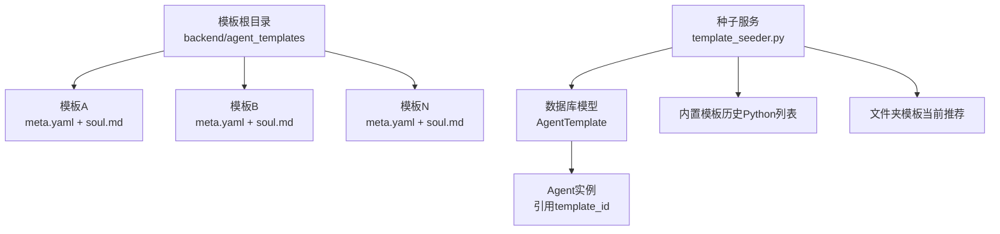
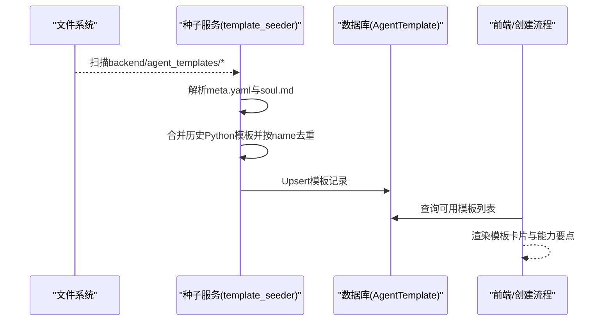
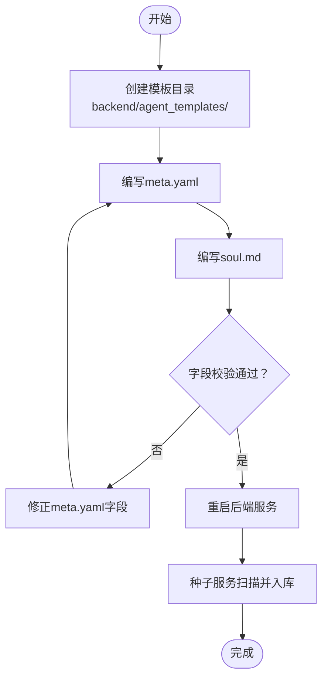
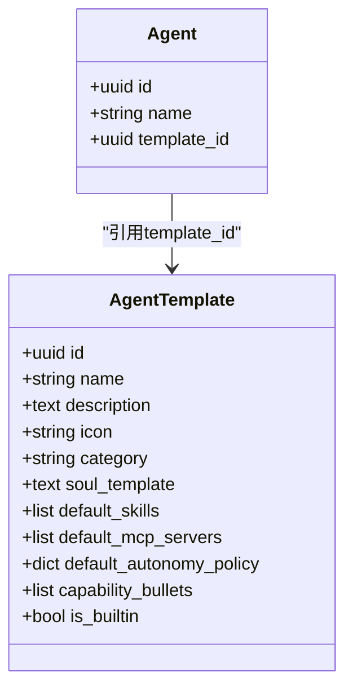

# Agent模板系统

<cite>
**本文引用的文件**   
- [template_seeder.py](file://backend/app/services/template_seeder.py)
- [agent.py](file://backend/app/models/agent.py)
- [meta.yaml（后端架构师）](file://backend/agent_templates/backend-architect/meta.yaml)
- [soul.md（后端架构师）](file://backend/agent_templates/backend-architect/soul.md)
- [meta.yaml（代码审查员）](file://backend/agent_templates/code-reviewer/meta.yaml)
- [meta.yaml（内容创作者）](file://backend/agent_templates/content-creator/meta.yaml)
- [meta.yaml（私人助理）](file://backend/agent_templates/private-assistant/meta.yaml)
- [meta.yaml（风控经理）](file://backend/agent_templates/risk-manager/meta.yaml)
- [meta.yaml（前端开发者）](file://backend/agent_templates/frontend-developer/meta.yaml)
- [meta.yaml（增长黑客）](file://backend/agent_templates/growth-hacker/meta.yaml)
- [soul.md（系统默认模板）](file://backend/agent_template/soul.md)
</cite>

## 目录
1. [简介](#简介)
2. [项目结构](#项目结构)
3. [核心组件](#核心组件)
4. [架构总览](#架构总览)
5. [详细组件分析](#详细组件分析)
6. [依赖关系分析](#依赖关系分析)
7. [性能考量](#性能考量)
8. [故障排查指南](#故障排查指南)
9. [结论](#结论)
10. [附录](#附录)

## 简介
本文件系统性解析Agent模板系统的架构与使用方法，覆盖以下要点：
- 模板目录结构与约定
- meta.yaml配置字段定义与语义
- soul.md系统提示词编写规范
- 内置模板的功能特点与适用场景（涵盖后端架构师、代码审查员、内容创作者等20+预置模板）
- 自定义模板开发全流程（创建、打包、发布与共享）

## 项目结构
Agent模板系统在仓库中以“文件夹模板”为主，辅以少量历史Python内嵌模板。启动时由种子服务统一加载并入库，供前端展示与Agent实例化使用。

- 模板根目录：backend/agent_templates/<slug>/
  - 每个模板一个子目录，命名采用小写短横线风格（slug）
  - 必须包含：meta.yaml、soul.md
- 系统默认模板：backend/agent_template/soul.md（通用占位模板）
- 种子服务：backend/app/services/template_seeder.py（启动时扫描、合并、入库）
- 数据模型：backend/app/models/agent.py（AgentTemplate表结构）

图表来源 
- [template_seeder.py:218-273](file://backend/app/services/template_seeder.py#L218-L273)
- [agent.py:181-204](file://backend/app/models/agent.py#L181-L204)

章节来源
- [template_seeder.py:1-339](file://backend/app/services/template_seeder.py#L1-L339)
- [agent.py:181-204](file://backend/app/models/agent.py#L181-L204)

## 核心组件
- 模板元数据（meta.yaml）
  - 描述模板名称、图标、分类、能力要点、默认技能、MCP服务器绑定、默认自主策略等
- 系统提示词（soul.md）
  - 定义角色身份、个性、工作风格、边界约束等，作为Agent的“灵魂”提示词
- 种子服务（template_seeder.py）
  - 启动时扫描文件夹模板，合并历史Python模板，去重后写入数据库
- 数据模型（AgentTemplate）
  - 持久化模板信息，支持is_builtin标记、能力要点、默认技能、MCP服务器、自主策略等

章节来源
- [template_seeder.py:218-273](file://backend/app/services/template_seeder.py#L218-L273)
- [agent.py:181-204](file://backend/app/models/agent.py#L181-L204)

## 架构总览
模板系统通过“文件系统 + 种子服务 + 数据库模型”的三段式架构实现：
- 文件系统层：以文件夹为单位组织模板，强制要求meta.yaml与soul.md
- 服务层：启动时读取、校验、合并、去重，生成统一的模板字典
- 数据层：Upsert到AgentTemplate表，供前端目录、Agent创建流程消费

图表来源 
- [template_seeder.py:218-273](file://backend/app/services/template_seeder.py#L218-L273)
- [agent.py:181-204](file://backend/app/models/agent.py#L181-L204)

## 详细组件分析

### meta.yaml字段定义与语义
- name：模板名称（必填），用于唯一标识与显示
- description：模板描述（必填），用于卡片摘要
- icon：图标标识（必填），用于前端展示
- category：分类（必填），如software-development、marketing、office、trading等
- capability_bullets：能力要点数组（可选），用于展示模板核心能力
- default_skills：默认技能列表（可选），创建Agent时自动绑定
- default_mcp_servers：默认MCP服务器ID列表（可选），创建Agent时自动导入并绑定工具
- default_autonomy_policy：默认自主策略（可选），键为操作名，值为权限等级（L1/L2/L3）

示例参考
- [meta.yaml（后端架构师）:1-15](file://backend/agent_templates/backend-architect/meta.yaml#L1-L15)
- [meta.yaml（代码审查员）:1-15](file://backend/agent_templates/code-reviewer/meta.yaml#L1-L15)
- [meta.yaml（内容创作者）:1-17](file://backend/agent_templates/content-creator/meta.yaml#L1-L17)
- [meta.yaml（私人助理）:1-16](file://backend/agent_templates/private-assistant/meta.yaml#L1-L16)
- [meta.yaml（风控经理）:1-18](file://backend/agent_templates/risk-manager/meta.yaml#L1-L18)
- [meta.yaml（前端开发者）:1-15](file://backend/agent_templates/frontend-developer/meta.yaml#L1-L15)
- [meta.yaml（增长黑客）:1-17](file://backend/agent_templates/growth-hacker/meta.yaml#L1-L17)

章节来源
- [template_seeder.py:218-273](file://backend/app/services/template_seeder.py#L218-L273)

### soul.md系统提示词编写规范
- 标题：Soul — {name}，{name}在渲染时替换为模板名称
- Identity：角色与专长，明确Agent的职责领域
- Personality：性格与语言习惯，建议说明语言切换策略与内部文件语言一致性
- Work Style：工作流程与产出规范，强调结构化输出与可追溯性
- Boundaries：行为边界与审批要求，避免越权操作

示例参考
- [soul.md（后端架构师）:1-26](file://backend/agent_templates/backend-architect/soul.md#L1-L26)
- [soul.md（系统默认模板）:1-16](file://backend/agent_template/soul.md#L1-L16)

章节来源
- [template_seeder.py:249-261](file://backend/app/services/template_seeder.py#L249-L261)
- [soul.md（系统默认模板）:1-16](file://backend/agent_template/soul.md#L1-L16)

### 内置模板功能特点与适用场景
- 后端架构师：API设计、数据建模、权衡分析；适用于系统设计、架构评审
- 代码审查员：正确性、安全性、可维护性检查；适用于PR审查、质量门禁
- 内容创作者：编辑日历、长文撰写、多平台适配；适用于营销内容生产
- 私人助理：日程协调、草稿辅助、跟进记忆；适用于个人效率提升
- 风控经理：交易前置检查、风险评分、规则守卫；适用于交易风控流程
- 前端开发者：组件实现、性能优化、无障碍审查；适用于Web前端工程
- 增长黑客：漏斗诊断、实验设计、增长循环；适用于增长与运营

章节来源
- [meta.yaml（后端架构师）:1-15](file://backend/agent_templates/backend-architect/meta.yaml#L1-L15)
- [meta.yaml（代码审查员）:1-15](file://backend/agent_templates/code-reviewer/meta.yaml#L1-L15)
- [meta.yaml（内容创作者）:1-17](file://backend/agent_templates/content-creator/meta.yaml#L1-L17)
- [meta.yaml（私人助理）:1-16](file://backend/agent_templates/private-assistant/meta.yaml#L1-L16)
- [meta.yaml（风控经理）:1-18](file://backend/agent_templates/risk-manager/meta.yaml#L1-L18)
- [meta.yaml（前端开发者）:1-15](file://backend/agent_templates/frontend-developer/meta.yaml#L1-L15)
- [meta.yaml（增长黑客）:1-17](file://backend/agent_templates/growth-hacker/meta.yaml#L1-L17)

### 自定义模板开发指南
- 创建模板目录：在backend/agent_templates下新建<slug>目录
- 编写meta.yaml：按字段定义填写必填项与可选项
- 编写soul.md：按规范定义角色、个性、工作风格与边界
- 本地验证：重启后端，观察种子服务日志是否成功加载
- 发布与共享：将模板目录纳入版本管理，随代码库分发；或打包为独立资源包供其他环境导入

图表来源 
- [template_seeder.py:218-273](file://backend/app/services/template_seeder.py#L218-L273)

章节来源
- [template_seeder.py:218-273](file://backend/app/services/template_seeder.py#L218-L273)

## 依赖关系分析
- 模板加载依赖yaml解析与路径遍历
- 种子服务依赖数据库会话与AgentTemplate模型
- Agent实例通过template_id关联模板，继承默认技能、MCP服务器与自主策略

图表来源 
- [agent.py:181-204](file://backend/app/models/agent.py#L181-L204)
- [agent.py:129-131](file://backend/app/models/agent.py#L129-L131)

章节来源
- [agent.py:181-204](file://backend/app/models/agent.py#L181-L204)
- [agent.py:129-131](file://backend/app/models/agent.py#L129-L131)

## 性能考量
- 启动阶段一次性扫描与入库，避免运行时IO开销
- 使用name去重保证幂等更新，减少重复写入
- 仅对缺失必要字段的模板进行跳过与告警，降低无效解析成本

[本节为通用指导，不直接分析具体文件]

## 故障排查指南
- 缺少meta.yaml或soul.md：种子服务会跳过该模板并记录警告
- meta.yaml解析失败：记录错误并跳过，检查YAML语法
- 缺少必填字段：记录缺失字段并跳过，补齐name/description/icon/category
- 模板未生效：确认重启后端，查看种子服务日志是否成功Upsert

章节来源
- [template_seeder.py:228-247](file://backend/app/services/template_seeder.py#L228-L247)

## 结论
Agent模板系统以“文件夹模板 + 种子服务 + 数据模型”为核心，提供标准化、可扩展的模板管理能力。通过严格的字段校验与清晰的soul.md规范，确保模板的一致性与可维护性。内置模板覆盖研发、市场、办公、交易等多领域，满足多样化业务需求。自定义模板开发流程简洁直观，便于团队快速扩展与共享。

[本节为总结性内容，不直接分析具体文件]

## 附录
- 模板分类建议：software-development、marketing、office、trading等
- 自主策略等级：L1（只读）、L2（受限写）、L3（敏感操作需审批）
- MCP服务器绑定：通过default_mcp_servers自动导入并绑定工具，简化集成

[本节为补充说明，不直接分析具体文件]