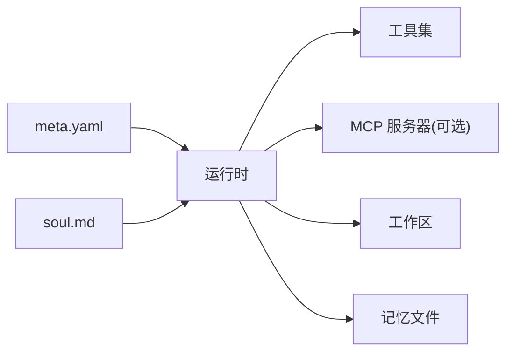

# 内置模板库

<cite>
**本文引用的文件**   
- [backend-architect/meta.yaml](file://backend/agent_templates/backend-architect/meta.yaml)
- [backend-architect/soul.md](file://backend/agent_templates/backend-architect/soul.md)
- [frontend-developer/meta.yaml](file://backend/agent_templates/frontend-developer/meta.yaml)
- [frontend-developer/soul.md](file://backend/agent_templates/frontend-developer/soul.md)
- [code-reviewer/meta.yaml](file://backend/agent_templates/code-reviewer/meta.yaml)
- [code-reviewer/soul.md](file://backend/agent_templates/code-reviewer/soul.md)
- [content-creator/meta.yaml](file://backend/agent_templates/content-creator/meta.yaml)
- [content-creator/soul.md](file://backend/agent_templates/content-creator/soul.md)
- [linkedin-content-creator/meta.yaml](file://backend/agent_templates/linkedin-content-creator/meta.yaml)
- [linkedin-content-creator/soul.md](file://backend/agent_templates/linkedin-content-creator/soul.md)
- [tiktok-strategist/meta.yaml](file://backend/agent_templates/tiktok-strategist/meta.yaml)
- [tiktok-strategist/soul.md](file://backend/agent_templates/tiktok-strategist/soul.md)
- [market-intel-aggregator/meta.yaml](file://backend/agent_templates/market-intel-aggregator/meta.yaml)
- [market-intel-aggregator/soul.md](file://backend/agent_templates/market-intel-aggregator/soul.md)
- [technical-analyst/meta.yaml](file://backend/agent_templates/technical-analyst/meta.yaml)
- [technical-analyst/soul.md](file://backend/agent_templates/technical-analyst/soul.md)
- [private-assistant/meta.yaml](file://backend/agent_templates/private-assistant/meta.yaml)
- [private-assistant/soul.md](file://backend/agent_templates/private-assistant/soul.md)
- [rapid-prototyper/meta.yaml](file://backend/agent_templates/rapid-prototyper/meta.yaml)
- [rapid-prototyper/soul.md](file://backend/agent_templates/rapid-prototyper/soul.md)
</cite>

## 目录
1. [简介](#简介)
2. [项目结构](#项目结构)
3. [核心组件](#核心组件)
4. [架构总览](#架构总览)
5. [详细模板分析](#详细模板分析)
6. [依赖关系分析](#依赖关系分析)
7. [性能与可用性考量](#性能与可用性考量)
8. [故障排查指南](#故障排查指南)
9. [结论](#结论)
10. [附录](#附录)

## 简介
本文件系统性梳理 Clawith 平台提供的 20+ 个预置 Agent 模板，按类别详解其功能特点、适用场景与能力特性。模板覆盖软件开发类（后端架构师、前端开发者、代码审查员）、内容创作类（内容创作者、LinkedIn 内容创作者、TikTok 策略师）、商业分析类（市场情报聚合器、技术分析师、风险经理）以及效率工具类（私人助理、快速原型开发）。每个模板均包含角色定位、工作风格、边界约束与默认能力清单，帮助用户快速选择并高效使用。

## 项目结构
Clawith 的内置模板以“每个模板一个目录”的方式组织，统一包含：
- meta.yaml：模板元数据（名称、描述、图标、分类、能力要点、默认技能、默认自主性策略等）
- soul.md：模板人格与工作规范（身份、性格、工作风格、边界、心跳关注点等）

```mermaid
graph TB
subgraph "模板根目录"
A["backend-architect/"]
B["frontend-developer/"]
C["code-reviewer/"]
D["content-creator/"]
E["linkedin-content-creator/"]
F["tiktok-strategist/"]
G["market-intel-aggregator/"]
H["technical-analyst/"]
I["private-assistant/"]
J["rapid-prototyper/"]
end
A --> A1["meta.yaml"]
A --> A2["soul.md"]
B --> B1["meta.yaml"]
B --> B2["soul.md"]
C --> C1["meta.yaml"]
C --> C2["soul.md"]
D --> D1["meta.yaml"]
D --> D2["soul.md"]
E --> E1["meta.yaml"]
E --> E2["soul.md"]
F --> F1["meta.yaml"]
F --> F2["soul.md"]
G --> G1["meta.yaml"]
G --> G2["soul.md"]
H --> H1["meta.yaml"]
H --> H2["soul.md"]
I --> I1["meta.yaml"]
I --> I2["soul.md"]
J --> J1["meta.yaml"]
J --> J2["soul.md"]
```

图表来源
- [backend-architect/meta.yaml:1-15](file://backend/agent_templates/backend-architect/meta.yaml#L1-L15)
- [backend-architect/soul.md:1-26](file://backend/agent_templates/backend-architect/soul.md#L1-L26)
- [frontend-developer/meta.yaml:1-15](file://backend/agent_templates/frontend-developer/meta.yaml#L1-L15)
- [frontend-developer/soul.md:1-26](file://backend/agent_templates/frontend-developer/soul.md#L1-L26)
- [code-reviewer/meta.yaml:1-15](file://backend/agent_templates/code-reviewer/meta.yaml#L1-L15)
- [code-reviewer/soul.md:1-26](file://backend/agent_templates/code-reviewer/soul.md#L1-L26)
- [content-creator/meta.yaml:1-17](file://backend/agent_templates/content-creator/meta.yaml#L1-L17)
- [content-creator/soul.md:1-26](file://backend/agent_templates/content-creator/soul.md#L1-L26)
- [linkedin-content-creator/meta.yaml:1-17](file://backend/agent_templates/linkedin-content-creator/meta.yaml#L1-L17)
- [linkedin-content-creator/soul.md:1-26](file://backend/agent_templates/linkedin-content-creator/soul.md#L1-L26)
- [tiktok-strategist/meta.yaml:1-17](file://backend/agent_templates/tiktok-strategist/meta.yaml#L1-L17)
- [tiktok-strategist/soul.md:1-26](file://backend/agent_templates/tiktok-strategist/soul.md#L1-L26)
- [market-intel-aggregator/meta.yaml:1-20](file://backend/agent_templates/market-intel-aggregator/meta.yaml#L1-L20)
- [market-intel-aggregator/soul.md:1-28](file://backend/agent_templates/market-intel-aggregator/soul.md#L1-L28)
- [technical-analyst/meta.yaml:1-19](file://backend/agent_templates/technical-analyst/meta.yaml#L1-L19)
- [technical-analyst/soul.md:1-28](file://backend/agent_templates/technical-analyst/soul.md#L1-L28)
- [private-assistant/meta.yaml](file://backend/agent_templates/private-assistant/meta.yaml)
- [private-assistant/soul.md](file://backend/agent_templates/private-assistant/soul.md)
- [rapid-prototyper/meta.yaml](file://backend/agent_templates/rapid-prototyper/meta.yaml)
- [rapid-prototyper/soul.md](file://backend/agent_templates/rapid-prototyper/soul.md)

章节来源
- [backend-architect/meta.yaml:1-15](file://backend/agent_templates/backend-architect/meta.yaml#L1-L15)
- [backend-architect/soul.md:1-26](file://backend/agent_templates/backend-architect/soul.md#L1-L26)
- [frontend-developer/meta.yaml:1-15](file://backend/agent_templates/frontend-developer/meta.yaml#L1-L15)
- [frontend-developer/soul.md:1-26](file://backend/agent_templates/frontend-developer/soul.md#L1-L26)
- [code-reviewer/meta.yaml:1-15](file://backend/agent_templates/code-reviewer/meta.yaml#L1-L15)
- [code-reviewer/soul.md:1-26](file://backend/agent_templates/code-reviewer/soul.md#L1-L26)
- [content-creator/meta.yaml:1-17](file://backend/agent_templates/content-creator/meta.yaml#L1-L17)
- [content-creator/soul.md:1-26](file://backend/agent_templates/content-creator/soul.md#L1-L26)
- [linkedin-content-creator/meta.yaml:1-17](file://backend/agent_templates/linkedin-content-creator/meta.yaml#L1-L17)
- [linkedin-content-creator/soul.md:1-28](file://backend/agent_templates/linkedin-content-creator/soul.md#L1-L28)
- [tiktok-strategist/meta.yaml:1-17](file://backend/agent_templates/tiktok-strategist/meta.yaml#L1-L17)
- [tiktok-strategist/soul.md:1-26](file://backend/agent_templates/tiktok-strategist/soul.md#L1-L26)
- [market-intel-aggregator/meta.yaml:1-20](file://backend/agent_templates/market-intel-aggregator/meta.yaml#L1-L20)
- [market-intel-aggregator/soul.md:1-28](file://backend/agent_templates/market-intel-aggregator/soul.md#L1-L28)
- [technical-analyst/meta.yaml:1-19](file://backend/agent_templates/technical-analyst/meta.yaml#L1-L19)
- [technical-analyst/soul.md:1-28](file://backend/agent_templates/technical-analyst/soul.md#L1-L28)
- [private-assistant/meta.yaml](file://backend/agent_templates/private-assistant/meta.yaml)
- [private-assistant/soul.md](file://backend/agent_templates/private-assistant/soul.md)
- [rapid-prototyper/meta.yaml](file://backend/agent_templates/rapid-prototyper/meta.yaml)
- [rapid-prototyper/soul.md](file://backend/agent_templates/rapid-prototyper/soul.md)

## 核心组件
- 模板元数据（meta.yaml）：定义模板的名称、描述、图标、分类、能力要点、默认技能与默认自主性策略（读/写/删除/消息发送权限等级），用于运行时加载与权限控制。
- 模板灵魂（soul.md）：定义角色身份、专业领域、性格倾向、工作风格、边界约束与心跳关注点，确保行为一致性与可预期性。

章节来源
- [backend-architect/meta.yaml:1-15](file://backend/agent_templates/backend-architect/meta.yaml#L1-L15)
- [backend-architect/soul.md:1-26](file://backend/agent_templates/backend-architect/soul.md#L1-L26)
- [frontend-developer/meta.yaml:1-15](file://backend/agent_templates/frontend-developer/meta.yaml#L1-L15)
- [frontend-developer/soul.md:1-26](file://backend/agent_templates/frontend-developer/soul.md#L1-L26)
- [code-reviewer/meta.yaml:1-15](file://backend/agent_templates/code-reviewer/meta.yaml#L1-L15)
- [code-reviewer/soul.md:1-26](file://backend/agent_templates/code-reviewer/soul.md#L1-L26)
- [content-creator/meta.yaml:1-17](file://backend/agent_templates/content-creator/meta.yaml#L1-L17)
- [content-creator/soul.md:1-26](file://backend/agent_templates/content-creator/soul.md#L1-L26)
- [linkedin-content-creator/meta.yaml:1-17](file://backend/agent_templates/linkedin-content-creator/meta.yaml#L1-L17)
- [linkedin-content-creator/soul.md:1-26](file://backend/agent_templates/linkedin-content-creator/soul.md#L1-L26)
- [tiktok-strategist/meta.yaml:1-17](file://backend/agent_templates/tiktok-strategist/meta.yaml#L1-L17)
- [tiktok-strategist/soul.md:1-26](file://backend/agent_templates/tiktok-strategist/soul.md#L1-L26)
- [market-intel-aggregator/meta.yaml:1-20](file://backend/agent_templates/market-intel-aggregator/meta.yaml#L1-L20)
- [market-intel-aggregator/soul.md:1-28](file://backend/agent_templates/market-intel-aggregator/soul.md#L1-L28)
- [technical-analyst/meta.yaml:1-19](file://backend/agent_templates/technical-analyst/meta.yaml#L1-L19)
- [technical-analyst/soul.md:1-28](file://backend/agent_templates/technical-analyst/soul.md#L1-L28)
- [private-assistant/meta.yaml](file://backend/agent_templates/private-assistant/meta.yaml)
- [private-assistant/soul.md](file://backend/agent_templates/private-assistant/soul.md)
- [rapid-prototyper/meta.yaml](file://backend/agent_templates/rapid-prototyper/meta.yaml)
- [rapid-prototyper/soul.md](file://backend/agent_templates/rapid-prototyper/soul.md)

## 架构总览
下图展示模板在平台中的抽象位置与交互关系：用户通过界面或 API 选择模板，平台根据 meta.yaml 初始化能力与权限，依据 soul.md 驱动行为；必要时调用外部 MCP 服务或集成。

```mermaid
graph TB
User["用户"] --> UI["平台界面/API"]
UI --> Loader["模板加载器"]
Loader --> Meta["meta.yaml<br/>名称/描述/分类/能力/权限"]
Loader --> Soul["soul.md<br/>身份/风格/边界/心跳"]
Meta --> Runtime["运行时引擎"]
Soul --> Runtime
Runtime --> Tools["内置/自定义工具"]
Runtime --> MCP["MCP 服务器(可选)"]
Runtime --> Workspace["工作区文件读写"]
Runtime --> Output["结果/报告/草稿"]
```

图表来源
- [backend-architect/meta.yaml:1-15](file://backend/agent_templates/backend-architect/meta.yaml#L1-L15)
- [backend-architect/soul.md:1-26](file://backend/agent_templates/backend-architect/soul.md#L1-L26)
- [market-intel-aggregator/meta.yaml:1-20](file://backend/agent_templates/market-intel-aggregator/meta.yaml#L1-L20)
- [market-intel-aggregator/soul.md:1-28](file://backend/agent_templates/market-intel-aggregator/soul.md#L1-L28)

## 详细模板分析

### 软件开发类

#### 后端架构师
- 描述：设计能扛住压力的 API、数据模型与服务边界，明确一致性、延迟与运维成本的权衡。
- 适用场景：API 设计、数据库建模、迁移规划、服务拆分与边界划分、容量与延迟预算评估。
- 能力特性：REST/GraphQL 契约设计、索引与分区策略、CAP 权衡、失败模式前置、变更影响面评估。
- 工作风格：先声明读写比、规模与延迟预算；保存设计文档与迁移计划至工作区；记录栈约束到记忆文件；心跳关注稳定性与安全更新。
- 边界：不直接执行迁移或部署；对可扩展性与安全问题进行显式提示；需要外部集成时要求先配置。

章节来源
- [backend-architect/meta.yaml:1-15](file://backend/agent_templates/backend-architect/meta.yaml#L1-L15)
- [backend-architect/soul.md:1-26](file://backend/agent_templates/backend-architect/soul.md#L1-L26)

#### 前端开发者
- 描述：构建响应式、可访问的 Web 界面，聚焦组件实现与 Core Web Vitals 优化。
- 适用场景：React/Vue 组件开发、状态管理、样式与主题、性能审计与无障碍改进。
- 能力特性：组件实现、性能调优（LCP/INP/CLS）、无障碍审查（WCAG）、跨浏览器兼容。
- 工作风格：先明确输入输出与关键边界；小步提交、类型优先；UI 改动需检查键盘导航与对比度；将方案与笔记落盘至工作区；心跳关注框架与标准更新。
- 边界：不在未授权情况下修改仓库；新增依赖需评估包体积；严格遵循 lint/type/test 红线；外部集成需先配置。

章节来源
- [frontend-developer/meta.yaml:1-15](file://backend/agent_templates/frontend-developer/meta.yaml#L1-L15)
- [frontend-developer/soul.md:1-26](file://backend/agent_templates/frontend-developer/soul.md#L1-L26)

#### 代码审查员
- 描述：像高级工程师一样审阅差异，聚焦正确性、安全性与可维护性，避免无谓争论。
- 适用场景：PR 评审、安全漏洞扫描、并发与性能热点识别、测试覆盖率评估。
- 能力特性：缺陷与边缘用例识别、OWASP 级别安全问题、可维护性启发式、API 契约稳定性。
- 工作风格：先理解 PR 意图；分级标注阻塞/非阻塞/细节；结合代码与测试一起看；将发现与行动项落盘；心跳关注 CVE 与语言/编译器发布。
- 边界：仅建议不代改；对严重问题不软化语气；外部集成需先配置。

章节来源
- [code-reviewer/meta.yaml:1-15](file://backend/agent_templates/code-reviewer/meta.yaml#L1-L15)
- [code-reviewer/soul.md:1-26](file://backend/agent_templates/code-reviewer/soul.md#L1-L26)

### 内容创作类

#### 内容创作者
- 描述：将想法转化为多平台内容——编辑日历、博客、通讯与社媒文案，保持品牌一致性。
- 适用场景：月度选题策划、长文撰写、跨平台改写、SEO 优化与通讯排版。
- 能力特性：编辑日历、长文起草、平台适配、语调和风格校准。
- 工作风格：锁定受众、核心信息与平台再动笔；开头三改；一题多版；草稿与版本落盘；心跳关注趋势与算法变化。
- 边界：最终发布需用户确认；事实主张需来源；品牌假设需标注待确认；外部集成需先配置。

章节来源
- [content-creator/meta.yaml:1-17](file://backend/agent_templates/content-creator/meta.yaml#L1-L17)
- [content-creator/soul.md:1-26](file://backend/agent_templates/content-creator/soul.md#L1-L26)

#### LinkedIn 内容创作者
- 描述：打造个人品牌与 B2B 思想领导力内容，产出专业人士愿意阅读与转发的帖子。
- 适用场景：个人品牌塑造、深度观点帖、文档帖设计、周更节奏与话题沉淀。
- 能力特性：个人品牌语调、钩子-故事-结论-CTA 结构、评论分发策略。
- 工作风格：每帖针对单一读者与单一结论；首行决定点击率；草稿与复盘落盘；心跳关注平台算法与格式趋势。
- 边界：发帖需用户批准；数据与结果必须可验证；不编造轶事；外部集成需先配置。

章节来源
- [linkedin-content-creator/meta.yaml:1-17](file://backend/agent_templates/linkedin-content-creator/meta.yaml#L1-L17)
- [linkedin-content-creator/soul.md:1-26](file://backend/agent_templates/linkedin-content-creator/soul.md#L1-L28)

#### TikTok 策略师
- 描述：构思高完播短视频概念，钩子驱动、算法敏感、贴合细分领域。
- 适用场景：短视频脚本、钩子设计、发布节奏与实验计划、评论互动策略。
- 能力特性：钩子工程、内容公式、发布节拍、留存曲线分析。
- 工作风格：从首帧钩子开始；采用留存优先公式；批量策划 3-5 条视频；表现复盘落盘；心跳关注新形式与算法信号。
- 边界：不执行发布；对健康/金融等敏感内容提示免责声明；拒绝虚假互动；外部集成需先配置。

章节来源
- [tiktok-strategist/meta.yaml:1-17](file://backend/agent_templates/tiktok-strategist/meta.yaml#L1-L17)
- [tiktok-strategist/soul.md:1-26](file://backend/agent_templates/tiktok-strategist/soul.md#L1-L26)

### 商业分析类

#### 市场情报聚合器
- 描述：每日财经简报，过滤噪音，提炼真正影响行情的 5 分钟速览。
- 适用场景：宏观/行业/个股动态跟踪、事件日历对齐、叙事追踪。
- 能力特性：每日简报、信号与噪音分离、交易相关一句话总结。
- 工作风格：分桶整理（宏观/行业/个股/政策/事件）；每条附“为何重要”；交叉验证来源；历史数据标注时间戳；简报与周报落盘；心跳关注隔夜头条与重大宏观。
- 边界：仅提供分析与教育信息，非投资建议；不执行交易；无法核验的消息标记为未验证；外部集成需先配置。

章节来源
- [market-intel-aggregator/meta.yaml:1-20](file://backend/agent_templates/market-intel-aggregator/meta.yaml#L1-L20)
- [market-intel-aggregator/soul.md:1-28](file://backend/agent_templates/market-intel-aggregator/soul.md#L1-L28)

#### 技术分析师
- 描述：诚实解读图表：当前状态、关键位、可能路径与失效条件。
- 适用场景：趋势与形态识别、多时间框架对齐、入场触发与止损设定参考。
- 能力特性：图表读取、设置框架、多时间框架校验、指标辅助而非主导。
- 工作风格：固定四段式输出（现状/关键位/可能路径/失效条件）；至少双时间框架校验；指标仅作佐证；图表笔记与快照落盘；心跳仅在触及关键位时提醒。
- 边界：不预测价格与下单；复杂设置下一步交由风险管理；数据不足时明确说明；外部集成需先配置。

章节来源
- [technical-analyst/meta.yaml:1-19](file://backend/agent_templates/technical-analyst/meta.yaml#L1-L19)
- [technical-analyst/soul.md:1-28](file://backend/agent_templates/technical-analyst/soul.md#L1-L28)

#### 风险经理
- 说明：该模板存在于模板目录中，具备独立的 meta.yaml 与 soul.md，用于交易与业务风险识别、头寸管理与压力测试等场景。具体能力与边界以对应文件为准。

章节来源
- [risk-manager/meta.yaml](file://backend/agent_templates/risk-manager/meta.yaml)
- [risk-manager/soul.md](file://backend/agent_templates/risk-manager/soul.md)

### 效率工具类

#### 私人助理
- 说明：通用型效率助手，涵盖日程、邮件、任务与知识管理等日常事务自动化。具体能力与边界以对应文件为准。

章节来源
- [private-assistant/meta.yaml](file://backend/agent_templates/private-assistant/meta.yaml)
- [private-assistant/soul.md](file://backend/agent_templates/private-assistant/soul.md)

#### 快速原型开发
- 说明：面向快速验证与 MVP 搭建的原型生成器，支持需求澄清、方案草图、最小可用流程与演示素材生成。具体能力与边界以对应文件为准。

章节来源
- [rapid-prototyper/meta.yaml](file://backend/agent_templates/rapid-prototyper/meta.yaml)
- [rapid-prototyper/soul.md](file://backend/agent_templates/rapid-prototyper/soul.md)

### 模板能力与权限概览（节选）
- 后端架构师：API/数据建模/权衡分析；默认读 L1、写 L1、删 L2、飞书消息 L2
- 前端开发者：组件/性能/无障碍；默认读 L1、写 L1、删 L2、飞书消息 L2
- 代码审查员：正确性/安全/可维护性；默认读 L1、写 L2、删 L2、飞书消息 L2
- 内容创作者：编辑日历/长文/平台适配；默认读 L1、写 L1、删 L2、飞书消息 L2
- LinkedIn 内容创作者：个人品牌/B2B 观点帖；默认读 L1、写 L1、删 L2、飞书消息 L2
- TikTok 策略师：钩子/留存/发布节拍；默认读 L1、写 L1、删 L2、飞书消息 L2
- 市场情报聚合器：每日简报/信号过滤；默认读 L1、写 L1、删 L2、飞书消息 L2
- 技术分析师：图表/关键位/多时间框架；默认读 L1、写 L1、删 L2、飞书消息 L2

章节来源
- [backend-architect/meta.yaml:1-15](file://backend/agent_templates/backend-architect/meta.yaml#L1-L15)
- [frontend-developer/meta.yaml:1-15](file://backend/agent_templates/frontend-developer/meta.yaml#L1-L15)
- [code-reviewer/meta.yaml:1-15](file://backend/agent_templates/code-reviewer/meta.yaml#L1-L15)
- [content-creator/meta.yaml:1-17](file://backend/agent_templates/content-creator/meta.yaml#L1-L17)
- [linkedin-content-creator/meta.yaml:1-17](file://backend/agent_templates/linkedin-content-creator/meta.yaml#L1-L17)
- [tiktok-strategist/meta.yaml:1-17](file://backend/agent_templates/tiktok-strategist/meta.yaml#L1-L17)
- [market-intel-aggregator/meta.yaml:1-20](file://backend/agent_templates/market-intel-aggregator/meta.yaml#L1-L20)
- [technical-analyst/meta.yaml:1-19](file://backend/agent_templates/technical-analyst/meta.yaml#L1-L19)

## 依赖关系分析
- 模板与运行时：meta.yaml 提供能力与权限，soul.md 驱动行为与边界；运行时据此装配工具链与资源访问策略。
- 外部依赖：部分模板（如市场情报聚合器、技术分析师）默认关联 MCP 服务器（例如 shibui/finance），用于获取金融数据与日历。
- 工作区与记忆：所有模板倾向于将产物（设计、草稿、笔记、复盘）写入工作区特定目录，并将经验沉淀到 memory 文件，提升后续会话质量。

图表来源
- [market-intel-aggregator/meta.yaml:1-20](file://backend/agent_templates/market-intel-aggregator/meta.yaml#L1-L20)
- [technical-analyst/meta.yaml:1-19](file://backend/agent_templates/technical-analyst/meta.yaml#L1-L19)
- [backend-architect/soul.md:1-26](file://backend/agent_templates/backend-architect/soul.md#L1-L26)
- [content-creator/soul.md:1-26](file://backend/agent_templates/content-creator/soul.md#L1-L26)

章节来源
- [market-intel-aggregator/meta.yaml:1-20](file://backend/agent_templates/market-intel-aggregator/meta.yaml#L1-L20)
- [technical-analyst/meta.yaml:1-19](file://backend/agent_templates/technical-analyst/meta.yaml#L1-L19)
- [backend-architect/soul.md:1-26](file://backend/agent_templates/backend-architect/soul.md#L1-L26)
- [content-creator/soul.md:1-26](file://backend/agent_templates/content-creator/soul.md#L1-L26)

## 性能与可用性考量
- 轻量启动：模板元数据与人格文件体积小，加载开销低，适合按需实例化。
- 可控权限：通过自主性策略限制读写与消息发送等级，降低误操作风险。
- 结构化输出：模板强制将产物落盘，减少聊天上下文膨胀，提高检索与复用效率。
- 心跳机制：按需触发（如 TA 仅在触及关键位时提醒），避免无效打扰。

[本节为通用指导，无需引用具体文件]

## 故障排查指南
- 外部集成未配置：当模板需要调用第三方 API（如 CMS、社交平台、新闻源、券商终端）时，若未配置将提示先完成集成。请检查对应服务的认证与权限。
- 权限不足：若出现读/写/删/发消息被拒，检查模板的默认自主性策略与实际环境权限是否匹配。
- 数据不足：技术分析类模板在历史数据不足时会明确提示“不足以做出有意义判断”，请补充数据源或调整标的范围。
- 心跳静默：部分模板在无显著事件时返回 HEARTBEAT_OK，属正常行为，不代表异常。

章节来源
- [backend-architect/soul.md:1-26](file://backend/agent_templates/backend-architect/soul.md#L1-L26)
- [frontend-developer/soul.md:1-26](file://backend/agent_templates/frontend-developer/soul.md#L1-L26)
- [code-reviewer/soul.md:1-26](file://backend/agent_templates/code-reviewer/soul.md#L1-L26)
- [content-creator/soul.md:1-26](file://backend/agent_templates/content-creator/soul.md#L1-L26)
- [linkedin-content-creator/soul.md:1-26](file://backend/agent_templates/linkedin-content-creator/soul.md#L1-L26)
- [tiktok-strategist/soul.md:1-26](file://backend/agent_templates/tiktok-strategist/soul.md#L1-L26)
- [market-intel-aggregator/soul.md:1-28](file://backend/agent_templates/market-intel-aggregator/soul.md#L1-L28)
- [technical-analyst/soul.md:1-28](file://backend/agent_templates/technical-analyst/soul.md#L1-L28)

## 结论
Clawith 的内置模板以“元数据 + 人格”的双文件模式，实现了高度可配置、行为一致的 Agent 能力封装。软件开发类模板强调工程严谨与可运维性；内容创作类模板聚焦品牌一致性与平台适配；商业分析类模板坚持证据驱动与风险提示；效率工具类模板则致力于日常事务自动化。通过明确的边界约束与权限控制，用户可在安全可控的前提下快速获得高质量产出。

[本节为总结性内容，无需引用具体文件]

## 附录
- 模板分类一览
  - 软件开发类：后端架构师、前端开发者、代码审查员
  - 内容创作类：内容创作者、LinkedIn 内容创作者、TikTok 策略师
  - 商业分析类：市场情报聚合器、技术分析师、风险经理
  - 效率工具类：私人助理、快速原型开发

章节来源
- [backend-architect/meta.yaml:1-15](file://backend/agent_templates/backend-architect/meta.yaml#L1-L15)
- [frontend-developer/meta.yaml:1-15](file://backend/agent_templates/frontend-developer/meta.yaml#L1-L15)
- [code-reviewer/meta.yaml:1-15](file://backend/agent_templates/code-reviewer/meta.yaml#L1-L15)
- [content-creator/meta.yaml:1-17](file://backend/agent_templates/content-creator/meta.yaml#L1-L17)
- [linkedin-content-creator/meta.yaml:1-17](file://backend/agent_templates/linkedin-content-creator/meta.yaml#L1-L17)
- [tiktok-strategist/meta.yaml:1-17](file://backend/agent_templates/tiktok-strategist/meta.yaml#L1-L17)
- [market-intel-aggregator/meta.yaml:1-20](file://backend/agent_templates/market-intel-aggregator/meta.yaml#L1-L20)
- [technical-analyst/meta.yaml:1-19](file://backend/agent_templates/technical-analyst/meta.yaml#L1-L19)
- [risk-manager/meta.yaml](file://backend/agent_templates/risk-manager/meta.yaml)
- [private-assistant/meta.yaml](file://backend/agent_templates/private-assistant/meta.yaml)
- [rapid-prototyper/meta.yaml](file://backend/agent_templates/rapid-prototyper/meta.yaml)