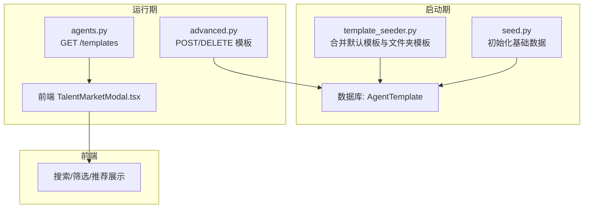
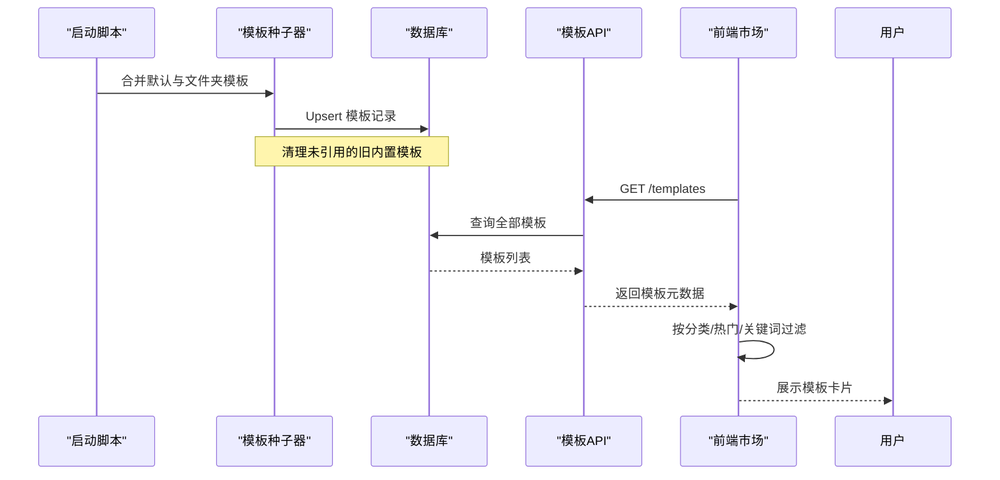
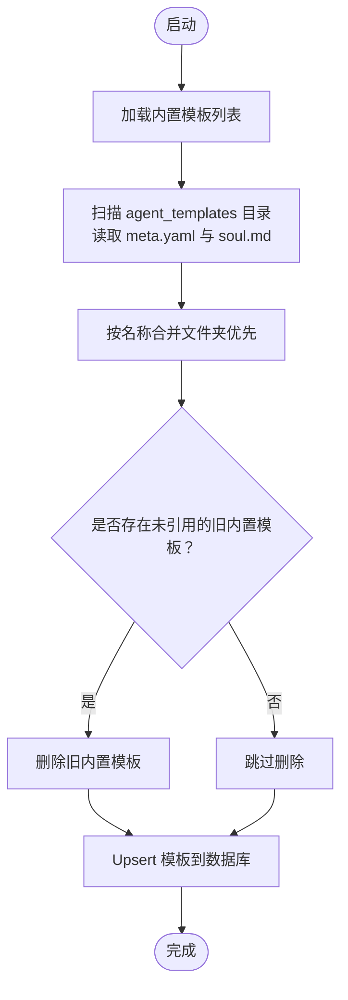
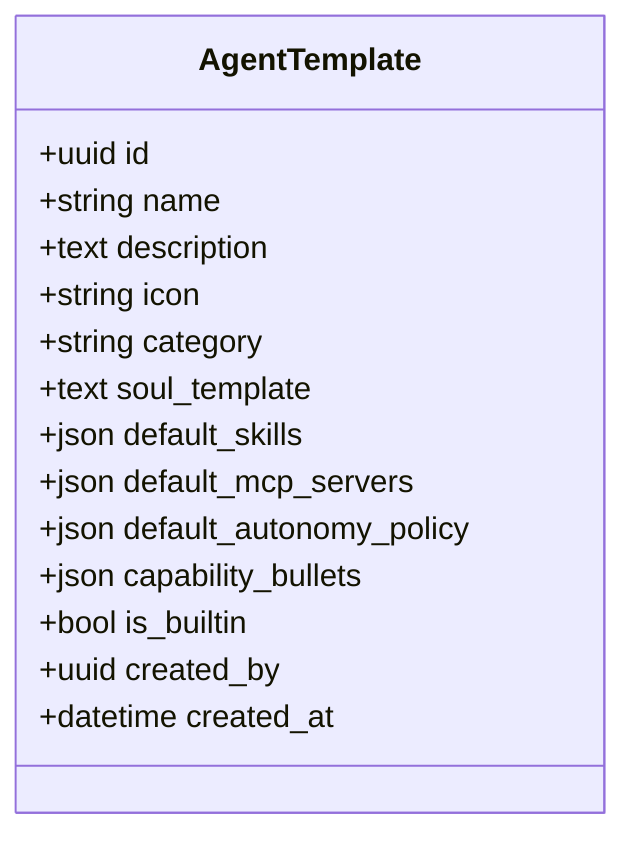
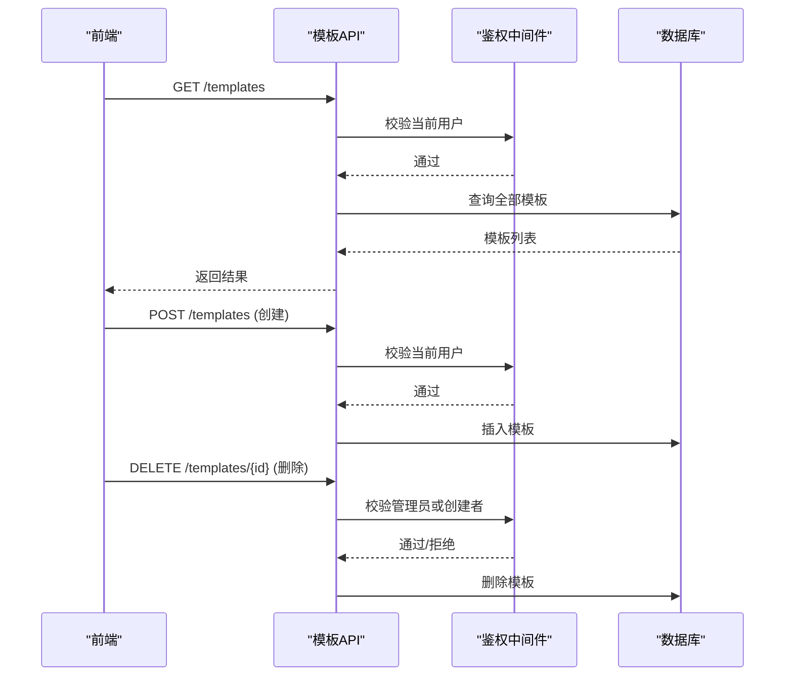
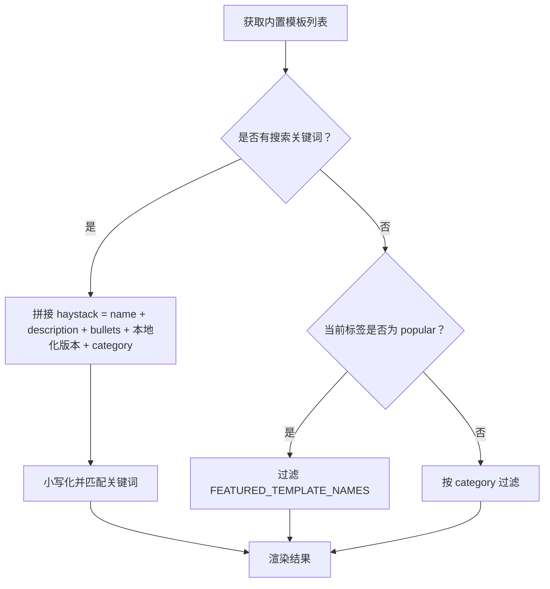
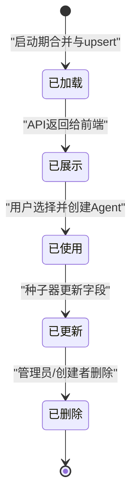
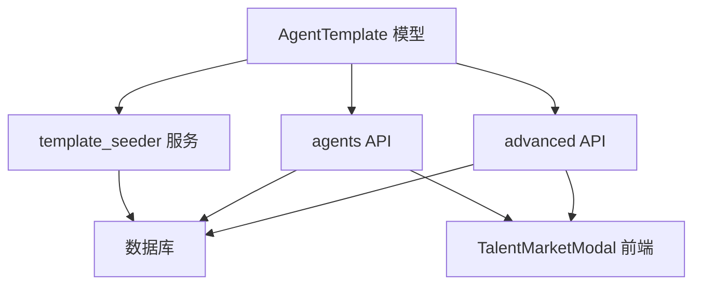
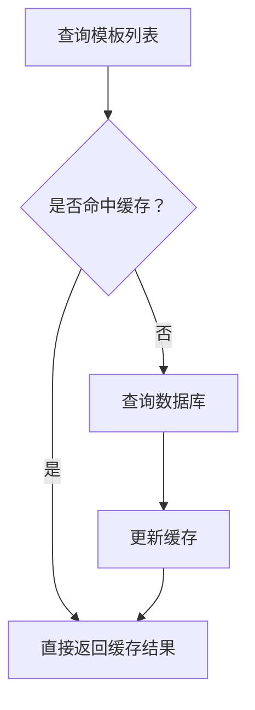

# 模板管理

<cite>
**本文引用的文件**   
- [template_seeder.py](file://backend/app/services/template_seeder.py)
- [seed.py](file://backend/seed.py)
- [agents.py](file://backend/app/api/agents.py)
- [advanced.py](file://backend/app/api/advanced.py)
- [agent.py](file://backend/app/models/agent.py)
- [TalentMarketModal.tsx](file://frontend/src/components/TalentMarketModal.tsx)
- [experience_retrieval.py](file://backend/app/services/experience_retrieval.py)
- [permissions.py](file://backend/app/core/permissions.py)
- [CONTEXT_COMPACT_DESIGN.md](file://.clawith-local-designs/CONTEXT_COMPACT_DESIGN.md)
</cite>

## 目录
1. [简介](#简介)
2. [项目结构](#项目结构)
3. [核心组件](#核心组件)
4. [架构总览](#架构总览)
5. [详细组件分析](#详细组件分析)
6. [依赖关系分析](#依赖关系分析)
7. [性能考虑](#性能考虑)
8. [故障排查指南](#故障排查指南)
9. [结论](#结论)
10. [附录](#附录)

## 简介
本文件系统性解析模板系统的管理机制，覆盖模板的加载、注册与生命周期管理；版本控制、更新机制与兼容性处理；权限控制与访问策略；搜索、筛选与推荐实现原理；以及性能优化与缓存策略的最佳实践。内容基于后端服务、API、数据模型与前端展示代码进行深度剖析，并辅以可视化图示帮助理解。

## 项目结构
模板系统由“启动时种子注入 + 运行时 API 暴露 + 前端市场展示”三部分构成：
- 启动期：从内置 Python 列表与文件夹（meta.yaml + soul.md）合并生成模板清单，写入数据库。
- 运行期：提供模板查询接口，支持按分类、热门等维度返回；支持创建/删除用户自定义模板。
- 前端：在人才市场弹窗中展示模板，支持多语言本地化后的搜索与筛选。

**图表来源** 
- [template_seeder.py:218-272](file://backend/app/services/template_seeder.py#L218-L272)
- [seed.py:48-98](file://backend/seed.py#L48-L98)
- [agents.py:142-168](file://backend/app/api/agents.py#L142-L168)
- [advanced.py:127-166](file://backend/app/api/advanced.py#L127-L166)
- [TalentMarketModal.tsx:81-106](file://frontend/src/components/TalentMarketModal.tsx#L81-L106)

**章节来源**
- [template_seeder.py:218-272](file://backend/app/services/template_seeder.py#L218-L272)
- [seed.py:48-98](file://backend/seed.py#L48-L98)
- [agents.py:142-168](file://backend/app/api/agents.py#L142-L168)
- [advanced.py:127-166](file://backend/app/api/advanced.py#L127-L166)
- [TalentMarketModal.tsx:81-106](file://frontend/src/components/TalentMarketModal.tsx#L81-L106)

## 核心组件
- 模板数据模型：AgentTemplate，包含名称、描述、图标、分类、灵魂模板、默认技能、MCP 服务器、自主性策略、能力要点、是否内置、创建时间与创建者。
- 模板种子器：合并内置与文件夹模板，执行 upsert，清理不再存在的旧内置模板（若未被引用）。
- 模板 API：列出所有模板；创建/删除用户自定义模板。
- 前端市场：过滤内置模板，支持按分类、热门与关键词搜索，且对中英文字段均匹配。

**章节来源**
- [agent.py:181-204](file://backend/app/models/agent.py#L181-L204)
- [template_seeder.py:275-339](file://backend/app/services/template_seeder.py#L275-L339)
- [agents.py:142-168](file://backend/app/api/agents.py#L142-L168)
- [advanced.py:127-166](file://backend/app/api/advanced.py#L127-L166)
- [TalentMarketModal.tsx:81-106](file://frontend/src/components/TalentMarketModal.tsx#L81-L106)

## 架构总览
模板系统的关键流程包括：
- 启动期模板加载与注册
- 运行时模板查询与展示
- 用户自定义模板的创建与删除
- 前端搜索、筛选与推荐

**图表来源** 
- [template_seeder.py:275-339](file://backend/app/services/template_seeder.py#L275-L339)
- [agents.py:142-168](file://backend/app/api/agents.py#L142-L168)
- [TalentMarketModal.tsx:81-106](file://frontend/src/components/TalentMarketModal.tsx#L81-L106)

## 详细组件分析

### 模板加载与注册（启动期）
- 数据来源：
  - 内置 Python 列表（历史兼容）
  - 文件夹模板（每个目录含 meta.yaml 与 soul.md）
- 合并策略：以名称为键，文件夹模板优先覆盖内置定义。
- 数据库操作：
  - 删除不再存在于当前清单中的旧内置模板（若没有被任何 Agent 引用）
  - 对现有模板执行字段级更新（描述、图标、分类、灵魂模板、默认技能、MCP 服务器、自主性策略、能力要点）
  - 新增不存在的模板

**图表来源** 
- [template_seeder.py:218-272](file://backend/app/services/template_seeder.py#L218-L272)
- [template_seeder.py:275-339](file://backend/app/services/template_seeder.py#L275-L339)

**章节来源**
- [template_seeder.py:218-272](file://backend/app/services/template_seeder.py#L218-L272)
- [template_seeder.py:275-339](file://backend/app/services/template_seeder.py#L275-L339)

### 模板版本控制与更新机制
- 版本控制策略：
  - 通过名称作为唯一标识进行 upsert，避免重复插入
  - 字段级更新确保描述、图标、分类、灵魂模板等随源码变更同步
- 兼容性处理：
  - 保留历史内置模板直到被迁移至文件夹模板
  - 清理不再存在但未被引用的旧模板，防止脏数据残留
- 初始数据：
  - seed.py 提供中文内置模板示例，用于快速体验

**图表来源** 
- [agent.py:181-204](file://backend/app/models/agent.py#L181-L204)

**章节来源**
- [template_seeder.py:275-339](file://backend/app/services/template_seeder.py#L275-L339)
- [seed.py:48-98](file://backend/seed.py#L48-L98)
- [agent.py:181-204](file://backend/app/models/agent.py#L181-L204)

### 模板权限控制与访问策略
- 模板列表接口：
  - 需要认证用户（get_current_user），返回所有模板（内置与非内置）
- 模板创建/删除：
  - 创建：普通用户可创建自定义模板
  - 删除：仅管理员或创建者可删除
- 组织与租户隔离：
  - 其他资源（如 Agent）使用 RBAC 与租户隔离，模板本身为平台级资源，但可通过分类与内置标记区分可见范围

**图表来源** 
- [agents.py:142-168](file://backend/app/api/agents.py#L142-L168)
- [advanced.py:127-166](file://backend/app/api/advanced.py#L127-L166)
- [permissions.py:1-41](file://backend/app/core/permissions.py#L1-L41)

**章节来源**
- [agents.py:142-168](file://backend/app/api/agents.py#L142-L168)
- [advanced.py:127-166](file://backend/app/api/advanced.py#L127-L166)
- [permissions.py:1-41](file://backend/app/core/permissions.py#L1-L41)

### 模板搜索、筛选与推荐实现原理
- 前端筛选：
  - 内置模板过滤（is_builtin）
  - 分类筛选（category）
  - 热门推荐（FEATURED_TEMPLATE_NAMES）
- 搜索逻辑：
  - 将英文与本地化后的名称、描述、能力要点拼接成 haystack
  - 小写化后匹配关键词，支持中英文混合搜索
- 推荐策略：
  - 热门标签集合决定“popular”页显示
  - 分类页按 category 过滤

**图表来源** 
- [TalentMarketModal.tsx:81-106](file://frontend/src/components/TalentMarketModal.tsx#L81-L106)

**章节来源**
- [TalentMarketModal.tsx:81-106](file://frontend/src/components/TalentMarketModal.tsx#L81-L106)

### 模板生命周期管理
- 启动期：
  - 合并内置与文件夹模板，执行 upsert
  - 清理未引用的旧内置模板
- 运行期：
  - 模板作为静态元数据，不参与运行时状态机
  - 创建 Agent 时可基于模板填充默认技能、MCP 服务器与自主性策略
- 删除期：
  - 管理员或创建者可删除自定义模板
  - 内置模板由种子器维护，不应手动删除

**图表来源** 
- [template_seeder.py:275-339](file://backend/app/services/template_seeder.py#L275-L339)
- [advanced.py:127-166](file://backend/app/api/advanced.py#L127-L166)

**章节来源**
- [template_seeder.py:275-339](file://backend/app/services/template_seeder.py#L275-L339)
- [advanced.py:127-166](file://backend/app/api/advanced.py#L127-L166)

## 依赖关系分析
- 模板模型依赖：
  - AgentTemplate 与 User（created_by）、Agent（引用模板）存在关联
- 服务依赖：
  - template_seeder 依赖数据库会话与模型
  - agents API 依赖数据库会话与模型
  - advanced API 依赖鉴权与数据库
- 前端依赖：
  - TalentMarketModal 依赖模板列表与本地化翻译

**图表来源** 
- [agent.py:181-204](file://backend/app/models/agent.py#L181-L204)
- [template_seeder.py:275-339](file://backend/app/services/template_seeder.py#L275-L339)
- [agents.py:142-168](file://backend/app/api/agents.py#L142-L168)
- [advanced.py:127-166](file://backend/app/api/advanced.py#L127-L166)
- [TalentMarketModal.tsx:81-106](file://frontend/src/components/TalentMarketModal.tsx#L81-L106)

**章节来源**
- [agent.py:181-204](file://backend/app/models/agent.py#L181-L204)
- [template_seeder.py:275-339](file://backend/app/services/template_seeder.py#L275-L339)
- [agents.py:142-168](file://backend/app/api/agents.py#L142-L168)
- [advanced.py:127-166](file://backend/app/api/advanced.py#L127-L166)
- [TalentMarketModal.tsx:81-106](file://frontend/src/components/TalentMarketModal.tsx#L81-L106)

## 性能考虑
- 模板列表查询：
  - 单次查询全部模板，无分页；适合模板数量较小的场景
  - 建议后续引入分页与缓存（Redis）以提升高并发下的响应速度
- 前端搜索：
  - 内存中拼接 haystack 并匹配，复杂度 O(n*m)，n 为模板数，m 为关键词长度
  - 建议对 haystack 建立倒排索引或使用全文检索引擎（如 Elasticsearch）
- 上下文压缩与缓存：
  - 经验检索模块使用内存缓存（_EXPANSION_CACHE）限制大小，避免无限增长
  - 模板元数据可考虑服务端缓存（如 Redis）以减少数据库压力

**图表来源** 
- [experience_retrieval.py:201-230](file://backend/app/services/experience_retrieval.py#L201-L230)

**章节来源**
- [experience_retrieval.py:201-230](file://backend/app/services/experience_retrieval.py#L201-L230)

## 故障排查指南
- 模板未显示：
  - 检查启动日志中模板加载是否成功（缺失 meta.yaml 或 soul.md 会跳过）
  - 确认数据库中存在对应模板记录
- 搜索无效：
  - 检查前端 haystack 拼接是否包含目标字段
  - 确认关键词大小写与本地化翻译是否正确
- 权限错误：
  - 确认用户已登录且具备相应权限（创建/删除）
  - 检查租户隔离与 RBAC 配置

**章节来源**
- [template_seeder.py:218-272](file://backend/app/services/template_seeder.py#L218-L272)
- [TalentMarketModal.tsx:81-106](file://frontend/src/components/TalentMarketModal.tsx#L81-L106)
- [permissions.py:1-41](file://backend/app/core/permissions.py#L1-L41)

## 结论
模板系统通过启动期种子注入与运行时 API 暴露，实现了模板的加载、注册、版本控制与权限管理。前端市场提供了灵活的搜索、筛选与推荐能力。未来可进一步优化查询性能（分页、缓存）与搜索能力（全文检索），并增强模板的生命周期管理与审计追踪。

## 附录
- 上下文压缩设计参考：[CONTEXT_COMPACT_DESIGN.md](file://.clawith-local-designs/CONTEXT_COMPACT_DESIGN.md)