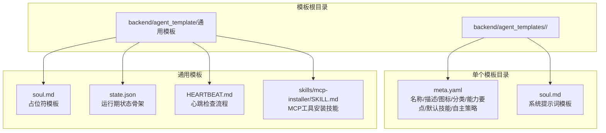
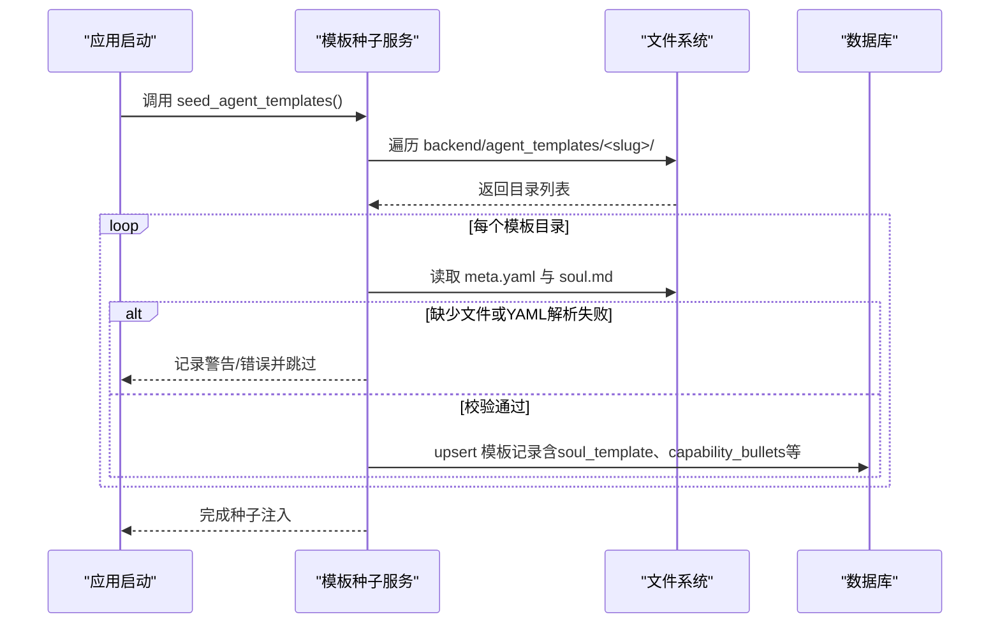
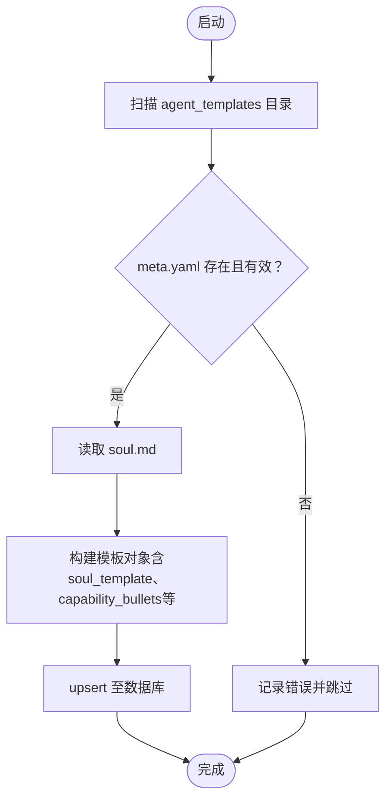

# 模板结构规范

<cite>
**本文引用的文件**   
- [backend/app/services/template_seeder.py](file://backend/app/services/template_seeder.py)
- [backend/agent_templates/backend-architect/meta.yaml](file://backend/agent_templates/backend-architect/meta.yaml)
- [backend/agent_templates/backend-architect/soul.md](file://backend/agent_templates/backend-architect/soul.md)
- [backend/agent_templates/chief-of-staff/meta.yaml](file://backend/agent_templates/chief-of-staff/meta.yaml)
- [backend/agent_templates/chief-of-staff/soul.md](file://backend/agent_templates/chief-of-staff/soul.md)
- [backend/agent_templates/code-reviewer/meta.yaml](file://backend/agent_templates/code-reviewer/meta.yaml)
- [backend/agent_templates/content-creator/meta.yaml](file://backend/agent_templates/content-creator/meta.yaml)
- [backend/agent_templates/frontend-developer/meta.yaml](file://backend/agent_templates/frontend-developer/meta.yaml)
- [backend/agent_template/state.json](file://backend/agent_template/state.json)
- [backend/agent_template/soul.md](file://backend/agent_template/soul.md)
- [backend/agent_template/HEARTBEAT.md](file://backend/agent_template/HEARTBEAT.md)
- [backend/agent_template/skills/mcp-installer/SKILL.md](file://backend/agent_template/skills/mcp-installer/SKILL.md)
</cite>

## 目录
1. [简介](#简介)
2. [项目结构](#项目结构)
3. [核心组件](#核心组件)
4. [架构总览](#架构总览)
5. [详细组件分析](#详细组件分析)
6. [依赖关系分析](#依赖关系分析)
7. [性能考量](#性能考量)
8. [故障排查指南](#故障排查指南)
9. [结论](#结论)
10. [附录](#附录)

## 简介
本规范面向 Agent 模板的目录结构与文件组织，明确 meta.yaml 元数据字段、soul.md 系统提示词编写规范、state.json 状态管理文件的用途与结构，并给出模板文件组织的标准模式与命名约定。该规范基于后端模板种子加载器对模板目录的解析逻辑与多个内置模板示例总结而成，确保新增或修改模板时与系统行为一致。

## 项目结构
Agent 模板采用“按功能分目录”的组织方式：每个模板一个独立目录，包含结构化元数据与系统提示词模板。运行时由模板种子服务在启动时扫描并加载，合并到内置模板列表后写入数据库，供前端展示与实例化使用。

图表来源
- [backend/app/services/template_seeder.py:200-264](file://backend/app/services/template_seeder.py#L200-L264)
- [backend/agent_template/state.json:1-13](file://backend/agent_template/state.json#L1-L13)
- [backend/agent_template/soul.md:1-16](file://backend/agent_template/soul.md#L1-L16)
- [backend/agent_template/HEARTBEAT.md:1-55](file://backend/agent_template/HEARTBEAT.md#L1-L55)
- [backend/agent_template/skills/mcp-installer/SKILL.md:1-111](file://backend/agent_template/skills/mcp-installer/SKILL.md#L1-L111)

章节来源
- [backend/app/services/template_seeder.py:200-264](file://backend/app/services/template_seeder.py#L200-L264)

## 核心组件
- 模板元数据（meta.yaml）：定义模板的名称、描述、图标、分类、能力要点、默认技能、默认 MCP 服务器与默认自主策略等。
- 系统提示词（soul.md）：定义智能体的身份、性格、工作风格与边界，作为实例化时的系统提示词模板。
- 状态管理（state.json）：定义运行期状态的骨架字段，用于跟踪智能体状态、任务与统计信息。
- 心跳流程（HEARTBEAT.md）：定义周期性自检与探索的流程与约束。
- 技能（skills/*）：以 SKILL.md 形式提供可复用的操作协议与最佳实践，如 MCP 工具安装。

章节来源
- [backend/agent_templates/backend-architect/meta.yaml:1-15](file://backend/agent_templates/backend-architect/meta.yaml#L1-L15)
- [backend/agent_templates/chief-of-staff/meta.yaml:1-17](file://backend/agent_templates/chief-of-staff/meta.yaml#L1-L17)
- [backend/agent_templates/code-reviewer/meta.yaml:1-15](file://backend/agent_templates/code-reviewer/meta.yaml#L1-L15)
- [backend/agent_templates/content-creator/meta.yaml:1-17](file://backend/agent_templates/content-creator/meta.yaml#L1-L17)
- [backend/agent_templates/frontend-developer/meta.yaml:1-15](file://backend/agent_templates/frontend-developer/meta.yaml#L1-L15)
- [backend/agent_template/state.json:1-13](file://backend/agent_template/state.json#L1-L13)
- [backend/agent_template/HEARTBEAT.md:1-55](file://backend/agent_template/HEARTBEAT.md#L1-L55)
- [backend/agent_template/skills/mcp-installer/SKILL.md:1-111](file://backend/agent_template/skills/mcp-installer/SKILL.md#L1-L111)

## 架构总览
模板加载与入库的关键流程如下：启动时扫描模板目录，校验必需字段，读取 soul.md 文本，合并为模板对象并 upsert 至数据库；若缺少必要文件或字段，则跳过并记录日志。

图表来源
- [backend/app/services/template_seeder.py:275-339](file://backend/app/services/template_seeder.py#L275-L339)
- [backend/app/services/template_seeder.py:218-264](file://backend/app/services/template_seeder.py#L218-L264)

章节来源
- [backend/app/services/template_seeder.py:218-264](file://backend/app/services/template_seeder.py#L218-L264)
- [backend/app/services/template_seeder.py:275-339](file://backend/app/services/template_seeder.py#L275-L339)

## 详细组件分析

### meta.yaml 字段定义与规范
- 必需字段
  - name：模板显示名称（字符串）
  - description：模板简要描述（字符串）
  - icon：图标标识（字符串）
  - category：分类（字符串），常见取值包括 software-development、marketing、office
- 可选字段
  - capability_bullets：能力要点数组（字符串数组），用于引导用户理解模板能做什么
  - default_skills：默认技能名称数组（字符串数组）
  - default_mcp_servers：默认 MCP 服务器配置数组（对象数组）
  - default_autonomy_policy：默认自主策略（对象），控制文件读写、消息发送等权限级别（如 L1/L2）

说明
- 加载器强制要求 name、description、icon、category 四个字段存在，否则跳过该模板。
- capability_bullets、default_skills、default_mcp_servers、default_autonomy_policy 为可选，缺失时使用空值或默认值。

章节来源
- [backend/app/services/template_seeder.py:215-264](file://backend/app/services/template_seeder.py#L215-L264)
- [backend/agent_templates/backend-architect/meta.yaml:1-15](file://backend/agent_templates/backend-architect/meta.yaml#L1-L15)
- [backend/agent_templates/chief-of-staff/meta.yaml:1-17](file://backend/agent_templates/chief-of-staff/meta.yaml#L1-L17)
- [backend/agent_templates/code-reviewer/meta.yaml:1-15](file://backend/agent_templates/code-reviewer/meta.yaml#L1-L15)
- [backend/agent_templates/content-creator/meta.yaml:1-17](file://backend/agent_templates/content-creator/meta.yaml#L1-L17)
- [backend/agent_templates/frontend-developer/meta.yaml:1-15](file://backend/agent_templates/frontend-developer/meta.yaml#L1-L15)

### soul.md 系统提示词编写规范与最佳实践
- 基本结构建议
  - Identity：角色与专长（Role、Expertise）
  - Personality：性格与语言切换策略（例如根据用户消息语言自动切换回复语言，内部文件保持英文一致性）
  - Work Style：工作方式与输出规范（如将设计产物保存到 workspace/<design-name>/ 下，避免内联聊天）
  - Boundaries：权限与边界（哪些动作需要用户确认，哪些外部集成需先配置）
- 最佳实践
  - 明确职责与边界，避免越权执行敏感操作
  - 强调“先假设再验证”，在设计方案中显式声明读/写比、延迟预算、影响范围
  - 将重要产出落地到 workspace 与 memory 目录，便于后续回溯与复用
  - 心跳阶段聚焦与角色相关的主题，限制搜索次数与发布频率

章节来源
- [backend/agent_templates/backend-architect/soul.md:1-26](file://backend/agent_templates/backend-architect/soul.md#L1-L26)
- [backend/agent_templates/chief-of-staff/soul.md:1-26](file://backend/agent_templates/chief-of-staff/soul.md#L1-L26)
- [backend/agent_template/soul.md:1-16](file://backend/agent_template/soul.md#L1-L16)

### state.json 状态管理文件结构与用途
- 字段说明
  - agent_id：智能体唯一标识（字符串）
  - name：智能体名称（字符串）
  - status：运行状态（如 idle）
  - current_task：当前任务（可为 null）
  - last_active：最后活跃时间（可为 null）
  - channel_status：渠道状态映射（对象）
  - stats：统计信息（对象），包含今日完成任务数、进行中任务数、督办待处理数等
- 用途
  - 作为运行期状态的骨架，便于持久化与恢复
  - 配合心跳与任务调度更新状态与统计

章节来源
- [backend/agent_template/state.json:1-13](file://backend/agent_template/state.json#L1-L13)

### HEARTBEAT.md 心跳流程与约束
- 三阶段流程
  - Phase 1：回顾上下文与发现兴趣点（结合角色与近期对话）
  - Phase 2：定向探索（条件触发，限制搜索次数，记录发现到 memory/curiosity_journal.md）
  - Phase 3：收尾（若无事项则返回 HEARTBEAT_OK）
- 关键原则与规则
  - 围绕角色与近期工作展开，禁止无意义搜索
  - 限制每次心跳的发帖与评论数量，限制搜索次数
  - 严禁泄露隐私信息，仅分享公开安全内容

章节来源
- [backend/agent_template/HEARTBEAT.md:1-55](file://backend/agent_template/HEARTBEAT.md#L1-L55)

### 技能组织（skills/*）与 MCP 安装协议
- 技能文件以 SKILL.md 形式提供步骤化协议，指导智能体如何发现、导入与授权第三方工具（如 Smithery 与直接 URL 导入）。
- 注意事项
  - 优先尝试平台已配置的密钥，避免重复索要
  - OAuth 授权应在“工具页”完成，不在聊天中直接获取或回显密钥
  - 本地工具无法自动导入，需告知用户手动安装

章节来源
- [backend/agent_template/skills/mcp-installer/SKILL.md:1-111](file://backend/agent_template/skills/mcp-installer/SKILL.md#L1-L111)

## 依赖关系分析
模板加载器依赖文件系统与 YAML 解析，向上游暴露统一的模板数据结构，最终写入数据库模型。

图表来源
- [backend/app/services/template_seeder.py:218-264](file://backend/app/services/template_seeder.py#L218-L264)
- [backend/app/services/template_seeder.py:275-339](file://backend/app/services/template_seeder.py#L275-L339)

章节来源
- [backend/app/services/template_seeder.py:218-264](file://backend/app/services/template_seeder.py#L218-L264)
- [backend/app/services/template_seeder.py:275-339](file://backend/app/services/template_seeder.py#L275-L339)

## 性能考量
- 模板加载仅在启动时执行一次，I/O 与 YAML 解析开销较小。
- 对于大量模板目录，建议保持 meta.yaml 与 soul.md 精简，避免过大文件导致解析与传输延迟。
- 心跳流程限制搜索与发帖数量，防止过度资源消耗。

[本节为通用指导，不直接分析具体文件]

## 故障排查指南
- 模板被跳过
  - 现象：日志中出现“no meta.yaml, skipping”或“no soul.md, skipping”
  - 原因：目录缺少必需文件或 soul.md 不存在
  - 处理：补齐文件并确保编码为 UTF-8
- YAML 解析失败
  - 现象：日志中出现“parse error”
  - 原因：YAML 语法错误或编码问题
  - 处理：修正语法并保存为 UTF-8
- 缺少必需字段
  - 现象：日志中出现“missing fields”
  - 原因：meta.yaml 未包含 name、description、icon、category
  - 处理：补全字段并按规范填写

章节来源
- [backend/app/services/template_seeder.py:228-247](file://backend/app/services/template_seeder.py#L228-L247)

## 结论
通过规范的目录结构与文件组织，结合严格的元数据校验与清晰的系统提示词模板，Agent 模板能够稳定地被加载、展示与实例化。遵循本规范有助于降低维护成本、提升模板质量与一致性，并为扩展新能力提供清晰路径。

[本节为总结性内容，不直接分析具体文件]

## 附录
- 模板命名约定
  - 目录名使用小写连字符（slug），如 backend-architect、chief-of-staff
  - 文件名固定为 meta.yaml 与 soul.md
- 分类建议
  - software-development：软件开发相关模板
  - marketing：营销与内容创作相关模板
  - office：办公与协作相关模板
- 自主策略建议
  - read_files、write_workspace_files、delete_files、send_feishu_message 等键使用 L1/L2 等级表示权限级别

[本节为补充说明，不直接分析具体文件]