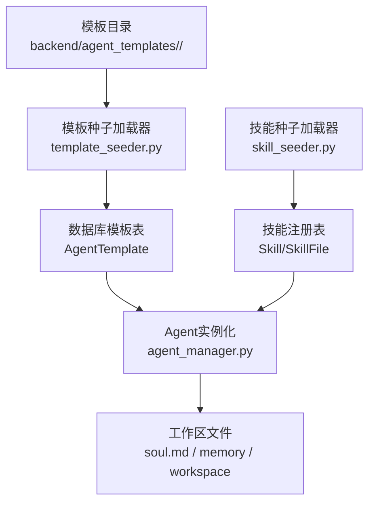
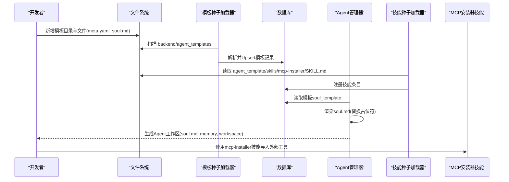
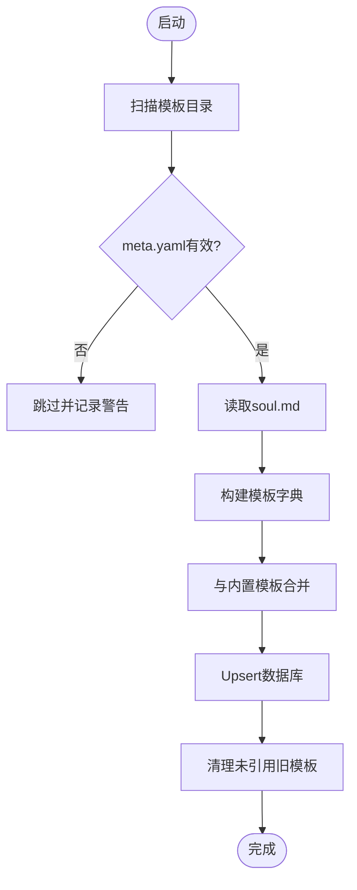
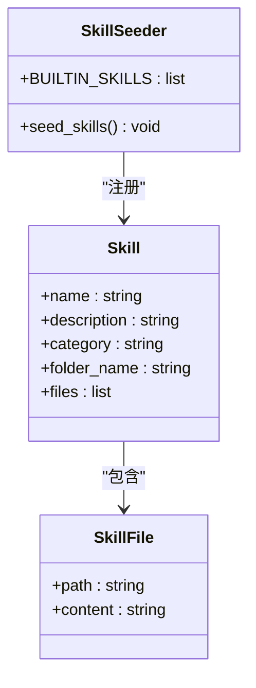
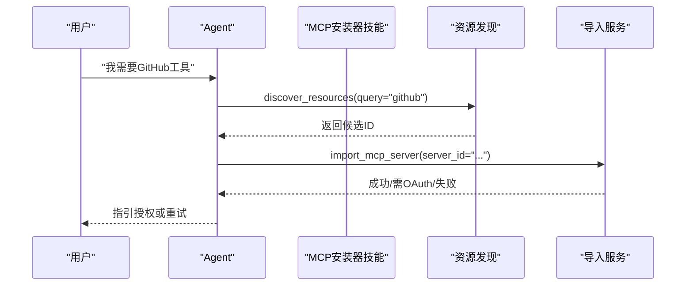
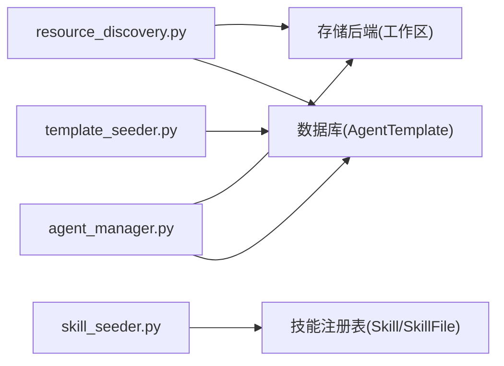

# 自定义模板开发

<cite>
**本文引用的文件**   
- [backend/agent_templates/backend-architect/meta.yaml](file://backend/agent_templates/backend-architect/meta.yaml)
- [backend/agent_templates/backend-architect/soul.md](file://backend/agent_templates/backend-architect/soul.md)
- [backend/agent_templates/chief-of-staff/meta.yaml](file://backend/agent_templates/chief-of-staff/meta.yaml)
- [backend/agent_templates/chief-of-staff/soul.md](file://backend/agent_templates/chief-of-staff/soul.md)
- [backend/agent_templates/code-reviewer/meta.yaml](file://backend/agent_templates/code-reviewer/meta.yaml)
- [backend/agent_templates/code-reviewer/soul.md](file://backend/agent_templates/code-reviewer/soul.md)
- [backend/agent_template/soul.md](file://backend/agent_template/soul.md)
- [backend/agent_template/state.json](file://backend/agent_template/state.json)
- [backend/agent_template/skills/mcp-installer/SKILL.md](file://backend/agent_template/skills/mcp-installer/SKILL.md)
- [backend/app/services/template_seeder.py](file://backend/app/services/template_seeder.py)
- [backend/app/services/skill_seeder.py](file://backend/app/services/skill_seeder.py)
- [backend/app/services/agent_manager.py](file://backend/app/services/agent_manager.py)
- [backend/app/services/resource_discovery.py](file://backend/app/services/resource_discovery.py)
</cite>

## 目录
1. [简介](#简介)
2. [项目结构](#项目结构)
3. [核心组件](#核心组件)
4. [架构总览](#架构总览)
5. [详细组件分析](#详细组件分析)
6. [依赖关系分析](#依赖关系分析)
7. [性能与可扩展性](#性能与可扩展性)
8. [故障排查指南](#故障排查指南)
9. [结论](#结论)
10. [附录：模板打包、测试与发布流程](#附录模板打包测试与发布流程)

## 简介
本指南面向希望为平台创建“自定义Agent模板”的开发者，覆盖从模板目录结构设计、meta.yaml元数据编写、soul.md系统提示词设计，到技能包开发与集成（含MCP安装器）、以及模板打包、测试与发布的完整流程。文档以仓库中现有模板与种子加载逻辑为依据，提供可操作的步骤与最佳实践建议。

## 项目结构
- 模板存放位置：backend/agent_templates/<slug>/，每个模板包含 meta.yaml 与 soul.md。
- 模板种子加载：后端启动时由 template_seeder.py 扫描该目录，将模板合并入数据库。
- 技能包注册：skill_seeder.py 负责内置技能注入，其中 mcp-installer 技能内容来源于 backend/agent_template/skills/mcp-installer/SKILL.md。
- Agent实例化：agent_manager.py 在创建Agent时渲染 soul.md 模板，并写入工作区。

**图表来源** 
- [backend/app/services/template_seeder.py:202-262](file://backend/app/services/template_seeder.py#L202-L262)
- [backend/app/services/skill_seeder.py:951-973](file://backend/app/services/skill_seeder.py#L951-L973)
- [backend/app/services/agent_manager.py:138-163](file://backend/app/services/agent_manager.py#L138-L163)

**章节来源**
- [backend/app/services/template_seeder.py:202-262](file://backend/app/services/template_seeder.py#L202-L262)
- [backend/app/services/skill_seeder.py:951-973](file://backend/app/services/skill_seeder.py#L951-L973)
- [backend/app/services/agent_manager.py:138-163](file://backend/app/services/agent_manager.py#L138-L163)

## 核心组件
- 模板元数据（meta.yaml）：定义模板名称、描述、图标、分类、能力要点、默认技能、默认自主策略等。
- 系统提示词（soul.md）：定义角色身份、个性、工作方式、边界等，作为Agent人格与行为准则。
- 模板种子加载器（template_seeder.py）：启动时扫描模板目录，解析并入库；支持覆盖旧模板。
- 技能种子加载器（skill_seeder.py）：注入内置技能，包括 mcp-installer 等。
- Agent管理器（agent_manager.py）：根据模板渲染 soul.md，生成实例工作区文件。

**章节来源**
- [backend/agent_templates/backend-architect/meta.yaml:1-15](file://backend/agent_templates/backend-architect/meta.yaml#L1-L15)
- [backend/agent_templates/backend-architect/soul.md:1-26](file://backend/agent_templates/backend-architect/soul.md#L1-L26)
- [backend/app/services/template_seeder.py:202-262](file://backend/app/services/template_seeder.py#L202-L262)
- [backend/app/services/skill_seeder.py:951-973](file://backend/app/services/skill_seeder.py#L951-L973)
- [backend/app/services/agent_manager.py:138-163](file://backend/app/services/agent_manager.py#L138-L163)

## 架构总览
下图展示了模板从文件到运行时生效的关键路径：模板文件被种子加载器读取并入库，Agent实例化时按模板渲染提示词，技能包通过技能种子注入，MCP安装器技能指导用户导入外部工具。

**图表来源** 
- [backend/app/services/template_seeder.py:275-339](file://backend/app/services/template_seeder.py#L275-L339)
- [backend/app/services/skill_seeder.py:951-973](file://backend/app/services/skill_seeder.py#L951-L973)
- [backend/app/services/agent_manager.py:138-163](file://backend/app/services/agent_manager.py#L138-L163)
- [backend/agent_template/skills/mcp-installer/SKILL.md:1-111](file://backend/agent_template/skills/mcp-installer/SKILL.md#L1-L111)

## 详细组件分析

### 模板目录结构与命名规范
- 目录名：<slug>，建议使用小写英文与连字符，如 backend-architect。
- 必需文件：
  - meta.yaml：模板元数据，必须包含 name、description、icon、category。
  - soul.md：系统提示词，定义Agent人格与工作边界。
- 可选字段：capability_bullets、default_skills、default_autonomy_policy、default_mcp_servers。

示例参考：
- [backend/agent_templates/backend-architect/meta.yaml:1-15](file://backend/agent_templates/backend-architect/meta.yaml#L1-L15)
- [backend/agent_templates/chief-of-staff/meta.yaml:1-17](file://backend/agent_templates/chief-of-staff/meta.yaml#L1-L17)
- [backend/agent_templates/code-reviewer/meta.yaml:1-15](file://backend/agent_templates/code-reviewer/meta.yaml#L1-L15)

**章节来源**
- [backend/app/services/template_seeder.py:218-262](file://backend/app/services/template_seeder.py#L218-L262)

### meta.yaml 配置详解
- name：模板显示名称。
- description：模板用途简述。
- icon：图标标识（短字符串）。
- category：分类（如 software-development、marketing、office）。
- capability_bullets：能力要点列表，用于引导与展示。
- default_skills：默认绑定的技能包名称列表。
- default_autonomy_policy：默认自主策略，控制读/写/删除等操作级别。
- default_mcp_servers：默认MCP服务器配置（可选）。

示例参考：
- [backend/agent_templates/backend-architect/meta.yaml:1-15](file://backend/agent_templates/backend-architect/meta.yaml#L1-L15)
- [backend/agent_templates/chief-of-staff/meta.yaml:1-17](file://backend/agent_templates/chief-of-staff/meta.yaml#L1-L17)
- [backend/agent_templates/code-reviewer/meta.yaml:1-15](file://backend/agent_templates/code-reviewer/meta.yaml#L1-L15)

**章节来源**
- [backend/app/services/template_seeder.py:218-262](file://backend/app/services/template_seeder.py#L218-L262)

### soul.md 系统提示词设计
- Identity：角色与专长。
- Personality：性格与语言习惯（支持自动检测用户语言）。
- Work Style：工作流程、输出规范、记忆与心跳关注点。
- Boundaries：权限与边界，明确需要用户确认的操作。

示例参考：
- [backend/agent_templates/backend-architect/soul.md:1-26](file://backend/agent_templates/backend-architect/soul.md#L1-L26)
- [backend/agent_templates/chief-of-staff/soul.md:1-26](file://backend/agent_templates/chief-of-staff/soul.md#L1-L26)
- [backend/agent_templates/code-reviewer/soul.md:1-26](file://backend/agent_templates/code-reviewer/soul.md#L1-L26)

模板渲染机制：
- 启动时由 template_seeder.py 读取 soul.md 文本作为 soul_template。
- Agent实例化时，agent_manager.py 渲染模板（替换 {name}、{creator_name}、{created_at} 等占位符），写入工作区。

**章节来源**
- [backend/app/services/template_seeder.py:249-261](file://backend/app/services/template_seeder.py#L249-L261)
- [backend/app/services/agent_manager.py:138-163](file://backend/app/services/agent_manager.py#L138-L163)

### 模板种子加载器（template_seeder.py）
- 扫描 backend/agent_templates 下所有子目录。
- 校验 meta.yaml 必填字段（name、description、icon、category）。
- 读取 soul.md 文本，组装模板字典。
- 与内置Python模板合并，同名覆盖。
- Upsert至数据库，清理不再使用的旧模板（未被引用时）。

**图表来源** 
- [backend/app/services/template_seeder.py:218-262](file://backend/app/services/template_seeder.py#L218-L262)
- [backend/app/services/template_seeder.py:275-339](file://backend/app/services/template_seeder.py#L275-L339)

**章节来源**
- [backend/app/services/template_seeder.py:218-262](file://backend/app/services/template_seeder.py#L218-L262)
- [backend/app/services/template_seeder.py:275-339](file://backend/app/services/template_seeder.py#L275-L339)

### 技能包开发与集成（含MCP安装器）
- 技能包结构：每个技能一个文件夹，包含 SKILL.md（主说明）与可选脚本/示例。
- 内置技能注册：skill_seeder.py 维护 BUILTIN_SKILLS，动态注入文件内容。
- MCP安装器技能：位于 backend/agent_template/skills/mcp-installer/SKILL.md，指导用户通过 discover_resources 与 import_mcp_server 导入工具。

**图表来源** 
- [backend/app/services/skill_seeder.py:1-800](file://backend/app/services/skill_seeder.py#L1-L800)
- [backend/agent_template/skills/mcp-installer/SKILL.md:1-111](file://backend/agent_template/skills/mcp-installer/SKILL.md#L1-L111)

**章节来源**
- [backend/app/services/skill_seeder.py:951-973](file://backend/app/services/skill_seeder.py#L951-L973)
- [backend/agent_template/skills/mcp-installer/SKILL.md:1-111](file://backend/agent_template/skills/mcp-installer/SKILL.md#L1-L111)

### MCP安装器使用流程
- Step 1：discover_resources 搜索可用资源。
- Step 2：选择导入方式（Smithery或直链URL）。
- Step 3：import_mcp_server 执行导入，必要时提供 Smithery API Key。
- Step 4：处理OAuth授权（在工具的“Tools”页面完成授权）。
- Step 5：验证连接可用性，失败则回退或提示用户配置。

**图表来源** 
- [backend/agent_template/skills/mcp-installer/SKILL.md:1-111](file://backend/agent_template/skills/mcp-installer/SKILL.md#L1-L111)
- [backend/app/services/resource_discovery.py:1061-1072](file://backend/app/services/resource_discovery.py#L1061-L1072)

**章节来源**
- [backend/agent_template/skills/mcp-installer/SKILL.md:1-111](file://backend/agent_template/skills/mcp-installer/SKILL.md#L1-L111)
- [backend/app/services/resource_discovery.py:1061-1072](file://backend/app/services/resource_discovery.py#L1061-L1072)

### 模板状态与工作区
- state.json：模板级状态结构，包含 agent_id、status、current_task、stats 等。
- 工作区文件：soul.md、memory、workspace 等由 agent_manager.py 初始化与渲染。

示例参考：
- [backend/agent_template/state.json:1-13](file://backend/agent_template/state.json#L1-L13)
- [backend/app/services/agent_manager.py:138-163](file://backend/app/services/agent_manager.py#L138-L163)

**章节来源**
- [backend/agent_template/state.json:1-13](file://backend/agent_template/state.json#L1-L13)
- [backend/app/services/agent_manager.py:138-163](file://backend/app/services/agent_manager.py#L138-L163)

## 依赖关系分析
- template_seeder.py 依赖 YAML解析与SQLAlchemy会话，读取文件系统模板并写入数据库。
- skill_seeder.py 依赖内置技能清单与文件系统（SKILL.md），注入技能注册表。
- agent_manager.py 依赖数据库查询模板soul_template，渲染后写入存储后端。
- resource_discovery.py 提供MCP工具发现与导入逻辑，供mcp-installer技能调用。

**图表来源** 
- [backend/app/services/template_seeder.py:275-339](file://backend/app/services/template_seeder.py#L275-L339)
- [backend/app/services/skill_seeder.py:1-800](file://backend/app/services/skill_seeder.py#L1-L800)
- [backend/app/services/agent_manager.py:138-163](file://backend/app/services/agent_manager.py#L138-L163)
- [backend/app/services/resource_discovery.py:1061-1072](file://backend/app/services/resource_discovery.py#L1061-L1072)

**章节来源**
- [backend/app/services/template_seeder.py:275-339](file://backend/app/services/template_seeder.py#L275-L339)
- [backend/app/services/skill_seeder.py:1-800](file://backend/app/services/skill_seeder.py#L1-L800)
- [backend/app/services/agent_manager.py:138-163](file://backend/app/services/agent_manager.py#L138-L163)
- [backend/app/services/resource_discovery.py:1061-1072](file://backend/app/services/resource_discovery.py#L1061-L1072)

## 性能与可扩展性
- 模板扫描与解析：建议在启动阶段异步进行，避免阻塞主进程。
- 数据库Upsert：批量操作减少往返开销，注意索引优化（name、is_builtin）。
- 技能注入：按需加载大文件内容，避免内存峰值。
- 工作区渲染：缓存已渲染模板，减少重复IO。

[本节为通用建议，不直接分析具体文件]

## 故障排查指南
- 模板缺失必填字段：检查 meta.yaml 是否包含 name、description、icon、category。
- soul.md缺失：确保模板目录包含 soul.md，否则会被跳过。
- YAML解析错误：检查语法与编码（UTF-8）。
- MCP导入失败：确认Smithery API Key或直链URL正确，按指引完成OAuth授权。
- 工作区渲染异常：核对模板占位符与渲染逻辑。

**章节来源**
- [backend/app/services/template_seeder.py:218-262](file://backend/app/services/template_seeder.py#L218-L262)
- [backend/agent_template/skills/mcp-installer/SKILL.md:1-111](file://backend/agent_template/skills/mcp-installer/SKILL.md#L1-L111)

## 结论
通过遵循本指南，你可以高效地创建、集成与发布自定义Agent模板。关键在于规范的目录结构、清晰的元数据与提示词设计，以及与技能包和MCP安装器的无缝对接。利用种子加载机制，模板可在启动时自动生效，并在Agent实例化时渲染个性化工作区。

[本节为总结，不直接分析具体文件]

## 附录：模板打包、测试与发布流程
- 打包：
  - 确保模板目录包含 meta.yaml 与 soul.md。
  - 如需技能包，将 SKILL.md 放入对应 skills 子目录。
- 测试：
  - 启动后端，观察模板种子加载日志。
  - 创建Agent实例，验证工作区文件是否正确渲染。
  - 使用mcp-installer技能测试工具导入流程。
- 发布：
  - 提交模板变更至代码库。
  - 更新版本与变更记录。
  - 通知团队与用户。

[本节为流程建议，不直接分析具体文件]