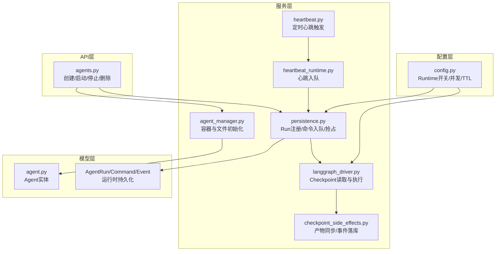
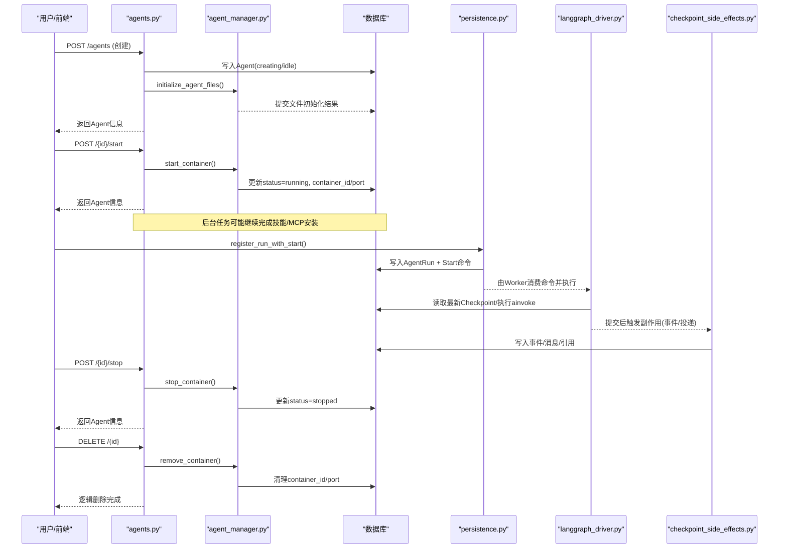
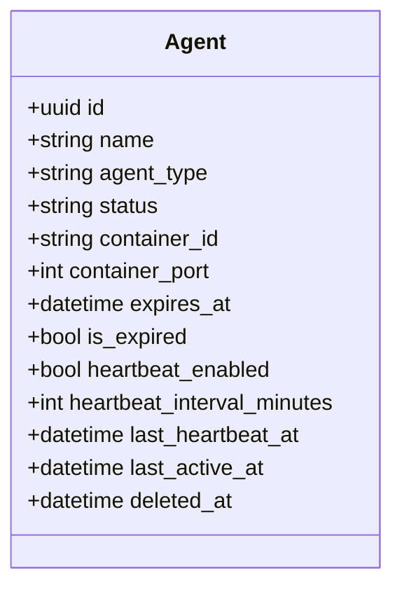
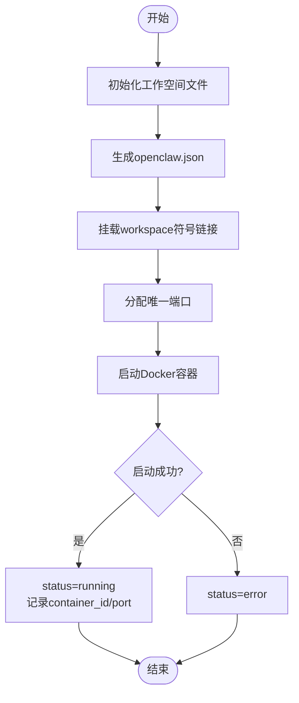
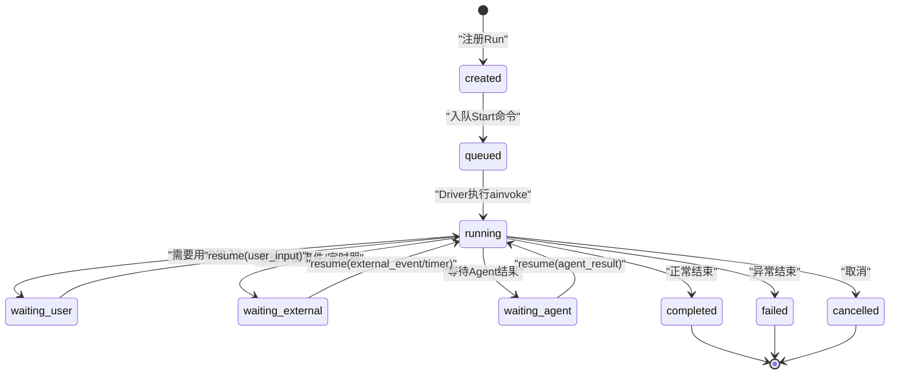
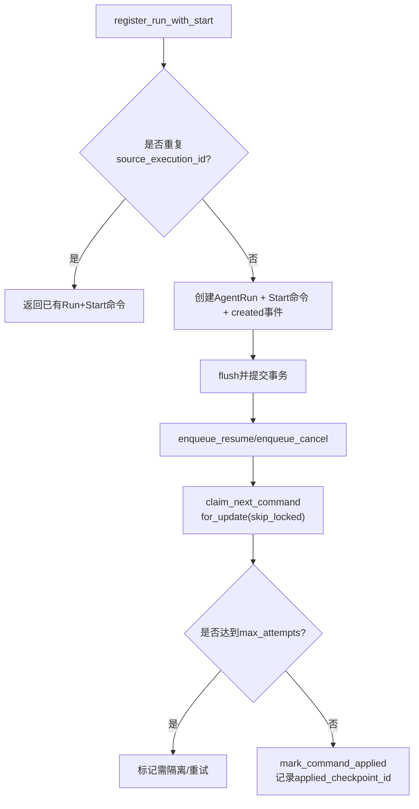
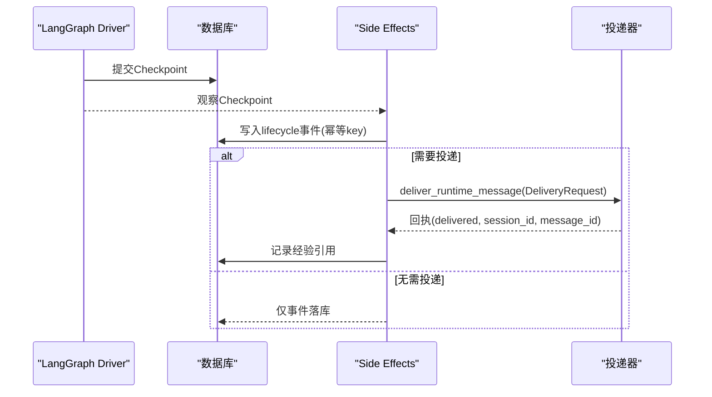
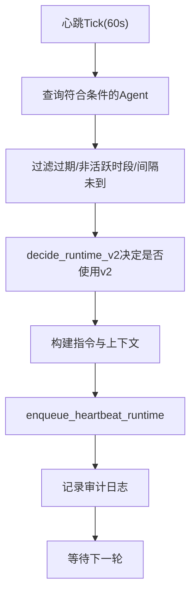
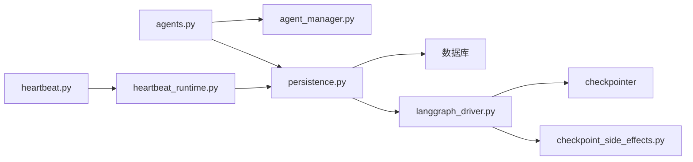

# Agent生命周期管理

<cite>
**本文引用的文件**   
- [backend/app/services/agent_manager.py](file://backend/app/services/agent_manager.py)
- [backend/app/models/agent.py](file://backend/app/models/agent.py)
- [backend/app/api/agents.py](file://backend/app/api/agents.py)
- [backend/app/services/agent_runtime/state.py](file://backend/app/services/agent_runtime/state.py)
- [backend/app/services/agent_runtime/persistence.py](file://backend/app/services/agent_runtime/persistence.py)
- [backend/app/services/agent_runtime/langgraph_driver.py](file://backend/app/services/agent_runtime/langgraph_driver.py)
- [backend/app/services/agent_runtime/checkpoint_side_effects.py](file://backend/app/services/agent_runtime/checkpoint_side_effects.py)
- [backend/app/services/heartbeat.py](file://backend/app/services/heartbeat.py)
- [backend/app/services/heartbeat_runtime.py](file://backend/app/services/heartbeat_runtime.py)
- [backend/app/config.py](file://backend/app/config.py)
</cite>

## 目录
1. [简介](#简介)
2. [项目结构](#项目结构)
3. [核心组件](#核心组件)
4. [架构总览](#架构总览)
5. [详细组件分析](#详细组件分析)
6. [依赖关系分析](#依赖关系分析)
7. [性能考量](#性能考量)
8. [故障排查指南](#故障排查指南)
9. [结论](#结论)
10. [附录](#附录)

## 简介
本文件系统性阐述Agent（数字员工）的生命周期管理机制，覆盖从创建、启动、运行、暂停、停止到删除的完整流程；解释Agent状态机与运行时执行状态机的差异与协作；说明资源管理（容器、存储、会话）、内存清理、会话恢复与健康检查、故障恢复等关键机制。文档面向开发者与运维人员，既提供高层概览，也给出代码级路径以便快速定位实现。

## 项目结构
围绕Agent生命周期的关键模块分布如下：
- API层：对外暴露创建、启动、停止、删除等接口
- 服务层：Agent管理器（容器与文件初始化）、心跳调度、持久化命令队列、LangGraph驱动、检查点副作用处理
- 模型层：Agent实体与运行时相关表（Run、Command、Event）
- 配置层：Runtime开关、并发、TTL、重试等参数

图表来源
- [backend/app/api/agents.py:1121-1154](file://backend/app/api/agents.py#L1121-L1154)
- [backend/app/services/agent_manager.py:250-376](file://backend/app/services/agent_manager.py#L250-L376)
- [backend/app/services/agent_runtime/persistence.py:321-522](file://backend/app/services/agent_runtime/persistence.py#L321-L522)
- [backend/app/services/agent_runtime/langgraph_driver.py:395-491](file://backend/app/services/agent_runtime/langgraph_driver.py#L395-L491)
- [backend/app/services/agent_runtime/checkpoint_side_effects.py:654-800](file://backend/app/services/agent_runtime/checkpoint_side_effects.py#L654-L800)
- [backend/app/services/heartbeat.py:185-349](file://backend/app/services/heartbeat.py#L185-L349)
- [backend/app/services/heartbeat_runtime.py:81-131](file://backend/app/services/heartbeat_runtime.py#L81-L131)
- [backend/app/config.py:124-145](file://backend/app/config.py#L124-L145)

章节来源
- [backend/app/api/agents.py:1121-1154](file://backend/app/api/agents.py#L1121-L1154)
- [backend/app/services/agent_manager.py:250-376](file://backend/app/services/agent_manager.py#L250-L376)
- [backend/app/services/agent_runtime/persistence.py:321-522](file://backend/app/services/agent_runtime/persistence.py#L321-L522)
- [backend/app/services/agent_runtime/langgraph_driver.py:395-491](file://backend/app/services/agent_runtime/langgraph_driver.py#L395-L491)
- [backend/app/services/agent_runtime/checkpoint_side_effects.py:654-800](file://backend/app/services/agent_runtime/checkpoint_side_effects.py#L654-L800)
- [backend/app/services/heartbeat.py:185-349](file://backend/app/services/heartbeat.py#L185-L349)
- [backend/app/services/heartbeat_runtime.py:81-131](file://backend/app/services/heartbeat_runtime.py#L81-L131)
- [backend/app/config.py:124-145](file://backend/app/config.py#L124-L145)

## 核心组件
- AgentManager：负责Agent工作空间文件初始化、OpenClaw配置文件生成、Docker容器启停与状态查询
- Runtime Persistence：Run注册、命令入队、抢占与幂等控制、Lane锁、尝试次数限制
- LangGraph Driver：基于LangGraph的线程状态读取、命令执行（start/resume/cancel语义）、Checkpoint一致性校验
- Checkpoint Side Effects：将已提交的Checkpoint投影为产品侧事件、消息投递、经验引用记录
- Heartbeat：周期性扫描可触发的Agent，构造指令并进入统一Runtime
- Agent模型：定义Agent实体字段（status、container_id/port、过期时间、心跳配置等）

章节来源
- [backend/app/services/agent_manager.py:51-376](file://backend/app/services/agent_manager.py#L51-L376)
- [backend/app/services/agent_runtime/persistence.py:321-522](file://backend/app/services/agent_runtime/persistence.py#L321-L522)
- [backend/app/services/agent_runtime/langgraph_driver.py:323-491](file://backend/app/services/agent_runtime/langgraph_driver.py#L323-L491)
- [backend/app/services/agent_runtime/checkpoint_side_effects.py:554-800](file://backend/app/services/agent_runtime/checkpoint_side_effects.py#L554-L800)
- [backend/app/services/heartbeat.py:185-349](file://backend/app/services/heartbeat.py#L185-L349)
- [backend/app/models/agent.py:19-146](file://backend/app/models/agent.py#L19-L146)

## 架构总览
下图展示Agent从创建到销毁的关键调用链路与数据流，包括API、容器管理、运行时持久化、LangGraph执行与产物同步。

图表来源
- [backend/app/api/agents.py:409-591](file://backend/app/api/agents.py#L409-L591)
- [backend/app/api/agents.py:1121-1154](file://backend/app/api/agents.py#L1121-L1154)
- [backend/app/api/agents.py:1100-1119](file://backend/app/api/agents.py#L1100-L1119)
- [backend/app/services/agent_manager.py:250-376](file://backend/app/services/agent_manager.py#L250-L376)
- [backend/app/services/agent_runtime/persistence.py:321-401](file://backend/app/services/agent_runtime/persistence.py#L321-L401)
- [backend/app/services/agent_runtime/langgraph_driver.py:395-491](file://backend/app/services/agent_runtime/langgraph_driver.py#L395-L491)
- [backend/app/services/agent_runtime/checkpoint_side_effects.py:654-800](file://backend/app/services/agent_runtime/checkpoint_side_effects.py#L654-L800)

## 详细组件分析

### Agent实体与状态机（平台层）
- 状态枚举：creating、running、idle、stopped、error
- 关键字段：container_id、container_port、expires_at、is_expired、last_active_at、heartbeat_*
- 行为约束：
  - 创建时根据类型设置初始状态（native→creating，openclaw→idle）
  - 启动/停止会更新status与容器端口
  - 过期时自动标记is_expired并置stopped

图表来源
- [backend/app/models/agent.py:19-146](file://backend/app/models/agent.py#L19-L146)

章节来源
- [backend/app/models/agent.py:19-146](file://backend/app/models/agent.py#L19-L146)

### 容器与工作空间管理（AgentManager）
- 工作空间初始化：从模板或共享存储拉取文件，渲染soul.md/memory/reflections/HEARTBEAT等
- 启动容器：生成openclaw.json、挂载工作空间、分配端口、设置环境变量与重启策略
- 停止/删除容器：优雅停止、清理ID与端口、异常容错（NotFound/DockerException）
- 健康查询：返回running、status、ports、created等元信息

图表来源
- [backend/app/services/agent_manager.py:94-228](file://backend/app/services/agent_manager.py#L94-L228)
- [backend/app/services/agent_manager.py:250-316](file://backend/app/services/agent_manager.py#L250-L316)
- [backend/app/services/agent_manager.py:317-376](file://backend/app/services/agent_manager.py#L317-L376)

章节来源
- [backend/app/services/agent_manager.py:94-228](file://backend/app/services/agent_manager.py#L94-L228)
- [backend/app/services/agent_manager.py:250-316](file://backend/app/services/agent_manager.py#L250-L316)
- [backend/app/services/agent_manager.py:317-376](file://backend/app/services/agent_manager.py#L317-L376)

### 运行时状态机（LangGraph）
- 生命周期状态：created、queued、running、waiting_user、waiting_external、waiting_agent、verifying、completed、failed、cancelled
- 控制路由：compact、model、tool、verify、wait、terminal
- 节点名称：control_guard、compact、model、tool、verify、wait、terminal
- 执行语义：
  - start：无Checkpoint时创建初始状态并进入图执行
  - resume：仅允许在waiting_*状态下按correlation_id与resume_type恢复
  - cancel：由控制面处理，保留最后Checkpoint并由Side Effects投影为cancelled

图表来源
- [backend/app/services/agent_runtime/state.py:16-44](file://backend/app/services/agent_runtime/state.py#L16-L44)
- [backend/app/services/agent_runtime/langgraph_driver.py:395-491](file://backend/app/services/agent_runtime/langgraph_driver.py#L395-L491)

章节来源
- [backend/app/services/agent_runtime/state.py:16-44](file://backend/app/services/agent_runtime/state.py#L16-L44)
- [backend/app/services/agent_runtime/langgraph_driver.py:395-491](file://backend/app/services/agent_runtime/langgraph_driver.py#L395-L491)

### 持久化与命令队列（Persistence）
- Run注册：幂等source_execution_id、唯一run_id、附带start命令与created事件
- 命令入队：幂等idempotency_key、attempt_count上限、lane抢占保护
- 抢占与锁定：for_update(skip_locked)、lane_held、position排序
- 应用标记：applied_checkpoint_id、product_sync_pending用于后续产物同步

图表来源
- [backend/app/services/agent_runtime/persistence.py:321-401](file://backend/app/services/agent_runtime/persistence.py#L321-L401)
- [backend/app/services/agent_runtime/persistence.py:403-475](file://backend/app/services/agent_runtime/persistence.py#L403-L475)
- [backend/app/services/agent_runtime/persistence.py:524-674](file://backend/app/services/agent_runtime/persistence.py#L524-L674)
- [backend/app/services/agent_runtime/persistence.py:763-800](file://backend/app/services/agent_runtime/persistence.py#L763-L800)

章节来源
- [backend/app/services/agent_runtime/persistence.py:321-401](file://backend/app/services/agent_runtime/persistence.py#L321-L401)
- [backend/app/services/agent_runtime/persistence.py:403-475](file://backend/app/services/agent_runtime/persistence.py#L403-L475)
- [backend/app/services/agent_runtime/persistence.py:524-674](file://backend/app/services/agent_runtime/persistence.py#L524-L674)
- [backend/app/services/agent_runtime/persistence.py:763-800](file://backend/app/services/agent_runtime/persistence.py#L763-L800)

### 检查点副作用与产物同步（Checkpoint Side Effects）
- 事件投影：将Checkpoint中的messages与lifecycle映射为活动事件（thinking/progress/tool_call）
- 终端产物：completed/failed/cancelled时生成DeliveryRequest进行消息投递
- 经验引用：投递成功后记录经验引用统计
- 幂等性：基于idempotency_key与checkpoint_id保证重放安全

图表来源
- [backend/app/services/agent_runtime/checkpoint_side_effects.py:203-229](file://backend/app/services/agent_runtime/checkpoint_side_effects.py#L203-L229)
- [backend/app/services/agent_runtime/checkpoint_side_effects.py:458-552](file://backend/app/services/agent_runtime/checkpoint_side_effects.py#L458-L552)
- [backend/app/services/agent_runtime/checkpoint_side_effects.py:654-800](file://backend/app/services/agent_runtime/checkpoint_side_effects.py#L654-L800)

章节来源
- [backend/app/services/agent_runtime/checkpoint_side_effects.py:203-229](file://backend/app/services/agent_runtime/checkpoint_side_effects.py#L203-L229)
- [backend/app/services/agent_runtime/checkpoint_side_effects.py:458-552](file://backend/app/services/agent_runtime/checkpoint_side_effects.py#L458-L552)
- [backend/app/services/agent_runtime/checkpoint_side_effects.py:654-800](file://backend/app/services/agent_runtime/checkpoint_side_effects.py#L654-L800)

### 心跳与后台任务（Heartbeat）
- 周期扫描：筛选enabled且处于running/idle的Agent，考虑过期、活跃时段、间隔
- 指令构建：读取HEARTBEAT.md、最近活动、未读通知，注入上下文
- 入队：通过heartbeat_runtime.enqueue_heartbeat_runtime进入统一Runtime
- Oneshot：支持一次性后台任务，带最大轮次限制

图表来源
- [backend/app/services/heartbeat.py:185-349](file://backend/app/services/heartbeat.py#L185-L349)
- [backend/app/services/heartbeat_runtime.py:81-131](file://backend/app/services/heartbeat_runtime.py#L81-L131)

章节来源
- [backend/app/services/heartbeat.py:185-349](file://backend/app/services/heartbeat.py#L185-L349)
- [backend/app/services/heartbeat_runtime.py:81-131](file://backend/app/services/heartbeat_runtime.py#L81-L131)

### API与操作入口
- 创建Agent：POST /agents，支持模板、权限、模型选择，后台异步初始化
- 启动Agent：POST /{id}/start，调用AgentManager启动容器
- 停止Agent：POST /{id}/stop，调用AgentManager停止容器
- 删除Agent：DELETE /{id}，逻辑删除并尝试移除容器

章节来源
- [backend/app/api/agents.py:409-591](file://backend/app/api/agents.py#L409-L591)
- [backend/app/api/agents.py:1121-1154](file://backend/app/api/agents.py#L1121-L1154)
- [backend/app/api/agents.py:1100-1119](file://backend/app/api/agents.py#L1100-L1119)

## 依赖关系分析
- API层依赖AgentManager与持久化模块
- 持久化模块依赖SQLAlchemy与数据库表（AgentRun、AgentRunCommand、AgentRunEvent）
- LangGraph驱动依赖Graph编译实例与Checkpointer
- Side Effects依赖投递器与事件表
- Heartbeat依赖Runtime决策与入队接口

图表来源
- [backend/app/api/agents.py:409-591](file://backend/app/api/agents.py#L409-L591)
- [backend/app/services/agent_runtime/persistence.py:321-401](file://backend/app/services/agent_runtime/persistence.py#L321-L401)
- [backend/app/services/agent_runtime/langgraph_driver.py:323-491](file://backend/app/services/agent_runtime/langgraph_driver.py#L323-L491)
- [backend/app/services/agent_runtime/checkpoint_side_effects.py:554-800](file://backend/app/services/agent_runtime/checkpoint_side_effects.py#L554-L800)
- [backend/app/services/heartbeat.py:185-349](file://backend/app/services/heartbeat.py#L185-L349)
- [backend/app/services/heartbeat_runtime.py:81-131](file://backend/app/services/heartbeat_runtime.py#L81-L131)

章节来源
- [backend/app/api/agents.py:409-591](file://backend/app/api/agents.py#L409-L591)
- [backend/app/services/agent_runtime/persistence.py:321-401](file://backend/app/services/agent_runtime/persistence.py#L321-L401)
- [backend/app/services/agent_runtime/langgraph_driver.py:323-491](file://backend/app/services/agent_runtime/langgraph_driver.py#L323-L491)
- [backend/app/services/agent_runtime/checkpoint_side_effects.py:554-800](file://backend/app/services/agent_runtime/checkpoint_side_effects.py#L554-L800)
- [backend/app/services/heartbeat.py:185-349](file://backend/app/services/heartbeat.py#L185-L349)
- [backend/app/services/heartbeat_runtime.py:81-131](file://backend/app/services/heartbeat_runtime.py#L81-L131)

## 性能考量
- 并发控制：AGENT_RUNTIME_COMMAND_CONCURRENCY限制Worker并发；claim_ttl_seconds与renew_seconds保障长任务不丢失
- 重试与幂等：attempt_count上限、idempotency_key避免重复执行；IntegrityError回退到已有记录
- Lane锁：per-Run lane_held与position排序防止冲突执行
- 会话压缩：SESSION_COMPACT_MESSAGE_THRESHOLD与SUMMARY_THRESHOLD_RATIO控制消息压缩阈值
- 容器资源：每个Agent独立容器与端口，避免端口冲突；restart_policy确保自愈

章节来源
- [backend/app/config.py:124-145](file://backend/app/config.py#L124-L145)
- [backend/app/services/agent_runtime/persistence.py:524-674](file://backend/app/services/agent_runtime/persistence.py#L524-L674)
- [backend/app/services/agent_runtime/langgraph_driver.py:395-491](file://backend/app/services/agent_runtime/langgraph_driver.py#L395-L491)

## 故障排查指南
- 容器无法启动
  - 检查Docker可用性、镜像配置、端口占用
  - 查看Agent状态是否为error，确认openclaw.json与环境变量
  - 参考：[backend/app/services/agent_manager.py:250-316](file://backend/app/services/agent_manager.py#L250-L316)
- 运行时卡住或无法恢复
  - 检查Checkpoint是否存在、lifecycle.status是否为waiting_*
  - 确认resume的correlation_id与resume_type匹配
  - 参考：[backend/app/services/agent_runtime/langgraph_driver.py:412-491](file://backend/app/services/agent_runtime/langgraph_driver.py#L412-L491)
- 命令堆积或重复执行
  - 检查idempotency_key与attempt_count；确认claim是否超时
  - 参考：[backend/app/services/agent_runtime/persistence.py:403-475](file://backend/app/services/agent_runtime/persistence.py#L403-L475)
- 产物未投递或事件缺失
  - 检查delivery_status与投递回执；确认Side Effects是否被触发
  - 参考：[backend/app/services/agent_runtime/checkpoint_side_effects.py:654-800](file://backend/app/services/agent_runtime/checkpoint_side_effects.py#L654-L800)
- 心跳未触发
  - 检查Agent是否过期、活跃时段、间隔未到；确认Runtime v2开关
  - 参考：[backend/app/services/heartbeat.py:185-349](file://backend/app/services/heartbeat.py#L185-L349)

章节来源
- [backend/app/services/agent_manager.py:250-316](file://backend/app/services/agent_manager.py#L250-L316)
- [backend/app/services/agent_runtime/langgraph_driver.py:412-491](file://backend/app/services/agent_runtime/langgraph_driver.py#L412-L491)
- [backend/app/services/agent_runtime/persistence.py:403-475](file://backend/app/services/agent_runtime/persistence.py#L403-L475)
- [backend/app/services/agent_runtime/checkpoint_side_effects.py:654-800](file://backend/app/services/agent_runtime/checkpoint_side_effects.py#L654-L800)
- [backend/app/services/heartbeat.py:185-349](file://backend/app/services/heartbeat.py#L185-L349)

## 结论
本系统通过“平台层Agent状态机 + 运行时LangGraph状态机”的双层设计，实现了高可靠、可恢复、可扩展的Agent生命周期管理。借助幂等命令队列、Lane锁、Checkpoint与Side Effects，系统在失败场景下具备强一致性与自愈能力。结合心跳与Oneshot机制，Agent可在多通道与多场景中稳定运行。

## 附录
- 健康检查建议
  - 定期调用get_container_status监控容器健康
  - 监听AgentRunEvent中的failed/cancelled事件告警
  - 监控心跳触发与投递回执，及时发现阻塞
- 资源清理建议
  - 删除Agent前确保容器已停止并清理container_id/port
  - 清理工作空间与记忆文件，避免磁盘膨胀
- 会话恢复建议
  - 使用read_checkpoint按checkpoint_id精确恢复
  - 确保resume的correlation_id与payload与waiting checkpoint一致