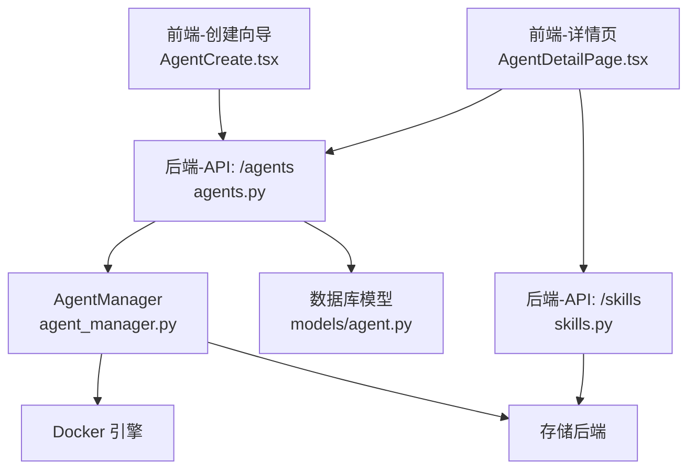
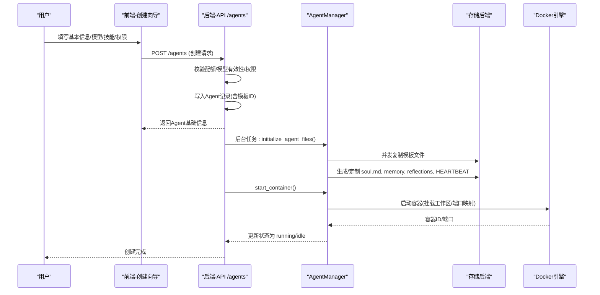
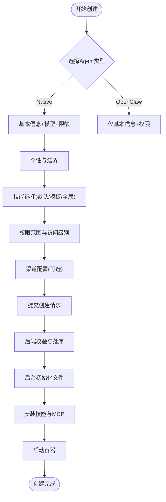
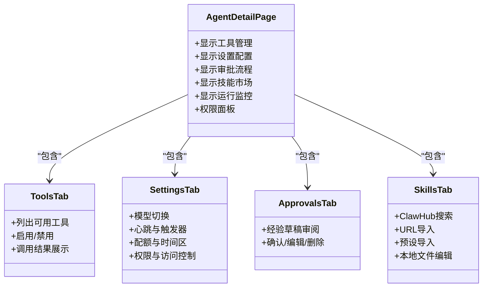
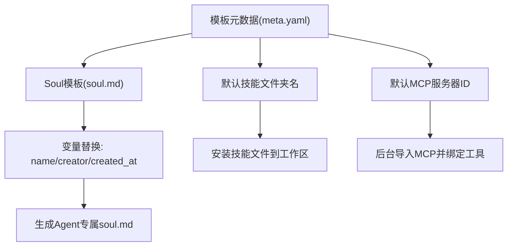
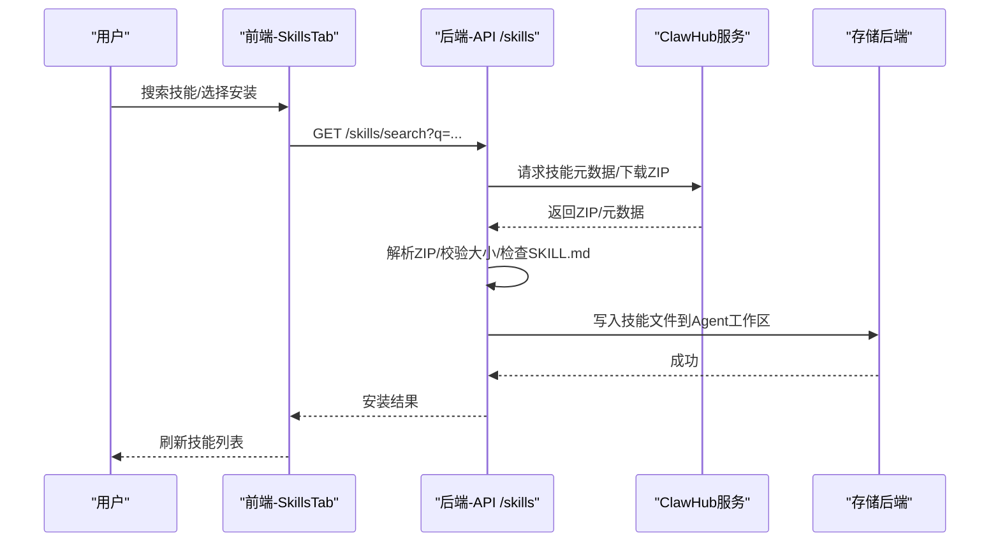
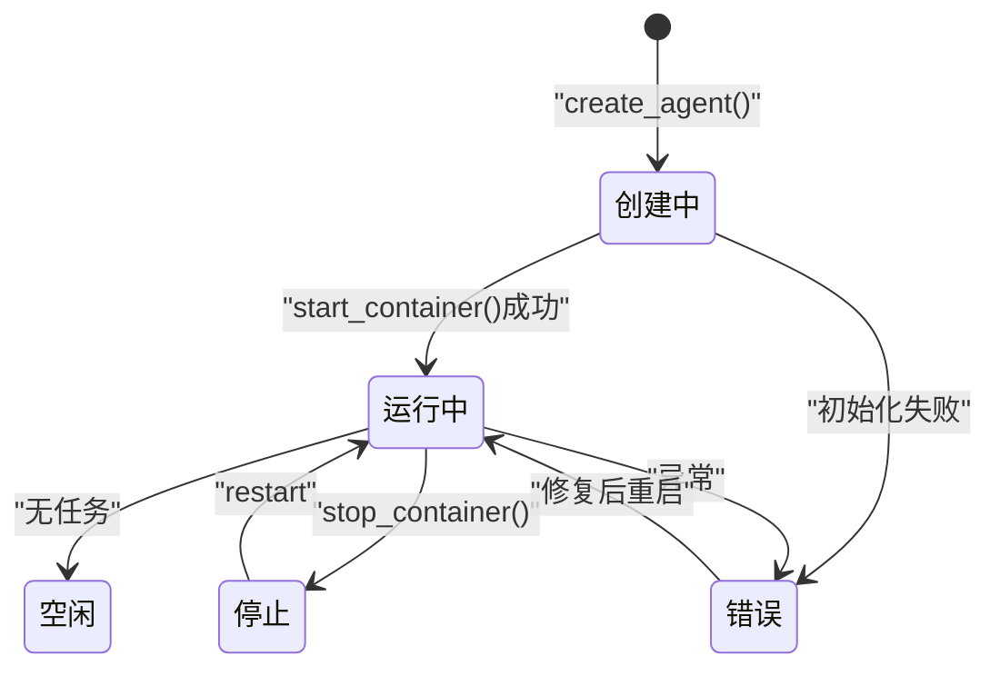
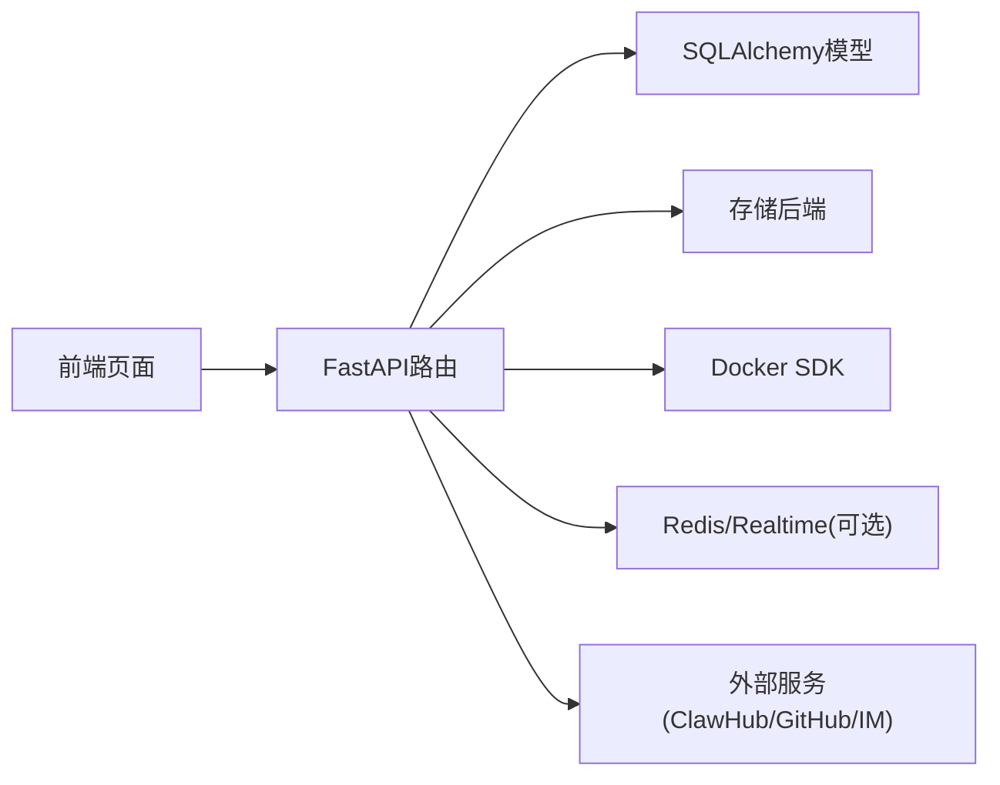

# Agent管理

<cite>
**本文引用的文件**   
- [backend/app/main.py](file://backend/app/main.py)
- [backend/app/api/agents.py](file://backend/app/api/agents.py)
- [backend/app/services/agent_manager.py](file://backend/app/services/agent_manager.py)
- [backend/app/models/agent.py](file://backend/app/models/agent.py)
- [frontend/src/pages/AgentCreate.tsx](file://frontend/src/pages/AgentCreate.tsx)
- [frontend/src/pages/AgentDetail.tsx](file://frontend/src/pages/AgentDetail.tsx)
- [frontend/src/pages/agent-detail/AgentDetailPage.tsx](file://frontend/src/pages/agent-detail/AgentDetailPage.tsx)
- [frontend/src/pages/agent-detail/tabs/SkillsTab.tsx](file://frontend/src/pages/agent-detail/tabs/SkillsTab.tsx)
- [backend/app/api/skills.py](file://backend/app/api/skills.py)
- [backend/agent_templates/backend-architect/meta.yaml](file://backend/agent_templates/backend-architect/meta.yaml)
- [backend/agent_templates/backend-architect/soul.md](file://backend/agent_templates/backend-architect/soul.md)
</cite>

## 目录
1. [简介](#简介)
2. [项目结构](#项目结构)
3. [核心组件](#核心组件)
4. [架构总览](#架构总览)
5. [详细组件分析](#详细组件分析)
6. [依赖关系分析](#依赖关系分析)
7. [性能与容量规划](#性能与容量规划)
8. [故障排查指南](#故障排查指南)
9. [结论](#结论)
10. [附录：模板与技能开发规范](#附录模板与技能开发规范)

## 简介
本指南面向平台管理员、企业租户管理员与高级用户，系统化说明如何在系统中创建与管理Agent（数字员工），涵盖：
- 创建流程：模板选择、参数配置、技能安装、渠道绑定
- 详情页功能：工具管理、设置配置、审批流程、权限与访问控制
- 运行状态监控：容器生命周期、心跳、触发器、会话与事件
- 模板系统与技能市场：内置模板、ClawHub技能市场、自定义技能导入
- 最佳实践与性能优化建议

## 项目结构
后端采用FastAPI应用，启动时完成数据库初始化、种子数据注入、后台任务与连接器启动；前端提供多步骤创建向导与Agent详情页。关键路径：
- 应用入口与路由注册：backend/app/main.py
- Agent API：backend/app/api/agents.py
- Agent运行时与容器管理：backend/app/services/agent_manager.py
- 模型定义：backend/app/models/agent.py
- 前端创建页：frontend/src/pages/AgentCreate.tsx
- 前端详情页与子模块：frontend/src/pages/AgentDetail.tsx、frontend/src/pages/agent-detail/AgentDetailPage.tsx、frontend/src/pages/agent-detail/tabs/SkillsTab.tsx
- 技能市场API：backend/app/api/skills.py
- 模板元数据与Soul模板：backend/agent_templates/*/meta.yaml、soul.md

**图表来源** 
- [backend/app/main.py:374-470](file://backend/app/main.py#L374-L470)
- [backend/app/api/agents.py:39-40](file://backend/app/api/agents.py#L39-L40)
- [backend/app/services/agent_manager.py:51-60](file://backend/app/services/agent_manager.py#L51-L60)
- [backend/app/models/agent.py:19-160](file://backend/app/models/agent.py#L19-L160)
- [frontend/src/pages/AgentCreate.tsx:1-120](file://frontend/src/pages/AgentCreate.tsx#L1-L120)
- [frontend/src/pages/agent-detail/AgentDetailPage.tsx:1-80](file://frontend/src/pages/agent-detail/AgentDetailPage.tsx#L1-L80)
- [frontend/src/pages/agent-detail/tabs/SkillsTab.tsx:1-80](file://frontend/src/pages/agent-detail/tabs/SkillsTab.tsx#L1-L80)
- [backend/app/api/skills.py:1-60](file://backend/app/api/skills.py#L1-L60)

**章节来源**
- [backend/app/main.py:374-470](file://backend/app/main.py#L374-L470)
- [backend/app/api/agents.py:39-40](file://backend/app/api/agents.py#L39-L40)
- [backend/app/services/agent_manager.py:51-60](file://backend/app/services/agent_manager.py#L51-L60)
- [backend/app/models/agent.py:19-160](file://backend/app/models/agent.py#L19-L160)
- [frontend/src/pages/AgentCreate.tsx:1-120](file://frontend/src/pages/AgentCreate.tsx#L1-L120)
- [frontend/src/pages/agent-detail/AgentDetailPage.tsx:1-80](file://frontend/src/pages/agent-detail/AgentDetailPage.tsx#L1-L80)
- [frontend/src/pages/agent-detail/tabs/SkillsTab.tsx:1-80](file://frontend/src/pages/agent-detail/tabs/SkillsTab.tsx#L1-L80)
- [backend/app/api/skills.py:1-60](file://backend/app/api/skills.py#L1-L60)

## 核心组件
- Agent模型与权限：包含实例属性、运行态、配额、模板关联、访问模式等
- AgentManager：负责工作区文件初始化、容器生命周期、端口映射、状态查询
- Agents API：创建、列表、详情、权限管理、后台异步初始化
- Skills API：技能市场搜索、下载、安装、URL导入、本地文件管理
- 前端创建向导：多步骤表单、模型选择、技能勾选、渠道绑定
- 前端详情页：工具、设置、技能、审批、会话、工作区、触发器等

**章节来源**
- [backend/app/models/agent.py:19-160](file://backend/app/models/agent.py#L19-L160)
- [backend/app/services/agent_manager.py:94-229](file://backend/app/services/agent_manager.py#L94-L229)
- [backend/app/api/agents.py:409-591](file://backend/app/api/agents.py#L409-L591)
- [backend/app/api/skills.py:111-154](file://backend/app/api/skills.py#L111-L154)
- [frontend/src/pages/AgentCreate.tsx:180-233](file://frontend/src/pages/AgentCreate.tsx#L180-L233)
- [frontend/src/pages/agent-detail/AgentDetailPage.tsx:1-80](file://frontend/src/pages/agent-detail/AgentDetailPage.tsx#L1-L80)

## 架构总览
系统以“前端页面 + FastAPI后端 + 数据库 + 存储后端 + Docker容器”构成。创建Agent后，后端通过AgentManager将模板文件写入存储并启动OpenClaw Gateway容器，Agent在容器中运行，前后端通过REST/WebSocket交互。

**图表来源** 
- [backend/app/api/agents.py:409-591](file://backend/app/api/agents.py#L409-L591)
- [backend/app/services/agent_manager.py:94-229](file://backend/app/services/agent_manager.py#L94-L229)
- [backend/app/services/agent_manager.py:250-316](file://backend/app/services/agent_manager.py#L250-L316)

**章节来源**
- [backend/app/api/agents.py:409-591](file://backend/app/api/agents.py#L409-L591)
- [backend/app/services/agent_manager.py:94-229](file://backend/app/services/agent_manager.py#L94-L229)
- [backend/app/services/agent_manager.py:250-316](file://backend/app/services/agent_manager.py#L250-L316)

## 详细组件分析

### 组件A：Agent创建流程（模板选择、参数配置、技能安装）
- 前端创建向导支持native与openclaw两种类型，native模式下分步收集基本信息、模型、个性与边界、技能、权限与渠道配置
- 后端创建接口校验配额、模型有效性、权限范围，写入Agent记录后异步执行初始化：
  - 从模板目录或模板库拷贝文件到Agent工作区
  - 根据模板与用户输入渲染soul.md，补充Personality/Boundaries
  - 安装默认技能与模板指定的MCP服务器
  - 启动容器并设置状态

**图表来源** 
- [frontend/src/pages/AgentCreate.tsx:180-233](file://frontend/src/pages/AgentCreate.tsx#L180-L233)
- [backend/app/api/agents.py:409-591](file://backend/app/api/agents.py#L409-L591)
- [backend/app/services/agent_manager.py:94-229](file://backend/app/services/agent_manager.py#L94-L229)

**章节来源**
- [frontend/src/pages/AgentCreate.tsx:180-233](file://frontend/src/pages/AgentCreate.tsx#L180-L233)
- [backend/app/api/agents.py:409-591](file://backend/app/api/agents.py#L409-L591)
- [backend/app/services/agent_manager.py:94-229](file://backend/app/services/agent_manager.py#L94-L229)

### 组件B：Agent详情页功能模块
- 工具管理：查看/启用/禁用工具，动态加载MCP工具，工具调用结果展示
- 设置配置：模型切换、心跳策略、触发器、配额、时间区、权限与访问控制
- 审批流程：经验沉淀草稿的审阅与确认，审核通过后入库
- 技能市场：浏览ClawHub、URL导入、预设导入、本地文件编辑
- 运行监控：会话消息、触发执行、焦点项、工作区变更、实时预览

**图表来源** 
- [frontend/src/pages/agent-detail/AgentDetailPage.tsx:1-80](file://frontend/src/pages/agent-detail/AgentDetailPage.tsx#L1-L80)
- [frontend/src/pages/agent-detail/tabs/SkillsTab.tsx:1-80](file://frontend/src/pages/agent-detail/tabs/SkillsTab.tsx#L1-L80)

**章节来源**
- [frontend/src/pages/agent-detail/AgentDetailPage.tsx:1-80](file://frontend/src/pages/agent-detail/AgentDetailPage.tsx#L1-L80)
- [frontend/src/pages/agent-detail/tabs/SkillsTab.tsx:1-80](file://frontend/src/pages/agent-detail/tabs/SkillsTab.tsx#L1-L80)

### 组件C：模板系统与Soul模板
- 模板元数据：名称、描述、图标、分类、能力要点、默认技能、默认MCP服务器、默认自主性策略
- Soul模板：定义角色、个性、工作方式、边界，创建时按变量替换生成个性化soul.md
- 模板使用：创建时选择模板，后端读取soul_template并渲染，同时安装默认技能与MCP

**图表来源** 
- [backend/agent_templates/backend-architect/meta.yaml:1-15](file://backend/agent_templates/backend-architect/meta.yaml#L1-L15)
- [backend/agent_templates/backend-architect/soul.md:1-26](file://backend/agent_templates/backend-architect/soul.md#L1-L26)
- [backend/app/services/agent_manager.py:138-163](file://backend/app/services/agent_manager.py#L138-L163)
- [backend/app/api/agents.py:563-591](file://backend/app/api/agents.py#L563-L591)

**章节来源**
- [backend/agent_templates/backend-architect/meta.yaml:1-15](file://backend/agent_templates/backend-architect/meta.yaml#L1-L15)
- [backend/agent_templates/backend-architect/soul.md:1-26](file://backend/agent_templates/backend-architect/soul.md#L1-L26)
- [backend/app/services/agent_manager.py:138-163](file://backend/app/services/agent_manager.py#L138-L163)
- [backend/app/api/agents.py:563-591](file://backend/app/api/agents.py#L563-L591)

### 组件D：技能市场与自定义技能
- 技能市场：支持ClawHub搜索与下载、镜像站点回退、ZIP包解析、大小限制、SKILL.md必需
- URL导入：支持从外部URL导入技能包
- 本地编辑：在详情页中直接编辑skills目录下的文件
- 预设导入：从系统预设快速安装常用技能

**图表来源** 
- [backend/app/api/skills.py:111-154](file://backend/app/api/skills.py#L111-L154)
- [frontend/src/pages/agent-detail/tabs/SkillsTab.tsx:81-120](file://frontend/src/pages/agent-detail/tabs/SkillsTab.tsx#L81-L120)

**章节来源**
- [backend/app/api/skills.py:111-154](file://backend/app/api/skills.py#L111-L154)
- [frontend/src/pages/agent-detail/tabs/SkillsTab.tsx:81-120](file://frontend/src/pages/agent-detail/tabs/SkillsTab.tsx#L81-L120)

### 组件E：运行状态监控与管理操作
- 容器状态：running/idle/stopped/error，端口映射、创建时间
- 心跳与活跃：last_active_at、heartbeat_interval_minutes
- 触发器与计划：max_triggers、min_poll_interval_min、webhook_rate_limit
- 会话与事件：聊天会话、未读计数、事件流
- 管理操作：停止/移除容器、重启、查看日志（通过容器ID与端口）

**图表来源** 
- [backend/app/services/agent_manager.py:317-376](file://backend/app/services/agent_manager.py#L317-L376)
- [backend/app/models/agent.py:54-110](file://backend/app/models/agent.py#L54-L110)

**章节来源**
- [backend/app/services/agent_manager.py:317-376](file://backend/app/services/agent_manager.py#L317-L376)
- [backend/app/models/agent.py:54-110](file://backend/app/models/agent.py#L54-L110)

## 依赖关系分析
- 前端依赖：React Query、i18n、Tabler图标、FileBrowser、MarkdownRenderer
- 后端依赖：FastAPI、SQLAlchemy异步、Docker SDK、存储后端抽象、Redis/Realtime（部分连接器）
- 外部依赖：ClawHub技能市场、GitHub（可选）、第三方IM平台（飞书、Slack、Discord、企微、微信）

**图表来源** 
- [backend/app/main.py:374-470](file://backend/app/main.py#L374-L470)
- [backend/app/api/agents.py:1-40](file://backend/app/api/agents.py#L1-L40)
- [backend/app/services/agent_manager.py:1-20](file://backend/app/services/agent_manager.py#L1-L20)
- [backend/app/api/skills.py:1-60](file://backend/app/api/skills.py#L1-L60)

**章节来源**
- [backend/app/main.py:374-470](file://backend/app/main.py#L374-L470)
- [backend/app/api/agents.py:1-40](file://backend/app/api/agents.py#L1-L40)
- [backend/app/services/agent_manager.py:1-20](file://backend/app/services/agent_manager.py#L1-L20)
- [backend/app/api/skills.py:1-60](file://backend/app/api/skills.py#L1-L60)

## 性能与容量规划
- 文件初始化并发：模板文件上传使用并发写入，减少I/O等待
- 容器资源隔离：每个Agent独立容器与端口，避免资源争用
- 配额与限流：日/月Token用量、LLM调用次数、触发器上限、轮询间隔下限、Webhook速率上限
- 缓存与只读：技能与模板文件只读挂载，降低写冲突
- 建议：
  - 合理设置心跳间隔与最小轮询间隔，避免频繁唤醒
  - 对高频工具调用进行批处理与去重
  - 使用镜像站点加速技能下载
  - 定期清理过期Agent与无用容器

[本节为通用指导，不直接分析具体文件]

## 故障排查指南
- 创建失败：
  - 检查配额是否超限、模型是否有效、权限范围是否正确
  - 查看后台任务日志，确认文件初始化与容器启动是否成功
- 容器异常：
  - 检查Docker环境、网络、端口占用
  - 查看容器日志与状态，必要时重启或重建
- 技能安装失败：
  - 确认ZIP格式与SKILL.md存在、大小限制、网络连通性
  - 尝试镜像站点或更换网络
- 权限问题：
  - 确认访问模式与用户授权，管理员与创建者权限不可被覆盖

**章节来源**
- [backend/app/api/agents.py:409-591](file://backend/app/api/agents.py#L409-L591)
- [backend/app/services/agent_manager.py:317-376](file://backend/app/services/agent_manager.py#L317-L376)
- [backend/app/api/skills.py:111-154](file://backend/app/api/skills.py#L111-L154)

## 结论
本系统提供了完整的Agent生命周期管理能力，从模板化创建、技能市场集成到运行监控与权限控制，满足企业级多租户场景。通过合理的配额与限流、并发I/O与容器隔离，确保稳定性与可扩展性。建议结合业务需求定制模板与技能，遵循最佳实践提升效率与安全性。

[本节为总结，不直接分析具体文件]

## 附录：模板与技能开发规范
- 模板元数据：
  - meta.yaml需包含name、description、icon、category、capability_bullets、default_skills、default_mcp_servers、default_autonomy_policy
- Soul模板：
  - soul.md使用占位符{name}、{creator_name}、{created_at}，定义Identity、Personality、Work Style、Boundaries
- 技能包：
  - 必须包含SKILL.md，支持辅助文件scripts/、examples/，总大小不超过512KB
  - 命名规范：skills/<folder>/SKILL.md，folder为唯一标识
- 自定义Agent开发：
  - 基于模板创建，按需修改soul.md与技能文件
  - 通过详情页编辑workspace与skills目录，验证行为后发布

**章节来源**
- [backend/agent_templates/backend-architect/meta.yaml:1-15](file://backend/agent_templates/backend-architect/meta.yaml#L1-L15)
- [backend/agent_templates/backend-architect/soul.md:1-26](file://backend/agent_templates/backend-architect/soul.md#L1-L26)
- [backend/app/api/skills.py:111-154](file://backend/app/api/skills.py#L111-L154)
- [frontend/src/pages/agent-detail/AgentDetailPage.tsx:7489-7506](file://frontend/src/pages/agent-detail/AgentDetailPage.tsx#L7489-L7506)