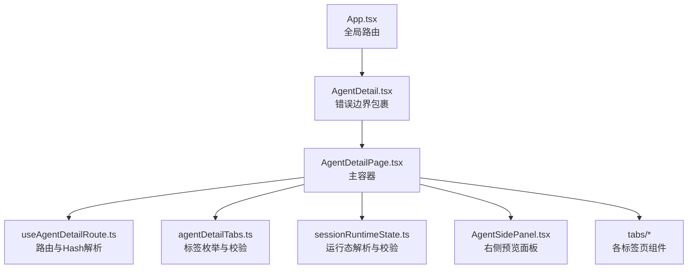
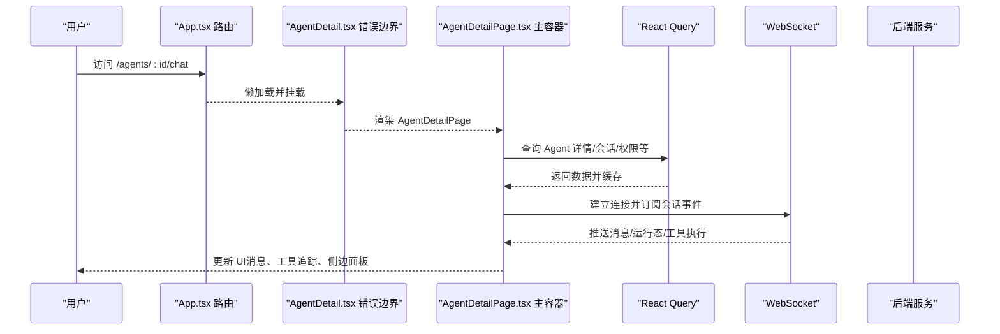
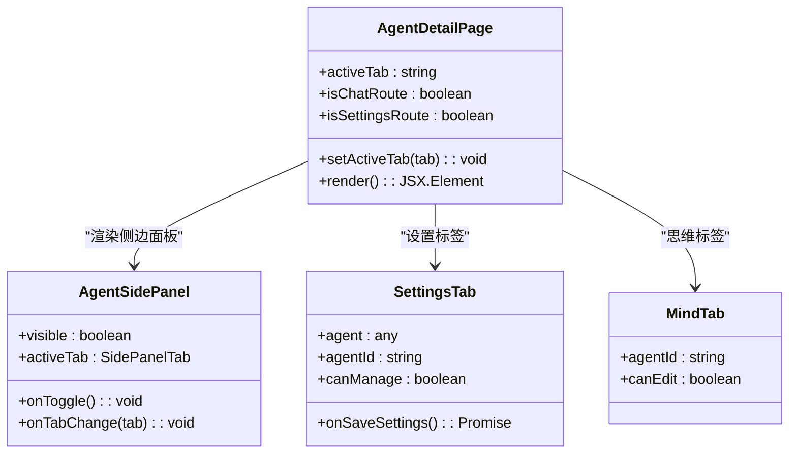
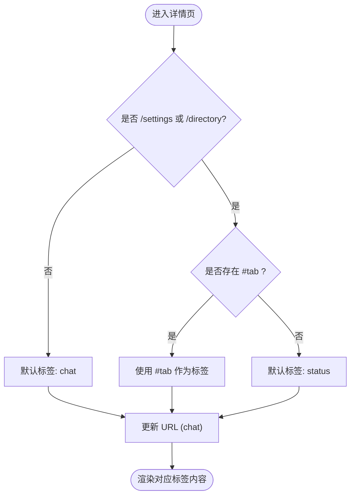
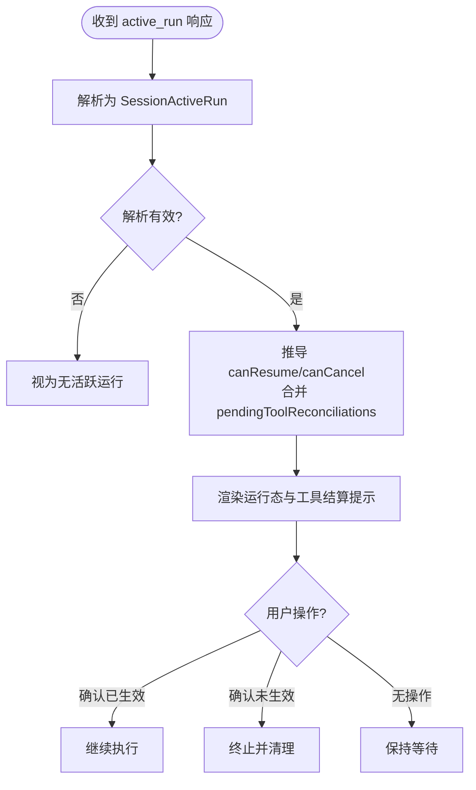
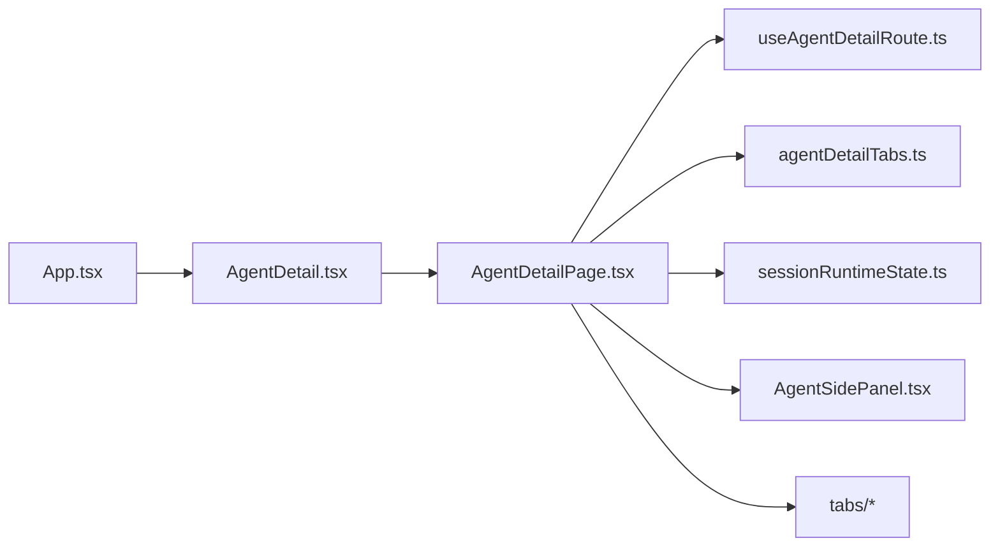

# Agent详情页概览

<cite>
**本文引用的文件**   
- [AgentDetailPage.tsx](file://frontend/src/pages/agent-detail/AgentDetailPage.tsx)
- [AgentDetail.tsx](file://frontend/src/pages/AgentDetail.tsx)
- [App.tsx](file://frontend/src/App.tsx)
- [agentDetailTabs.ts](file://frontend/src/pages/agent-detail/agentDetailTabs.ts)
- [useAgentDetailRoute.ts](file://frontend/src/pages/agent-detail/hooks/useAgentDetailRoute.ts)
- [sessionRuntimeState.ts](file://frontend/src/pages/agent-detail/sessionRuntimeState.ts)
- [SettingsTab.tsx](file://frontend/src/pages/agent-detail/tabs/SettingsTab.tsx)
- [MindTab.tsx](file://frontend/src/pages/agent-detail/tabs/MindTab.tsx)
- [AgentSidePanel.tsx](file://frontend/src/components/AgentSidePanel.tsx)
</cite>

## 目录
1. [简介](#简介)
2. [项目结构](#项目结构)
3. [核心组件](#核心组件)
4. [架构总览](#架构总览)
5. [详细组件分析](#详细组件分析)
6. [依赖关系分析](#依赖关系分析)
7. [性能考量](#性能考量)
8. [故障排查指南](#故障排查指南)
9. [结论](#结论)
10. [附录](#附录)

## 简介
本文件系统性说明 Agent 详情页的整体架构与核心功能，覆盖页面布局、标签页导航机制、状态管理方案、路由配置与参数传递、初始化与数据加载流程、错误处理与用户反馈等。该页面以“聊天为主”的沉浸式体验为核心，辅以侧边面板（工作区、浏览器、桌面、代码、传输）和设置/思维/工具/技能/关系/活动日志/审批等标签页，形成完整的 Agent 管理与交互界面。

## 项目结构
Agent 详情页位于前端 pages/agent-detail 目录下，采用“主容器 + 多标签页 + 侧边面板”的结构：
- 主容器：AgentDetailPage.tsx 负责整体布局、路由解析、标签切换、会话运行态、消息渲染、工具调用追踪、权限与设置等。
- 标签页：tabs 目录下的 SettingsTab、MindTab 等提供具体功能视图；agentDetailTabs.ts 定义标签枚举与校验。
- 路由钩子：hooks/useAgentDetailRoute.ts 统一处理 /agents/:id/chat、/settings、/directory 的路径与 hash 映射。
- 运行时状态：sessionRuntimeState.ts 对后端返回的运行态进行类型化与校验，支撑“等待用户确认”“工具结果结算”等能力。
- 侧边面板：components/AgentSidePanel.tsx 提供可拖拽宽度的预览面板，支持工作区、Aware、浏览器、桌面、代码、传输等 Tab。

图表来源 
- [App.tsx:1-200](file://frontend/src/App.tsx#L1-L200)
- [AgentDetail.tsx:1-60](file://frontend/src/pages/AgentDetail.tsx#L1-L60)
- [AgentDetailPage.tsx:1-1200](file://frontend/src/pages/agent-detail/AgentDetailPage.tsx#L1-L1200)
- [useAgentDetailRoute.ts:1-56](file://frontend/src/pages/agent-detail/hooks/useAgentDetailRoute.ts#L1-L56)
- [agentDetailTabs.ts:1-28](file://frontend/src/pages/agent-detail/agentDetailTabs.ts#L1-L28)
- [sessionRuntimeState.ts:1-196](file://frontend/src/pages/agent-detail/sessionRuntimeState.ts#L1-L196)
- [AgentSidePanel.tsx:1-200](file://frontend/src/components/AgentSidePanel.tsx#L1-L200)

章节来源
- [App.tsx:1-200](file://frontend/src/App.tsx#L1-L200)
- [AgentDetail.tsx:1-60](file://frontend/src/pages/AgentDetail.tsx#L1-L60)
- [AgentDetailPage.tsx:1-1200](file://frontend/src/pages/agent-detail/AgentDetailPage.tsx#L1-L1200)
- [useAgentDetailRoute.ts:1-56](file://frontend/src/pages/agent-detail/hooks/useAgentDetailRoute.ts#L1-L56)
- [agentDetailTabs.ts:1-28](file://frontend/src/pages/agent-detail/agentDetailTabs.ts#L1-L28)
- [sessionRuntimeState.ts:1-196](file://frontend/src/pages/agent-detail/sessionRuntimeState.ts#L1-L196)
- [AgentSidePanel.tsx:1-200](file://frontend/src/components/AgentSidePanel.tsx#L1-L200)

## 核心组件
- 主页面容器（AgentDetailPage.tsx）
  - 职责：聚合路由、标签导航、会话运行态、消息流、工具调用追踪、工作区操作、权限与设置、活动日志、审批等。
  - 关键能力：通过 useQuery/useMutation 拉取数据，WebSocket 实时推送消息与运行态，React Query 缓存与失效刷新，Toast/Dialog 反馈。
- 侧边栏面板（AgentSidePanel.tsx）
  - 职责：展示工作区、Aware 信息、浏览器/桌面/代码/传输等实时预览，支持拖拽宽度与动态 Tab。
- 设置标签（SettingsTab.tsx）
  - 职责：模型选择、上下文窗口、最大步骤限制、Token 配额、欢迎语、访问权限、删除 Agent 等。
- 思维标签（MindTab.tsx）
  - 职责：编辑 soul.md、查看 memory、HEARTBEAT.md 等持久化记忆与心跳指令。
- 路由钩子（useAgentDetailRoute.ts）
  - 职责：根据路径与 hash 决定初始标签，维护 chat/settings/directory 三类路由语义，并同步 URL。
- 运行态解析（sessionRuntimeState.ts）
  - 职责：将后端 active_run 响应规范化为 SessionActiveRun，判断 canResume/canCancel、工具结算项等。

章节来源
- [AgentDetailPage.tsx:1-1200](file://frontend/src/pages/agent-detail/AgentDetailPage.tsx#L1-L1200)
- [AgentSidePanel.tsx:1-200](file://frontend/src/components/AgentSidePanel.tsx#L1-L200)
- [SettingsTab.tsx:1-200](file://frontend/src/pages/agent-detail/tabs/SettingsTab.tsx#L1-L200)
- [MindTab.tsx:1-58](file://frontend/src/pages/agent-detail/tabs/MindTab.tsx#L1-L58)
- [useAgentDetailRoute.ts:1-56](file://frontend/src/pages/agent-detail/hooks/useAgentDetailRoute.ts#L1-L56)
- [sessionRuntimeState.ts:1-196](file://frontend/src/pages/agent-detail/sessionRuntimeState.ts#L1-L196)

## 架构总览
Agent 详情页采用“单页应用 + React Router + React Query + WebSocket”的架构模式：
- 路由层：App.tsx 中懒加载 AgentDetail，进入后由 AgentDetail.tsx 的错误边界包裹 AgentDetailPage。
- 页面层：AgentDetailPage 内部通过 useAgentDetailRoute 解析 /agents/:id/chat、/settings、/directory 及 #tab 哈希。
- 数据层：使用 @tanstack/react-query 发起 REST 请求，WebSocket 推送会话消息与运行态变更。
- 视图层：主区域渲染聊天与工具调用追踪，右侧侧边面板展示工作区与实时环境预览。

图表来源 
- [App.tsx:1-200](file://frontend/src/App.tsx#L1-L200)
- [AgentDetail.tsx:1-60](file://frontend/src/pages/AgentDetail.tsx#L1-L60)
- [AgentDetailPage.tsx:1-1200](file://frontend/src/pages/agent-detail/AgentDetailPage.tsx#L1-L1200)

## 详细组件分析

### 主页面容器（AgentDetailPage.tsx）
- 布局结构
  - 顶部：标题、模型切换、发送输入框、附件上传、停止生成按钮。
  - 中部：聊天消息列表、思考过程折叠卡片、工具调用追踪（AnalysisCard）。
  - 右侧：AgentSidePanel 侧边面板，包含工作区、Aware、浏览器/桌面/代码/传输等 Tab。
- 标签页导航
  - 通过 agentDetailTabs.ts 定义的常量数组控制可用标签；useAgentDetailRoute.ts 根据路径与 hash 计算 activeTab。
- 状态管理
  - 使用 useState/useRef 管理本地 UI 状态（如聊天输入、附件、侧边面板可见性）。
  - 使用 @tanstack/react-query 管理服务端数据（Agent 详情、会话、权限、活动日志等），配合 queryClient.invalidateQueries 触发刷新。
  - 使用 WebSocket 维护会话实时状态（消息、运行态、工具执行、截图等）。
- 工具调用追踪
  - AnalysisCard 将 thinking 与 tool 调用混合渲染，支持展开/收起、运行中指示、结果摘要。
- 工作区与文件操作
  - 集成 FileBrowser 与工作区操作面板，支持读写、移动、删除、转换等操作，并在侧边面板中实时预览。
- 权限与设置
  - 内置 AccessPermissionsPanel 支持公司级/私有/指定用户的访问控制，以及默认访问级别设置。
  - SettingsTab 提供模型、上下文窗口、步数限制、Token 配额、欢迎语、删除 Agent 等功能。
- 错误处理与用户反馈
  - 使用 Toast/Dialog 提示成功/失败；对网络异常、权限不足、工具结算不支持等情况给出明确文案。
  - 针对 Agent 过期、无可用模型、WebSocket 未连接等场景显示提示信息或禁用输入。

图表来源 
- [AgentDetailPage.tsx:1-1200](file://frontend/src/pages/agent-detail/AgentDetailPage.tsx#L1-L1200)
- [AgentSidePanel.tsx:1-200](file://frontend/src/components/AgentSidePanel.tsx#L1-L200)
- [SettingsTab.tsx:1-200](file://frontend/src/pages/agent-detail/tabs/SettingsTab.tsx#L1-L200)
- [MindTab.tsx:1-58](file://frontend/src/pages/agent-detail/tabs/MindTab.tsx#L1-L58)

章节来源
- [AgentDetailPage.tsx:1-1200](file://frontend/src/pages/agent-detail/AgentDetailPage.tsx#L1-L1200)

### 标签页导航机制（useAgentDetailRoute.ts 与 agentDetailTabs.ts）
- 标签枚举与校验
  - AGENT_DETAIL_TABS 定义所有标签键值；isAgentDetailTab/isAgentDetailSettingsTab 用于类型守卫。
- 路由解析策略
  - 非 settings/directory 路径默认进入 chat；settings 路径默认进入 status；directory 路径默认进入 relationships。
  - 支持通过 #tab 哈希指定初始标签，并在切换时同步 URL（replaceState 或 navigate）。
- 特殊路由映射
  - chat 标签直接导航到 /agents/:id/chat；relationships 标签导航到 /agents/:id/directory。

图表来源 
- [useAgentDetailRoute.ts:1-56](file://frontend/src/pages/agent-detail/hooks/useAgentDetailRoute.ts#L1-L56)
- [agentDetailTabs.ts:1-28](file://frontend/src/pages/agent-detail/agentDetailTabs.ts#L1-L28)

章节来源
- [useAgentDetailRoute.ts:1-56](file://frontend/src/pages/agent-detail/hooks/useAgentDetailRoute.ts#L1-L56)
- [agentDetailTabs.ts:1-28](file://frontend/src/pages/agent-detail/agentDetailTabs.ts#L1-L28)

### 会话运行态与工具结算（sessionRuntimeState.ts）
- 数据结构
  - SessionActiveRun 描述当前运行的 runId/threadId/sessionId/status/waitingType/correlationId/modelStepCount/canResume/canCancel/pendingToolReconciliations。
  - ToolReconciliation 描述单个工具调用的 executionId/toolCallId/toolName/resultSummary/errorCode/canReconcile。
- 解析与校验
  - sessionActiveRunFromResponse 将后端 active_run 字段解析为强类型对象，缺失关键字段则返回 null。
  - sessionRuntimeStateResponseIsValid 确保 payload.active_run 存在且解析成功。
- 状态推导
  - runtimeCompletionNeedsMessageRefresh 判断是否需要刷新最后一条助手消息。
  - failClosedSessionActiveRun 关闭会话时将 canResume/canCancel 置为 false。
  - waitingSessionActiveRunHint 构造“等待用户”占位运行态。
- 前端交互
  - 当 pendingToolReconciliations 存在且 canReconcile=true 时，允许用户在聊天输入区确认“已生效/未生效”，以继续或终止后续流程。

图表来源 
- [sessionRuntimeState.ts:1-196](file://frontend/src/pages/agent-detail/sessionRuntimeState.ts#L1-L196)

章节来源
- [sessionRuntimeState.ts:1-196](file://frontend/src/pages/agent-detail/sessionRuntimeState.ts#L1-L196)

### 侧边面板（AgentSidePanel.tsx）
- 功能
  - 支持 workspace/aware/browser/desktop/code/transfer 多个 Tab，按 liveState 动态显示。
  - 可拖拽调整宽度，最小宽度与最大比例受控。
  - 在 browser/desktop 模式下支持“接管控制”（TakeControlPanel）。
- 数据流
  - 接收 liveState（浏览器/桌面/代码/传输截图与输出）、workspaceActivities/workspaceLiveDraft 等，驱动面板内容更新。
  - 通过 onLiveUpdate 回调通知父组件刷新最终截图。

章节来源
- [AgentSidePanel.tsx:1-200](file://frontend/src/components/AgentSidePanel.tsx#L1-L200)

### 设置标签（SettingsTab.tsx）
- 功能
  - 模型选择（主模型/回退模型）、上下文窗口大小、最大模型步数、每日/每月 Token 限额、欢迎语、访问权限、删除 Agent。
  - 对 openclaw 类型 Agent 有特殊设置入口。
- 交互
  - 表单变化检测 hasChanges，保存时带 loading 与错误提示；权限修改会触发相关查询失效。

章节来源
- [SettingsTab.tsx:1-200](file://frontend/src/pages/agent-detail/tabs/SettingsTab.tsx#L1-L200)

### 思维标签（MindTab.tsx）
- 功能
  - 编辑 soul.md（角色/人格/行为边界）、只读查看 memory 目录、编辑 HEARTBEAT.md（周期性自检指令）。
- 数据源
  - 通过 fileApi.list/read/write/delete/downloadUrl 与后端文件服务交互。

章节来源
- [MindTab.tsx:1-58](file://frontend/src/pages/agent-detail/tabs/MindTab.tsx#L1-L58)

## 依赖关系分析
- 路由与页面
  - App.tsx 懒加载 AgentDetail -> AgentDetail.tsx 错误边界 -> AgentDetailPage.tsx 主容器。
- 页面内依赖
  - AgentDetailPage.tsx 依赖 useAgentDetailRoute.ts（路由解析）、agentDetailTabs.ts（标签枚举）、sessionRuntimeState.ts（运行态解析）、AgentSidePanel.tsx（侧边面板）、各 tabs 组件。
- 外部依赖
  - @tanstack/react-query（数据获取与缓存）、WebSocket（实时通信）、i18n（国际化）、@tabler/icons-react（图标）。

图表来源 
- [App.tsx:1-200](file://frontend/src/App.tsx#L1-L200)
- [AgentDetail.tsx:1-60](file://frontend/src/pages/AgentDetail.tsx#L1-L60)
- [AgentDetailPage.tsx:1-1200](file://frontend/src/pages/agent-detail/AgentDetailPage.tsx#L1-L1200)
- [useAgentDetailRoute.ts:1-56](file://frontend/src/pages/agent-detail/hooks/useAgentDetailRoute.ts#L1-L56)
- [agentDetailTabs.ts:1-28](file://frontend/src/pages/agent-detail/agentDetailTabs.ts#L1-L28)
- [sessionRuntimeState.ts:1-196](file://frontend/src/pages/agent-detail/sessionRuntimeState.ts#L1-L196)
- [AgentSidePanel.tsx:1-200](file://frontend/src/components/AgentSidePanel.tsx#L1-L200)

章节来源
- [App.tsx:1-200](file://frontend/src/App.tsx#L1-L200)
- [AgentDetail.tsx:1-60](file://frontend/src/pages/AgentDetail.tsx#L1-L60)
- [AgentDetailPage.tsx:1-1200](file://frontend/src/pages/agent-detail/AgentDetailPage.tsx#L1-L1200)

## 性能考量
- 数据缓存与失效
  - 使用 React Query 的 staleTime/retry 等参数减少重复请求；在权限/设置变更后主动 invalidateQueries 保证一致性。
- 实时通信优化
  - WebSocket 仅推送必要字段；对长文本/大截图做截断或延迟加载；避免频繁重绘。
- 渲染优化
  - 对工具调用追踪使用折叠卡片，仅在需要时展开；聊天消息列表按需渲染与滚动到底优化。
- 侧边面板尺寸
  - 拖拽宽度限制最小值与最大比例，避免极端尺寸影响布局与性能。

[本节为通用指导，不直接分析具体文件]

## 故障排查指南
- 页面崩溃保护
  - AgentDetail.tsx 使用 ErrorBoundary 捕获渲染异常并提供“重新加载”入口。
- 常见错误场景
  - 无可用模型：输入框禁用并提示“配置公司模型后可开始聊天”。
  - WebSocket 未连接：显示“Connecting...”状态，必要时重试连接。
  - 工具结算不支持：提示联系管理员，前端不可安全结算。
  - 权限不足：设置/权限修改被禁用，并显示只读提示。
- 调试建议
  - 检查 React Query 缓存键与失效时机；观察 WebSocket 连接状态与消息序列；关注 sessionRuntimeState 解析结果是否为 null。

章节来源
- [AgentDetail.tsx:1-60](file://frontend/src/pages/AgentDetail.tsx#L1-L60)
- [AgentDetailPage.tsx:1-1200](file://frontend/src/pages/agent-detail/AgentDetailPage.tsx#L1-L1200)
- [sessionRuntimeState.ts:1-196](file://frontend/src/pages/agent-detail/sessionRuntimeState.ts#L1-L196)

## 结论
Agent 详情页以聊天为中心，结合侧边面板与多标签页，提供了从对话、工具执行、工作区操作到权限与设置的完整闭环。通过 React Router + React Query + WebSocket 的组合，实现了高效的数据获取与实时交互；通过严格的运行态解析与工具结算机制，保障了复杂任务的可控性与可追溯性。建议在扩展新功能时遵循现有标签与侧边面板的约定，保持路由与状态的一致性，并完善错误处理与用户反馈。

[本节为总结性内容，不直接分析具体文件]

## 附录
- 最佳实践
  - 初始化流程：优先加载 Agent 详情与权限，再建立 WebSocket 连接；对敏感操作（删除/权限变更）增加二次确认。
  - 数据加载：使用 React Query 的 queryKey 区分不同维度数据，变更时精准失效；对大列表分页加载。
  - 错误处理：统一错误提示样式与文案；对网络异常与业务异常分别处理，避免混淆。
  - 用户体验：在长时间操作中提供进度与取消能力；对不可逆操作给予明确风险提示。

[本节为通用指导，不直接分析具体文件]