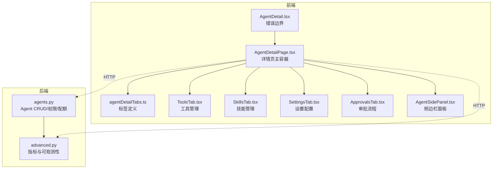
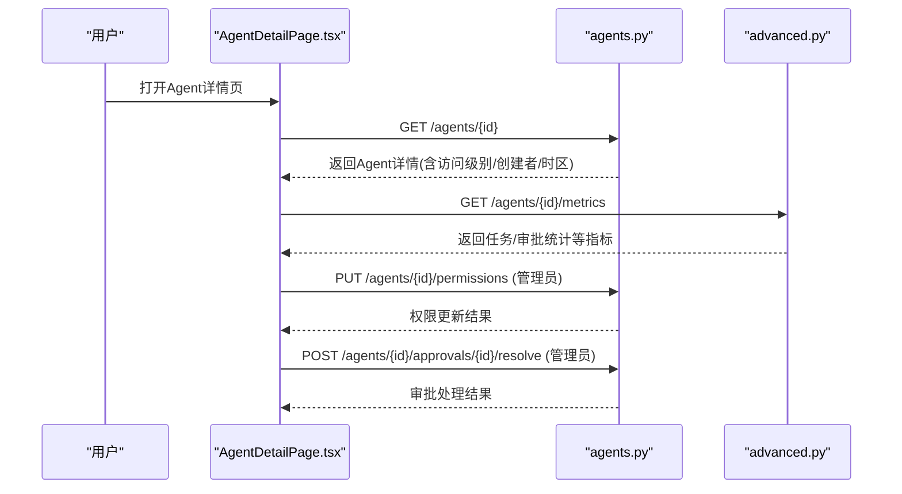
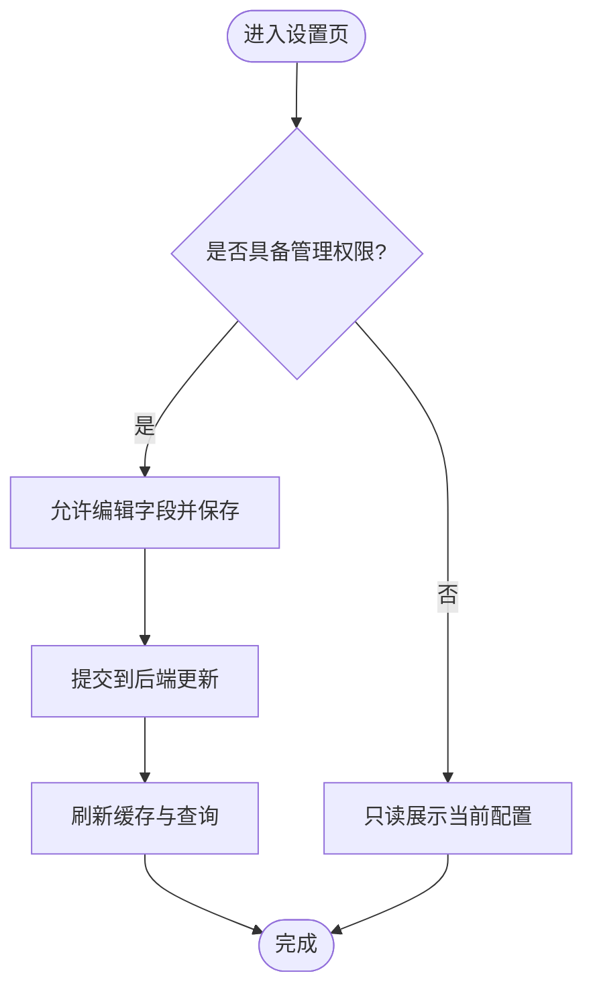
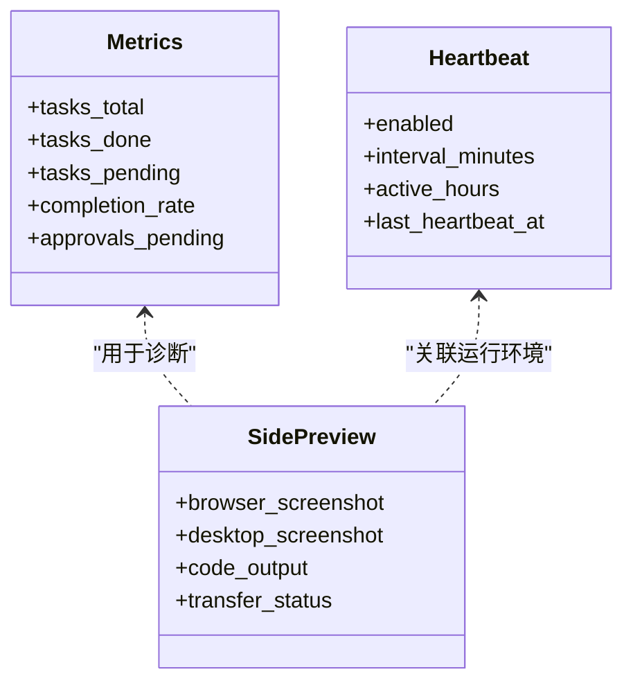
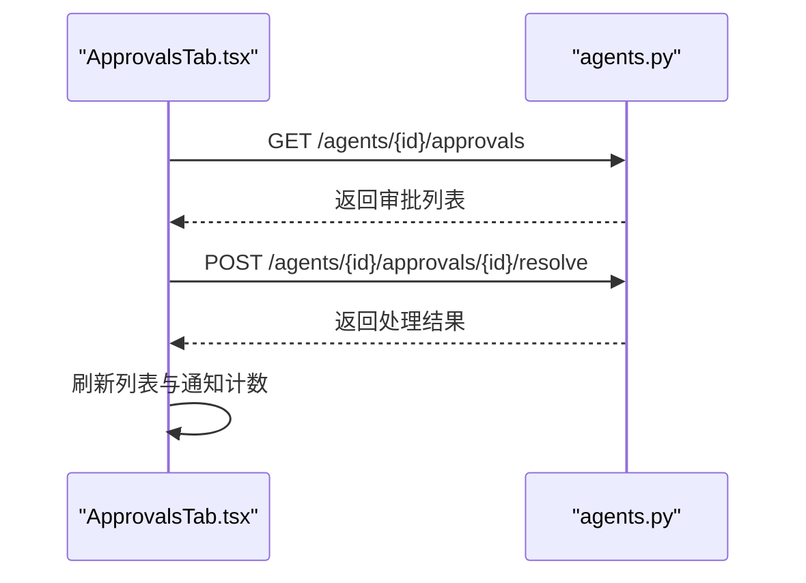
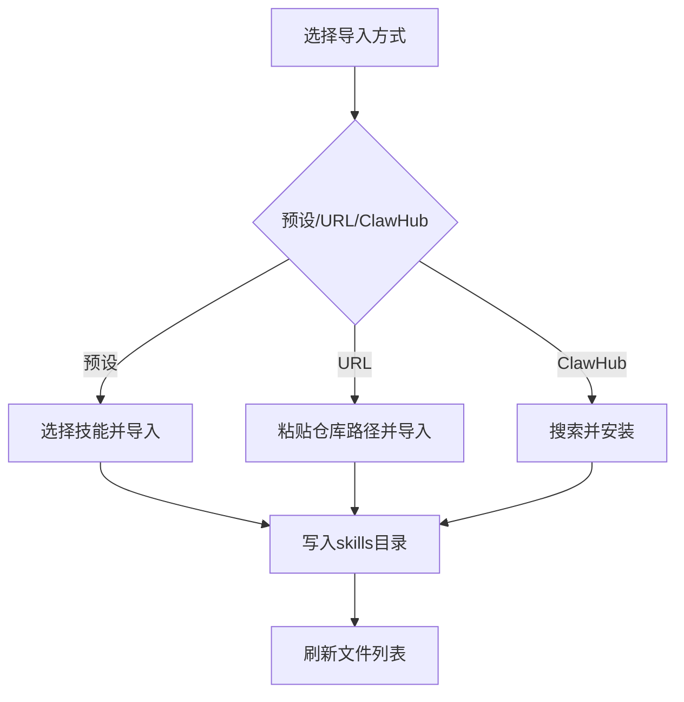
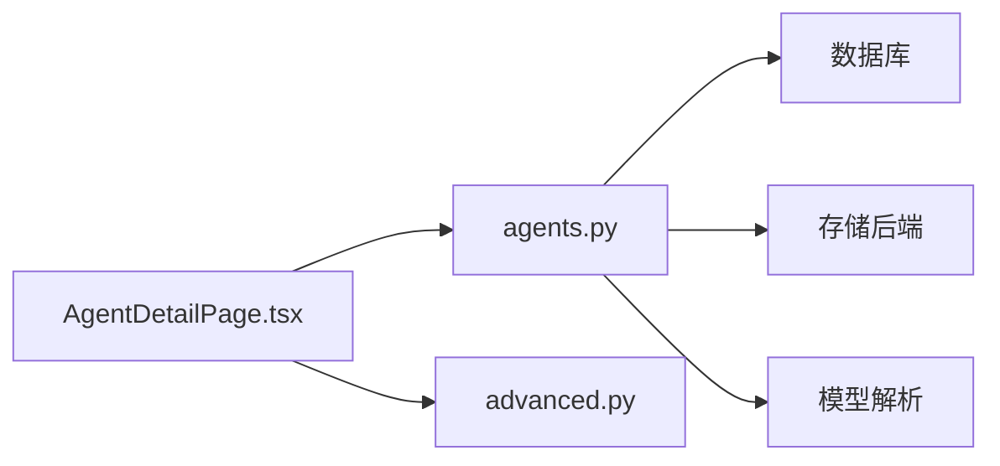

# Agent详情页管理

<cite>
**本文引用的文件**   
- [AgentDetail.tsx](file://frontend/src/pages/AgentDetail.tsx)
- [AgentDetailPage.tsx](file://frontend/src/pages/agent-detail/AgentDetailPage.tsx)
- [agentDetailTabs.ts](file://frontend/src/pages/agent-detail/agentDetailTabs.ts)
- [ToolsTab.tsx](file://frontend/src/pages/agent-detail/tabs/ToolsTab.tsx)
- [SkillsTab.tsx](file://frontend/src/pages/agent-detail/tabs/SkillsTab.tsx)
- [SettingsTab.tsx](file://frontend/src/pages/agent-detail/tabs/SettingsTab.tsx)
- [ApprovalsTab.tsx](file://frontend/src/pages/agent-detail/tabs/ApprovalsTab.tsx)
- [AgentSidePanel.tsx](file://frontend/src/components/AgentSidePanel.tsx)
- [agents.py](file://backend/app/api/agents.py)
- [advanced.py](file://backend/app/api/advanced.py)
</cite>

## 目录
1. [简介](#简介)
2. [项目结构](#项目结构)
3. [核心组件](#核心组件)
4. [架构总览](#架构总览)
5. [详细组件分析](#详细组件分析)
6. [依赖关系分析](#依赖关系分析)
7. [性能考量](#性能考量)
8. [故障排查指南](#故障排查指南)
9. [结论](#结论)
10. [附录](#附录)

## 简介
本文件面向“Agent详情页”的日常管理与维护，覆盖以下能力：
- 基本信息查看与编辑（名称、角色描述、头像、模型配置、上下文窗口、步数限制、令牌配额等）
- 运行状态监控（任务统计、审批待办、心跳与活跃时间、最近运行指标）
- 日志与活动记录（会话消息、触发器执行、工作区变更、代码输出预览）
- 性能指标分析（任务完成率、审批积压、资源使用趋势）
- 标签页功能说明：工具管理、设置配置、审批流程、技能管理等
- 侧边栏面板交互与快捷操作（工作区、浏览器/桌面实时预览、代码输出、传输状态）
- 日常管理与维护最佳实践（权限控制、配额与限流、心跳策略、模板与技能导入规范）

## 项目结构
Agent详情页由前端页面与后端API共同实现。前端以React组件组织，按“页面-标签页-侧边栏”分层；后端提供REST接口用于数据读写、权限校验与指标聚合。

**图表来源** 
- [AgentDetail.tsx:1-60](file://frontend/src/pages/AgentDetail.tsx#L1-L60)
- [AgentDetailPage.tsx:1-120](file://frontend/src/pages/agent-detail/AgentDetailPage.tsx#L1-L120)
- [agentDetailTabs.ts:1-28](file://frontend/src/pages/agent-detail/agentDetailTabs.ts#L1-L28)
- [agents.py:1-120](file://backend/app/api/agents.py#L1-L120)
- [advanced.py:204-243](file://backend/app/api/advanced.py#L204-L243)

**章节来源**
- [AgentDetail.tsx:1-60](file://frontend/src/pages/AgentDetail.tsx#L1-L60)
- [AgentDetailPage.tsx:1-120](file://frontend/src/pages/agent-detail/AgentDetailPage.tsx#L1-L120)
- [agentDetailTabs.ts:1-28](file://frontend/src/pages/agent-detail/agentDetailTabs.ts#L1-L28)

## 核心组件
- 错误边界与入口
  - AgentDetail.tsx：包裹详情页的错误边界，捕获渲染异常并提供重试刷新。
- 详情页主容器
  - AgentDetailPage.tsx：承载所有标签页、侧边栏、运行时状态、权限判断、数据获取与缓存更新。
- 标签定义
  - agentDetailTabs.ts：集中声明详情页标签集合与类型守卫。
- 标签页组件
  - ToolsTab.tsx：工具管理入口，委托给通用工具管理器。
  - SkillsTab.tsx：技能管理，支持从预设、URL、ClawHub安装与本地文件浏览。
  - SettingsTab.tsx：设置配置，包含模型选择、上下文窗口、步数限制、令牌配额、触发器限制、自动性策略、时区、心跳、渠道配置与危险操作（删除）。
  - ApprovalsTab.tsx：审批列表与处理（批准/拒绝），定时轮询刷新。
- 侧边栏面板
  - AgentSidePanel.tsx：工作区、感知信息、浏览器/桌面实时截图、代码输出、传输状态，支持拖拽调整宽度与快捷控制。

**章节来源**
- [AgentDetail.tsx:1-60](file://frontend/src/pages/AgentDetail.tsx#L1-L60)
- [AgentDetailPage.tsx:1-120](file://frontend/src/pages/agent-detail/AgentDetailPage.tsx#L1-L120)
- [agentDetailTabs.ts:1-28](file://frontend/src/pages/agent-detail/agentDetailTabs.ts#L1-L28)
- [ToolsTab.tsx:1-24](file://frontend/src/pages/agent-detail/tabs/ToolsTab.tsx#L1-L24)
- [SkillsTab.tsx:1-120](file://frontend/src/pages/agent-detail/tabs/SkillsTab.tsx#L1-L120)
- [SettingsTab.tsx:1-120](file://frontend/src/pages/agent-detail/tabs/SettingsTab.tsx#L1-L120)
- [ApprovalsTab.tsx:1-60](file://frontend/src/pages/agent-detail/tabs/ApprovalsTab.tsx#L1-L60)
- [AgentSidePanel.tsx:1-120](file://frontend/src/components/AgentSidePanel.tsx#L1-L120)

## 架构总览
详情页通过REST API与后端交互，前端负责UI与状态管理，后端负责权限校验、数据持久化与指标聚合。

**图表来源** 
- [AgentDetailPage.tsx:1-120](file://frontend/src/pages/agent-detail/AgentDetailPage.tsx#L1-L120)
- [agents.py:593-633](file://backend/app/api/agents.py#L593-L633)
- [agents.py:636-731](file://backend/app/api/agents.py#L636-L731)
- [advanced.py:213-243](file://backend/app/api/advanced.py#L213-L243)

## 详细组件分析

### 基本信息查看与编辑
- 查看
  - 详情页加载后调用后端接口获取Agent详情，包括名称、角色描述、头像、创建者、有效时区、访问级别等。
- 编辑
  - 在“设置配置”标签页中可修改模型（主/备）、上下文窗口大小、每运行最大模型步数、每日/每月令牌上限、触发器数量与频率限制、自动性策略、时区、心跳开关与间隔、活跃时段、渠道配置等。
  - OpenClaw类型Agent会切换到专用设置视图。
- 权限控制
  - 仅具备管理权限的用户可保存更改；普通用户仅可查看或受限操作。

**图表来源** 
- [SettingsTab.tsx:120-220](file://frontend/src/pages/agent-detail/tabs/SettingsTab.tsx#L120-L220)
- [agents.py:593-633](file://backend/app/api/agents.py#L593-L633)

**章节来源**
- [SettingsTab.tsx:1-220](file://frontend/src/pages/agent-detail/tabs/SettingsTab.tsx#L1-220)
- [agents.py:593-633](file://backend/app/api/agents.py#L593-L633)

### 运行状态监控
- 指标概览
  - 任务总数、已完成、待完成及完成率；审批待处理数量；其他可观测指标。
- 心跳与活跃
  - 心跳开关、检查间隔、活跃时段、最近一次心跳时间。
- 实时预览
  - 侧边栏的浏览器/桌面截图、代码输出、传输状态，辅助定位问题。

**图表来源** 
- [advanced.py:213-243](file://backend/app/api/advanced.py#L213-L243)
- [AgentSidePanel.tsx:200-304](file://frontend/src/components/AgentSidePanel.tsx#L200-L304)

**章节来源**
- [advanced.py:213-243](file://backend/app/api/advanced.py#L213-L243)
- [AgentSidePanel.tsx:200-304](file://frontend/src/components/AgentSidePanel.tsx#L200-L304)

### 日志查看
- 活动与审计
  - 通过后端提供的活动/审计相关接口（如会话消息、触发器执行、工作区变更）在前端呈现。
- 代码输出与传输
  - 侧边栏“代码”标签显示Agent执行的代码输出；“传输”标签显示文件/数据迁移状态。
- 建议
  - 结合工作区版本历史与侧边栏实时预览快速定位问题。

**章节来源**
- [AgentSidePanel.tsx:200-304](file://frontend/src/components/AgentSidePanel.tsx#L200-L304)

### 性能指标分析
- 指标来源
  - 后端聚合任务与审批统计，供前端展示。
- 使用方式
  - 在详情页顶部或卡片区域展示关键KPI，便于管理者评估Agent健康度与负载。

**章节来源**
- [advanced.py:213-243](file://backend/app/api/advanced.py#L213-L243)

### 标签页：工具管理
- 功能
  - 统一入口，展示Agent可用工具列表与管理操作（启用/禁用、参数配置等）。
- 交互
  - 根据权限决定是否可编辑；变更后即时刷新。

**章节来源**
- [ToolsTab.tsx:1-24](file://frontend/src/pages/agent-detail/tabs/ToolsTab.tsx#L1-L24)

### 标签页：设置配置
- 功能
  - 模型选择（主/备）、上下文窗口、步数限制、令牌配额、触发器限制、自动性策略、时区、心跳、渠道配置、删除Agent。
- 交互
  - 支持即时保存与错误提示；OpenClaw类型切换至专用设置视图。

**章节来源**
- [SettingsTab.tsx:1-423](file://frontend/src/pages/agent-detail/tabs/SettingsTab.tsx#L1-L423)

### 标签页：审批流程
- 功能
  - 展示待审批与历史记录，支持批准/拒绝操作。
- 交互
  - 定时轮询刷新；仅管理员可处理。

**图表来源** 
- [ApprovalsTab.tsx:1-144](file://frontend/src/pages/agent-detail/tabs/ApprovalsTab.tsx#L1-L144)

**章节来源**
- [ApprovalsTab.tsx:1-144](file://frontend/src/pages/agent-detail/tabs/ApprovalsTab.tsx#L1-L144)

### 标签页：技能管理
- 功能
  - 本地技能文件浏览（增删改查、上传下载）、从预设导入、从GitHub URL导入、从ClawHub搜索并安装。
- 交互
  - 管理员可执行导入与安装；失败时弹窗提示；成功后刷新文件列表。

**图表来源** 
- [SkillsTab.tsx:120-320](file://frontend/src/pages/agent-detail/tabs/SkillsTab.tsx#L120-L320)

**章节来源**
- [SkillsTab.tsx:120-320](file://frontend/src/pages/agent-detail/tabs/SkillsTab.tsx#L120-L320)

### 侧边栏面板交互与快捷操作
- 标签
  - 工作区、感知信息、浏览器、桌面、代码、传输。
- 交互
  - 拖拽调整宽度；点击“控制”接管浏览器/桌面；代码输出自动滚动；工作区版本历史一键展开。
- 快捷
  - 在工作区头部动作区插入常用操作按钮；支持锁定/解锁工作区。

**章节来源**
- [AgentSidePanel.tsx:1-200](file://frontend/src/components/AgentSidePanel.tsx#L1-L200)
- [AgentSidePanel.tsx:200-304](file://frontend/src/components/AgentSidePanel.tsx#L200-L304)

## 依赖关系分析
- 前端依赖
  - React Query进行数据请求与缓存；i18n国际化；Toast与Dialog用于反馈。
- 后端依赖
  - FastAPI路由、SQLAlchemy异步会话、权限校验、配额与限流、存储后端、LLM模型解析。
- 耦合点
  - 详情页与API强耦合于Agent实体与权限模型；指标模块独立但被详情页消费。

**图表来源** 
- [AgentDetailPage.tsx:1-120](file://frontend/src/pages/agent-detail/AgentDetailPage.tsx#L1-L120)
- [agents.py:1-120](file://backend/app/api/agents.py#L1-L120)
- [advanced.py:213-243](file://backend/app/api/advanced.py#L213-L243)

**章节来源**
- [AgentDetailPage.tsx:1-120](file://frontend/src/pages/agent-detail/AgentDetailPage.tsx#L1-L120)
- [agents.py:1-120](file://backend/app/api/agents.py#L1-L120)

## 性能考量
- 前端
  - 使用React Query缓存减少重复请求；按需拉取指标与审批列表；避免大对象频繁重渲染。
- 后端
  - 懒重置令牌计数器；批量查询与selectinload避免N+1；后台任务处理耗时初始化（技能复制、MCP安装、容器启动）。
- 建议
  - 合理设置心跳间隔与活跃时段；限制最大模型步数与令牌配额；对高频操作增加节流与防抖。

[本节为通用指导，不直接分析具体文件]

## 故障排查指南
- 页面崩溃
  - 错误边界捕获异常并提供“重新加载”按钮；检查控制台错误日志。
- 权限问题
  - 确认访问级别与角色；管理员才能修改权限与删除Agent。
- 指标不更新
  - 检查网络请求与缓存失效；确认后端指标接口正常。
- 审批无响应
  - 确认轮询间隔与Token有效性；检查后端处理逻辑。
- 技能导入失败
  - 检查URL可达性与SKILL.md存在；查看错误弹窗详情并重试。

**章节来源**
- [AgentDetail.tsx:25-51](file://frontend/src/pages/AgentDetail.tsx#L25-L51)
- [ApprovalsTab.tsx:1-60](file://frontend/src/pages/agent-detail/tabs/ApprovalsTab.tsx#L1-L60)
- [SkillsTab.tsx:200-320](file://frontend/src/pages/agent-detail/tabs/SkillsTab.tsx#L200-L320)

## 结论
Agent详情页提供了完整的生命周期管理能力：从基础信息编辑、运行监控、日志与指标分析，到工具与技能管理、审批流程与权限控制。配合侧边栏的实时预览与快捷操作，可显著提升日常运维效率。建议遵循配额与限流策略、规范技能导入流程、合理配置心跳与活跃时段，确保系统稳定与可控。

[本节为总结，不直接分析具体文件]

## 附录
- 标签页清单
  - 状态、感知、思维、工具、技能、关系、工作区、聊天、活动日志、审批、设置。
- 常用操作路径
  - 设置配置：SettingsTab.tsx
  - 技能管理：SkillsTab.tsx
  - 工具管理：ToolsTab.tsx
  - 审批流程：ApprovalsTab.tsx
  - 侧边栏：AgentSidePanel.tsx
  - 详情页主容器：AgentDetailPage.tsx
  - 错误边界：AgentDetail.tsx
  - 后端接口：agents.py、advanced.py

**章节来源**
- [agentDetailTabs.ts:1-28](file://frontend/src/pages/agent-detail/agentDetailTabs.ts#L1-L28)
- [SettingsTab.tsx:1-423](file://frontend/src/pages/agent-detail/tabs/SettingsTab.tsx#L1-L423)
- [SkillsTab.tsx:1-320](file://frontend/src/pages/agent-detail/tabs/SkillsTab.tsx#L1-L320)
- [ToolsTab.tsx:1-24](file://frontend/src/pages/agent-detail/tabs/ToolsTab.tsx#L1-L24)
- [ApprovalsTab.tsx:1-144](file://frontend/src/pages/agent-detail/tabs/ApprovalsTab.tsx#L1-L144)
- [AgentSidePanel.tsx:1-304](file://frontend/src/components/AgentSidePanel.tsx#L1-L304)
- [AgentDetailPage.tsx:1-120](file://frontend/src/pages/agent-detail/AgentDetailPage.tsx#L1-L120)
- [AgentDetail.tsx:1-60](file://frontend/src/pages/AgentDetail.tsx#L1-L60)
- [agents.py:1-120](file://backend/app/api/agents.py#L1-L120)
- [advanced.py:213-243](file://backend/app/api/advanced.py#L213-L243)