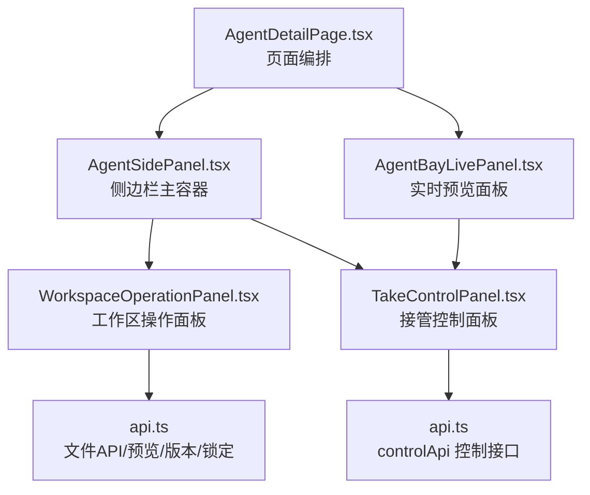
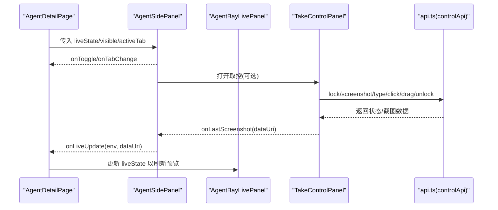
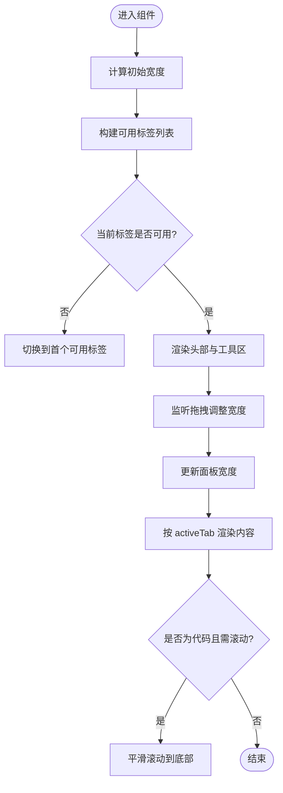
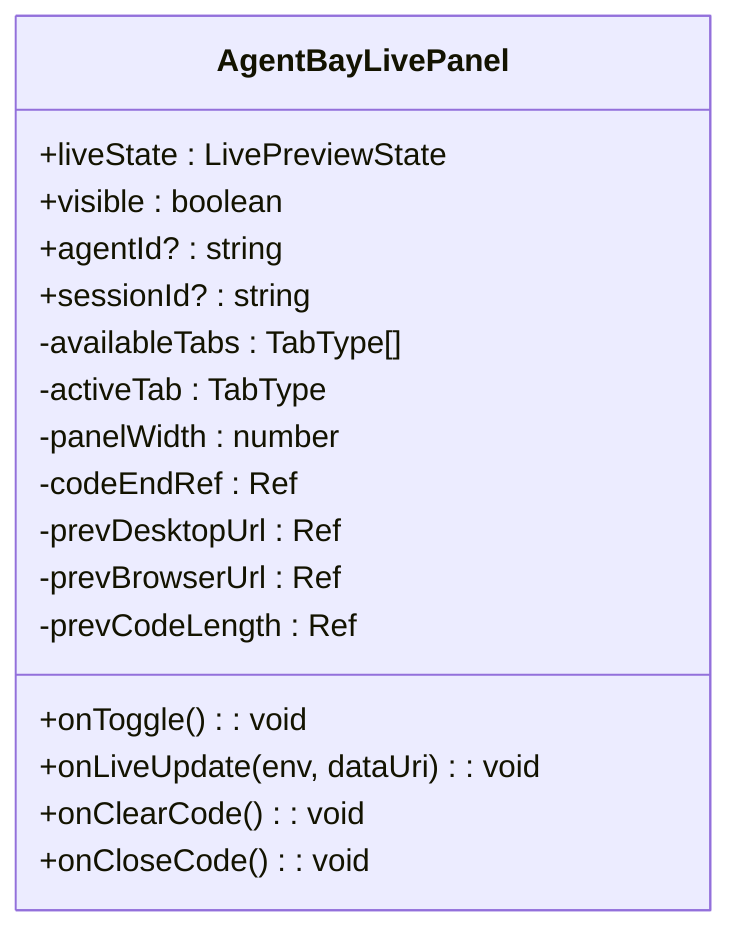
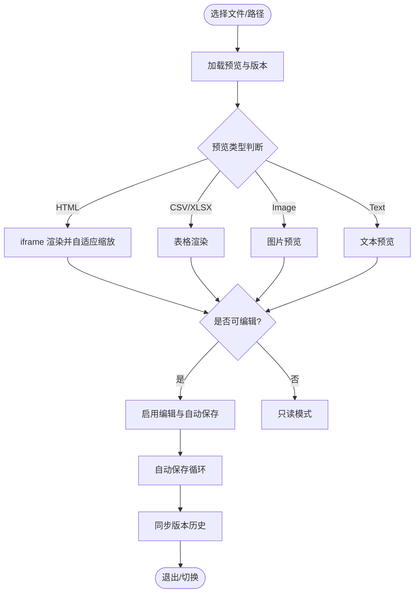
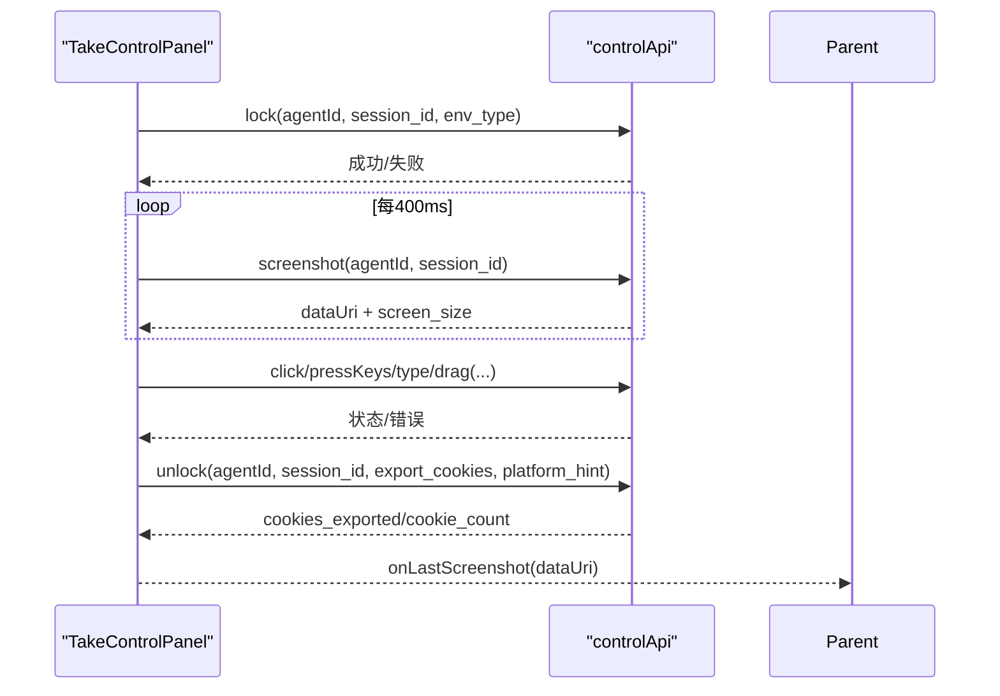
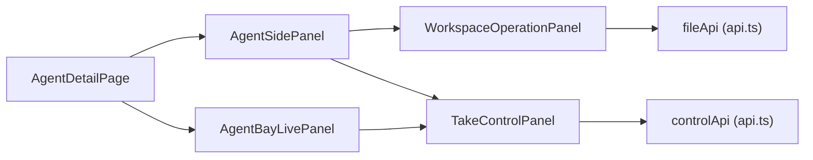

# 侧边栏操作面板

<cite>
**本文引用的文件**   
- [AgentSidePanel.tsx](file://frontend/src/components/AgentSidePanel.tsx)
- [AgentBayLivePanel.tsx](file://frontend/src/components/AgentBayLivePanel.tsx)
- [WorkspaceOperationPanel.tsx](file://frontend/src/components/WorkspaceOperationPanel.tsx)
- [TakeControlPanel.tsx](file://frontend/src/components/TakeControlPanel.tsx)
- [api.ts](file://frontend/src/services/api.ts)
- [index.css](file://frontend/src/index.css)
- [AgentDetailPage.tsx](file://frontend/src/pages/agent-detail/AgentDetailPage.tsx)
</cite>

## 目录
1. [简介](#简介)
2. [项目结构](#项目结构)
3. [核心组件](#核心组件)
4. [架构总览](#架构总览)
5. [详细组件分析](#详细组件分析)
6. [依赖关系分析](#依赖关系分析)
7. [性能与体验优化](#性能与体验优化)
8. [故障排查指南](#故障排查指南)
9. [结论](#结论)
10. [附录：扩展与定制接口](#附录扩展与定制接口)

## 简介
本文件系统性说明“侧边栏操作面板”的快捷操作能力与实现细节，包括：
- 快速启动/停止 Agent（通过外部控制入口与状态联动）
- 实时日志查看（代码输出流式更新、自动滚动）
- 性能指标监控（截图刷新频率、拖拽缩放、面板宽度自适应）
- 面板展开/收起动画与状态同步机制
- 不同操作类型的图标与交互设计
- 面板定制与扩展的开发接口
- 响应式设计与移动端适配要点

## 项目结构
侧边栏操作面板由多个前端组件协作完成，核心文件如下：
- AgentSidePanel.tsx：侧边栏主容器，负责标签页切换、拖拽缩放、工作区与工作流预览集成
- AgentBayLivePanel.tsx：通用实时预览面板（桌面/浏览器/代码），包含自动切签、截图轮询、取控弹窗集成
- WorkspaceOperationPanel.tsx：工作区操作面板（文件树、预览、编辑、版本历史、上传等）
- TakeControlPanel.tsx：全屏“接管控制”面板，轮询截图、鼠标/键盘事件转发、登录态导出
- api.ts：统一 API 封装，含 controlApi（点击、输入、按键、拖拽、截图、加锁/解锁、当前URL）
- index.css：侧边栏样式、拖拽手柄、标签、折叠按钮、实时徽章等
- AgentDetailPage.tsx：页面级编排，将 liveState、可见性、Tab 状态与子组件绑定

**图表来源** 
- [AgentDetailPage.tsx:7269-7283](file://frontend/src/pages/agent-detail/AgentDetailPage.tsx#L7269-L7283)
- [AgentSidePanel.tsx:162-288](file://frontend/src/components/AgentSidePanel.tsx#L162-L288)
- [AgentBayLivePanel.tsx:243-383](file://frontend/src/components/AgentBayLivePanel.tsx#L243-L383)
- [WorkspaceOperationPanel.tsx:390-460](file://frontend/src/components/WorkspaceOperationPanel.tsx#L390-L460)
- [TakeControlPanel.tsx:62-126](file://frontend/src/components/TakeControlPanel.tsx#L62-L126)
- [api.ts:542-568](file://frontend/src/services/api.ts#L542-L568)

**章节来源**
- [AgentSidePanel.tsx:1-120](file://frontend/src/components/AgentSidePanel.tsx#L1-L120)
- [AgentBayLivePanel.tsx:1-120](file://frontend/src/components/AgentBayLivePanel.tsx#L1-L120)
- [WorkspaceOperationPanel.tsx:1-120](file://frontend/src/components/WorkspaceOperationPanel.tsx#L1-L120)
- [TakeControlPanel.tsx:1-120](file://frontend/src/components/TakeControlPanel.tsx#L1-L120)
- [api.ts:540-651](file://frontend/src/services/api.ts#L540-L651)
- [index.css:5158-5332](file://frontend/src/index.css#L5158-L5332)
- [AgentDetailPage.tsx:7269-7283](file://frontend/src/pages/agent-detail/AgentDetailPage.tsx#L7269-L7283)

## 核心组件
- AgentSidePanel：聚合多类 Tab（工作区、感知、浏览器、桌面、代码、传输），根据 liveState 动态显示可用标签；提供拖拽调整宽度、关闭/切换、工作区活动历史开关、代码面板关闭等。
- AgentBayLivePanel：通用实时预览面板，支持桌面/浏览器/代码三类内容，具备自动切到最新活动的 Tab、代码输出截断与自动滚动、取控弹窗集成。
- WorkspaceOperationPanel：文件树浏览、在线预览（HTML/CSV/XLSX/图片）、编辑与自动保存、版本历史与恢复、上传进度、路径锁定/解锁、删除等待确认等。
- TakeControlPanel：全屏覆盖层，轮询截图、坐标映射、鼠标点击/拖拽、文本输入、快捷键、导出 Cookie 并释放锁。

**章节来源**
- [AgentSidePanel.tsx:53-127](file://frontend/src/components/AgentSidePanel.tsx#L53-L127)
- [AgentBayLivePanel.tsx:103-175](file://frontend/src/components/AgentBayLivePanel.tsx#L103-L175)
- [WorkspaceOperationPanel.tsx:390-460](file://frontend/src/components/WorkspaceOperationPanel.tsx#L390-L460)
- [TakeControlPanel.tsx:62-126](file://frontend/src/components/TakeControlPanel.tsx#L62-L126)

## 架构总览
侧边栏操作面板采用“父组件编排 + 子组件职责单一”的模式。页面级组件维护 liveState、可见性与 activeTab，并将其透传给侧边栏与实时预览面板。实时数据（截图、代码输出、传输状态）通过 props 或回调向上/向下传递，确保状态一致。

**图表来源** 
- [AgentDetailPage.tsx:7269-7283](file://frontend/src/pages/agent-detail/AgentDetailPage.tsx#L7269-L7283)
- [AgentSidePanel.tsx:189-203](file://frontend/src/components/AgentSidePanel.tsx#L189-L203)
- [TakeControlPanel.tsx:89-126](file://frontend/src/components/TakeControlPanel.tsx#L89-L126)
- [api.ts:542-568](file://frontend/src/services/api.ts#L542-L568)

## 详细组件分析

### AgentSidePanel（侧边栏主容器）
- 功能要点
  - 动态标签：根据 awareContent 与 liveState 决定 workspace/aware/browser/desktop/code/transfer 是否可用
  - 拖拽缩放：左侧边缘拖拽调整宽度，最小值与最大比例限制，窗口 resize 时自动回算
  - 状态同步：当 activeTab 不在可用列表时自动切换到首个可用标签；代码 Tab 自动滚动到底部
  - 快捷操作：代码面板关闭按钮、工作区版本历史开关、取控按钮（browser/desktop）
  - 实时徽章：有数据的标签显示小圆点提示
- 交互设计
  - 标签图标：文件夹/信息/浏览器/电脑/代码/文件链接
  - 头部右侧工具区：关闭、版本历史、自定义动作挂载点
  - 可访问性：role/tablist/tab、aria-selected、title 提示

**图表来源** 
- [AgentSidePanel.tsx:46-51](file://frontend/src/components/AgentSidePanel.tsx#L46-L51)
- [AgentSidePanel.tsx:106-127](file://frontend/src/components/AgentSidePanel.tsx#L106-L127)
- [AgentSidePanel.tsx:129-158](file://frontend/src/components/AgentSidePanel.tsx#L129-L158)
- [AgentSidePanel.tsx:162-222](file://frontend/src/components/AgentSidePanel.tsx#L162-L222)

**章节来源**
- [AgentSidePanel.tsx:75-127](file://frontend/src/components/AgentSidePanel.tsx#L75-L127)
- [AgentSidePanel.tsx:162-222](file://frontend/src/components/AgentSidePanel.tsx#L162-L222)
- [AgentSidePanel.tsx:224-288](file://frontend/src/components/AgentSidePanel.tsx#L224-L288)

### AgentBayLivePanel（实时预览面板）
- 功能要点
  - 自动切签：检测到新的 desktop/browser/code 数据时自动切换到对应标签
  - 代码输出：长度上限截断，避免内存膨胀；自动滚动到底部
  - 取控集成：在 browser/desktop 标签下显示“Control”按钮，打开 TakeControlPanel
  - 折叠态：面板隐藏时显示展开按钮，带“Live”指示点
- 交互设计
  - 标签图标：桌面/浏览器/代码（线性风格 SVG）
  - 头部工具：清空代码、关闭代码面板、折叠按钮
  - 空态提示：等待活动数据

**图表来源** 
- [AgentBayLivePanel.tsx:6-19](file://frontend/src/components/AgentBayLivePanel.tsx#L6-L19)
- [AgentBayLivePanel.tsx:103-175](file://frontend/src/components/AgentBayLivePanel.tsx#L103-L175)
- [AgentBayLivePanel.tsx:243-383](file://frontend/src/components/AgentBayLivePanel.tsx#L243-L383)

**章节来源**
- [AgentBayLivePanel.tsx:103-175](file://frontend/src/components/AgentBayLivePanel.tsx#L103-L175)
- [AgentBayLivePanel.tsx:243-383](file://frontend/src/components/AgentBayLivePanel.tsx#L243-L383)

### WorkspaceOperationPanel（工作区操作面板）
- 功能要点
  - 文件树：支持 workspace/all 两种范围，按需加载目录，层级展开
  - 预览：HTML/CSV/XLSX/图片/文本等多类型预览，HTML 使用 iframe 自适应缩放
  - 编辑与自动保存：编辑态自动保存，保存状态反馈（saving/saved/error），保留最少可见时间
  - 版本历史：差异对比、快照恢复
  - 上传：带进度条，处理阶段标记
  - 锁定/解锁：编辑时定时续租，退出编辑释放锁
  - 删除等待：对 pendingApproval 的删除进行轮询确认
- 交互设计
  - 侧边宽度：树与历史区域宽度可调，受最小/最大值约束
  - 头部动作：通过 headerActionsTargetId 注入外部动作（如文件操作）
  - 滚动跟随：预览区自动跟随最新内容，用户上滚则暂停跟随

**图表来源** 
- [WorkspaceOperationPanel.tsx:472-493](file://frontend/src/components/WorkspaceOperationPanel.tsx#L472-L493)
- [WorkspaceOperationPanel.tsx:496-514](file://frontend/src/components/WorkspaceOperationPanel.tsx#L496-L514)
- [WorkspaceOperationPanel.tsx:681-716](file://frontend/src/components/WorkspaceOperationPanel.tsx#L681-L716)
- [WorkspaceOperationPanel.tsx:790-794](file://frontend/src/components/WorkspaceOperationPanel.tsx#L790-L794)

**章节来源**
- [WorkspaceOperationPanel.tsx:390-460](file://frontend/src/components/WorkspaceOperationPanel.tsx#L390-L460)
- [WorkspaceOperationPanel.tsx:472-514](file://frontend/src/components/WorkspaceOperationPanel.tsx#L472-L514)
- [WorkspaceOperationPanel.tsx:681-716](file://frontend/src/components/WorkspaceOperationPanel.tsx#L681-L716)
- [WorkspaceOperationPanel.tsx:790-794](file://frontend/src/components/WorkspaceOperationPanel.tsx#L790-L794)

### TakeControlPanel（接管控制面板）
- 功能要点
  - 加锁/解锁：进入即尝试获取会话锁，退出释放；失败状态提示
  - 截图轮询：顺序 setTimeout 轮询，避免请求堆积；支持屏幕尺寸映射
  - 输入与按键：文本输入、常用快捷键（Tab/Enter/Esc/Ctrl+A/Ctrl+C/Ctrl+V/Backspace）
  - 鼠标交互：点击与拖拽（模拟自然轨迹），坐标映射到真实分辨率
  - 登录态导出：完成后导出 Cookie，并回传最后一张截图给父组件
- 交互设计
  - 全屏遮罩：毛玻璃背景，居中面板
  - 状态提示：顶部状态栏闪烁反馈
  - 工具栏：文本输入框、发送按钮、快捷键按钮组
  - 动作栏：域名输入（用于平台提示）、取消/保存登录态

**图表来源** 
- [TakeControlPanel.tsx:89-126](file://frontend/src/components/TakeControlPanel.tsx#L89-L126)
- [TakeControlPanel.tsx:132-171](file://frontend/src/components/TakeControlPanel.tsx#L132-L171)
- [TakeControlPanel.tsx:276-300](file://frontend/src/components/TakeControlPanel.tsx#L276-L300)
- [TakeControlPanel.tsx:303-345](file://frontend/src/components/TakeControlPanel.tsx#L303-L345)
- [api.ts:542-568](file://frontend/src/services/api.ts#L542-L568)

**章节来源**
- [TakeControlPanel.tsx:62-126](file://frontend/src/components/TakeControlPanel.tsx#L62-L126)
- [TakeControlPanel.tsx:132-171](file://frontend/src/components/TakeControlPanel.tsx#L132-L171)
- [TakeControlPanel.tsx:276-300](file://frontend/src/components/TakeControlPanel.tsx#L276-L300)
- [TakeControlPanel.tsx:303-345](file://frontend/src/components/TakeControlPanel.tsx#L303-L345)

## 依赖关系分析
- 组件耦合
  - AgentDetailPage 作为编排者，持有 liveState、visible、activeTab，并通过 props 下发至 AgentSidePanel 与 AgentBayLivePanel
  - AgentSidePanel 与 AgentBayLivePanel 均可能触发 TakeControlPanel，共享 controlApi 调用
  - WorkspaceOperationPanel 依赖 fileApi（预览、版本、锁定、下载 URL）
- 外部依赖
  - controlApi：/agents/{agentId}/control/* 系列接口
  - fileApi：/agents/{agentId}/files/* 系列接口（预览、版本、锁定、下载）
- 潜在循环依赖
  - 无直接循环；父子通信通过 props/callbacks，避免双向绑定

**图表来源** 
- [AgentDetailPage.tsx:7269-7283](file://frontend/src/pages/agent-detail/AgentDetailPage.tsx#L7269-L7283)
- [api.ts:542-568](file://frontend/src/services/api.ts#L542-L568)

**章节来源**
- [AgentDetailPage.tsx:7269-7283](file://frontend/src/pages/agent-detail/AgentDetailPage.tsx#L7269-L7283)
- [api.ts:542-568](file://frontend/src/services/api.ts#L542-L568)

## 性能与体验优化
- 截图轮询策略
  - 使用顺序 setTimeout 而非 setInterval，避免请求堆积与抖动
  - 每次轮询结束后再调度下一次，降低带宽占用
- 代码输出管理
  - 长度上限截断，防止内存膨胀与渲染卡顿
  - 自动滚动到底部，提升可读性
- 面板宽度自适应
  - 窗口 resize 时自动回算宽度，用户手动拖拽后不再自动覆盖
  - 最小宽度与最大视口比例限制，保证可用性
- HTML 预览自适应
  - 使用 ResizeObserver/MutationObserver 监听尺寸变化，动态设置 zoom
- 自动保存与锁
  - 编辑态自动保存，最小可见时间保障用户体验
  - 定时续租锁，退出编辑释放锁，避免死锁

[本节为通用指导，不直接分析具体文件]

## 故障排查指南
- 无法获取控制锁
  - 检查 controlApi.lock 返回状态，确认 sessionId/env_type 正确
  - 若失败，查看状态提示并重试
- 截图不更新
  - 确认轮询是否正常执行（控制台日志/网络面板）
  - 检查后端返回 dataUri 格式（data:image/*;base64,...）
- 代码输出不滚动
  - 检查 codeEndRef 是否存在，activeTab 是否为 code
  - 确认 output 变更触发 useEffect
- 工作区编辑无法保存
  - 检查 fileApi.autosave 返回状态与网络错误
  - 确认锁定/解锁流程正常，未出现重复锁定
- 面板宽度异常
  - 检查 isDragging/userResized 标志位是否正确重置
  - 确认 resize 事件监听已清理

**章节来源**
- [TakeControlPanel.tsx:89-126](file://frontend/src/components/TakeControlPanel.tsx#L89-L126)
- [TakeControlPanel.tsx:132-171](file://frontend/src/components/TakeControlPanel.tsx#L132-L171)
- [AgentSidePanel.tsx:129-158](file://frontend/src/components/AgentSidePanel.tsx#L129-L158)
- [WorkspaceOperationPanel.tsx:681-716](file://frontend/src/components/WorkspaceOperationPanel.tsx#L681-L716)

## 结论
侧边栏操作面板通过清晰的组件分层与统一的 API 封装，实现了高效的 Agent 控制、实时预览与工作区管理能力。其交互设计兼顾易用性与可访问性，性能优化措施保障了流畅体验。开发者可通过提供的扩展点与接口，灵活定制与扩展面板功能。

[本节为总结，不直接分析具体文件]

## 附录：扩展与定制接口
- 新增标签页
  - 在 AgentSidePanel 中扩展 availableTabs 与 tabIcons/labels
  - 在 AgentBayLivePanel 中扩展 TabType 与渲染逻辑
- 自定义头部动作
  - 通过 headerActionsTargetId 将外部动作挂载到工作区头部
- 扩展控制能力
  - 在 controlApi 中添加新接口（如 drag、type、pressKeys、screenshot、lock/unlock、current-url）
- 样式定制
  - 修改 index.css 中的 .live-panel、.agent-side-panel-tabs、.live-panel-header 等类名
- 响应式与移动端适配
  - 利用 CSS 媒体查询与 dvh/vw 单位，确保面板在小屏设备上的可用性
  - 拖拽缩放在小屏设备上建议禁用或改为手势滑动

**章节来源**
- [AgentSidePanel.tsx:75-127](file://frontend/src/components/AgentSidePanel.tsx#L75-L127)
- [AgentBayLivePanel.tsx:82-121](file://frontend/src/components/AgentBayLivePanel.tsx#L82-L121)
- [api.ts:542-568](file://frontend/src/services/api.ts#L542-L568)
- [index.css:5158-5332](file://frontend/src/index.css#L5158-L5332)