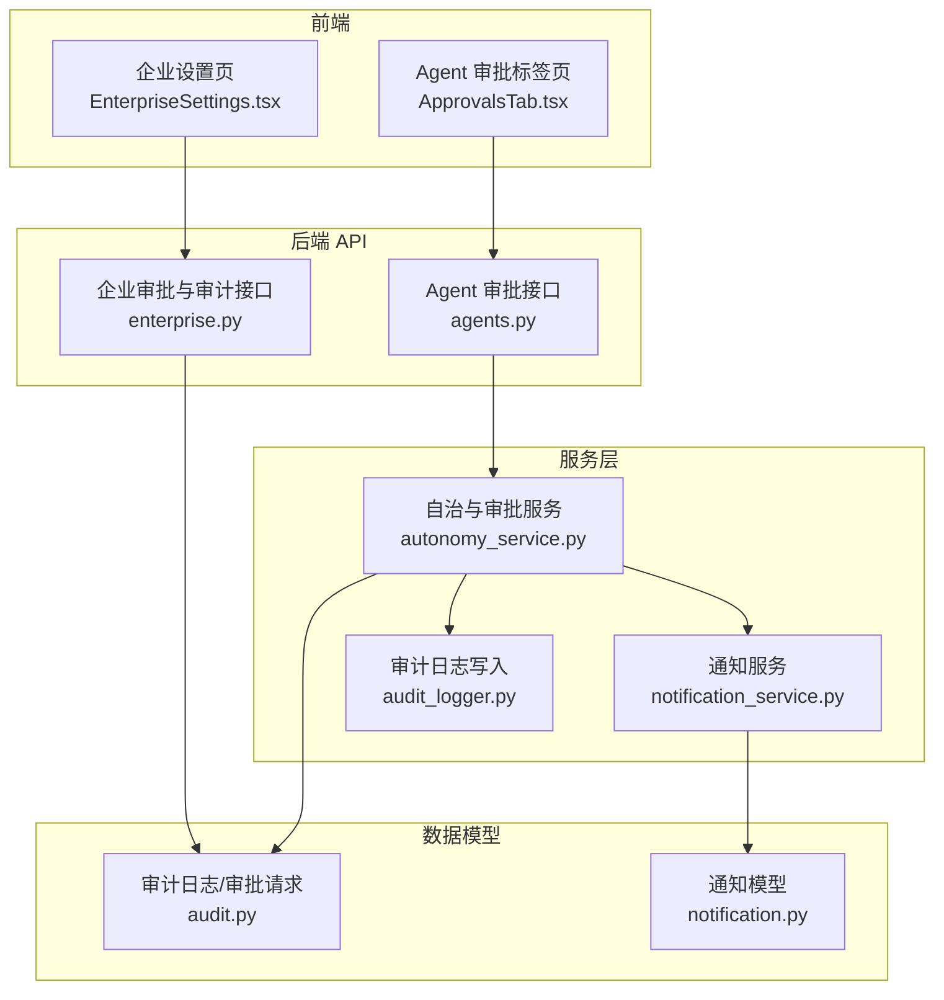
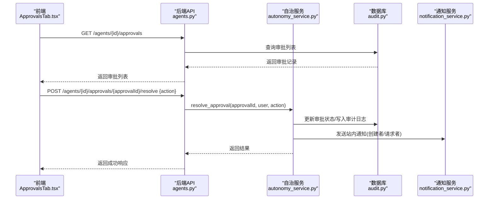
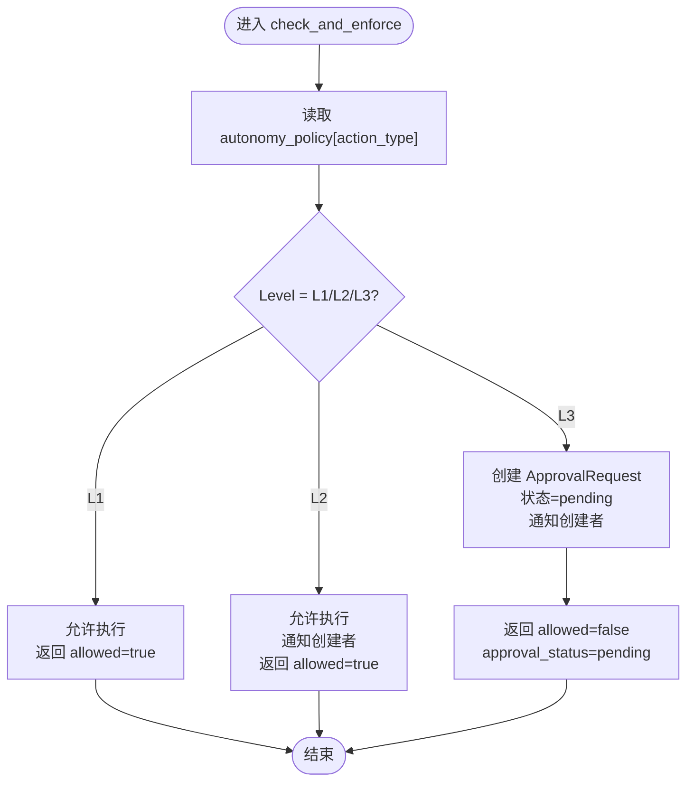
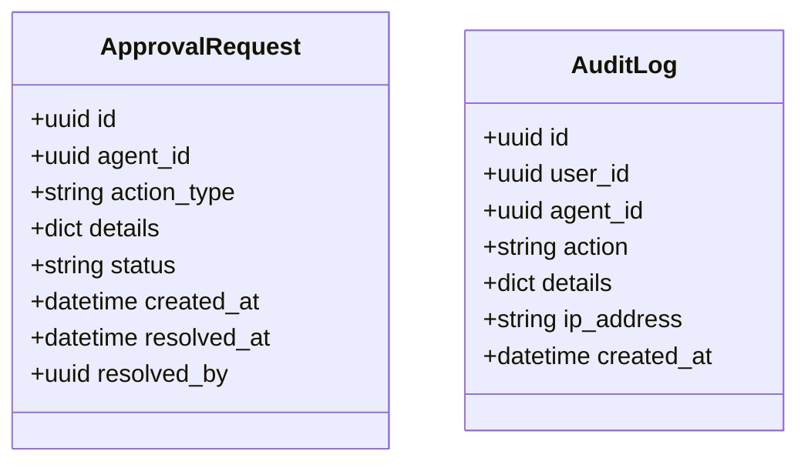
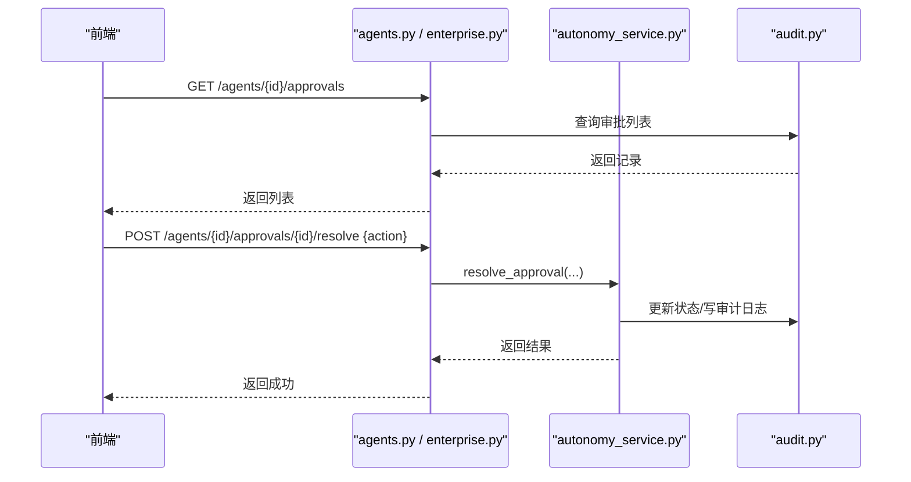
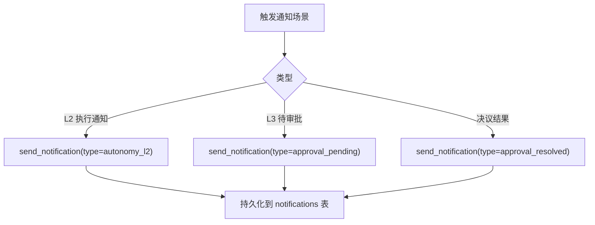
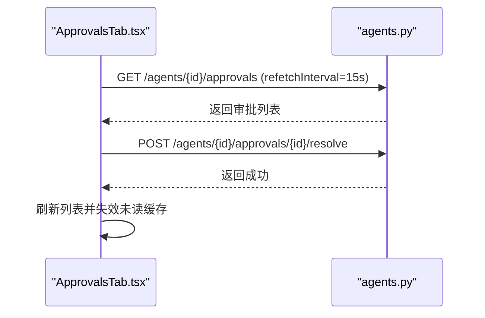
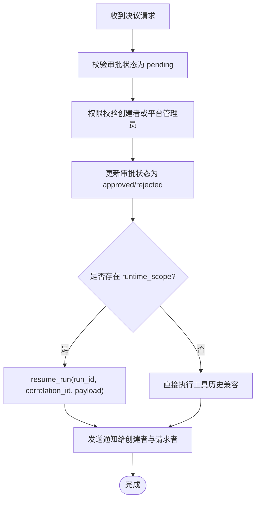
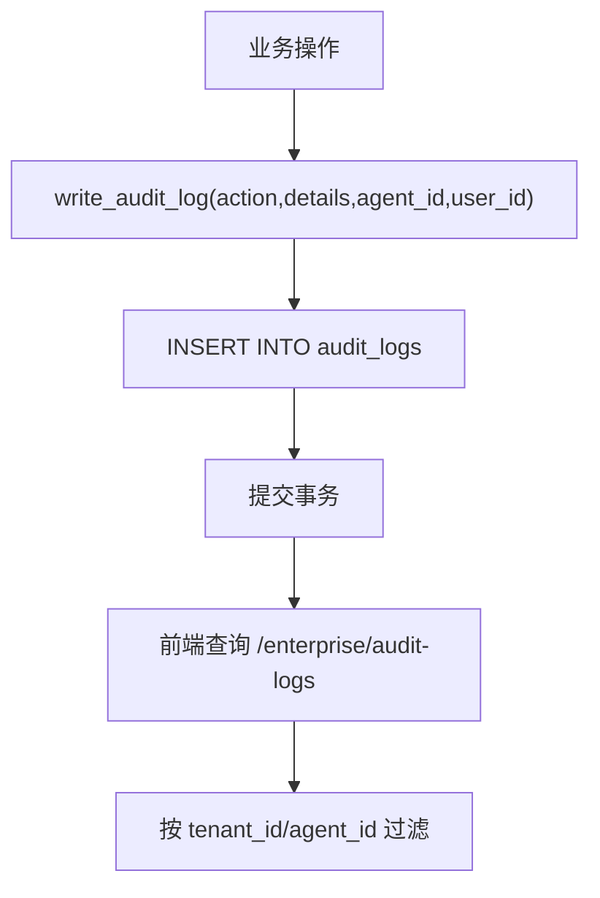
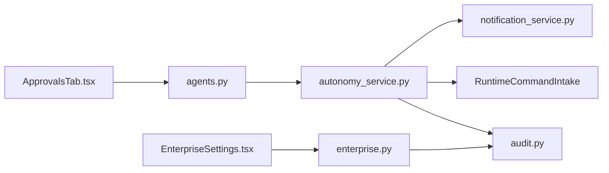

# 审批流程标签页

<cite>
**本文引用的文件**   
- [backend/app/models/audit.py](file://backend/app/models/audit.py)
- [backend/app/services/autonomy_service.py](file://backend/app/services/autonomy_service.py)
- [backend/app/api/agents.py](file://backend/app/api/agents.py)
- [backend/app/api/enterprise.py](file://backend/app/api/enterprise.py)
- [backend/app/services/notification_service.py](file://backend/app/services/notification_service.py)
- [backend/app/models/notification.py](file://backend/app/models/notification.py)
- [backend/app/services/audit_logger.py](file://backend/app/services/audit_logger.py)
- [frontend/src/pages/agent-detail/tabs/ApprovalsTab.tsx](file://frontend/src/pages/agent-detail/tabs/ApprovalsTab.tsx)
- [frontend/src/pages/EnterpriseSettings.tsx](file://frontend/src/pages/EnterpriseSettings.tsx)
- [backend/app/services/builtin_tool_definitions.py](file://backend/app/services/builtin_tool_definitions.py)
</cite>

## 目录
1. [简介](#简介)
2. [项目结构](#项目结构)
3. [核心组件](#核心组件)
4. [架构总览](#架构总览)
5. [详细组件分析](#详细组件分析)
6. [依赖关系分析](#依赖关系分析)
7. [性能考虑](#性能考虑)
8. [故障排查指南](#故障排查指南)
9. [结论](#结论)
10. [附录](#附录)

## 简介
本章节面向“审批流程标签页”的工作流管理功能，覆盖以下要点：
- 审批规则配置与权限控制策略（L1/L2/L3 自治级别）
- 流程节点定义与状态流转（pending → approved/rejected）
- 条件判断机制与运行时恢复（Durable Runtime 的 resume_run）
- 审批通知与提醒（站内通知、飞书卡片）
- 审批历史查询与审计日志查看
- 自定义审批流程与扩展点开发指南

## 项目结构
围绕审批流程的关键代码分布在后端模型、服务、API 以及前端页面中：
- 数据模型：审计日志与审批请求
- 服务层：自治边界检查、审批决议、通知发送、审计记录
- API 层：按 Agent 维度与企业维度的审批列表与决议接口
- 前端：Agent 详情页的审批标签页与企业设置中的审批与审计日志视图

**图表来源** 
- [backend/app/api/agents.py:1157-1222](file://backend/app/api/agents.py#L1157-L1222)
- [backend/app/api/enterprise.py:608-634](file://backend/app/api/enterprise.py#L608-L634)
- [backend/app/services/autonomy_service.py:25-162](file://backend/app/services/autonomy_service.py#L25-L162)
- [backend/app/services/notification_service.py:12-55](file://backend/app/services/notification_service.py#L12-L55)
- [backend/app/models/audit.py:13-43](file://backend/app/models/audit.py#L13-L43)
- [backend/app/models/notification.py:13-31](file://backend/app/models/notification.py#L13-L31)
- [frontend/src/pages/agent-detail/tabs/ApprovalsTab.tsx:1-144](file://frontend/src/pages/agent-detail/tabs/ApprovalsTab.tsx#L1-L144)
- [frontend/src/pages/EnterpriseSettings.tsx:427-454](file://frontend/src/pages/EnterpriseSettings.tsx#L427-L454)

**章节来源**
- [backend/app/models/audit.py:13-43](file://backend/app/models/audit.py#L13-L43)
- [backend/app/services/autonomy_service.py:25-162](file://backend/app/services/autonomy_service.py#L25-L162)
- [backend/app/api/agents.py:1157-1222](file://backend/app/api/agents.py#L1157-L1222)
- [backend/app/api/enterprise.py:608-634](file://backend/app/api/enterprise.py#L608-L634)
- [backend/app/services/notification_service.py:12-55](file://backend/app/services/notification_service.py#L12-L55)
- [backend/app/models/notification.py:13-31](file://backend/app/models/notification.py#L13-L31)
- [frontend/src/pages/agent-detail/tabs/ApprovalsTab.tsx:1-144](file://frontend/src/pages/agent-detail/tabs/ApprovalsTab.tsx#L1-L144)
- [frontend/src/pages/EnterpriseSettings.tsx:427-454](file://frontend/src/pages/EnterpriseSettings.tsx#L427-L454)

## 核心组件
- 自治边界与审批服务（AutonomyService）
  - 依据 Agent 的 autonomy_policy 对动作进行 L1/L2/L3 分级控制
  - L1 自动执行；L2 自动执行并通知创建者；L3 生成审批请求并阻塞执行
  - 支持运行时关联的审批（resume_run 恢复运行）
- 审批请求与审计日志模型（ApprovalRequest/AuditLog）
  - 审批请求包含 action_type、details、status、时间戳与处理人
  - 审计日志记录操作轨迹，支持按租户/Agent 过滤
- 通知服务（NotificationService）
  - 统一入口创建站内通知，支持类型、标题、正文、跳转链接与关联 ID
- 前端审批标签页与企业设置
  - Agent 详情页展示待审批与历史记录，支持批准/拒绝
  - 企业设置页展示全局审批与审计日志

**章节来源**
- [backend/app/services/autonomy_service.py:25-162](file://backend/app/services/autonomy_service.py#L25-L162)
- [backend/app/models/audit.py:13-43](file://backend/app/models/audit.py#L13-L43)
- [backend/app/services/notification_service.py:12-55](file://backend/app/services/notification_service.py#L12-L55)
- [frontend/src/pages/agent-detail/tabs/ApprovalsTab.tsx:1-144](file://frontend/src/pages/agent-detail/tabs/ApprovalsTab.tsx#L1-L144)
- [frontend/src/pages/EnterpriseSettings.tsx:427-454](file://frontend/src/pages/EnterpriseSettings.tsx#L427-L454)

## 架构总览
下图展示了从前端到后端的审批流程关键交互：

**图表来源** 
- [backend/app/api/agents.py:1157-1222](file://backend/app/api/agents.py#L1157-L1222)
- [backend/app/services/autonomy_service.py:164-273](file://backend/app/services/autonomy_service.py#L164-L273)
- [backend/app/models/audit.py:13-43](file://backend/app/models/audit.py#L13-L43)
- [backend/app/services/notification_service.py:12-55](file://backend/app/services/notification_service.py#L12-L55)
- [frontend/src/pages/agent-detail/tabs/ApprovalsTab.tsx:17-31](file://frontend/src/pages/agent-detail/tabs/ApprovalsTab.tsx#L17-L31)

## 详细组件分析

### 自治边界与审批服务（AutonomyService）
- 规则配置与权限控制
  - 读取 Agent.autonomy_policy[action_type] 决定 L1/L2/L3
  - L1：直接允许执行
  - L2：允许执行并通知创建者
  - L3：创建 ApprovalRequest，阻塞执行，等待人工决议
- 运行时关联与恢复
  - 若 details.runtime_scope 包含 run_id/tool_call_id，则生成确定性 approval_id
  - 决议后通过 RuntimeCommandIntake.resume_run 恢复对应运行实例
- 通知与审计
  - L2/L3 均调用 send_notification 推送站内通知
  - 所有分支写入审计日志（autonomy_check:*、approval_*）

**图表来源** 
- [backend/app/services/autonomy_service.py:50-162](file://backend/app/services/autonomy_service.py#L50-L162)

**章节来源**
- [backend/app/services/autonomy_service.py:50-162](file://backend/app/services/autonomy_service.py#L50-L162)
- [backend/app/services/autonomy_service.py:164-273](file://backend/app/services/autonomy_service.py#L164-L273)
- [backend/app/services/autonomy_service.py:275-303](file://backend/app/services/autonomy_service.py#L275-L303)
- [backend/app/services/autonomy_service.py:305-381](file://backend/app/services/autonomy_service.py#L305-L381)

### 审批请求与审计日志模型
- ApprovalRequest
  - 字段：id、agent_id、action_type、details、status(pending/approved/rejected)、created_at、resolved_at、resolved_by
- AuditLog
  - 字段：id、user_id、agent_id、action、details、ip_address、created_at
- 用途
  - 审批请求用于 L3 门禁与人工决议
  - 审计日志用于全链路可追溯，支持按租户/Agent 过滤

**图表来源** 
- [backend/app/models/audit.py:13-43](file://backend/app/models/audit.py#L13-L43)

**章节来源**
- [backend/app/models/audit.py:13-43](file://backend/app/models/audit.py#L13-L43)

### 审批 API（Agent 与企业维度）
- Agent 维度
  - GET /agents/{agent_id}/approvals：列出某 Agent 的审批（仅创建者或管理员可见）
  - POST /agents/{agent_id}/approvals/{approval_id}/resolve：批准/拒绝
- 企业维度
  - GET /enterprise/approvals：按租户范围列出审批（非管理员仅限自己创建的 Agent）
  - GET /enterprise/audit-logs：审计日志列表（支持 tenant_id、agent_id、limit）

**图表来源** 
- [backend/app/api/agents.py:1157-1222](file://backend/app/api/agents.py#L1157-L1222)
- [backend/app/api/enterprise.py:608-634](file://backend/app/api/enterprise.py#L608-L634)
- [backend/app/api/enterprise.py:668-688](file://backend/app/api/enterprise.py#L668-L688)

**章节来源**
- [backend/app/api/agents.py:1157-1222](file://backend/app/api/agents.py#L1157-L1222)
- [backend/app/api/enterprise.py:608-634](file://backend/app/api/enterprise.py#L608-L634)
- [backend/app/api/enterprise.py:668-688](file://backend/app/api/enterprise.py#L668-L688)

### 通知与提醒
- 通知模型 Notification
  - 字段：user_id/agent_id、type、title、body、link、ref_id、is_read、created_at
- 通知服务 send_notification
  - 统一入口，持久化通知记录，支持分类与跳转链接
- 审批相关通知
  - L2：通知创建者已执行的动作
  - L3：通知创建者存在待审批，并在决议后通知创建者与请求者

**图表来源** 
- [backend/app/models/notification.py:13-31](file://backend/app/models/notification.py#L13-L31)
- [backend/app/services/notification_service.py:12-55](file://backend/app/services/notification_service.py#L12-L55)
- [backend/app/services/autonomy_service.py:383-491](file://backend/app/services/autonomy_service.py#L383-L491)

**章节来源**
- [backend/app/models/notification.py:13-31](file://backend/app/models/notification.py#L13-L31)
- [backend/app/services/notification_service.py:12-55](file://backend/app/services/notification_service.py#L12-L55)
- [backend/app/services/autonomy_service.py:383-491](file://backend/app/services/autonomy_service.py#L383-L491)

### 前端审批标签页与企业设置
- Agent 审批标签页 ApprovalsTab
  - 轮询获取审批列表（每 15 秒），区分 pending 与 resolved
  - 支持批准/拒绝按钮，成功后刷新并更新未读计数
- 企业设置 EnterpriseSettings
  - 展示全局审批列表与审计日志
  - 审计日志支持后台任务与操作两类筛选

**图表来源** 
- [frontend/src/pages/agent-detail/tabs/ApprovalsTab.tsx:10-31](file://frontend/src/pages/agent-detail/tabs/ApprovalsTab.tsx#L10-L31)
- [backend/app/api/agents.py:1157-1222](file://backend/app/api/agents.py#L1157-L1222)

**章节来源**
- [frontend/src/pages/agent-detail/tabs/ApprovalsTab.tsx:1-144](file://frontend/src/pages/agent-detail/tabs/ApprovalsTab.tsx#L1-L144)
- [frontend/src/pages/EnterpriseSettings.tsx:427-454](file://frontend/src/pages/EnterpriseSettings.tsx#L427-L454)

### 条件判断与运行时恢复
- 条件判断
  - 基于 autonomy_policy 的 action_type 映射到 L1/L2/L3
  - runtime_scope 校验确保审批与运行上下文一致
- 运行时恢复
  - 决议后根据 details.runtime_scope 提取 tenant_id/run_id/correlation_id
  - 通过 RuntimeCommandIntake.resume_run 恢复原运行，携带决策信息

**图表来源** 
- [backend/app/services/autonomy_service.py:164-273](file://backend/app/services/autonomy_service.py#L164-L273)
- [backend/app/services/autonomy_service.py:275-303](file://backend/app/services/autonomy_service.py#L275-L303)

**章节来源**
- [backend/app/services/autonomy_service.py:164-273](file://backend/app/services/autonomy_service.py#L164-L273)
- [backend/app/services/autonomy_service.py:275-303](file://backend/app/services/autonomy_service.py#L275-L303)

### 审计日志查看
- 审计日志写入
  - write_audit_log 使用原始 SQL 写入 audit_logs 表，避免 ORM 外键解析问题
- 审计日志查询
  - /enterprise/audit-logs 支持 tenant_id、agent_id、limit 过滤
  - 前端按后台任务与操作两类筛选

**图表来源** 
- [backend/app/services/audit_logger.py:68-85](file://backend/app/services/audit_logger.py#L68-L85)
- [backend/app/api/enterprise.py:668-688](file://backend/app/api/enterprise.py#L668-L688)

**章节来源**
- [backend/app/services/audit_logger.py:68-85](file://backend/app/services/audit_logger.py#L68-L85)
- [backend/app/api/enterprise.py:668-688](file://backend/app/api/enterprise.py#L668-L688)
- [frontend/src/pages/EnterpriseSettings.tsx:427-454](file://frontend/src/pages/EnterpriseSettings.tsx#L427-L454)

### 自定义审批流程与扩展点
- 扩展点
  - 在 AutonomyService.check_and_enforce 中新增 action_type 到 L1/L2/L3 的策略映射
  - 在 _execute_approved_action 中扩展特定动作的直接执行逻辑（如 group workspace 删除）
  - 在 _request_approval/_notify_creator 中扩展外部渠道（如飞书卡片、邮件）
- 集成建议
  - 保持 details.runtime_scope 规范，确保 resume_run 能正确恢复运行
  - 在 API 层增加新的 action_type 路由与权限校验
  - 在前端新增对应的审批展示与操作入口

**章节来源**
- [backend/app/services/autonomy_service.py:50-162](file://backend/app/services/autonomy_service.py#L50-L162)
- [backend/app/services/autonomy_service.py:305-381](file://backend/app/services/autonomy_service.py#L305-L381)
- [backend/app/services/autonomy_service.py:383-491](file://backend/app/services/autonomy_service.py#L383-L491)

## 依赖关系分析
- 组件耦合
  - AutonomyService 依赖 models（AuditLog、ApprovalRequest）、通知服务、运行时适配器
  - API 层依赖 AutonomyService 与模型，负责权限校验与参数绑定
  - 前端依赖 API 提供的数据与操作能力
- 外部依赖
  - 飞书服务（消息与审批卡片）
  - 运行时命令通道（RuntimeCommandIntake.resume_run）

**图表来源** 
- [backend/app/api/agents.py:1157-1222](file://backend/app/api/agents.py#L1157-L1222)
- [backend/app/api/enterprise.py:608-634](file://backend/app/api/enterprise.py#L608-L634)
- [backend/app/services/autonomy_service.py:25-162](file://backend/app/services/autonomy_service.py#L25-L162)
- [backend/app/models/audit.py:13-43](file://backend/app/models/audit.py#L13-L43)
- [frontend/src/pages/agent-detail/tabs/ApprovalsTab.tsx:1-144](file://frontend/src/pages/agent-detail/tabs/ApprovalsTab.tsx#L1-L144)
- [frontend/src/pages/EnterpriseSettings.tsx:427-454](file://frontend/src/pages/EnterpriseSettings.tsx#L427-L454)

**章节来源**
- [backend/app/api/agents.py:1157-1222](file://backend/app/api/agents.py#L1157-L1222)
- [backend/app/api/enterprise.py:608-634](file://backend/app/api/enterprise.py#L608-L634)
- [backend/app/services/autonomy_service.py:25-162](file://backend/app/services/autonomy_service.py#L25-L162)
- [backend/app/models/audit.py:13-43](file://backend/app/models/audit.py#L13-L43)
- [frontend/src/pages/agent-detail/tabs/ApprovalsTab.tsx:1-144](file://frontend/src/pages/agent-detail/tabs/ApprovalsTab.tsx#L1-L144)
- [frontend/src/pages/EnterpriseSettings.tsx:427-454](file://frontend/src/pages/EnterpriseSettings.tsx#L427-L454)

## 性能考虑
- 前端轮询间隔
  - 审批列表每 15 秒刷新一次，避免频繁请求
- 后端查询优化
  - 审计日志与审批列表使用索引字段（created_at、tenant_id、agent_id）
- 异步写入
  - 审计日志写入采用原始 SQL，降低 ORM 开销
- 通知批量
  - 通知服务一次性持久化，减少多次 IO

[本节为通用指导，不直接分析具体文件]

## 故障排查指南
- 常见问题
  - 审批无法恢复运行：检查 details.runtime_scope 是否包含有效的 tenant_id/run_id/correlation_id
  - 权限不足：确认当前用户是否为 Agent 创建者或平台管理员
  - 通知未送达：检查 ChannelConfig 与 IdentityProvider/OrgMember 配置是否正确
- 定位方法
  - 查看审计日志 /enterprise/audit-logs，过滤相关 agent_id
  - 检查通知列表与未读计数
  - 查看运行时命令通道是否成功接收 resume_run

**章节来源**
- [backend/app/services/audit_logger.py:68-85](file://backend/app/services/audit_logger.py#L68-L85)
- [backend/app/api/enterprise.py:668-688](file://backend/app/api/enterprise.py#L668-L688)
- [backend/app/services/autonomy_service.py:164-273](file://backend/app/services/autonomy_service.py#L164-L273)

## 结论
审批流程标签页通过自治边界服务实现 L1/L2/L3 分级控制，结合运行时恢复机制与通知体系，形成完整的审批闭环。前端提供直观的审批管理与审计日志查看能力，便于运营与管理。扩展点清晰，便于按需定制审批流程与外部渠道集成。

[本节为总结性内容，不直接分析具体文件]

## 附录
- 飞书审批工具
  - feishu_approval_create：发起飞书审批实例（保留兼容合同）
  - feishu_approval_query：查询审批实例列表（支持状态过滤）

**章节来源**
- [backend/app/services/builtin_tool_definitions.py:2493-2560](file://backend/app/services/builtin_tool_definitions.py#L2493-L2560)