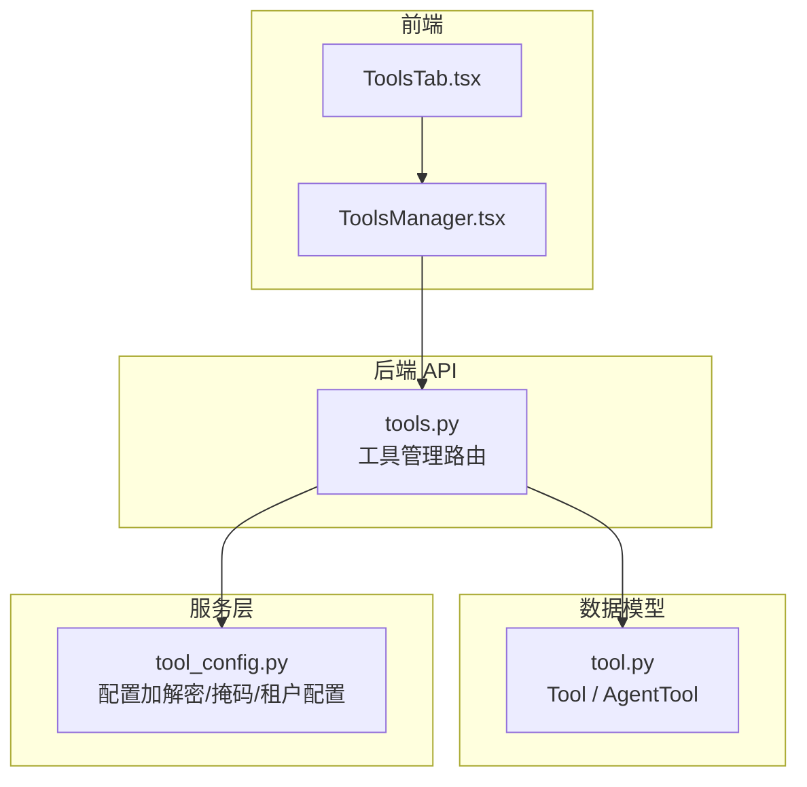
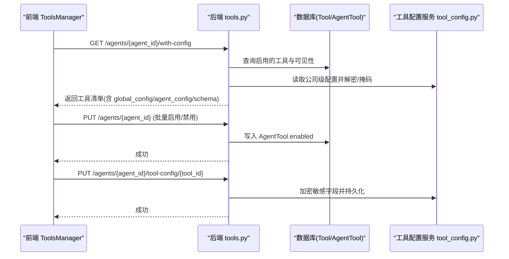
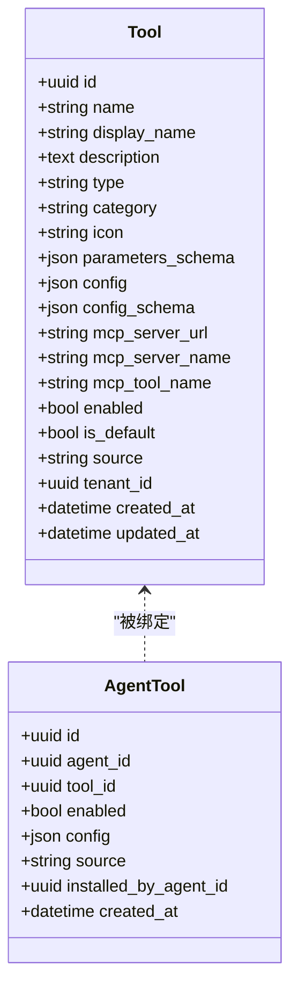
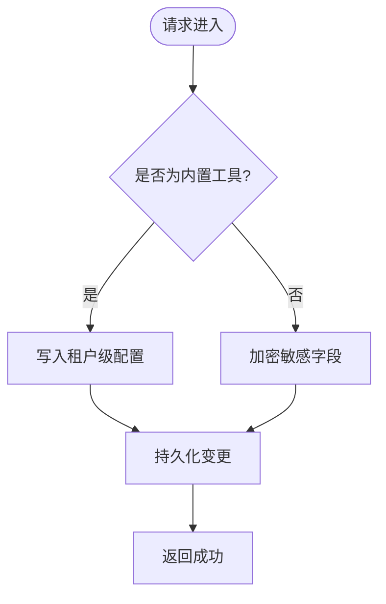
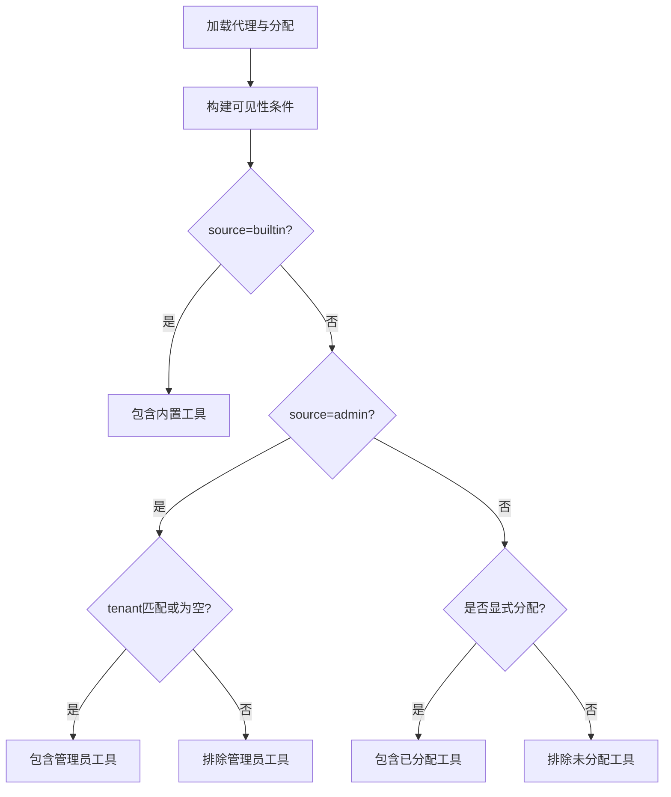
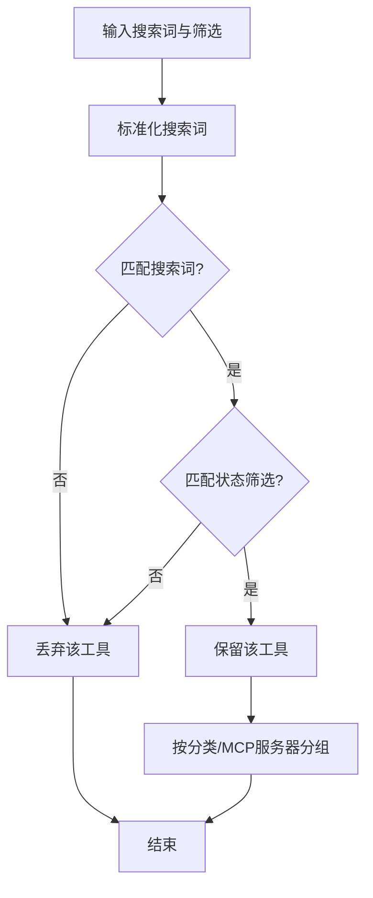
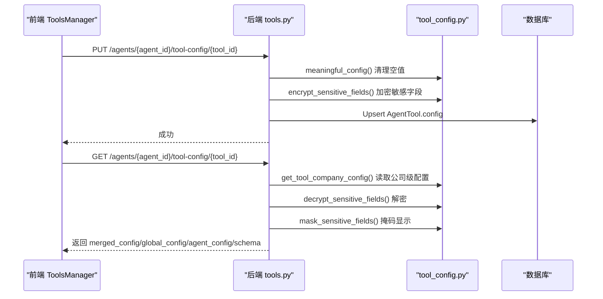
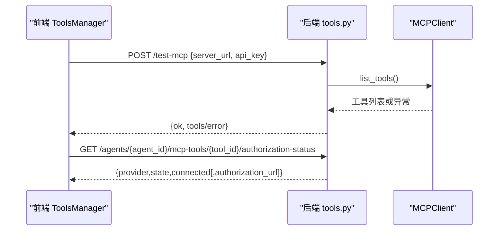
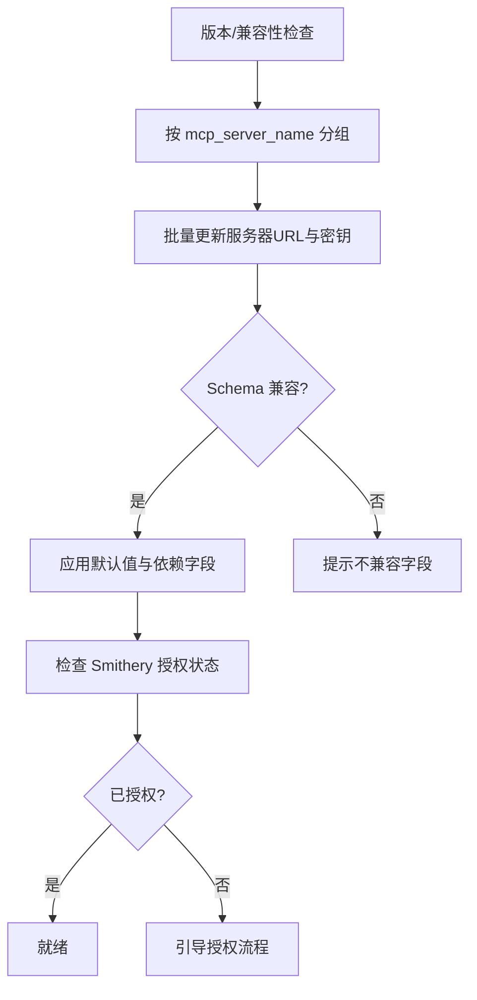
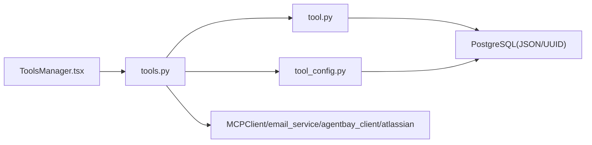

# 工具管理标签页

<cite>
**本文引用的文件**   
- [tools.py](file://backend/app/api/tools.py)
- [tool.py](file://backend/app/models/tool.py)
- [tool_config.py](file://backend/app/services/tool_config.py)
- [ToolsTab.tsx](file://frontend/src/pages/agent-detail/tabs/ToolsTab.tsx)
- [ToolsManager.tsx](file://frontend/src/pages/agent-detail/components/ToolsManager.tsx)
</cite>

## 目录
1. [简介](#简介)
2. [项目结构](#项目结构)
3. [核心组件](#核心组件)
4. [架构总览](#架构总览)
5. [详细组件分析](#详细组件分析)
6. [依赖关系分析](#依赖关系分析)
7. [性能考虑](#性能考虑)
8. [故障排查指南](#故障排查指南)
9. [结论](#结论)
10. [附录](#附录)

## 简介
本文件面向“工具管理标签页”的完整实现说明，覆盖以下关键能力：
- 工具的增删改查（CRUD）与批量操作
- 权限控制与可见性规则（租户、来源、系统代理等）
- 工具分类与搜索过滤机制
- 配置参数的验证、加密/解密、掩码显示与保存逻辑
- 工具测试与调试（MCP 连接测试、邮件连接测试、类别连通性测试）
- 工具版本管理与兼容性检查（基于 MCP Server 名称分组、Smithery 授权状态、参数 Schema 驱动的前端校验）

## 项目结构
后端通过 FastAPI 暴露工具管理 API，模型层定义工具与代理绑定关系，服务层提供配置加解密与租户级配置存取；前端以 React 组件呈现工具列表、分类、搜索、筛选、配置弹窗与授权流程。

**图示来源** 
- [tools.py:1-1152](file://backend/app/api/tools.py#L1-L1152)
- [tool.py:1-63](file://backend/app/models/tool.py#L1-L63)
- [tool_config.py:1-161](file://backend/app/services/tool_config.py#L1-L161)
- [ToolsTab.tsx:1-24](file://frontend/src/pages/agent-detail/tabs/ToolsTab.tsx#L1-L24)
- [ToolsManager.tsx:1-1090](file://frontend/src/pages/agent-detail/components/ToolsManager.tsx#L1-L1090)

**章节来源**
- [tools.py:1-1152](file://backend/app/api/tools.py#L1-L1152)
- [tool.py:1-63](file://backend/app/models/tool.py#L1-L63)
- [tool_config.py:1-161](file://backend/app/services/tool_config.py#L1-L161)
- [ToolsTab.tsx:1-24](file://frontend/src/pages/agent-detail/tabs/ToolsTab.tsx#L1-L24)
- [ToolsManager.tsx:1-1090](file://frontend/src/pages/agent-detail/components/ToolsManager.tsx#L1-L1090)

## 核心组件
- 工具模型与绑定
  - Tool：描述工具元信息、类型、分类、参数 Schema、运行时配置、MCP 字段、启用状态、默认启用、来源、租户、时间戳。
  - AgentTool：代理与工具的绑定关系，包含启用开关、每代理配置覆盖、来源、安装者、创建时间。
- 工具管理 API
  - 全局工具 CRUD、批量更新、按代理获取工具列表与配置、按代理更新启用状态、MCP 服务器级别凭据更新、Agent 已安装工具管理、类别共享配置、测试接口等。
- 配置服务
  - 敏感字段识别、加密/解密、掩码显示、租户级工具配置读写。
- 前端组件
  - ToolsTab 作为标签容器，ToolsManager 承载工具列表、分类、搜索、筛选、批量操作、配置弹窗、MCP 授权状态检测与交互。

**章节来源**
- [tool.py:1-63](file://backend/app/models/tool.py#L1-L63)
- [tools.py:1-1152](file://backend/app/api/tools.py#L1-L1152)
- [tool_config.py:1-161](file://backend/app/services/tool_config.py#L1-L161)
- [ToolsTab.tsx:1-24](file://frontend/src/pages/agent-detail/tabs/ToolsTab.tsx#L1-L24)
- [ToolsManager.tsx:1-1090](file://frontend/src/pages/agent-detail/components/ToolsManager.tsx#L1-L1090)

## 架构总览
工具管理标签页采用前后端分离架构：前端通过 REST API 获取并维护工具列表、启用状态与配置；后端依据来源与租户边界进行可见性控制，并通过服务层完成配置的加密与掩码处理。

**图示来源** 
- [tools.py:828-931](file://backend/app/api/tools.py#L828-L931)
- [tools.py:793-826](file://backend/app/api/tools.py#L793-L826)
- [tool_config.py:40-76](file://backend/app/services/tool_config.py#L40-L76)
- [tool_config.py:146-151](file://backend/app/services/tool_config.py#L146-L151)

## 详细组件分析

### 工具模型与数据结构
- Tool 字段涵盖名称、展示名、描述、类型、分类、图标、OpenAI function-calling 参数 Schema、运行时配置、MCP 相关字段、启用与默认启用标志、来源、租户与时间戳。
- AgentTool 记录代理对工具的启用状态、每代理配置覆盖、来源、安装者等信息。

**图示来源** 
- [tool.py:13-48](file://backend/app/models/tool.py#L13-L48)
- [tool.py:51-63](file://backend/app/models/tool.py#L51-L63)

**章节来源**
- [tool.py:1-63](file://backend/app/models/tool.py#L1-L63)

### 工具增删改查与批量操作
- 列出平台工具（按租户范围）：支持内置与管理员添加的工具，按分类与名称排序，并附带公司级配置。
- 创建工具：校验同名冲突（租户内唯一），设置来源为 admin，写入基础元信息与 MCP 字段。
- 更新工具：支持字段增量更新；当更新 config 时，内置工具走租户级配置存储，非内置工具则对敏感字段加密后落库。
- 删除工具：仅允许删除非内置工具，同时清理关联的 AgentTool。
- 批量更新：统一更新多个工具的 enabled 状态。

**图示来源** 
- [tools.py:195-236](file://backend/app/api/tools.py#L195-L236)
- [tools.py:239-281](file://backend/app/api/tools.py#L239-L281)
- [tools.py:310-338](file://backend/app/api/tools.py#L310-L338)
- [tools.py:341-358](file://backend/app/api/tools.py#L341-L358)
- [tools.py:291-308](file://backend/app/api/tools.py#L291-L308)

**章节来源**
- [tools.py:195-358](file://backend/app/api/tools.py#L195-L358)

### 权限控制与可见性规则
- 可见性规则：
  - 内置工具为平台能力，全局可见。
  - 管理员工具归属代理所在租户或平台级（tenant_id 为空）。
  - 显式分配的 AgentTool 始终可见。
- 系统代理与普通代理差异：
  - 系统代理可看到所有工具；普通代理不可见 OKR Agent 专属工具。
  - 未接入飞书渠道的代理隐藏飞书类工具。
- 角色限制：
  - 修改 allow_network 等网络访问设置仅限平台管理员或组织管理员。

**图示来源** 
- [tools.py:55-91](file://backend/app/api/tools.py#L55-L91)
- [tools.py:362-448](file://backend/app/api/tools.py#L362-L448)
- [tools.py:801-826](file://backend/app/api/tools.py#L801-L826)

**章节来源**
- [tools.py:55-91](file://backend/app/api/tools.py#L55-L91)
- [tools.py:362-448](file://backend/app/api/tools.py#L362-L448)
- [tools.py:801-826](file://backend/app/api/tools.py#L801-L826)

### 工具分类与搜索过滤机制
- 分类维度：
  - 后端按 category 排序输出；前端将 MCP 同服务器工具合并为一组，其余按分类分组。
  - 特殊类别（如 agentbay）支持“类别级共享配置”，优先选择主工具（如 agentbay_browser_navigate）的配置。
- 搜索与筛选：
  - 前端支持关键词搜索（名称、展示名、描述、MCP 服务器名、分类与本地化标签）。
  - 状态筛选：全部、已启用、已禁用、已配置（存在 agent_config 覆盖）。
  - 展开/折叠分类，批量启用/禁用。

**图示来源** 
- [ToolsManager.tsx:632-655](file://frontend/src/pages/agent-detail/components/ToolsManager.tsx#L632-L655)
- [ToolsManager.tsx:271-276](file://frontend/src/pages/agent-detail/components/ToolsManager.tsx#L271-L276)
- [tools.py:971-1051](file://backend/app/api/tools.py#L971-L1051)

**章节来源**
- [ToolsManager.tsx:632-655](file://frontend/src/pages/agent-detail/components/ToolsManager.tsx#L632-L655)
- [ToolsManager.tsx:271-276](file://frontend/src/pages/agent-detail/components/ToolsManager.tsx#L271-L276)
- [tools.py:971-1051](file://backend/app/api/tools.py#L971-L1051)

### 工具配置参数的验证与保存逻辑
- 参数 Schema 驱动：
  - 前端根据 config_schema.fields 渲染表单，支持默认值填充、依赖字段显示、只读角色限制。
  - 敏感字段（api_key、private_key、auth_code、password、secret 以及 schema 中标记 password 的字段）在前端不预填全局掩码值，避免泄露。
- 后端加密与掩码：
  - 敏感字段在保存前加密，读取时解密；全局配置用于显示时进行掩码（如 ****xxxx）。
  - 内置工具的公司级配置存储在租户设置中，非内置工具直接保存在 Tool.config。
- 保存策略：
  - 类别级配置（如 agentbay、atlassian）通过 ChannelConfig 存储，支持加密与额外字段合并。
  - 每代理配置覆盖全局默认，空敏感字段不会覆盖继承的全局密钥。

**图示来源** 
- [tools.py:793-826](file://backend/app/api/tools.py#L793-L826)
- [tools.py:751-791](file://backend/app/api/tools.py#L751-L791)
- [tool_config.py:79-91](file://backend/app/services/tool_config.py#L79-L91)
- [tool_config.py:40-76](file://backend/app/services/tool_config.py#L40-L76)
- [tool_config.py:146-161](file://backend/app/services/tool_config.py#L146-L161)

**章节来源**
- [tools.py:751-826](file://backend/app/api/tools.py#L751-L826)
- [tool_config.py:40-91](file://backend/app/services/tool_config.py#L40-L91)
- [tool_config.py:146-161](file://backend/app/services/tool_config.py#L146-L161)
- [ToolsManager.tsx:120-158](file://frontend/src/pages/agent-detail/components/ToolsManager.tsx#L120-L158)

### 工具测试与调试功能使用方法
- MCP 连接测试：
  - 支持 URL 嵌入密钥或独立 Bearer 密钥两种认证模式；调用 MCPClient.list_tools 验证可用工具。
- 邮件连接测试：
  - 使用 IMAP/SMTP 配置测试连通性，返回结果或错误摘要。
- 类别连通性测试：
  - 针对特定类别（如 atlassian、agentbay）执行通道测试，异步触发同步任务（如 Atlassian 工具同步）。
- MCP 授权状态：
  - 前端轮询后端授权状态接口，必要时打开授权窗口完成 Smithery 授权；失败时给出友好提示。

**图示来源** 
- [tools.py:581-600](file://backend/app/api/tools.py#L581-L600)
- [tools.py:492-571](file://backend/app/api/tools.py#L492-L571)
- [tools.py:939-968](file://backend/app/api/tools.py#L939-L968)
- [tools.py:1136-1152](file://backend/app/api/tools.py#L1136-L1152)

**章节来源**
- [tools.py:581-600](file://backend/app/api/tools.py#L581-L600)
- [tools.py:492-571](file://backend/app/api/tools.py#L492-L571)
- [tools.py:939-968](file://backend/app/api/tools.py#L939-L968)
- [tools.py:1136-1152](file://backend/app/api/tools.py#L1136-L1152)

### 工具版本管理与兼容性检查
- 版本与分组：
  - 通过 mcp_server_name 将同一服务器的工具归组，便于统一更新服务器地址与密钥。
  - 前端按分组显示授权状态与批量操作入口。
- 兼容性：
  - 参数 Schema 驱动前端表单与校验，确保新旧字段兼容。
  - 内置工具的公司级配置与系统设置键映射（如 Jina 的 api_key）保证向后兼容。
- 授权与连接：
  - Smithery 授权状态接口提供连接可用性判断与授权链接，前端据此引导用户完成授权。

**图示来源** 
- [tools.py:611-664](file://backend/app/api/tools.py#L611-L664)
- [tools.py:492-571](file://backend/app/api/tools.py#L492-L571)
- [ToolsManager.tsx:246-269](file://frontend/src/pages/agent-detail/components/ToolsManager.tsx#L246-L269)
- [ToolsManager.tsx:360-399](file://frontend/src/pages/agent-detail/components/ToolsManager.tsx#L360-L399)

**章节来源**
- [tools.py:611-664](file://backend/app/api/tools.py#L611-L664)
- [tools.py:492-571](file://backend/app/api/tools.py#L492-L571)
- [ToolsManager.tsx:246-269](file://frontend/src/pages/agent-detail/components/ToolsManager.tsx#L246-L269)
- [ToolsManager.tsx:360-399](file://frontend/src/pages/agent-detail/components/ToolsManager.tsx#L360-L399)

## 依赖关系分析
- 前端依赖：
  - ToolsTab 作为容器，ToolsManager 负责数据获取、交互与状态管理。
- 后端依赖：
  - tools.py 依赖 tool.py 模型与 tool_config.py 服务；部分功能依赖外部客户端（MCPClient、email_service、agentbay_client、atlassian 模块）。
- 数据依赖：
  - Tool 与 AgentTool 通过外键关联；公司级配置通过 TenantSetting 存储；类别级配置通过 ChannelConfig 存储。

**图示来源** 
- [tools.py:1-1152](file://backend/app/api/tools.py#L1-L1152)
- [tool.py:1-63](file://backend/app/models/tool.py#L1-L63)
- [tool_config.py:1-161](file://backend/app/services/tool_config.py#L1-L161)
- [ToolsManager.tsx:1-1090](file://frontend/src/pages/agent-detail/components/ToolsManager.tsx#L1-L1090)

**章节来源**
- [tools.py:1-1152](file://backend/app/api/tools.py#L1-L1152)
- [tool.py:1-63](file://backend/app/models/tool.py#L1-L63)
- [tool_config.py:1-161](file://backend/app/services/tool_config.py#L1-L161)
- [ToolsManager.tsx:1-1090](file://frontend/src/pages/agent-detail/components/ToolsManager.tsx#L1-L1090)

## 性能考虑
- 列表加载优化：
  - 后端按分类与名称排序，减少前端分组开销；按需加载公司级配置与解密。
- 批量操作：
  - 批量启用/禁用与服务器级更新减少多次往返。
- 缓存控制：
  - 授权状态接口设置 no-store 头，避免浏览器缓存导致的状态不一致。
- 前端渲染：
  - 分类展开/折叠与搜索即时过滤，降低 DOM 节点数量。

[本节为通用指导，无需代码引用]

## 故障排查指南
- 常见错误与定位：
  - 404 工具不存在：检查 tool_id 是否正确、是否存在于当前租户与可见性范围内。
  - 400 内置工具删除失败：内置工具不可删除，需确认 source 与 type。
  - 403 权限不足：修改网络访问设置需要平台或组织管理员角色。
  - 503 授权状态不可用：外部服务不可达或内部异常，重试或检查网络。
- 调试建议：
  - 使用 MCP 测试接口验证连接与工具列表。
  - 查看公司级配置与代理级配置差异，确认敏感字段是否被正确掩码与加密。
  - 检查 Smithery 授权状态与授权链接，确保浏览器窗口未被拦截。

**章节来源**
- [tools.py:341-358](file://backend/app/api/tools.py#L341-L358)
- [tools.py:492-571](file://backend/app/api/tools.py#L492-L571)
- [tools.py:801-826](file://backend/app/api/tools.py#L801-L826)

## 结论
工具管理标签页通过清晰的模型设计、严格的权限与可见性控制、灵活的配置管理与完善的测试调试能力，提供了稳定且易用的工具管理能力。前端以 Schema 驱动的表单与直观的交互提升了用户体验，后端通过加密、掩码与租户隔离保障了安全性与多租户隔离。整体架构具备良好的扩展性与兼容性，适合持续演进。

[本节为总结性内容，无需代码引用]

## 附录
- 常用接口路径（示例）：
  - 获取代理工具与配置：GET /api/tools/agents/{agent_id}/with-config
  - 更新代理工具启用状态：PUT /api/tools/agents/{agent_id}
  - 保存每代理工具配置：PUT /api/tools/agents/{agent_id}/tool-config/{tool_id}
  - 获取类别共享配置：GET /api/tools/agents/{agent_id}/category-config/{category}
  - 保存类别共享配置：POST /api/tools/agents/{agent_id}/category-config/{category}
  - 测试 MCP 连接：POST /api/tools/test-mcp
  - 测试邮件连接：POST /api/tools/test-email
  - 获取授权状态：GET /api/tools/agents/{agent_id}/mcp-tools/{tool_id}/authorization-status

[本节为参考信息，无需代码引用]