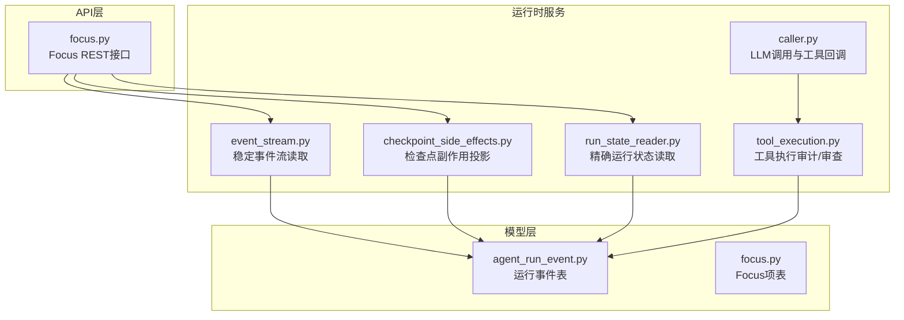
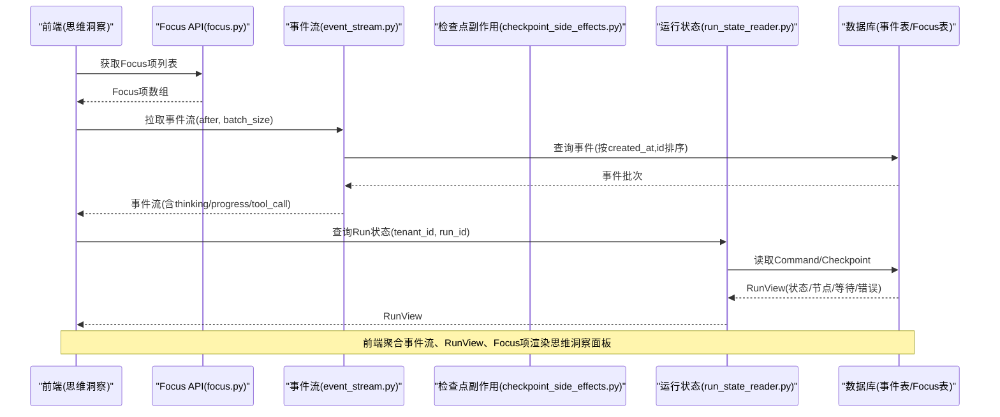
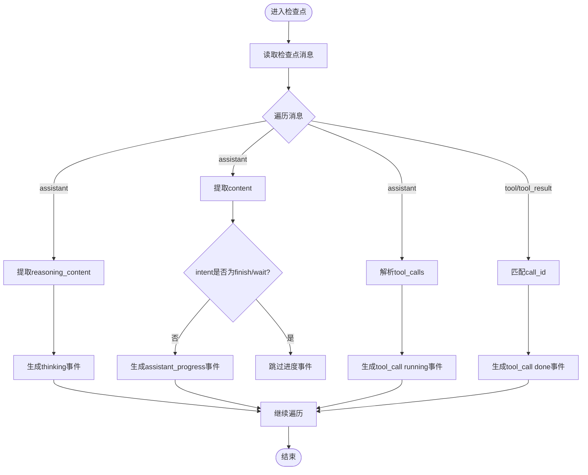
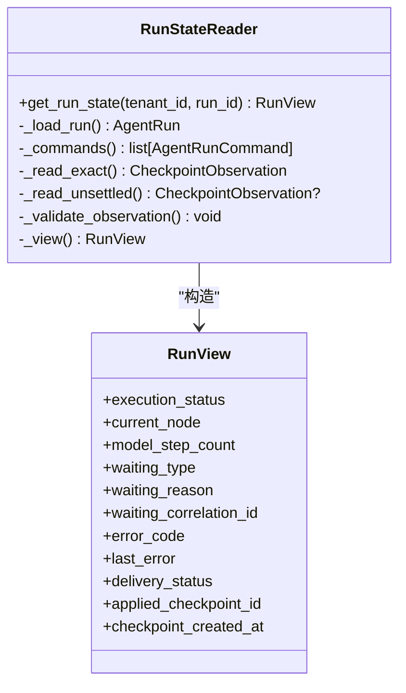
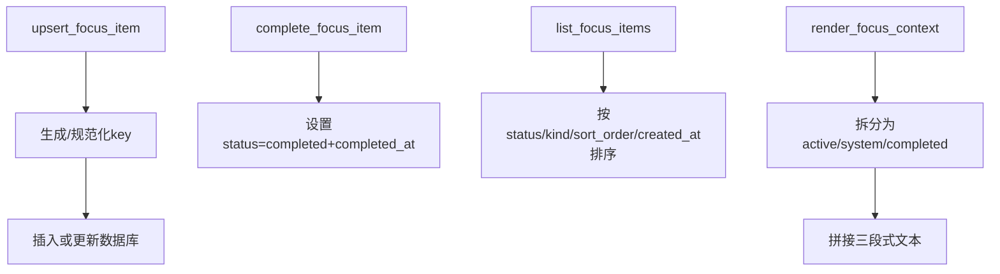
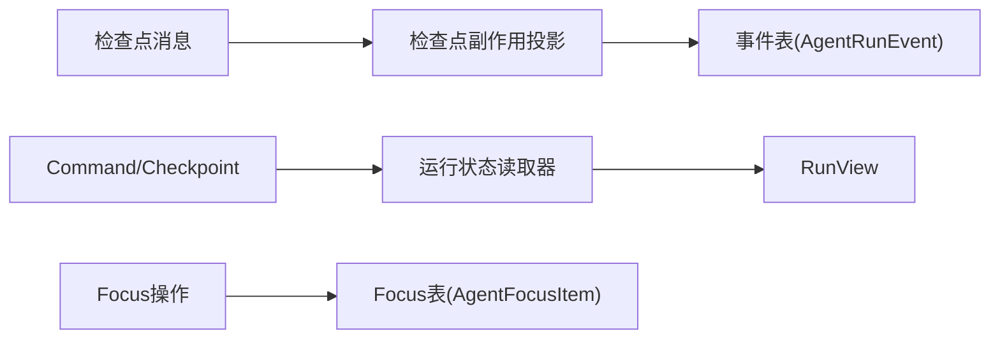
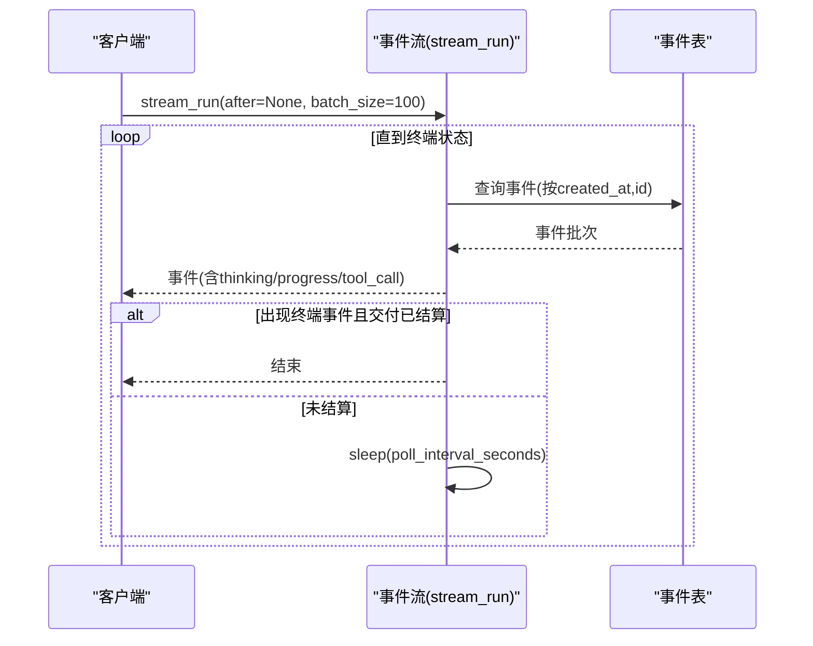
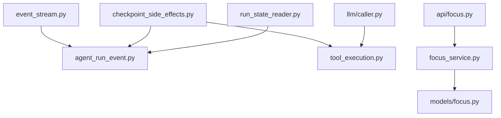

# 思维洞察标签页

<cite>
**本文引用的文件**   
- [focus.py](file://backend/app/api/focus.py)
- [focus_service.py](file://backend/app/services/focus_service.py)
- [event_stream.py](file://backend/app/services/agent_runtime/event_stream.py)
- [checkpoint_side_effects.py](file://backend/app/services/agent_runtime/checkpoint_side_effects.py)
- [run_state_reader.py](file://backend/app/services/agent_runtime/run_state_reader.py)
- [caller.py](file://backend/app/services/llm/caller.py)
- [tool_execution.py](file://backend/app/services/agent_runtime/tool_execution.py)
- [agent_run_event.py](file://backend/app/models/agent_run_event.py)
- [focus.py](file://backend/app/models/focus.py)
</cite>

## 目录
1. [简介](#简介)
2. [项目结构](#项目结构)
3. [核心组件](#核心组件)
4. [架构总览](#架构总览)
5. [详细组件分析](#详细组件分析)
6. [依赖关系分析](#依赖关系分析)
7. [性能考量](#性能考量)
8. [故障排查指南](#故障排查指南)
9. [结论](#结论)
10. [附录](#附录)

## 简介
本文件面向“思维洞察标签页”的Agent内部状态可视化能力，围绕以下目标展开：
- 思维链展示：将模型推理、工具调用与结果以可回放的事件流呈现。
- 决策过程分析：基于检查点（Checkpoint）与命令（Command）重建运行轨迹，定位关键决策节点。
- 注意力焦点追踪：通过Focus Items结构化工作记忆，映射Agent当前关注点与系统关注点。
- 数据采集与存储：事件流、检查点、工具执行记录、Focus项的持久化策略与幂等性保证。
- 模式识别与分析：从消息与工具调用中抽取“思考/进度/工具调用”三类活动类型，形成可检索的历史。
- 历史查询与回放：提供按Run维度的事件流拉取与重放接口，支持断点续读与终端状态判定。
- 优化建议与调优：针对事件流轮询、批大小、索引、序列化校验等给出性能与稳定性建议。

## 项目结构
后端围绕“运行时事件流 + 检查点侧写 + Focus服务”三大模块构建：
- API层：暴露Focus相关REST接口，供前端渲染思维洞察面板。
- 运行时服务：事件流读取、检查点副作用投影、运行状态读取器。
- 模型层：事件表、Focus项表等持久化结构。
- LLM调用层：在工具调用前后推送“思考内容”与“运行中”状态，便于实时展示。

图表来源
- [focus.py:1-53](file://backend/app/api/focus.py#L1-L53)
- [event_stream.py:1-238](file://backend/app/services/agent_runtime/event_stream.py#L1-L238)
- [checkpoint_side_effects.py:1-800](file://backend/app/services/agent_runtime/checkpoint_side_effects.py#L1-L800)
- [run_state_reader.py:1-405](file://backend/app/services/agent_runtime/run_state_reader.py#L1-L405)
- [tool_execution.py:819-843](file://backend/app/services/agent_runtime/tool_execution.py#L819-L843)
- [caller.py:412-434](file://backend/app/services/llm/caller.py#L412-L434)
- [agent_run_event.py:1-99](file://backend/app/models/agent_run_event.py#L1-L99)
- [focus.py:1-43](file://backend/app/models/focus.py#L1-L43)

章节来源
- [focus.py:1-53](file://backend/app/api/focus.py#L1-L53)
- [event_stream.py:1-238](file://backend/app/services/agent_runtime/event_stream.py#L1-L238)
- [checkpoint_side_effects.py:1-800](file://backend/app/services/agent_runtime/checkpoint_side_effects.py#L1-L800)
- [run_state_reader.py:1-405](file://backend/app/services/agent_runtime/run_state_reader.py#L1-L405)
- [tool_execution.py:819-843](file://backend/app/services/agent_runtime/tool_execution.py#L819-L843)
- [caller.py:412-434](file://backend/app/services/llm/caller.py#L412-L434)
- [agent_run_event.py:1-99](file://backend/app/models/agent_run_event.py#L1-L99)
- [focus.py:1-43](file://backend/app/models/focus.py#L1-L43)

## 核心组件
- 思维链事件流（Event Stream）
  - 基于数据库的稳定事件流，按created_at与id排序，支持after游标分页与批量拉取。
  - 事件类型覆盖生命周期、状态变更、等待开始、恢复、证据添加、验证更新、交付成功/失败等。
  - 对payload与artifact_refs进行JSON安全校验，确保下游消费稳定。
- 检查点副作用投影（Checkpoint Side Effects）
  - 从已提交的Graph/控制边界（检查点）推导产品态：等待用户、终态交付、失败元数据、思考内容提取。
  - 生成可重放的Web Chat活动事件（thinking/assistant_progress/tool_call），并持久化直接对话的工具历史。
  - 幂等写入事件表，避免重复投影。
- 运行状态读取器（Run State Reader）
  - 基于Command与LangGraph Checkpoint的精确查询，返回统一RunView视图。
  - 处理取消、应用、拒绝启动、活跃命令等分支，输出执行状态、当前节点、等待信息、错误码等。
- Focus服务（Focus Service）
  - 维护Agent的结构化工作记忆（进行中/系统/已完成），支持upsert、完成、列表、上下文渲染。
  - 兼容旧版focus.md迁移，提供slugify键生成与规范化。
- LLM调用与工具执行
  - 在工具调用前推送“running”与reasoning_content，便于前端实时显示思维链片段。
  - 工具执行审计支持按run_id与tool_call_id审查执行状态。

章节来源
- [event_stream.py:1-238](file://backend/app/services/agent_runtime/event_stream.py#L1-L238)
- [checkpoint_side_effects.py:1-800](file://backend/app/services/agent_runtime/checkpoint_side_effects.py#L1-L800)
- [run_state_reader.py:1-405](file://backend/app/services/agent_runtime/run_state_reader.py#L1-L405)
- [focus_service.py:1-441](file://backend/app/services/focus_service.py#L1-L441)
- [caller.py:412-434](file://backend/app/services/llm/caller.py#L412-L434)
- [tool_execution.py:819-843](file://backend/app/services/agent_runtime/tool_execution.py#L819-L843)

## 架构总览
思维洞察标签页的数据源来自“事件流 + 运行状态 + Focus项”，三者协同构成完整的思维可视化：
- 事件流提供时间线视角（thinking/progress/tool_call）。
- 运行状态提供控制面视角（状态、当前节点、等待原因、错误码）。
- Focus项提供注意力焦点视角（进行中/系统/已完成）。

图表来源
- [focus.py:1-53](file://backend/app/api/focus.py#L1-L53)
- [event_stream.py:1-238](file://backend/app/services/agent_runtime/event_stream.py#L1-L238)
- [checkpoint_side_effects.py:1-800](file://backend/app/services/agent_runtime/checkpoint_side_effects.py#L1-L800)
- [run_state_reader.py:1-405](file://backend/app/services/agent_runtime/run_state_reader.py#L1-L405)

## 详细组件分析

### 思维链展示（Thinking Chain）
- 数据来源
  - 检查点消息中的assistant角色消息，包含reasoning_content与runtime_intent。
  - 工具调用消息（tool_calls）与工具结果消息（tool/tool_result）。
- 事件生成
  - thinking：assistant消息的reasoning_content作为“思考”活动。
  - assistant_progress：assistant消息content且非finish/wait时作为“进度”。
  - tool_call：工具调用开始与结束分别生成running/done状态。
- 幂等与重放
  - 使用message_id与call_id作为去重键，确保重放不重复。
  - 直接对话场景下，工具历史会持久化为ChatMessage以便刷新与重连恢复。

图表来源
- [checkpoint_side_effects.py:271-385](file://backend/app/services/agent_runtime/checkpoint_side_effects.py#L271-L385)
- [checkpoint_side_effects.py:388-456](file://backend/app/services/agent_runtime/checkpoint_side_effects.py#L388-L456)

章节来源
- [checkpoint_side_effects.py:271-385](file://backend/app/services/agent_runtime/checkpoint_side_effects.py#L271-L385)
- [checkpoint_side_effects.py:388-456](file://backend/app/services/agent_runtime/checkpoint_side_effects.py#L388-L456)

### 决策过程分析（Decision Process）
- 运行状态读取
  - 根据Command与Checkpoint确定最终或中间状态，包括cancelled、completed、failed、waiting_*等。
  - 输出current_node、model_step_count、waiting_type/reason/correlation_id、error_code/last_error等。
- 控制面与图面一致性
  - 校验checkpoint metadata与run/command的一致性，防止不一致状态被消费。
  - 对未决命令（pending/claimed）尝试读取最新快照，若不可用则回退到队列/运行状态。

图表来源
- [run_state_reader.py:89-258](file://backend/app/services/agent_runtime/run_state_reader.py#L89-L258)
- [run_state_reader.py:260-385](file://backend/app/services/agent_runtime/run_state_reader.py#L260-L385)

章节来源
- [run_state_reader.py:89-258](file://backend/app/services/agent_runtime/run_state_reader.py#L89-L258)
- [run_state_reader.py:260-385](file://backend/app/services/agent_runtime/run_state_reader.py#L260-L385)

### 注意力焦点追踪（Focus Items）
- 数据结构
  - key/title/description/status(kind:normal/system)/source/metadata/sort_order/completed_at/created_at/updated_at。
- 操作
  - upsert_focus_item：创建或更新Focus项，自动slugify key，system类强制system:前缀。
  - complete_focus_item：标记完成并记录时间。
  - list_focus_items：按状态、kind、sort_order、created_at排序返回。
  - render_focus_context：生成用于提示的三段式文本（进行中/系统/最近完成）。
- 迁移
  - 支持从legacy focus.md一次性导入，规范化为三段式结构。

图表来源
- [focus_service.py:284-364](file://backend/app/services/focus_service.py#L284-L364)
- [focus_service.py:390-406](file://backend/app/services/focus_service.py#L390-L406)
- [focus_service.py:262-281](file://backend/app/services/focus_service.py#L262-L281)
- [focus_service.py:409-440](file://backend/app/services/focus_service.py#L409-L440)
- [focus.py:13-43](file://backend/app/models/focus.py#L13-L43)

章节来源
- [focus_service.py:284-364](file://backend/app/services/focus_service.py#L284-L364)
- [focus_service.py:390-406](file://backend/app/services/focus_service.py#L390-L406)
- [focus_service.py:262-281](file://backend/app/services/focus_service.py#L262-L281)
- [focus_service.py:409-440](file://backend/app/services/focus_service.py#L409-L440)
- [focus.py:13-43](file://backend/app/models/focus.py#L13-L43)

### 思维数据的采集与存储机制
- 事件流采集
  - 从AgentRunEvent表按created_at与id顺序拉取，支持after游标与batch_size限制。
  - 对payload/artifact_refs进行JSON安全校验，确保下游消费稳定。
- 检查点副作用投影
  - 从已提交检查点推导事件，幂等写入事件表，避免重复。
  - 直接对话场景下，工具历史持久化为ChatMessage，便于刷新与重连恢复。
- 运行状态读取
  - 基于Command与Checkpoint的精确查询，返回统一RunView视图。
- Focus项存储
  - 数据库表agent_focus_items，唯一约束(agent_id,key)，支持排序与时间戳。

图表来源
- [event_stream.py:1-238](file://backend/app/services/agent_runtime/event_stream.py#L1-L238)
- [checkpoint_side_effects.py:458-552](file://backend/app/services/agent_runtime/checkpoint_side_effects.py#L458-L552)
- [run_state_reader.py:1-405](file://backend/app/services/agent_runtime/run_state_reader.py#L1-L405)
- [focus_service.py:262-364](file://backend/app/services/focus_service.py#L262-L364)
- [agent_run_event.py:1-99](file://backend/app/models/agent_run_event.py#L1-L99)
- [focus.py:13-43](file://backend/app/models/focus.py#L13-L43)

章节来源
- [event_stream.py:1-238](file://backend/app/services/agent_runtime/event_stream.py#L1-L238)
- [checkpoint_side_effects.py:458-552](file://backend/app/services/agent_runtime/checkpoint_side_effects.py#L458-L552)
- [run_state_reader.py:1-405](file://backend/app/services/agent_runtime/run_state_reader.py#L1-L405)
- [focus_service.py:262-364](file://backend/app/services/focus_service.py#L262-L364)
- [agent_run_event.py:1-99](file://backend/app/models/agent_run_event.py#L1-L99)
- [focus.py:13-43](file://backend/app/models/focus.py#L13-L43)

### 思维模式的识别与分析算法
- 模式识别
  - thinking：assistant消息的reasoning_content。
  - assistant_progress：assistant消息content且非finish/wait。
  - tool_call：tool_calls与tool/tool_result配对，区分running/done。
- 分析维度
  - 按message_id与call_id聚合，统计工具调用次数、耗时、错误率。
  - 结合RunView的waiting_type/reason/error_code分析阻塞与失败原因。
  - 结合Focus项状态变化分析注意力转移与任务推进。

章节来源
- [checkpoint_side_effects.py:271-385](file://backend/app/services/agent_runtime/checkpoint_side_effects.py#L271-L385)
- [run_state_reader.py:187-258](file://backend/app/services/agent_runtime/run_state_reader.py#L187-L258)
- [focus_service.py:409-440](file://backend/app/services/focus_service.py#L409-L440)

### 思维历史的查询与回放功能
- 查询接口
  - Focus API：GET /agents/{agent_id}/focus，支持include_completed过滤。
  - 事件流：DatabaseRuntimeEventStream.stream_run(after, batch_size)。
  - 运行状态：RunStateReader.get_run_state(tenant_id, run_id)。
- 回放机制
  - 事件流支持after游标与终端状态判定（run_completed/failed/cancelled + delivery settled）。
  - 检查点副作用幂等写入，确保重放一致。
  - 直接对话工具历史持久化，支持刷新与重连恢复。

图表来源
- [event_stream.py:180-231](file://backend/app/services/agent_runtime/event_stream.py#L180-L231)

章节来源
- [focus.py:45-53](file://backend/app/api/focus.py#L45-L53)
- [event_stream.py:180-231](file://backend/app/services/agent_runtime/event_stream.py#L180-L231)
- [checkpoint_side_effects.py:458-552](file://backend/app/services/agent_runtime/checkpoint_side_effects.py#L458-L552)

### 思维优化建议与性能调优
- 事件流轮询
  - 合理设置poll_interval_seconds与batch_size，平衡延迟与负载。
  - 对payload/artifact_refs的JSON校验开销较大，建议在高频路径上缓存或降级。
- 索引与查询
  - 事件表已建立tenant_id、event_type、created_at索引，建议按业务热点补充复合索引。
  - Focus项查询按status/kind/sort_order/created_at排序，确保索引命中。
- 幂等与一致性
  - 检查点副作用幂等写入，避免重复投影；事件表idempotency_key保障唯一性。
  - 运行状态读取器对checkpoint metadata与command一致性校验，防止不一致状态。
- 工具执行审计
  - 使用inspect_tool_execution按run_id与tool_call_id审查执行状态，便于问题定位。
  - 工具参数敏感字段脱敏，避免泄露。

章节来源
- [event_stream.py:1-238](file://backend/app/services/agent_runtime/event_stream.py#L1-L238)
- [agent_run_event.py:44-62](file://backend/app/models/agent_run_event.py#L44-L62)
- [focus_service.py:262-281](file://backend/app/services/focus_service.py#L262-L281)
- [checkpoint_side_effects.py:458-552](file://backend/app/services/agent_runtime/checkpoint_side_effects.py#L458-L552)
- [tool_execution.py:819-843](file://backend/app/services/agent_runtime/tool_execution.py#L819-L843)

## 依赖关系分析
- 组件耦合
  - 事件流依赖事件表与会话工厂，严格校验事件类型与JSON结构。
  - 检查点副作用依赖消息解析、工具参数脱敏、经验引用记录、群组消息发布。
  - 运行状态读取器依赖Command、Checkpoint与图注册表，输出统一RunView。
  - Focus服务依赖数据库表与迁移逻辑，提供稳定的工作记忆。
- 外部依赖
  - LangGraph驱动用于读取检查点与快照。
  - LLM调用层在工具执行前后推送思考内容与运行状态。

图表来源
- [event_stream.py:1-238](file://backend/app/services/agent_runtime/event_stream.py#L1-L238)
- [checkpoint_side_effects.py:1-800](file://backend/app/services/agent_runtime/checkpoint_side_effects.py#L1-L800)
- [run_state_reader.py:1-405](file://backend/app/services/agent_runtime/run_state_reader.py#L1-L405)
- [focus_service.py:1-441](file://backend/app/services/focus_service.py#L1-L441)
- [agent_run_event.py:1-99](file://backend/app/models/agent_run_event.py#L1-L99)
- [focus.py:1-43](file://backend/app/models/focus.py#L1-L43)
- [focus.py:1-53](file://backend/app/api/focus.py#L1-L53)
- [caller.py:412-434](file://backend/app/services/llm/caller.py#L412-L434)
- [tool_execution.py:819-843](file://backend/app/services/agent_runtime/tool_execution.py#L819-L843)

章节来源
- [event_stream.py:1-238](file://backend/app/services/agent_runtime/event_stream.py#L1-L238)
- [checkpoint_side_effects.py:1-800](file://backend/app/services/agent_runtime/checkpoint_side_effects.py#L1-L800)
- [run_state_reader.py:1-405](file://backend/app/services/agent_runtime/run_state_reader.py#L1-L405)
- [focus_service.py:1-441](file://backend/app/services/focus_service.py#L1-L441)
- [agent_run_event.py:1-99](file://backend/app/models/agent_run_event.py#L1-L99)
- [focus.py:1-43](file://backend/app/models/focus.py#L1-L43)
- [focus.py:1-53](file://backend/app/api/focus.py#L1-L53)
- [caller.py:412-434](file://backend/app/services/llm/caller.py#L412-L434)
- [tool_execution.py:819-843](file://backend/app/services/agent_runtime/tool_execution.py#L819-L843)

## 性能考量
- 事件流拉取
  - 调整batch_size与poll_interval_seconds，避免频繁轮询与过大内存占用。
  - JSON校验在高频路径可能成为瓶颈，建议按需启用或缓存校验结果。
- 检查点副作用投影
  - 幂等写入避免重复计算，注意批量写入的事务边界。
  - 经验引用与群组消息发布为异步副作用，失败应降级而非阻塞主流程。
- 运行状态读取
  - 精确查询依赖Command与Checkpoint，确保索引与图注册表可用。
  - 对未决命令的快照读取可能失败，需回退到队列/运行状态。
- Focus项操作
  - 排序与过滤依赖多列索引，建议按业务热点优化。
  - 迁移逻辑仅在首次存在时执行，避免重复开销。

## 故障排查指南
- 事件流异常
  - 检查事件类型是否受支持，payload/artifact_refs是否JSON可序列化。
  - 确认after游标有效，终端事件与交付状态是否满足结束条件。
- 检查点副作用失败
  - 校验checkpoint metadata与run/command一致性，检查waiting_request与delivery_request结构。
  - 查看失败日志中的error_code与error_message，定位具体阶段。
- 运行状态读取错误
  - 确认run.runtime_type为langgraph，thread_id与graph identity完整。
  - 检查applied_checkpoint_id是否存在，未决命令快照是否可读取。
- Focus项问题
  - 检查key唯一性与system前缀规则，确认status与kind合法。
  - 迁移失败时检查focus.md格式与编码。

章节来源
- [event_stream.py:103-130](file://backend/app/services/agent_runtime/event_stream.py#L103-L130)
- [checkpoint_side_effects.py:74-102](file://backend/app/services/agent_runtime/checkpoint_side_effects.py#L74-L102)
- [run_state_reader.py:161-186](file://backend/app/services/agent_runtime/run_state_reader.py#L161-L186)
- [focus_service.py:284-364](file://backend/app/services/focus_service.py#L284-L364)

## 结论
思维洞察标签页通过事件流、检查点副作用投影与Focus服务，构建了完整的Agent内部状态可视化体系。前端可基于thinking/progress/tool_call事件流、RunView控制面信息与Focus项注意力焦点，实现高保真的思维链展示、决策过程分析与注意力追踪。通过幂等写入、JSON校验与索引优化，系统在稳定性与性能之间取得良好平衡。后续可进一步扩展模式识别与分析维度，提升洞察深度与可操作性。

## 附录
- 术语说明
  - 思维链：模型推理与工具调用的时间线。
  - 检查点：Graph/控制边界的状态快照。
  - Focus项：Agent结构化工作记忆。
  - 事件流：按时间顺序追加的产品事件集合。
- 参考接口
  - Focus API：GET /agents/{agent_id}/focus
  - 事件流：DatabaseRuntimeEventStream.stream_run
  - 运行状态：RunStateReader.get_run_state