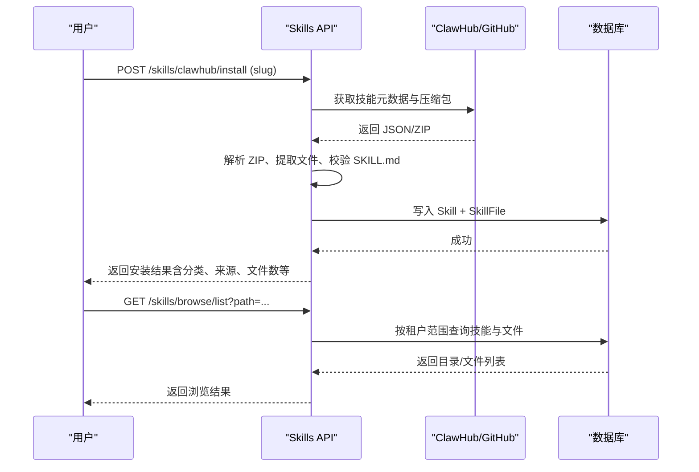
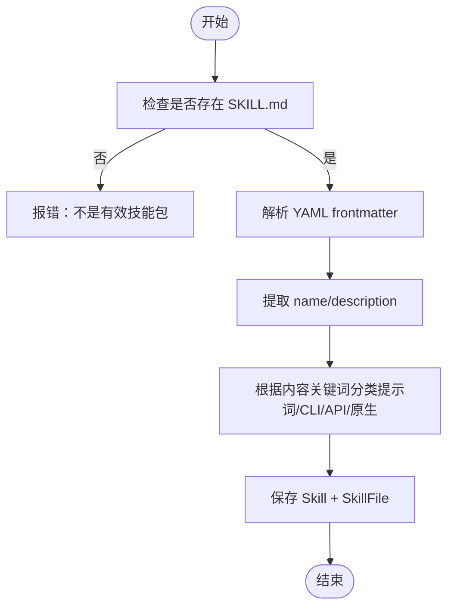
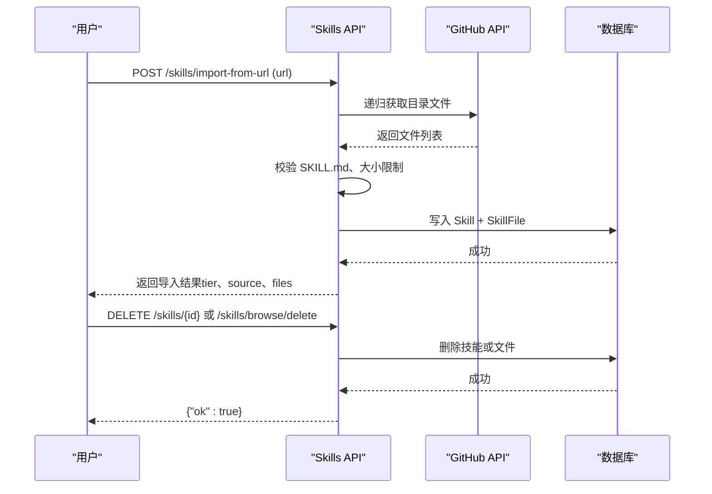
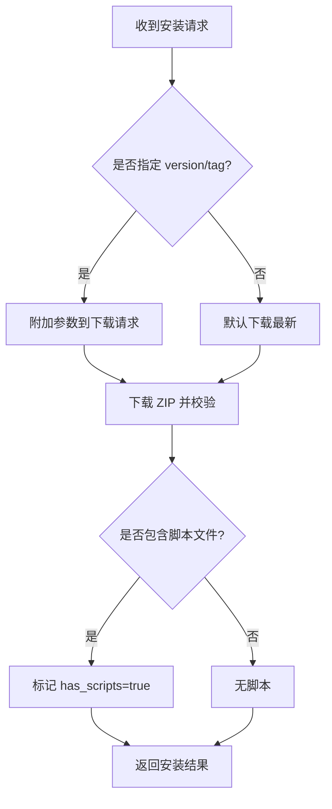
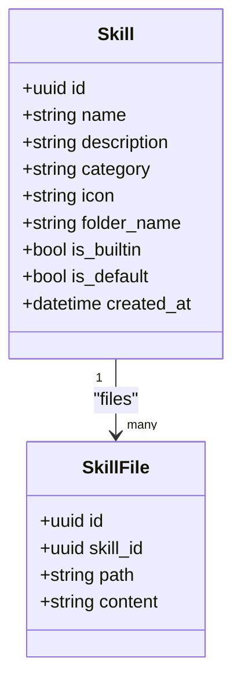
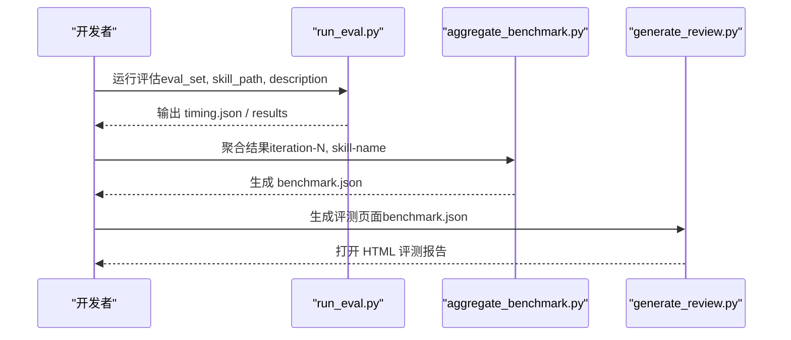
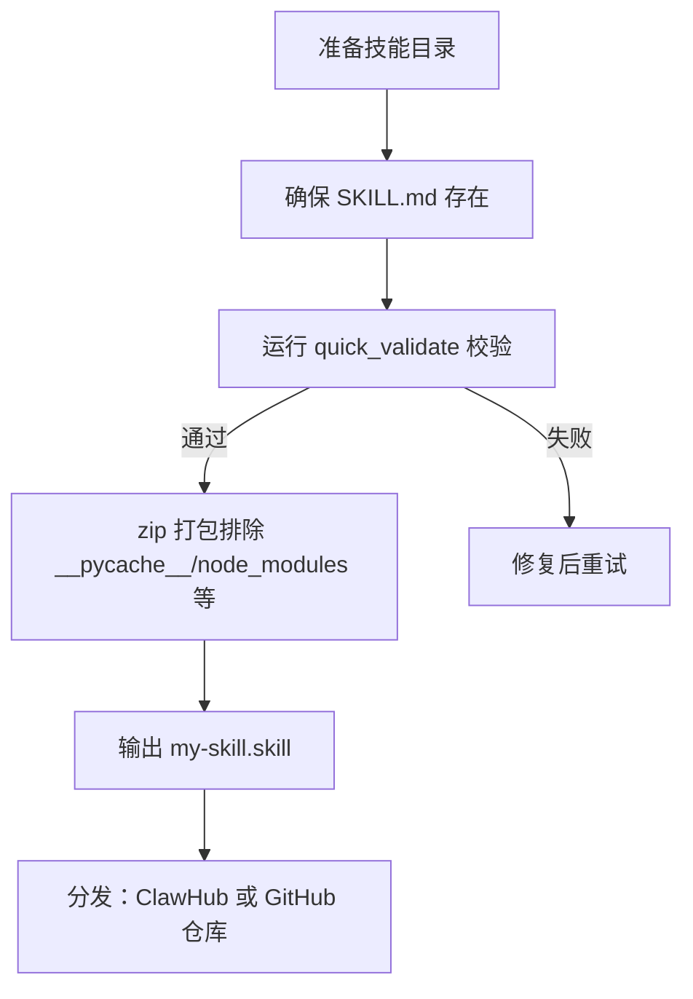
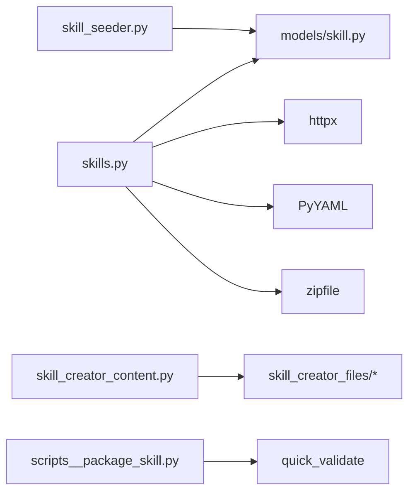

# 技能管理标签页

<cite>
**本文引用的文件**   
- [backend/app/api/skills.py](file://backend/app/api/skills.py)
- [backend/app/models/skill.py](file://backend/app/models/skill.py)
- [backend/app/services/skill_seeder.py](file://backend/app/services/skill_seeder.py)
- [backend/app/services/skill_creator_content.py](file://backend/app/services/skill_creator_content.py)
- [backend/app/services/skill_creator_files/scripts__package_skill.py](file://backend/app/services/skill_creator_files/scripts__package_skill.py)
- [backend/tests/test_skills_api.py](file://backend/tests/test_skills_api.py)
</cite>

## 目录
1. [简介](#简介)
2. [项目结构](#项目结构)
3. [核心组件](#核心组件)
4. [架构总览](#架构总览)
5. [详细组件分析](#详细组件分析)
6. [依赖关系分析](#依赖关系分析)
7. [性能考量](#性能考量)
8. [故障排查指南](#故障排查指南)
9. [结论](#结论)
10. [附录](#附录)

## 简介
本章节面向“技能管理标签页”的技能包管理能力，覆盖以下方面：
- 技能的安装与卸载、版本与来源管理（ClawHub 与 GitHub URL）
- 技能包的元数据结构与配置文件格式（SKILL.md 的 YAML frontmatter）
- 技能的启用/禁用与优先级（默认技能与分类）
- 技能测试与性能监控（评估脚本与评测流程）
- 自定义技能包的开发规范与发布流程（打包为 .skill）

## 项目结构
后端通过 FastAPI 暴露 /api/skills 系列接口，提供技能注册、浏览、导入、设置等能力；模型层使用 SQLAlchemy ORM 持久化技能与文件；内置技能由 Seeder 初始化；技能创建器内容以资源方式加载；打包脚本用于将技能目录封装为可分发的 .skill 压缩包。

```mermaid
graph TB
FE["前端界面<br/>技能管理标签页"] --> API["FastAPI 路由<br/>/api/skills/*"]
API --> Models["ORM 模型<br/>Skill / SkillFile"]
API --> DB["数据库<br/>PostgreSQL"]
API --> Ext["外部服务<br/>ClawHub / GitHub API"]
API --> Seeder["内置技能播种器<br/>skill_seeder.py"]
API --> Creator["技能创建器内容<br/>skill_creator_content.py"]
Dev["开发者工具<br/>scripts__package_skill.py"] --> |生成|. Dist[".skill 包"]
```

**图表来源** 
- [backend/app/api/skills.py:1-120](file://backend/app/api/skills.py#L1-L120)
- [backend/app/models/skill.py:13-44](file://backend/app/models/skill.py#L13-L44)
- [backend/app/services/skill_seeder.py:1000-1022](file://backend/app/services/skill_seeder.py#L1000-L1022)
- [backend/app/services/skill_creator_content.py:1-60](file://backend/app/services/skill_creator_content.py#L1-L60)
- [backend/app/services/skill_creator_files/scripts__package_skill.py:44-110](file://backend/app/services/skill_creator_files/scripts__package_skill.py#L44-L110)

**章节来源**
- [backend/app/api/skills.py:1-120](file://backend/app/api/skills.py#L1-L120)
- [backend/app/models/skill.py:13-44](file://backend/app/models/skill.py#L13-L44)

## 核心组件
- 技能数据模型
  - Skill：全局技能定义，包含名称、描述、分类、图标、文件夹名、是否内置、是否默认、创建时间等。
  - SkillFile：技能包内文件（如 SKILL.md、辅助脚本），存储相对路径与文本内容。
- 技能 API
  - 列表/详情/创建/更新/删除
  - ClawHub 搜索、详情、安装
  - GitHub URL 导入与预览
  - 租户级 Token 设置（GitHub、ClawHub）
  - 基于路径的浏览（列出文件夹/文件、读取、写入、删除）
- 内置技能播种器
  - 启动时或按需将内置技能及其文件写入数据库
- 技能创建器内容
  - 运行时加载 skill-creator 所需的参考文档与脚本清单
- 打包工具
  - 将技能目录打包为 .skill 压缩包，支持校验与排除规则

**章节来源**
- [backend/app/models/skill.py:13-44](file://backend/app/models/skill.py#L13-L44)
- [backend/app/api/skills.py:246-266](file://backend/app/api/skills.py#L246-L266)
- [backend/app/api/skills.py:465-576](file://backend/app/api/skills.py#L465-L576)
- [backend/app/api/skills.py:579-656](file://backend/app/api/skills.py#L579-L656)
- [backend/app/api/skills.py:804-872](file://backend/app/api/skills.py#L804-L872)
- [backend/app/api/skills.py:878-1036](file://backend/app/api/skills.py#L878-L1036)
- [backend/app/services/skill_seeder.py:1000-1022](file://backend/app/services/skill_seeder.py#L1000-L1022)
- [backend/app/services/skill_creator_content.py:1-60](file://backend/app/services/skill_creator_content.py#L1-L60)
- [backend/app/services/skill_creator_files/scripts__package_skill.py:44-110](file://backend/app/services/skill_creator_files/scripts__package_skill.py#L44-L110)

## 架构总览
技能包管理的端到端流程包括：
- 从 ClawHub/GitHub 获取并解析技能包
- 校验与分类（纯提示词、CLI/API、原生 OpenClaw）
- 持久化为 Skill + SkillFile 记录
- 提供浏览与编辑能力
- 支持租户级凭据配置与访问控制



**图表来源** 
- [backend/app/api/skills.py:503-576](file://backend/app/api/skills.py#L503-L576)
- [backend/app/api/skills.py:878-936](file://backend/app/api/skills.py#L878-L936)
- [backend/app/models/skill.py:13-44](file://backend/app/models/skill.py#L13-L44)

## 详细组件分析

### 技能包元数据与配置文件格式
- 每个技能包必须包含根级 SKILL.md，其头部采用 YAML frontmatter，至少包含 name 与 description。
- 系统会解析 frontmatter 以提取名称与描述，未找到则回退到上游源信息或路径推断。
- 除 SKILL.md 外，可包含 scripts/、references/、assets/ 等辅助文件。



**图表来源** 
- [backend/app/api/skills.py:291-300](file://backend/app/api/skills.py#L291-L300)
- [backend/app/api/skills.py:271-288](file://backend/app/api/skills.py#L271-L288)
- [backend/app/api/skills.py:111-154](file://backend/app/api/skills.py#L111-L154)

**章节来源**
- [backend/app/api/skills.py:291-300](file://backend/app/api/skills.py#L291-L300)
- [backend/app/api/skills.py:271-288](file://backend/app/api/skills.py#L271-L288)
- [backend/app/api/skills.py:111-154](file://backend/app/api/skills.py#L111-L154)

### 技能的安装与卸载
- 安装来源
  - ClawHub：支持搜索、详情查看、下载压缩包并安装；具备速率限制与镜像回退机制。
  - GitHub URL：支持递归拉取目录文件，要求根目录存在 SKILL.md。
- 安装流程要点
  - 校验 ZIP 合法性与大小上限（单技能 500KB）。
  - 校验 SKILL.md 存在性。
  - 解析 frontmatter 与分类，生成结果对象（含 tier、source、has_scripts、file_count 等）。
- 卸载
  - 直接删除接口（非内置技能）；或通过 browse/delete 删除整个技能文件夹或单个文件。



**图表来源** 
- [backend/app/api/skills.py:579-656](file://backend/app/api/skills.py#L579-L656)
- [backend/app/api/skills.py:786-798](file://backend/app/api/skills.py#L786-L798)
- [backend/app/api/skills.py:1011-1036](file://backend/app/api/skills.py#L1011-L1036)

**章节来源**
- [backend/app/api/skills.py:579-656](file://backend/app/api/skills.py#L579-L656)
- [backend/app/api/skills.py:786-798](file://backend/app/api/skills.py#L786-L798)
- [backend/app/api/skills.py:1011-1036](file://backend/app/api/skills.py#L1011-L1036)

### 版本管理与依赖解析
- 版本管理
  - ClawHub 安装支持 version/tag 参数，服务端在请求下载时透传至远端。
  - 本地存储不显式维护版本字段，版本语义由上游 ClawHub 决定。
- 依赖解析
  - 当前实现不进行静态依赖图解析；通过 SKILL.md 内容与分类启发式判断是否需要脚本执行环境。
  - 若检测到脚本文件（非 SKILL.md 且包含路径分隔符），标记 has_scripts=true，便于前端展示与策略控制。



**图表来源** 
- [backend/app/api/skills.py:204-243](file://backend/app/api/skills.py#L204-L243)
- [backend/app/api/skills.py:552-576](file://backend/app/api/skills.py#L552-L576)

**章节来源**
- [backend/app/api/skills.py:204-243](file://backend/app/api/skills.py#L204-L243)
- [backend/app/api/skills.py:552-576](file://backend/app/api/skills.py#L552-L576)

### 技能的启用/禁用与优先级设置
- 启用/禁用
  - 模型中未提供 is_enabled 字段；可通过 is_default 标识默认启用的技能。
  - 前端通常依据 is_default 与分类进行展示与选择。
- 优先级
  - 列表接口按 name 排序；未实现显式的优先级字段。
  - 可在业务层通过分类（category）与默认标记组合实现优先级策略。



**图表来源** 
- [backend/app/models/skill.py:13-44](file://backend/app/models/skill.py#L13-L44)

**章节来源**
- [backend/app/models/skill.py:13-44](file://backend/app/models/skill.py#L13-L44)
- [backend/app/api/skills.py:662-688](file://backend/app/api/skills.py#L662-L688)

### 技能测试与性能监控
- 测试套件
  - 单元测试覆盖关键路径（如浏览写入、删除权限等）。
- 评估与基准
  - 技能创建器提供 run_eval、aggregate_benchmark、generate_review 等脚本，支持触发率、通过率、耗时、Token 用量等指标采集与可视化。
  - 输出 benchmark.json 与 HTML 评测视图，便于对比 with_skill vs without_skill。



**图表来源** 
- [backend/app/services/skill_creator_files/scripts__run_eval.py:246-312](file://backend/app/services/skill_creator_files/scripts__run_eval.py#L246-L312)
- [backend/app/services/skill_creator_content.py:127-157](file://backend/app/services/skill_creator_content.py#L127-L157)
- [backend/app/services/skill_creator_files/references__schemas.md:219-286](file://backend/app/services/skill_creator_files/references__schemas.md#L219-L286)

**章节来源**
- [backend/tests/test_skills_api.py:131-209](file://backend/tests/test_skills_api.py#L131-L209)
- [backend/app/services/skill_creator_files/scripts__run_eval.py:246-312](file://backend/app/services/skill_creator_files/scripts__run_eval.py#L246-L312)
- [backend/app/services/skill_creator_content.py:127-157](file://backend/app/services/skill_creator_content.py#L127-L157)
- [backend/app/services/skill_creator_files/references__schemas.md:219-286](file://backend/app/services/skill_creator_files/references__schemas.md#L219-L286)

### 自定义技能包开发规范与发布流程
- 开发规范
  - 根目录必须包含 SKILL.md，YAML frontmatter 至少包含 name、description。
  - 可选目录：scripts/（可执行脚本）、references/（参考文档）、assets/（模板、字体等）。
  - 建议保持 SKILL.md 简洁（<500 行），复杂内容拆分为引用文件。
- 发布流程
  - 使用 package_skill.py 对技能目录进行校验与打包，生成 .skill 压缩包。
  - 可将 .skill 上传至 ClawHub 或通过 URL 导入（GitHub 仓库）。



**图表来源** 
- [backend/app/services/skill_creator_files/scripts__package_skill.py:44-110](file://backend/app/services/skill_creator_files/scripts__package_skill.py#L44-L110)

**章节来源**
- [backend/app/services/skill_creator_content.py:95-118](file://backend/app/services/skill_creator_content.py#L95-L118)
- [backend/app/services/skill_creator_files/scripts__package_skill.py:44-110](file://backend/app/services/skill_creator_files/scripts__package_skill.py#L44-L110)

## 依赖关系分析
- 模块耦合
  - skills.py 依赖 models/skill.py 的 ORM 模型与数据库会话。
  - skill_seeder.py 依赖同一模型集，负责内置技能初始化。
  - skill_creator_content.py 提供运行时资源映射，供内置 skill-creator 使用。
  - package_skill.py 作为独立工具，依赖 quick_validate 进行校验。
- 外部依赖
  - httpx 调用 ClawHub/GitHub API。
  - PyYAML 解析 SKILL.md frontmatter。
  - zipfile 处理 .skill 压缩包。



**图表来源** 
- [backend/app/api/skills.py:1-30](file://backend/app/api/skills.py#L1-L30)
- [backend/app/models/skill.py:1-12](file://backend/app/models/skill.py#L1-L12)
- [backend/app/services/skill_seeder.py:1-10](file://backend/app/services/skill_seeder.py#L1-L10)
- [backend/app/services/skill_creator_content.py:1-20](file://backend/app/services/skill_creator_content.py#L1-L20)
- [backend/app/services/skill_creator_files/scripts__package_skill.py:1-25](file://backend/app/services/skill_creator_files/scripts__package_skill.py#L1-L25)

**章节来源**
- [backend/app/api/skills.py:1-30](file://backend/app/api/skills.py#L1-L30)
- [backend/app/models/skill.py:1-12](file://backend/app/models/skill.py#L1-L12)
- [backend/app/services/skill_seeder.py:1-10](file://backend/app/services/skill_seeder.py#L1-L10)
- [backend/app/services/skill_creator_content.py:1-20](file://backend/app/services/skill_creator_content.py#L1-L20)
- [backend/app/services/skill_creator_files/scripts__package_skill.py:1-25](file://backend/app/services/skill_creator_files/scripts__package_skill.py#L1-L25)

## 性能考量
- 网络请求
  - ClawHub/GitHub 调用具备超时与重试逻辑，镜像回退提升可用性。
- 内存与体积
  - 单技能包最大 500KB，解压过程需控制内存占用。
- 数据库
  - 列表与浏览接口按租户范围过滤，避免跨租户数据泄露。
- 评估与基准
  - run_eval 支持并行 worker 与超时控制，aggregate_benchmark 汇总统计，generate_review 生成可视化报告。

[本节为通用指导，无需具体文件引用]

## 故障排查指南
- 常见错误
  - 非有效技能包：缺少 SKILL.md 或 ZIP 损坏。
  - 超出大小限制：超过 500KB 被拒绝。
  - 速率限制：ClawHub/GitHub 限流，稍后重试。
  - 权限不足：非管理员或租户范围外的修改操作被拒绝。
- 定位方法
  - 检查浏览器控制台与后端日志。
  - 使用 /skills/browse/read 验证文件内容。
  - 使用 /skills/settings/token 确认凭据配置状态。

**章节来源**
- [backend/app/api/skills.py:111-154](file://backend/app/api/skills.py#L111-L154)
- [backend/app/api/skills.py:157-189](file://backend/app/api/skills.py#L157-L189)
- [backend/app/api/skills.py:837-872](file://backend/app/api/skills.py#L837-L872)
- [backend/app/api/skills.py:938-960](file://backend/app/api/skills.py#L938-L960)

## 结论
技能管理标签页提供了完整的技能包生命周期管理能力：从多来源安装、元数据解析、文件浏览与编辑，到内置技能初始化、租户凭据管理、测试评估与打包发布。通过清晰的模型设计与稳健的 API 实现，既满足企业级安全与隔离需求，也为开发者提供了高效的迭代与评测工具链。

[本节为总结性内容，无需具体文件引用]

## 附录
- 相关接口速览（仅列路径与用途）
  - GET /skills/ — 列出技能（按租户范围）
  - GET /skills/{id} — 获取技能详情（含文件）
  - POST /skills/ — 创建自定义技能
  - PUT /skills/{id} — 更新技能元数据与文件
  - DELETE /skills/{id} — 删除技能
  - GET /skills/clawhub/search?q=... — 搜索 ClawHub 技能
  - GET /skills/clawhub/detail/{slug} — 获取 ClawHub 技能详情
  - POST /skills/clawhub/install — 从 ClawHub 安装
  - POST /skills/import-from-url — 从 GitHub URL 导入
  - POST /skills/import-from-url/preview — 预览导入结果
  - GET /skills/browse/list?path=... — 浏览技能目录/文件
  - GET /skills/browse/read?path=... — 读取技能文件
  - PUT /skills/browse/write — 写入技能文件（自动创建技能）
  - DELETE /skills/browse/delete?path=... — 删除文件或整个技能
  - GET /skills/settings/token — 查看租户凭据状态
  - PUT /skills/settings/token — 设置租户凭据

[本节为概览性内容，无需具体文件引用]