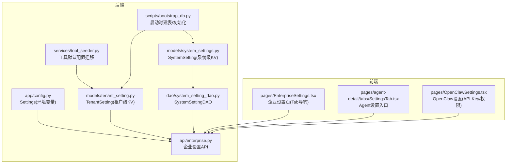
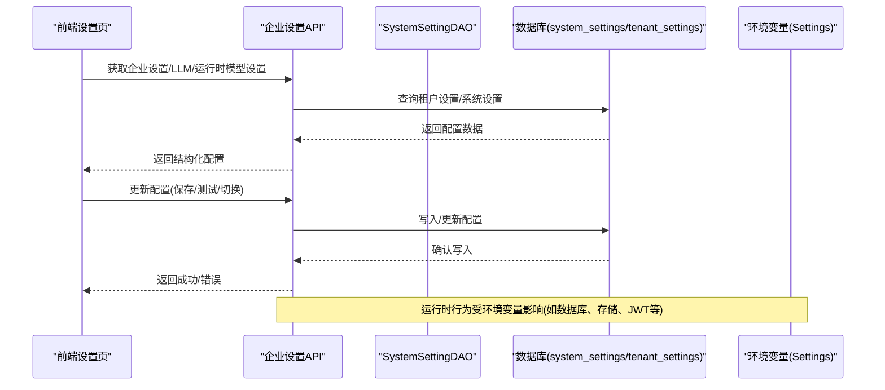
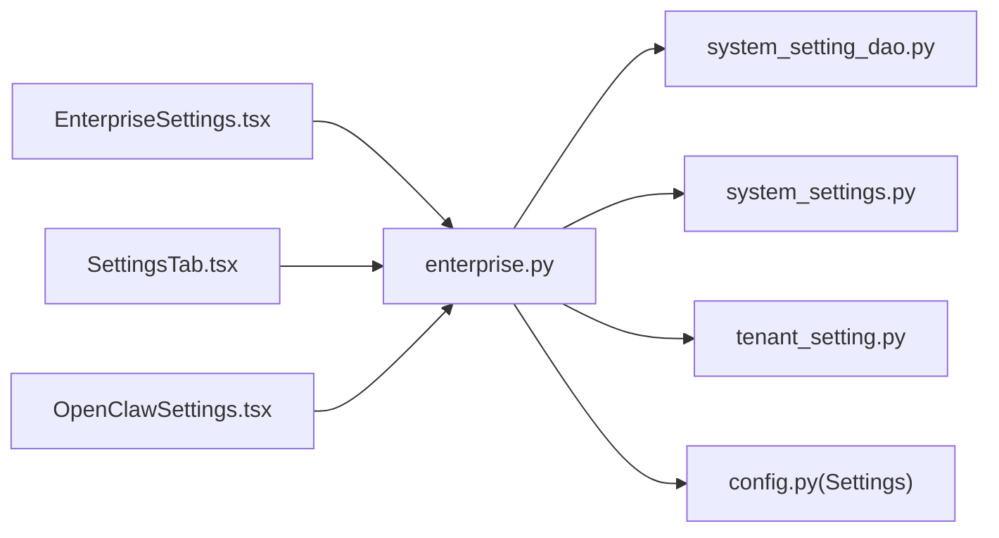

# 设置配置标签页

<cite>
**本文引用的文件**   
- [backend/app/config.py](file://backend/app/config.py)
- [backend/app/models/system_settings.py](file://backend/app/models/system_settings.py)
- [backend/app/dao/system_setting_dao.py](file://backend/app/dao/system_setting_dao.py)
- [backend/app/models/tenant_setting.py](file://backend/app/models/tenant_setting.py)
- [backend/app/api/enterprise.py](file://backend/app/api/enterprise.py)
- [frontend/src/pages/EnterpriseSettings.tsx](file://frontend/src/pages/EnterpriseSettings.tsx)
- [frontend/src/pages/agent-detail/tabs/SettingsTab.tsx](file://frontend/src/pages/agent-detail/tabs/SettingsTab.tsx)
- [frontend/src/pages/OpenClawSettings.tsx](file://frontend/src/pages/OpenClawSettings.tsx)
- [backend/app/services/tool_seeder.py](file://backend/app/services/tool_seeder.py)
- [backend/app/scripts/bootstrap_db.py](file://backend/app/scripts/bootstrap_db.py)
</cite>

## 目录
1. [简介](#简介)
2. [项目结构](#项目结构)
3. [核心组件](#核心组件)
4. [架构总览](#架构总览)
5. [详细组件分析](#详细组件分析)
6. [依赖关系分析](#依赖关系分析)
7. [性能考虑](#性能考虑)
8. [故障排查指南](#故障排查指南)
9. [结论](#结论)
10. [附录](#附录)

## 简介
本文件面向“设置配置标签页”的完整说明，覆盖以下能力：
- 基础信息编辑、运行参数配置、环境变量设置
- 配置项的分类组织与验证规则
- 配置的导入导出与备份恢复机制
- 配置模板与批量操作实现方法
- 配置变更的历史记录与回滚功能

该文档基于后端配置模型、企业级设置 API、前端设置页面以及工具与运行时相关配置进行系统化梳理，帮助开发者与运维人员准确理解并正确使用系统与企业租户的配置体系。

## 项目结构
从代码库可见，设置配置相关的能力分布在后端模型、DAO、API 与前端的多个文件中：
- 系统级键值设置：system_settings 表与 DAO
- 租户级键值设置：tenant_settings 表
- 应用与环境变量：Settings 类（pydantic BaseSettings）
- 企业级设置 API：LLM、权限、审计、系统邮件等
- 前端设置页：企业设置、Agent 设置、OpenClaw 设置

图表来源
- [backend/app/config.py:79-122](file://backend/app/config.py#L79-L122)
- [backend/app/models/system_settings.py:1-21](file://backend/app/models/system_settings.py#L1-L21)
- [backend/app/models/tenant_setting.py:1-31](file://backend/app/models/tenant_setting.py#L1-L31)
- [backend/app/dao/system_setting_dao.py:1-44](file://backend/app/dao/system_setting_dao.py#L1-L44)
- [backend/app/api/enterprise.py:1-200](file://backend/app/api/enterprise.py#L1-L200)
- [frontend/src/pages/EnterpriseSettings.tsx:101-130](file://frontend/src/pages/EnterpriseSettings.tsx#L101-L130)
- [frontend/src/pages/agent-detail/tabs/SettingsTab.tsx:46-76](file://frontend/src/pages/agent-detail/tabs/SettingsTab.tsx#L46-L76)
- [frontend/src/pages/OpenClawSettings.tsx:1-404](file://frontend/src/pages/OpenClawSettings.tsx#L1-L404)
- [backend/app/services/tool_seeder.py:326-351](file://backend/app/services/tool_seeder.py#L326-L351)
- [backend/app/scripts/bootstrap_db.py:1-35](file://backend/app/scripts/bootstrap_db.py#L1-L35)

章节来源
- [backend/app/config.py:79-122](file://backend/app/config.py#L79-L122)
- [backend/app/models/system_settings.py:1-21](file://backend/app/models/system_settings.py#L1-L21)
- [backend/app/models/tenant_setting.py:1-31](file://backend/app/models/tenant_setting.py#L1-L31)
- [backend/app/dao/system_setting_dao.py:1-44](file://backend/app/dao/system_setting_dao.py#L1-L44)
- [backend/app/api/enterprise.py:1-200](file://backend/app/api/enterprise.py#L1-L200)
- [frontend/src/pages/EnterpriseSettings.tsx:101-130](file://frontend/src/pages/EnterpriseSettings.tsx#L101-L130)
- [frontend/src/pages/agent-detail/tabs/SettingsTab.tsx:46-76](file://frontend/src/pages/agent-detail/tabs/SettingsTab.tsx#L46-L76)
- [frontend/src/pages/OpenClawSettings.tsx:1-404](file://frontend/src/pages/OpenClawSettings.tsx#L1-L404)
- [backend/app/services/tool_seeder.py:326-351](file://backend/app/services/tool_seeder.py#L326-L351)
- [backend/app/scripts/bootstrap_db.py:1-35](file://backend/app/scripts/bootstrap_db.py#L1-L35)

## 核心组件
- 环境变量与应用设置（Settings）
  - 通过 pydantic BaseSettings 加载环境变量，涵盖数据库、Redis、JWT、存储、进程角色等关键配置。
  - 典型字段包括 APP_NAME、DEBUG、DATABASE_URL、REDIS_URL、JWT_*、STORAGE_*、PROCESS_ROLE 等。
- 系统级键值设置（SystemSetting）
  - 以 key-value(JSONB) 形式存储平台级开关或全局配置，如邀请码启用、SSO 自定义域名重定向等。
- 租户级键值设置（TenantSetting）
  - 按租户隔离的键值存储，用于存放各租户的个性化配置（例如第三方集成密钥、公司信息等）。
- 企业设置 API（enterprise.py）
  - 提供 LLM 提供商列表、测试连接、运行时模型设置、系统邮件测试等接口，支撑前端企业设置页。
- 前端设置页
  - EnterpriseSettings.tsx：企业级 Tab 导航（信息、LLM、工具、技能、OKR、邀请、配额、用户、组织、审批、审计）。
  - SettingsTab.tsx：Agent 详情页的设置入口，根据 Agent 类型路由到 OpenClaw 设置或其他设置。
  - OpenClawSettings.tsx：OpenClaw Agent 的 API Key 管理、访问权限范围与级别控制、删除确认等。

章节来源
- [backend/app/config.py:79-122](file://backend/app/config.py#L79-L122)
- [backend/app/models/system_settings.py:1-21](file://backend/app/models/system_settings.py#L1-L21)
- [backend/app/models/tenant_setting.py:1-31](file://backend/app/models/tenant_setting.py#L1-L31)
- [backend/app/dao/system_setting_dao.py:1-44](file://backend/app/dao/system_setting_dao.py#L1-L44)
- [backend/app/api/enterprise.py:1-200](file://backend/app/api/enterprise.py#L1-L200)
- [frontend/src/pages/EnterpriseSettings.tsx:101-130](file://frontend/src/pages/EnterpriseSettings.tsx#L101-L130)
- [frontend/src/pages/agent-detail/tabs/SettingsTab.tsx:46-76](file://frontend/src/pages/agent-detail/tabs/SettingsTab.tsx#L46-L76)
- [frontend/src/pages/OpenClawSettings.tsx:1-404](file://frontend/src/pages/OpenClawSettings.tsx#L1-L404)

## 架构总览
下图展示了“设置配置标签页”的整体交互流程：前端通过企业设置页与 Agent 设置页发起请求，后端通过 enterprise API 处理配置读取与更新；系统级与租户级设置分别由 SystemSettingDAO 与 TenantSetting 模型持久化；环境变量通过 Settings 注入运行时。

图表来源
- [backend/app/api/enterprise.py:1-200](file://backend/app/api/enterprise.py#L1-L200)
- [backend/app/dao/system_setting_dao.py:1-44](file://backend/app/dao/system_setting_dao.py#L1-L44)
- [backend/app/models/system_settings.py:1-21](file://backend/app/models/system_settings.py#L1-L21)
- [backend/app/models/tenant_setting.py:1-31](file://backend/app/models/tenant_setting.py#L1-L31)
- [backend/app/config.py:79-122](file://backend/app/config.py#L79-L122)

## 详细组件分析

### 环境变量与运行参数（Settings）
- 分类组织
  - 应用基础：APP_NAME、APP_VERSION、DEBUG、SECRET_KEY、API_PREFIX
  - 数据库：DATABASE_URL、DATABASE_AUTO_CREATE_TABLES
  - Redis：REDIS_URL、INSTANCE_ID
  - JWT：JWT_SECRET_KEY、JWT_ALGORITHM、过期时间、邮箱验证策略
  - 存储：STORAGE_BACKEND、本地根路径、S3 相关参数
  - 进程角色：PROCESS_ROLE
- 验证规则
  - 使用 pydantic BaseSettings 自动校验类型与必填项
  - 默认值提供安全基线（如 SECRET_KEY、JWT_SECRET_KEY）
- 使用方式
  - 通过 get_settings() 在运行时获取，供服务层与中间件使用

章节来源
- [backend/app/config.py:79-122](file://backend/app/config.py#L79-L122)

### 系统级键值设置（SystemSetting + SystemSettingDAO）
- 数据结构
  - key: 字符串主键
  - value: JSONB 字典
  - updated_at: 更新时间戳
- 常用能力
  - 按 key 取值与默认值回退
  - 布尔开关封装（如邀请码启用、SSO 自定义域名重定向）
- 适用场景
  - 平台级开关、全局特性标志、跨租户统一策略

章节来源
- [backend/app/models/system_settings.py:1-21](file://backend/app/models/system_settings.py#L1-L21)
- [backend/app/dao/system_setting_dao.py:1-44](file://backend/app/dao/system_setting_dao.py#L1-L44)

### 租户级键值设置（TenantSetting）
- 数据结构
  - tenant_id: UUID 外键关联租户
  - key: 字符串主键
  - value: JSONB 字典
  - updated_at: 更新时间戳
- 适用场景
  - 租户专属配置（如第三方集成密钥、公司信息、渠道配置）
- 迁移与兼容
  - 工具种子脚本会将旧的全局工具配置迁移至首个租户的 tenant_settings，避免新租户继承敏感数据

章节来源
- [backend/app/models/tenant_setting.py:1-31](file://backend/app/models/tenant_setting.py#L1-L31)
- [backend/app/services/tool_seeder.py:326-351](file://backend/app/services/tool_seeder.py#L326-L351)

### 企业设置 API（enterprise.py）
- 主要能力
  - 列出支持的 LLM 提供商与能力
  - 测试 LLM 连接（支持已存模型或草稿配置）
  - 获取/更新租户范围的 Group Runtime 模型设置
  - 系统邮件测试（SMTP 配置验证）
- 权限与安全
  - 管理员/平台管理员鉴权
  - 租户边界校验，防止越权修改其他租户配置
- 前端对接
  - 企业设置页通过 Tab 切换不同配置域，调用对应 API

章节来源
- [backend/app/api/enterprise.py:1-200](file://backend/app/api/enterprise.py#L1-L200)
- [frontend/src/pages/EnterpriseSettings.tsx:101-130](file://frontend/src/pages/EnterpriseSettings.tsx#L101-L130)

### 前端设置页（EnterpriseSettings / SettingsTab / OpenClawSettings）
- EnterpriseSettings.tsx
  - Tab 导航：info、llm、tools、skills、okr、invites、quotas、users、org、approvals、audit
  - URL hash 同步 activeTab，支持浏览器前进后退
  - 多租户选择状态与刷新
- SettingsTab.tsx
  - 根据 Agent 类型（如 openclaw）路由到具体设置组件
- OpenClawSettings.tsx
  - API Key 生成/重新生成/复制
  - 访问权限范围（公司/私有/自定义）与访问级别（use/manage）
  - 危险操作（删除 Agent）二次确认

章节来源
- [frontend/src/pages/EnterpriseSettings.tsx:101-130](file://frontend/src/pages/EnterpriseSettings.tsx#L101-L130)
- [frontend/src/pages/agent-detail/tabs/SettingsTab.tsx:46-76](file://frontend/src/pages/agent-detail/tabs/SettingsTab.tsx#L46-L76)
- [frontend/src/pages/OpenClawSettings.tsx:1-404](file://frontend/src/pages/OpenClawSettings.tsx#L1-L404)

### 配置导入导出与备份恢复
- 现状分析
  - 代码库未提供统一的“配置导入/导出”API 或 UI 入口
  - 可通过系统级与租户级键值表进行手工备份/恢复（导出 JSON 后导入）
- 建议实现
  - 新增 API：GET /enterprise/settings/export、POST /enterprise/settings/import
  - 前端增加“导出当前租户/系统配置”和“导入配置”按钮
  - 导入前执行 schema 校验与冲突检测（key 重复、value 格式）
  - 导入过程事务化，失败回滚，确保一致性

[本节为概念性说明，不直接分析具体文件]

### 配置模板与批量操作
- 现状分析
  - 工具种子脚本将内置工具的默认配置迁移到首个租户，体现“模板化”思想
  - 未提供通用的“批量设置模板”UI/API
- 建议实现
  - 定义配置模板结构（JSON Schema），包含字段名、类型、默认值、条件必填
  - 提供批量导入接口，支持按租户批量应用模板
  - 前端提供模板选择与预览，支持差异对比与合并策略

章节来源
- [backend/app/services/tool_seeder.py:326-351](file://backend/app/services/tool_seeder.py#L326-L351)

### 配置变更历史记录与回滚
- 现状分析
  - system_settings 与 tenant_settings 仅记录 updated_at，无版本历史
  - 未实现配置变更审计与回滚
- 建议实现
  - 新增配置历史表（tenant_id/key/version/value/diff/created_by/created_at）
  - 每次更新写入新版本，保留 diff 快照
  - 提供“查看历史”、“回滚到指定版本”API
  - 前端展示历史列表与一键回滚

[本节为概念性说明，不直接分析具体文件]

## 依赖关系分析
- 组件耦合
  - 前端设置页依赖 enterprise API
  - enterprise API 依赖 DAO 与 ORM 模型（SystemSetting/TenantSetting）
  - Settings（环境变量）被服务层与中间件广泛使用
- 外部依赖
  - 数据库（PostgreSQL）、Redis、对象存储（本地/S3）
  - LLM 提供商（OpenAI、Anthropic 等）
- 潜在循环依赖
  - 未发现明显循环导入，但需注意服务层对 DAO 与模型的解耦

图表来源
- [frontend/src/pages/EnterpriseSettings.tsx:101-130](file://frontend/src/pages/EnterpriseSettings.tsx#L101-L130)
- [frontend/src/pages/agent-detail/tabs/SettingsTab.tsx:46-76](file://frontend/src/pages/agent-detail/tabs/SettingsTab.tsx#L46-L76)
- [frontend/src/pages/OpenClawSettings.tsx:1-404](file://frontend/src/pages/OpenClawSettings.tsx#L1-L404)
- [backend/app/api/enterprise.py:1-200](file://backend/app/api/enterprise.py#L1-L200)
- [backend/app/dao/system_setting_dao.py:1-44](file://backend/app/dao/system_setting_dao.py#L1-L44)
- [backend/app/models/system_settings.py:1-21](file://backend/app/models/system_settings.py#L1-L21)
- [backend/app/models/tenant_setting.py:1-31](file://backend/app/models/tenant_setting.py#L1-L31)
- [backend/app/config.py:79-122](file://backend/app/config.py#L79-L122)

章节来源
- [backend/app/api/enterprise.py:1-200](file://backend/app/api/enterprise.py#L1-L200)
- [backend/app/dao/system_setting_dao.py:1-44](file://backend/app/dao/system_setting_dao.py#L1-L44)
- [backend/app/models/system_settings.py:1-21](file://backend/app/models/system_settings.py#L1-L21)
- [backend/app/models/tenant_setting.py:1-31](file://backend/app/models/tenant_setting.py#L1-L31)
- [backend/app/config.py:79-122](file://backend/app/config.py#L79-L122)

## 性能考虑
- 配置读取
  - 系统级与租户级设置为 JSONB 查询，建议在 key 上建立索引以提升检索性能
- 配置更新
  - 批量导入应使用事务与分批提交，避免长事务锁表
- 缓存策略
  - 可引入 Redis 缓存热点配置，设置合理 TTL 与失效策略
- 前端优化
  - 按需加载 Tab 内容，减少初始渲染压力
  - 使用 React Query 缓存与增量更新，降低重复请求

[本节为通用指导，不直接分析具体文件]

## 故障排查指南
- 常见问题
  - 环境变量缺失或类型错误导致启动失败（检查 Settings 默认值与必填项）
  - 数据库连接失败（检查 DATABASE_URL、权限与网络）
  - Redis 不可用（检查 REDIS_URL 与实例可达性）
  - JWT 配置错误导致认证失败（检查 JWT_SECRET_KEY、ALGORITHM、过期时间）
  - 存储后端不可用（检查 STORAGE_BACKEND 与 S3 配置）
- 排查步骤
  - 查看服务日志与错误堆栈
  - 使用 enterprise API 的“测试连接”功能验证外部依赖
  - 检查 system_settings 与 tenant_settings 中的关键开关
  - 使用 bootstrap_db 脚本确保表结构与初始数据正确

章节来源
- [backend/app/config.py:79-122](file://backend/app/config.py#L79-L122)
- [backend/app/scripts/bootstrap_db.py:1-35](file://backend/app/scripts/bootstrap_db.py#L1-L35)
- [backend/app/api/enterprise.py:1-200](file://backend/app/api/enterprise.py#L1-L200)

## 结论
“设置配置标签页”围绕环境变量、系统级与租户级键值设置构建，结合企业设置 API 与前端设置页，形成完整的配置管理能力。当前版本已具备基础配置读写与验证，但尚缺统一的导入导出、模板化与历史回滚能力。建议优先实现配置导入导出与历史版本管理，以提升运维效率与安全性。

[本节为总结性内容，不直接分析具体文件]

## 附录
- 配置项分类速览
  - 环境变量：应用、数据库、Redis、JWT、存储、进程角色
  - 系统级设置：平台开关、全局策略
  - 租户级设置：租户专属配置、第三方集成密钥
- 最佳实践
  - 敏感配置使用加密存储（如 API Key）
  - 配置变更需审计与回滚
  - 批量操作需幂等与事务保障
  - 前端提供清晰的用户提示与错误反馈

[本节为补充信息，不直接分析具体文件]