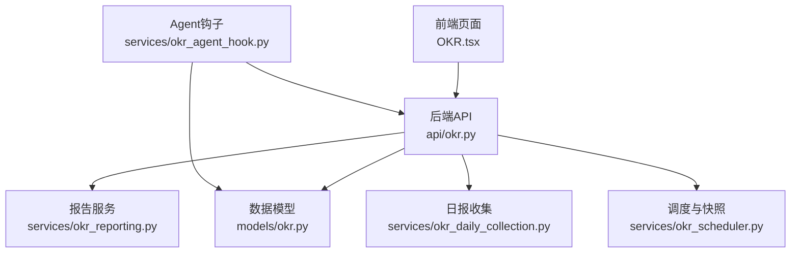
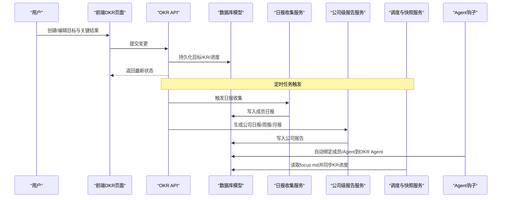
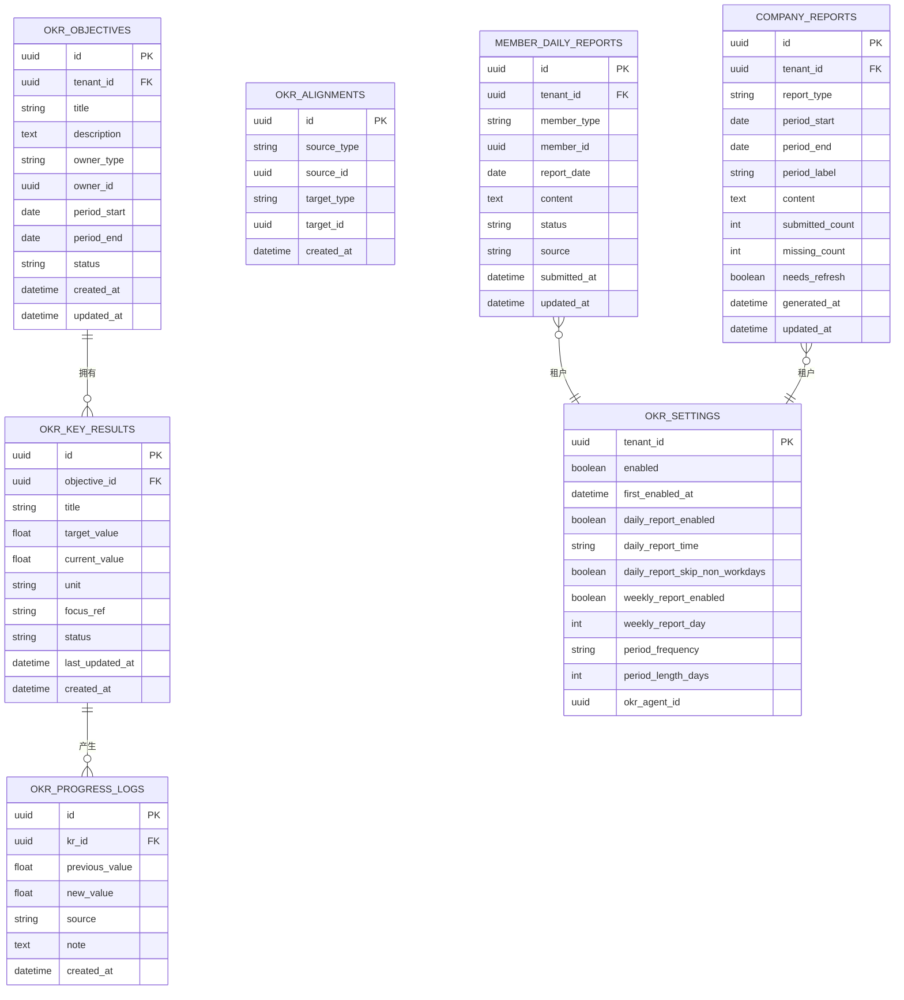
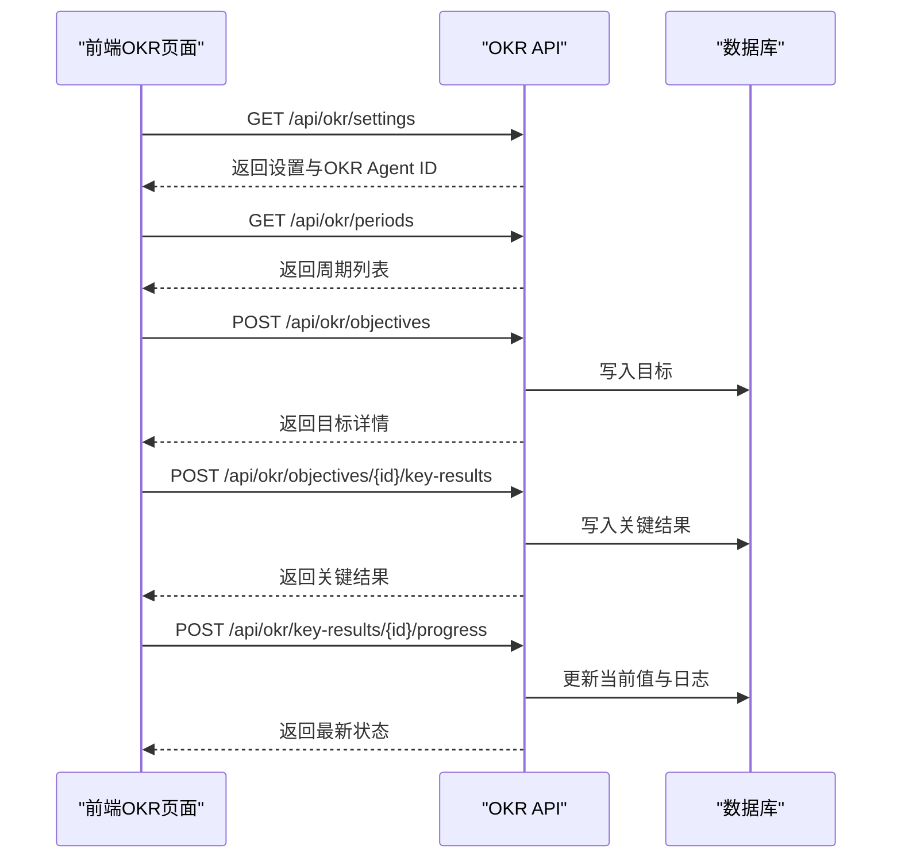
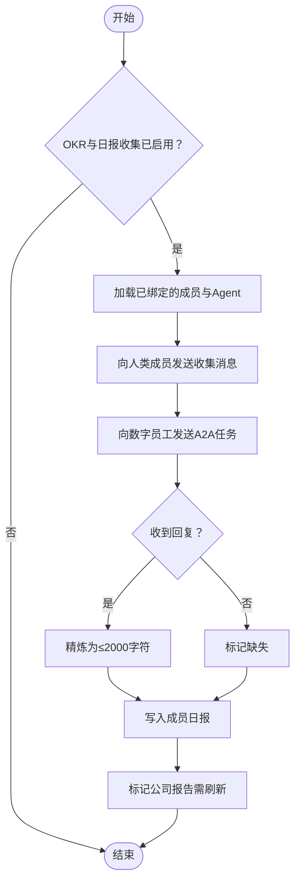
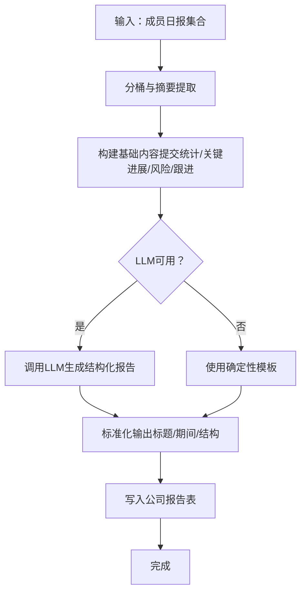
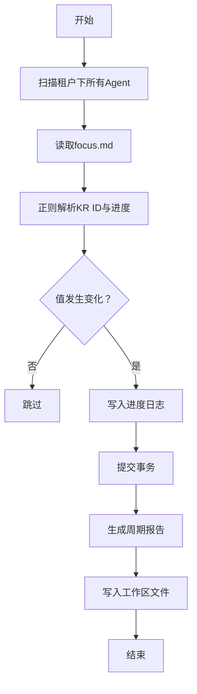
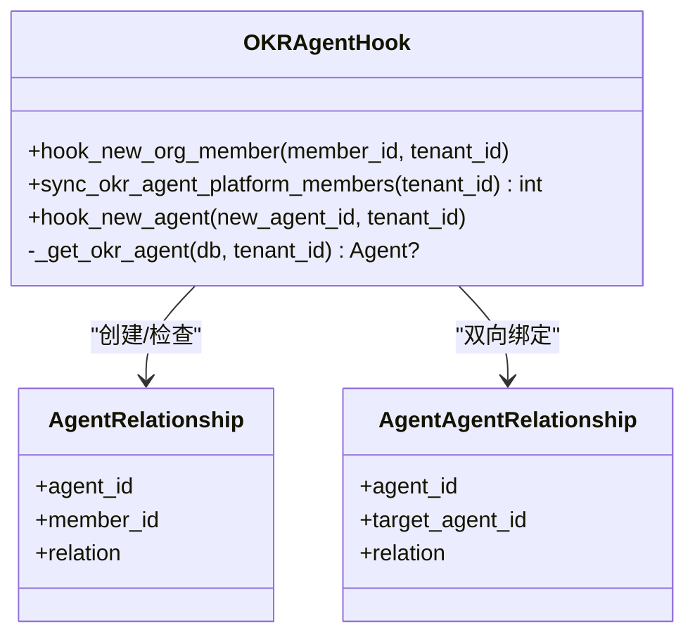
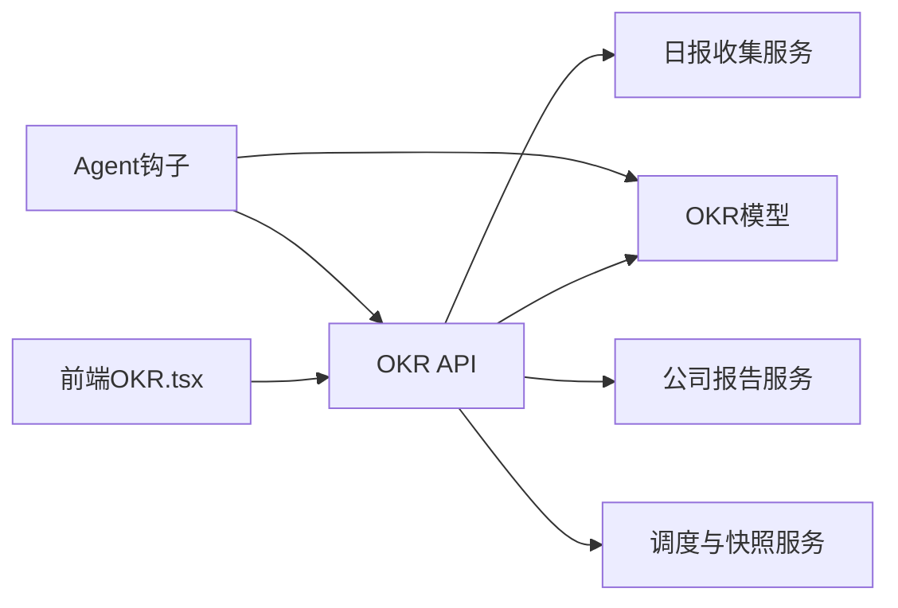

# OKR目标管理

<cite>
**本文引用的文件**   
- [backend/app/models/okr.py](file://backend/app/models/okr.py)
- [backend/app/api/okr.py](file://backend/app/api/okr.py)
- [frontend/src/pages/OKR.tsx](file://frontend/src/pages/OKR.tsx)
- [backend/app/services/okr_reporting.py](file://backend/app/services/okr_reporting.py)
- [backend/app/services/okr_daily_collection.py](file://backend/app/services/okr_daily_collection.py)
- [backend/app/services/okr_scheduler.py](file://backend/app/services/okr_scheduler.py)
- [backend/app/services/okr_agent_hook.py](file://backend/app/services/okr_agent_hook.py)
</cite>

## 目录
1. [简介](#简介)
2. [项目结构](#项目结构)
3. [核心组件](#核心组件)
4. [架构总览](#架构总览)
5. [详细组件分析](#详细组件分析)
6. [依赖关系分析](#依赖关系分析)
7. [性能与扩展性](#性能与扩展性)
8. [故障排查指南](#故障排查指南)
9. [结论](#结论)
10. [附录：操作手册与最佳实践](#附录操作手册与最佳实践)

## 简介
本指南面向使用本系统的团队与管理者，系统化说明OKR目标的创建、编辑、跟踪与评估流程，覆盖目标设定、关键结果定义、进度更新、定期报告生成等能力。同时详解OKR与Agent的集成方式，包括自动数据收集、智能分析与报告生成等高级特性，并提供团队协作与落地最佳实践。

## 项目结构
OKR功能由“前端页面 + 后端API + 数据模型 + 服务层（日报收集、公司级报告、调度）+ Agent钩子”组成，形成端到端闭环。

图表来源
- [backend/app/api/okr.py](file://backend/app/api/okr.py)
- [backend/app/models/okr.py](file://backend/app/models/okr.py)
- [backend/app/services/okr_reporting.py](file://backend/app/services/okr_reporting.py)
- [backend/app/services/okr_daily_collection.py](file://backend/app/services/okr_daily_collection.py)
- [backend/app/services/okr_scheduler.py](file://backend/app/services/okr_scheduler.py)
- [backend/app/services/okr_agent_hook.py](file://backend/app/services/okr_agent_hook.py)

章节来源
- [backend/app/models/okr.py](file://backend/app/models/okr.py)
- [backend/app/api/okr.py](file://backend/app/api/okr.py)
- [frontend/src/pages/OKR.tsx](file://frontend/src/pages/OKR.tsx)

## 核心组件
- 数据模型
  - 目标与关键结果：OKRObjective、OKRKeyResult
  - 对齐关系：OKRAlignment
  - 进度日志：OKRProgressLog
  - 工作/成员/公司报告：WorkReport、MemberDailyReport、CompanyReport
  - 租户配置：OKRSettings（开关、周期、日报时间等）
- API接口
  - 设置、周期、目标、关键结果、进度更新、报告查询与触发
- 服务层
  - 日报收集：向被追踪成员发送提醒并汇总回复
  - 公司级报告：基于成员日报聚合生成日/周/月报告
  - 调度与快照：解析Agent focus.md自动同步KR进度，生成结构化报告
- 前端界面
  - 周期选择、目标/KR创建与编辑、内联进度更新、状态标记、报告查看
- Agent集成
  - 自动绑定新成员/Agent到OKR Agent
  - 定时触发收集与报告生成
  - 通过工具调用写入数据库与存储

章节来源
- [backend/app/models/okr.py](file://backend/app/models/okr.py)
- [backend/app/api/okr.py](file://backend/app/api/okr.py)
- [backend/app/services/okr_reporting.py](file://backend/app/services/okr_reporting.py)
- [backend/app/services/okr_daily_collection.py](file://backend/app/services/okr_daily_collection.py)
- [backend/app/services/okr_scheduler.py](file://backend/app/services/okr_scheduler.py)
- [backend/app/services/okr_agent_hook.py](file://backend/app/services/okr_agent_hook.py)
- [frontend/src/pages/OKR.tsx](file://frontend/src/pages/OKR.tsx)

## 架构总览
下图展示从用户操作到数据落库、再到报告生成的完整链路。

图表来源
- [backend/app/api/okr.py](file://backend/app/api/okr.py)
- [backend/app/models/okr.py](file://backend/app/models/okr.py)
- [backend/app/services/okr_reporting.py](file://backend/app/services/okr_reporting.py)
- [backend/app/services/okr_daily_collection.py](file://backend/app/services/okr_daily_collection.py)
- [backend/app/services/okr_scheduler.py](file://backend/app/services/okr_scheduler.py)
- [backend/app/services/okr_agent_hook.py](file://backend/app/services/okr_agent_hook.py)

## 详细组件分析

### 数据模型与关系
- 目标与关键结果
  - 目标支持公司/用户/Agent三种所有者类型，具备周期与生命周期状态
  - 关键结果包含目标值、当前值、单位、状态与最后更新时间
- 对齐关系
  - 多对多关系，支持目标或关键结果之间的上下级/平级对齐
- 进度日志
  - 记录每次关键结果数值变化，支持审计与可视化
- 报告体系
  - 成员日报：最终精简版内容，限制长度，标注提交状态
  - 公司报告：按日/周/月聚合，含提交统计与刷新标记
- 配置项
  - 租户级开关、首次启用锁定周期、日报/周报策略、周期频率与长度、关联OKR Agent

图表来源
- [backend/app/models/okr.py](file://backend/app/models/okr.py)

章节来源
- [backend/app/models/okr.py](file://backend/app/models/okr.py)

### API与前端交互
- 设置与周期
  - 获取/更新租户OKR设置；首次启用后周期频率与长度锁定
  - 计算当前周期与历史周期列表
- 目标与关键结果
  - 列出周期内的目标与关键结果，支持按周期过滤
  - 新增/更新目标与关键结果，支持删除归档
- 进度更新
  - 手动更新关键结果当前值，可选状态覆盖与备注
- 报告
  - 查询公司级报告（日/周/月），支持按需刷新

图表来源
- [backend/app/api/okr.py](file://backend/app/api/okr.py)
- [frontend/src/pages/OKR.tsx](file://frontend/src/pages/OKR.tsx)

章节来源
- [backend/app/api/okr.py](file://backend/app/api/okr.py)
- [frontend/src/pages/OKR.tsx](file://frontend/src/pages/OKR.tsx)

### 日报收集与成员上报
- 触发条件
  - 根据OKR设置中的每日收集时间与是否跳过非工作日决定
- 收集对象
  - 已绑定到OKR Agent的人类成员与公司可见Agent
- 收集流程
  - 向人类成员发送平台消息或渠道消息，要求回复进展、风险与下一步
  - 向数字员工发送A2A任务委托，等待结果并精炼为≤2000字符的日报
  - 写入成员日报表，并标记迟到/修订状态
- 影响范围
  - 更新后自动标记相关公司报告需要刷新

图表来源
- [backend/app/services/okr_daily_collection.py](file://backend/app/services/okr_daily_collection.py)
- [backend/app/services/okr_reporting.py](file://backend/app/services/okr_reporting.py)

章节来源
- [backend/app/services/okr_daily_collection.py](file://backend/app/services/okr_daily_collection.py)
- [backend/app/services/okr_reporting.py](file://backend/app/services/okr_reporting.py)

### 公司级报告生成（日/周/月）
- 数据来源
  - 成员日报聚合，去重与分桶处理，风险控制词识别
- 生成策略
  - 优先使用LLM生成结构化Markdown，失败回退到确定性模板
  - 统一标题与期间行，保证输出格式一致
- 存储与刷新
  - 写入公司报告表，记录提交/缺失数量与刷新标记
  - 成员日报变更时自动标记上级报告需要刷新

图表来源
- [backend/app/services/okr_reporting.py](file://backend/app/services/okr_reporting.py)

章节来源
- [backend/app/services/okr_reporting.py](file://backend/app/services/okr_reporting.py)

### 调度与焦点文件自动同步
- 焦点文件机制
  - 每个Agent可在workspace中维护focus.md，包含KR ID与当前进度
  - 调度器解析focus.md，将有效更新写入KR与进度日志
- 报告生成
  - 基于当前周期快照生成日/周/月报告，持久化至数据库与工作区文件
- 错误隔离
  - 单个Agent解析失败不影响整体批处理

图表来源
- [backend/app/services/okr_scheduler.py](file://backend/app/services/okr_scheduler.py)

章节来源
- [backend/app/services/okr_scheduler.py](file://backend/app/services/okr_scheduler.py)

### Agent钩子与关系网络
- 自动绑定
  - 新成员加入或新Agent创建时，自动绑定到系统OKR Agent
  - 启动时回填已有活跃成员到OKR Agent关系网
- 作用
  - 确保日报收集与报告生成能覆盖到正确的成员与数字员工

图表来源
- [backend/app/services/okr_agent_hook.py](file://backend/app/services/okr_agent_hook.py)

章节来源
- [backend/app/services/okr_agent_hook.py](file://backend/app/services/okr_agent_hook.py)

## 依赖关系分析
- 模块耦合
  - API层依赖模型与服务层，服务层之间通过数据库与Agent运行时协作
  - 前端仅通过REST API与后端交互，不直接访问数据库
- 外部依赖
  - LLM用于公司级报告生成（可回退）
  - 存储后端用于工作区文件读写
  - 通道/平台消息用于成员提醒
- 潜在循环依赖
  - 通过分层与函数式调用避免循环；服务层不反向依赖API

图表来源
- [backend/app/api/okr.py](file://backend/app/api/okr.py)
- [backend/app/models/okr.py](file://backend/app/models/okr.py)
- [backend/app/services/okr_reporting.py](file://backend/app/services/okr_reporting.py)
- [backend/app/services/okr_daily_collection.py](file://backend/app/services/okr_daily_collection.py)
- [backend/app/services/okr_scheduler.py](file://backend/app/services/okr_scheduler.py)
- [backend/app/services/okr_agent_hook.py](file://backend/app/services/okr_agent_hook.py)

章节来源
- [backend/app/api/okr.py](file://backend/app/api/okr.py)
- [backend/app/models/okr.py](file://backend/app/models/okr.py)
- [backend/app/services/okr_reporting.py](file://backend/app/services/okr_reporting.py)
- [backend/app/services/okr_daily_collection.py](file://backend/app/services/okr_daily_collection.py)
- [backend/app/services/okr_scheduler.py](file://backend/app/services/okr_scheduler.py)
- [backend/app/services/okr_agent_hook.py](file://backend/app/services/okr_agent_hook.py)

## 性能与扩展性
- 批量与分桶
  - 公司报告生成采用分桶聚合，控制单次处理规模
- 幂等与容错
  - 焦点文件解析与KR更新仅在值变化时写入；单点异常不影响整体批次
- 缓存与回退
  - LLM生成失败自动回退到确定性模板，保障可用性
- 可扩展点
  - 新增报告维度或指标可通过服务层扩展，无需改动API契约
  - 通道/平台消息发送可替换实现以适配不同渠道

[本节为通用指导，不直接分析具体文件]

## 故障排查指南
- 常见问题定位
  - 设置未启用：确认租户OKR设置已开启且首次启用时间正确
  - 周期锁定：首次启用后周期频率与长度不可更改
  - 成员未绑定：检查Agent钩子是否成功绑定成员/Agent到OKR Agent
  - 日报未收集：核对每日收集时间与非工作日跳过策略
  - 报告未生成：查看公司报告needs_refresh标志与成员日报完整性
- 建议步骤
  - 先验证设置与周期，再检查关系绑定，随后观察收集与报告生成日志
  - 若LLM失败，确认回退模板是否生效

章节来源
- [backend/app/api/okr.py](file://backend/app/api/okr.py)
- [backend/app/services/okr_reporting.py](file://backend/app/services/okr_reporting.py)
- [backend/app/services/okr_daily_collection.py](file://backend/app/services/okr_daily_collection.py)
- [backend/app/services/okr_agent_hook.py](file://backend/app/services/okr_agent_hook.py)

## 结论
本系统提供完整的OKR管理能力，涵盖目标与关键结果的建模、进度跟踪、自动化收集与智能报告生成。通过Agent集成，团队可实现低摩擦的协作与持续改进。建议在组织内建立明确的OKR节奏与规范，结合系统能力提升执行效率与透明度。

[本节为总结性内容，不直接分析具体文件]

## 附录：操作手册与最佳实践

### OKR创建与编辑
- 管理员可创建公司级目标，普通成员创建个人目标
- 为目标添加关键结果，明确目标值与单位
- 在周期内维护目标状态与描述

章节来源
- [backend/app/api/okr.py](file://backend/app/api/okr.py)
- [frontend/src/pages/OKR.tsx](file://frontend/src/pages/OKR.tsx)

### 关键结果定义与进度更新
- 关键结果应可量化，单位清晰
- 支持手动更新当前值与状态，可附加备注
- 系统自动计算健康状态（按计划/有风险/落后/已完成）

章节来源
- [backend/app/models/okr.py](file://backend/app/models/okr.py)
- [frontend/src/pages/OKR.tsx](file://frontend/src/pages/OKR.tsx)

### 定期报告与跟踪
- 系统自动生成日/周/月公司报告，支持刷新
- 成员日报由OKR Agent收集并精炼，限制长度以保证可读性
- 报告包含提交统计、关键进展、风险与跟进事项

章节来源
- [backend/app/services/okr_reporting.py](file://backend/app/services/okr_reporting.py)
- [backend/app/services/okr_daily_collection.py](file://backend/app/services/okr_daily_collection.py)

### OKR与Agent集成
- 自动绑定新成员/Agent到OKR Agent，确保覆盖范围
- 通过focus.md自动同步KR进度，减少人工录入
- 定时触发收集与报告生成，降低管理成本

章节来源
- [backend/app/services/okr_agent_hook.py](file://backend/app/services/okr_agent_hook.py)
- [backend/app/services/okr_scheduler.py](file://backend/app/services/okr_scheduler.py)

### 团队协作最佳实践
- 明确OKR周期与责任人，保持目标简洁聚焦
- 关键结果尽量量化，避免模糊指标
- 定期回顾与调整，关注风险项并及时跟进
- 利用系统报告进行复盘与决策

[本节为通用指导，不直接分析具体文件]